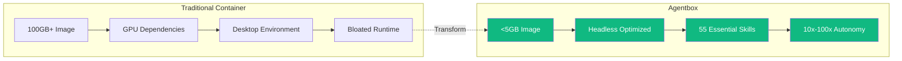
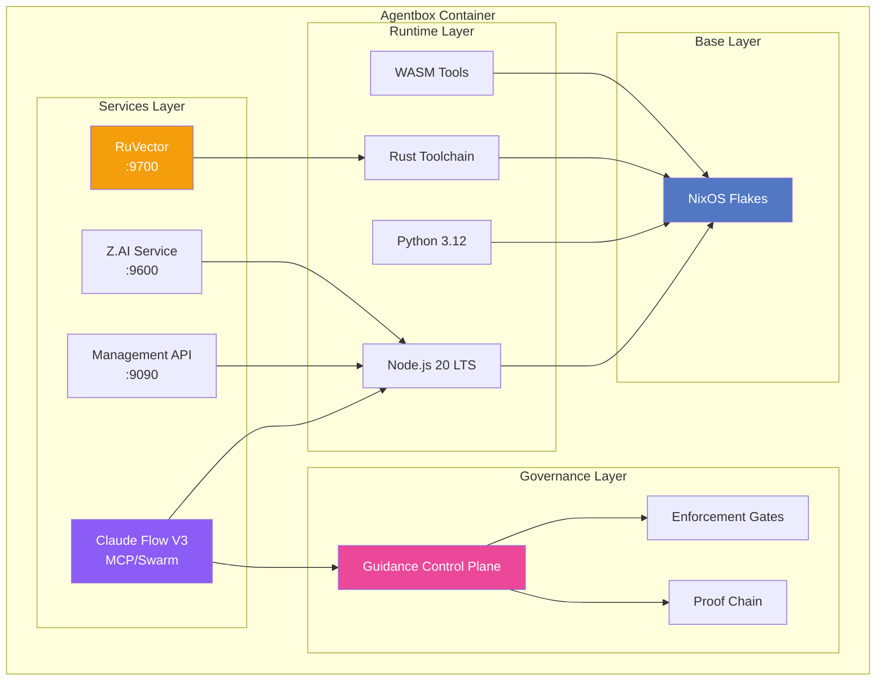
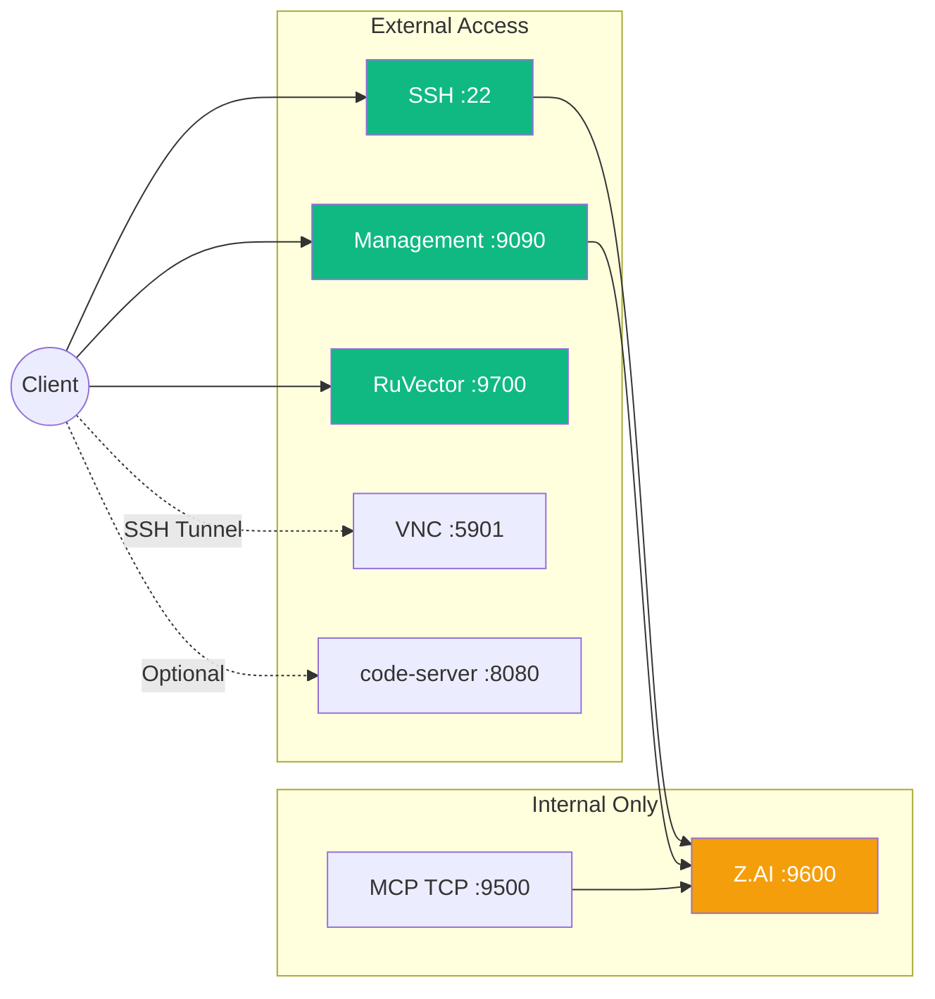
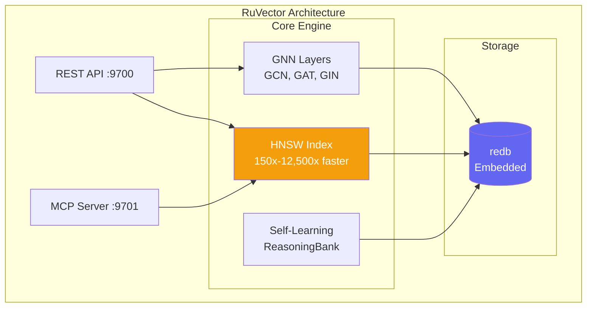
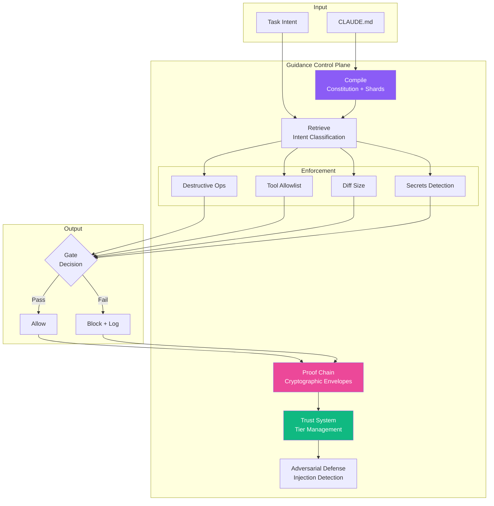
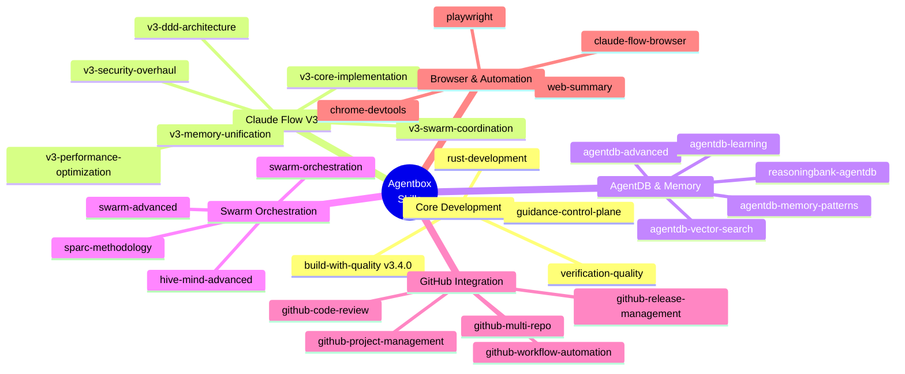
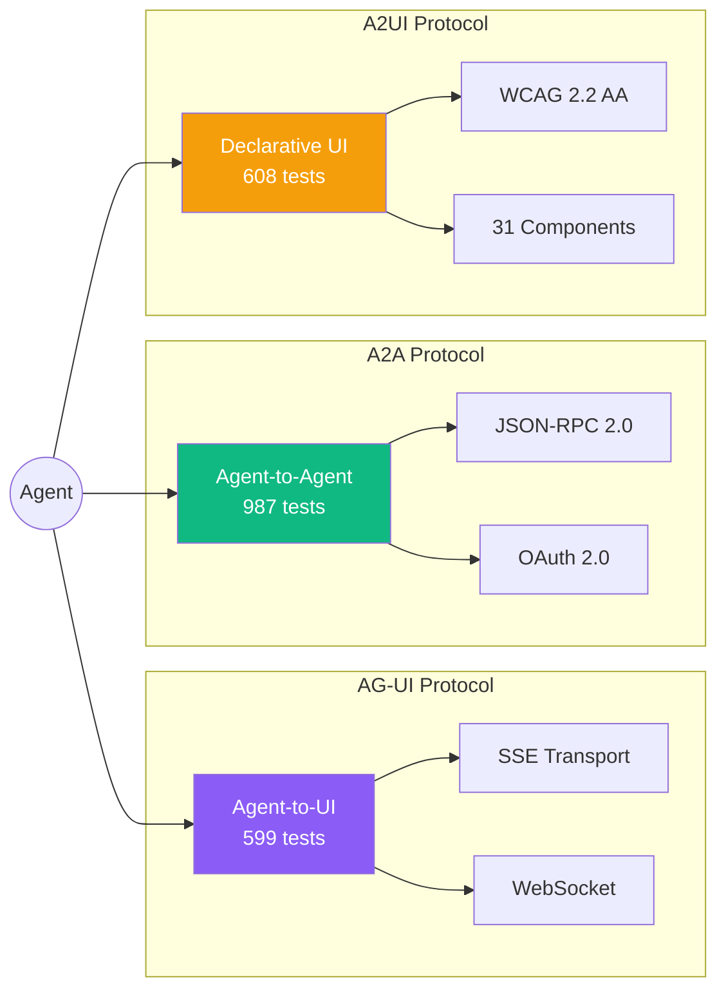
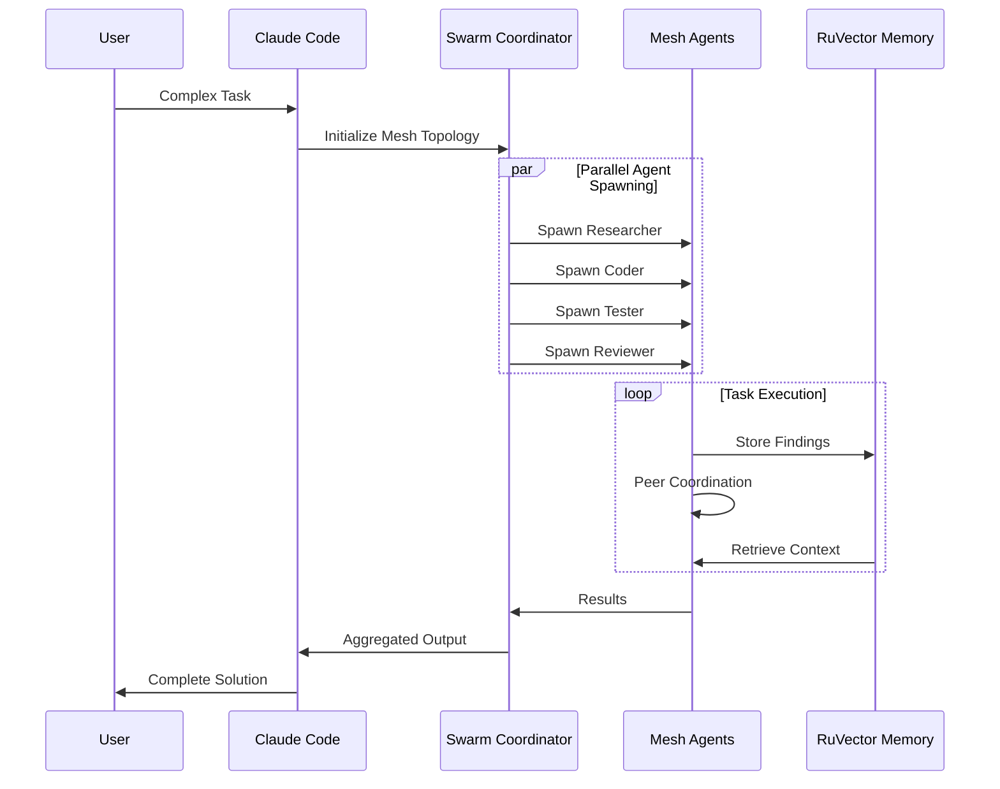
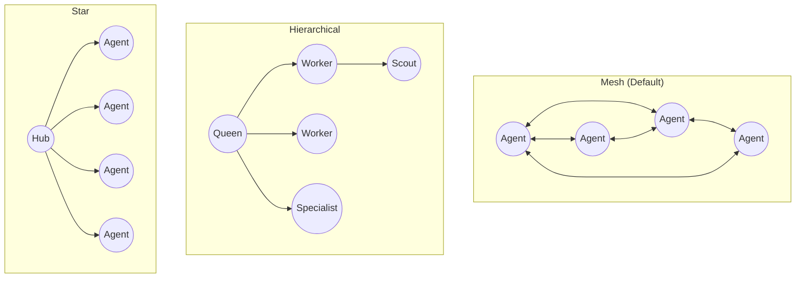

# Agentbox

**Minimal Agentic Container for Claude Flow V3**

[](https://github.com/DreamLab-AI/agentbox)
[](https://nixos.org/)
[](LICENSE)
[](skills/)

A lightweight, reproducible container optimized for headless agentic workloads. Built with NixOS Flakes targeting Oracle Cloud ARM free tier.

## Why Agentbox?



## Architecture



## Quick Start

### Prerequisites

- [Nix](https://nixos.org/download.html) with flakes enabled
- Docker (for running built images)

### Build

```bash
# Clone repository
git clone https://github.com/DreamLab-AI/agentbox.git
cd agentbox

# Build for your architecture
nix build .#runtime      # Headless runtime image
nix build .#full         # Combined full image
nix build .#desktop      # Desktop with VNC

# Load into Docker
docker load < result
```

### Run

```bash
# Start container
docker run -d \
  --name agentbox \
  -p 22:22 \
  -p 9090:9090 \
  -p 9700:9700 \
  agentbox:runtime-aarch64-linux

# Or with docker-compose
docker-compose up -d
```

### Development Shell

```bash
# Enter development environment
nix develop

# All tools available: node, python, rust, wasm-pack, etc.
```

## Services



| Port | Service | Access | Description |
|------|---------|--------|-------------|
| 22 | SSH | Public | Secure shell access |
| 5901 | VNC | SSH Tunnel | Remote desktop (desktop image) |
| 8080 | code-server | Optional | Web IDE |
| 9090 | Management API | Public | Container management |
| 9500 | MCP TCP | Internal | MCP protocol |
| 9600 | Z.AI | Internal | Cost-effective Claude proxy |
| 9700 | RuVector | Public | Vector database API |

## RuVector Vector Database

Standalone Rust-native vector database — **NO PostgreSQL required**.



### Features

- **HNSW Indexing** — 150x-12,500x faster similarity search
- **GNN Layers** — GCN, GraphSAGE, GAT, GIN operations
- **Self-Learning** — ReasoningBank pattern recognition
- **384-dim Embeddings** — all-MiniLM-L6-v2 compatible
- **MCP Integration** — Native Claude Code/Flow support

### Usage

```bash
# Start RuVector server
npx ruvector serve --port 9700 --data-dir /var/lib/ruvector

# Start MCP server for Claude integration
npx ruvector mcp --port 9701

# CLI operations
npx ruvector --help
```

## Guidance Control Plane

Governance backbone enabling **10x-100x extended autonomy**.



### Impact

| Metric | Without | With Control Plane | Improvement |
|--------|---------|-------------------|-------------|
| Autonomy Duration | Minutes | Days to Weeks | **10x-100x** |
| Destructive Actions | Common | Rare | **50-90% reduction** |
| Memory Corruption | Frequent | Blocked | **70-90% reduction** |
| Prompt Injection | Vulnerable | Detected | **80-95% reduction** |

## Skills (55)



### Protocol Support (v3.4.0)



## Swarm Orchestration



### Topologies



## Target Platform

Optimized for **Oracle Cloud Free Tier ARM Ampere A1**:

| Resource | Allocation |
|----------|------------|
| CPU | 4 ARM cores |
| RAM | 24 GB |
| Storage | 200 GB |
| Cost | **Free** |

## VNC Remote Desktop

The desktop image includes minimal VNC via SSH tunnel:

```bash
# Build desktop image
nix build .#desktop

# Run container
docker run -d --name agentbox -p 22:22 agentbox:desktop-aarch64-linux

# Start VNC services
docker exec agentbox supervisorctl start vnc:*

# Create SSH tunnel (from local machine)
ssh -L 5901:localhost:5901 devuser@<host>

# Connect VNC client to localhost:5901
```

Components: Xvfb + x11vnc + openbox (~150MB overhead)

## Not Included

Intentionally excluded for minimal footprint:

| Excluded | Reason |
|----------|--------|
| GPU/CUDA | No NVIDIA dependencies |
| Desktop Environment | Headless only |
| ComfyUI | Use separate container |
| Blender/QGIS/KiCAD | GUI applications |
| Full LaTeX | Use external service |
| PyTorch GPU | CPU-only inference |

## Documentation

| Document | Description |
|----------|-------------|
| [CLAUDE.md](CLAUDE.md) | Project configuration |
| [docs/guides/](docs/guides/) | How-to guides |
| [docs/adr/](docs/adr/) | Architecture decisions |
| [docs/reference/](docs/reference/) | API reference |

## Contributing

1. Fork the repository
2. Create a feature branch
3. Make changes following ADR guidelines
4. Submit a pull request

## License

MIT License — See [LICENSE](LICENSE) for details.

---

<p align="center">
  Built with NixOS Flakes for reproducibility<br/>
  Designed for Oracle Cloud ARM free tier<br/>
  Powered by Claude Flow V3
</p>
