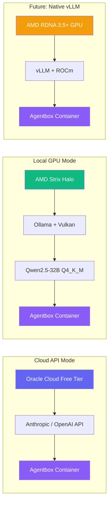
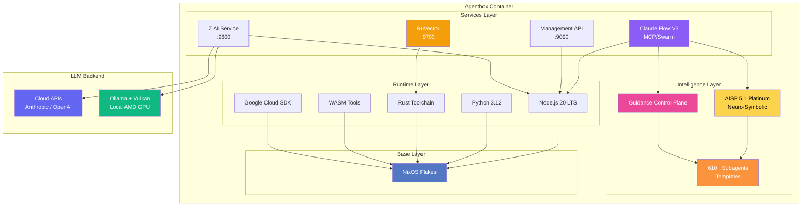
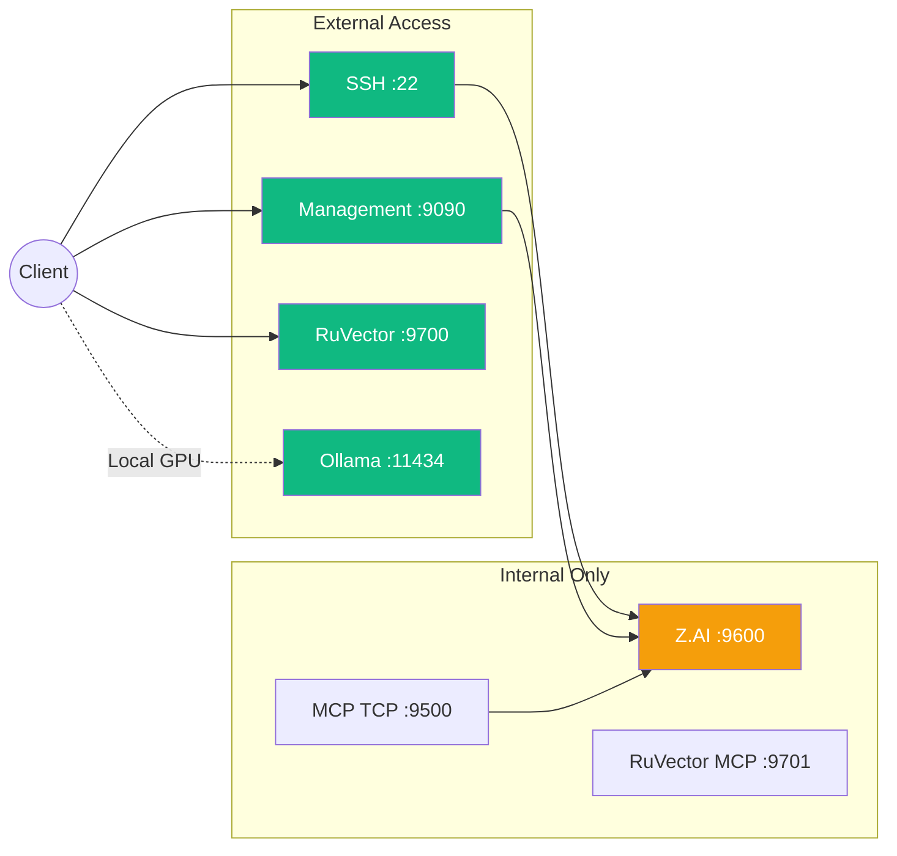
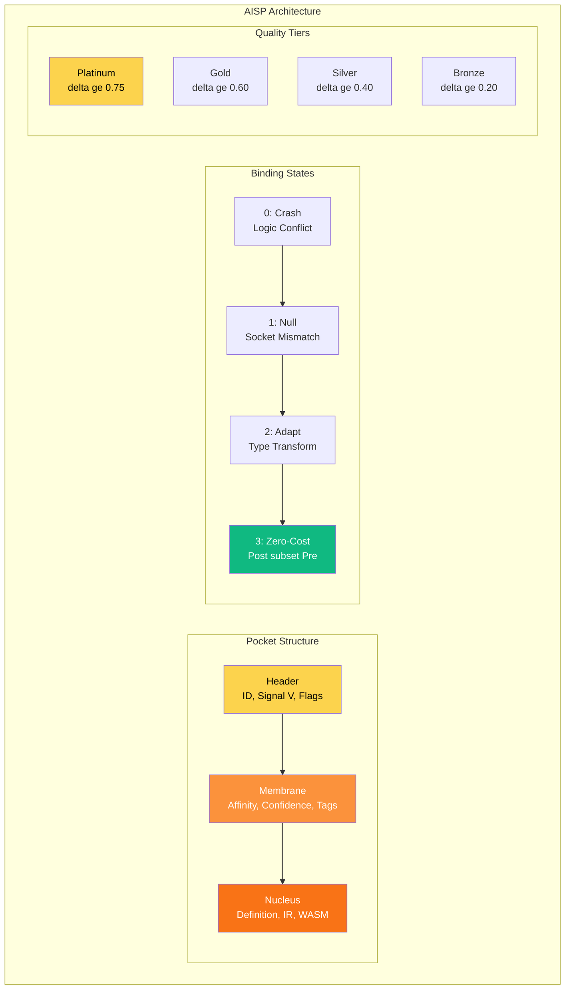
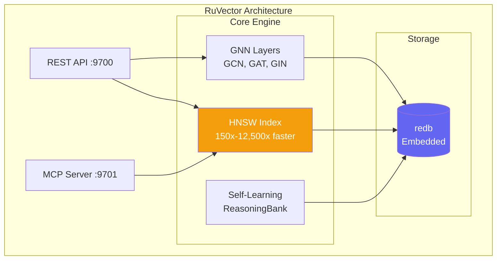
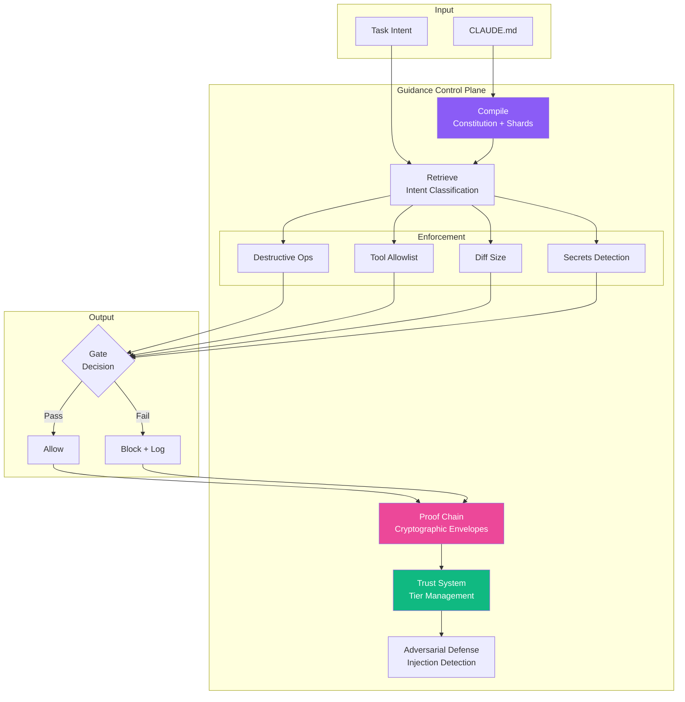
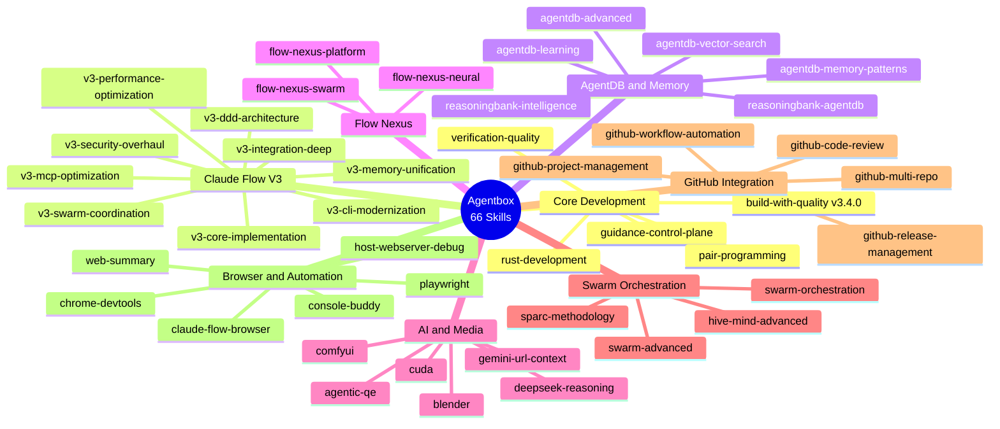
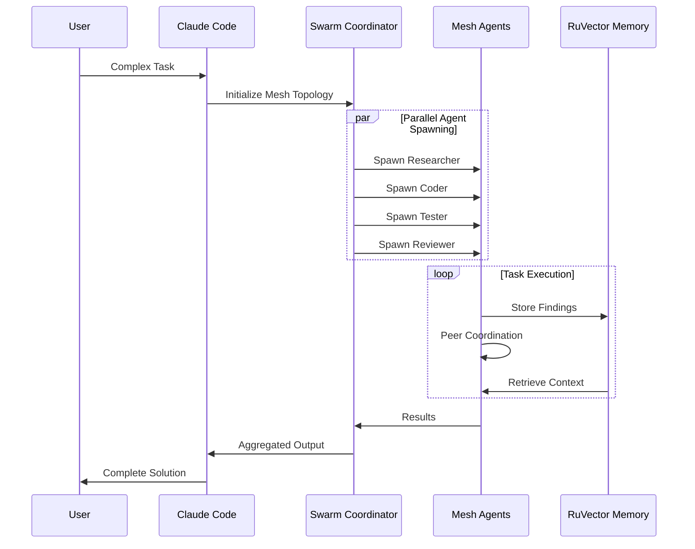
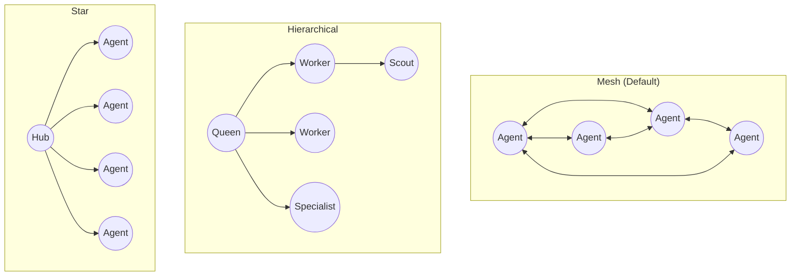

# Agentbox

**Minimal Agentic Container for Claude Flow V3 — with Local LLM Support**

[](https://github.com/DreamLab-AI/agentbox)
[](https://nixos.org/)
[](LICENSE)
[](skills/)
[](https://github.com/ChrisRoyse/610ClaudeSubagents)
[](aisp/)

A lightweight, reproducible container optimized for headless agentic workloads. Built with NixOS Flakes, supporting both **cloud API inference** (Oracle Cloud free tier) and **local GPU inference** (AMD Strix Halo via Ollama + Vulkan).

## Deployment Modes



| Mode | Hardware | LLM Backend | Cost | Status |
|------|----------|-------------|------|--------|
| **Cloud API** | Oracle Cloud ARM A1 (free tier) | Anthropic / OpenAI APIs | Free (API costs only) | Stable |
| **Local GPU** | AMD Strix Halo (gfx1151, 32GB VRAM) | Ollama + Vulkan | Free (local hardware) | Stable |
| **Native vLLM** | AMD RDNA 3.5+ with ROCm | vLLM serving | Free (local hardware) | Planned |

---

## Quick Start

### Prerequisites

- [Nix](https://nixos.org/download.html) with flakes enabled
- Docker

### Build the Container Image

```bash
# Clone repository
git clone https://github.com/DreamLab-AI/agentbox.git
cd agentbox

# Enable Nix flakes (if not already)
mkdir -p ~/.config/nix
echo 'experimental-features = nix-command flakes' >> ~/.config/nix/nix.conf

# Build for your architecture
nix build .#runtime      # Headless runtime (~1.4GB)
nix build .#full         # Combined full image
nix build .#desktop      # Desktop with VNC

# Load into Docker
nix run .#runtime.copyToDockerDaemon
```

### Cloud API Mode (Oracle Cloud Free Tier)

For API-based inference with no local GPU required:

```bash
# Configure environment
cp .env.example .env
# Edit .env — set ANTHROPIC_API_KEY and/or OPENAI_API_KEY

# Run agentbox only (no Ollama needed)
docker run -d \
  --name agentbox \
  -p 22:22 \
  -p 9090:9090 \
  -p 9700:9700 \
  --env-file .env \
  -v agentbox-workspace:/home/devuser/workspace \
  -v agentbox-agents:/home/devuser/agents \
  agentbox:runtime-aarch64-linux
```

#### Oracle Cloud Free Tier Resources

| Resource | Allocation |
|----------|------------|
| CPU | 4 ARM Ampere A1 cores |
| RAM | 24 GB |
| Storage | 200 GB |
| Cost | **Free forever** |

### Local GPU Mode (AMD Strix Halo)

For fully local inference on AMD hardware with Ollama and Vulkan:

```bash
# Configure environment for Ollama
cp .env.example .env
# Edit .env — set:
#   OPENAI_API_KEY=ollama
#   OPENAI_BASE_URL=http://host.docker.internal:11434/v1
#   OLLAMA_BASE_URL=http://host.docker.internal:11434
#   OLLAMA_MODEL=qwen2.5:32b-instruct

# Start both Ollama + agentbox
docker compose up -d

# Pull the model (first time only, ~19GB download)
docker exec ollama ollama pull qwen2.5:32b-instruct

# Verify inference
curl -s http://localhost:11434/v1/chat/completions \
  -H "Content-Type: application/json" \
  -d '{"model":"qwen2.5:32b-instruct","messages":[{"role":"user","content":"Hello"}],"max_tokens":50}'
```

#### AMD Strix Halo GPU Details

| Spec | Value |
|------|-------|
| APU | AMD Ryzen AI MAX+ (Strix Halo) |
| GPU | Radeon 8060S (RDNA 3.5, gfx1151) |
| Compute Units | 40 CUs @ up to 2900 MHz |
| VRAM | 32 GB (from 64 GB unified LPDDR5X) |
| Memory Bandwidth | ~212 GB/s |
| LLM Backend | Ollama + **Vulkan** (not ROCm) |
| Model | Qwen2.5-32B-Instruct Q4_K_M (~19 GB) |
| Inference Speed | ~9.6 tokens/second |
| Context Window | 8192 tokens (configurable) |

#### Why Vulkan Instead of ROCm?

The ROCm HIP compute kernels [segfault on gfx1151](https://github.com/ROCm/ROCm/issues/5499) despite ROCm 6.3.3 including gfx1151 code objects. This is a [known upstream issue](https://github.com/ROCm/ROCm/issues/5853) affecting all Strix Halo systems. The Vulkan backend compiles shaders at runtime and works reliably, achieving ~9.6 tok/s on Qwen2.5-32B.

#### Ollama Container Configuration

The `docker-compose.yml` runs Ollama with these optimizations:

```yaml
environment:
  - OLLAMA_VULKAN=1              # Use Vulkan instead of ROCm HIP
  - OLLAMA_FLASH_ATTENTION=true  # Extended context efficiency
  - OLLAMA_KV_CACHE_TYPE=q8_0    # Quantized KV cache (saves VRAM)
  - OLLAMA_CONTEXT_LENGTH=8192   # Sensible default (max 32768)
```

#### Model Sizing Guide (32 GB VRAM)

| Model | Quant | Size | Fits? | Notes |
|-------|-------|------|-------|-------|
| Qwen2.5-32B | Q4_K_M | 19 GB | Yes | Recommended, ~13 GB headroom for KV cache |
| Qwen2.5-32B | Q8_0 | 34 GB | No | Exceeds 32 GB VRAM |
| Qwen2.5-14B | Q4_K_M | 9 GB | Yes | Lighter alternative |
| Qwen2.5-7B | Q8_0 | 8 GB | Yes | Fast, smaller model |

---

## Future: Native vLLM on AMD (Planned)

> **Status:** Waiting for upstream ROCm fixes for gfx1151 (Strix Halo RDNA 3.5).

Once ROCm HIP compute is stable on gfx1151, vLLM will enable:

- **Continuous batching** for higher throughput
- **PagedAttention** for efficient memory management
- **OpenAI-compatible API** with streaming
- **Tensor parallelism** (if multiple GPUs)
- **Speculative decoding** for faster generation

### Prerequisites for vLLM on AMD

1. **ROCm kernel fix** — Linux kernel must include [LR compute fix](https://github.com/ROCm/ROCm/issues/5499) (commit `1fb7107`)
2. **ROCm 6.4+** — Full gfx1151 support with stable HIP kernels
3. **vLLM with ROCm** — Build from source with `AMDGPU_TARGETS=gfx1151`

### Planned Configuration

```bash
# Future: replace Ollama with vLLM
docker run -d --name vllm \
  --device /dev/kfd --device /dev/dri \
  --group-add video --group-add render \
  -p 8000:8000 \
  -e ROCM_VISIBLE_DEVICES=0 \
  vllm/vllm-rocm:latest \
  --model Qwen/Qwen2.5-32B-Instruct-AWQ \
  --quantization awq \
  --max-model-len 8192 \
  --gpu-memory-utilization 0.90

# Agentbox .env changes:
# OPENAI_API_KEY=vllm
# OPENAI_BASE_URL=http://host.docker.internal:8000/v1
```

### Tracking

- [ROCm #5499](https://github.com/ROCm/ROCm/issues/5499) — Ollama instability on Strix Halo
- [ROCm #5853](https://github.com/ROCm/ROCm/issues/5853) — SIGSEGV on gfx1151 VRAM access
- [ROCm #5534](https://github.com/ROCm/ROCm/issues/5534) — ROCm 7.x crashes on gfx1151
- [Ollama #13873](https://github.com/ollama/ollama/issues/13873) — SIGSEGV on Ryzen AI MAX+
- [LLM Tracker: Strix Halo](https://llm-tracker.info/_TOORG/Strix-Halo) — Community status page

---

## Key Features

| Feature | Description |
|---------|-------------|
| **66 Skills** | Core development, Claude Flow V3, AgentDB, Flow Nexus, GitHub, AI/Media |
| **610+ Subagents** | Pre-loaded Claude agent templates (auto-cloned on first run) |
| **AISP 5.1 Platinum** | Neuro-symbolic AI-to-AI protocol with Hebbian learning |
| **RuVector** | Standalone Rust vector database (no PostgreSQL) |
| **Guidance Control Plane** | 10x-100x extended autonomy with enforcement gates |
| **Multi-Architecture** | ARM64 (Oracle Cloud) + x86_64 (AMD local) |
| **Local LLM** | Ollama + Vulkan on AMD Strix Halo, no cloud API required |

## Architecture



## Services

| Port | Service | Access | Description |
|------|---------|--------|-------------|
| 22 (2222 local) | SSH | Public | Secure shell access |
| 5901 | VNC | SSH Tunnel | Remote desktop (desktop image) |
| 8080 | code-server | Optional | Web IDE |
| 9090 | Management API | Public | Container management |
| 9500 | MCP TCP | Internal | MCP protocol |
| 9600 | Z.AI | Internal | Cost-effective Claude proxy |
| 9700 | RuVector | Public | Vector database API |
| 9701 | RuVector MCP | Internal | MCP integration |
| 11434 | Ollama | Local GPU mode | LLM inference API |



## AISP 5.1 Platinum Integration

Neuro-symbolic AI-to-AI communication protocol with Hebbian learning.



### Usage

```bash
# Validate AISP document
aisp validate document.md

# Check binding compatibility
aisp binding agent-a agent-b

# Initialize pocket store
aisp init

# Benchmark performance
aisp benchmark
```

### Parameters

| Parameter | Value | Description |
|-----------|-------|-------------|
| alpha | 0.1 | Hebbian confidence increase rate |
| beta | 0.05 | Hebbian confidence decrease rate |
| tau_v | 0.7 | Affinity threshold for skip |
| V_H | 768 | High-level semantic dimensions |
| V_L | 512 | Low-level topological dimensions |
| V_S | 256 | Safety constraint dimensions |

## 610+ Claude Subagents

Pre-loaded agent templates auto-cloned from [ChrisRoyse/610ClaudeSubagents](https://github.com/ChrisRoyse/610ClaudeSubagents).

```bash
# List available agents
agent-list

# Load specific agent
agent-load doc-planner

# View agent count
ls $AGENTS_DIR/*.md | wc -l
```

### Key Agents

| Agent | Purpose |
|-------|---------|
| `doc-planner` | Documentation strategy |
| `microtask-breakdown` | Task decomposition |
| `github-pr-manager` | PR workflow automation |
| `tdd-london-swarm` | Test-driven development |
| `api-designer` | API specification |
| `security-auditor` | Security analysis |

## RuVector Vector Database

Standalone Rust-native vector database — **NO PostgreSQL required**.



### Features

- **HNSW Indexing** — 150x-12,500x faster similarity search
- **GNN Layers** — GCN, GraphSAGE, GAT, GIN operations
- **Self-Learning** — ReasoningBank pattern recognition
- **384-dim Embeddings** — all-MiniLM-L6-v2 compatible
- **MCP Integration** — Native Claude Code/Flow support

### Usage

```bash
# Start RuVector server
npx ruvector serve --port 9700 --data-dir /var/lib/ruvector

# Start MCP server for Claude integration
npx ruvector mcp --port 9701

# CLI operations
npx ruvector --help
```

## Guidance Control Plane

Governance backbone enabling **10x-100x extended autonomy**.



### Impact

| Metric | Without | With Control Plane | Improvement |
|--------|---------|-------------------|-------------|
| Autonomy Duration | Minutes | Days to Weeks | **10x-100x** |
| Destructive Actions | Common | Rare | **50-90% reduction** |
| Memory Corruption | Frequent | Blocked | **70-90% reduction** |
| Prompt Injection | Vulnerable | Detected | **80-95% reduction** |

## Skills (66)



### Skill Categories

| Category | Count | Key Skills |
|----------|-------|------------|
| Core Development | 7 | build-with-quality, rust-development, guidance-control-plane |
| Claude Flow V3 | 9 | v3-core-implementation, v3-swarm-coordination |
| AgentDB & Memory | 7 | agentdb-advanced, reasoningbank-intelligence |
| Flow Nexus | 3 | flow-nexus-neural, flow-nexus-swarm |
| AI & Media | 9 | blender, comfyui, cuda, gemini-url-context |
| Swarm | 4 | hive-mind-advanced, sparc-methodology |
| GitHub | 5 | github-code-review, github-workflow-automation |
| Browser & Automation | 12 | playwright, chrome-devtools, web-summary |
| Other | 10 | docker-manager, ffmpeg-processing, jupyter-notebooks |

## Turbo Flow Aliases (120+)

Quick command access via turbo-flow-aliases.sh:

```bash
# Source aliases
source /home/devuser/.config/turbo-flow-aliases.sh

# Or they're auto-loaded in zsh
```

### Essential Aliases

| Alias | Command | Description |
|-------|---------|-------------|
| `cf` | `npx @claude-flow/cli@latest` | Claude Flow CLI |
| `cf-swarm` | `cf swarm` | Swarm orchestration |
| `cf-hive` | `cf hive-mind spawn` | Hive-mind agents |
| `cf-doctor` | `cf doctor --fix` | System diagnostics |
| `af-coder` | `agentic-flow --agent coder` | Agentic Flow coder |
| `aqe` | `agentic-qe` | Testing framework |
| `aj` | `agentic-jujutsu` | Quantum-resistant git |
| `gf-swarm` | `gemini-flow swarm` | Gemini 66-agent swarm |
| `turbo-help` | (function) | Quick reference |
| `agent-load` | (function) | Load subagent template |

### Helper Functions

```bash
# Initialize workspace
turbo-init

# Load agent template
agent-load doc-planner

# List all agents
agent-list

# Quick reference
turbo-help
```

## Swarm Orchestration



### Topologies



## Runtime Packages

Installed via npm on first run or on-demand via npx:

| Package | Version | Purpose |
|---------|---------|---------|
| `@claude-flow/cli` | latest | V3 swarm orchestration |
| `agent-browser` | latest | AI-optimized browser automation |
| `@claude-flow/browser` | latest | Browser MCP integration |
| `agentic-flow` | latest | Multi-agent flow orchestration |
| `agentic-qe` | latest | Testing framework (51 agents) |
| `agentic-jujutsu` | latest | Quantum-resistant git |
| `ruvector` | latest | Standalone vector database |
| `agentdb` | latest | Agent memory database |
| `gemini-flow` | latest | Google Gemini integration |
| `claude-usage-cli` | latest | Usage tracking |

## NixOS Flake Build System

### Image Variants

| Variant | Size | Use Case |
|---------|------|----------|
| `runtime` | ~1.4 GB | Headless agentic workloads (recommended) |
| `full` | ~2.0 GB | Combined single-layer build |
| `desktop` | ~2.5 GB | Runtime + VNC remote desktop |

### Build Commands

```bash
# Build specific variant
nix build .#runtime
nix build .#full
nix build .#desktop

# Load into Docker daemon
nix run .#runtime.copyToDockerDaemon

# Enter development shell (all tools available)
nix develop
```

### Flake Modifications (from upstream)

The following fixes were applied to `flake.nix` for compatibility with current nixpkgs:

| Fix | Description |
|-----|-------------|
| `supervisor` | Changed `pkgs.supervisor` to `pkgs.python3Packages.supervisor` (package moved) |
| `nodePackages` shadowing | Renamed local `nodePackages` variable to `nodeEnvPackages` to avoid shadowing `pkgs.nodePackages` in `with pkgs;` scope |
| `esbuild` | Changed `pkgs.nodePackages.esbuild` to top-level `esbuild` (package moved) |
| `configFiles` | Added derivation to package `supervisord-nix.conf` into `/etc/` in the container image |
| Entrypoint | Added `mkdir -p /var/run /var/log/supervisor /tmp` and correct supervisor binary path |
| `SLEEP_CMD` | Export `${pkgs.coreutils}/bin/sleep` via env var for supervisord (Nix store paths) |

## VNC Remote Desktop

The desktop image includes minimal VNC via SSH tunnel:

```bash
# Build desktop image
nix build .#desktop

# Run container
docker run -d --name agentbox -p 22:22 agentbox:desktop-aarch64-linux

# Start VNC services
docker exec agentbox supervisorctl start vnc:*

# Create SSH tunnel (from local machine)
ssh -L 5901:localhost:5901 devuser@<host>

# Connect VNC client to localhost:5901
```

Components: Xvfb + x11vnc + openbox (~150MB overhead)

## Not Included

Intentionally excluded for minimal footprint:

| Excluded | Reason | Alternative |
|----------|--------|-------------|
| GPU/CUDA Runtime | No NVIDIA dependencies | Use cuda skill docs only |
| Desktop Environment | Headless only | VNC via SSH tunnel |
| ComfyUI Runtime | Heavy dependencies | External container, use comfyui skill |
| Blender Runtime | GUI application | External container, use blender skill |
| Full LaTeX | Large footprint | Use external service |
| PyTorch GPU | CUDA dependencies | CPU-only inference |

## Directory Structure

```
agentbox/
├── flake.nix              # NixOS container definitions
├── flake.lock             # Dependency lock file
├── docker-compose.yml     # Ollama + Agentbox compose
├── .env                   # Local environment (git-ignored)
├── .env.example           # Environment template
├── CLAUDE.md              # Project configuration
├── config/
│   ├── supervisord.conf       # Original service management
│   ├── supervisord-nix.conf   # Nix-optimized supervisor config
│   ├── turbo-flow-aliases.sh  # 120+ aliases
│   └── claude-flow-config.json
├── skills/                # 66 essential skills
│   ├── build-with-quality/
│   ├── claude-flow-browser/
│   ├── flow-nexus-*/
│   ├── gemini-url-context/
│   └── ...
├── aisp/                  # AISP 5.1 Platinum
│   ├── index.js           # Core implementation
│   ├── cli.js             # CLI interface
│   └── benchmark.js       # Performance testing
├── mcp/                   # MCP infrastructure
├── management-api/        # Express.js API
├── claude-zai/            # Z.AI proxy service
├── https-bridge/          # HTTPS bridging
└── docs/
    ├── guides/            # How-to guides
    ├── adr/               # Architecture decisions
    └── reference/         # API reference
```

## Documentation

| Document | Description |
|----------|-------------|
| [CLAUDE.md](CLAUDE.md) | Project configuration |
| [docs/guides/quick-start.md](docs/guides/quick-start.md) | Getting started guide |
| [docs/adr/ADR-001-nixos-flakes.md](docs/adr/ADR-001-nixos-flakes.md) | NixOS architecture |
| [docs/adr/ADR-002-ruvector-standalone.md](docs/adr/ADR-002-ruvector-standalone.md) | RuVector design |
| [docs/adr/ADR-003-guidance-control-plane.md](docs/adr/ADR-003-guidance-control-plane.md) | Governance design |
| [docs/adr/ADR-004-upstream-sync.md](docs/adr/ADR-004-upstream-sync.md) | Upstream feature sync |

## Troubleshooting

### Ollama SIGSEGV on AMD Strix Halo

If Ollama crashes with `SIGSEGV: segmentation violation` when using ROCm:

1. Switch to Vulkan backend: use `ollama/ollama:latest` (not `:rocm`) with `OLLAMA_VULKAN=1`
2. Do **not** set `HSA_OVERRIDE_GFX_VERSION` — this causes silent CPU fallback or different crashes
3. Set `OLLAMA_CONTEXT_LENGTH=8192` — auto-detection overallocates on Strix Halo (reports 47.6 GiB including GTT)

### Nix Build Failures

If `nix build .#runtime` fails:

1. Ensure flakes are enabled: `experimental-features = nix-command flakes` in `~/.config/nix/nix.conf`
2. Ensure Nix daemon is running: `sudo systemctl start nix-daemon`
3. If DNS fails (common with systemd-resolved): `sudo ln -sf /run/systemd/resolve/resolv.conf /etc/resolv.conf`
4. Ensure `config/supervisord-nix.conf` is tracked by git: `git add config/supervisord-nix.conf`

### Model Loading OOM

If the model fails to load with out-of-memory errors:

1. Set `OLLAMA_GPU_OVERHEAD=17179869184` (16 GB) to correct VRAM reporting on Strix Halo
2. Use Q4_K_M quantization (19 GB) instead of Q8_0 (34 GB)
3. Reduce context: `OLLAMA_CONTEXT_LENGTH=4096`

## Contributing

1. Fork the repository
2. Create a feature branch
3. Make changes following ADR guidelines
4. Run `nix build` to verify
5. Submit a pull request

## License

MIT License — See [LICENSE](LICENSE) for details.

---

<p align="center">
  Built with NixOS Flakes for reproducibility<br/>
  Cloud API + Local AMD GPU inference<br/>
  Powered by Claude Flow V3 + AISP 5.1 Platinum<br/>
  <br/>
  <strong>66 Skills | 610+ Subagents | 120+ Aliases | Qwen2.5-32B on Vulkan</strong>
</p>
