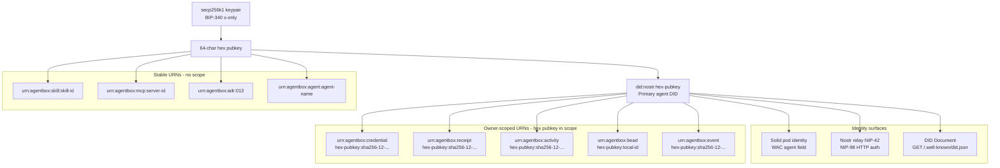
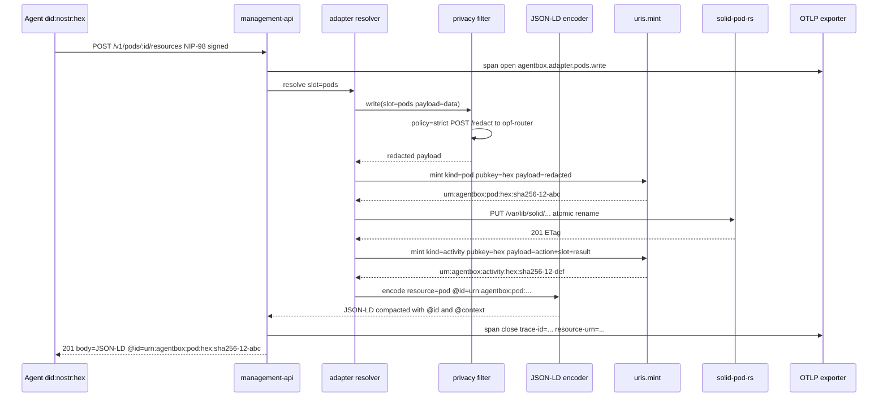
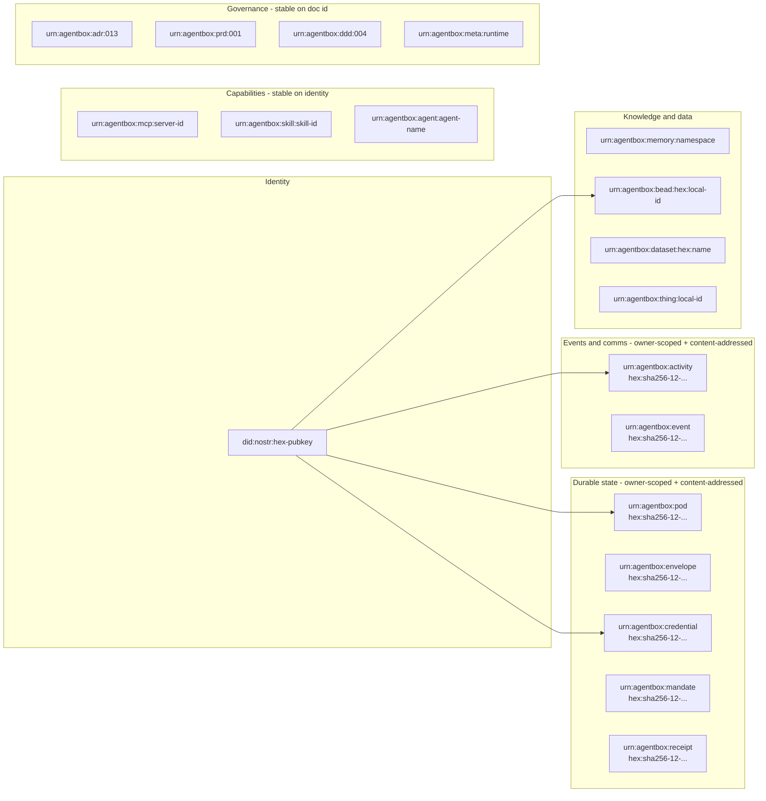
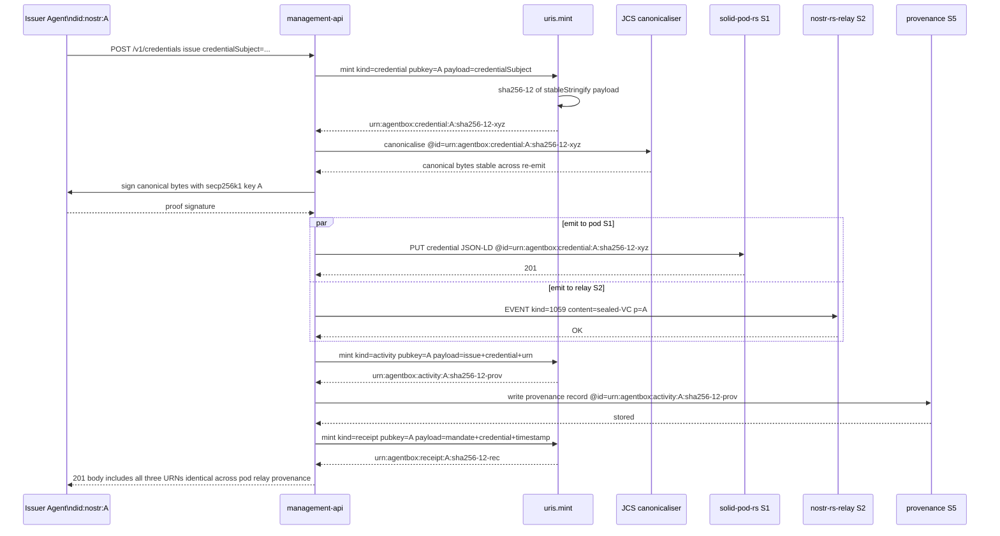

# Agentbox

<div align="center">


### A manifest-driven, reproducible runtime for sovereign software agents.

[](https://github.com/DreamLab-AI/agentbox/actions)
[](LICENSE)
[](flake.nix)
[](https://github.com/DreamLab-AI/agentbox/pkgs/container/agentbox)

One TOML manifest. One Nix flake. One runtime contract.

[Quickstart](#quickstart) · [Why Agentbox](#why-agentbox) · [Features](#features) · [Architecture](#architecture) · [Docs](docs/README.md) · [Contributing](#contributing)

</div>

---

## Why Agentbox

The core problem with most agent runtimes is not missing tooling — it is that the things agents do cannot be traced, audited, or federated. An agent writes to a pod: which agent, which pod resource, was the data redacted before write, can you prove it later? An agent issues a credential: which identity signed it, does the `@id` in the signed document match the `@id` in the audit log? Two agentboxes exchange messages: do the identifiers on both sides refer to the same thing, or have they been reminted at each hop? Without answers to these questions, an agent runtime is a collection of tools with no provenance.

Agentbox answers all of them with a single design decision: every agent, resource, action, and event in the system is named by a stable identifier rooted in one cryptographic identity. A BIP-340 secp256k1 keypair is generated at bootstrap. Its x-only public key — 64 lowercase hex characters — becomes `did:nostr:<hex-pubkey>`: the agent's primary DID, accepted by the embedded Nostr relay under NIP-42, by the Solid pod under NIP-98 HTTP auth and WAC policies, and by every verifiable credential the agent issues or receives. From that one root, 18 kinds of `urn:agentbox:<kind>:[<scope>:]<local>` identifiers name every other entity in the system. Owner-scoped kinds embed the hex pubkey: `urn:agentbox:credential:<hex-pubkey>:<sha256-12-…>` means the credential was issued by that agent and no other. Content-addressed kinds derive their local part from `sha256-12-<first 12 hex chars of SHA-256(stableStringify(payload))>`: the same resource always has the same name, regardless of when or where it was emitted.

What this naming discipline unlocks is qualitatively different from feature lists. Signed credentials carry a stable `@id` that survives JCS canonicalisation — the proof block binds a meaningful identifier, not a freshly-rolled UUID. Re-emitting the same payload produces the same URI, so external indexes never double-count. The linked-data browser at `/lo/*` can follow `@id` links between resources across surfaces because every link resolves through the same `/v1/uri/<urn>` endpoint. Audit trails are complete by construction: every adapter dispatch emits an OTLP span and a `urn:agentbox:activity:…` provenance record carrying the same trace ID. Federation preserves names: a `urn:agentbox:credential:…` minted in standalone mode keeps its identity when the operator switches to federated pods — only the resolver's redirect target changes.

The manifest and Nix build model is what makes this practical rather than aspirational. The same `agentbox.toml` that selects which adapter slots are active also gates the privacy filter policy per slot, the linked-data surfaces, the relay ingress rules, and the URI resolver availability. Nothing is assembled at boot. The privacy filter runs before the JSON-LD encoder on every adapter dispatch — PII redaction completes before a single byte is encoded or persisted. The entire sovereign data stack (identity, pod, relay, privacy filter, URI grammar, linked-data encoder) is baked into the image and activated or suppressed by the manifest, not by runtime scripts.

## The Identity and Tracing Mesh

Every emitted entity carries a stable URN rooted in the agent's `did:nostr` identity. The identity root is a single secp256k1 keypair. Everything else — pods, credentials, events, activities, beads, memory catalogues, architecture docs — derives its identifier from that root and from the content of the resource itself.


```mermaid
flowchart TB
    KP[secp256k1 keypair\nBIP-340 x-only]
    HEX[64-char hex pubkey]
    DID[did:nostr:hex-pubkey\nPrimary agent DID]
    KP --> HEX
    HEX --> DID

    subgraph identity["Identity surfaces"]
        POD_ID[Solid pod identity\nWAC agent field]
        RELAY_ID[Nostr relay NIP-42\nNIP-98 HTTP auth]
        DID_DOC[DID Document\nGET /.well-known/did.json]
    end

    DID --> POD_ID
    DID --> RELAY_ID
    DID --> DID_DOC

    subgraph owned["Owner-scoped URNs - hex pubkey in scope"]
        CRED[urn:agentbox:credential\nhex-pubkey:sha256-12-...]
        RECEIPT[urn:agentbox:receipt\nhex-pubkey:sha256-12-...]
        ACTIVITY[urn:agentbox:activity\nhex-pubkey:sha256-12-...]
        BEAD[urn:agentbox:bead\nhex-pubkey:local-id]
        EVENT[urn:agentbox:event\nhex-pubkey:sha256-12-...]
    end

    DID --> CRED
    DID --> RECEIPT
    DID --> ACTIVITY
    DID --> BEAD
    DID --> EVENT

    subgraph stable["Stable URNs - no scope"]
        SKILL[urn:agentbox:skill:skill-id]
        MCP[urn:agentbox:mcp:server-id]
        ADR[urn:agentbox:adr:013]
        AGENT[urn:agentbox:agent:agent-name]
    end

    HEX --> SKILL
    HEX --> MCP
    HEX --> ADR
    HEX --> AGENT
```

Every request through the management API follows the same lifecycle: the agent's identity is verified, the adapter resolver selects the backend, the privacy filter redacts before write, the JSON-LD encoder wraps the response with stable `@id` values, and an OTLP span carries the trace from entry to exit.


```mermaid
sequenceDiagram
    participant AG as Agent did:nostr:hex
    participant MA as management-api
    participant AR as adapter resolver
    participant PF as privacy filter
    participant LD as JSON-LD encoder
    participant UM as uris.mint
    participant PO as solid-pod-rs
    participant OT as OTLP exporter

    AG->>MA: POST /v1/pods/:id/resources NIP-98 signed
    MA->>OT: span open agentbox.adapter.pods.write
    MA->>AR: resolve slot=pods
    AR->>PF: write(slot=pods payload=data)
    PF->>PF: policy=strict POST /redact to opf-router
    PF-->>AR: redacted payload
    AR->>UM: mint kind=pod pubkey=hex payload=redacted
    UM-->>AR: urn:agentbox:pod:hex:sha256-12-abc
    AR->>PO: PUT /var/lib/solid/... atomic rename
    PO-->>AR: 201 ETag
    AR->>UM: mint kind=activity pubkey=hex payload=action+slot+result
    UM-->>AR: urn:agentbox:activity:hex:sha256-12-def
    AR->>LD: encode resource=pod @id=urn:agentbox:pod:...
    LD-->>MA: JSON-LD compacted with @id and @context
    MA->>OT: span close trace-id=... resource-urn=...
    MA-->>AG: 201 body=JSON-LD @id=urn:agentbox:pod:hex:sha256-12-abc
```

<details>
<summary>Full URN kind taxonomy — all 18 kinds by category</summary>


```mermaid
flowchart LR
    subgraph identity_cat["Identity"]
        DID_NODE[did:nostr:hex-pubkey]
    end

    subgraph durable["Durable state - owner-scoped + content-addressed"]
        POD_K[urn:agentbox:pod\nhex:sha256-12-...]
        ENV_K[urn:agentbox:envelope\nhex:sha256-12-...]
        CRED_K[urn:agentbox:credential\nhex:sha256-12-...]
        MAND_K[urn:agentbox:mandate\nhex:sha256-12-...]
        RECE_K[urn:agentbox:receipt\nhex:sha256-12-...]
    end

    subgraph events_cat["Events and comms - owner-scoped + content-addressed"]
        ACT_K[urn:agentbox:activity\nhex:sha256-12-...]
        EVT_K[urn:agentbox:event\nhex:sha256-12-...]
    end

    subgraph knowledge["Knowledge and data"]
        MEM_K[urn:agentbox:memory:namespace]
        BEAD_K[urn:agentbox:bead:hex:local-id]
        DATA_K[urn:agentbox:dataset:hex:name]
        THING_K[urn:agentbox:thing:local-id]
    end

    subgraph capabilities["Capabilities - stable on identity"]
        MCP_K[urn:agentbox:mcp:server-id]
        SKILL_K[urn:agentbox:skill:skill-id]
        AGENT_K[urn:agentbox:agent:agent-name]
    end

    subgraph governance["Governance - stable on doc id"]
        ADR_K[urn:agentbox:adr:013]
        PRD_K[urn:agentbox:prd:001]
        DDD_K[urn:agentbox:ddd:004]
        META_K[urn:agentbox:meta:runtime]
    end

    DID_NODE --> POD_K
    DID_NODE --> CRED_K
    DID_NODE --> ACT_K
    DID_NODE --> BEAD_K
```

| Kind | Owner-scoped | Content-addressed | Resolvable surface | Example |
|---|---|---|---|---|
| `pod` | yes | yes | pods | `urn:agentbox:pod:abc123...:sha256-12-deadbeef` |
| `envelope` | yes | yes | pods | `urn:agentbox:envelope:abc123...:sha256-12-112233` |
| `credential` | yes | yes | pods | `urn:agentbox:credential:abc123...:sha256-12-aabbcc` |
| `mandate` | yes | yes | pods | `urn:agentbox:mandate:abc123...:sha256-12-001122` |
| `receipt` | yes | yes | pods | `urn:agentbox:receipt:abc123...:sha256-12-334455` |
| `activity` | yes | yes | agent-events | `urn:agentbox:activity:abc123...:sha256-12-667788` |
| `event` | yes | yes | agent-events | `urn:agentbox:event:abc123...:sha256-12-99aabb` |
| `mcp` | no | no | things | `urn:agentbox:mcp:playwright` |
| `memory` | no | no | memory | `urn:agentbox:memory:project-state` |
| `skill` | no | no | skills | `urn:agentbox:skill:console-buddy` |
| `adr` | no | no | docs | `urn:agentbox:adr:013` |
| `prd` | no | no | docs | `urn:agentbox:prd:006` |
| `ddd` | no | no | docs | `urn:agentbox:ddd:004` |
| `thing` | no | no | things | `urn:agentbox:thing:local-tool` |
| `dataset` | yes | no | memory | `urn:agentbox:dataset:abc123...:vectors-v1` |
| `bead` | yes | no | beads | `urn:agentbox:bead:abc123...:work-item-42` |
| `agent` | no | no | agents | `urn:agentbox:agent:coordinator` |
| `meta` | no | no | meta | `urn:agentbox:meta:runtime` |

</details>

<details>
<summary>Credential issuance and provenance trace</summary>


```mermaid
sequenceDiagram
    participant IA as Issuer Agent\ndid:nostr:A
    participant MA as management-api
    participant UM as uris.mint
    participant JCS as JCS canonicaliser
    participant PO as solid-pod-rs S1
    participant NR as nostr-rs-relay S2
    participant PR as provenance S5

    IA->>MA: POST /v1/credentials issue credentialSubject=...
    MA->>UM: mint kind=credential pubkey=A payload=credentialSubject
    UM->>UM: sha256-12 of stableStringify payload
    UM-->>MA: urn:agentbox:credential:A:sha256-12-xyz
    MA->>JCS: canonicalise @id=urn:agentbox:credential:A:sha256-12-xyz
    JCS-->>MA: canonical bytes stable across re-emit
    MA->>IA: sign canonical bytes with secp256k1 key A
    IA-->>MA: proof signature

    par emit to pod S1
        MA->>PO: PUT credential JSON-LD @id=urn:agentbox:credential:A:sha256-12-xyz
        PO-->>MA: 201
    and emit to relay S2
        MA->>NR: EVENT kind=1059 content=sealed-VC p=A
        NR-->>MA: OK
    end

    MA->>UM: mint kind=activity pubkey=A payload=issue+credential+urn
    UM-->>MA: urn:agentbox:activity:A:sha256-12-prov
    MA->>PR: write provenance record @id=urn:agentbox:activity:A:sha256-12-prov
    PR-->>MA: stored

    MA->>UM: mint kind=receipt pubkey=A payload=mandate+credential+timestamp
    UM-->>MA: urn:agentbox:receipt:A:sha256-12-rec
    MA-->>IA: 201 body includes all three URNs identical across pod relay provenance
```

The credential URN `urn:agentbox:credential:A:sha256-12-xyz` appears identically in the pod resource, the Nostr envelope payload, and the provenance activity record. It is deterministic: re-issuing the same credential subject produces the same URN. The proof block's `@id` is the same string that the audit system indexed.

</details>

## Quickstart

### Interactive onboarding

```sh
./scripts/start-agentbox.sh
./agentbox.sh up --build
./agentbox.sh health
```

### Non-interactive source build

```sh
git clone https://github.com/DreamLab-AI/agentbox.git
cd agentbox

./scripts/agentbox-config-validate.sh
./agentbox.sh up --build
./agentbox.sh health
./agentbox.sh shell
```

### Use the published image

```sh
export AGENTBOX_IMAGE_REF=ghcr.io/dreamlab-ai/agentbox:latest
docker pull "$AGENTBOX_IMAGE_REF"
./agentbox.sh up --registry
./agentbox.sh health
```

Main operator docs:

- [Quickstart](docs/user/quickstart.md)
- [Configuration](docs/user/configuration.md)
- [Running](docs/user/running.md)
- [Troubleshooting](docs/user/troubleshooting.md)

## What's In The Current Platform

### Core runtime

- Manifest-driven Nix build with one generated runtime path
- Pluggable five-slot adapter architecture: `beads`, `pods`, `memory`, `events`, `orchestrator`
- Local, external, or `off` implementations per slot
- Immutable bootstrap: runtime dependencies are baked into the image, not installed on startup
- Multi-arch OCI images for `amd64` and `arm64`
- Generated compose + generated supervisord + generated runtime config from the same manifest

### Sovereign data stack

Every emitted entity carries a stable URN rooted in the agent's `did:nostr` pubkey — see [The Identity and Tracing Mesh](#the-identity-and-tracing-mesh).

- First-party `solid-pod-rs` as the primary local pod server
- `did:nostr:<pubkey>` identity loop across relay, pod, credentials, and receipts
- Embedded Nostr relay and pod mailbox bridge
- Local privacy-filter sidecar with per-slot strict/soft/off policies
- Linked-data surfaces for pods, events, credentials, DID docs, provenance, capability descriptors, payments, memory catalogues, architecture docs, and HTTP meta
- Canonical URI grammar plus `/v1/uri/<urn>` resolver
- JSON-LD browser slot at `/lo/*` for navigating emitted resources

### Agent tooling

- Claude, Codex, Gemini, ruflo, claude-flow, agentic-qe, nagual-qe, codebase-memory
- Built-in and external MCP service support
- Playwright, ComfyUI, QGIS, Blender, LaTeX, report-builder, and browser automation paths
- Consultant tier for named external-model consultation workflows
- Desktop mode with tiled terminal workflows when enabled

### Operations and hardening

- `/livez`, `/ready`, `/health`, Prometheus metrics, OTLP support
- Hardened baseline: non-root, `read_only`, `cap_drop: [ALL]`, `no-new-privileges`
- Explicit feature exceptions instead of ambient privilege creep
- Backup/restore flow for runtime state
- Registry-image or local-build workflows using the same runtime contract

## Features

### Build and composition

| Capability                 | Summary                                                                          |
| -------------------------- | -------------------------------------------------------------------------------- |
| Reproducible builds        | Nix flake + pinned hashes + content-addressed image generation.                  |
| Manifest-gated composition | `agentbox.toml` controls what is built and what is run.                        |
| Runtime/image parity       | Compose, supervisor, image contents, and probes all come from the same manifest. |
| Immutable bootstrap        | No package-manager bootstrapping in the normal startup path.                     |
| Multi-arch publishing      | Local and registry workflows support `amd64` and `arm64`.                    |

### Runtime architecture

| Capability                 | Summary                                                                               |
| -------------------------- | ------------------------------------------------------------------------------------- |
| Five-slot adapters         | Durable integration seams for beads, pods, memory, events, and orchestration.         |
| Standalone or federated    | Same repo and runtime can self-host or plug into a host mesh.                         |
| Probe contract             | `/livez`, `/ready`, and `/health` are first-class runtime signals.              |
| Observability              | Structured logs, Prometheus metrics, OTLP export, and runtime metadata.               |
| Generated runtime contract | Image selection, ports, hardening, and sidecars are all derived, not hand-maintained. |

### Sovereign stack

| Layer          | Summary                                                                                        |
| -------------- | ---------------------------------------------------------------------------------------------- |
| Identity       | `did:nostr:<pubkey>` as the primary externally visible agent identifier.                     |
| Pods           | `solid-pod-rs` with Solid Protocol 0.11, WAC 2.0, rate limiting, quota, and webhook signing. |
| Relay          | Embedded Nostr relay plus inbox/outbox bridge.                                                 |
| Privacy        | Local `openai/privacy-filter` sidecar on adapter dispatch boundaries.                        |
| Linked data    | JSON-LD 1.1 surfaces across operational and domain resources.                                  |
| Canonical URIs | Stable names for emitted entities with a resolver endpoint.                                    |
| Browser        | Linked-data viewer that follows `@id` and renders resources by pane.                         |

### Newer linked-data and URI work

The platform now includes a real naming and browsing layer, not just emitters:

- [Canonical URIs](docs/user/uris.md): two shapes, `did:nostr:<pubkey>` for identity and `urn:agentbox:<kind>:[<scope>:]<local>` for everything else
- [URI resolver](docs/reference/adr/ADR-013-canonical-uri-grammar.md): `/v1/uri/<urn>` maps resolvable names to current representations
- [Linked-data browser](docs/user/browser.md): `/lo/*` serves a JSON-LD-aware browser and agentbox-specific panes
- [Linked-data surfaces](docs/user/linked-data.md): the external grammar spans pods, Nostr envelopes, VCs, DID docs, provenance, WoT, payments, DCAT, and docs metadata

This matters because the runtime now does more than expose APIs. It exposes a coherent namespace that agents and humans can inspect, dereference, and reason over.

### Agent and MCP layer

| Capability                | Summary                                                                      |
| ------------------------- | ---------------------------------------------------------------------------- |
| Consultant tier           | Named consultant MCPs for Codex, Gemini, Z.AI, Perplexity, and DeepSeek.     |
| MCP support               | Local MCP servers and external MCP-facing capabilities.                      |
| Browser automation        | Playwright and agent-browser paths.                                          |
| Media and spatial tooling | ComfyUI, ImageMagick, FFmpeg, Blender, QGIS, and 3DGS support paths.         |
| QE/orchestration tooling  | ruflo, claude-flow, agentic-qe, nagual-qe, and codebase-memory integrations. |

### Security and operations

| Capability              | Summary                                                                                  |
| ----------------------- | ---------------------------------------------------------------------------------------- |
| Hardened baseline       | Default container privileges are minimal and explicit.                                   |
| Feature exception model | Security deltas are declared in the manifest rather than silently accumulated.           |
| Secret hygiene          | Management keys and sovereign identity material are not shipped as default literals.     |
| Backup and restore      | Runtime state can be exported and restored using the project tooling.                    |
| Remote operations       | Provisioning and remote operation helpers exist for OCI, Fly, Hetzner, and bare targets. |

## Architecture

The architecture is built around the manifest as contract. See [The Identity and Tracing Mesh](#the-identity-and-tracing-mesh) for how every emitted resource acquires a stable, cryptographically-rooted identifier through this same structure.

```mermaid
flowchart TB
    subgraph manifest["Manifest Contract"]
        M[agentbox.toml]
        V[validator]
    end

    subgraph build["Build"]
        F[flake.nix]
        I[OCI image]
        C[generated compose]
        S[generated supervisord]
    end

    subgraph runtime["Runtime"]
        API[management-api]
        AD[adapter resolver]
        POD[solid-pod-rs]
        RELAY[nostr relay]
        PF[privacy filter]
        LD[linked-data encoder]
        URI[/v1/uri resolver]
        VIEW[/lo browser]
    end

    M --> V
    M --> F
    F --> I
    F --> C
    F --> S
    I --> API
    S --> API
    API --> AD
    AD --> POD
    AD --> RELAY
    API --> PF
    API --> LD
    LD --> URI
    URI --> VIEW
```

Three rules matter more than anything else:

1. The manifest is the contract.
2. Adapters are the integration boundary.
3. Startup should realise the manifest, not invent new state.

Deeper reading:

- [Architecture overview](docs/developer/architecture.md)
- [Identity and tracing mesh](docs/developer/identity-mesh.md)
- [PRD-001](docs/reference/prd/PRD-001-capabilities-and-adapters.md)
- [ADR-005](docs/reference/adr/ADR-005-pluggable-adapter-architecture.md)
- [PRD-006](docs/reference/prd/PRD-006-linked-data-interfaces.md)
- [ADR-013](docs/reference/adr/ADR-013-canonical-uri-grammar.md)

## Example flows

### Sovereign local agent box

- Generate a profile and build the image
- Start the local pod server, relay, and management API
- Emit JSON-LD surfaces for the resources you care about
- Resolve `did:nostr:<pubkey>` and `urn:agentbox:*` identifiers through the management API
- Browse those resources in `/lo/*`

### Runtime as a host-mesh client

- Set adapters to external implementations
- Keep the same operator and probe surface locally
- Route durable-state operations to the host environment
- Still use the same URI and linked-data model for visibility

### Build as a capability image

- Enable the toolchains and skills you want in `agentbox.toml`
- Validate
- Build once with Nix
- Run the same image locally, in CI, or via a registry ref

## Platforms

| Target        | Build               | Run                            | Notes                                                 |
| ------------- | ------------------- | ------------------------------ | ----------------------------------------------------- |
| Linux x86_64  | Native              | Native                         | Full support, including the richest local feature set |
| Linux aarch64 | Native              | Native                         | Supported, subject to feature-specific gates          |
| macOS         | Compose/dev tooling | Docker Desktop/OrbStack/Colima | Usually CPU or remote-GPU paths                       |
| Windows       | Compose/dev tooling | Docker Desktop + WSL2          | WSL2 is the practical path                            |
| Remote Linux  | Native or registry  | Native                         | OCI/Fly/Hetzner/bare workflows supported              |

See:

- [Platforms](docs/user/platforms.md)
- [Running](docs/user/running.md)
- [Consuming the image](docs/user/consuming-image.md)

## Documentation

### Operators

- [Quickstart](docs/user/quickstart.md)
- [Installation](docs/user/installation.md)
- [Configuration](docs/user/configuration.md)
- [Running](docs/user/running.md)
- [Providers](docs/user/providers.md)
- [Backup &amp; restore](docs/user/backup-restore.md)
- [Troubleshooting](docs/user/troubleshooting.md)

### Sovereign stack and linked data

- [Sovereign stack](docs/user/sovereign-stack.md)
- [Solid pod](docs/user/solid-pod.md)
- [Nostr relay](docs/user/nostr-relay.md)
- [Privacy filter](docs/user/privacy-filter.md)
- [Linked-data interfaces](docs/user/linked-data.md)
- [Canonical URIs](docs/user/uris.md)
- [JSON-LD browser](docs/user/browser.md)
- [Consultants](docs/user/consultants.md)

### Developers

- [Architecture](docs/developer/architecture.md)
- [Identity and tracing mesh](docs/developer/identity-mesh.md)
- [Adapters](docs/developer/adapters.md)
- [Sovereign mesh](docs/developer/sovereign-mesh.md)
- [Linked-data middleware](docs/developer/linked-data.md)
- [Testing](docs/developer/testing.md)

### Canonical specs

- [ADR index](docs/reference/adr/)
- [PRD index](docs/reference/prd/)
- [DDD index](docs/reference/ddd/)
- [Docs hub](docs/README.md)

## Contributing

Start here:

1. Read [docs/developer/architecture.md](docs/developer/architecture.md).
2. Validate the manifest before changing build/runtime behavior.
3. Prefer manifest-gated additions over ad hoc runtime mutation.
4. Treat hardening, probe semantics, URI grammar, and linked-data surfaces as architectural changes, not incidental code tweaks.

For substantial behaviour changes, the repo already uses ADR/PRD/DDD documents as the source of truth. Follow that pattern.

## License

Core project: [MPL-2.0](LICENSE).

Some optional integrated components carry their own licenses. The linked-data browser slot, for example, uses `linkedobjects/browser` under AGPL-3.0 when enabled. See the relevant docs and component files for details.

---

<div align="center">

[Documentation](docs/README.md) · [Issues](https://github.com/DreamLab-AI/agentbox/issues) · [Releases](https://github.com/DreamLab-AI/agentbox/releases) · [Container Registry](https://github.com/DreamLab-AI/agentbox/pkgs/container/agentbox)

</div>
