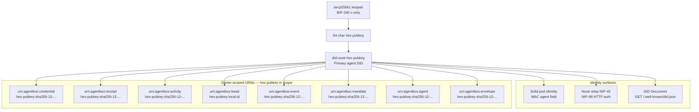
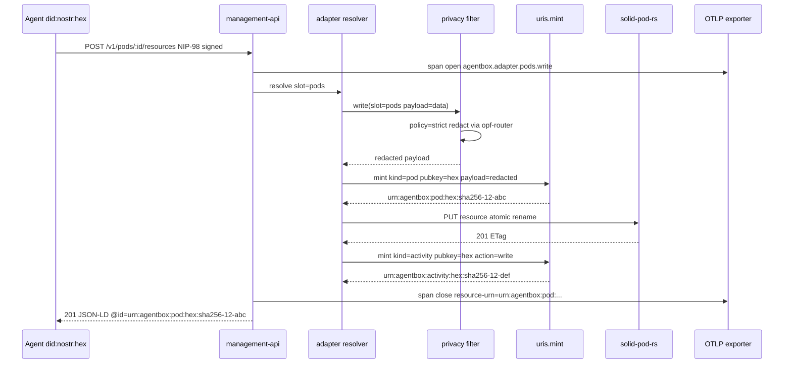
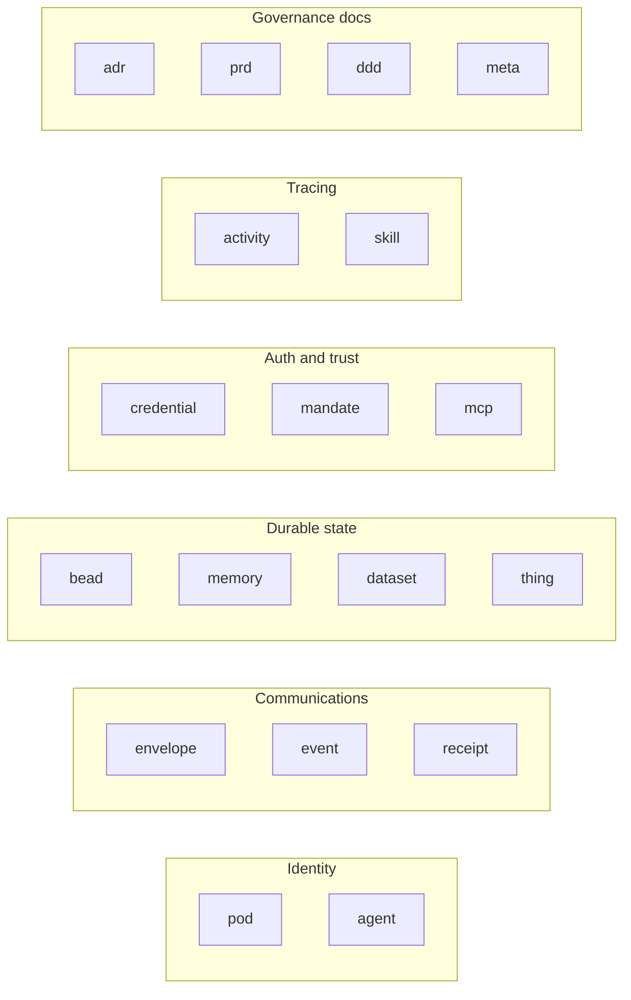
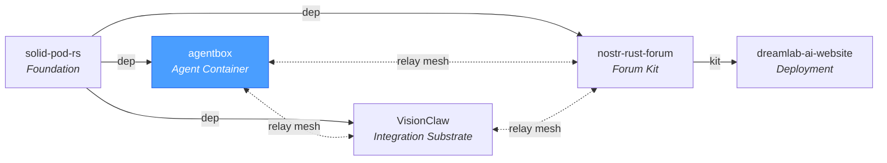

# Agentbox

<div align="center">


### A manifest-driven, reproducible runtime for sovereign software agents.

[](https://github.com/DreamLab-AI/agentbox/actions)
[](LICENSE)
[](flake.nix)
[](https://github.com/DreamLab-AI/agentbox/pkgs/container/agentbox)

**One TOML manifest. One Nix flake. One runtime contract.**

[Quickstart](#quickstart) · [Why Agentbox](#why-agentbox) · [Capabilities](#included-capabilities) · [Sovereign Architecture](#the-sovereign-data-stack) · [Docs](docs/README.md)

</div>

---

## What is Agentbox?

Agentbox is a hardened, fully reproducible Linux container environment built specifically to host, orchestrate, and trace autonomous AI agents.

Instead of juggling custom Dockerfiles, scattered API keys, and brittle dependency scripts, **everything in Agentbox is driven by a single `agentbox.toml` manifest**. You declare the agents you want, the tools they need — from browser automation to 3D rendering — and the storage backends they use. Agentbox builds a byte-for-byte reproducible image using Nix, spins up the environment, and automatically routes all agent actions through local privacy filters and cryptographic audit trails.

## Why Agentbox?

Most agent runtimes are just a collection of tools with no provenance, privacy, or reproducible state. Agentbox is built differently:

- 🚀 **Batteries Included (via MCP)**: Out-of-the-box support for Claude Code, Codex, Gemini, DeepSeek, and ruflo. Instantly equip them with 90+ skills including Playwright, ComfyUI, QGIS, Blender, LaTeX, and Jupyter via the Model Context Protocol (MCP).
- 🔒 **Privacy by Default**: An embedded `openai/privacy-filter` sidecar intercepts every agent action, ensuring PII and secrets are redacted _before_ any data hits your memory or logs.
- 🛡️ **Hardened & Reproducible**: Built with Nix flakes — zero mutable `npm install` steps at runtime. Runs as non-root with a read-only filesystem and all capabilities dropped by default.
- 🔗 **Sovereign Data & Auditability**: Agents own their data cryptographically. Every generated file, memory, and action is stamped with a `did:nostr` identity and stored in an embedded Solid Pod (`solid-pod-rs`). See [The Sovereign Data Stack](#the-sovereign-data-stack).
- 🔌 **Pluggable Adapters**: Run entirely standalone on a laptop (SQLite + local JSONL), or effortlessly federate into a cloud mesh (Postgres pgvector + HTTP event sinks) by flipping a TOML switch.

---

## Quickstart

### Interactive onboarding (recommended)

Use the built-in wizard to generate your manifest, select your tools, and boot the container:

```sh
git clone https://github.com/DreamLab-AI/agentbox.git
cd agentbox
./scripts/start-agentbox.sh
```

### Fast path (pre-built image)

```sh
export AGENTBOX_IMAGE_REF=ghcr.io/dreamlab-ai/agentbox:latest
docker pull "$AGENTBOX_IMAGE_REF"
./agentbox.sh up --registry
./agentbox.sh health
./agentbox.sh shell
```

### Build from source

```sh
git clone https://github.com/DreamLab-AI/agentbox.git
cd agentbox
./scripts/agentbox-config-validate.sh
./agentbox.sh up --build
./agentbox.sh health
```

Next steps:

- [Configuration guide](docs/user/configuration.md)
- [Provider and API key setup](docs/user/providers.md)
- [Desktop mode and VNC access](docs/user/running.md)

---

## Included Capabilities

Your `agentbox.toml` manifest toggles capabilities on or off. Disabled features add zero bloat to your final image.

| Category | Highlights |
| :--- | :--- |
| **Agent toolchains** | `claude-code`, `ruflo`, `gemini-cli`, `agentic-qe`, `openai-codex` |
| **Consultants** | Meta-router for named external consultations: DeepSeek, Perplexity, Z.AI, Gemini |
| **Browser and web** | Playwright automation, agent-browser, QE integration |
| **Media and design** | Local ComfyUI (or external URL), ImageMagick, FFmpeg |
| **Spatial and 3D** | QGIS geospatial analysis, Blender modelling, 3D Gaussian Splatting |
| **Data science and docs** | PyTorch, Jupyter Lab, LaTeX, Mermaid rendering |
| **Operations** | OTLP tracing, Prometheus metrics (`:9191/metrics`), Tailscale VPN integration |

---

## The Sovereign Data Stack

The core differentiator of Agentbox is the **Identity and Tracing Mesh**.

When an agent acts, how do you know _which_ agent did it? How do you prove it later? Without an identity root, audit logs are meaningless.

Agentbox solves this by generating a BIP-340 secp256k1 keypair at bootstrap. The agent's public key becomes a `did:nostr:<hex-pubkey>` identity. **Every resource, action, and event in the system is rooted in this cryptographic identity.**

From that single root, 18 kinds of `urn:agentbox:<kind>:[<scope>:]<local>` identifiers name every entity: pods, credentials, receipts, activities, events, memories, skills, architecture docs, and more. Owner-scoped kinds embed the hex pubkey — `urn:agentbox:credential:<hex-pubkey>:<sha256-12-…>` means that credential was issued by that agent and no other. Content-addressed kinds are deterministic: the same payload always produces the same URN, so re-emitting never double-counts and signed credentials keep a stable `@id` across JCS canonicalisation.

<details>
<summary><b>Identity root diagram</b></summary>


```mermaid
flowchart TB
    KP[secp256k1 keypair\nBIP-340 x-only]
    HEX[64-char hex pubkey]
    DID[did:nostr:hex-pubkey\nPrimary agent DID]
    KP --> HEX
    HEX --> DID

    subgraph identity["Identity surfaces"]
        POD_ID[Solid pod identity\nWAC agent field]
        RELAY_ID[Nostr relay NIP-42\nNIP-98 HTTP auth]
        DID_DOC[DID Document\nGET /.well-known/did.json]
    end

    DID --> POD_ID
    DID --> RELAY_ID
    DID --> DID_DOC

    subgraph owned["Owner-scoped URNs — hex pubkey in scope"]
        CRED[urn:agentbox:credential\nhex-pubkey:sha256-12-...]
        RECEIPT[urn:agentbox:receipt\nhex-pubkey:sha256-12-...]
        ACTIVITY[urn:agentbox:activity\nhex-pubkey:sha256-12-...]
        BEAD[urn:agentbox:bead\nhex-pubkey:local-id]
        EVENT[urn:agentbox:event\nhex-pubkey:sha256-12-...]
        MANDATE[urn:agentbox:mandate\nhex-pubkey:sha256-12-...]
        AGENT[urn:agentbox:agent\nhex-pubkey:sha256-12-...]
        ENVELOP[urn:agentbox:envelope\nhex-pubkey:sha256-12-...]
    end

    DID --> CRED
    DID --> RECEIPT
    DID --> ACTIVITY
    DID --> BEAD
    DID --> EVENT
    DID --> MANDATE
    DID --> AGENT
    DID --> ENVELOP
```

</details>

<details>
<summary><b>Request lifecycle and adapter dispatch pipeline</b></summary>

Every request through the management API follows a rigorous lifecycle: identity verification → adapter routing → privacy redaction → JSON-LD encoding → OTLP tracing.


```mermaid
sequenceDiagram
    participant AG as Agent did:nostr:hex
    participant MA as management-api
    participant AR as adapter resolver
    participant PF as privacy filter
    participant UM as uris.mint
    participant PO as solid-pod-rs
    participant OT as OTLP exporter

    AG->>MA: POST /v1/pods/:id/resources NIP-98 signed
    MA->>OT: span open agentbox.adapter.pods.write
    MA->>AR: resolve slot=pods
    AR->>PF: write(slot=pods payload=data)
    PF->>PF: policy=strict redact via opf-router
    PF-->>AR: redacted payload
    AR->>UM: mint kind=pod pubkey=hex payload=redacted
    UM-->>AR: urn:agentbox:pod:hex:sha256-12-abc
    AR->>PO: PUT resource atomic rename
    PO-->>AR: 201 ETag
    AR->>UM: mint kind=activity pubkey=hex action=write
    UM-->>AR: urn:agentbox:activity:hex:sha256-12-def
    MA->>OT: span close resource-urn=urn:agentbox:pod:...
    MA-->>AG: 201 JSON-LD @id=urn:agentbox:pod:hex:sha256-12-abc
```

</details>

<details>
<summary><b>Full URN kind taxonomy (18 kinds)</b></summary>


```mermaid
flowchart LR
    subgraph identity_k["Identity"]
        POD_K[pod]
        AGENT_K[agent]
    end

    subgraph comms["Communications"]
        ENVELOPE_K[envelope]
        EVENT_K[event]
        RECEIPT_K[receipt]
    end

    subgraph state["Durable state"]
        BEAD_K[bead]
        MEMORY_K[memory]
        DATASET_K[dataset]
        THING_K[thing]
    end

    subgraph auth["Auth and trust"]
        CRED_K[credential]
        MANDATE_K[mandate]
        MCP_K[mcp]
    end

    subgraph trace["Tracing"]
        ACTIVITY_K[activity]
        SKILL_K[skill]
    end

    subgraph docs["Governance docs"]
        ADR_K[adr]
        PRD_K[prd]
        DDD_K[ddd]
        META_K[meta]
    end
```

| Kind | Owner-scoped | Content-addressed | Example URN |
|------|:---:|:---:|-------------|
| `pod` | yes | yes | `urn:agentbox:pod:hex:sha256-12-abc` |
| `envelope` | yes | yes | `urn:agentbox:envelope:hex:sha256-12-abc` |
| `credential` | yes | yes | `urn:agentbox:credential:hex:sha256-12-abc` |
| `mandate` | yes | yes | `urn:agentbox:mandate:hex:sha256-12-abc` |
| `receipt` | yes | yes | `urn:agentbox:receipt:hex:sha256-12-abc` |
| `activity` | yes | yes | `urn:agentbox:activity:hex:sha256-12-abc` |
| `event` | yes | yes | `urn:agentbox:event:hex:sha256-12-abc` |
| `bead` | yes | no | `urn:agentbox:bead:hex:local-id` |
| `agent` | yes | yes | `urn:agentbox:agent:hex:sha256-12-abc` |
| `mcp` | no | no | `urn:agentbox:mcp:server-slug` |
| `memory` | no | no | `urn:agentbox:memory:name` |
| `skill` | no | no | `urn:agentbox:skill:slug` |
| `dataset` | no | yes | `urn:agentbox:dataset:sha256-12-abc` |
| `thing` | no | yes | `urn:agentbox:thing:sha256-12-abc` |
| `adr` | no | no | `urn:agentbox:adr:ADR-013` |
| `prd` | no | no | `urn:agentbox:prd:PRD-006` |
| `ddd` | no | no | `urn:agentbox:ddd:DDD-004` |
| `meta` | no | no | `urn:agentbox:meta:slug` |

</details>

Because Agentbox uses canonical URIs and Linked Data (JSON-LD), you can spin up the built-in [Linked-Data browser](docs/user/browser.md) at `/lo/*` to navigate the graph of your agent's memories, architectural decisions, and credentials. The `/v1/uri/<urn>` resolver maps any URN to its current HTTP representation.

Deeper reading:

- [Identity and tracing mesh](docs/developer/identity-mesh.md)
- [ADR-013 — Canonical URI grammar](docs/reference/adr/ADR-013-canonical-uri-grammar.md)
- [ADR-005 — Pluggable adapter architecture](docs/reference/adr/ADR-005-pluggable-adapter-architecture.md)
- [PRD-006 — Linked-data interfaces](docs/reference/prd/PRD-006-linked-data-interfaces.md)

---

## Documentation

### For operators

- [Quickstart](docs/user/quickstart.md)
- [Installation](docs/user/installation.md)
- [Configuration](docs/user/configuration.md)
- [Running](docs/user/running.md)
- [Providers](docs/user/providers.md)
- [Backup and restore](docs/user/backup-restore.md)
- [Troubleshooting](docs/user/troubleshooting.md)

### For sovereign data and linked data

- [Sovereign stack](docs/user/sovereign-stack.md)
- [Solid pod](docs/user/solid-pod.md)
- [Nostr relay](docs/user/nostr-relay.md)
- [Privacy filter](docs/user/privacy-filter.md)
- [Linked-data interfaces](docs/user/linked-data.md)
- [Canonical URIs](docs/user/uris.md)
- [JSON-LD browser](docs/user/browser.md)
- [Consultants](docs/user/consultants.md)

### For developers

- [Architecture overview](docs/developer/architecture.md)
- [Identity and tracing mesh](docs/developer/identity-mesh.md)
- [Adapter pattern](docs/developer/adapters.md)
- [Sovereign mesh](docs/developer/sovereign-mesh.md)
- [Ecosystem integration](docs/developer/ecosystem.md)
- [Testing](docs/developer/testing.md)

### Canonical specs

- [ADR index](docs/reference/adr/)
- [PRD index](docs/reference/prd/)
- [DDD index](docs/reference/ddd/)
- [Docs hub](docs/README.md)

---

## Platforms

| Target | Build | Run | Notes |
| --- | --- | --- | --- |
| Linux x86_64 | Native | Native | Full support, richest local feature set |
| Linux aarch64 | Native | Native | Supported, subject to feature-specific gates |
| macOS | Compose/dev tooling | Docker Desktop/OrbStack/Colima | CPU or remote-GPU paths |
| Windows | Compose/dev tooling | Docker Desktop + WSL2 | WSL2 is the practical path |
| Remote Linux | Native or registry | Native | OCI/Fly/Hetzner/bare workflows supported |

---

## Contributing

1. Read [docs/developer/architecture.md](docs/developer/architecture.md).
2. Validate the manifest before changing build or runtime behavior.
3. Prefer manifest-gated additions over ad hoc runtime mutation.
4. Treat hardening, probe semantics, URI grammar, and linked-data surfaces as architectural changes — propose them via an ADR.

## Ecosystem

Agentbox is one of five federated repositories in the DreamLab open-source ecosystem, connected via `did:nostr` identity and a private Nostr relay mesh.


```mermaid
graph LR
    SPR["solid-pod-rs<br/><i>Foundation</i>"] -->|dep| NRF["nostr-rust-forum<br/><i>Forum Kit</i>"]
    SPR -->|dep| AB["agentbox<br/><i>Agent Container</i>"]
    SPR -->|dep| VC["VisionClaw<br/><i>Integration Substrate</i>"]
    NRF -->|kit| DW["dreamlab-ai-website<br/><i>Deployment</i>"]
    AB <-.->|"relay mesh"| VC
    AB <-.->|"relay mesh"| NRF
    VC <-.->|"relay mesh"| NRF

    style AB fill:#4a9eff,stroke:#2563eb,color:#fff
```

| Repository | Role | Key Technology |
|---|---|---|
| [solid-pod-rs](https://github.com/DreamLab-AI/solid-pod-rs) | Foundation library | Solid Protocol, DID:Nostr, WAC |
| [nostr-rust-forum](https://github.com/DreamLab-AI/nostr-rust-forum) | Forum kit | 11 `nostr-bbs-*` Rust crates, CF Workers |
| **[agentbox](https://github.com/DreamLab-AI/agentbox)** | **Agent container** | **Nix, nostr-rs-relay, mesh peer** |
| [VisionClaw](https://github.com/DreamLab-AI/VisionClaw) | Integration substrate | Knowledge graph, GPU physics, XR |
| [dreamlab-ai-website](https://github.com/DreamLab-AI/dreamlab-ai-website) | Branded deployment | React SPA, WASM forum, `forum-config/` |

All five share `did:nostr:<hex-pubkey>` as the universal identity primitive and communicate via IS-Envelope messages over a private Nostr relay mesh.

Deeper reading: [Ecosystem integration guide](docs/developer/ecosystem.md)

---

## License

Core project: [AGPL-3.0](LICENSE).

Using agentbox as a hosted service — including running it on behalf of other users — requires you to make the full source (including any modifications) available to those users. Self-hosted and internal use carry no additional obligations beyond the standard copyleft terms.

Optional components (`linkedobjects/browser`, `solid-pod-rs`) are also AGPL-3.0 and therefore consistent with the project license. Other bundled components are MIT or Apache-2.0. See [Licensing details](docs/developer/licensing.md) for the full matrix.

---

<div align="center">

[Documentation](docs/README.md) · [Issues](https://github.com/DreamLab-AI/agentbox/issues) · [Releases](https://github.com/DreamLab-AI/agentbox/releases) · [Container Registry](https://github.com/DreamLab-AI/agentbox/pkgs/container/agentbox)

</div>
