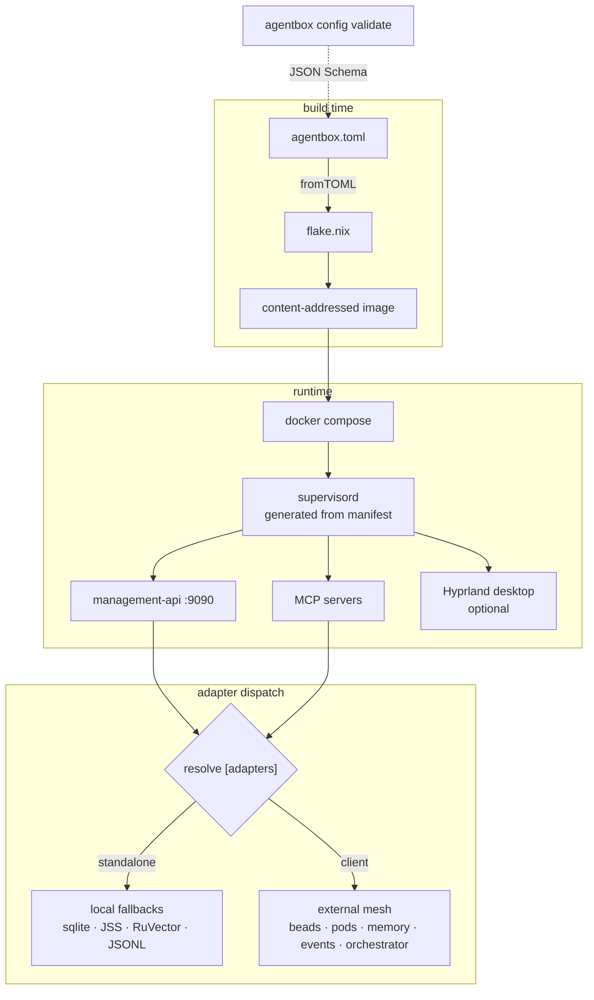

# Agentbox

Agentbox is a modular, Nix-built container runtime for multi-agent development. The current architecture is driven by [`agentbox.toml`](agentbox.toml), uses embedded RuVector for local vector search, bootstraps a sovereign identity plus Solid-style pod storage, and provisions stack-specific profiles that all share the same mounted projects and skills tree.

## Architecture

Agentbox is built around six decisions:

1. Declarative build composition through `agentbox.toml`
2. Sovereign identity bootstrapping with Nostr-style keys
3. **Pluggable adapter architecture** for durable state (see [ADR-005](docs/adr/ADR-005-pluggable-adapter-architecture.md)): beads, pods, memory, events, orchestrator — each slot resolves to one of `local-*`, `external`, or `off`
4. Embedded RuVector for local indexing and retrieval (per-session cache, not a durable source of truth)
5. Profile isolation with shared mounts instead of Linux pseudo-users
6. **Standalone or federated**: agentbox runs with local fallbacks out of the box, or drops into a host container mesh via external adapters — manifest switch, one codepath

Full product spec in [PRD-001](docs/prd/PRD-001-capabilities-and-adapters.md).

### Architecture at a glance


```mermaid
flowchart TB
    subgraph build["build time"]
        M[agentbox.toml] -->|fromTOML| F[flake.nix]
        F --> I[content-addressed image]
    end

    subgraph runtime["runtime"]
        I --> C[docker compose]
        C --> S[supervisord<br/>generated from manifest]
        S --> API[management-api :9090]
        S --> MCP[MCP servers]
        S --> DESK[Hyprland desktop<br/>optional]
    end

    subgraph adapters["adapter dispatch"]
        API --> AD{"resolve [adapters]"}
        MCP --> AD
        AD -->|standalone| LOC[local fallbacks<br/>sqlite · JSS · RuVector · JSONL]
        AD -->|client| EXT[external mesh<br/>beads · pods · memory · events · orchestrator]
    end

    O[agentbox config validate] -.->|JSON Schema| M
```

The active runtime flow is:

1. `flake.nix` reads `agentbox.toml`
2. package groups and supervisor services are generated from the manifest
3. the entrypoint bootstraps identity and pod storage
4. runtime tooling is installed on first boot where needed
5. stack profiles are created under `/workspace/profiles`

## Repository Layout

- [`flake.nix`](flake.nix) builds the runtime, full, and desktop images
- [`agentbox.toml`](agentbox.toml) controls feature gating and toolchains
- [`config/entrypoint-unified.sh`](config/entrypoint-unified.sh) performs runtime bootstrap
- [`scripts/sovereign-bootstrap.py`](scripts/sovereign-bootstrap.py) generates identity and pod ACL state
- [`scripts/provision-agent-stacks.py`](scripts/provision-agent-stacks.py) creates isolated stack profiles with shared mounts
- [`config/agentbox-aliases.sh`](config/agentbox-aliases.sh) provides shell aliases
- [`config/zellij.kdl`](config/zellij.kdl) and [`config/zellij/layouts`](config/zellij/layouts) define terminal workspace defaults

## Feature Gating

The build is controlled by `agentbox.toml`. Enabled features get both:

- their Nix packages
- their supervisor/runtime wiring

Disabled features should incur no image or runtime overhead.

Current top-level sections:

- `[core]`
- `[federation]` — `mode = "standalone" | "client"`
- `[adapters]` — one choice per durable-state slot (beads, pods, memory, events, orchestrator)
- `[gpu]` — unified backend key (`none`, `ollama-rocm`, `ollama-cuda`, `local-cuda`)
- `[sovereign_mesh]` — Nostr client, NIP-98 auth, optional JSS Rust backend
- `[desktop]` — Hyprland/Wayland (default when enabled) with X11/openbox fallback
- `[observability]` — metrics port, OTLP endpoint, log level
- `[providers.<name>]` — per-provider API-key gates
- `[skills.*]` — feature flags for the 96-skill corpus
- `[toolchains]` — claude, claude_code, ruflo, claude_flow, agentic_qe, gemini_cli, code_server, cuda
- `[integrations.*]` — optional external network joins (e.g. ragflow, external memory, external ComfyUI)

Example:

```toml
[sovereign_mesh]
enabled = true
solid_pod = true
nostr_bridge = true

[skills.browser]
agent_browser = true
playwright = true
qe_browser = false

[skills.docs]
latex = true
report_builder = true
mermaid = true
```

## Build

```bash
nix build .#runtime
nix build .#desktop
nix build .#full
```

To load the image into Docker:

```bash
docker load < result
```

## Platform compatibility

| Target | Status | Notes |
|---|---|---|
| **Linux x86_64** | Native | First-class build + run; all GPU backends |
| **Linux aarch64** | Native | Native ARM build (Oracle Ampere, AWS Graviton, Raspberry Pi 4/5); CUDA not available |
| **macOS Intel** (`x86_64-darwin`) | Partial | `nix build .#compose` + `nix develop` supported; container images come from the published multi-arch image via Docker Desktop |
| **macOS Apple Silicon** (`aarch64-darwin`) | Partial | Same as above; Docker Desktop pulls the `linux/arm64` variant |
| **Windows 10/11** | Via Docker Desktop + WSL2 | Pulls the `linux/amd64` image |
| **Nvidia GPU** | via `[gpu].backend = "ollama-cuda"` or `"local-cuda"` | Linux x86_64; limited aarch64 (Jetson) |
| **AMD GPU** | via `[gpu].backend = "ollama-rocm"` | Linux x86_64 / aarch64 with AMD driver; Vulkan fallback covers broader hardware |
| **Apple Silicon GPU (Metal)** | Not supported | Metal passthrough to a Linux container is not possible; use CPU or a remote GPU |
| **Intel iGPU / oneAPI** | Not supported | No backend |

Multi-arch images published to `ghcr.io/dreamlab-ai/agentbox:<tag>` — Docker automatically selects the right arch. See [`docs/guides/platforms.md`](docs/guides/platforms.md) for the full matrix and [`docs/guides/consuming-the-image.md`](docs/guides/consuming-the-image.md) for pull instructions.

## Interactive Startup

Use the interactive launcher if you want checkbox-based feature selection and guided startup:

```bash
./scripts/start-agentbox.sh
```

The launcher will:

- read the current `agentbox.toml`
- present selectable feature checkboxes
- write the updated manifest
- create `.env` from `.env.example` if needed
- offer interactive `.env` value prompts
- check for missing UI/runtime prerequisites
- offer to install missing prerequisites interactively
- optionally build the image
- optionally start `docker compose up -d`

## Run

```bash
cp .env.example .env
docker compose up -d
```

### Local lifecycle via `agentbox.sh`

`agentbox.sh` bundles the most common dev-loop operations so you do not have to compose Nix and Docker commands by hand:

| Command | What it does |
|---------|--------------|
| `./agentbox.sh up` | `docker compose up -d`, then polls `http://localhost:9090/health` for up to 60 s and prints a port summary. |
| `./agentbox.sh up --build` | Runs `nix build .#runtime && docker load < result` first, then starts and polls. |
| `./agentbox.sh down` | `docker compose down`. |
| `./agentbox.sh down --volumes` | Same but with `-v`; prompts for confirmation before removing volumes. |
| `./agentbox.sh build` | `nix build .#runtime` (default). Does **not** load the image; prints the result path. |
| `./agentbox.sh build --variant desktop\|full` | Build an alternate variant without loading it. |
| `./agentbox.sh rebuild` | `down` + `build --variant runtime` + `up --build` chained — one command for a full dev-loop iteration. |
| `./agentbox.sh logs` | `docker compose logs -f --tail 100` for all services. |
| `./agentbox.sh logs <service>` | `docker exec agentbox supervisorctl tail -f <service>`, falling back to compose logs if the container is not up. |
| `./agentbox.sh shell` | `docker exec -it agentbox bash`. |
| `./agentbox.sh shell <profile>` | Opens the Zellij agentbox layout inside `/workspace/profiles/<profile>` (falls back to bash if Zellij is absent). |
| `./agentbox.sh health` | Fetches `http://localhost:9090/health`, pretty-prints per-service status via `jq`, and exits non-zero if any service is `degraded` or `failed`. |
| `./agentbox.sh health --json` | Emits raw JSON to stdout; always exits 0. |

Compose mounts:

- `./workspace -> /workspace`
- `./projects -> /projects`
- RuVector volume -> `/var/lib/ruvector`
- Solid pod volume -> `/var/lib/solid`
- sovereign identity volume -> `/var/lib/agentbox/identities`

## Runtime Services

Default ports exposed by the compose stack:

- `9090` management API (includes `/v1/meta` handshake endpoint, `/metrics` proxy, `/v1/agent-events`)
- `9091` Prometheus metrics (direct, configurable via `[observability].metrics_port`)
- `9700` RuVector
- `8484` Solid-style pod service (only when `[adapters.pods] = "local-jss"`)
- `5901` VNC (only when `[desktop].enabled = true`)
- `8080` code-server (only when `[toolchains.code_server] = true`)
- `8888` Jupyter (only when `[skills.data_science].jupyter = true`)

Optional services are generated from the manifest. That includes:

- Playwright MCP
- ImageMagick MCP
- QGIS placeholder MCP block
- Blender MCP block
- Nostr bridge
- desktop stack services

## Profiles And Shared Context

On boot Agentbox creates stack profiles under `/workspace/profiles`:

- `claude-core`
- `ruflo-orchestrator`
- `qe-fleet`
- `nagual-qe`
- `rust-builder`
- `docs-latex`

Each profile gets:

- its own `.env`
- its own `.claude/settings.json`
- the same shared skills tree via `.claude/skills -> /opt/agentbox/skills`
- the same mounted external projects via `projects -> /projects`
- the same shared workspace via `workspace -> /workspace`
- a progressive-disclosure pointer to `skills/SKILL-DIRECTORY.md`
- an associated Zellij layout path

This is the intended replacement for the old `gemini-user` / `openai-user` / `zai-user` model.

## Terminal Workspace

Zellij replaces tmux in the current runtime.

Useful commands:

- `t` or `zl` starts Zellij
- `zn <name>` starts a named session
- `za <name>` attaches to a named session
- `zls` lists sessions
- `zstack <stack>` opens an Agentbox layout
- `zclaude`, `zruflo`, `zqe`, `zdocs` open the main stack layouts

Seeded config locations:

- `/workspace/.config/zellij/config.kdl`
- `/workspace/.config/zellij/layouts/*.kdl`

## Sovereign Mesh

When sovereign mode is enabled:

- an identity is created for `AGENTBOX_AGENT_ID`
- key material is stored under `/var/lib/agentbox/identities`
- pod state is stored under `/var/lib/solid/pods/<npub>/`
- baseline ACL metadata is written per pod
- the management API accepts bearer auth and scaffold-level NIP-98 envelopes

Important limitation:

- the bundled Solid service is currently a lightweight file-backed compatibility server, not the final `solid-pod-rs` integration
- NIP-98 handling is scaffold-level and not yet full signature verification

## Skills

The skills tree is mounted into every provisioned profile from `/opt/agentbox/skills`.

The authoritative skill catalog is:

- [`skills/SKILL-DIRECTORY.md`](skills/SKILL-DIRECTORY.md)

This is the progressive-disclosure index the profiles reference at boot.

## Observability

Agentbox ships with metrics, traces, and structured logs on by default. Configure via `[observability]`:

```toml
[observability]
metrics_port = 9091
otlp_endpoint = ""          # e.g. "http://otel-collector:4317"
log_level = "info"
```

`agentbox.sh health --json` returns a machine-readable view: per-service uptime, per-adapter resolution + health, session count. Non-zero exit when anything is unhealthy.

## Current Caveats

- The running Docker container on this host may still be an older image if you have not rebuilt and relaunched the stack.
- `config/supervisord.conf` is legacy reference material (scheduled for removal in M1 per PRD-001) — the active runtime path generates supervisor configuration from `flake.nix`.
- Some external CLIs such as `agentic-qe`, `nagual-qe`, and `codebase-memory-mcp` are installed best-effort at runtime rather than vendored in the repo.
- QGIS support currently wires a placeholder standalone service until the real MCP adapter is added.
- `nostr-bridge.js` is a 31-line stub until M3; production-grade Nostr client wiring is a P1 deliverable.

## Status

Agentbox is mid-migration to a fully adapter-driven runtime. Canonical docs:

- **Product spec**: [`docs/prd/PRD-001-capabilities-and-adapters.md`](docs/prd/PRD-001-capabilities-and-adapters.md)
- **Adapter architecture**: [`docs/adr/ADR-005-pluggable-adapter-architecture.md`](docs/adr/ADR-005-pluggable-adapter-architecture.md)
- **Repo conventions**: [`CLAUDE.md`](CLAUDE.md)
- **Quick start**: [`docs/guides/quick-start.md`](docs/guides/quick-start.md)

Agentbox was extracted from a larger host project during a 2026-04 radical-upgrade sprint; the host's integration wiring lives with that project, not here.
