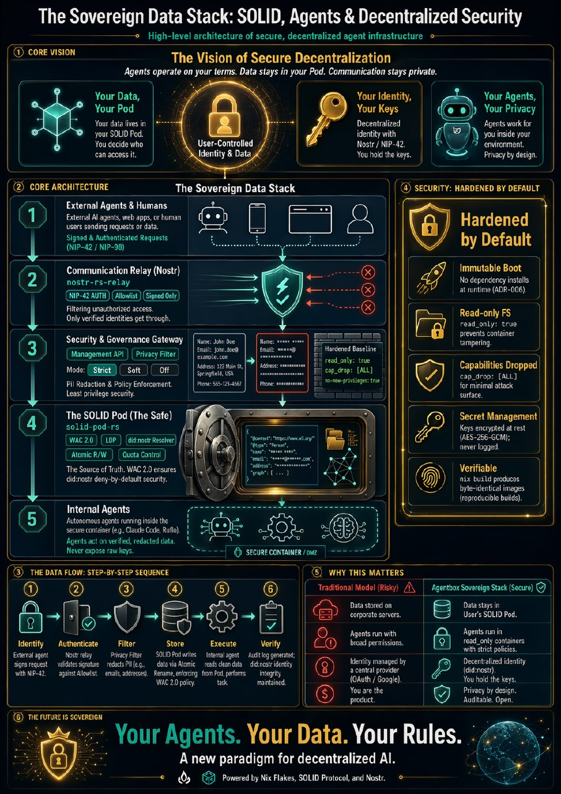
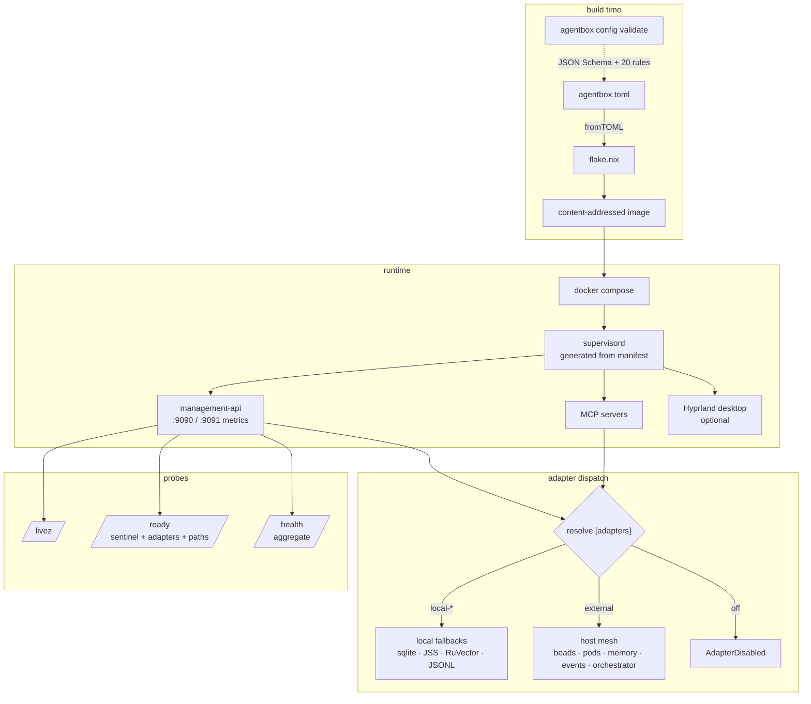

# agentbox is being debugged today, expect it not to work, today. Or fix it yourself.

<div align="center">



# Agentbox

### A reproducible, manifest-driven container runtime for software agents.

[](https://github.com/DreamLab-AI/agentbox/actions)
[](LICENSE)
[](flake.nix)
[](https://github.com/DreamLab-AI/agentbox/pkgs/container/agentbox)

One TOML manifest. One Nix flake. One codepath. Works standalone or plugs into a host container mesh.

[Quickstart](#quickstart) · [Features](#features) · [Architecture](#architecture) · [Platforms](#platforms) · [Documentation](docs/README.md) · [Contributing](#contributing)

</div>

---

## Why Agentbox

Running AI agents in a container sounds simple until you hit production. Most solutions make one of three mistakes:

- **Ship a kitchen-sink image** with every possible dep pre-installed. Slow, bloated, impossible to secure.
- **Install everything at boot** with `npm install` / `pip install` / `curl | bash`. Non-reproducible, network-dependent, fails halfway.
- **Lock into one orchestrator**. Can't stand alone; can't integrate cleanly with a host project.

Agentbox takes a different shape. A single declarative TOML manifest drives a Nix flake that builds a content-addressed container image. Every feature — GPU backend, desktop, skills, agent CLIs, durable adapters — is a manifest toggle with build-time validation. Boot is immutable: no installers, no downloads, no silent fallbacks.

The result is a container you can reason about. A diff in `agentbox.toml` is a diff in what runs. A `flake.lock` pin is a byte-identical image. A manifest validator catches errors before Nix eval. A hardened baseline runs under `read_only: true`, `cap_drop: [ALL]`, non-root user, with explicit per-feature exception deltas.

## Quickstart

Pick one. All three paths converge on the same running container.

### 1. Pull the published image (fastest)

```sh
docker pull ghcr.io/dreamlab-ai/agentbox:latest

# Grab the compose file from the flake
nix build github:DreamLab-AI/agentbox#compose
cp result/docker-compose.yml .
cp .env.example .env            # fill in provider keys you'll actually use

./agentbox.sh up
./agentbox.sh health
```

### 2. Build from source

```sh
git clone https://github.com/DreamLab-AI/agentbox.git
cd agentbox
./agentbox.sh up --build        # nix build + docker load + compose up
```

### 3. Remote cloud deployment

```sh
./agentbox.sh provision --target oci    # or fly / hetzner / bare
./agentbox.sh all                        # tunnels SSH / VNC / code-server / API
```

Full per-host recipes: [`docs/user/running.md`](docs/user/running.md). Platform matrix: [`docs/user/platforms.md`](docs/user/platforms.md).

## Features

### Build system

| Capability | Summary |
|---|---|
| **Reproducible builds** | Nix flake pinned by `flake.lock`. Two builds of the same manifest produce identical `sha256` image hashes. |
| **Manifest-gated composition** | [`agentbox.toml`](agentbox.toml) drives both the Nix package set **and** the auto-generated `docker-compose.yml` + supervisor config. Never one without the other. |
| **Multi-arch** | Native Linux `amd64` and `arm64`. Published to [`ghcr.io/dreamlab-ai/agentbox`](https://github.com/DreamLab-AI/agentbox/pkgs/container/agentbox) as a single manifest — Docker auto-selects per host. |
| **Schema-validated config** | [`agentbox config validate`](scripts/agentbox) enforces 30 semantic rules (E001–E031 + W021 + W030, E009 reserved) before `nix build` attempts. |
| **Upstream tracking** | [Renovate](renovate.json) + [weekly `nix flake update`](.github/workflows/nix-flake-update.yml) + [human dashboard](scripts/check-upstream-releases.sh). |

### Runtime architecture

| Capability | Summary |
|---|---|
| **Pluggable adapters** | Five durable-state slots (beads, pods, memory, events, orchestrator) × three implementation classes each (`local-*`, `external`, `off`). Swap backends by editing the manifest. See [ADR-005](docs/reference/adr/ADR-005-pluggable-adapter-architecture.md). |
| **Standalone or federated** | `[federation].mode = "standalone"` ships local fallbacks; `"client"` federates with a host mesh. One codepath; contract tests run against both. |
| **Immutable bootstrap** | No package installers at boot. Every feature's runtime closure is baked into the image via `buildNpmPackage`. Artifact probes fail fast on missing binaries. See [PRD-002](docs/reference/prd/PRD-002-immutable-runtime-bootstrap.md). |
| **Three-endpoint probes** | `/livez` (process alive), `/ready` (bootstrap sentinel + adapters + paths + relays), `/health` (aggregate). Docker healthcheck gates on `/ready`. |
| **Observability** | Prometheus `/metrics` + OpenTelemetry OTLP + pino structured logs. One manifest key drives the whole chain. |

### Agents & toolchains

| Capability | Summary |
|---|---|
| **Claude Code + ruflo + agentic-qe** | Baked-in via pinned `buildNpmPackage` derivations. |
| **OpenAI Codex (Rust-native)** | [`rust-v0.124.0`](https://github.com/openai/codex/releases/tag/rust-v0.124.0) static musl binary per-arch. |
| **Google Gemini CLI** | [`@google/gemini-cli@0.38.2`](https://github.com/google-gemini/gemini-cli) — 1M context, Chapters flow. |
| **claude-zai (GLM-5 via Z.AI)** | Digest-pinned wrapper. |
| **96-skill catalogue** | Content-addressed Nix input from `./skills/`. Progressive disclosure pattern. Includes a skill-builder. |
| **13 MCP servers** | Playwright, ImageMagick, QGIS, Blender, ComfyUI, web-summary, and more. |
| **Sovereign mesh** | Nostr identity + NIP-98 hybrid auth + `@noble/curves` Schnorr signing. Subscribe/publish relay pool. |
| **Solid-compatible pods** | Local JSS (port 8484) or external endpoint via manifest switch. |

### Sovereign data stack

Agentbox ships a coherent identity-plus-data substrate. Every layer uses the same secp256k1 keypair generated at first boot; external agents reach internal agents, and internal agents persist their state, without any third-party broker.

| Layer | Component | Purpose |
|---|---|---|
| **Identity** | [`sovereign-bootstrap.py`](scripts/sovereign-bootstrap.py) | One npub/nsec per container. Encrypted at rest (AES-256-GCM, PBKDF2). |
| **Durable storage** | [**`solid-pod-rs`**](https://github.com/DreamLab-AI/solid-pod-rs) — **first-party, first-class default** | Rust-native Solid Protocol 0.11 server. LDP containers, **WAC 2.0 conditions** (deny-by-default + time windows + origin constraints), **`did:nostr:<npub>` DID resolver**, NIP-98 with Schnorr, Solid Notifications 0.2 with **RFC 9421 Ed25519 webhook signing**, atomic-rename filesystem, per-pod quota ceiling, sliding-window rate limiter. Powers the `pods` adapter slot. See [ADR-010](docs/reference/adr/ADR-010-rust-solid-pod-adoption.md). |
| **Messaging** | Embedded `nostr-rs-relay` on loopback `:7777` + in-process pod-inbox bridge | External ↔ internal agent messages. Every signature-verified event lands in `pods/<npub>/events/inbox/<id>.json`. NIP-42 AUTH required. See [ADR-009](docs/reference/adr/ADR-009-embedded-nostr-relay.md) / [PRD-004](docs/reference/prd/PRD-004-external-agent-messaging.md). |
| **Privacy governance** | `openai/privacy-filter` sidecar on loopback `:9092` | PII redaction middleware on every adapter dispatch. Per-slot `strict`/`soft`/`off` policy; fails closed on `pods` and `memory` by default. See [ADR-008](docs/reference/adr/ADR-008-privacy-filter-routing.md). |
| **Linked-Data interfaces** | JSON-LD 1.1 encoder middleware + pinned context catalogue at `/opt/agentbox/contexts/` | Eleven federation surfaces (pods, Nostr envelopes, VCs, DID Docs, PROV-O, WoT, skills, payments, DCAT, arch-docs, HTTP meta) — opt-in per surface. Encoder runs after the privacy filter. See [PRD-006](docs/reference/prd/PRD-006-linked-data-interfaces.md) / [ADR-012](docs/reference/adr/ADR-012-jsonld-federation-grammar.md) / [DDD-004](docs/reference/ddd/DDD-004-linked-data-interchange-domain.md). |
| **Canonical URIs** | `management-api/lib/uris.js` + `/v1/uri/<urn>` resolver | Every `@id` emitted by the eleven surfaces follows `did:nostr:<npub>` or `urn:agentbox:<kind>:[<scope>:]<local>`. Uniqueness unconditional; resolvability best-effort (307/404/410). See [ADR-013](docs/reference/adr/ADR-013-canonical-uri-grammar.md) / [`docs/user/uris.md`](docs/user/uris.md). |
| **JSON-LD viewer (S12)** | linkedobjects/browser bundle + agentbox panes at `/lo/*` | An interactive renderer for every PRD-006 surface: pod resources, credentials, agent-event streams, MCP capability descriptors, runtime contract. Follows `@id` URIs through `/v1/uri/<urn>`. AGPL-3.0. See [PRD-006 §15](docs/reference/prd/PRD-006-linked-data-interfaces.md#15-viewer-slot-s12) / [`docs/user/browser.md`](docs/user/browser.md). |

**The stack is coherent because every layer speaks the same identity.** With `did-nostr` absorbed from Sprint 6, that identity has a single canonical resolvable form: `did:nostr:<npub>`. Schnorr-signed events on HTTP (NIP-98) and WebSocket (NIP-42); WAC 2.0 policies written against the DID; content-addressed pod mailboxes keyed by Nostr event id; RFC 9421 signatures on outbound webhooks. An external agent that can sign a Nostr event can reach the relay, be identified by the pod under the same DID, have its message persisted to a quota-bounded mailbox, and have replies signed — no federated IdP, no OAuth, no centralised broker.

### Security posture

| Capability | Summary |
|---|---|
| **Hardened-by-default** | `user: 1000:1000`, `read_only: true`, `cap_drop: [ALL]`, `no-new-privileges`, `seccomp=default`, explicit tmpfs list. |
| **Feature-exception mechanism** | `[security.exceptions.<feature>]` manifest deltas — inherit/merge semantics, E020 + W021 validator rules, audit trail via `SecurityProfileApplied` event. See [ADR-007](docs/reference/adr/ADR-007-runtime-contract-and-container-hardening.md). |
| **No DinD, no socket mount** | Zero container-escape surface in the default profile. |
| **Secret scanning** | [gitleaks](/.github/workflows/secret-scan.yml) on every PR with a canary test. |
| **Auto-generated mgmt key** | No `change-this` defaults. First-boot key persisted at `/workspace/profiles/default/mgmt-key` (mode `0600`). |
| **Nostr keys encrypted at rest** | `nostr.key.enc` with PBKDF2 derivation; zeroed after use. |
| **WAC on every pod write** | `solid-pod-rs` enforces `.acl.json` policies deny-by-default with `acl:default` inheritance. Not advisory — actually evaluated. |

### Developer ergonomics

| Capability | Summary |
|---|---|
| **Local lifecycle CLI** | `agentbox.sh {up,down,build,rebuild,logs,shell,health,backup,restore}` + remote-operator verbs. |
| **Interactive TUI** | `scripts/start-agentbox.sh` with live schema validation. |
| **Zellij layout** | 11-tab preset (claude/ruflo/qe/docs/build/logs/vcs/memory/llm/agents/host-shell) + tmux-compat aliases. |
| **VS Code devcontainer** | `.devcontainer/` with Nix-flakes + DinD + forwarded ports. |
| **Pluggable provisioners** | `agentbox.sh provision --target {oci,fly,hetzner,bare}`. |

## Architecture


```mermaid
flowchart TB
    subgraph build["build time"]
        M[agentbox.toml] -->|fromTOML| F[flake.nix]
        F --> I[content-addressed image]
        V[agentbox config validate] -.->|JSON Schema + 20 rules| M
    end

    subgraph runtime["runtime"]
        I --> C[docker compose]
        C --> S[supervisord<br/>generated from manifest]
        S --> API[management-api<br/>:9090 / :9091 metrics]
        S --> MCP[MCP servers]
        S --> DESK[Hyprland desktop<br/>optional]
    end

    subgraph adapters["adapter dispatch"]
        API --> AD{"resolve [adapters]"}
        MCP --> AD
        AD -->|local-*| LOC[local fallbacks<br/>sqlite · JSS · RuVector · JSONL]
        AD -->|external| EXT[host mesh<br/>beads · pods · memory · events · orchestrator]
        AD -->|off| DIS[AdapterDisabled]
    end

    subgraph probes["probes"]
        API --> LV[/livez/]
        API --> RDY[/ready<br/>sentinel + adapters + paths/]
        API --> HLT[/health<br/>aggregate/]
    end
```

Three claims drive every design decision:

1. **The manifest is the contract.** Everything the image does traces back to `agentbox.toml`. No Dockerfile edits, no bespoke scripts.
2. **Adapters are the integration surface.** Durable state is pluggable. Agentbox never hardcodes "the database" or "the task store".
3. **Boot is immutable.** The image realises the manifest; it does not construct itself at startup.

Deeper reading: [`docs/developer/architecture.md`](docs/developer/architecture.md) · [`docs/reference/prd/PRD-001-capabilities-and-adapters.md`](docs/reference/prd/PRD-001-capabilities-and-adapters.md) · [`docs/reference/adr/ADR-005-pluggable-adapter-architecture.md`](docs/reference/adr/ADR-005-pluggable-adapter-architecture.md).

## Platforms

| Target | Build | Run | GPU backends |
|---|---|---|---|
| **Linux x86_64** | Native | Native | `none`, `ollama-rocm`, `ollama-cuda`, `local-cuda` |
| **Linux aarch64** (Pi 5, Ampere, Graviton, Jetson) | Native | Native | `none`, `ollama-rocm`; `ollama-cuda` on Jetson |
| **macOS Apple Silicon** | `compose` + `devShell` only | Via Docker Desktop / OrbStack / Colima | `none` (CPU) or remote GPU |
| **macOS Intel** | `compose` + `devShell` only | Via Docker Desktop / OrbStack / Colima | `none` (CPU) or remote GPU |
| **Windows 10/11** | — | Via Docker Desktop + WSL2 | `ollama-cuda` with NVIDIA CUDA in WSL2 |
| **Remote** (OCI Ampere, Fly, Hetzner, bare metal) | Any | `agentbox.sh provision --target <x>` | Inherits host GPU |

**Not supported**: Apple Silicon GPU (Metal), Intel iGPU/oneAPI, Windows native binaries, 32-bit ARM. Full matrix + per-host cookbook: [`docs/user/platforms.md`](docs/user/platforms.md) · [`docs/user/running.md`](docs/user/running.md).

## Documentation

### For operators (users)

- [Quickstart](docs/user/quickstart.md) — first boot in ten minutes
- [Installation](docs/user/installation.md) — per-OS install paths
- [Configuration](docs/user/configuration.md) — `agentbox.toml` reference
- [Running](docs/user/running.md) — per-host × GPU recipes
- [Platforms](docs/user/platforms.md) — compatibility matrix
- [Providers](docs/user/providers.md) — API-key management
- [Backup & restore](docs/user/backup-restore.md)
- [Troubleshooting](docs/user/troubleshooting.md)
- [Consuming the image](docs/user/consuming-image.md) — GHCR registry tags
- [Provisioning](docs/user/provisioning.md) — remote host targets
- Sovereign data stack: [Solid pod (solid-pod-rs)](docs/user/solid-pod.md) · [Nostr relay](docs/user/nostr-relay.md) · [Privacy filter](docs/user/privacy-filter.md) · [Linked-Data interfaces](docs/user/linked-data.md) · [Canonical URIs](docs/user/uris.md) · [JSON-LD browser](docs/user/browser.md)
- Feature guides: [3DGS](docs/user/3dgs.md) · [Blender](docs/user/blender.md) · [ComfyUI](docs/user/comfyui.md) · [LaTeX](docs/user/latex.md)

### For contributors (developers)

- [Architecture overview](docs/developer/architecture.md)
- [Adapter pattern](docs/developer/adapters.md) — how to implement a new slot or impl
- [Sovereign mesh](docs/developer/sovereign-mesh.md) — Nostr client internals
- [Skills upgrade path](docs/developer/skills-upgrade.md) — migration to standalone repo
- [Version tracking](docs/developer/version-tracking.md) — Renovate + Nix flake update
- [Testing](docs/developer/testing.md) — suite shape, running locally, CI

### Reference (canonical specs)

- **Architecture Decisions** — [ADR index](docs/reference/adr/)
- **Product Requirements** — [PRD index](docs/reference/prd/)
- **Domain Design** — [DDD index](docs/reference/ddd/)

Nav hub with reading order: [`docs/README.md`](docs/README.md).

## Contributing

Contributions welcome. Start with:

1. Read [`docs/developer/architecture.md`](docs/developer/architecture.md) and [`CLAUDE.md`](CLAUDE.md) for the conventions.
2. Run the test suite (see [`docs/developer/testing.md`](docs/developer/testing.md)).
3. `agentbox config validate` must pass before any PR.
4. Never weaken the hardened baseline — feature needs must be expressed as `[security.exceptions.<name>]` deltas.

Issues with the hardening baseline, adapter contract, or probe semantics are usually ADR-level decisions — propose via an ADR PR before code.

## License

[MPL-2.0](LICENSE).

## Acknowledgements

Agentbox was extracted from a larger host project during a 2026-04 radical-upgrade sprint. The sovereign-mesh design leans on Nostr (`nostr-tools`, `@noble/curves`). The adapter pattern was inspired by Hexagonal Architecture and ADR-005. The skills catalogue vendors 96 skill packages under permissive licences.

---

<div align="center">

[Documentation](docs/README.md) · [GitHub](https://github.com/DreamLab-AI/agentbox) · [Issues](https://github.com/DreamLab-AI/agentbox/issues) · [Releases](https://github.com/DreamLab-AI/agentbox/releases) · [Container Registry](https://github.com/DreamLab-AI/agentbox/pkgs/container/agentbox)

</div>
