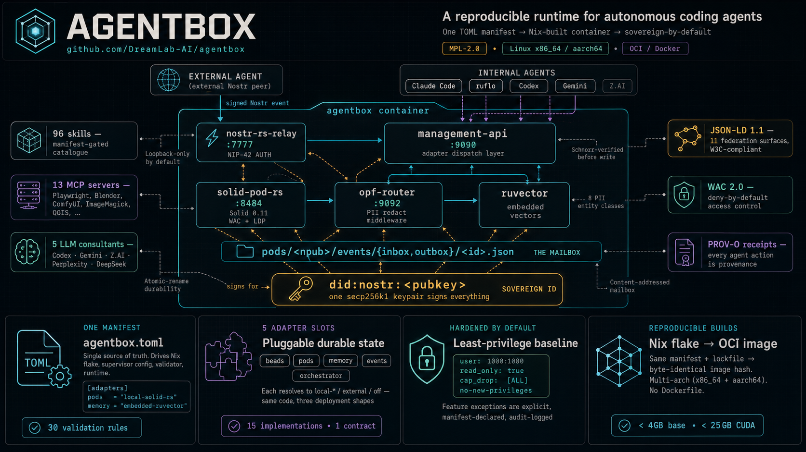

# Agentbox

<div align="center">



### A manifest-driven, reproducible runtime for sovereign software agents.

[](https://github.com/DreamLab-AI/agentbox/actions)
[](LICENSE)
[](flake.nix)
[](https://github.com/DreamLab-AI/agentbox/pkgs/container/agentbox)

One TOML manifest. One Nix flake. One runtime contract.

[Quickstart](#quickstart) · [Why Agentbox](#why-agentbox) · [Features](#features) · [Architecture](#architecture) · [Docs](docs/README.md) · [Contributing](#contributing)

</div>

---

## Why Agentbox

Most agent containers fail in one of four ways:

- they are mutable at boot, with `npm install` and `curl | bash` in the startup path
- they hardcode one backend mesh and cannot stand alone
- they expose a pile of tools but no durable runtime contract
- they emit interesting data but not in a form agents or humans can actually monitor and resolve

Agentbox takes the opposite shape. A single `agentbox.toml` manifest drives:

- the Nix package graph
- the generated runtime image
- the generated compose file
- the generated supervisor config
- the health, readiness, and observability contract

That gives you a container that can run standalone or federate into a larger system without changing codepaths. It can expose local storage, local relay, local orchestration, privacy-filtered linked-data surfaces, canonical URIs, and a browser for navigating emitted resources, while still being built as a pinned image rather than assembled live at boot.

## Quickstart

### Interactive onboarding

```sh
./scripts/start-agentbox.sh
./agentbox.sh up --build
./agentbox.sh health
```

### Non-interactive source build

```sh
git clone https://github.com/DreamLab-AI/agentbox.git
cd agentbox

./scripts/agentbox-config-validate.sh
./agentbox.sh up --build
./agentbox.sh health
./agentbox.sh shell
```

### Use the published image

```sh
export AGENTBOX_IMAGE_REF=ghcr.io/dreamlab-ai/agentbox:latest
docker pull "$AGENTBOX_IMAGE_REF"
./agentbox.sh up --registry
./agentbox.sh health
```

Main operator docs:

- [Quickstart](docs/user/quickstart.md)
- [Configuration](docs/user/configuration.md)
- [Running](docs/user/running.md)
- [Troubleshooting](docs/user/troubleshooting.md)

## What’s In The Current Platform

### Core runtime

- Manifest-driven Nix build with one generated runtime path
- Pluggable five-slot adapter architecture: `beads`, `pods`, `memory`, `events`, `orchestrator`
- Local, external, or `off` implementations per slot
- Immutable bootstrap: runtime dependencies are baked into the image, not installed on startup
- Multi-arch OCI images for `amd64` and `arm64`
- Generated compose + generated supervisord + generated runtime config from the same manifest

### Sovereign data stack

- First-party `solid-pod-rs` as the primary local pod server
- `did:nostr:<pubkey>` identity loop across relay, pod, credentials, and receipts
- Embedded Nostr relay and pod mailbox bridge
- Local privacy-filter sidecar with per-slot strict/soft/off policies
- Linked-data surfaces for pods, events, credentials, DID docs, provenance, capability descriptors, payments, memory catalogues, architecture docs, and HTTP meta
- Canonical URI grammar plus `/v1/uri/<urn>` resolver
- JSON-LD browser slot at `/lo/*` for navigating emitted resources

### Agent tooling

- Claude, Codex, Gemini, ruflo, claude-flow, agentic-qe, nagual-qe, codebase-memory
- Built-in and external MCP service support
- Playwright, ComfyUI, QGIS, Blender, LaTeX, report-builder, and browser automation paths
- Consultant tier for named external-model consultation workflows
- Desktop mode with tiled terminal workflows when enabled

### Operations and hardening

- `/livez`, `/ready`, `/health`, Prometheus metrics, OTLP support
- Hardened baseline: non-root, `read_only`, `cap_drop: [ALL]`, `no-new-privileges`
- Explicit feature exceptions instead of ambient privilege creep
- Backup/restore flow for runtime state
- Registry-image or local-build workflows using the same runtime contract

## Features

### Build and composition

| Capability                 | Summary                                                                          |
| -------------------------- | -------------------------------------------------------------------------------- |
| Reproducible builds        | Nix flake + pinned hashes + content-addressed image generation.                  |
| Manifest-gated composition | `agentbox.toml` controls what is built and what is run.                        |
| Runtime/image parity       | Compose, supervisor, image contents, and probes all come from the same manifest. |
| Immutable bootstrap        | No package-manager bootstrapping in the normal startup path.                     |
| Multi-arch publishing      | Local and registry workflows support `amd64` and `arm64`.                    |

### Runtime architecture

| Capability                 | Summary                                                                               |
| -------------------------- | ------------------------------------------------------------------------------------- |
| Five-slot adapters         | Durable integration seams for beads, pods, memory, events, and orchestration.         |
| Standalone or federated    | Same repo and runtime can self-host or plug into a host mesh.                         |
| Probe contract             | `/livez`, `/ready`, and `/health` are first-class runtime signals.              |
| Observability              | Structured logs, Prometheus metrics, OTLP export, and runtime metadata.               |
| Generated runtime contract | Image selection, ports, hardening, and sidecars are all derived, not hand-maintained. |

### Sovereign stack

| Layer          | Summary                                                                                        |
| -------------- | ---------------------------------------------------------------------------------------------- |
| Identity       | `did:nostr:<pubkey>` as the primary externally visible agent identifier.                     |
| Pods           | `solid-pod-rs` with Solid Protocol 0.11, WAC 2.0, rate limiting, quota, and webhook signing. |
| Relay          | Embedded Nostr relay plus inbox/outbox bridge.                                                 |
| Privacy        | Local `openai/privacy-filter` sidecar on adapter dispatch boundaries.                        |
| Linked data    | JSON-LD 1.1 surfaces across operational and domain resources.                                  |
| Canonical URIs | Stable names for emitted entities with a resolver endpoint.                                    |
| Browser        | Linked-data viewer that follows `@id` and renders resources by pane.                         |

### Newer linked-data and URI work

The platform now includes a real naming and browsing layer, not just emitters:

- [Canonical URIs](docs/user/uris.md): two shapes, `did:nostr:<pubkey>` for identity and `urn:agentbox:<kind>:[<scope>:]<local>` for everything else
- [URI resolver](docs/reference/adr/ADR-013-canonical-uri-grammar.md): `/v1/uri/<urn>` maps resolvable names to current representations
- [Linked-data browser](docs/user/browser.md): `/lo/*` serves a JSON-LD-aware browser and agentbox-specific panes
- [Linked-data surfaces](docs/user/linked-data.md): the external grammar spans pods, Nostr envelopes, VCs, DID docs, provenance, WoT, payments, DCAT, and docs metadata

This matters because the runtime now does more than expose APIs. It exposes a coherent namespace that agents and humans can inspect, dereference, and reason over.

### Agent and MCP layer

| Capability                | Summary                                                                      |
| ------------------------- | ---------------------------------------------------------------------------- |
| Consultant tier           | Named consultant MCPs for Codex, Gemini, Z.AI, Perplexity, and DeepSeek.     |
| MCP support               | Local MCP servers and external MCP-facing capabilities.                      |
| Browser automation        | Playwright and agent-browser paths.                                          |
| Media and spatial tooling | ComfyUI, ImageMagick, FFmpeg, Blender, QGIS, and 3DGS support paths.         |
| QE/orchestration tooling  | ruflo, claude-flow, agentic-qe, nagual-qe, and codebase-memory integrations. |

### Security and operations

| Capability              | Summary                                                                                  |
| ----------------------- | ---------------------------------------------------------------------------------------- |
| Hardened baseline       | Default container privileges are minimal and explicit.                                   |
| Feature exception model | Security deltas are declared in the manifest rather than silently accumulated.           |
| Secret hygiene          | Management keys and sovereign identity material are not shipped as default literals.     |
| Backup and restore      | Runtime state can be exported and restored using the project tooling.                    |
| Remote operations       | Provisioning and remote operation helpers exist for OCI, Fly, Hetzner, and bare targets. |

## Architecture

```mermaid
flowchart TB
    subgraph manifest["Manifest Contract"]
        M[agentbox.toml]
        V[validator]
    end

    subgraph build["Build"]
        F[flake.nix]
        I[OCI image]
        C[generated compose]
        S[generated supervisord]
    end

    subgraph runtime["Runtime"]
        API[management-api]
        AD[adapter resolver]
        POD[solid-pod-rs]
        RELAY[nostr relay]
        PF[privacy filter]
        LD[linked-data encoder]
        URI[/v1/uri resolver]
        VIEW[/lo browser]
    end

    M --> V
    M --> F
    F --> I
    F --> C
    F --> S
    I --> API
    S --> API
    API --> AD
    AD --> POD
    AD --> RELAY
    API --> PF
    API --> LD
    LD --> URI
    URI --> VIEW
```

Three rules matter more than anything else:

1. The manifest is the contract.
2. Adapters are the integration boundary.
3. Startup should realize the manifest, not invent new state.

Deeper reading:

- [Architecture overview](docs/developer/architecture.md)
- [PRD-001](docs/reference/prd/PRD-001-capabilities-and-adapters.md)
- [ADR-005](docs/reference/adr/ADR-005-pluggable-adapter-architecture.md)
- [PRD-006](docs/reference/prd/PRD-006-linked-data-interfaces.md)
- [ADR-013](docs/reference/adr/ADR-013-canonical-uri-grammar.md)

## Example flows

### Sovereign local agent box

- Generate a profile and build the image
- Start the local pod server, relay, and management API
- Emit JSON-LD surfaces for the resources you care about
- Resolve `did:nostr:<pubkey>` and `urn:agentbox:*` identifiers through the management API
- Browse those resources in `/lo/*`

### Runtime as a host-mesh client

- Set adapters to external implementations
- Keep the same operator and probe surface locally
- Route durable-state operations to the host environment
- Still use the same URI and linked-data model for visibility

### Build as a capability image

- Enable the toolchains and skills you want in `agentbox.toml`
- Validate
- Build once with Nix
- Run the same image locally, in CI, or via a registry ref

## Platforms

| Target        | Build               | Run                            | Notes                                                 |
| ------------- | ------------------- | ------------------------------ | ----------------------------------------------------- |
| Linux x86_64  | Native              | Native                         | Full support, including the richest local feature set |
| Linux aarch64 | Native              | Native                         | Supported, subject to feature-specific gates          |
| macOS         | Compose/dev tooling | Docker Desktop/OrbStack/Colima | Usually CPU or remote-GPU paths                       |
| Windows       | Compose/dev tooling | Docker Desktop + WSL2          | WSL2 is the practical path                            |
| Remote Linux  | Native or registry  | Native                         | OCI/Fly/Hetzner/bare workflows supported              |

See:

- [Platforms](docs/user/platforms.md)
- [Running](docs/user/running.md)
- [Consuming the image](docs/user/consuming-image.md)

## Documentation

### Operators

- [Quickstart](docs/user/quickstart.md)
- [Installation](docs/user/installation.md)
- [Configuration](docs/user/configuration.md)
- [Running](docs/user/running.md)
- [Providers](docs/user/providers.md)
- [Backup &amp; restore](docs/user/backup-restore.md)
- [Troubleshooting](docs/user/troubleshooting.md)

### Sovereign stack and linked data

- [Sovereign stack](docs/user/sovereign-stack.md)
- [Solid pod](docs/user/solid-pod.md)
- [Nostr relay](docs/user/nostr-relay.md)
- [Privacy filter](docs/user/privacy-filter.md)
- [Linked-data interfaces](docs/user/linked-data.md)
- [Canonical URIs](docs/user/uris.md)
- [JSON-LD browser](docs/user/browser.md)
- [Consultants](docs/user/consultants.md)

### Developers

- [Architecture](docs/developer/architecture.md)
- [Adapters](docs/developer/adapters.md)
- [Sovereign mesh](docs/developer/sovereign-mesh.md)
- [Linked-data middleware](docs/developer/linked-data.md)
- [Testing](docs/developer/testing.md)

### Canonical specs

- [ADR index](docs/reference/adr/)
- [PRD index](docs/reference/prd/)
- [DDD index](docs/reference/ddd/)
- [Docs hub](docs/README.md)

## Contributing

Start here:

1. Read [docs/developer/architecture.md](docs/developer/architecture.md).
2. Validate the manifest before changing build/runtime behavior.
3. Prefer manifest-gated additions over ad hoc runtime mutation.
4. Treat hardening, probe semantics, URI grammar, and linked-data surfaces as architectural changes, not incidental code tweaks.

For substantial behavior changes, the repo already uses ADR/PRD/DDD documents as the source of truth. Follow that pattern.

## License

Core project: [MPL-2.0](LICENSE).

Some optional integrated components carry their own licenses. The linked-data browser slot, for example, uses `linkedobjects/browser` under AGPL-3.0 when enabled. See the relevant docs and component files for details.

---

<div align="center">

[Documentation](docs/README.md) · [Issues](https://github.com/DreamLab-AI/agentbox/issues) · [Releases](https://github.com/DreamLab-AI/agentbox/releases) · [Container Registry](https://github.com/DreamLab-AI/agentbox/pkgs/container/agentbox)

</div>
