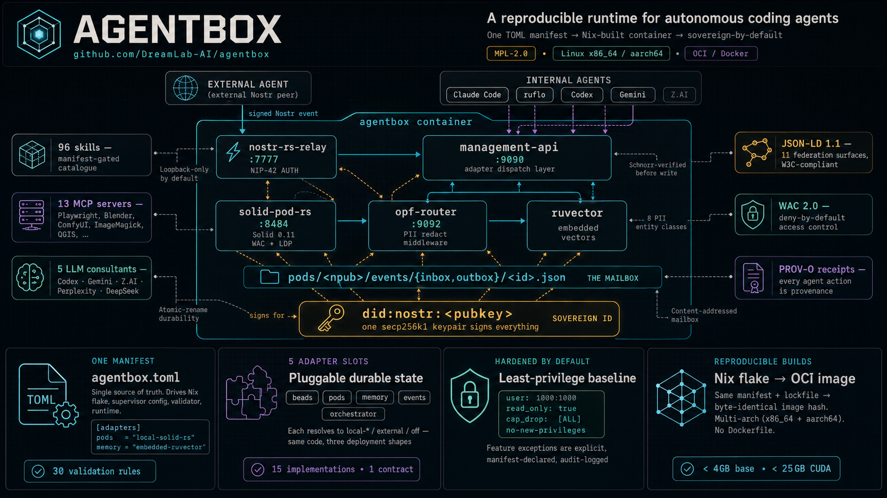
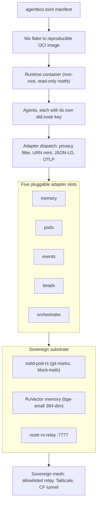
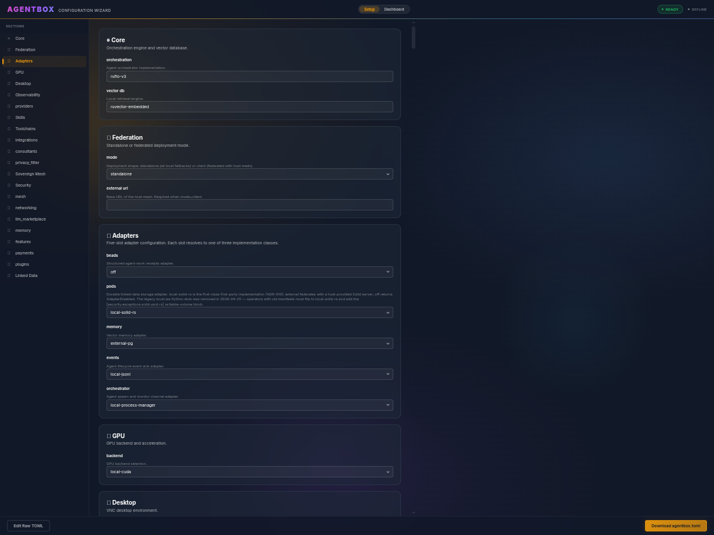

# Agentbox

<div align="center">



### A manifest-driven, reproducible runtime for sovereign software agents.

[](https://github.com/DreamLab-AI/agentbox/actions)
[](LICENSE)
[](flake.nix)
[](https://github.com/DreamLab-AI/agentbox/pkgs/container/agentbox)

**One TOML manifest. One Nix flake. One runtime contract.**

**Maintainer**: [John O'Hare](https://github.com/jjohare) · **Upstream IP**: [Melvin Carvalho](https://github.com/melvincarvalho) ([JSS](https://github.com/JavaScriptSolidServer/JavaScriptSolidServer), [DID:Nostr](https://github.com/nicholasgasior/did-nostr)) · [MAINTAINERS.md](MAINTAINERS.md)

[Quickstart](#quickstart) · [Why Agentbox](#why-agentbox) · [Capabilities](#included-capabilities) · [Sovereign data stack](#the-sovereign-data-stack) · [Status](#status--remaining-work) · [Docs](docs/README.md)

</div>

---

## What is Agentbox?

Agentbox is the **room the agents occupy**: a hardened, byte-for-byte reproducible Linux container built to host, orchestrate, and trace autonomous AI agents. Three verbs describe what it exists to give an operator — **reproduce** the runtime from a single manifest, **audit** every durable action back to a cryptographic identity, and **control** what agents may touch through explicit, fail-closed gates.

Instead of custom Dockerfiles, scattered API keys, and brittle dependency scripts, **everything in Agentbox is driven by one `agentbox.toml` manifest**. You declare the agents you want, the tools they need — from browser automation to 3D rendering — and the storage backends they use. Nix builds a reproducible image; the runtime mints each agent its own `did:nostr` key at spawn and routes every durable write (memory, pods, beads, events) through a local privacy-redaction filter and cryptographic audit trail.

Why the identity spine matters: when an agent acts, an operator has to answer *which* agent did it, and prove it later. Agentbox roots every resource, action, and event in one `did:nostr` keypair, so the graph of what happened is the audit trail — not a log you have to trust.

---

## Where Agentbox sits in the ecosystem

Agentbox is one component of **[VisionFlow](https://github.com/DreamLab-AI/VisionFlow)** — a seven-repo effort built on a simple wager: hierarchy was an information-routing protocol bounded by human bandwidth, AI collapses the cost of that routing toward zero, and so the human role is not eliminated but **promoted from router to judgment broker**. Machines carry coordination; humans keep judgment at the intersections. Agentbox is the runtime layer of that mesh — it runs the agents; the siblings render, govern, store, and publish what they do.

| Repo | Role |
|:-----|:-----|
| [VisionFlow](https://github.com/DreamLab-AI/VisionFlow) | Ecosystem canon — ADRs, PRDs, compatibility matrix, vision report, marketing site |
| [VisionClaw](https://github.com/DreamLab-AI/VisionClaw) | Flagship engine — OWL 2 EL + Whelk reasoning, 82 CUDA kernels of GPU graph physics, one React Three Fiber renderer shared desktop↔headset; renders the embodied agent loop |
| **Agentbox** (this repo) | **Sovereign agent runtime — Nix-built container, `did:nostr` identities, 116 skills, RuVector memory, Solid pod bridge, sovereign mesh** |
| [solid-pod-rs](https://github.com/DreamLab-AI/solid-pod-rs) | Rust Solid pod server — the personal-data-sovereignty layer under each human's and agent's own key |
| [nostr-rust-forum](https://github.com/DreamLab-AI/nostr-rust-forum) | Nostr-native forum + relay — the one place a human decision gets cryptographically signed |
| [dreamlab-ai-website](https://github.com/DreamLab-AI/dreamlab-ai-website) | DreamLab AI company website — the commercial face, a thin consumer of the forum kit |
| [narrativegoldmine](https://github.com/DreamLab-AI/knowledgeGraph) | The published public knowledge graph at [narrativegoldmine.com](https://narrativegoldmine.com) — `main` now also carries the corpus as an open dataset (7,457 pages, [mostly AI-generated by design](https://github.com/DreamLab-AI/knowledgeGraph/blob/main/docs/methodology/corpus-generation.md)) and the pipeline that builds it |

**Independent convergence.** In July 2026 Block (Jack Dorsey) launched [Buzz](https://github.com/block/buzz) — a self-hosted, Nostr-native team-chat + AI-agent + git platform in Rust. It arrives independently at the same substrate this ecosystem has built since 2022: Nostr events as source of truth, agents as first-class signed participants with their own keypairs, NIP-42/98 auth, kind-based extensibility. Agentbox mints exactly that per-agent keypair at spawn. What Buzz does not carry is our differentiation — OWL 2 EL / KG ontology grounding, Solid-pod personal-data sovereignty, immersive 3D embodiment, and closed memory/learning loops. Buzz is ahead of us in one place worth naming: its NIP-42 relay gate is wired end-to-end today, whereas cross-relay mesh federation is designed, not shipped, on both sides.

---

## Architecture

One manifest composes the image; every durable action flows through the adapter dispatch pipeline, is stamped with the agent's identity, and lands on the sovereign substrate.


```mermaid
flowchart TB
    MAN["agentbox.toml manifest"] --> NIX["Nix flake to reproducible OCI image"]
    NIX --> RT["Runtime container (non-root, read-only rootfs)"]
    RT --> AG["Agents, each with its own did:nostr key"]
    AG --> MW["Adapter dispatch: privacy filter, URN mint, JSON-LD, OTLP"]
    MW --> SLOTS
    subgraph SLOTS["Five pluggable adapter slots"]
        MEM["memory"]
        POD["pods"]
        EVT["events"]
        BEAD["beads"]
        ORC["orchestrator"]
    end
    SLOTS --> SUB
    subgraph SUB["Sovereign substrate"]
        SP["solid-pod-rs (git-marks, block-trails)"]
        RV["RuVector memory (bge-small 384-dim)"]
        NR["nostr-rs-relay :7777"]
    end
    SUB --> FED["Sovereign mesh: allowlisted relay, Tailscale, CF tunnel"]
```

Every durable-state integration goes through one of the five adapter slots — never a hardcoded backend. Each slot resolves to `local-*`, `external`, or `off`, so the same manifest runs entirely standalone on a laptop (SQLite + local JSONL) or federates into a cloud mesh (Postgres pgvector + HTTP event sinks) by flipping a TOML switch. Observability, the privacy filter ([ADR-008](docs/reference/adr/ADR-008-privacy-filter-routing.md)), and the JSON-LD encoder wrap every dispatch in that order.

---

## Why Agentbox?

- 🔒 **Privacy by default.** An embedded `openai/privacy-filter` sidecar sits in the adapter-dispatch path, redacting PII and secrets *before* durable writes hit memory or pods. Policy is **per slot** — `strict` (redact-then-write, fail-closed) for `memory` and `pods`, `soft` for `events`/`beads`, `off` for the `orchestrator` control plane. It is not a universal interceptor on every tool call; see [ADR-008](docs/reference/adr/ADR-008-privacy-filter-routing.md).
- 🛡️ **Hardened and reproducible.** Built with Nix flakes. Runs as non-root (uid 1000) with a read-only root filesystem, `cap_drop: ALL`, `no-new-privileges:true`, and a **supplemental seccomp denylist** (47 high-risk syscall denials layered on Docker's default profile — not a replacement allowlist; the container runtime is the security boundary). Published ports bind host-loopback only ([ADR-027](docs/reference/adr/ADR-027-default-secure-posture.md)). One remaining runtime-fetch path — a small set of `npx -y` CLI aliases — is tracked for SRI pinning in [`lib/npm-cli.nix`](lib/npm-cli.nix).
- 🔗 **Sovereign data and auditability.** Every generated file, memory, and action is stamped with a `did:nostr` identity and can be stored in an embedded Solid pod ([solid-pod-rs](https://github.com/DreamLab-AI/solid-pod-rs)). The provenance substrate makes writes traceable by construction: each write lands as a **git-mark** (write-as-commit + provenance sidecar), and high-value or disputed records can become **block-trails** — tamper-evident, hash-chained trails with an optional Bitcoin (taproot) anchor. See [The Sovereign Data Stack](#the-sovereign-data-stack).
- 🔌 **Pluggable adapters.** Five durable-state slots (beads, pods, memory, events, orchestrator), each `local` / `external` / `off`. Standalone or federated is one TOML switch, and the contract test harness must pass for all three implementation classes per slot.
- 🔀 **Ambidextrous model routing.** One `[model_routing]` policy maps each kind of work to the frontier host that suits it — Claude for specification, architecture, design, review, security analysis, debugging; Codex for implementation, testing, security scanning, documentation — projected at every boot into agentic-qe's per-agent `agentOverrides` (subscription-tier providers, `$0` marginal; cross-vendor escalation). See [ADR-041](docs/reference/adr/ADR-041-model-routing-one-policy-many-projections.md).

---

## Quickstart

### Interactive onboarding (recommended)

```sh
git clone https://github.com/DreamLab-AI/agentbox.git
cd agentbox
./scripts/start-agentbox.sh
```

The browser-based wizard renders every `agentbox.toml` section with schema-validated form controls (no dependency beyond Python 3 for the local HTTP server). Pass `--tui` for the legacy terminal wizard.

<div align="center">

<br><em>Browser-based configuration wizard with schema-driven form controls</em>
</div>

### Fast path (pre-built image)

```sh
export AGENTBOX_IMAGE_REF=ghcr.io/dreamlab-ai/agentbox:latest
docker pull "$AGENTBOX_IMAGE_REF"
./agentbox.sh up --registry
./agentbox.sh health
./agentbox.sh shell
```

### Build from source

```sh
git clone https://github.com/DreamLab-AI/agentbox.git
cd agentbox
./scripts/agentbox-config-validate.sh
./agentbox.sh up --build
./agentbox.sh health
```

Next steps: [Configuration](docs/user/configuration.md) · [Providers and API keys](docs/user/providers.md) · [Desktop mode and VNC](docs/user/running.md)

---

## Included Capabilities

Your `agentbox.toml` manifest toggles capabilities on or off. Disabled features add zero bloat to the final image.

| Category | Highlights |
| :--- | :--- |
| **Agent toolchains** | `claude-code`, `ruflo`, `antigravity` (agy), `agentic-qe`, `openai-codex` |
| **Consultants** | Meta-router for named external consultations: DeepSeek, Perplexity, Z.AI (GLM), Antigravity |
| **Browser and web** | External browsercontainer sidecar (chrome-devtools-mcp, Chrome Beta 149+, GPU-accelerated) |
| **Media and design** | Local ComfyUI (or external URL), ImageMagick, FFmpeg |
| **Spatial and 3D** | QGIS geospatial analysis, Blender modelling, 3D Gaussian Splatting |
| **Data science and docs** | PyTorch, Jupyter Lab, LaTeX, Mermaid rendering |
| **Code-as-Harness** | Persistent Python kernel MCP, ExpeL post-task lesson distillation, Voyager verified-skill library, SWE-agent ACI MCP, execution-gated tree-search ([PRD-008](docs/reference/prd/PRD-008-code-as-harness-integration.md)) |
| **Knowledge grounding** | RuvNet Brain corpus (~90k source chunks, 21+ RuvNet ecosystem repos) in the shared ruvector-postgres sidecar under the write-protected `ruvnet-kb` namespace — `search_ruvnet` MCP + a UserPromptSubmit grounding hook prevent hallucination about ruflo/ruvector/agentdb tooling |
| **Governance** | Agent Control Surface Protocol (kinds 31400–31405) — cross-repo human-in-the-loop integration with the DreamLab forum via the embedded relay; the producer (`management-api/lib/agent-control-surface.js`) mints and publishes the panel events. See [sovereign mesh](docs/developer/sovereign-mesh.md) |
| **Consumer economy** | Governed outbound payment pipeline ([PRD-015](docs/reference/prd/PRD-015-consumer-broadcast-economy.md) Phase 1): 402-scheme classifier, fail-closed spend-policy middleware, receipt + activity URNs on every spend attempt, `/.well-known/x402.json` discovery. Lightning-first — NWC/L402 is the only planned real-money rail. [ADR-032](docs/reference/adr/ADR-032-402-scheme-grammar.md) |
| **Embodied agent loop** | Bi-directional `/wss/agent-events` channel ([ADR-014](docs/reference/adr/ADR-014-bidirectional-graph-state-ingress.md)) — agents emit a canonical `agent_action` signal a host renders as a live actor (coloured beam + transient edge), and consume inbound user-interaction events. See [ADR-026](docs/reference/adr/ADR-026-cross-substrate-agent-loop-seams.md), [PRD-014](docs/reference/prd/PRD-014-embodied-agent-loop.md) |
| **Operations** | OTLP tracing, Prometheus metrics (`:9091/metrics`), Tailscale VPN integration |

Deep-dives: [Code-as-Harness](docs/developer/code-as-harness.md) · [Consumer economy loop](docs/developer/economy-loop.md) · [Project tracking](docs/reference/adr/ADR-035-project-tracking-telemetry-and-nostr-kind.md)

---

## The Sovereign Data Stack

The core differentiator of Agentbox is the **identity and tracing mesh**.

Agentbox generates a BIP-340 secp256k1 keypair at bootstrap. The agent's public key becomes a `did:nostr:<hex-pubkey>` identity, and **every resource, action, and event is rooted in it**. From that single root, 18 kinds of `urn:agentbox:<kind>:[<scope>:]<local>` identifiers name every entity: pods, credentials, receipts, activities, events, memories, skills, governance docs, and more. Owner-scoped kinds embed the hex pubkey — `urn:agentbox:credential:<hex-pubkey>:<sha256-12-…>` means that credential was issued by that agent and no other. Content-addressed kinds are deterministic: the same payload always produces the same URN, so re-emitting never double-counts.

| Surface | Where the DID appears |
|:--------|:----------------------|
| Login + relay auth | Nostr relay NIP-42 / NIP-98 HTTP signatures |
| WAC principal | Solid pod `acl:agent` field |
| DID Document | `GET /.well-known/did.json` |
| Provenance author | git-mark commits + activity URNs |

All URNs are minted through [`management-api/lib/uris.js`](management-api/lib/uris.js) — ad-hoc `format!()` or template-literal construction is prohibited. Because Agentbox uses canonical URIs and JSON-LD, the built-in [linked-object viewer](docs/user/linked-object-viewer.md) at `/lo/*` navigates the graph of an agent's memories, decisions, and credentials; `/v1/uri/<urn>` resolves any URN to its current HTTP representation (best-effort: 307/404/410).

**Provenance substrate.** The `solid-pod-rs` provenance release upgrades the pod backend into a trust ledger: git-marks make provenance the default (not an afterthought), and block-trails scale traceability from free (git/hash-chain) to settlement-grade (Bitcoin taproot anchor) per record. The deeper wiring — receipts carrying `git_commit_sha` + block-height trailers and crossing those trailers across the host-graph boundary — is the next increment, tracked in [economy-loop.md](docs/developer/economy-loop.md#what-remains).

Deeper reading: [Identity and tracing mesh](docs/developer/identity-mesh.md) · [ADR-013 — Canonical URI grammar](docs/reference/adr/ADR-013-canonical-uri-grammar.md) · [ADR-005 — Pluggable adapter architecture](docs/reference/adr/ADR-005-pluggable-adapter-architecture.md) · [PRD-006 — Linked-data interfaces](docs/reference/prd/PRD-006-linked-data-interfaces.md)

---

## Federation Transports

Agentbox participates in three federation strata, each enabled independently via `agentbox.toml` and `.env`.

- **Stratum 1 — Tailscale (private mesh).** Each container joins the tailnet with `--tun=userspace-networking` (no `/dev/net/tun`). Its MagicDNS hostname (from `[networking].hostname`) becomes the service-discovery address. Tailscale ACLs control access at this layer; `did:nostr` signatures are not evaluated here.
- **Stratum 2 — Nostr relays.** The embedded `nostr-rs-relay` (`:7777`) is both local event store and mesh relay. Governance events (kinds 31400–31405) stay on private relays; public relays provide censorship-resistant fallback. Traffic is authenticated via NIP-98/NIP-42 `did:nostr` Schnorr signatures.
- **Stratum 3 — Cloudflare tunnels (edge ↔ local).** A CF tunnel exposes the in-container solid-pod-rs to Workers services without opening public ports. Full runbook: [Native pod tunnel](docs/user/solid-pod-sidecar.md).

```toml
# agentbox.toml
[networking]
tailscale = true
hostname  = "agentbox-london"

[mesh]
peer_relays = [
    "ws://agentbox-paris.tailnet-name.ts.net:7777",  # Tailscale peer
    "wss://relay.damus.io",                          # Public relay
]
```

See [Tailscale guide](docs/user/tailscale.md) · [Mesh deployment](docs/user/mesh-deployment.md) · [Sovereign mesh](docs/developer/sovereign-mesh.md)

---

## Documentation

**Operators** — [Quickstart](docs/user/quickstart.md) · [Installation](docs/user/installation.md) · [Configuration](docs/user/configuration.md) · [Running](docs/user/running.md) · [Providers](docs/user/providers.md) · [Backup and restore](docs/user/backup-restore.md) · [Troubleshooting](docs/user/troubleshooting.md)

**Sovereign / linked data** — [Sovereign stack](docs/user/sovereign-stack.md) · [Solid pod](docs/user/solid-pod.md) · [Nostr relay](docs/user/nostr-relay.md) · [Privacy filter](docs/user/privacy-filter.md) · [Linked-data interfaces](docs/user/linked-data.md) · [Canonical URIs](docs/user/uris.md) · [Linked-object viewer](docs/user/linked-object-viewer.md) · [Consultants](docs/user/consultants.md)

**Developers** — [Architecture](docs/developer/architecture.md) · [Identity and tracing mesh](docs/developer/identity-mesh.md) · [Adapter pattern](docs/developer/adapters.md) · [Sovereign mesh](docs/developer/sovereign-mesh.md) · [Ecosystem integration](docs/developer/ecosystem.md) · [Testing](docs/developer/testing.md) · [Backlog / next steps](docs/developer/backlog.md)

**Reference** — [ADR index](docs/reference/adr/) · [PRD index](docs/reference/prd/) · [DDD index](docs/reference/ddd/) · [System audit 2026-07-15](docs/reference/audit-2026-07-15.md) · [Docs hub](docs/README.md)

---

## Status & remaining work

Honest state as of **2026-07-22**. Maturity words follow the ADR-002 ladder (*scaffolded / integrated / released*); the cross-repo work register is VisionClaw's [`docs/TODO-unified.md`](https://github.com/DreamLab-AI/VisionClaw), and agentbox detail lives in [docs/developer/backlog.md](docs/developer/backlog.md).

| Capability | Maturity | Honest boundary |
|:-----------|:---------|:----------------|
| Reproducible Nix container | released | Byte-for-byte image build; non-root, read-only rootfs, seccomp denylist. |
| Skills | released | **116** skills (validator schema fix landed 2026-07-22, C-6 — corrected from 115). |
| `did:nostr` identity spine | integrated | One keypair as login + WAC principal + provenance author + DID subject + payment account. |
| NIP-59 session mirror | released | Per-turn session mirror to the operator's phone via gift-wrapped self-DM. |
| RuVector semantic memory | integrated | Shared ruvector-postgres sidecar, bge-small-en-v1.5 (384-dim, client-side embeddings). |
| Learning loop | integrated | Capture→distil is **closed** (405 trajectories / 8,806 judged steps → 12 Wilson aggregates → 13 distilled patterns). The `feed_retrieval` / `feed_routing` consumers remain the open gates (`false`, awaiting the Wilson data floor, D-1). |
| ACSP signed governance (kinds 31400–31405) | integrated | Producer live; the forum's admin key publishes the Decision. Serves one use case today (ontology concept elevation) — narrower than a universal HITL claim. |
| Consumer economy (PRD-015) | integrated | Phase 1 shipped (in-mesh `agentbox-ledger` debit). Lightning settlement via NWC/L402 is Phase 3 — **not yet shipped**. |
| Code-as-Harness (PRD-008) | integrated | Phase 1 + 2 enabled in the manifest, **except** `tree-search-coder` — armed but unauthored; author or disarm (C-4). |
| Sovereign mesh | integrated (single-node) | Condense scheduler + relay allowlist live after the round-1 rebuild. The allowlist is baked but inert until the T-6 image rebuild exposes it fully; cross-relay / cross-org federation is **designed, not shipped**. |

Landed on 2026-07-22 (Tick-1): MCP-registry projection (C-5), secrets `0600` hardening (C-7), env consolidation (C-8). The next-rebuild payload (T-6) is entrypoint/source enforcement plus full mesh-allowlist exposure. A nix GPU library-path fallback (C-9) is pending if in-container GPU is wanted.

---

## Contributing

1. Read [docs/developer/architecture.md](docs/developer/architecture.md).
2. Validate the manifest before changing build or runtime behaviour.
3. Prefer manifest-gated additions over ad hoc runtime mutation.
4. Treat hardening, probe semantics, URI grammar, and linked-data surfaces as architectural changes — propose them via an ADR.

---

## License

Core project: [AGPL-3.0](LICENSE). Running Agentbox as a hosted service — including on behalf of other users — requires you to make the full source (including modifications) available to those users. Self-hosted and internal use carry no obligations beyond the standard copyleft terms. Optional components (`linkedobjects/browser`, `solid-pod-rs`) are also AGPL-3.0; other bundled components are MIT or Apache-2.0. See [Licensing details](docs/developer/licensing.md) for the full matrix.

---

<div align="center">

**Part of [VisionFlow](https://github.com/DreamLab-AI/VisionFlow)** — agentbox runs the agents; [VisionClaw](https://github.com/DreamLab-AI/VisionClaw) renders the embodied agent loop; [solid-pod-rs](https://github.com/DreamLab-AI/solid-pod-rs) stores sovereignly; the [forum](https://github.com/DreamLab-AI/nostr-rust-forum) and [website](https://github.com/DreamLab-AI/dreamlab-ai-website) provide governance and operator surfaces.

[Documentation](docs/README.md) · [Issues](https://github.com/DreamLab-AI/agentbox/issues) · [Releases](https://github.com/DreamLab-AI/agentbox/releases) · [Container Registry](https://github.com/DreamLab-AI/agentbox/pkgs/container/agentbox)

</div>
