# Agentbox

**Minimal Agentic Container for Claude Flow V3**

[](https://github.com/DreamLab-AI/agentbox)
[](https://nixos.org/)
[](LICENSE)
[](skills/)
[](https://github.com/ChrisRoyse/610ClaudeSubagents)
[](aisp/)

A lightweight, reproducible container optimized for headless agentic workloads. Built with NixOS Flakes targeting Oracle Cloud ARM free tier.

## Why Agentbox?


## Key Features

| Feature | Description |
|---------|-------------|
| **66 Skills** | Core development, Claude Flow V3, AgentDB, Flow Nexus, GitHub, AI/Media |
| **610+ Subagents** | Pre-loaded Claude agent templates (auto-cloned on first run) |
| **AISP 5.1 Platinum** | Neuro-symbolic AI-to-AI protocol with Hebbian learning |
| **RuVector** | Standalone Rust vector database (no PostgreSQL) |
| **Guidance Control Plane** | 10x-100x extended autonomy with enforcement gates |
| **Multi-Architecture** | ARM64 (Oracle Cloud) + x86_64 support |

## Architecture


## Quick Start

### Prerequisites

- [Nix](https://nixos.org/download.html) with flakes enabled
- Docker (for running built images)

### Build

```bash
# Clone repository
git clone https://github.com/DreamLab-AI/agentbox.git
cd agentbox

# Build for your architecture
nix build .#runtime      # Headless runtime image
nix build .#full         # Combined full image
nix build .#desktop      # Desktop with VNC

# Load into Docker
docker load < result
```

### Run

```bash
# Start container
docker run -d \
  --name agentbox \
  -p 22:22 \
  -p 9090:9090 \
  -p 9700:9700 \
  -v agentbox-workspace:/home/devuser/workspace \
  -v agentbox-agents:/home/devuser/agents \
  agentbox:runtime-aarch64-linux

# Or with docker-compose
docker-compose up -d
```

### Development Shell

```bash
# Enter development environment
nix develop

# All tools available: node, python, rust, wasm-pack, gcloud, etc.
```

## Services


| Port | Service | Access | Description |
|------|---------|--------|-------------|
| 22 | SSH | Public | Secure shell access |
| 5901 | VNC | SSH Tunnel | Remote desktop (desktop image) |
| 8080 | code-server | Optional | Web IDE |
| 9090 | Management API | Public | Container management |
| 9500 | MCP TCP | Internal | MCP protocol |
| 9600 | Z.AI | Internal | Cost-effective Claude proxy |
| 9700 | RuVector | Public | Vector database API |
| 9701 | RuVector MCP | Internal | MCP integration |

## AISP 5.1 Platinum Integration

Neuro-symbolic AI-to-AI communication protocol with Hebbian learning.

```mermaid
graph TB
    subgraph "AISP Architecture"
        subgraph "Pocket Structure"
            H[ℋ Header<br/>ID, Signal V, Flags]
            M[ℳ Membrane<br/>Affinity, Confidence, Tags]
            N[𝒩 Nucleus<br/>Definition, IR, WASM]
        end

        subgraph "Binding States"
            B0[0: Crash<br/>Logic Conflict]
            B1[1: Null<br/>Socket Mismatch]
            B2[2: Adapt<br/>Type Transform]
            B3[3: Zero-Cost<br/>Post ⊆ Pre]
        end

        subgraph "Quality Tiers"
            T1[◊⁺⁺ Platinum<br/>δ≥0.75]
            T2[◊⁺ Gold<br/>δ≥0.60]
            T3[◊ Silver<br/>δ≥0.40]
            T4[◊⁻ Bronze<br/>δ≥0.20]
        end
    end

    H --> M --> N
    B0 --> B1 --> B2 --> B3

    style H fill:#fcd34d,color:#000
    style M fill:#fb923c,color:#fff
    style N fill:#f97316,color:#fff
    style B3 fill:#10b981,color:#fff
    style T1 fill:#fcd34d,color:#000
```



### Usage

```bash
# Validate AISP document
aisp validate document.md

# Check binding compatibility
aisp binding agent-a agent-b

# Initialize pocket store
aisp init

# Benchmark performance
aisp benchmark
```

### Parameters

| Parameter | Value | Description |
|-----------|-------|-------------|
| α (alpha) | 0.1 | Hebbian confidence increase rate |
| β (beta) | 0.05 | Hebbian confidence decrease rate |
| τ_v | 0.7 | Affinity threshold for skip |
| V_H | 768 | High-level semantic dimensions |
| V_L | 512 | Low-level topological dimensions |
| V_S | 256 | Safety constraint dimensions |

## 610+ Claude Subagents

Pre-loaded agent templates auto-cloned from [ChrisRoyse/610ClaudeSubagents](https://github.com/ChrisRoyse/610ClaudeSubagents).

```bash
# List available agents
agent-list

# Load specific agent
agent-load doc-planner

# View agent count
ls $AGENTS_DIR/*.md | wc -l
```

### Key Agents

| Agent | Purpose |
|-------|---------|
| `doc-planner` | Documentation strategy |
| `microtask-breakdown` | Task decomposition |
| `github-pr-manager` | PR workflow automation |
| `tdd-london-swarm` | Test-driven development |
| `api-designer` | API specification |
| `security-auditor` | Security analysis |

## RuVector Vector Database

Standalone Rust-native vector database — **NO PostgreSQL required**.


### Features

- **HNSW Indexing** — 150x-12,500x faster similarity search
- **GNN Layers** — GCN, GraphSAGE, GAT, GIN operations
- **Self-Learning** — ReasoningBank pattern recognition
- **384-dim Embeddings** — all-MiniLM-L6-v2 compatible
- **MCP Integration** — Native Claude Code/Flow support

### Usage

```bash
# Start RuVector server
npx ruvector serve --port 9700 --data-dir /var/lib/ruvector

# Start MCP server for Claude integration
npx ruvector mcp --port 9701

# CLI operations
npx ruvector --help
```

## Guidance Control Plane

Governance backbone enabling **10x-100x extended autonomy**.


### Impact

| Metric | Without | With Control Plane | Improvement |
|--------|---------|-------------------|-------------|
| Autonomy Duration | Minutes | Days to Weeks | **10x-100x** |
| Destructive Actions | Common | Rare | **50-90% reduction** |
| Memory Corruption | Frequent | Blocked | **70-90% reduction** |
| Prompt Injection | Vulnerable | Detected | **80-95% reduction** |

## Skills (66)


### Skill Categories

| Category | Count | Key Skills |
|----------|-------|------------|
| Core Development | 7 | build-with-quality, rust-development, guidance-control-plane |
| Claude Flow V3 | 9 | v3-core-implementation, v3-swarm-coordination |
| AgentDB & Memory | 7 | agentdb-advanced, reasoningbank-intelligence |
| Flow Nexus | 3 | flow-nexus-neural, flow-nexus-swarm |
| AI & Media | 9 | blender, comfyui, cuda, gemini-url-context |
| Swarm | 4 | hive-mind-advanced, sparc-methodology |
| GitHub | 5 | github-code-review, github-workflow-automation |
| Browser & Automation | 12 | playwright, chrome-devtools, web-summary |
| Other | 10 | docker-manager, ffmpeg-processing, jupyter-notebooks |

## Turbo Flow Aliases (120+)

Quick command access via turbo-flow-aliases.sh:

```bash
# Source aliases
source /home/devuser/.config/turbo-flow-aliases.sh

# Or they're auto-loaded in zsh
```

### Essential Aliases

| Alias | Command | Description |
|-------|---------|-------------|
| `cf` | `npx @claude-flow/cli@latest` | Claude Flow CLI |
| `cf-swarm` | `cf swarm` | Swarm orchestration |
| `cf-hive` | `cf hive-mind spawn` | Hive-mind agents |
| `cf-doctor` | `cf doctor --fix` | System diagnostics |
| `af-coder` | `agentic-flow --agent coder` | Agentic Flow coder |
| `aqe` | `agentic-qe` | Testing framework |
| `aj` | `agentic-jujutsu` | Quantum-resistant git |
| `gf-swarm` | `gemini-flow swarm` | Gemini 66-agent swarm |
| `turbo-help` | (function) | Quick reference |
| `agent-load` | (function) | Load subagent template |

### Helper Functions

```bash
# Initialize workspace
turbo-init

# Load agent template
agent-load doc-planner

# List all agents
agent-list

# Quick reference
turbo-help
```

## Swarm Orchestration


### Topologies


## Runtime Packages

Installed via npm on first run or on-demand via npx:

| Package | Version | Purpose |
|---------|---------|---------|
| `@claude-flow/cli` | latest | V3 swarm orchestration |
| `agent-browser` | latest | AI-optimized browser automation |
| `@claude-flow/browser` | latest | Browser MCP integration |
| `agentic-flow` | latest | Multi-agent flow orchestration |
| `agentic-qe` | latest | Testing framework (51 agents) |
| `agentic-jujutsu` | latest | Quantum-resistant git |
| `ruvector` | latest | Standalone vector database |
| `agentdb` | latest | Agent memory database |
| `gemini-flow` | latest | Google Gemini integration |
| `claude-usage-cli` | latest | Usage tracking |

## Target Platform

Optimized for **Oracle Cloud Free Tier ARM Ampere A1**:

| Resource | Allocation |
|----------|------------|
| CPU | 4 ARM cores |
| RAM | 24 GB |
| Storage | 200 GB |
| Cost | **Free** |

## VNC Remote Desktop

The desktop image includes minimal VNC via SSH tunnel:

```bash
# Build desktop image
nix build .#desktop

# Run container
docker run -d --name agentbox -p 22:22 agentbox:desktop-aarch64-linux

# Start VNC services
docker exec agentbox supervisorctl start vnc:*

# Create SSH tunnel (from local machine)
ssh -L 5901:localhost:5901 devuser@<host>

# Connect VNC client to localhost:5901
```

Components: Xvfb + x11vnc + openbox (~150MB overhead)

## Not Included

Intentionally excluded for minimal footprint:

| Excluded | Reason | Alternative |
|----------|--------|-------------|
| GPU/CUDA Runtime | No NVIDIA dependencies | Use cuda skill docs only |
| Desktop Environment | Headless only | VNC via SSH tunnel |
| ComfyUI Runtime | Heavy dependencies | External container, use comfyui skill |
| Blender Runtime | GUI application | External container, use blender skill |
| Full LaTeX | Large footprint | Use external service |
| PyTorch GPU | CUDA dependencies | CPU-only inference |

## Directory Structure

```
agentbox/
├── flake.nix              # NixOS container definitions
├── CLAUDE.md              # Project configuration
├── config/
│   ├── supervisord.conf   # Service management
│   ├── turbo-flow-aliases.sh  # 120+ aliases
│   └── claude-flow-config.json
├── skills/                # 66 essential skills
│   ├── build-with-quality/
│   ├── claude-flow-browser/
│   ├── flow-nexus-*/
│   ├── gemini-url-context/
│   └── ...
├── aisp/                  # AISP 5.1 Platinum
│   ├── index.js           # Core implementation
│   ├── cli.js             # CLI interface
│   └── benchmark.js       # Performance testing
├── mcp/                   # MCP infrastructure
├── management-api/        # Express.js API
├── claude-zai/            # Z.AI proxy service
├── https-bridge/          # HTTPS bridging
└── docs/
    ├── guides/            # How-to guides
    ├── adr/               # Architecture decisions
    └── reference/         # API reference
```

## Documentation

| Document | Description |
|----------|-------------|
| [CLAUDE.md](CLAUDE.md) | Project configuration |
| [docs/guides/quick-start.md](docs/guides/quick-start.md) | Getting started guide |
| [docs/adr/ADR-001-nixos-flakes.md](docs/adr/ADR-001-nixos-flakes.md) | NixOS architecture |
| [docs/adr/ADR-002-ruvector-standalone.md](docs/adr/ADR-002-ruvector-standalone.md) | RuVector design |
| [docs/adr/ADR-003-guidance-control-plane.md](docs/adr/ADR-003-guidance-control-plane.md) | Governance design |

## Contributing

1. Fork the repository
2. Create a feature branch
3. Make changes following ADR guidelines
4. Run `nix build` to verify
5. Submit a pull request

## License

MIT License — See [LICENSE](LICENSE) for details.

---

<p align="center">
  Built with NixOS Flakes for reproducibility<br/>
  Designed for Oracle Cloud ARM free tier<br/>
  Powered by Claude Flow V3 + AISP 5.1 Platinum<br/>
  <br/>
  <strong>66 Skills • 610+ Subagents • 120+ Aliases</strong>
</p>
