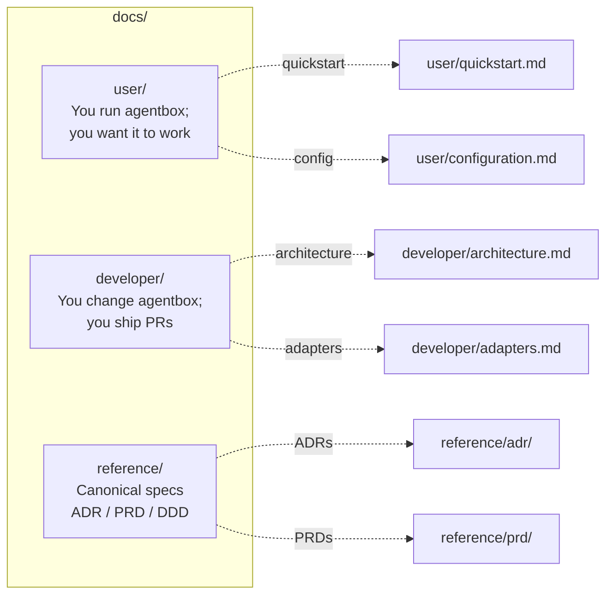

# Agentbox documentation

Audience-tiered navigation. Pick the path that matches what you are trying to do.

---

## User docs — for operators

You have a machine, you want agentbox running on it, ideally with as little fuss as possible.

| Start here | |
|---|---|
| [Glossary & orientation](user/glossary.md) | Zero-to-one for people new to headless agent runtimes |
| [Quickstart](user/quickstart.md) | First boot in ten minutes |
| [Installation](user/installation.md) | Per-OS install paths (Linux, macOS, Windows, remote) |
| [Configuration](user/configuration.md) | `agentbox.toml` reference — every section, every key |
| [Running](user/running.md) | Copy-paste recipes per host × arch × GPU |
| [Platforms](user/platforms.md) | Compatibility matrix: what works where |
| [Troubleshooting](user/troubleshooting.md) | Common failure modes and fixes |

| Day-2 operations | |
|---|---|
| [Providers](user/providers.md) | API-key management — `[providers.*]` manifest sections |
| [Backup & restore](user/backup-restore.md) | `agentbox.sh backup / restore` — what's included, secrets handling |
| [Consuming the image](user/consuming-image.md) | GHCR registry tags, multi-arch manifest |
| [Provisioning remote hosts](user/provisioning.md) | `agentbox.sh provision --target oci \| fly \| hetzner \| bare` |

| Sovereign data stack — key parts of the DreamLab-AI ecosystem | |
|---|---|
| [**Sovereign stack — end to end**](user/sovereign-stack.md) | **Start here.** One-page walkthrough of identity → pod → relay → privacy-filter with verifiable commands |
| [Solid pod (solid-pod-rs)](user/solid-pod.md) | First-party Rust Solid Protocol 0.11 server — durable storage, WAC 2.0, did:nostr, atomic-rename, quota, rate-limit |
| [Nostr relay](user/nostr-relay.md) | External-agent messaging over an embedded Nostr relay with pod-inbox bridge — including the **Agent Control Surface Protocol** (kinds 31400-31405) for cross-repo governance with the forum (`nostr-bbs-core` governance module) and VisionClaw's BrokerActor |
| [Privacy filter](user/privacy-filter.md) | Local PII redaction sidecar (openai/privacy-filter) as adapter middleware |
| [Linked-Data interfaces](user/linked-data.md) | Eleven JSON-LD federation surfaces — pods / Nostr envelopes / VCs / DID Docs / PROV-O / WoT / skills / payments / DCAT / arch-docs / HTTP meta |
| [Canonical URIs](user/uris.md) | The URI grammar that names every emitted resource — `did:nostr:<pubkey>` + `urn:agentbox:<kind>:[<scope>:]<local>`, content-addressed, unconditionally unique, best-effort resolvable |
| [JSON-LD browser](user/browser.md) | The S12 viewer slot — every emitted document one URL away, pane-dispatched by `@type`, follows URIs through `/v1/uri/<urn>` |
| [Consultants — meta-router](user/consultants.md) | Five MCP servers exposing Codex / Antigravity / Z.AI / Perplexity / DeepSeek as labelled consultants the coordinator can invoke explicitly |

| Feature guides | |
|---|---|
| [3DGS (COLMAP + METIS + LichtFeld)](user/3dgs.md) | 3D Gaussian Splatting pipeline |
| [Blender](user/blender.md) | Blender toolchain |
| [ComfyUI](user/comfyui.md) | Built-in vs external ComfyUI |
| [LaTeX](user/latex.md) | TeX Live full |

---

## Developer docs — for contributors

You are adding a feature, implementing an adapter, or investigating a regression.

| Architecture | |
|---|---|
| [Architecture overview](developer/architecture.md) | How it all fits together — manifest → flake → image → runtime |
| [Identity and tracing mesh](developer/identity-mesh.md) | secp256k1 identity root, 18-kind URN namespace, adapter dispatch pipeline, credential provenance, federation invariants |
| [Adapter pattern](developer/adapters.md) | Five slots × three classes; how to write a new impl |
| [Sovereign mesh](developer/sovereign-mesh.md) | Nostr client + NIP-98 auth + relay pool internals |
| [Linked-Data middleware](developer/linked-data.md) | Encoder + ContextResolver + LION linter + JCS — surface authoring guide |
| [Ecosystem integration](developer/ecosystem.md) | Agentbox's role in the five-substrate DreamLab federation mesh |
| [Skills upgrade path](developer/skills-upgrade.md) | Migrating from `path:./skills` to a standalone repo |

| Tooling | |
|---|---|
| [Testing](developer/testing.md) | Suite shape, running locally, CI wiring |
| [Version tracking](developer/version-tracking.md) | Renovate + `nix flake update` workflow |

---

## Reference — canonical specs

These are the authoritative sources of truth. Anything in `user/` or `developer/` that conflicts with these is a bug in the docs.

### Architecture decisions (ADR)

| # | Document | Status | Decision |
|---|---|---|---|
| ADR-001 | [Nix flake build](reference/adr/ADR-001-nixos-flakes.md) | Accepted | Manifest-driven Nix flake replaces the monolithic Dockerfile |
| ADR-002 | [RuVector as embedded retrieval](reference/adr/ADR-002-ruvector-standalone.md) | Accepted | Local retrieval cache, not a source of truth |
| ADR-003 | [Guidance control plane](reference/adr/ADR-003-guidance-control-plane.md) | Accepted | Enforcement gates for autonomous agents |
| ADR-004 | [Upstream sync boundaries](reference/adr/ADR-004-upstream-sync.md) | Accepted | Selective sync, not mechanical |
| ADR-005 | [Pluggable adapter architecture](reference/adr/ADR-005-pluggable-adapter-architecture.md) | Accepted | Five-slot adapters × three impl classes |
| ADR-006 | [Immutable runtime bootstrap](reference/adr/ADR-006-immutable-runtime-bootstrap.md) | Accepted | No dependency resolution at startup |
| ADR-007 | [Runtime contract + hardening](reference/adr/ADR-007-runtime-contract-and-container-hardening.md) | Accepted | Image ref + probes + observability + hardening as one contract |
| ADR-008 | [Privacy filter routing](reference/adr/ADR-008-privacy-filter-routing.md) | Accepted | Local openai/privacy-filter sidecar as cross-cutting adapter middleware |
| ADR-009 | [Embedded Nostr relay](reference/adr/ADR-009-embedded-nostr-relay.md) | Accepted | nostr-rs-relay + pod-inbox bridge for external-agent messaging |
| ADR-010 | [solid-pod-rs as first-class pod server](reference/adr/ADR-010-rust-solid-pod-adoption.md) | Accepted | First-party Rust Solid Protocol 0.11 server; default pods implementation |
| ADR-011 | [Consultation MCP servers](reference/adr/ADR-011-consultation-mcps.md) | Accepted | Coordinator + named-consultant pattern; rejects transparent API rewriting as the meta-router |
| ADR-012 | [JSON-LD 1.1 as the federation interchange grammar](reference/adr/ADR-012-jsonld-federation-grammar.md) | Accepted | JSON-LD as the third cross-cutting middleware after observability and privacy; LION subset for hand-authored docs |
| ADR-013 | [Canonical URI grammar and resolver](reference/adr/ADR-013-canonical-uri-grammar.md) | Accepted | `did:nostr:<pubkey>` + `urn:agentbox:<kind>:[<scope>:]<local>`; uniqueness unconditional, resolvability best-effort; `/v1/uri/<urn>` resolver |
| ADR-014 | [Bi-directional graph-state ingress](reference/adr/ADR-014-bidirectional-graph-state-ingress.md) | Accepted | Bi-directional graph-state ingress for agent reaction |
| ADR-015 | [MCP ruvector-postgres mandate](reference/adr/ADR-015-mcp-ruvector-mandate.md) | Accepted | `ruvector-mcp.cjs` fails closed if PostgreSQL is unreachable; no silent sql.js fallback |
| ADR-016 | [License consolidation](reference/adr/ADR-016-license-consolidation.md) | Accepted | AGPL-3.0-only end-to-end; aggregation analysis for all third-party components |
| ADR-017 | [Multi-tenant did:nostr pods](reference/adr/ADR-017-multi-tenant-did-nostr-pods.md) | Proposed | Per-tenant did:nostr identity; pod-per-tenant allocation and NIP-98 scoping |
| ADR-018 | [Persistent code-interpreter MCP](reference/adr/ADR-018-persistent-code-interpreter-mcp.md) | Accepted | Long-lived kernel sessions + CodeAct skill; execution-trace URN emission |
| ADR-019 | [Experiential skill learning](reference/adr/ADR-019-experiential-skill-learning.md) | Accepted | Distilled lessons and verified skill library from execution traces |
| ADR-020 | [ACI MCP tree-search](reference/adr/ADR-020-aci-mcp-tree-search.md) | Proposed | ACI MCP and execution-gated tree-search for agent capability improvement |
| ADR-021 | [LLM resource marketplace kinds](reference/adr/ADR-021-llm-resource-marketplace-kinds.md) | Accepted | Nostr kind schema for LLM resource listings, bids, and receipts |
| ADR-022 | [Runtime integrity hardening](reference/adr/ADR-022-runtime-integrity-hardening.md) | Accepted | Immutable image digests, SBOM attestation, and supply-chain verification |
| ADR-023 | [Ontology bridge](reference/adr/ADR-023-ontology-bridge.md) | Proposed | VisionClaw ontology bridge via MCP; BC20 anti-corruption layer |
| ADR-024 | [Setup dashboard architecture](reference/adr/ADR-024-setup-dashboard.md) | Accepted | Setup wizard and operations dashboard — browser-based, zero-dependency |
| ADR-025 | [Multi-Harness tmux Architecture](reference/adr/ADR-025-multi-harness-tmux-architecture.md) | Accepted | Multi-harness tmux layout for parallel agent workstreams |

### Product requirements (PRD)

| # | Document | Summary |
|---|---|---|
| PRD-001 | [Capabilities and adapters](reference/prd/PRD-001-capabilities-and-adapters.md) | Agentbox as a standalone product |
| PRD-002 | [Immutable runtime bootstrap](reference/prd/PRD-002-immutable-runtime-bootstrap.md) | Remove mutable dep-install from startup |
| PRD-003 | [Runtime contract + container hardening](reference/prd/PRD-003-runtime-contract-and-container-hardening.md) | Image selection + probes + observability + hardening |
| PRD-004 | [External agent messaging](reference/prd/PRD-004-external-agent-messaging.md) | Sovereign relay surface + pod-inbox bridge |
| PRD-005 | [Meta-router and consultant tier](reference/prd/PRD-005-meta-router-consultants.md) | Five consultant MCPs + manual `/consult` + automatic `auto-consultant` subagent |
| PRD-006 | [Linked-data interfaces and JSON-LD compatible surfaces](reference/prd/PRD-006-linked-data-interfaces.md) | Eleven federation surfaces, pinned context catalogue, LION authoring subset |
| PRD-007 | [Multi-tenant federation](reference/prd/PRD-007-multi-tenant-federation.md) | Per-tenant did:nostr identity, pod allocation, and NIP-98 scoping at scale |
| PRD-008 | [Code-as-harness integration](reference/prd/PRD-008-code-as-harness-integration.md) | Persistent kernel sessions, CodeAct skill, execution traces, and skill library |
| PRD-009 | [LLM resource marketplace](reference/prd/PRD-009-llm-resource-marketplace.md) | Nostr-native marketplace for LLM compute listings, bids, and payments |
| PRD-010 | [Runtime integrity hardening](reference/prd/PRD-010-runtime-integrity-hardening.md) | Immutable image digests, SBOM attestation, and supply-chain policy gates |
| PRD-011 | [Ontology bridge](reference/prd/PRD-011-ontology-bridge.md) | VisionClaw ontology bridge exposing knowledge-graph concepts via MCP |
| PRD-012 | [Setup wizard and operations dashboard](reference/prd/PRD-012-setup-dashboard.md) | Browser-based first-boot wizard and day-2 ops dashboard |
| PRD-013 | [Multi-harness tmux architecture](reference/prd/PRD-013-multi-harness-tmux-architecture.md) | Multi-harness tmux layout and documentation revamp |

### Domain design (DDD)

| # | Document | Focus |
|---|---|---|
| DDD-001 | [Immutable bootstrap domain](reference/ddd/DDD-001-immutable-bootstrap-domain.md) | RuntimeClosure aggregate + BootstrapPolicy |
| DDD-002 | [Runtime contract domain](reference/ddd/DDD-002-runtime-contract-domain.md) | ImageReferencePolicy + ProbeContract + ObservabilityBinding + SecurityProfile |
| DDD-003 | [Sovereign messaging domain](reference/ddd/DDD-003-sovereign-messaging-domain.md) | AgentIdentity + PodMailbox + RelayEndpoint + inbound/outbound envelopes |
| DDD-004 | [Linked-data interchange domain](reference/ddd/DDD-004-linked-data-interchange-domain.md) | ContextCatalogue + FederationSurface + EncodingPipeline + LinkedResource + LIONDocument |
| DDD-005 | [Code execution domain](reference/ddd/DDD-005-code-execution-domain.md) | KernelSession + ExecutionTrace + DistilledLesson + VerifiedSkill aggregates |
| DDD-006 | [LLM marketplace domain](reference/ddd/DDD-006-llm-marketplace-domain.md) | Listing + Bid + Settlement + ProviderProfile aggregates; Nostr kind mappings |
| DDD-007 | [Runtime integrity domain](reference/ddd/DDD-007-runtime-integrity-domain.md) | ImagePolicy + SBOMAttestation + SupplyChainVerifier aggregates |
| DDD-008 | [Ontology bridge domain](reference/ddd/DDD-008-ontology-bridge-domain.md) | OntologyMapping + ConceptResolver + BC20 anti-corruption layer |
| DDD-009 | [Setup dashboard domain](reference/ddd/DDD-009-setup-dashboard-domain.md) | WizardSession + ConfigBlob + HealthSnapshot + OperationsDashboard |
| DDD-010 | [Multi-Harness Coordination Domain](reference/ddd/DDD-010-multi-harness-coordination-domain.md) | HarnessSession + WorkstreamRouter + TmuxLayout aggregates |
| DDD-011 | [Multi-Tenant Federation Domain](reference/ddd/DDD-011-multi-tenant-federation-domain.md) | FederationPeer + MeshTopology + TenantIsolation aggregates |

### QE Reviews

| # | Document | Title | Status |
|---|---|---|---|
| QE-001 | [PRD-008 / ADR-018 / ADR-019 / DDD-005 traceability review](reference/qe-reviews/QE-001-code-as-harness-traceability-review.md) | Code-as-harness traceability review | Complete |
| QE-002 | [QE-001 defect re-verification](reference/qe-reviews/QE-002-code-as-harness-reverification.md) | Re-verification of QE-001 defects on PRD-008 / ADR-018–020 / DDD-005 | Complete |

### Vocabulary

| File | Contents |
|---|---|
| [`reference/_vocab/agbx.md`](reference/_vocab/agbx.md) | Canonical agentbox term definitions — abbreviations, domain vocabulary, and naming conventions used across all reference documents |

---

## Reading order for new contributors

1. [`../README.md`](../README.md) — 5 minutes, product pitch + architecture
2. [`user/quickstart.md`](user/quickstart.md) — build and run
3. [`developer/architecture.md`](developer/architecture.md) — how it works inside
4. [`reference/prd/PRD-001-capabilities-and-adapters.md`](reference/prd/PRD-001-capabilities-and-adapters.md) — full product spec
5. [`reference/adr/ADR-005-pluggable-adapter-architecture.md`](reference/adr/ADR-005-pluggable-adapter-architecture.md) — adapter deep-dive
6. The other ADRs in order — they explain how we got here

## Conventions

- **Plain markdown.** No binary images in docs. Diagrams are Mermaid blocks.
- **Relative cross-refs.** Every link is a relative path so the docs tree is portable.
- **File size limit.** Docs stay under 500 lines; heavier material lives in siblings (`REFERENCE.md`, `EXAMPLES.md`).
- **Status tags.** ADRs carry `Status:` at the top; PRDs carry a version block.
- **Audience tiers are strict.** `user/` never references internal-only tooling; `developer/` never re-explains operator basics; `reference/` never loses a canonical claim to narrative drift.
- **UK English.** All documentation uses British spelling (organisation, colour, initialise, behaviour, centre, analyse, etc.).
