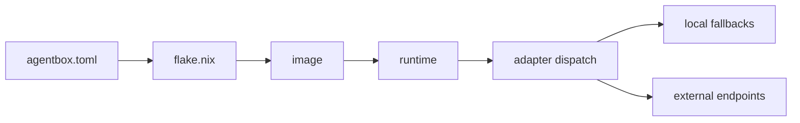

# Agentbox documentation

Navigation hub. Start here.

## What is this?

Agentbox is a Nix-declarative container runtime for hosting software agents (Claude Code, ruflo, and similar) with their skills and toolchains. See [`../README.md`](../README.md) for the product pitch and [`prd/PRD-001-capabilities-and-adapters.md`](prd/PRD-001-capabilities-and-adapters.md) for the full spec.

## I want to...

| Goal | Read |
|---|---|
| Build and boot agentbox in ten minutes | [`guides/quick-start.md`](guides/quick-start.md) |
| Understand the architecture at a glance | [`../README.md`](../README.md) §Architecture |
| Read the product spec (what agentbox does and doesn't do) | [`prd/PRD-001-capabilities-and-adapters.md`](prd/PRD-001-capabilities-and-adapters.md) |
| Understand the pluggable adapter pattern | [`adr/ADR-005-pluggable-adapter-architecture.md`](adr/ADR-005-pluggable-adapter-architecture.md) |
| Back up or restore local state | [`guides/backup-restore.md`](guides/backup-restore.md) |
| Write a new Claude Skill | [`../skills/skill-builder/SKILL.md`](../skills/skill-builder/SKILL.md) |

## Documents by type

### Product requirements (PRD)

| # | Document | Summary |
|---|---|---|
| PRD-001 | [Capabilities and adapters](prd/PRD-001-capabilities-and-adapters.md) | Agentbox as a standalone product — manifest-gated features, five-slot adapter architecture, observability, secrets lifecycle, runtime layout |
| PRD-002 | [Immutable runtime bootstrap](prd/PRD-002-immutable-runtime-bootstrap.md) | Removes mutable dependency installation from startup; boot becomes an immutable realization of the built image |
| PRD-003 | [Runtime contract and container hardening](prd/PRD-003-runtime-contract-and-container-hardening.md) | Defines the operator/runtime contract for image selection, readiness, observability wiring, and hardened container defaults |

### Architecture decisions (ADR)

| # | Document | Decision |
|---|---|---|
| ADR-001 | [Nix flake build](adr/ADR-001-nixos-flakes.md) | Manifest-driven Nix flake replaces the monolithic Dockerfile; reproducible via `flake.lock` |
| ADR-002 | [RuVector as embedded retrieval](adr/ADR-002-ruvector-standalone.md) | Embedded RuVector is a local retrieval cache, not a source of truth |
| ADR-003 | [Guidance control plane](adr/ADR-003-guidance-control-plane.md) | Enforcement gates for autonomous agents — destructive ops, memory writes, trust escalation |
| ADR-004 | [Upstream sync boundaries](adr/ADR-004-upstream-sync.md) | Skills and assets sync selectively, not mechanically |
| ADR-005 | [Pluggable adapter architecture](adr/ADR-005-pluggable-adapter-architecture.md) | Five-slot adapters (beads, pods, memory, events, orchestrator) × three implementation classes per slot (local-*, external, off) |
| ADR-006 | [Immutable runtime bootstrap](adr/ADR-006-immutable-runtime-bootstrap.md) | Startup may realize instance state but may not resolve software dependencies or mutate the packaged application tree |
| ADR-007 | [Runtime contract and container hardening](adr/ADR-007-runtime-contract-and-container-hardening.md) | Image selection, probe semantics, observability binding, and container boundary become one explicit operator contract |

### Domain design (DDD)

| # | Document | Focus |
|---|---|---|
| DDD-001 | [Immutable Bootstrap Domain](ddd/DDD-001-immutable-bootstrap-domain.md) | Models packaged artifact validation and the legal startup mutation boundary |
| DDD-002 | [Runtime Contract Domain](ddd/DDD-002-runtime-contract-domain.md) | Models image reference resolution, readiness, observability bindings, and the hardened container boundary |

### Guides

| Document | Audience |
|---|---|
| [Quick start](guides/quick-start.md) | First-time operator — from clone to running stack |
| [Running on your host](guides/running-on-your-host.md) | Copy-paste recipes per OS × arch × GPU (macOS Intel/Apple Silicon, Windows, Linux, NVIDIA, AMD) |
| [Platform compatibility matrix](guides/platforms.md) | Build vs run support per target, GPU backend availability per OS |
| [Consuming the image](guides/consuming-the-image.md) | Registry tags, multi-arch manifest, diagnostic single-arch tags |
| [Providers](guides/providers.md) | `[providers.*]` manifest sections, env vars, adding new providers |
| [Sovereign mesh](guides/sovereign-mesh.md) | Nostr client, NIP-98 auth, relay configuration, key handling |
| [Skills upgrade path](guides/skills-upgrade.md) | Skills as Nix input; future migration to standalone skills repo |
| [Backup & restore](guides/backup-restore.md) | Operators running agentbox in production; what gets backed up, what doesn't, secrets handling |

### Operator reference

| Surface | Where |
|---|---|
| Manifest schema | [`../schema/agentbox.toml.schema.json`](../schema/agentbox.toml.schema.json) — validated by `agentbox config validate` |
| Local lifecycle verbs | `agentbox.sh {up, down, build, rebuild, logs, shell, health}` — see `../README.md` §Run or `agentbox.sh --help` |
| Metrics | Prometheus endpoint on `[observability].metrics_port` (default `9091`); see [ADR-005 §Observability](adr/ADR-005-pluggable-adapter-architecture.md) |
| Health | `curl http://localhost:9090/health` — reports per-adapter health |
| Version handshake | `curl http://localhost:9090/v1/meta` — image hash, manifest checksum, adapter contract versions |
| Gemini CLI | `@google/gemini-cli@0.38.2` — enable via `[toolchains.gemini_cli = true]` in manifest; use `zgemini` or `gemini` (requires `GEMINI_API_KEY`) |
| Zellij layout | [`../config/zellij/layouts/agentbox.kdl`](../config/zellij/layouts/agentbox.kdl) — 11 tabs |
| Dev container | [`../.devcontainer/README.md`](../.devcontainer/README.md) |
| Image registry | `ghcr.io/dreamlab-ai/agentbox:latest` — Linux multi-arch (amd64 + arm64); see [guides/consuming-the-image.md](guides/consuming-the-image.md) |
| Runtime contract tests | [`tests/runtime-contract/`](../tests/runtime-contract/README.md) — 10 tests (RC-002-01…05, RC-003-06…10) proving PRD-002 and PRD-003 acceptance criteria; run with `bash tests/runtime-contract/RC-*.sh` |

## Mental model

Three claims drive every design decision:

1. **The manifest is the contract.** Everything the image does traces back to `agentbox.toml`. No Dockerfile edits, no bespoke scripts.
2. **Adapters are the integration surface.** Durable state is pluggable. Agentbox never hardcodes "the database" or "the task store".
3. **Standalone is first-class.** Every feature works without any external service. Federated mode adds capability; it doesn't gate the baseline.

## Reading order for new contributors

1. [`../README.md`](../README.md) — 5 minutes, product pitch + architecture
2. [`guides/quick-start.md`](guides/quick-start.md) — build and run
3. [`prd/PRD-001-capabilities-and-adapters.md`](prd/PRD-001-capabilities-and-adapters.md) — spec
4. [`adr/ADR-005-pluggable-adapter-architecture.md`](adr/ADR-005-pluggable-adapter-architecture.md) — adapter deep-dive
5. The other ADRs in order — they explain how we got here

## Conventions

- **File size limit.** Docs stay under 500 lines per file; heavier material lives in siblings (`REFERENCE.md`, `EXAMPLES.md`).
- **Diagrams as code.** Mermaid blocks inside markdown. No binary images in docs.
- **Cross-refs are relative.** Every link is a relative path so the docs tree is portable.
- **Status tags.** ADRs carry `Status:` at the top; PRDs carry a version changelog block.
