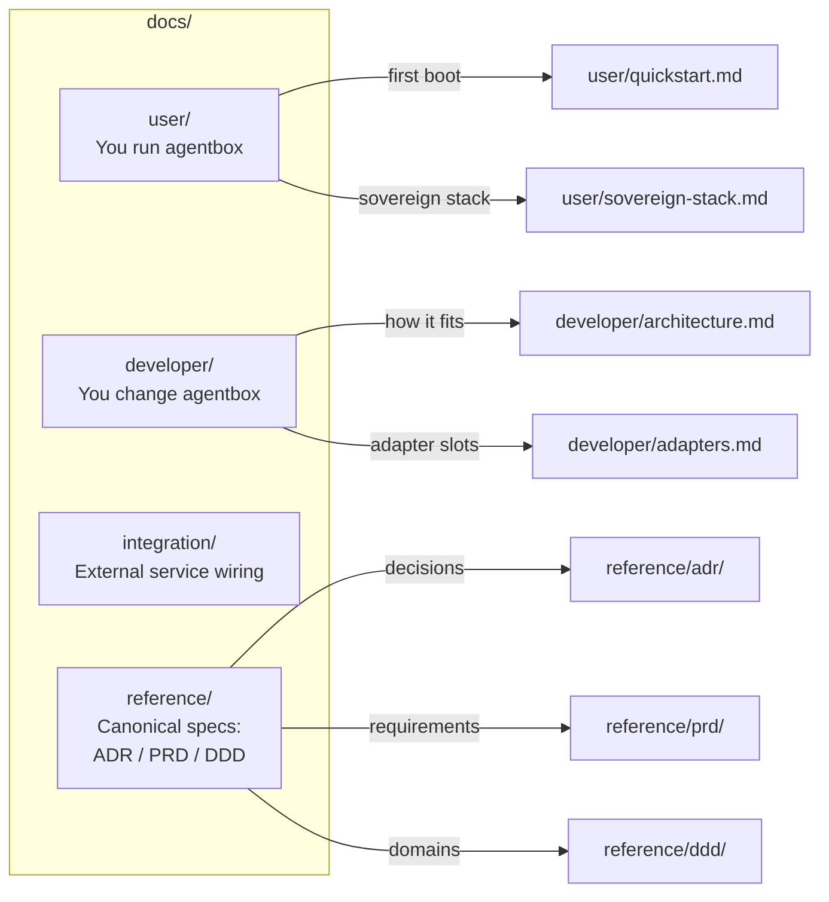

# Agentbox documentation

Audience-tiered navigation. Pick the path that matches what you are trying to do — then follow the cross-links. Every doc here is a relative hop from this index.

```mermaid
flowchart LR
    subgraph docs["docs/"]
        U["user/<br/>You run agentbox"]
        D["developer/<br/>You change agentbox"]
        I["integration/<br/>External service wiring"]
        R["reference/<br/>Canonical specs:<br/>ADR / PRD / DDD"]
    end
    U -->|"first boot"| QS["user/quickstart.md"]
    U -->|"sovereign stack"| SS["user/sovereign-stack.md"]
    D -->|"how it fits"| AR["developer/architecture.md"]
    D -->|"adapter slots"| AD["developer/adapters.md"]
    R -->|"decisions"| ADR["reference/adr/"]
    R -->|"requirements"| PRD["reference/prd/"]
    R -->|"domains"| DDD["reference/ddd/"]
```

Agentbox is a sovereign, manifest-driven headless agent runtime: ~118 skills, a 19-kind URN namespace, five pluggable adapter slots, and an embedded did:nostr / solid-pod / Nostr-relay substrate. The interaction plane is Agent of Empires (`aoe serve` on loopback `:9095` behind the sole-ingress NIP-98 proxy `:9096`; PRD-021 / ADR-042). The reference shelf below is the authoritative record — 72 ADRs, 22 PRDs + 1 remediation, 20 DDDs, 2 QE reviews.

---

## User docs — for operators

You have a machine, you want agentbox running on it, ideally with as little fuss as possible.

| Start here | |
|---|---|
| [Glossary & orientation](user/glossary.md) | Zero-to-one for people new to headless agent runtimes |
| [Quickstart](user/quickstart.md) | First boot in ten minutes |
| [Installation](user/installation.md) | Per-OS install paths (Linux, macOS, Windows, remote) |
| [agentbox.sh CLI reference](user/agentbox-cli.md) | The operator entrypoint — local stack management and remote OCI commands |
| [Web interfaces](user/web-interfaces.md) | Operator cockpit, AoE, linked objects, API docs, IDE, notebooks, desktop, and setup wizard |
| [Setup wizard](user/setup-dashboard.md) | Pre-boot browser editor for `agentbox.toml` ([ADR-024](reference/adr/ADR-024-setup-dashboard.md)) |
| [Configuration](user/configuration.md) | `agentbox.toml` reference — every section, every key |
| [Running](user/running.md) | Copy-paste recipes per host × arch × GPU |
| [Platforms](user/platforms.md) | Compatibility matrix: what works where |
| [Troubleshooting](user/troubleshooting.md) | Common failure modes and fixes |

| Day-2 operations | |
|---|---|
| [Providers](user/providers.md) | API-key management — `[providers.*]` manifest sections |
| [Backup & restore](user/backup-restore.md) | `agentbox.sh backup / restore` — what's included, secrets handling |
| [Consuming the image](user/consuming-image.md) | GHCR registry tags, multi-arch manifest |
| [Provisioning remote hosts](user/provisioning.md) | `agentbox.sh provision --target oci \| fly \| hetzner \| bare` |

| Sovereign data stack — the DreamLab-AI ecosystem substrate | |
|---|---|
| [**Sovereign stack — end to end**](user/sovereign-stack.md) | **Start here.** One-page walkthrough of identity → pod → relay → privacy-filter with verifiable commands |
| [Solid pod (solid-pod-rs)](user/solid-pod.md) | First-party Rust Solid Protocol 0.11 server — durable storage, WAC 2.0, did:nostr, atomic-rename, quota, rate-limit |
| [Native pod tunnel](user/solid-pod-sidecar.md) | Publish the in-container pod at `pods-native.dreamlab-ai.com` via the cloudflared compose overlay (origin `http://agentbox:8484`) |
| [Nostr relay](user/nostr-relay.md) | External-agent messaging over the embedded Nostr relay with pod-inbox bridge — including the **Agent Control Surface Protocol** (kinds 31400-31405) for cross-repo governance with the forum and the host project's broker actor |
| [Mobile bridge](user/mobile-bridge.md) | Talk to your agents from a stock Android Nostr client (Amethyst + Amber) — encrypted NIP-17 chat, NIP-26 phone delegation, and `kind-30840` session summaries dual-written to your Solid pod. No bespoke app; the agent's key never leaves the container |
| [Nostr control gateway](user/nostr-control-gateway.md) | Drive the tmux agent fleet from your phone — send `/tabs`, `/report`, `/tab N …` commands from Amethyst and get replies back. The inbound half of the session mirror |
| [Privacy filter](user/privacy-filter.md) | Local PII redaction sidecar (openai/privacy-filter) as adapter middleware |
| [Linked-Data interfaces](user/linked-data.md) | Eleven JSON-LD federation surfaces — pods / Nostr envelopes / VCs / DID Docs / PROV-O / WoT / skills / payments / DCAT / arch-docs / HTTP meta |
| [Canonical URIs](user/uris.md) | The URI grammar that names every emitted resource — `did:nostr:<pubkey>` + `urn:agentbox:<kind>:[<scope>:]<local>`, content-addressed, unconditionally unique, best-effort resolvable |
| [JSON-LD linked-object viewer](user/linked-object-viewer.md) | The S12 viewer slot — every emitted document one URL away, pane-dispatched by `@type`, follows URIs through `/v1/uri/<urn>` |
| [Consultants — meta-router](user/consultants.md) | Five MCP servers exposing Codex / Antigravity / Z.AI / Perplexity / DeepSeek as labelled consultants the coordinator can invoke explicitly |

| Federation & multi-tenant | |
|---|---|
| [Mesh deployment](user/mesh-deployment.md) | Standalone / client / mesh federation modes over the embedded Nostr relay |
| [Multi-user did:nostr pods](user/multi-user-pods.md) | Per-tenant did:nostr identity and pod allocation — design surface and deployment shapes ([ADR-017](reference/adr/ADR-017-multi-tenant-did-nostr-pods.md) / [PRD-007](reference/prd/PRD-007-multi-tenant-federation.md); scaffolded, default off) |
| [Git-versioned pods](user/git-pods.md) | `[sovereign_mesh.git]` initialises each pod directory as a git repository at provisioning time |
| [Tailscale](user/tailscale.md) | WireGuard mesh networking so instances federate across a tailnet without static IPs or firewall holes |

| Feature guides | |
|---|---|
| [3DGS (COLMAP + METIS + LichtFeld)](user/3dgs.md) | 3D Gaussian Splatting pipeline |
| [Android (redroid) sidecar](user/android.md) | **Experimental, gated** — genuine Play-certifiable Android 13 (x86_64) as a real Play client for owned-app extraction |
| [Blender](user/blender.md) | Blender toolchain |
| [ComfyUI](user/comfyui.md) | Built-in vs external ComfyUI |
| [LaTeX](user/latex.md) | TeX Live full |

---

## Developer docs — for contributors

You are adding a feature, implementing an adapter, or investigating a regression.

| Architecture | |
|---|---|
| [Architecture overview](developer/architecture.md) | How it all fits together — manifest → flake → image → runtime |
| [Identity and tracing mesh](developer/identity-mesh.md) | secp256k1 identity root, 19-kind URN namespace, adapter dispatch pipeline, credential provenance, federation invariants |
| [Adapter pattern](developer/adapters.md) | Five slots × three classes; how to write a new impl |
| [Native pod mesh](developer/native-pod-mesh.md) | In-container git-versioned `solid-pod-rs` tier — architecture + wiring ([PRD-007](reference/prd/PRD-007-multi-tenant-federation.md) / [ADR-010](reference/adr/ADR-010-rust-solid-pod-adoption.md)) |
| [Sovereign mesh](developer/sovereign-mesh.md) | Nostr client + NIP-98 auth + relay pool internals |
| [Linked-Data middleware](developer/linked-data.md) | Encoder + ContextResolver + LION linter + JCS — surface authoring guide |
| [Ecosystem integration](developer/ecosystem.md) | Agentbox's role in the multi-substrate DreamLab federation mesh |
| [Skills upgrade path](developer/skills-upgrade.md) | Migrating from `path:./skills` to a standalone repo |

| Subsystems & deep-dives | |
|---|---|
| [Code-as-harness](developer/code-as-harness.md) | Persistent Python kernel MCP, ExpeL lesson distillation, Voyager skill library ([PRD-008](reference/prd/PRD-008-code-as-harness-integration.md)) |
| [Code-harness multi-tier memory](developer/code-harness-multi-tier-memory.md) | How kernel state, distilled lessons, and verified skills layer over RuVector |
| [Economy loop](developer/economy-loop.md) | End-to-end cross-repo demo — an agent pays for a cost-gated pod read, settles via the 402 consumer pipeline, emits URN receipts ([PRD-015](reference/prd/PRD-015-consumer-broadcast-economy.md)) |
| [Agent control surface panels](developer/agent-control-surface-panels.md) | ACSP panel schema — emit valid Nostr events (kinds 31400-31405) that render governance control panels |
| [Dream engine](developer/dream-engine.md) | Nightly evidence-gated repo evolution — control plane here / execution plane on the HP annexe ([ADR-052](reference/adr/ADR-052-dream-machine-hp-annexe.md)); `dream.config.json` nomination, verdict + witness, evaluator-liveness discipline |
| [HP peer node](developer/hp-peer-node.md) | Second agentbox on HP-Desktop over the 25 G rail — layout, manifest deltas, what federates today (NIP-98 door yes, relay no) |

| Diagrams — cartographic audits | |
|---|---|
| [Adapter dispatch sequence](developer/diagrams/adapter-dispatch-sequence.md) | Source-grounded sequence + flow diagrams of the five-slot adapter dispatch pipeline |
| [Identity & agent comms](developer/diagrams/identity-and-agent-comms.md) | Source-referenced diagrams of did:nostr plumbing, session mirror, and relay flows |

| Tooling & governance | |
|---|---|
| [Testing](developer/testing.md) | Suite shape, running locally, CI wiring |
| [Version tracking](developer/version-tracking.md) | Renovate + `nix flake update` workflow |
| [Licensing](developer/licensing.md) | AGPL-3.0 component matrix and aggregation analysis for every bundled copyleft component |
| [Published crates](developer/ecosystem.md#published-crates-extracted-from-services) | `prose-sanitiser` and `diagram-ir`: extracted to their own repos and crates.io, consumed via pinned Nix derivations |

---

## Integration — external service wiring

| Service | |
|---|---|
| [ComfyUI integration](integration/comfyui/README.md) | Historical patch artifacts for wiring an external ComfyUI backend — the integration is already applied in `management-api/server.js` |

---

## Reference — canonical specs

These are the authoritative sources of truth. Anything in `user/` or `developer/` that conflicts with these is a bug in the docs.

### Architecture decisions (ADR)

| # | Document | Status | Decision |
|---|---|---|---|
| ADR-001 | [Nix flake build](reference/adr/ADR-001-nixos-flakes.md) | Accepted | Manifest-driven Nix flake replaces the monolithic Dockerfile |
| ADR-002 | [RuVector as embedded retrieval](reference/adr/ADR-002-ruvector-standalone.md) | Accepted | Local retrieval cache, not a source of truth |
| ADR-003 | [Guidance control plane](reference/adr/ADR-003-guidance-control-plane.md) | Accepted | Enforcement gates for autonomous agents |
| ADR-004 | [Upstream sync boundaries](reference/adr/ADR-004-upstream-sync.md) | Accepted | Selective sync, not mechanical |
| ADR-005 | [Pluggable adapter architecture](reference/adr/ADR-005-pluggable-adapter-architecture.md) | Accepted | Five-slot adapters × three impl classes |
| ADR-006 | [Immutable runtime bootstrap](reference/adr/ADR-006-immutable-runtime-bootstrap.md) | Accepted | No dependency resolution at startup |
| ADR-007 | [Runtime contract + hardening](reference/adr/ADR-007-runtime-contract-and-container-hardening.md) | Accepted | Image ref + probes + observability + hardening as one contract |
| ADR-008 | [Privacy filter routing](reference/adr/ADR-008-privacy-filter-routing.md) | Accepted | Local openai/privacy-filter sidecar as cross-cutting adapter middleware |
| ADR-009 | [Embedded Nostr relay](reference/adr/ADR-009-embedded-nostr-relay.md) | Accepted | nostr-rs-relay + pod-inbox bridge for external-agent messaging |
| ADR-010 | [solid-pod-rs as first-class pod server](reference/adr/ADR-010-rust-solid-pod-adoption.md) | Accepted | First-party Rust Solid Protocol 0.11 server; default pods implementation |
| ADR-011 | [Consultation MCP servers](reference/adr/ADR-011-consultation-mcps.md) | Accepted | Coordinator + named-consultant pattern; rejects transparent API rewriting as the meta-router |
| ADR-012 | [JSON-LD 1.1 as the federation interchange grammar](reference/adr/ADR-012-jsonld-federation-grammar.md) | Accepted | JSON-LD as the third cross-cutting middleware after observability and privacy; LION subset for hand-authored docs |
| ADR-013 | [Canonical URI grammar and resolver](reference/adr/ADR-013-canonical-uri-grammar.md) | Accepted | `did:nostr:<pubkey>` + `urn:agentbox:<kind>:[<scope>:]<local>`; uniqueness unconditional, resolvability best-effort; `/v1/uri/<urn>` resolver |
| ADR-014 | [Bi-directional graph-state ingress](reference/adr/ADR-014-bidirectional-graph-state-ingress.md) | Accepted — Phases 1–3 realised (2026-07-03) | Bi-directional graph-state ingress for agent reaction |
| ADR-015 | [MCP ruvector-postgres mandate](reference/adr/ADR-015-mcp-ruvector-mandate.md) | Accepted | `ruvector-mcp.cjs` fails closed if PostgreSQL is unreachable; no silent sql.js fallback |
| ADR-016 | [License consolidation](reference/adr/ADR-016-license-consolidation.md) | Accepted | AGPL-3.0-only end-to-end; aggregation analysis for all third-party components |
| ADR-017 | [Multi-tenant did:nostr pods](reference/adr/ADR-017-multi-tenant-did-nostr-pods.md) | Accepted (partially realised — 2026-07-03) | Per-tenant did:nostr identity; pod-per-tenant allocation and NIP-98 scoping |
| ADR-018 | [Persistent code-interpreter MCP](reference/adr/ADR-018-persistent-code-interpreter-mcp.md) | Accepted | Long-lived kernel sessions + CodeAct skill; execution-trace URN emission |
| ADR-019 | [Experiential skill learning](reference/adr/ADR-019-experiential-skill-learning.md) | Accepted | Distilled lessons and verified skill library from execution traces |
| ADR-020 | [ACI MCP tree-search](reference/adr/ADR-020-aci-mcp-tree-search.md) | Accepted for Surface 1 / Proposed for Surface 2 (2026-07-03) | ACI MCP and execution-gated tree-search for agent capability improvement |
| ADR-021 | [LLM resource marketplace kinds](reference/adr/ADR-021-llm-resource-marketplace-kinds.md) | Accepted | Nostr kind schema for LLM resource listings, bids, and receipts |
| ADR-022 | [Runtime integrity hardening](reference/adr/ADR-022-runtime-integrity-hardening.md) | Accepted | Immutable image digests, SBOM attestation, and supply-chain verification |
| ADR-023 | [Ontology bridge](reference/adr/ADR-023-ontology-bridge.md) | Accepted (implemented — realised 2026-07-03) | Host-project ontology bridge via MCP; BC20 anti-corruption layer |
| ADR-024 | [Setup dashboard architecture](reference/adr/ADR-024-setup-dashboard.md) | Accepted | Setup wizard and operations dashboard — browser-based, zero-dependency |
| ADR-025 | [Multi-harness tmux architecture](reference/adr/ADR-025-multi-harness-tmux-architecture.md) | Accepted | Multi-harness tmux layout for parallel agent workstreams |
| ADR-026 | [Cross-substrate agent-loop seams](reference/adr/ADR-026-cross-substrate-agent-loop-seams.md) | Accepted (partially realised) | The five seams across the substrate mesh; BC20 ingest converges on the `/wss/agent-events` WS contract and retires `:9500` |
| ADR-027 | [Default-secure posture and runtime-isolation roadmap](reference/adr/ADR-027-default-secure-posture.md) | Accepted (S1–S3 realised 2026-06-11) | Loopback-publish + auth-default-on, supplemental seccomp denylist, no runtime sudo, secret-via-tmpfs; gVisor/WASI proposed |
| ADR-028 | [Per-user agent fabric](reference/adr/ADR-028-per-user-agent-fabric.md) | Accepted | Pod-sourced identity, RuVector memory, and heartbeat autonomy for per-user agents; gated by `[sovereign_mesh].per_user_agents` |
| ADR-029 | [Session-mirror live egress](reference/adr/ADR-029-session-mirror-live-egress.md) | Accepted | Per-turn NIP-59 gift-wrapped self-DM under a derived child key; live sibling of the kind-30840 digest, no external LLM hop, fail-open |
| ADR-030 | [Sovereign-mesh manifest boundary](reference/adr/ADR-030-sovereign-mesh-manifest-boundary.md) | Accepted | `[sovereign_mesh]` as one subsystem gate (default off; env override per R7); the one external data hop is the mobile-bridge Z.AI summarisation |
| ADR-031 | [Adapter contract enforcement](reference/adr/ADR-031-adapter-contract-enforcement.md) | Accepted | The merge gate is executable: `isReal:false` banned, stateful loopbacks for federated legs, registered time-boxed exemptions, middleware-bypass coverage |
| ADR-032 | [402 challenge & scheme-detection grammar](reference/adr/ADR-032-402-scheme-grammar.md) | Accepted | Pure-function 402 classifier (`agentbox-ledger`/`x402`/`l402`/`unknown`), frozen byte-fixture corpus, additive `accepts[]` emission, Lightning-first settlement — companion to PRD-015 |
| ADR-033 | [did:nostr Multikey convergence](reference/adr/ADR-033-did-nostr-multikey-convergence.md) | Accepted | Single canonical DID Document form; supersedes ADR-074 D2 verificationMethod shape, retains D1 |
| ADR-034 | [Headroom Rust crate integration](reference/adr/ADR-034-headroom-rust-crate-integration.md) | Accepted (implemented — realised 2026-07-03) | Content-aware context compression via N-API; companion to PRD-016 |
| ADR-035 | [Project-tracking telemetry & kind-30841](reference/adr/ADR-035-project-tracking-telemetry-and-nostr-kind.md) | Accepted | Port-bound `agentbox_project_*` metrics + addressable kind-30841 digest; no new URN kind, port, or adapter slot |
| ADR-036 | [RuVector capability adoption & learning loop](reference/adr/ADR-036-ruvector-capability-adoption-and-learning-loop.md) | Implemented | Eight capability-adoption decisions (D1–D6); honest learning loop wired additively on the memory + events slots; retrieval + learning gates live |
| ADR-037 | [Gap-Close sprint — agentbox slice decisions](reference/adr/ADR-037-gap-close-agentbox-decisions.md) | Proposed | Eight local decisions for agentbox's nine gap-close items — where each wire attaches and which existing contract it consumes |
| ADR-038 | [AICT structured-coreutils MCP](reference/adr/ADR-038-aict-structured-coreutils-mcp.md) | Proposed (trial, do not bake) | Evaluate AICT structured-coreutils MCP as a bounded trial only — redundant with Claude Code's native tools; do not bake into the immutable image |
| ADR-039 | [docBox back-ports — apply-class, /v1/system, hash-chained events](reference/adr/ADR-039-docbox-backported-surfaces.md) | Accepted | Back-port three docBox conventions: apply-class taxonomy, `/v1/system` live gate map, hash-chained events log |
| ADR-040 | [Learning consumers, model lifecycle & legacy mining](reference/adr/ADR-040-learning-consumers-model-lifecycle-and-legacy-mining.md) | Implemented | v2 learning consumers — Wilson aggregator, pattern distiller, recall harness, model-lifecycle and legacy-mining decisions; migration rejected on evidence |
| ADR-041 | [Model routing — one policy, many projections](reference/adr/ADR-041-model-routing-one-policy-many-projections.md) | Implemented | One per-activity Claude/Codex routing policy projected into per-boot MCP configs |
| ADR-042 | [Agent of Empires as the interaction plane](reference/adr/ADR-042-agent-of-empires-interaction-plane.md) | Proposed | Overlay-only adoption of AoE as the interactive-session lifecycle owner, superseding per-provider harness tabs |
| ADR-043 | [Session identity binding](reference/adr/ADR-043-session-identity-binding.md) | Proposed | Bind `did:nostr` + URN + beads epic + scoped memory namespace at each AoE session boundary |
| ADR-044 | [Voice-plane repoint](reference/adr/ADR-044-voice-plane-aoe-repoint.md) | Proposed | Re-point the tab0-bridge voice injection seam onto the AoE API |
| ADR-045 | [Sovereign ingress — npub front door](reference/adr/ADR-045-sovereign-ingress-npub-front-door.md) | Proposed | One npub-gated NIP-98 front door for all external control surfaces |
| ADR-046 | [Semantica as a complement to VisionClaw](reference/adr/ADR-046-semantica-complement.md) | Proposed | Semantica complements, not replaces, VisionClaw |
| ADR-047 | [Native capability boundary for semantic integrity](reference/adr/ADR-047-semantica-tenant-integration-boundary.md) | Proposed | Native boundary for semantic integrity and provenance |
| ADR-048 | [Decision records as graph nodes](reference/adr/ADR-048-decision-records-as-graph-nodes.md) | Proposed | Decision records as first-class, Whelk-classifiable graph nodes; adds the `decision` URN kind |
| ADR-049 | [Bi-temporal facts and runtime PROV-O](reference/adr/ADR-049-bitemporal-facts-and-runtime-provenance.md) | Proposed | Bi-temporal facts and runtime PROV-O off the reasoned graph |
| ADR-050 | [Decision elevation — inverse corpus path](reference/adr/ADR-050-decision-elevation-inverse-corpus-path.md) | Proposed | The inverse corpus path for decision elevation |
| ADR-051 | [Loom client and deferred distillation](reference/adr/ADR-051-loom-client-and-deferred-distillation.md) | Proposed | Ontology Loom client with deferred distillation |
| ADR-052 | [Dream Machine HP annexe](reference/adr/ADR-052-dream-machine-hp-annexe.md) | Proposed | Execution plane for the nightly dream loop on the HP annexe |
| ADR-053 | [Hex-canonical pod naming](reference/adr/ADR-053-hex-canonical-pod-naming.md) | Accepted | Hex-canonical pod directory naming |
| ADR-054 | [Ontology-bridge write-path findings](reference/adr/ADR-054-ontology-bridge-write-path-findings.md) | Proposed | Findings from the terminology live test of the ontology-bridge write path |
| ADR-055 | [Dream cockpit panel](reference/adr/ADR-055-dream-cockpit-panel.md) | Accepted | Surface the nightly dream loop on the operator console |
| ADR-056 | [`/dream` decision surface](reference/adr/ADR-056-dream-decision-surface.md) | Accepted (Phase 1) / Proposed (Phase 2) | From inspect to a governed judgment-broker action |
| ADR-057 | [Replayable agent execution journal](reference/adr/ADR-057-replayable-agent-execution-journal.md) | Proposed | Replayable execution journal and derived projections |
| ADR-058 | [Lifecycle-scoped capability composition](reference/adr/ADR-058-lifecycle-scoped-capability-composition.md) | Proposed | Compose capabilities by lifecycle scope over the adapter spine |
| ADR-059 | [Monotonic agent-action policy pipeline](reference/adr/ADR-059-monotonic-agent-action-policy-pipeline.md) | Proposed | Monotonic policy pipeline for every agent-initiated action |
| ADR-060 | [Dream annexe path dependencies](reference/adr/ADR-060-dream-annexe-path-dependencies.md) | Accepted | Evaluate workspace / path-dependency repos for the dream annexe |
| ADR-061 | [Dream persist ACCEPT as draft PR](reference/adr/ADR-061-dream-persist-accept-as-draft-pr.md) | Accepted | Persist an ACCEPT night's candidate as a draft PR |
| ADR-062 | [MetaHarness adoption posture](reference/adr/ADR-062-metaharness-adoption-posture.md) | Proposed | Two-tier maturity, subprocess-only MetaHarness adoption |
| ADR-063 | [Enable ruflo-metaharness plugin](reference/adr/ADR-063-enable-ruflo-metaharness-plugin.md) | Accepted | Boot-apply, read/audit tier of the ruflo-metaharness plugin |
| ADR-064 | [Bake MetaHarness runtime binaries](reference/adr/ADR-064-bake-metaharness-runtime-binaries.md) | Accepted | Bake MetaHarness runtime binaries into the Nix closure (rebuild-apply) |
| ADR-065 | [Darwin evaluator liveness contract](reference/adr/ADR-065-dream-darwin-evaluator-liveness.md) | Accepted | Dream-engine darwin evaluator liveness contract |
| ADR-066 | [MetaHarness governance boundaries](reference/adr/ADR-066-metaharness-governance-boundaries.md) | Proposed | Proposer-only darwin, human-gated promotion |
| ADR-067 | [MetaHarness pin discipline](reference/adr/ADR-067-metaharness-pin-discipline.md) | Proposed | Pin discipline and cross-repo ADR namespacing |
| ADR-068 | [Kernel ToolDispatcher deferral](reference/adr/ADR-068-kernel-tooldispatcher-deferral.md) | Proposed (non-goal) | Recorded non-goal: kernel ToolDispatcher deferral |
| ADR-069 | [Unified operator auth](reference/adr/ADR-069-unified-operator-auth-dreamlab-adoption.md) | Accepted (implementing) | dreamlab-ai auth adoption on the :8444 console |
| ADR-070 | [Self-GC evidence governance](reference/adr/ADR-070-self-gc-dream-evidence-governance.md) | Accepted | Indexed context objects + side-channel lifecycle planning for the dream engine |
| ADR-071 | [Swarm-telemetry contract for XR](reference/adr/ADR-071-swarm-telemetry-contract-for-xr.md) | Proposed | Producer-side contract agents must emit for the XR swarm visualiser |
| ADR-072 | [Evaluator-before-schedule for dream-cycle deeps](reference/adr/ADR-072-evaluator-before-schedule.md) | Proposed | A deep is schedulable only if it names a checked-in, runnable, decidable evaluator |

### Product requirements (PRD)

| # | Document | Summary |
|---|---|---|
| PRD-001 | [Capabilities and adapters](reference/prd/PRD-001-capabilities-and-adapters.md) | Agentbox as a standalone product |
| PRD-002 | [Immutable runtime bootstrap](reference/prd/PRD-002-immutable-runtime-bootstrap.md) | Remove mutable dep-install from startup |
| PRD-003 | [Runtime contract + container hardening](reference/prd/PRD-003-runtime-contract-and-container-hardening.md) | Image selection + probes + observability + hardening |
| PRD-004 | [External agent messaging](reference/prd/PRD-004-external-agent-messaging.md) | Sovereign relay surface + pod-inbox bridge |
| PRD-005 | [Meta-router and consultant tier](reference/prd/PRD-005-meta-router-consultants.md) | Five consultant MCPs + manual `/consult` + automatic `auto-consultant` subagent |
| PRD-006 | [Linked-data interfaces and JSON-LD surfaces](reference/prd/PRD-006-linked-data-interfaces.md) | Eleven federation surfaces, pinned context catalogue, LION authoring subset |
| PRD-007 | [Multi-tenant federation](reference/prd/PRD-007-multi-tenant-federation.md) | Per-tenant did:nostr identity, pod allocation, and NIP-98 scoping at scale |
| PRD-008 | [Code-as-harness integration](reference/prd/PRD-008-code-as-harness-integration.md) | Persistent kernel sessions, CodeAct skill, execution traces, and skill library |
| PRD-009 | [LLM resource marketplace](reference/prd/PRD-009-llm-resource-marketplace.md) | Nostr-native marketplace for LLM compute listings, bids, and payments |
| PRD-010 | [Runtime integrity hardening](reference/prd/PRD-010-runtime-integrity-hardening.md) | Immutable image digests, SBOM attestation, and supply-chain policy gates |
| PRD-011 | [Ontology bridge](reference/prd/PRD-011-ontology-bridge.md) | Host-project ontology bridge exposing knowledge-graph concepts via MCP |
| PRD-012 | [Setup wizard and operations dashboard](reference/prd/PRD-012-setup-dashboard.md) | Browser-based first-boot wizard and day-2 ops dashboard |
| PRD-013 | [Multi-harness tmux architecture](reference/prd/PRD-013-multi-harness-tmux-architecture.md) | Multi-harness tmux layout and documentation revamp |
| PRD-014 | [Embodied agent loop](reference/prd/PRD-014-embodied-agent-loop.md) | Voice-to-ontology gap closure across the substrate seams (in progress) |
| PRD-015 | [Consumer & broadcast economy surfaces](reference/prd/PRD-015-consumer-broadcast-economy.md) | Phase 1 shipped — outbound 402 payment consumer (detect → policy → pay → receipt) and service-discovery broadcast (well-known manifest, standards-shaped challenges) |
| PRD-016 | [Context compression & caching](reference/prd/PRD-016-context-compression-caching.md) | Headroom hybrid Rust+Python compression integration; companion to ADR-034 and DDD-014 (Draft) |
| PRD-017 | [Sovereign project tracking](reference/prd/PRD-017-sovereign-project-tracking.md) | Helm-grade project tracking re-expressed on the three sovereign substrates — no new kind, port, or adapter slot (Draft) |
| PRD-018 | [RuVector-native memory and learning](reference/prd/PRD-018-ruvector-native-memory-and-learning.md) | RuVector-native memory and an honest learning loop — hybrid retrieval, typed metadata, trajectory producer; additive on the memory + events slots (Draft v1 — Phases 0–2 shipped 2026-07-05) |
| PRD-019 | [Gap-Close sprint — agentbox slice](reference/prd/PRD-019-gap-close-agentbox.md) | agentbox's nine owned gap-close items — wiring built-but-unwired producers to their consumers (Draft v1 — WorkPackageMinted) |
| PRD-020 | [RuVector learning consumers and corpus uplift](reference/prd/PRD-020-ruvector-learning-consumers-and-corpus-uplift.md) | v2 learning consumers + corpus uplift — Wilson aggregator, pattern distillation, recall harness, model lifecycle, legacy mining (Draft v1 — W-A–W-E landed/closed 2026-07-21/22) |
| PRD-021 | [Interaction-surface consolidation around Agent of Empires](reference/prd/PRD-021-interaction-surface-consolidation.md) | Consolidate interactive-session surfaces onto AoE (`:9095`/`:9096`), binding sovereign identity at each session boundary |
| PRD-022 | [Semantic integrity, provenance and decision intelligence](reference/prd/PRD-022-semantic-integrity-provenance-decisions.md) | Decision records as graph nodes, bi-temporal facts + runtime PROV-O, and decision elevation |
| PRD-REMEDIATION-001 | [Default-secure posture remediation](reference/prd/PRD-REMEDIATION-001.md) | Second-pass hardening: loopback publish, auth-default-on, zai allowlist, no runtime escalation, secret-via-tmpfs, doc truth-up |

### Domain design (DDD)

| # | Document | Focus |
|---|---|---|
| DDD-001 | [Immutable bootstrap domain](reference/ddd/DDD-001-immutable-bootstrap-domain.md) | RuntimeClosure aggregate + BootstrapPolicy |
| DDD-002 | [Runtime contract domain](reference/ddd/DDD-002-runtime-contract-domain.md) | ImageReferencePolicy + ProbeContract + ObservabilityBinding + SecurityProfile |
| DDD-003 | [Sovereign messaging domain](reference/ddd/DDD-003-sovereign-messaging-domain.md) | AgentIdentity + PodMailbox + RelayEndpoint + inbound/outbound envelopes |
| DDD-004 | [Linked-data interchange domain](reference/ddd/DDD-004-linked-data-interchange-domain.md) | ContextCatalogue + FederationSurface + EncodingPipeline + LinkedResource + LIONDocument |
| DDD-005 | [Code execution domain](reference/ddd/DDD-005-code-execution-domain.md) | KernelSession + ExecutionTrace + DistilledLesson + VerifiedSkill aggregates |
| DDD-006 | [LLM marketplace domain](reference/ddd/DDD-006-llm-marketplace-domain.md) | Listing + Bid + Settlement + ProviderProfile aggregates; Nostr kind mappings |
| DDD-007 | [Runtime integrity domain](reference/ddd/DDD-007-runtime-integrity-domain.md) | ImagePolicy + SBOMAttestation + SupplyChainVerifier aggregates |
| DDD-008 | [Ontology bridge domain](reference/ddd/DDD-008-ontology-bridge-domain.md) | OntologyMapping + ConceptResolver + BC20 anti-corruption layer |
| DDD-009 | [Setup dashboard domain](reference/ddd/DDD-009-setup-dashboard-domain.md) | WizardSession + ConfigBlob + HealthSnapshot + OperationsDashboard |
| DDD-010 | [Multi-harness coordination domain](reference/ddd/DDD-010-multi-harness-coordination-domain.md) | HarnessSession + WorkstreamRouter + TmuxLayout aggregates |
| DDD-011 | [Multi-tenant federation domain](reference/ddd/DDD-011-multi-tenant-federation-domain.md) | FederationPeer + MeshTopology + TenantIsolation aggregates |
| DDD-012 | [Sovereign knowledge elevation domain](reference/ddd/DDD-012-sovereign-knowledge-elevation-domain.md) | BC22 — personal-KG → governed-ontology elevation; mandate model + dual gates (Proposed) |
| DDD-013 | [Hardening boundary domain](reference/ddd/DDD-013-hardening-boundary-domain.md) | NetworkEdgePolicy + PrivilegeModel + SecretMaterialisation + DefenceInDepthLayer aggregates |
| DDD-014 | [Compression & cache domain](reference/ddd/DDD-014-compression-cache-domain.md) | Context-compression bounded context; middleware ordering after the JSON-LD encoder (Proposed) |
| DDD-015 | [Project-tracking domain](reference/ddd/DDD-015-project-tracking-domain.md) | TrackedProject + ProjectScan + CommitWindow + ProjectPrimer + TrackingDigest; rides memory + events slots |
| DDD-016 | [Memory & learning domain](reference/ddd/DDD-016-memory-learning-domain.md) | Semantic memory store + honest learning loop; trajectory producer, effectiveness aggregates; rides memory + events slots |
| DDD-017 | [Gap-Close agentbox context](reference/ddd/DDD-017-gap-close-agentbox-context.md) | agentbox's gap-close slice — the nine owned items and the local aggregates their wires touch; conformist to three upstream contexts |
| DDD-018 | [Learning-consumers & model-lifecycle domain](reference/ddd/DDD-018-learning-consumers-and-model-lifecycle-domain.md) | EffectivenessAggregation + DistilledPattern + RecallHarnessRun + EmbeddingMigration + MiningRun; consumer/lifecycle layer over DDD-016 (invariants I14–I23) |
| DDD-019 | [Interaction plane domain](reference/ddd/DDD-019-interaction-plane-domain.md) | AoE session boundary — SessionBoundary + identity/URN/beads/memory bindings (PRD-021) |
| DDD-020 | [Semantic integrity & provenance domain](reference/ddd/DDD-020-semantic-integrity-provenance-domain.md) | DecisionNode + bi-temporal facts + PROV-O provenance + decision elevation (PRD-022) |

### QE reviews

| # | Document | Title | Status |
|---|---|---|---|
| QE-001 | [Code-as-harness traceability review](reference/qe-reviews/QE-001-code-as-harness-traceability-review.md) | PRD-008 / ADR-018 / ADR-019 / DDD-005 traceability review | Complete |
| QE-002 | [Code-as-harness re-verification](reference/qe-reviews/QE-002-code-as-harness-reverification.md) | Re-verification of QE-001 defects on PRD-008 / ADR-018–020 / DDD-005 | Complete |

### Vocabulary

| File | Contents |
|---|---|
| [`reference/_vocab/agbx.md`](reference/_vocab/agbx.md) | Canonical agentbox term definitions — abbreviations, domain vocabulary, naming conventions used across all reference documents |
| [`reference/_vocab/agentbox-v1.context.jsonld`](reference/_vocab/agentbox-v1.context.jsonld) | The pinned `agbx:` JSON-LD context document — the machine-readable counterpart to `agbx.md` |

---

## Reading order

### New operators
1. [`user/glossary.md`](user/glossary.md) — orientation vocabulary
2. [`user/quickstart.md`](user/quickstart.md) — build and run
3. [`user/sovereign-stack.md`](user/sovereign-stack.md) — identity → pod → relay → privacy-filter, end to end
4. [`user/configuration.md`](user/configuration.md) — the `agentbox.toml` manifest

### New contributors
1. [`../README.md`](../README.md) — product pitch + top-level architecture
2. [`developer/architecture.md`](developer/architecture.md) — how it works inside
3. [`reference/prd/PRD-001-capabilities-and-adapters.md`](reference/prd/PRD-001-capabilities-and-adapters.md) — the full product spec
4. [`reference/adr/ADR-005-pluggable-adapter-architecture.md`](reference/adr/ADR-005-pluggable-adapter-architecture.md) — adapter deep-dive
5. The other ADRs in order — they explain how the design got here

## Conventions

- **Mermaid for diagrams.** Diagrams are Mermaid blocks. The few binary images in this tree are deliberate exceptions: the project banner (`agentbox.png`) and the two setup-dashboard screenshots under [`images/`](images/) ([`setup-dashboard.png`](images/setup-dashboard.png), [`setup-wizard-overview.png`](images/setup-wizard-overview.png)).
- **Relative cross-refs.** Every link is a relative path so the docs tree is portable.
- **File size limit.** Docs stay under 500 lines; heavier material lives in siblings.
- **Status tags.** ADRs carry `status:` frontmatter; PRDs carry a version/status block.
- **Audience tiers are strict.** `user/` never references internal-only tooling; `developer/` never re-explains operator basics; `reference/` never loses a canonical claim to narrative drift.
- **Host-by-role.** Agentbox is standalone (`github.com/DreamLab-AI/agentbox`). The integrating host is referenced by role — "host project", "integrator", "external orchestrator" — never by name. Host-specific integration lives in the host's own docs.
- **UK English.** All documentation uses British spelling (organisation, colour, initialise, behaviour, centre, analyse).
