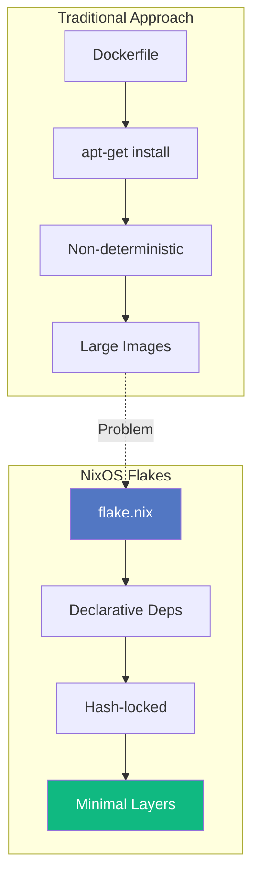
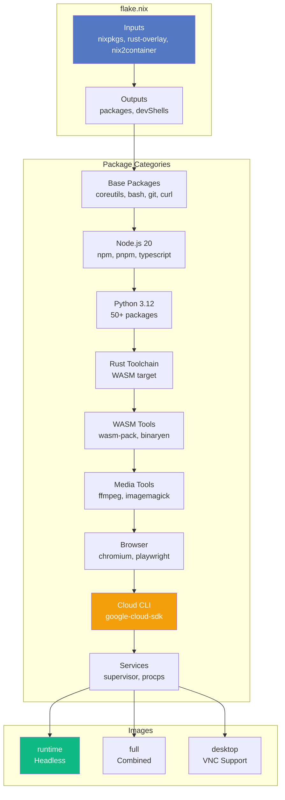
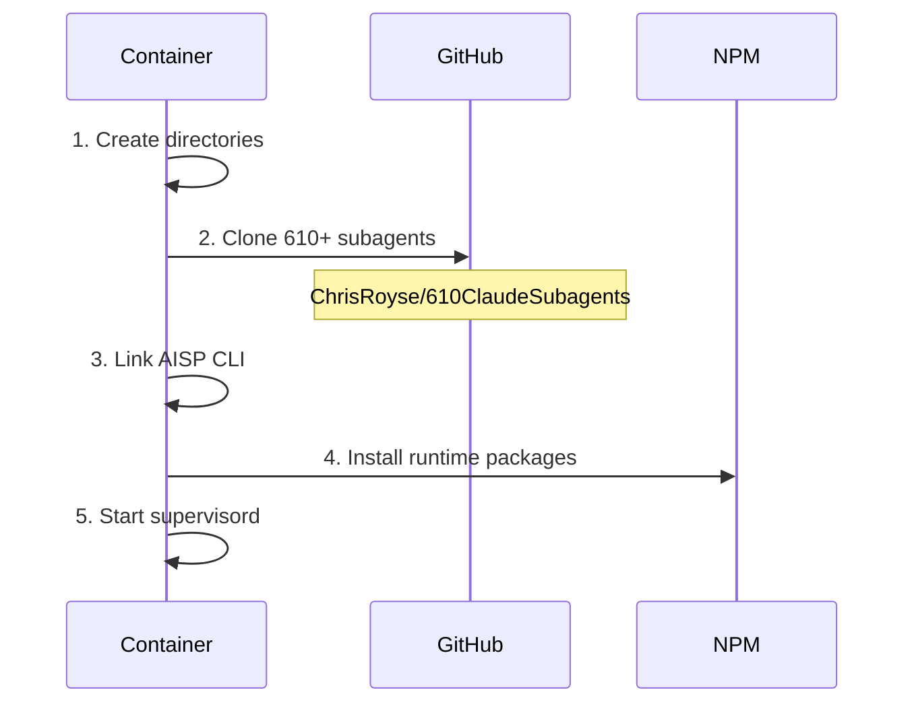

# ADR-001: NixOS Flakes Architecture

**Status:** Accepted
**Date:** 2024-12-01
**Updated:** 2026-02-03
**Author:** Agentbox Team

## Context

Building reproducible, multi-architecture container images for agentic workloads requires:

- Deterministic builds across ARM64 and x86_64
- Minimal image size (<5GB target)
- Layer optimization for fast pulls
- Development shell consistency

## Decision

Use NixOS Flakes with nix2container for all container builds.

### Architecture

### Layer Strategy

| Layer | Contents | Size (est.) |
|-------|----------|-------------|
| 1 | Base utilities (coreutils, bash, git, curl, pandoc) | ~60MB |
| 2 | Node.js 20 + build tools | ~120MB |
| 3 | Python 3.12 + 50+ packages | ~450MB |
| 4 | Rust toolchain + WASM target | ~220MB |
| 5 | WASM tools (wasm-pack, binaryen) | ~35MB |
| 6 | SQLite | ~15MB |
| 7 | Media (ffmpeg, imagemagick) | ~60MB |
| 8 | Browser (chromium, playwright) | ~300MB |
| 9 | Google Cloud SDK | ~150MB |
| 10 | Services (supervisor, procps) | ~25MB |

**Total estimated: ~1.4GB** (well under 5GB target)

### Runtime Packages

The following packages are installed via npm at runtime (not in Nix store):

| Package | Purpose |
|---------|---------|
| `@claude-flow/cli@latest` | V3 swarm orchestration |
| `agent-browser@latest` | AI-optimized browser automation |
| `@claude-flow/browser@latest` | Browser MCP integration |
| `agentic-flow@latest` | Multi-agent flow orchestration |
| `agentic-qe@latest` | Testing framework (51 agents) |
| `agentic-jujutsu@latest` | Quantum-resistant git |
| `ruvector@latest` | Standalone vector database |
| `agentdb@latest` | Agent memory database |
| `gemini-flow` | Google Gemini integration |
| `claude-usage-cli@latest` | Usage tracking |

These are auto-installed on first container run via the entrypoint script.

### Entrypoint Enhancements

The entrypoint script (`flake.nix` inline) performs:

1. **Directory Setup** — Creates workspace, agents, skills directories
2. **Agent Cloning** — Clones 610+ subagent templates from GitHub
3. **AISP Linking** — Links `/opt/aisp/cli.js` to `/usr/local/bin/aisp`
4. **NPM Install** — Installs @claude-flow/cli and agent-browser
5. **Supervisord** — Starts all managed services

### Environment Variables

| Variable | Value | Purpose |
|----------|-------|---------|
| `RUVECTOR_DATA_DIR` | `/var/lib/ruvector` | Vector database storage |
| `RUVECTOR_PORT` | `9700` | RuVector API port |
| `AGENTS_DIR` | `/home/devuser/agents` | 610+ subagent templates |
| `WORKSPACE` | `/home/devuser/workspace` | Working directory |
| `SSL_CERT_FILE` | Nix cacert path | Certificate bundle |

## Consequences

### Positive

- **Reproducibility** — Same hash = same image
- **Multi-arch** — Native ARM64 and x86_64 from same source
- **Minimal size** — Only declared dependencies included (~1.4GB vs 100GB+)
- **Dev parity** — `nix develop` matches container exactly
- **Layer caching** — Efficient rebuilds on dependency changes
- **Cloud SDK** — Google Cloud tools available (gcloud, gsutil, bq)

### Negative

- **Learning curve** — Nix syntax unfamiliar to most
- **Build time** — Initial builds slower than cached Docker
- **Ecosystem** — Some packages require overlays
- **Runtime installs** — Some npm packages installed at startup

## Alternatives Considered

| Alternative | Rejected Because |
|-------------|------------------|
| Dockerfile | Non-deterministic, large images |
| Buildah | Less ecosystem support |
| Podman build | Same issues as Dockerfile |
| distroless | Limited package availability |

## References

- [NixOS Flakes](https://nixos.wiki/wiki/Flakes)
- [nix2container](https://github.com/nlewo/nix2container)
- [rust-overlay](https://github.com/oxalica/rust-overlay)
