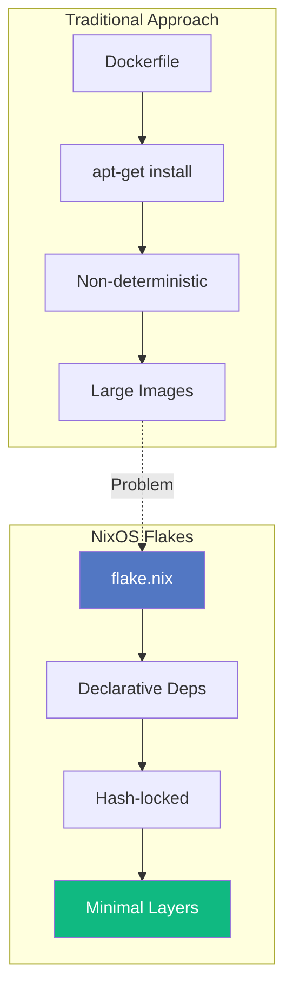
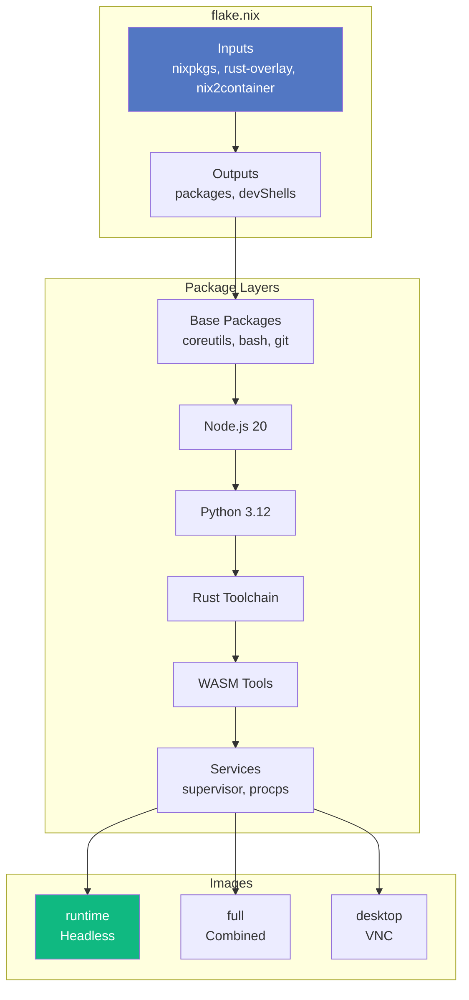

# ADR-001: NixOS Flakes Architecture

**Status:** Accepted
**Date:** 2024-12-01
**Author:** Agentbox Team

## Context

Building reproducible, multi-architecture container images for agentic workloads requires:

- Deterministic builds across ARM64 and x86_64
- Minimal image size (<5GB target)
- Layer optimization for fast pulls
- Development shell consistency

## Decision

Use NixOS Flakes with nix2container for all container builds.

### Architecture

### Layer Strategy

| Layer | Contents | Size |
|-------|----------|------|
| 1 | Base utilities | ~50MB |
| 2 | Node.js 20 | ~100MB |
| 3 | Python 3.12 + packages | ~400MB |
| 4 | Rust toolchain | ~200MB |
| 5 | WASM tools | ~30MB |
| 6 | SQLite | ~10MB |
| 7 | Media (ffmpeg, imagemagick) | ~50MB |
| 8 | Services | ~20MB |

## Consequences

### Positive

- **Reproducibility** — Same hash = same image
- **Multi-arch** — Native ARM64 and x86_64 from same source
- **Minimal size** — Only declared dependencies included
- **Dev parity** — `nix develop` matches container exactly

### Negative

- **Learning curve** — Nix syntax unfamiliar to most
- **Build time** — Initial builds slower than cached Docker
- **Ecosystem** — Some packages require overlays

## Alternatives Considered

| Alternative | Rejected Because |
|-------------|------------------|
| Dockerfile | Non-deterministic, large images |
| Buildah | Less ecosystem support |
| Podman build | Same issues as Dockerfile |
