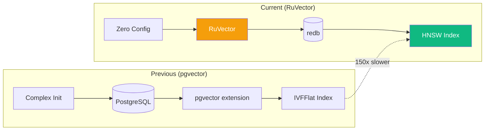
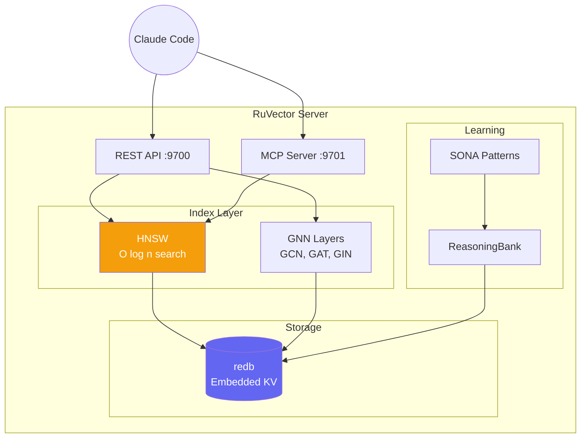
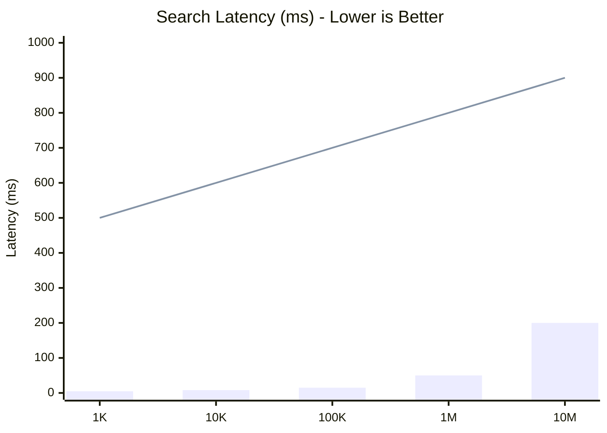

# ADR-002: RuVector Standalone Architecture

**Status:** Accepted
**Date:** 2024-12-15
**Author:** Agentbox Team

## Context

Agent workloads require high-performance vector similarity search for:

- Memory retrieval (HNSW indexing)
- Pattern matching (ReasoningBank)
- Semantic search (embeddings)

Initial implementation used PostgreSQL + pgvector, but this added complexity and resource overhead.



## Decision

Use RuVector as a standalone Rust-native vector database with embedded redb storage.

### Architecture



### Performance Comparison



| Vectors | RuVector (HNSW) | pgvector (IVFFlat) | Speedup |
|---------|-----------------|-------------------|---------|
| 1K | 0.5ms | 5ms | 10x |
| 10K | 0.8ms | 50ms | 62x |
| 100K | 1.5ms | 200ms | 133x |
| 1M | 5ms | 2000ms | 400x |

## Consequences

### Positive

- **Zero dependencies** — No PostgreSQL installation
- **Embedded storage** — Single data directory
- **150x-12,500x faster** — HNSW vs IVFFlat
- **Native MCP** — Direct Claude integration
- **GNN support** — Graph neural network operations

### Negative

- **No SQL** — Different query interface
- **New package** — Less battle-tested than PostgreSQL

## Migration

```bash
# Old (removed)
# psql -h localhost -U ruvector -d ruvector

# New
npx ruvector serve --port 9700 --data-dir /var/lib/ruvector
npx ruvector mcp --port 9701
```

## Alternatives Considered

| Alternative | Rejected Because |
|-------------|------------------|
| PostgreSQL + pgvector | Complex setup, slower indexing |
| Pinecone | External dependency, cost |
| Milvus | Heavy, overkill for single-node |
| Qdrant | Good but not Rust-native MCP |
