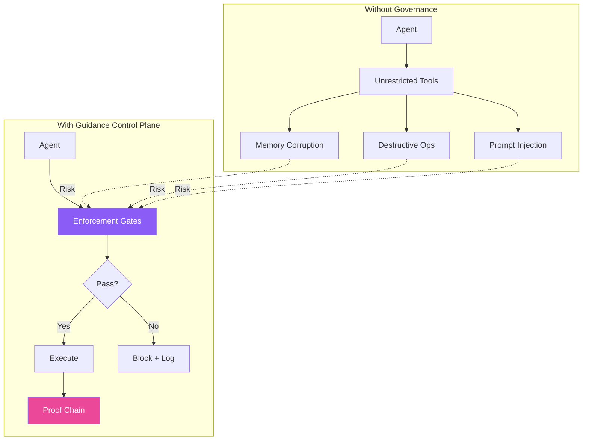
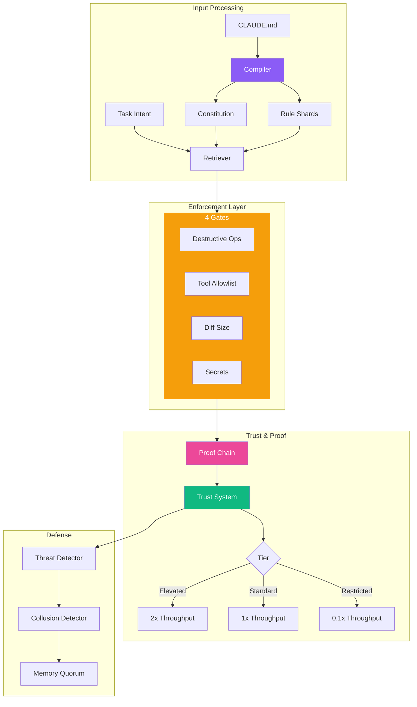
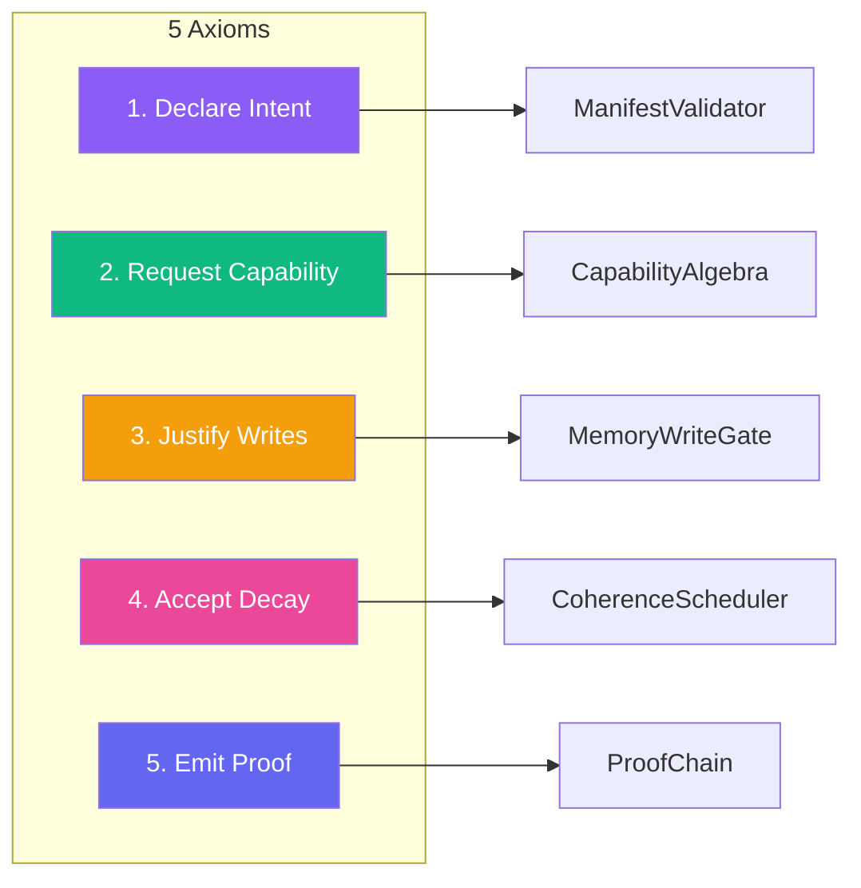

# ADR-003: Guidance Control Plane Integration

**Status:** Accepted
**Date:** 2025-02-01
**Author:** Agentbox Team

## Context

Autonomous agents operating for extended periods face challenges:

- Destructive operations (rm -rf, DROP TABLE)
- Memory corruption from unchecked writes
- Prompt injection attacks
- Trust escalation without verification



## Decision

Integrate the Guidance Control Plane as the governance backbone for all agent operations.

### Architecture



### Module Mapping

| Module | Purpose | Impact |
|--------|---------|--------|
| GuidanceCompiler | CLAUDE.md → rules | Foundation |
| ShardRetriever | Intent → constraints | 20-50% fewer tokens |
| EnforcementGates | Block bad operations | 50-90% reduction |
| ProofChain | Cryptographic audit | 100% verifiable |
| TrustSystem | Earned privileges | Dynamic access |
| ThreatDetector | Injection defense | 80-95% blocked |
| CollusionDetector | Multi-agent safety | Ring analysis |
| MemoryQuorum | Consensus writes | Byzantine tolerance |

### Agent Cell Axioms



## Consequences

### Positive

| Metric | Before | After | Improvement |
|--------|--------|-------|-------------|
| Autonomy duration | Minutes | Days-Weeks | 10x-100x |
| Destructive actions | Common | Rare | 50-90% ↓ |
| Memory corruption | Frequent | Blocked | 70-90% ↓ |
| Prompt injection | Vulnerable | Detected | 80-95% ↓ |
| Audit coverage | Partial | Complete | 100% |

### Negative

- **Latency overhead** — ~1-5ms per gate check
- **Complexity** — 22 modules to understand
- **Initial setup** — Requires CLAUDE.md constitution

## Performance Targets

| Operation | Target | Achieved |
|-----------|--------|----------|
| Manifest validation | <5ms | <1ms |
| Gate evaluation | <1ms | <0.5ms |
| Proof append | <2ms | <1ms |
| Memory write check | <3ms | <1ms |

## Integration

```bash
# Initialize hooks
npx @claude-flow/guidance init

# Compile constitution
npx @claude-flow/guidance compile

# Check gates
npx @claude-flow/guidance check-gates --tool Bash --input "rm -rf /"
# Result: BLOCKED - Destructive operation
```

## Alternatives Considered

| Alternative | Rejected Because |
|-------------|------------------|
| No governance | Unsafe for extended autonomy |
| External policy engine | Adds latency, complexity |
| Simple allowlists | Not adaptive, no learning |
