# ADR-004: Upstream Visionflow Feature Integration

**Status:** Accepted
**Date:** 2026-02-03
**Author:** Agentbox Team

## Context

Agentbox was forked from the Visionflow agent container to create a minimal, NixOS-based alternative. The upstream container has continued to evolve with new features that need to be synchronized while maintaining the minimal footprint philosophy.


## Decision

Selectively port features from upstream that align with the minimal container philosophy, documented as follows:

### 1. AISP 5.1 Platinum Integration

The AI-to-AI Interoperability & Symbolic Protocol provides neuro-symbolic coordination between AI agents.

```mermaid
flowchart TB
    subgraph "AISP 5.1 Platinum"
        subgraph "Pocket Architecture"
            H[ℋ: Header<br/>identity, auth, quality]
            M[ℳ: Membrane<br/>validation, transform]
            N[𝒩: Nucleus<br/>payload, execution]
        end

        subgraph "Binding States"
            B0["⊥ crash (0)<br/>Incompatible"]
            B1["∅ null (1)<br/>No interaction"]
            B2["± adapt (2)<br/>Transform needed"]
            B3["≡ zero-cost (3)<br/>Direct compatible"]
        end

        subgraph "Quality Tiers"
            Q1["◊⁺⁺ Platinum<br/>Certified, audited"]
            Q2["◊⁺ Gold<br/>Validated"]
            Q3["◊ Silver<br/>Basic compliance"]
            Q4["◊⁻ Bronze<br/>Minimal"]
        end

        subgraph "Learning"
            HEB[Hebbian Plasticity<br/>κ⋅A_i⋅A_j+Decay]
            TM[Thermodynamic Memory<br/>ΔF = ΔE − T⋅ΔS]
        end
    end

    H --> M --> N
    M --> B0 & B1 & B2 & B3
    N --> HEB --> TM

    style H fill:#5277c3,color:#fff
    style M fill:#f59e0b,color:#fff
    style N fill:#10b981,color:#fff
    style HEB fill:#ec4899,color:#fff
```



**Location:** `/opt/aisp/` with CLI available as `aisp` command

**Commands:**
| Command | Purpose |
|---------|---------|
| `aisp init` | Initialize pocket store |
| `aisp validate <doc>` | Validate document compliance |
| `aisp binding A B` | Check A→B binding compatibility |
| `aisp benchmark` | Run performance benchmarks |

### 2. 610+ Claude Subagents

Pre-built agent templates from the ChrisRoyse/610ClaudeSubagents repository.


**Agent Categories:**
| Category | Count | Examples |
|----------|-------|----------|
| Documentation | 50+ | doc-planner, spec-writer, api-documenter |
| Code Generation | 80+ | tdd-london-swarm, react-specialist, rust-expert |
| Testing | 40+ | integration-tester, e2e-runner, coverage-analyzer |
| DevOps | 35+ | docker-manager, ci-optimizer, deployment-planner |
| Analysis | 60+ | code-reviewer, security-auditor, performance-profiler |
| Project Management | 30+ | microtask-breakdown, sprint-planner, issue-tracker |

**Usage:**
```bash
# List available agents
ls $AGENTS_DIR/*.md | head -20

# Load specific agent
cat $AGENTS_DIR/doc-planner.md

# Count agents
ls $AGENTS_DIR/*.md | wc -l
# Expected: 610+
```

### 3. New Skills (9 Added)

Skills ported from upstream that don't require GPU or heavy dependencies:


| Skill | Purpose | Dependencies |
|-------|---------|--------------|
| `gemini-url-context` | Expand URLs using Gemini 2.5 Flash | GOOGLE_GEMINI_API_KEY |
| `flow-nexus-neural` | Distributed neural network training | Flow Nexus platform |
| `flow-nexus-platform` | Platform authentication and management | Flow Nexus account |
| `flow-nexus-swarm` | Cloud-based swarm deployment | Flow Nexus account |
| `blender` | 3D modeling automation | External Blender |
| `comfyui` | Node-based image generation | External ComfyUI |
| `cuda` | NVIDIA CUDA development | External GPU |
| `console-buddy` | Interactive shell assistance | None |
| `agentic-qe` | 51-agent test framework | None |

**Note:** Skills requiring external services (blender, comfyui, cuda) are included for API compatibility but require external resources.

### 4. Turbo Flow Aliases v11

120+ shell aliases and 8 functions for rapid agentic workflows.


**Quick Reference:**
```bash
# Show all aliases
turbo-help

# Claude Flow shortcuts
cf status          # cf -> npx @claude-flow/cli@latest
cf-swarm          # Initialize swarm
cf-doctor         # System diagnostics

# Agent management
agent-list        # List 610+ agents
agent-load <name> # Load specific agent

# Browser automation
ab-open "url"     # Open in agent-browser
ab-snap           # DOM snapshot

# RuVector
rv-status         # RuVector health
rv-search "query" # Vector search
```

### 5. Google Cloud SDK

Cloud CLI tools for GCP integration.


**Commands:**
```bash
# Initialize authentication
gcloud auth login

# Push to Artifact Registry
gcloud artifacts docker images push

# Cloud Storage operations
gsutil cp file.txt gs://bucket/

# BigQuery queries
bq query "SELECT * FROM dataset.table LIMIT 10"
```

### 6. Runtime Packages

NPM packages installed on first container start:

| Package | Version | Purpose |
|---------|---------|---------|
| `@claude-flow/cli` | latest | V3 swarm orchestration |
| `agent-browser` | latest | AI-optimized browser automation |
| `@claude-flow/browser` | latest | Browser MCP integration |
| `agentic-flow` | latest | Multi-agent flow orchestration |
| `agentic-qe` | latest | Testing framework (51 agents) |
| `agentic-jujutsu` | latest | Quantum-resistant git |
| `ruvector` | latest | Standalone vector database |
| `agentdb` | latest | Agent memory database |
| `gemini-flow` | latest | Google Gemini integration |
| `claude-usage-cli` | latest | Usage tracking |

## Implementation

Changes made to `flake.nix`:

1. **Package Addition:**
```nix
google-cloud-sdk  # gcloud, gsutil, bq commands
```

2. **Entrypoint Enhancement:**
```bash
# Clone 610+ subagents on first boot
if [ ! -f "$AGENTS_DIR/.cloned" ]; then
    git clone --depth 1 https://github.com/ChrisRoyse/610ClaudeSubagents.git /tmp/subagents
    mv /tmp/subagents/agents/*.md $AGENTS_DIR/
    rm -rf /tmp/subagents
    touch $AGENTS_DIR/.cloned
fi
```

3. **Environment Variables:**
```nix
AGENTS_DIR = "/home/devuser/agents"
WORKSPACE = "/home/devuser/workspace"
```

## Consequences

### Positive

| Feature | Benefit |
|---------|---------|
| AISP 5.1 | Structured AI-to-AI communication |
| 610+ Agents | Pre-built templates for any task |
| 66 Skills | Comprehensive automation coverage |
| Turbo Aliases | 10x faster command entry |
| Google Cloud SDK | Full GCP integration |

### Negative

| Concern | Mitigation |
|---------|------------|
| First boot slower | One-time setup, subsequent boots instant |
| Larger image | Still under 2GB, well under 5GB target |
| External dependencies | Skills gracefully degrade without services |

## Verification

```bash
# Verify skills
ls /home/devuser/workspace/agentbox/skills/*.md | wc -l
# Expected: 66

# Verify agents
ls $AGENTS_DIR/*.md | wc -l
# Expected: 610+

# Verify aliases
source /etc/profile.d/turbo-flow-aliases.sh
type cf-doctor
# Expected: function definition

# Verify Google Cloud SDK
gcloud version
# Expected: Google Cloud SDK X.X.X

# Verify AISP
aisp --help
# Expected: AISP 5.1 Platinum CLI
```

## Future Sync Policy

1. **Quarterly Review** — Compare upstream Dockerfile.unified with flake.nix
2. **Skill Sync** — Port skills that don't require GPU/heavy dependencies
3. **Alias Sync** — Keep turbo-flow-aliases.sh version-matched
4. **AISP Sync** — Mirror /opt/aisp/ changes directly
5. **Runtime Packages** — Update versions in entrypoint comments

## References

- [Visionflow Upstream](https://github.com/DreamLab-AI/visionflow)
- [610 Claude Subagents](https://github.com/ChrisRoyse/610ClaudeSubagents)
- [AISP 5.1 Specification](../reference/aisp.md)
- [ADR-001: NixOS Flakes](ADR-001-nixos-flakes.md)
