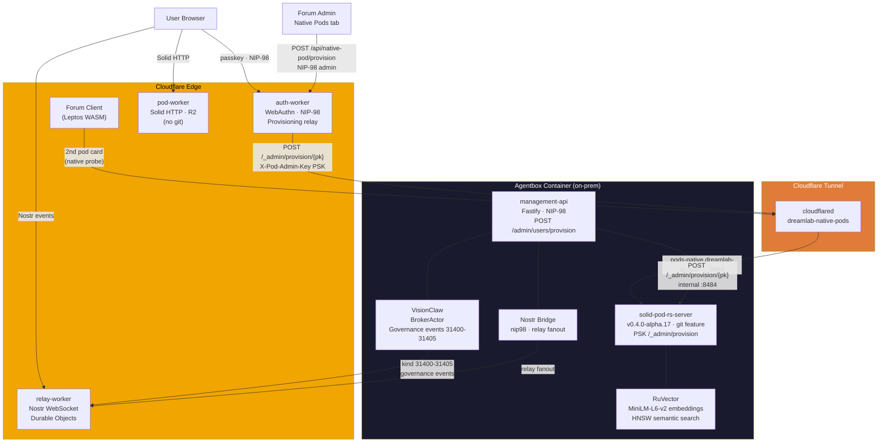
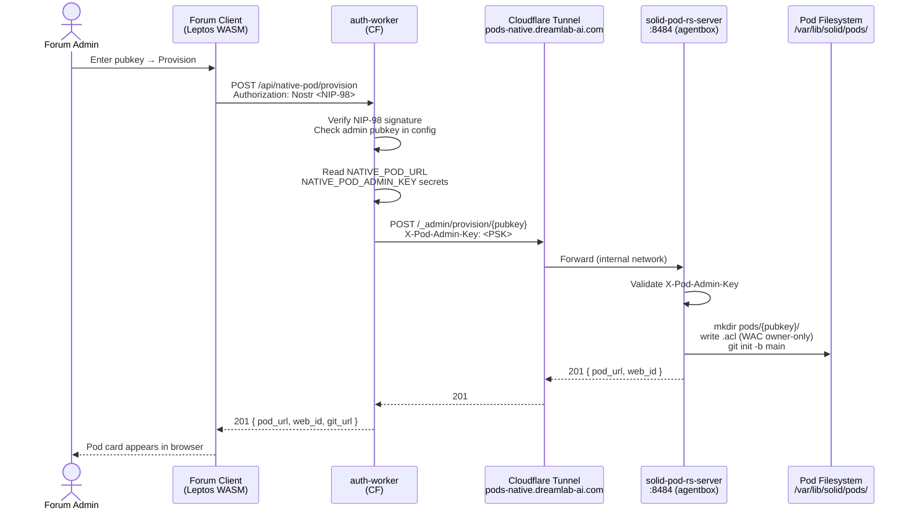
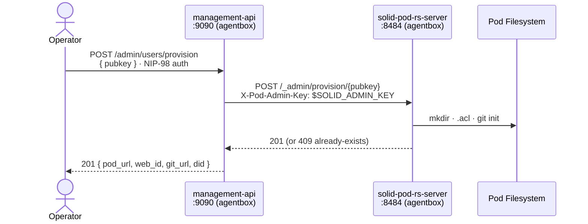
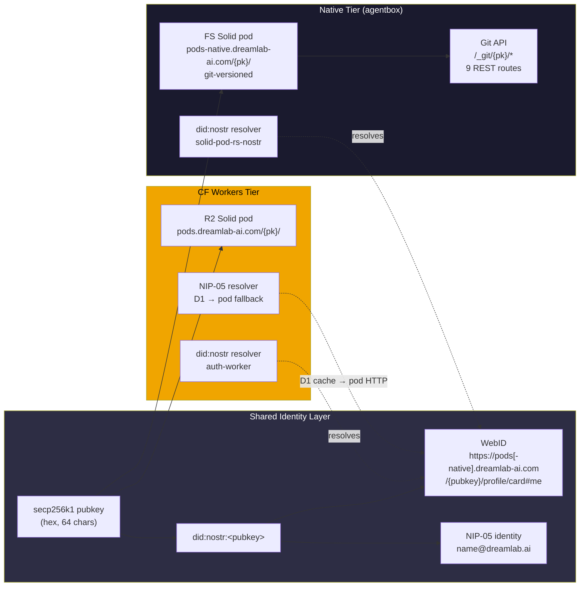
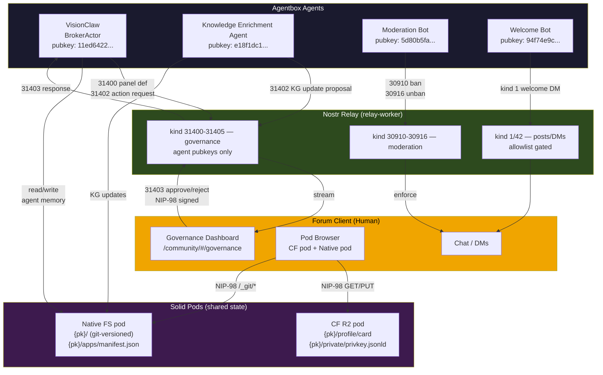
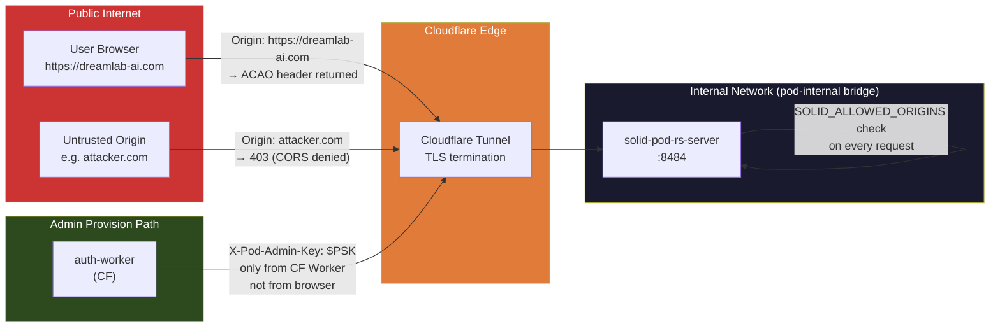
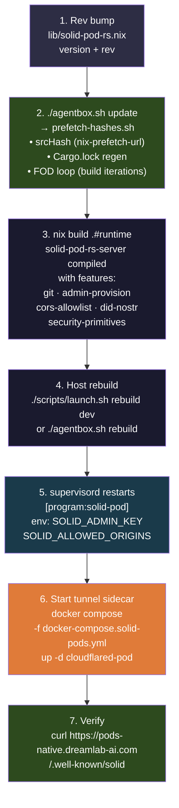
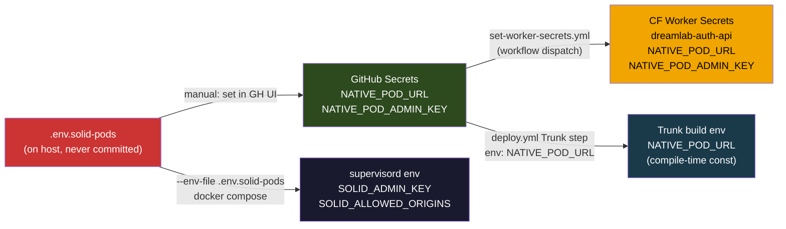

# Native Pod Mesh — Architecture & Wiring

> **Status**: Live. Shipped at alpha.15; `lib/solid-pod-rs.nix` is now pinned
> to `v0.4.0-alpha.17` (the first unambiguous tag after the alpha.15 aliasing).
> agentbox build: `./agentbox.sh update && nix build .#runtime`

The native pod mesh extends the DreamLab platform with a sovereign, git-versioned Solid
pod tier running inside the agentbox container. Forum users in eligible cohorts see a
second "Native pod" card. Agent intelligence in the container collaborates with humans
across a shared `did:nostr` identity space, with all state living in WAC-protected Solid
pods.

---

## 1. Two-Tier Pod Architecture



---

## 2. Pod Provisioning Flow



**Alternative path — management-api direct (internal ops):**



---

## 3. Identity Fabric — did:nostr across tiers



A user's `did:nostr:<pubkey>` resolves identically on both tiers. The forum client's
WebID document (in the CF R2 pod) records `pod_base_url`; the native pod card is
surfaced as a second browser entry rather than replacing the CF pod.

---

## 4. Agent–Human Collaboration Bus



---

## 5. CORS + PSK Security Boundary



The PSK (`SOLID_ADMIN_KEY`) is never sent from the browser — it travels only from the
CF auth-worker (a server-side process) to the tunnel, so it is not visible to forum users
even if they intercept their own traffic.

---

## 6. Build & Deployment



### Hash resolution is automatic

Running `./agentbox.sh update` (or `./scripts/prefetch-hashes.sh --service solid-pod-rs`)
after a version bump in `lib/solid-pod-rs.nix`:

1. Fetches the new tarball and patches `srcHash`
2. Clones the rev and runs `cargo generate-lockfile` → patches `lib/solid-pod-rs.cargo-lock`
3. Runs the iterative `nix build` loop to resolve any remaining FOD mismatches

No manual hash editing is required.

---

## 7. Environment Variables

| Variable | Set in | Consumed by | Purpose |
|---|---|---|---|
| `SOLID_ADMIN_KEY` | `.env.solid-pods` / host env | `solid-pod-rs-server` (supervisord), `management-api` | PSK for `/_admin/provision` |
| `SOLID_ALLOWED_ORIGINS` | `agentbox.toml` `allowed_origins` | `solid-pod-rs-server` | CORS allowlist |
| `SOLID_POD_BASE_URL` | supervisord env | `management-api` | Internal URL to solid-pod-rs |
| `SOLID_POD_PUBLIC_URL` | `.env.solid-pods` | `management-api` (pod_url in responses) | Public tunnel URL |
| `CLOUDFLARE_TUNNEL_TOKEN` | `.env.solid-pods` | `cloudflared-pod` container | CF Tunnel auth |
| `NATIVE_POD_URL` | GH secret → Trunk build env | `forum-client` WASM (compile-time) | Second pod card URL |
| `NATIVE_POD_ADMIN_KEY` | GH secret → CF Worker secret | `auth-worker` | PSK forwarded to native server |

### Secret lifecycle



---

## 8. API Reference

### `POST /admin/users/provision` (management-api)

**Auth**: NIP-98 signed by operator pubkey or `admin_pubkeys`  
**Body**: `{ "pubkey": "<64-hex>" }`  
**Response 201**:
```json
{
  "pod_url":        "https://pods-native.dreamlab-ai.com/pods/{pubkey}/",
  "web_id":         "https://pods-native.dreamlab-ai.com/pods/{pubkey}/profile/card#me",
  "git_url":        "https://pods-native.dreamlab-ai.com/pods/{pubkey}/.git",
  "did":            "did:nostr:{pubkey}",
  "already_existed": false
}
```

### `POST /_admin/provision/{pubkey}` (solid-pod-rs-server)

**Auth**: `X-Pod-Admin-Key: <PSK>` header  
**Creates**: `$STORAGE_ROOT/pods/{pubkey}/` with WAC `.acl` + `git init -b main`  
**Response**: `201` (created) or `409` (exists)

### Git Smart HTTP (solid-pod-rs-server)

| Method | Path | Auth | Purpose |
|---|---|---|---|
| `GET` | `/_git/{pk}/info/refs?service=git-upload-pack` | NIP-98 | Clone/fetch negotiate |
| `POST` | `/_git/{pk}/git-upload-pack` | NIP-98 | Fetch pack |
| `POST` | `/_git/{pk}/git-receive-pack` | NIP-98 pod-owner | Push |
| `GET` | `/_git/{pk}/HEAD` | public | Symbolic ref |
| `GET` | `/_git/{pk}/status` | NIP-98 | Working tree status |
| `POST` | `/_git/{pk}/stage` | NIP-98 pod-owner | Stage files |
| `POST` | `/_git/{pk}/commit` | NIP-98 pod-owner | Create commit |
| `GET` | `/_git/{pk}/log` | NIP-98 | Commit history |
| `GET` | `/_git/{pk}/diff` | NIP-98 | Unstaged diff |
| `GET` | `/.well-known/apps` | public | App manifest aggregation |

---

## 9. Cross-Repo Commit Chain

| Repo | Commit | Change |
|---|---|---|
| `solid-pod-rs` | `0c5fa42` | alpha.15: CORS allowlist, `/_admin/provision`, git control API |
| `nostr-rust-forum` | `8d31f3a` (rc11) | `NativePod` config schema, second pod card, admin tab, auth-worker relay |
| `agentbox` | this PR | alpha.15 in `lib/solid-pod-rs.nix`, `admin-users.js` provision impl, flake env wiring |
| `dreamlab-ai-website` | `forum-config` | `[native_pod]` block wired, `deploy.yml` `NATIVE_POD_URL` env |

### Related ADRs

- **ADR-089** — CF Workers subprocess constraint (blocks git on CF tier)
- **ADR-093** — Native pod mesh architecture decision
- **ADR-017** — Multi-tenant did:nostr pods
- **ADR-010** — solid-pod-rs as first-class pod implementation
