# Adapter pattern

How agentbox plugs into durable state. Canonical spec: [ADR-005](../reference/adr/ADR-005-pluggable-adapter-architecture.md).

## Context in one paragraph

Agentbox needs durable state — somewhere to record task receipts, store artefacts, index memory vectors, append events, and spawn agent processes. But it must do that two ways without recompiling: standalone (local fallbacks, no external services required) and federated-client (plugged into a host project's existing mesh). The solution is the five-slot pluggable adapter pattern (a hexagonal-architecture port/adapter — application logic talks to a fixed interface, concrete implementations are swapped at boot). [ADR-005](../reference/adr/ADR-005-pluggable-adapter-architecture.md) is the canonical decision record; [PRD-001](../reference/prd/PRD-001-capabilities-and-adapters.md) is the product constraint that forces it. This file is for the contributor writing or modifying an implementation — the "how", not the "why".

## Mental model

```mermaid
flowchart LR
    App[management-api<br/>route handlers + MCP servers]
    App --> Res[adapters/index.js<br/>resolver]
    Res -->|reads| MF[agentbox.toml<br/>&#91;adapters&#93;]
    Res -->|instantiates| Slots
    subgraph Slots[Five slots]
        B[beads]
        P[pods]
        M[memory]
        E[events]
        O[orchestrator]
    end
    B --> BI[local-sqlite.js<br/>external.js<br/>off.js]
    M --> MI[embedded-ruvector.js<br/>external-pg.js<br/>off.js]
```



Application code never imports a concrete impl. It receives `app.adapters.<slot>` and calls methods defined by the contract. That is the whole point — the impl is swappable because the application does not know which it got.

## The shape

Five slots. Three implementation classes per slot. Fifteen derivations total.

| Slot | Purpose | `local-*` | `external` | `off` |
|---|---|---|---|---|
| `beads` | Agent-work receipts (epic/child/claim/close) | `local-sqlite` | HTTP client | AdapterDisabled |
| `pods` | Durable linked-data storage | `local-jss` | HTTP/WS client | AdapterDisabled |
| `memory` | Vector memory for retrieval | `embedded-ruvector` | `external-pg` | AdapterDisabled |
| `events` | Agent lifecycle event sink | `local-jsonl` | HTTP POST | No-op (per spec) |
| `orchestrator` | Agent spawn + monitor channel | `local-process-manager` | `stdio-bridge` | AdapterDisabled (fatal) |

Files live at `management-api/adapters/<slot>/<impl>.js`.

## The contract

Every adapter implementation extends `BaseAdapter`:

```js
// management-api/adapters/base.js
class BaseAdapter {
  constructor({ slot, impl, config, logger }) {
    this.slot = slot;              // 'beads' | 'pods' | ...
    this.impl = impl;              // 'local-sqlite' | 'external' | 'off'
    this.config = config;          // slot-specific config from manifest
    this.logger = logger;
    this.enabled = impl !== 'off';
  }

  async connect() { /* override */ }
  async disconnect() { /* override */ }
  async health() { /* returns 'healthy' | 'degraded' | 'off' */ }

  get contractVersion() { /* semver string */ }
}
```

The per-slot method set is defined in ADR-005 §Service-level objectives. For `beads` (agent-work receipts — epic/child/claim/close records tracking which agent owns which piece of work), it's `{createEpic, createChild, claim, close, getReady, show, init, sync}`. Methods must return typed errors (`AdapterDisabled`, `AdapterTimeout`, etc.) from `management-api/adapters/errors.js`.

Typed errors matter because the resolver and the observability middleware (`wrapDispatch`) both branch on error class. A plain `throw new Error('oops')` bypasses the degraded-mode logic and mis-classifies spans.

### Why not: auto-generated adapters from a schema?

Considered during the ADR-005 radical-upgrade sprint; rejected because each slot's semantics are genuinely different (transactional beads vs append-only events vs long-lived orchestrator streams) and a uniform generator would paper over real invariants. The contract test harness (`tests/contract/<slot>.contract.spec.js`) is the enforcement mechanism instead — it runs the same assertions against every impl class for a slot.

## Resolution at boot

`management-api/adapters/index.js` at startup:

1. Reads `agentbox.toml` via `adapters/manifest-loader.js`.
2. For each slot, reads `manifest.adapters.<slot>` (e.g. `"local-sqlite"`).
3. `require(\`./\${slot}/\${impl}.js\`)` — fails fast on unknown impl.
4. Instantiates with slot-specific config.
5. Calls `connect()` on each with 10 s timeout.
6. On connect failure:
   - non-critical slots → degrade to `off`, `/health` reports `degraded`
   - `orchestrator` failure → `process.exit(1)` (no agent work without it)

The resolved adapters are attached to the Fastify app: `app.adapters.{beads,pods,memory,events,orchestrator}`.

`/health` reports per-slot status; `/v1/meta` reports the resolved impl name per slot.

## Contract versioning

Each slot carries a semver `contractVersion`. Breaking changes bump MAJOR; additive changes bump MINOR; fixes bump PATCH. Wire format per MAJOR version is published at `schemas/adapter-contracts/<slot>-v<MAJOR>.json`.

At boot, the host orchestrator (when `federation.mode = "client"`) calls `/v1/meta` and compares its declared range against agentbox's version. MAJOR mismatch = fatal.

Compat windows: each new MAJOR ships alongside the prior one for 60 days minimum.

## Minimum useful change — a one-method `off` impl

The smallest honest implementation of a slot is the `off` disabled variant. It exists to keep route handlers uniform (they always call through `app.adapters.<slot>`) and to produce typed errors the resolver understands. Every new slot needs one of these before anything else.

```js
// management-api/adapters/beads/off.js
const BaseAdapter = require('../base');
const { AdapterDisabled } = require('../errors');

class BeadsOffAdapter extends BaseAdapter {
  constructor(args) { super(args); this.enabled = false; }
  async connect()    { /* no-op */ }
  async disconnect() { /* no-op */ }
  async health()     { return 'off'; }

  async createEpic() { throw new AdapterDisabled('beads'); }
  async createChild(){ throw new AdapterDisabled('beads'); }
  async claim()      { throw new AdapterDisabled('beads'); }
  async close()      { throw new AdapterDisabled('beads'); }
  async getReady()   { throw new AdapterDisabled('beads'); }
  async show()       { throw new AdapterDisabled('beads'); }
  async init()       { throw new AdapterDisabled('beads'); }
  async sync()       { throw new AdapterDisabled('beads'); }
}

module.exports = BeadsOffAdapter;
module.exports.contractVersion = '1.0.0';
```

That is the minimum bar a new slot must clear before any `local-*` or `external` impl is written. The `events` slot is the one exception where `off` becomes a no-op dispatch rather than a throw — see [ADR-005](../reference/adr/ADR-005-pluggable-adapter-architecture.md) §Off-slot semantics.

## Writing a new impl for an existing slot

Say you're writing a `beads/external-memcached` impl.

### 1. Create the file

```js
// management-api/adapters/beads/external-memcached.js
const BaseAdapter = require('../base');
const { AdapterTimeout, AdapterDisabled } = require('../errors');

class ExternalMemcachedBeadsAdapter extends BaseAdapter {
  constructor(args) {
    super(args);
    // Parse config.servers, config.timeoutMs, etc.
  }

  async connect() { /* connect to memcached */ }
  async disconnect() { /* close pool */ }
  async health() { /* ping */ }

  async createEpic(epic) { /* ... */ }
  async createChild(child) { /* ... */ }
  // ... every method in the beads contract
}

module.exports = ExternalMemcachedBeadsAdapter;
module.exports.contractVersion = '1.2.0';
```

### 2. Register in the resolver

Add the enum value to `schema/agentbox.toml.schema.json`:

```json
"beads": { "enum": ["local-sqlite", "external", "external-memcached", "off"] }
```

Update `adapters/index.js` only if the mapping from impl-name to filename changes (the default convention is `<impl>.js`).

### 3. Add to contract test harness

`tests/contract/beads.contract.spec.js` already iterates `IMPLS = ['local-sqlite', 'external', 'off']`. Add `'external-memcached'` to the list. The parameterised assertions run automatically.

### 4. Write impl-specific tests

Beyond the contract harness, add whatever unit/integration tests are impl-specific:

```
tests/integration/beads-memcached.test.js
```

Use stubbed memcached in-process for CI speed.

### 5. Document

- Add a row in [../user/configuration.md](../user/configuration.md) §`[adapters]`.
- Note the impl's config shape in a new `docs/user/beads-external-memcached.md` if non-trivial.
- Reference from [ADR-005](../reference/adr/ADR-005-pluggable-adapter-architecture.md) §Service-level objectives if it has different SLOs.

## Adding a new slot (rare)

This is an ADR-level decision. Open an ADR proposal first (`docs/reference/adr/ADR-NNN-<name>.md`) covering:

- Why the slot is needed (what use-case requires this durable-state concern)
- Proposed method set
- Which `local-*` implementation to ship on day one
- Which `external` shape (HTTP / stdio / MCP)
- SLO targets per method

Once the ADR is Accepted, implement:

1. `management-api/adapters/<slot>/{local-*,external,off}.js`
2. `tests/contract/<slot>.contract.spec.js` — new parameterised suite
3. `schemas/adapter-contracts/<slot>-v1.json` — wire format
4. Update `adapters/index.js` resolver
5. Update `/v1/meta` response shape
6. Update manifest schema + `agentbox.toml` example

## SLOs

ADR-005 §Service-level objectives defines the p95 latency / throughput / error-rate budgets per (slot, method). Implementations must meet these under the contract test harness with nominal load.

Current targets, in brief:

| Slot | p95 latency | p95 throughput | error rate |
|---|---|---|---|
| beads create/claim/close | 200 ms | 50 req/s | 0.5% |
| beads getReady/show | 100 ms | 200 req/s | 0.5% |
| pods write | 300 ms | 20 req/s | 1.0% |
| pods read | 150 ms | 100 req/s | 0.5% |
| memory store | 500 ms | 10 req/s | 1.0% |
| memory search/retrieve | 250 ms | 50 req/s | 0.5% |
| events dispatch | 50 ms | 500 req/s | 0.1% |
| orchestrator spawn | 2 s | 2 req/s | 2.0% |
| orchestrator stream event | 20 ms/event | — | 0.5% |

Impls below these numbers are not contract-compliant and block merge.

## Observability

Every adapter dispatch is instrumented. The `wrapDispatch(slot, method, fn)` helper from `management-api/observability/metrics.js` wraps each method call with:

- OpenTelemetry span: `agentbox.adapter.<slot>.<method>`
- Prometheus counter: `agentbox_adapter_dispatch_total{slot, method, impl, outcome}`
- Prometheus histogram: `agentbox_adapter_duration_seconds{slot, method, impl}`
- pino structured log: `{ts, level, slot, method, impl, duration_ms, session_id, execution_id, outcome}`

Your impl doesn't need to add anything — just make sure it calls through the BaseAdapter wrappers which apply `wrapDispatch` automatically.

## Federation vs standalone

Same codepath. `agentbox.toml` picks the impl per slot:

```toml
# Standalone — local fallbacks
[adapters]
beads = "local-sqlite"
pods = "local-solid-rs"   # first-class; see ADR-010
memory = "embedded-ruvector"
events = "local-jsonl"
orchestrator = "local-process-manager"

# Federated — plug into a host mesh
[adapters]
beads = "external"
pods = "external"
memory = "external-pg"
events = "external"
orchestrator = "stdio-bridge"

[federation]
mode = "client"
external_url = "http://host-orchestrator:7070"
```

The contract test harness runs every assertion against every impl class. If a test passes for `local-sqlite` but fails for `external`, that's a real regression regardless of which deployment shape the user picks.

## Testing your new impl

See [testing.md](testing.md) §"New adapter impl".

## Related specs

- [PRD-001 §Adapters](../reference/prd/PRD-001-capabilities-and-adapters.md) — product-level constraint.
- [ADR-005](../reference/adr/ADR-005-pluggable-adapter-architecture.md) — slots, SLOs, resolver.
- [ADR-008](../reference/adr/ADR-008-privacy-filter-routing.md) — privacy filter as cross-cutting middleware layered on top of every adapter dispatch.
- [DDD-002](../reference/ddd/DDD-002-runtime-contract-domain.md) — probe contract that consumes adapter health.
