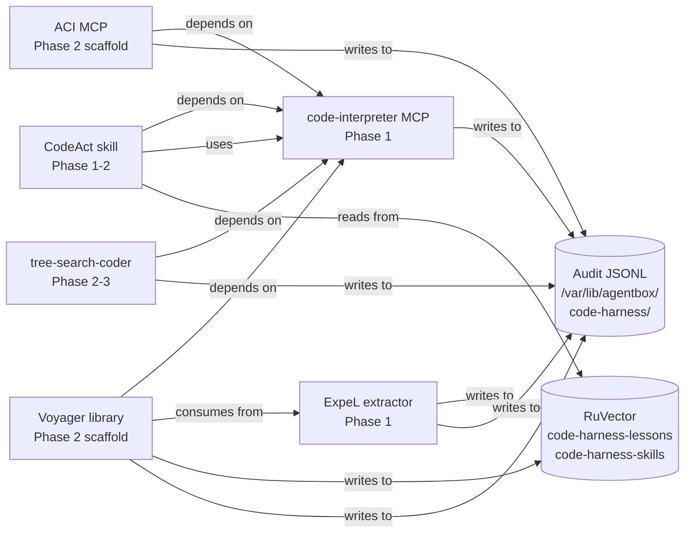

# Code-as-Harness — Operator and Developer Guide

> Status: Phase 1 in progress (2026-05-21). Phase 1 surfaces (code-interpreter MCP, ExpeL lesson-extractor, ACI MCP scaffold) ship behind opt-in manifest gates. Phase 2 (CodeAct skill use beyond exemplars, Voyager skill library, tree-search) ships once Phase 1 acceptance criteria (PRD-008 §7) pass.

## TL;DR for Operators

Four independent research lines — Program of Thoughts (+12 pp on maths benchmarks), Chain of Code (+12 pp on BIG-Bench Hard), CodeAct (+20% success rate on tool-use benchmarks), and ORPS tree-search (+26.9% correctness) — converge on the same missing primitive: a Python kernel that persists variable state across tool calls within a session. Code-as-harness adds that kernel as an MCP server, wires a post-task lesson-distillation pipeline (ExpeL) that accumulates cross-run rules in RuVector, and scaffolds a verified executable skill library (Voyager) for reuse across sessions. Every record emitted carries the agent's `did:nostr` identity and a PROV-O Activity receipt, making the domain's audit trail queryable. Phase 1 surfaces are opt-in; Phase 2 surfaces are scaffolded but default off.

## Quick Start

```bash
# Enable Phase 1 surfaces in agentbox.toml:
[skills.code_interpreter]
enabled = true

[features.expel_lesson_extraction]
enabled = true

# Phase 2 surfaces (scaffold only — off by default):
# [skills.codeact]
# enabled = true              # depends on code_interpreter

# [skills.aci_shell]
# enabled = true              # opt-in; E050 requires code_interpreter

# [skills.voyager_skill_library]
# enabled = true              # depends on expel + code_interpreter (E044)

# [skills.tree_search_coder]
# enabled = false             # off by default; never auto-routed

# Rebuild:
nix build .#default
# Wheelhouse must be present at /var/lib/agentbox/code-interpreter-wheelhouse/

# Verify health:
kernel-health        # checks wheelhouse marker file
code-harness-traces  # tails the trace outbox
code-harness-audit   # follows the kernel MCP audit log
```

## Topology



## The 6 Surfaces

| Surface | Type | Status | Manifest gate | Phase |
|---|---|---|---|---|
| code-interpreter MCP | MCP | shipping | `[skills.code_interpreter]` | 1 |
| CodeAct skill | Skill | shipping | `[skills.codeact]` | 1-2 |
| ExpeL lesson-extractor | Skill + hook | shipping | `[features.expel_lesson_extraction]` | 1 |
| ACI MCP | MCP | scaffold | `[skills.aci_shell]` | 2 |
| Voyager skill library | Skill + hook | scaffold | `[skills.voyager_skill_library]` | 2 |
| Execution-gated tree-search | Skill | future | `[skills.tree_search_coder]` | 2-3 |

## Identity Stack (Ecosystem-Consistent)

Every record this domain emits carries:

| Field | Form | Example |
|---|---|---|
| `owner_did` | `did:nostr:<hex>` | `did:nostr:a3f1...` |
| Primary URN | `urn:agentbox:<kind>:<scope>:<local>` | `urn:agentbox:memory:a3f1...:lesson-3c9e8a01b002` |
| `action_urn` | `urn:agentbox:activity:<scope>:<id>` | `urn:agentbox:activity:a3f1...:distil-7b2a` |
| `action_verb` | exec, distil, verify, archive, store, retrieve, view, edit, search, test, or submit | `exec` |

The URN→IRI mapping for federation surfaces (DDD-004): `urn:agentbox:K:S:L` ⇆ `<https://urn.agentbox.dev/K/S/L>`. Both forms refer to the same resource; URN is the embeddable canonical form, IRI is the resolvable form for JSON-LD and HTTP routes. The `owner_did` field on every record uses `did:nostr:<hex>` as its value type; it is the same identity that NIP-98 signs and the host project's graph governance validates.

`did:nostr:<hex>` is the agentbox-wide identity scheme — shared with solid-pod-rs (NIP-98 auth), nostr-rust-forum (event signing), the host project (graph governance), and dreamlab-ai-website (forum config). Code-as-harness joins as the fifth participant without inventing new identity primitives. The `<scope>` in every URN is always the 64-character BIP-340 x-only hex pubkey, consistent with ADR-013 owner-scoped kinds.

### URN allocation within existing 18 kinds

No new URN kinds are introduced. Code-as-harness maps its artefacts to the existing taxonomy:

| Artefact | URN pattern | Kind |
|---|---|---|
| KernelSession | `urn:agentbox:thing:<scope>:kernel-<id>` | `thing` |
| ExecutionTrace | `urn:agentbox:activity:<scope>:trace-<id>` | `activity` |
| DistilledLesson | `urn:agentbox:memory:<scope>:lesson-<sha256-12>` | `memory` |
| VerifiedSkill | `urn:agentbox:skill:<scope>:<name>:v<n>` | `skill` |
| ACI session | `urn:agentbox:thing:<scope>:aci-<id>` | `thing` |
| ACI submission | `urn:agentbox:receipt:<scope>:aci-<id>` | `receipt` |

Every record also carries an `action_urn = urn:agentbox:activity:<scope>:<verb>-<id>` Activity record (PROV-O aligned). All URNs are minted through `management-api/lib/uris.js`; ad-hoc template literals are prohibited.

## Action Receipts (PROV-O Alignment)

Every state-changing dispatch (exec, distil, verify, store, archive, view, edit, search, test, submit) emits an Activity record alongside its primary record. Schema: `subject_did` (the acting agent as `did:nostr:<hex>`), `object_urn` (what was acted on), `verb` (one of the eleven short enum values), `started_at`/`ended_at` in ISO-8601, and `outcome`. Stored in namespace `code-harness-activities`.

This makes the domain's audit trail queryable: "show me every distil action by agent X in the last 24 hours" reduces to a single semantic search on `code-harness-activities` filtered by `subject_did` and `verb=distil` — where `subject_did` is the agent's `did:nostr:<hex>` and `action_verb` is one of the eleven permitted short verbs. The Activity records carry only URN references and bypass privacy redaction by design (no code body, no stdout in Activity records).

## Multi-Tier Memory

Code-as-harness writes to three RuVector namespaces using existing `mcp__claude-flow__memory_store` and `mcp__claude-flow__memory_search` primitives. No new RuVector tables are required; the multi-tier discriminator is the `source_type` field (an OWL2 class IRI) on memory entries.

| Tier | Namespace | OWL2 class | `memory_type` | TTL | Notes |
|---|---|---|---|---|---|
| Semantic | `code-harness-lessons` | `ex:DistilledLesson` | `semantic` | none (confidence decay) | Retrieved at task start |
| Procedural | `code-harness-skills` | `ex:VerifiedSkill` | `procedural` | 30 days archive | Executable; version-suffixed |
| Episodic | `code-harness-activities` | `ex:Activity` | `episodic` | 30 days (configurable) | Action receipts |
| Episodic | `code-harness-traces` | `ex:ExecutionTrace` | `episodic` | 30 days | Evidence for lesson gate |

The `source_type` value is the full OWL2 class IRI, e.g. `ex:DistilledLesson`. This is the multi-tier discriminator; no schema migration is required. A rejected skill candidate is logged to `code-harness-skills-rejected` with `source_type: ex:RejectedSkill`. Each record in `code-harness-activities` carries `owner_did` (the agent `did:nostr:<hex>`) and `action_verb` alongside the primary `action_urn`.

See `docs/developer/code-harness-multi-tier-memory.md` for the full namespace-to-class mapping if that file is present. This guide does not duplicate it.

## Privacy Filter Integration

Per ADR-008 and ADR-019, every record body passes through the `PrivacyFilterPort` before any RuVector write. The filter applies to `ExecutionTrace` stdout/stderr/code and `DistilledLesson` evidence fields. Activity records carry only URN references and bypass redaction by design.

Failure mode: if the filter is unavailable, the write is dropped and either a `LessonRedactionFailed` or `TraceRedactionFailed` event is emitted. Lesson distillation is best-effort — losing one lesson to a redaction outage is acceptable. The kernel MCP server sets `JUPYTER_NO_NETWORK=1` at spawn; code body logging is gated behind `[observability].debug_exporter = true` to avoid inadvertently exporting secrets.

## Observability

Every MCP dispatch emits one OTLP span, one structured log line, and one Prometheus metric counter. Span names follow the form `agentbox.mcp.<component>.<op>` with dots for hierarchy and snake_case within segments — matching the `[skills.code_interpreter]` TOML key convention. Examples:

- `agentbox.mcp.code_interpreter.exec`
- `agentbox.mcp.code_interpreter.list_vars`
- `agentbox.mcp.aci_shell.edit_file`
- `agentbox.mcp.aci_shell.run_tests`

Audit JSONL under `/var/lib/agentbox/code-harness/`. Files rotate daily. Retention follows `[observability].audit_retention_days` (default 30).

Key Prometheus metrics:

| Metric | Description |
|---|---|
| `code_harness_kernel_exec_total{session, outcome}` | Total `kernel.exec` calls |
| `code_harness_kernel_mem_rss_mb{session}` | Kernel RSS polled every 30 s |
| `code_harness_lessons_stored_total` | ExpeL lessons written |
| `code_harness_skills_stored_total{gate}` | Voyager skills (verified / quarantined) |
| `code_harness_aci_calls_total{tool, outcome}` | ACI MCP calls |

See PRD-008 §9 for the full metric table, and ADR-018 §Observability for the per-tool span attribute set.

## Test Fixtures

| Fixture | Purpose | Used by |
|---|---|---|
| `tests/code-harness/multi-turn-fibonacci.sh` | B2 — three-step squares computation; byte-for-byte stdout match | code-interpreter MCP |
| `tests/code-harness/kernel-interrupt.sh` | I02 — interrupt atomicity (DDD-005 invariant) | code-interpreter MCP |
| `tests/code-harness/lesson-retrieval-queries.json` | C3 — top-3 retrieval check; 5 seeded queries | ExpeL extractor |
| `tests/code-harness/aci-view-line-cap.sh` | E3 — 150-line view cap enforced server-side | ACI MCP |
| `tests/code-harness/aci-edit-diff-ctx.sh` | E4 — 10-line context cap in returned diff | ACI MCP |
| `tests/code-harness/aci-search-truncation.sh` | E5 — `max_results` truncation with `total_found` reported | ACI MCP |
| `tests/fixtures/skill-router-prompts.json` | B3 — 10-prompt router validation; threshold 8/10 correct | codeact + sparc:code routing |

## What is Deferred

The following items were evaluated and rejected in the literature survey (PRD-008 §5). They are not deferred for reconsideration — they are closed decisions unless a new ADR reverses them:

- **OpenHands sandboxed OS runtime**: L-cost infrastructure rewrite; platform pivot.
- **NExT execution-trace CoT**: Training-time pattern; not inference-deployable.
- **MIRIX multi-tier memory**: L infrastructure; procedural tier is covered by Voyager at M cost.
- **ToolNet adaptive skill routing**: Static routing by design; no clear accuracy benchmark.
- **SWE-Debate adversarial topology**: Variant of existing hive-mind Byzantine; narrow lift.
- **All RL training papers** (RLTF, RLEF, CWM, and others): Training infrastructure is out of scope.
- **RoboCodeX**: No robotics surface in agentbox.
- **CodexGraph**: Covered by codebase-memory MCP.
- **MemGPT**: Covered by agentdb-memory-manager and RuVector HNSW tiered storage.
- **RepoCoder**: Codebase-memory graph retrieval is richer.
- **ReAct**: Implicit in sparc:orchestrator and hive-mind consensus loop.
- **PoE-World compositional environment modeller**: Reclassified to explicitly rejected; no current use case in agentbox's skill mix.

Phase 3 items (deferred, not rejected):

- **PoE-World** (if game-dev adoption creates demand): revisit in Phase 3.
- **Multi-tier MIRIX memory** (if RuVector schema work is separately funded): revisit in Phase 3.

## Open Questions (Still Open After Phase 1)

These questions are unresolved as of the Phase 1 sprint. Each will be answered by the ADR that implements the relevant Phase 2 item:

1. **Kernel scope: per-session vs per-worktree.** In ruflo swarms with `isolation: "worktree"`, should the kernel scope follow the worktree boundary? ADR-018 must decide.
2. **Pip install policy.** Explicit per-package allowlist in `agentbox.toml`, signed package allowlist, or Nix-only? ADR-018 must decide.
3. **GPU access from the kernel.** CPU-only in v1. A future `code-interpreter-cuda-mcp` variant is deferred pending demand evidence. ADR-018 must decide.
4. **State persistence across sessions.** Kernel namespace is throwaway in v1. ADR-018 must decide whether `kernel.snapshot()` → RuVector is added.
5. **Lesson quality threshold.** `source_evidence` field is required; minimum evidence quality bar is not yet specified. ADR-019 should calibrate.
6. **Voyager skill discovery surface.** Silent context injection, `voyager-skills list` command, or management-api endpoint? ADR-019 must decide.
7. **ACI vs codebase-memory delineation in practice.** A routing example documenting the combined pattern (codebase-memory to navigate, ACI to edit and test) is required before Phase 2 ships. PRD-008 §10 mandates this.

## References

| Document | Location |
|---|---|
| PRD-008 — Code-as-Harness integration | `docs/reference/prd/PRD-008-code-as-harness-integration.md` |
| ADR-018 — Persistent code-interpreter MCP | `docs/reference/adr/ADR-018-persistent-code-interpreter-mcp.md` |
| ADR-019 — Experiential skill learning | `docs/reference/adr/ADR-019-experiential-skill-learning.md` |
| ADR-020 — ACI MCP and tree-search (stub) | `docs/reference/adr/ADR-020-aci-mcp-tree-search.md` |
| DDD-005 — Code-execution domain | `docs/reference/ddd/DDD-005-code-execution-domain.md` |
| ADR-013 — Canonical URI grammar | `docs/reference/adr/ADR-013-canonical-uri-grammar.md` |
| ADR-008 — Privacy filter | `docs/reference/adr/ADR-008-privacy-filter.md` |
| DDD-004 — Linked-data interchange | `docs/reference/ddd/DDD-004-linked-data-interchange-domain.md` |
| CodeAct skill | `skills/codeact/` |
| ExpeL lesson-extractor skill | `skills/expel-lesson-extractor/` |
| Voyager skill library | `skills/voyager-skill-library/` |
| code-interpreter MCP server | `mcp/code-interpreter/` |
| ACI MCP server | `mcp/aci-shell/` |
| ExpeL MCP | `mcp/expel/` |
| Voyager MCP | `mcp/voyager/` |
