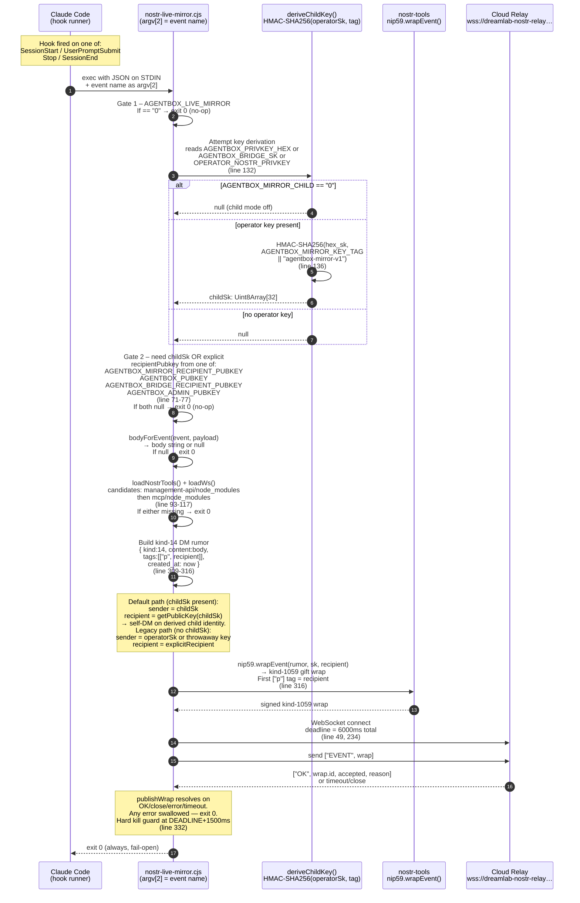
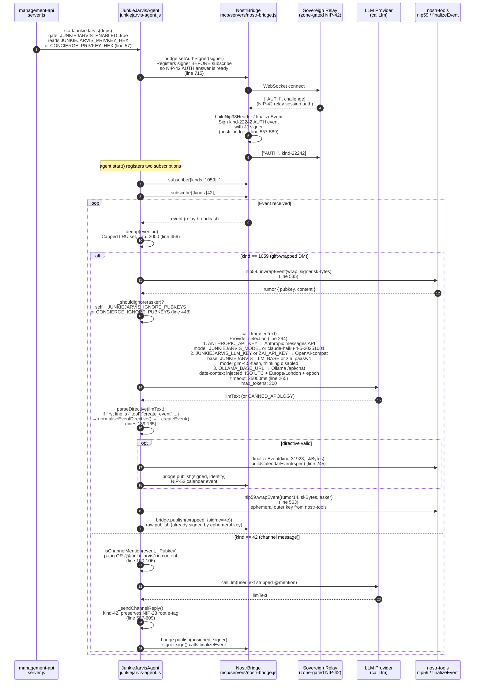
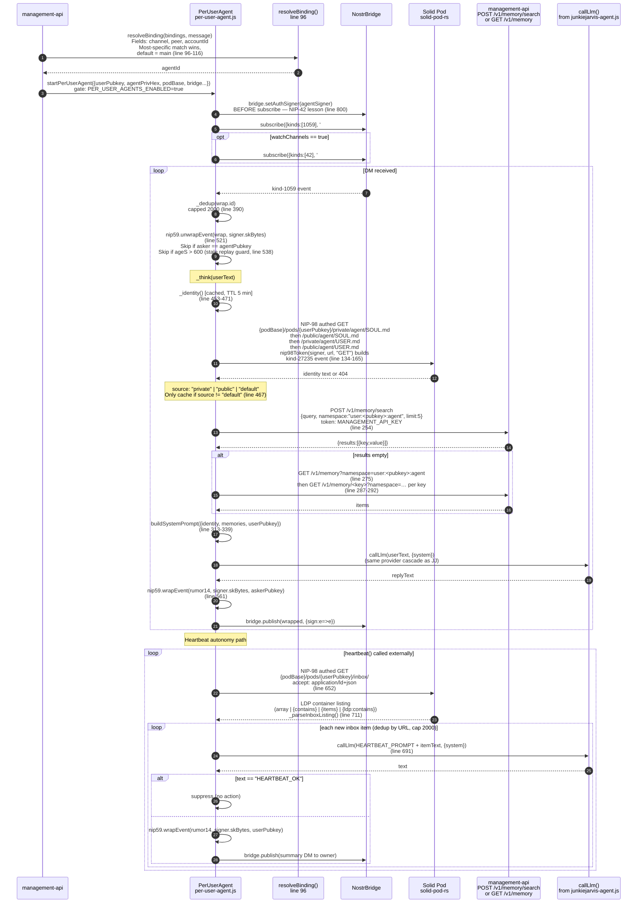
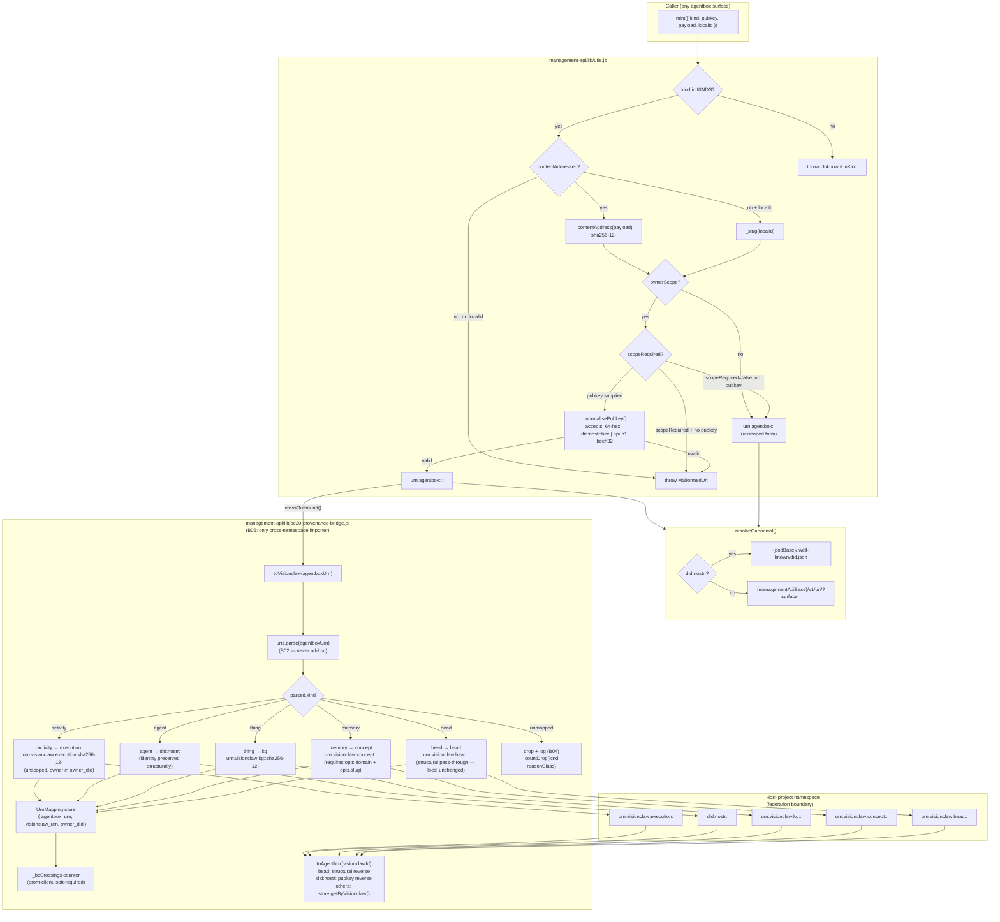

# Identity, Session Mirror, and Agent-Communication Diagrams

Cartographic audit of identity plumbing and agent communication surfaces.
All diagrams are built from the actual source code at the file:line references
shown in each section. No material is invented or inferred from external
documentation.

Scope files examined:

- `scripts/sovereign-bootstrap.py`
- `management-api/lib/uris.js`
- `management-api/lib/junkiejarvis-agent.js`
- `management-api/lib/per-user-agent.js`
- `management-api/lib/bc20-provenance-bridge.js`
- `config/hooks/nostr-live-mirror.cjs`
- `config/entrypoint-unified.sh` (lines 581-604 for mirror-hook registration)
- `services/nostr-pod-bridge/src/main.rs` + `src/lib.rs`

---

## 1. Session Mirror: Claude Hook → Nostr Relay

Source: `config/hooks/nostr-live-mirror.cjs` lines 44-337.
Hook registration: `config/entrypoint-unified.sh` lines 581-604.

### Mirror relay policy (line 44-88)

- Default relay: `wss://dreamlab-nostr-relay.solitary-paper-764d.workers.dev` (hardcoded).
- Single override: `NOSTR_MIRROR_RELAY` (must match `wss?://`). Public relays (`NOSTR_RELAYS`) are deliberately ignored.
- The relay admits a kind-1059 gift wrap only when its first `["p"]` tag recipient is whitelisted; the child-key self-DM satisfies this because the child is pre-whitelisted.

---

## 2. JunkieJarvis Agent Loop

Source: `management-api/lib/junkiejarvis-agent.js`.
Startup gate: `startJunkieJarvis()` lines 684-733.

---

## 3. Per-User Agent Fabric (PUAF): Binding → Identity → Memory → Heartbeat

Source: `management-api/lib/per-user-agent.js`.
Startup gate: `startPerUserAgent()` line 770; gate env: `PER_USER_AGENTS_ENABLED=true` or `deps.force`.

---

## 4. URN Minting through uris.js and BC20 Federation Bridge

Source: `management-api/lib/uris.js` (mint, resolveCanonical, parse) and
`management-api/lib/bc20-provenance-bridge.js` (toVisionclaw, toAgentbox, crossOutbound).

### Kind map (bc20-provenance-bridge.js lines 92-103)

| agentbox kind | Host-project kind | Local computation |
|---|---|---|
| `activity` | `execution` | `sha256-12(agentboxUrn)` — content-addressed, unscoped |
| `agent` | `did:nostr:<pubkey>` | structural (pubkey pass-through) |
| `thing` | `kg` | `sha256-12(agentboxUrn)`, scoped by pubkey |
| `memory` | `concept` | `<domain>:<slug>` (requires caller opts) |
| `bead` | `bead` | structural pass-through (local unchanged, both grammars `<pubkey>:<sha256-12>`) |
| all other kinds | dropped | `_countDrop(kind, "unmapped-kind")` |

Store: `BC20_URN_MAPPING_PATH` (default `/var/lib/agentbox/code-harness/bc20-urn-mappings.jsonl`).
Metrics: `agentbox_bc20_drops_total{kind, reason_class}` and `agentbox_bc20_crossings_total{kind, direction}`.

---

## 5. Audit Findings

Findings are numbered and classified. Severity: HIGH / MEDIUM / LOW.
Classification: DUPLICATION / ENV-GAP / STALE-REF / STRUCTURAL.

---

### F-01 — Duplicate NIP-59 gift-wrap signing across four JS surfaces

**Severity: MEDIUM. Classification: DUPLICATION.**

`nip59.wrapEvent` / `nip59.unwrapEvent` (via `nostr-tools`) is implemented
independently in four distinct JS surfaces:

| Surface | File | Lines |
|---|---|---|
| Session mirror (outbound only) | `config/hooks/nostr-live-mirror.cjs` | 303-317 |
| JunkieJarvis (unwrap + wrap) | `management-api/lib/junkiejarvis-agent.js` | 535, 563 |
| PUAF (unwrap + wrap) | `management-api/lib/per-user-agent.js` | 521, 561 |
| NostrBridge client library | `mcp/servers/nostr-bridge.js` | ~681 (finalizeEvent) |

Each surface separately calls `require('nostr-tools')` (or a lazy getter),
resolves the module path individually, and implements its own fallback search
order. The mirror hook searches `management-api/node_modules` then
`mcp/node_modules` (lines 93-117); the management-api modules call
`require('nostr-tools')` directly (they inherit the management-api module
resolution); the mcp bridge has its own getter. A version drift between
`management-api/package.json` and `mcp/package.json` would produce silently
different NIP-59 behaviour at each surface.

Rust (`services/nostr-pod-bridge/src/lib.rs`) is a fifth surface but it uses
`nostr_bbs_core` from the `nostr-rust-forum` crate — a deliberate, versioned
dependency, not a duplicate.

**Recommendation**: Extract a shared `agentbox-nostr-crypto` internal module
(or promote `nostr-bridge.js` to a proper import) so all four JS surfaces share
one `nostr-tools` resolution path and one version.

---

### F-02 — Duplicate NIP-98 HTTP-auth token builder (nip98Token)

**Severity: MEDIUM. Classification: DUPLICATION.**

NIP-98 kind-27235 HTTP-auth token construction appears in two independent
implementations:

| Surface | File | Lines |
|---|---|---|
| PUAF pod fetch | `management-api/lib/per-user-agent.js` | 134-165 (`nip98Token()`) |
| NostrBridge client library | `mcp/servers/nostr-bridge.js` | 417-448 (`buildNip98Header()`) |

Both build identical tag arrays `[["u", urlWithoutQuery], ["method", METHOD]]`
plus an optional `["payload", sha256hex(body)]` tag. The two functions differ
only in whether the signer is synchronous (`per-user-agent.js` uses
`await signer.sign(unsigned)`) or a bridge-provided Promise. A correctness
difference in the query-string stripping (e.g. future URL normalisation) would
need fixing in both.

---

### F-03 — NIP-42 AUTH signer pattern duplicated in JunkieJarvis and PUAF

**Severity: LOW. Classification: DUPLICATION.**

Both `startJunkieJarvis()` (line 715) and `startPerUserAgent()` (line 800)
independently apply the same NIP-42 lesson: `bridge.setAuthSigner(signer)`
must be called BEFORE the first `bridge.subscribe()` call so the bridge can
answer relay AUTH challenges. The lesson itself is commented in both files.
If a third agent surface is added, this ordering constraint is easily missed.

**Recommendation**: Codify the pattern in `NostrBridge.attachAgent(signer, subscriptions)` so the ordering is enforced by the API.

---

### F-04 — Env vars consumed by JS/Rust but absent from entrypoint and compose templates

**Severity: MEDIUM. Classification: ENV-GAP.**

The following env vars are read in code but have no `export` or default in
`config/entrypoint-unified.sh` and are not mentioned in the env file templates
visible in-repo:

| Env var | Read at | Notes |
|---|---|---|
| `JUNKIEJARVIS_ENABLED` | `junkiejarvis-agent.js:687` | Gate for the whole JJ agent; silently off if unset |
| `JUNKIEJARVIS_PRIVKEY_HEX` | `junkiejarvis-agent.js:57` | Required when JJ enabled |
| `CONCIERGE_PRIVKEY_HEX` | `junkiejarvis-agent.js:57` | Legacy alias — undocumented |
| `JUNKIEJARVIS_MODEL` | `junkiejarvis-agent.js:294` | LLM model override |
| `JUNKIEJARVIS_LLM_BASE` | `junkiejarvis-agent.js:330` | OpenAI-compat base URL |
| `JUNKIEJARVIS_LLM_KEY` | `junkiejarvis-agent.js:328` | OpenAI-compat key |
| `JUNKIEJARVIS_MAX_REPLY` | `junkiejarvis-agent.js:445` | Reply char cap |
| `JUNKIEJARVIS_IGNORE_PUBKEYS` | `junkiejarvis-agent.js:449` | Block-list |
| `CONCIERGE_IGNORE_PUBKEYS` | `junkiejarvis-agent.js:449` | Legacy alias |
| `PER_USER_AGENTS_ENABLED` | `per-user-agent.js:774` | Gate for PUAF |
| `AGENTBOX_LIVE_MIRROR` | `nostr-live-mirror.cjs:280` | Off-switch; default ON when pubkey present |
| `AGENTBOX_MIRROR_CHILD` | `nostr-live-mirror.cjs:131` | Child-key derivation switch |
| `AGENTBOX_MIRROR_KEY_TAG` | `nostr-live-mirror.cjs:134` | HMAC domain separator |
| `AGENTBOX_MIRROR_RECIPIENT_PUBKEY` | `nostr-live-mirror.cjs:71` | Explicit recipient override |
| `BC20_URN_MAPPING_PATH` | `bc20-provenance-bridge.js:358` | Durable store path |
| `AGENTBOX_ADMIN_PUBKEY` | `nostr-pod-bridge/src/main.rs:100` | Required by bridge daemon |
| `AGENTBOX_ALLOWED_PUBKEYS` | `nostr-pod-bridge/src/main.rs:89` | Allowlist for bridge |
| `AGENTBOX_RELAY_BIND` | `nostr-pod-bridge/src/main.rs:97` | Bridge bind addr (default 127.0.0.1:7777) |

`MANAGEMENT_API_URL` and `MANAGEMENT_API_KEY` are auto-generated or read by
the entrypoint but their propagation to the PUAF `recallMemory()` call
(per-user-agent.js:250-252) relies on process environment inheritance from
supervisord — which works at runtime but is not documented in any template.

---

### F-05 — Env var `AGENTBOX_PUBKEY` used by mirror hook but not set by sovereign-bootstrap

**Severity: MEDIUM. Classification: ENV-GAP.**

`nostr-live-mirror.cjs:72` reads `AGENTBOX_PUBKEY` as a recipient pubkey
fallback. `scripts/sovereign-bootstrap.py` (lines 262-279) writes
`AGENTBOX_PUBKEY_HEX` and `AGENTBOX_X_ONLY_PUBKEY_HEX` to
`/run/agentbox/identity.env`, but not `AGENTBOX_PUBKEY`. The mirror hook's
priority chain is:

1. `AGENTBOX_MIRROR_RECIPIENT_PUBKEY`
2. `AGENTBOX_PUBKEY`
3. `AGENTBOX_BRIDGE_RECIPIENT_PUBKEY`
4. `AGENTBOX_ADMIN_PUBKEY`

`AGENTBOX_BRIDGE_RECIPIENT_PUBKEY` is exported by the bootstrap script (line
277) and sourced in the entrypoint (line 359), so the mirror falls through to
slot 3 and works. However slot 2 (`AGENTBOX_PUBKEY`) is an undocumented alias
that will never match the bootstrap output, potentially confusing operators
who set it expecting it to activate the mirror.

---

### F-06 — `NOSTR_MIRROR_RELAY` override accepted but not validated for WSS scheme

**Severity: LOW. Classification: STRUCTURAL.**

`nostr-live-mirror.cjs:87` accepts `NOSTR_MIRROR_RELAY` if it matches
`/^wss?:\/\//i`. A plain `ws://` URL (unencrypted) is accepted here for
testing convenience but there is no warning emitted when a production operator
sets it to a `ws://` URL. The comment at line 24 states the relay is
exclusively the cloud relay; a plain-WS override leaks plaintext NIP-59
rumor content to any network observer.

---

### F-07 — Remaining Telegram/CTM references (comment-only, no live code)

**Severity: LOW. Classification: STALE-REF.**

The following files contain textual references to the retired Telegram/CTM
mirror. All are in comments, docstrings, or commit-history prose — no code
path re-enables the Telegram path:

| File | Line | Content |
|---|---|---|
| `config/entrypoint-unified.sh` | 582 | `# Replaces the retired Telegram/CTM mirror.` |
| `config/hooks/nostr-session-summary.py` | 5 | `retired Telegram/CTM mirror` |
| `services/nostr-pod-bridge/src/lib.rs` | 326 | `/// Layout mirrors the retired Telegram digest:` |
| `scripts/agentbox-config-validate.js` | 373-374 | E014 tombstone comment |
| `scripts/provision-agent-stacks.py` | 39 | Docstring reference |

No `CTM_BOT_TOKEN`, `CTM_TELEGRAM_CHAT_ID`, or `ctm` binary references remain
in executable paths. The tombstone in `agentbox-config-validate.js` lines
373-374 is the authoritative retirement notice; the others are informational.

**Recommendation**: No code change required. References may be pruned in a
future housekeeping pass for doc clarity.

---

### F-08 — `MANAGEMENT_API_URL` defaults and fallback chain undocumented for PUAF

**Severity: LOW. Classification: ENV-GAP.**

`per-user-agent.js:250` uses `process.env.MANAGEMENT_API_URL || 'http://127.0.0.1:9090'`
as the base URL for memory recall. The entrypoint sets `MANAGEMENT_API_PORT`
(default 9090, line 77) but does not construct or export `MANAGEMENT_API_URL`.
The PUAF therefore always uses the hardcoded localhost default unless the
operator explicitly sets `MANAGEMENT_API_URL`. This is correct in practice
(same process, same host) but the implicit coupling is not documented.

---

### F-09 — BC20 bridge Prometheus counters soft-require prom-client; silently no-op in tests

**Severity: LOW. Classification: STRUCTURAL.**

`bc20-provenance-bridge.js` lines 52-71 soft-require `prom-client` in an IIFE.
If the module is absent, `_bcDrops` and `_bcCrossings` remain `null` and
`_countDrop`/`_countCrossing` silently skip. The drop log to stderr (line 117)
still fires, but the Prometheus counters — the agent-readable signal surface —
are silently absent. In a deployment without prom-client (e.g. a minimal test
container) all BC20 drops are invisible to monitoring dashboards.

---

*End of audit. Diagrams are authoritative against source as of 2026-06-11.*
