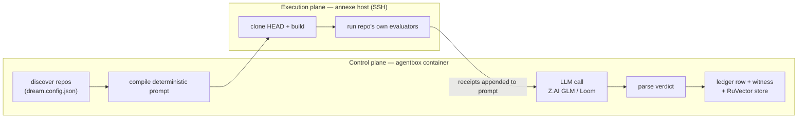

# Dream engine — nightly evidence-gated repo evolution

The dream engine is agentbox's "dream machine": an overnight batch that picks one nominated repository, has an LLM propose and justify one evolution against **real evaluator evidence**, records an ACCEPT / REJECT / INCONCLUSIVE verdict in that repo's ledger, and remembers the decisive ones. It runs when `[dream_machine].enabled = true` in `agentbox.toml`.

## Context in one paragraph

Left to itself, an LLM asked to "improve this repo" hallucinates plausible-sounding changes it never ran. The dream engine removes the hallucination surface by splitting the work across two planes: the **control plane** (this container) compiles a deterministic prompt and orchestrates; the **execution plane** (an SSH-reachable annexe host — the connected node on the DreamLab estate, [ADR-052](../archive/adr/ADR-052-dream-machine-hp-annexe.md)) actually clones, builds, and runs the target repo's own evaluators. The evaluator receipts are appended to the prompt, so the model reasons over output it did not invent. A verdict is parsed deterministically, a ledger row is appended in the target repo, and a tamper-evident witness binds the report to the exact commit it judged. It is the Rust rewrite of `scripts/dream-machine-nightly.mjs`; the `.mjs` orchestrator is now the legacy fallback (see [below](#legacy-mjs-fallback)).

The engine holds **zero estate credentials on the annexe host**: it is a pull-nothing, push-work model. The control plane opens an outbound SSH session, ships a `git archive` of HEAD, runs commands, reads stdout back. The annexe never calls into agentbox, never holds an API key, and never sees the RuVector database. Secrets (the Z.AI key, the Postgres conninfo) live only in the control-plane process environment.

## Why an optional, host-specific feature?

`[dream_machine]` gates both the Nix package set and the supervisor block, following the general rule in [CLAUDE.md](../../CLAUDE.md): optional features are byte-identical-when-off. With `enabled = false`, `lib/dream-engine.nix` is never imported, the `dream-engine` binary is not in the image, and no `[program:dream-engine]` block is generated — the manifest and image outputs are unchanged. It is also host-specific: it needs an SSH-reachable annexe host and an LLM endpoint, so the shipped `setup/agentbox.default.toml` carries the section commented out. The live estate manifest enables it.

## Architecture



* **Control plane** (`services/dream-engine`, this container): discovery, prompt compilation, LLM dispatch, verdict parsing, ledger/witness/memory persistence.
* **Execution plane** (annexe host, over SSH): `git archive` of HEAD is shipped and extracted remotely (uncommitted changes are deliberately excluded so the witness commit always matches the evaluated tree), then the build step and each evaluator run inside the annexe working dir. Remote commands are wrapped in `bash -lc` because the annexe login shell is fish.

## Nominating a repo — `dream.config.json`

Any repository under the workspace root is nominated by dropping a `dream.config.json` marker in its root. Discovery is a single-level scan of the workspace directory; nominated repos are processed in sorted order and tonight's repo is picked by day-of-year rotation (or forced with `--target`).

| Field | Type | Meaning |
|---|---|---|
| `repo` | string (required) | Human name of the repo, e.g. `"DreamLab-AI/agentbox"`. |
| `slots` | array (required) | Rotating focus areas. Each is `{ "deep": "<theme>", "scan": ["<area>", …] }`. Tonight's slot = `dayInt % slots.length`. |
| `bonusModuli` | map | `{ "<modulus>": "<extra dive>" }`. A dive fires when `dayInt % modulus == 0` — periodic deep passes layered on the daily slot. |
| `buildStep` | object | `{ "cmd": "<build command>", "degradeOnWasmFailure": false }`. Run on the annexe before evaluators. |
| `annexeInclude` | array | Sibling workspace repos this repo's build/evaluators need — e.g. a crate with a Cargo `path = "../<sibling>"` dep on another repo. Each is archived from its own HEAD and extracted on the annexe at its **real depth under the workspace**: the target at `remote_dir/<its canonical path relative to the workspace root>` (`project/agentbox`, resolved through the `workspace/agentbox` symlink) and each sibling likewise (`nostr-rust-forum`), so a `../../../../<sibling>` path-dep climbs to `remote_dir/` exactly as it climbs to the workspace root locally ([ADR-060](../archive/adr/ADR-060-dream-annexe-path-dependencies.md); depth law added 2026-09-07 after the sovereign-mesh gate was found vacuous — the target had sat one level too shallow and cargo looked for the siblings one directory *above* the night dir). Empty/absent ⇒ unchanged. Shipping siblings only helps if an evaluator actually builds against them. |
| `evaluatorEntrypoints` | map | `{ "<name>": "<command>" }`. Each is run on the annexe; its stdout tail becomes evidence. **This is the load-bearing field** — see [evaluator liveness](#evaluator-liveness-the-1-failure-mode). |
| `competitors` | array | Named comparators the prompt asks the model to beat. |
| `adrConvention` | string | ADR numbering convention (default `"4-digit"`). |
| `extraDisciplines` | array | Extra review lenses folded into the prompt. |
| `ledgerPath` | string | Where the ledger row is appended, relative to the repo (default `docs/dream-cycle/LEDGER.md`). |
| `branchPrefix` | string | Branch namespace for proposed work (default `dream/`). |
| `autoMerge` | bool | **Recommend `false`.** Accepted findings are evidence for a human to act on, not an instruction to merge unattended. |

Only `repo` and a non-empty `slots` (each with a non-empty `deep`) are validated; everything else defaults.

## Nightly pipeline

One cycle (`run_cycle`) is a fixed sequence:

1. **Discover** nominated repos under the workspace.
2. **Select** tonight's repo — `--target` override, else day rotation.
3. **Load + compile** — read `dream.config.json`, pick tonight's slot + bonus dives, compile the deterministic prompt.
4. **Dispatch** — `git archive HEAD` → SCP to the annexe → extract → run `buildStep` then each evaluator; capture stdout.
5. **Evidence** — append the build-output tail and each evaluator's output tail to the prompt, so the model reasons over receipts, not imagination.
5c. **Tree-read** (ADR-2114) — a bounded side-channel call names the source files tonight's hypothesis needs; the engine validates each path and reads it from the **dispatched commit** (`git show <commit>:<path>`), then appends a `## Source (from <commit>)` section. The model has no shell: without this it was asked for a diff against code it had never seen.
6. **LLM call** — Z.AI GLM by default, Loom fallback. A failed call degrades to an `INCONCLUSIVE` night rather than aborting. If the report declares ACCEPT with no ```dream-patch block, one **repair pass** asks for the diff alone (or `NO-PATCH: <reason>`); its outcome is receipted in `<night>/repair.json`.
7. **Verdict + finding** — parse the verdict, sanitise a one-line finding for the ledger cell.
8. **Witness** — bind the report to the repo's current commit.
9. **Persist report** locally under the artefact dir.
10. **Ledger row** — append to the repo's `ledgerPath`.
11. **RuVector store** — significant findings only; fail-open (a memory failure never fails the night).

`--dry-run` stops after step 3 (compile + select only; no dispatch, no LLM).

## Verdict semantics + significance bar

Two parses run over the LLM's free-form markdown, and they answer different questions.

The **lenient** parse (`verdict::parse_verdict`) supplies the ledger's finding text. A strict priority order ensures a stray keyword in the body can never override an explicit trailing `VERDICT:` line (a false positive that bit us in production — it has a regression test).

The **strict** parse (`verdict::parse_verdict_strict`) is the only reading *acceptance* consults (ADR-2024). It requires a bare, unambiguous `VERDICT: <TOKEN>` line: trailing prose, conflicting declarations, unknown tokens and a missing line are all typed errors, and an error can never reach ACCEPT. Prose archaeology is fine for a table cell; it is not fine for promoting code.

Five outcomes:

| Verdict | Meaning | Persistence | Dry streak |
|---|---|---|---|
| `ACCEPT` | The experiment is justified by the evidence. | Ledger row **and** RuVector (importance 0.9). | resets |
| `REJECT` | The experiment is refuted by the evidence. | Ledger row **and** RuVector (0.7) — a refutation is as valuable as an acceptance. | resets |
| `INCONCLUSIVE` | Hypothesis tested, evidence insufficient (or a degraded LLM night). | Ledger row **and** RuVector (0.4) — the operational lessons (evaluator traps, false positives) are worth recalling. | counts |
| `BLOCKED-ENV` | Hypothesis **untested** — the pre-flight probe found the annexe checkout missing/empty twice, a required evaluator could not run, or a candidate patch would not apply. No LLM call in the pre-flight case. | Ledger row + operator inbox alert only — a broken harness is state, not knowledge. | neither counts nor resets |
| `HANDOFF` | Nomination **refused before scheduling** — tonight's deep has no usable evaluator (empty map, no evaluator covering the deep, an all-advisory roster, a non-probative or empty command, a script absent from the tree, a darwin entrypoint without `--sandbox mock\|agent`). No clone, no build, no evaluator, no LLM call. | Ledger row + an operator *question* in the dream inbox: which evaluator should decide this deep? | neither counts nor resets |

**Operator rows.** When a human appends a row by hand (deep `operator-handoff`, witness `operator`), use verdict `OPERATOR` and evaluated `n/a`. The dry-streak counter only reacts to `INCONCLUSIVE` (counts), `ACCEPT`/`REJECT` (reset) — any other token is neutral, so operator bookkeeping never parks or revives a repo by accident. On 2026-09-07 an operator row written as `INCONCLUSIVE` took the host project's streak from 2 to 4 before it was caught; the dream-engine repo's row contract (`packages/ledger/src/rowContract.ts`) accepts `OPERATOR`, `BLOCKED-ENV` and `HANDOFF` for the same reason.

Splitting "untestable (environment)" out of INCONCLUSIVE is load-bearing: environment faults no longer park healthy repos via the dry streak, and they surface to the operator (dream inbox) instead of masquerading as evidence. The 2026-08-21 `PIN-DRIFT-KITREF` false positive — empty greps in a vanished cwd graded as drift — is the canonical failure this prevents.

### Self-healing & operator loop (2026-08-21)

- **Singleton lock** — the engine binds `127.0.0.1:49172`; a second instance exits instead of racing the shared the connected node annexe (the 2026-08-20/21 double-loop corruption class). One-shots require stopping the loop first.
- **Pre-flight probe** — after `clone_to_hp`, the checkout must exist and be non-empty; one re-provision retry, then `BLOCKED-ENV`.
- **Unique annexe dirs** — remote night dirs carry a `-r<run_id>` suffix. The run id is deterministic, so two attempts at the same experiment share one workspace while two different experiments never collide — and the name survives a restart, which a pid could not.
- **Carry-over** — the previous night's `Next steps` / `Biggest uncertainty` / `Main lesson` lines and any answered operator questions are appended to the next compiled prompt, so nights compound.
- **Decisions (governance panel, ADR-2115)** — report "Human action recommended" items and night-health anomalies queue in `workspace/.agentbox/dream-inbox.json` (the engine's working copy) and are published as kind-31402 cases on JunkieJarvis's `dream-machine` panel at the end of each night. The operator decides on the forum governance page (Approve / Reject / Amend per case, "Acknowledge all alerts" for the panel); the engine ingests the admin-signed kind-31403 decisions at the start of the next night and carry-over reads them. The `dream-inbox-surface.cjs` hook only reminds sessions how many cases wait; `scripts/dream-inbox.mjs answer` is break-glass.
- **Night health** — `workspace/.agentbox/dream-last-night.json` records one outcome per scheduled repo plus the nominated, standby (manual marker or dry-streak parked) and cap-deferred roster; zero-eligible nights and FAILED/BLOCKED-ENV outcomes raise alerts.
- **Harvest** — `scripts/dream-harvest.mjs` (weekly): verdict counts, streaks, pending-ACCEPT review list, env-fault rate.

## The acceptance path (ADR-2024, 2026-09-05)

Evaluation used to run entirely *before* the model wrote its patch, so the diff it emitted was never itself tested, and a report could carry evaluator failure text and an `ACCEPT` label at once. The acceptance path now composes six pieces, each a small pure module with its own tests:

1. **Evaluator-readiness admission** (`readiness.rs`) — before anything is scheduled, the config and the checked-out tree are inspected: does an evaluator cover tonight's deep, is any of them required, is the command probative, does its script exist? An unusable nomination is refused with `HANDOFF`. Static only: nothing is executed.
2. **Frozen experiment manifest** (`manifest.rs`) — written atomically to `<night>/manifest.json` **before any model call**: baseline revision *and* tree hash, evaluator identities with `sha256(command)`, the `dream.config.json` digest, the intended model identity, and the `run_id`. The run id is a pure function of those inputs, so a restart recomputes it; a moved baseline archives the superseded manifest rather than overwriting it.
3. **Durable run journal** (`runstate.rs`) — `<night>/run-state.json` records the phase after every transition. A completed night is skipped rather than repeated, an interrupted one resumes from its recorded phase with the attempt counted, and an exhausted one is abandoned with an operator alert instead of looping.
4. **Typed receipts** (`runner.rs`, `receipts.rs`) — every evaluator run yields exit code, both streams verbatim, duration and a classified outcome (`Passed`, `Failed`, `ExplicitFail`, `Blocked`, `TimedOut`, `Silent`, `Missing`), persisted raw under `<night>/receipts/{baseline,candidate}/`. Execution goes through an `EvaluatorRunner` seam, so the whole path is exercisable offline.
5. **Candidate rerun** (`candidate.rs`) — on a strict `ACCEPT`, the emitted `dream-patch` (or the repair pass's) is applied on an isolated git worktree **at the dispatched commit**, its tree hash recorded in `<night>/candidate.json`, and the required evaluators re-run **against that tree**. `git apply` is tried plain, then `--recount`, then `--recount --ignore-whitespace`, then `--3way` when the diff names real blob ids; a final failure carries the last strategy's stderr into the `DidNotApply` detail. The operator's working tree is never touched.
6. **The deterministic gate** (`gate.rs`) — a pure function of manifest, strict verdict, candidate state and candidate receipts, recorded in `<night>/gate.json`. A required evaluator that is missing, silent, blocked, timed out, non-zero or explicitly failing vetoes `ACCEPT` regardless of report text.

| Veto class | Cause | Verdict |
|---|---|---|
| harness | required evaluator missing / silent / blocked / timed out; patch would not apply | `BLOCKED-ENV` |
| evidence | required evaluator exited non-zero, or declared `FAIL` | `REJECT` |
| unproven | `ACCEPT` with no candidate patch; unreadable verdict line | `INCONCLUSIVE` |

### Tree-read and the single-completion contract (ADR-2114, 2026-09-25)

The nightly model is one chat completion with no tools. The prompt used to be written for an agent — run the evaluators, build the candidate, publish a gist, append the ledger — while the model saw receipts and no source. Between 2026-09-07 and 2026-09-21 twelve nights ended with an ACCEPT carrying no ```dream-patch block and two with a patch that would not apply; the INCONCLUSIVE streaks then parked every repo on standby (zero-eligible nights from 2026-09-22). Three changes close it:

1. **Source section** (`source.rs`): planner-named files plus paths the evidence itself mentions, validated (relative, no `..`, tracked at the commit, outside the secret denylist — `.env*`, `*secret*`, `*credential*`, key and keystore files), read at the dispatched commit, clipped head+tail with an explicit elision marker, and receipted in `<night>/source.json`.
2. **Honest prompt** (`compile.rs`): the model is told what the engine has done and will do; it analyses, freezes a hypothesis, writes the diff and proposes a ledger row. It is never asked to run, publish or persist anything, and an ACCEPT without a diff is stated to be vetoed.
3. **Repair pass**: one follow-up completion for an ACCEPT that still omits the diff.

| Variable | Default | Effect |
|---|---|---|
| `DREAM_SOURCE_READ` | on | `0` disables tree-read (the night runs as before) |
| `DREAM_SOURCE_MAX_FILES` | 12 | files inlined per night |
| `DREAM_SOURCE_BUDGET` | 60000 | total bytes of source text |
| `DREAM_SOURCE_FILE_CAP` | 16000 | bytes per file before head+tail clipping |
| `DREAM_SOURCE_INDEX_CAP` | 24000 | chars of tracked-path index shown to the source planner |

A draft PR is opened **only** when the gate upholds the ACCEPT; a vetoed candidate's branch is deleted, so no unverified diff is left looking promotable. The human merge is unchanged — the gate can only refuse an acceptance, never grant a merge.

### Declaring evaluators

`evaluatorEntrypoints` values accept the historical bare string or an object:

```json
"evaluatorEntrypoints": {
  "tests": "cd services/dream-engine && cargo test 2>&1 | tail -15",
  "lint":  { "cmd": "npx eslint .", "required": false },
  "hooks": { "cmd": "bash scripts/hooks.sh", "deeps": ["hooks-pipeline"], "timeoutSecs": 600 }
}
```

Every command runs under `bash -o pipefail -c` (both the SSH and the local runner), so `cargo build 2>&1 | tail -12` reports cargo's exit code, not `tail`'s. Before 2026-09-07 the pipe masked a cargo manifest-resolution abort into `outcome=PASSED exit=0` for six consecutive nights, which made the REQUIRED `sovereign-mesh-bridge` gate vacuous; tail your output freely, the receipt still carries the producer's status.

A bare string reads **fail-closed**: `required: true`, every deep, a 1800 s budget. That is deliberate — an evaluator a repo bothered to declare is one the night is expected to honour — but it does mean every declared evaluator can veto. Mark genuinely advisory ones (`required: false`) explicitly. Load-time validation rejects an empty command, a zero timeout, and a `deeps` entry naming no declared slot.

### Fair roster scheduling

Discovery is alphabetical and the night is capped at `max_repos_per_night`, which used to mean the tail of the roster never dreamed. Selection now orders eligible repos least-recently-dreamed first (then fewest runs, then name) using `workspace/.agentbox/dream-roster.json`, so the cap rotates through the whole roster. A turn is a turn: a `BLOCKED-ENV`, `HANDOFF` or failed night still registers, or a repo with a broken harness would monopolise the schedule. The state is on disk, so a restart does not reset the rotation.

## Witness recipe

Every ledger row carries a compact witness that makes the chain tamper-evident. The binding is a double SHA-256:

```text
witness = sha256_hex( sha256_hex(report) ++ commit )
```

where `++` is ASCII concatenation of the 64-char lowercase report hash and the normalised (trimmed, lowercased, 7–64 hex) commit. A single changed byte in either the report or the commit yields a different witness; the ledger shows the first 12 characters. If the commit is missing or malformed the witness is recorded as `BLOCKED` rather than a bogus hash.

## Evaluator liveness — the #1 failure mode

**Silent no-op evaluators are the single biggest historical failure of the dream machine.** An evaluator that always emits the same output regardless of the code under test gives the LLM constant "evidence", so the night silently no-ops: it produces verdicts that look real but are surface-independent. Two concrete incidents:

* **redblue, night 1** — an evaluator entrypoint that classified as a silent no-op, producing identical output on every run.
* **darwin, ADR-099 (upstream `@metaharness/darwin`)** — a `@metaharness/darwin` entrypoint invoked with the default `--sandbox real`, which is *documented surface-independent*: it emits the same result regardless of the code under test.

The discipline is a hard criterion: **every evaluator entrypoint must provably produce surface-dependent output** — output that changes when the code under test changes. Two ways to satisfy it:

* Wire a real measurement. A `criterion`-style benchmark whose numbers move with the code is surface-dependent by construction.
* For `@metaharness/darwin` entrypoints, **always pass `--sandbox mock` or `--sandbox agent`** — never the default `real`. The `mock`/`agent` sandboxes route the evaluation through the actual code path; `real` is surface-independent and no-ops.

A quick self-check for any entrypoint you add to `evaluatorEntrypoints`: run it against two different commits and confirm the output differs. If it does not, it is a no-op and the night is worthless.

## Operations

**Today (pre-rebuild):** run the loop by hand in a tmux tab —

```bash
dream-engine --loop --agentbox-toml /etc/agentbox.toml
```

**After the next rebuild:** the `[program:dream-engine]` supervisor block runs the loop as a supervised background service (priority 230, background batch tier). `--loop` runs at most one cycle per UTC night inside `window_start..window_end` and exits cleanly if `enabled = false`.

**Manual runs:**

```bash
dream-engine --once                       # one cycle now, ignoring the window
dream-engine --dry-run                     # compile + select only; no dispatch, no LLM
dream-engine --once --target <repo>        # force a specific nominated repo
dream-engine --once --workspace <path> --artefact-dir <path>
```

Night artefacts (reports, receipts) are written under `workspace/.tmp/dream-annexe-artefacts/<date>-<repo>/`.

### How the manifest reaches the binary

The binary reads the `[dream_machine]` table (window, the connected node host, annexe dir, model names) from the file passed to `--agentbox-toml`. The image materialises the full manifest at the stable path `/etc/agentbox.toml`, which is what the supervisor block passes. The `environment=` line adds only the Nix-known LLM selection (`DREAM_LLM_PROVIDER`, `ZAI_MODEL`, `LOOM_URL`, `LOOM_MODEL`) so the provider is visible in the supervisor block; secrets are inherited from the entrypoint environment, never written into generated text.

### Environment variables

| Variable | Purpose | Source |
|---|---|---|
| `ZAI_ANTHROPIC_API_KEY` | Z.AI credential (GLM via the Anthropic Messages API). **Secret.** | Entrypoint env — never in the manifest or supervisor block. |
| `DREAM_LLM_PROVIDER` | `zai` (default) or `loom`. Overrides `[dream_machine].llm_provider`. | Supervisor block / shell. |
| `ZAI_URL`, `ZAI_MODEL` | Z.AI endpoint + model override. | Supervisor block / shell. |
| `LOOM_URL`, `LOOM_MODEL` | Loom façade endpoint + model override. | Supervisor block / shell. |
| `RUVECTOR_PG_URL` / `RUVECTOR_PG_CONNINFO` | Memory Postgres DSN (URL form, or libpq conninfo which is converted). **Secret-bearing.** | Container env. |
| `XINFERENCE_URL` | Embedding endpoint (default `http://${EMBEDDINGS_HOST}`). | Container env. |
| `RUST_LOG` | Log filter (default `info`). | Supervisor block / shell. |
| `DREAM_SOURCE_*` | Tree-read knobs — see [Tree-read](#tree-read-and-the-single-completion-contract-adr-2112-2026-09-25). | Supervisor block / shell. |

## Roster & standby pruning

Every **eligible** nominated repo dreams **every night**, serially, capped at `max_repos_per_night` (default 5 — cycles run 2–8 minutes, so five fit the window comfortably). Eligibility is read from each repo's own ledger: a repo whose trailing `prune_dry_streak` rows (default 5) are **all** INCONCLUSIVE goes to *standby* and is skipped, with the reason logged. The design intent:

- **REJECT is not stagnation.** A falsified hypothesis is the system learning; ACCEPT and REJECT both reset the streak. Only an unbroken run of INCONCLUSIVE nights — a saturated repo or a broken harness — parks a repo.
- **Standby is reversible, never destructive.** The nomination file and ledger stay untouched. A forced `dream-engine --once --target <repo>` still runs it; any decisive verdict revives it automatically. Fixing the harness gap that caused the streak is the usual revival path.
- Repos beyond the cap are skipped with a warning (alphabetical order); trim the roster rather than living with a permanent skip.

## Nightly digest and the governance panel

After each `run_night` the engine (`src/governance.rs`, `src/digest.rs`; fail-open; `DREAM_GOVERNANCE=0` pauses panel publishing and answer ingestion, `DREAM_DIGEST=0` pauses the digest — independent switches) does two things as **JunkieJarvis** (`JUNKIEJARVIS_PRIVKEY_HEX` from agentbox `.env`), NIP-42 authenticated on the live forum relay:

1. **Publishes decisions** to the governance panel: one kind-31400 panel (`d` = `dream-machine`) and one kind-31402 case per open inbox item (`d` = `dream-<item id>`, `a` = `31400:<jarvis>:dream-machine`). The relay admits these only from keys in its `agent_registry`, so JunkieJarvis must be registered there. At the start of the next night the engine reads the admin-signed kind-31403 decisions back and resolves the items (approve → answered; for an alert, acknowledged; reject → answered with the reason; amend → answered with the operator's text; delegate → stays open).
2. **Posts the digest** as a kind-42 topic root in the dreamlab zone's **chat with agents** section, composed from the night-health record rather than ledger verdicts alone. Every outcome is stated — ACCEPT/REJECT, INCONCLUSIVE, BLOCKED-ENV, HANDOFF, FAILED — and a night with nothing eligible lists the parked roster. (The retired `scripts/dream-night-digest.mjs` counted only ACCEPT/REJECT/INCONCLUSIVE rows and reported "No dream cycles ran tonight" from 14 to 25 September 2026 while repos were failing dispatch or all parked.) It ends with the number of decisions waiting and a link to the panel.

**Encrypted dreamlab zone (forum ADR-2016, `src/zone_crypto.rs`).** When `ENCRYPTION_ENABLED` is exactly `true` and the digest section's zone (`zone4-chat-with-agents` → `zone4` by the kit's section resolver) is `"encrypted": true` in `ZONE_CONFIG`, the relay refuses plaintext there, so the digest is NIP-44 v2 encrypted (`nostr_bbs_core::nip44`) to the latest zone-key epoch JunkieJarvis holds and tagged `["zk", zone, epoch, zone pubkey]`. With no key it is **not posted** (never plaintext): the status reads `digest: skipped — no zone key …`, lands in `dream-last-night.json` as `digest`, and raises an inbox alert that reaches the governance panel. Both settings are read from the environment, else the agentbox `.env` (same lookup as the JS agent). Keys come from the 0600 key file `$WORKSPACE/.agentbox/zone-keys.json` (override `ZONE_KEYS_FILE`; never in git), written by the JunkieJarvis agent when an admin grants it the zone key — format `{"version":1,"owner":"<JunkieJarvis pubkey>","keys":[{"zone","epoch","secret","pubkey","granted_by","received_at"}]}`; a file owned by another identity is ignored.

Governance shape (operator decision, 2026-08-15): **the digest is visibility, not approval**. Authority stays native — git gates code changes (a dream ACCEPT stages a branch/PR; a human merges), and the 31402/31403 forum broker gate governs boundary-crossing proposals (ontology, shared infra). ACCEPT deliberately triggers no automation: it is an evidence verdict, and keying permissions off it would create a verdict-inflation incentive.

- **Style**: plain English — firm conclusions first, then inconclusive nights, then repos the harness could not evaluate, a reliability note, cap-deferred repos, the decisions line and the standing "nothing merges without a human" footer.
- **Delivery is verified, not assumed**: the CF worker relay has been observed OK'ing an event and never persisting it. The engine reads its own event back by id and republishes once; it reports `published+verified` or `NOT VERIFIED` honestly.
- Routing overrides: `DREAM_RELAY` (legacy `DREAM_DIGEST_RELAY`), `DREAM_DIGEST_CHANNEL`, `DREAM_DIGEST_SECTION`, `DREAM_GOVERNANCE_URL`; key file `AGENTBOX_ENV_FILE`; inbox file `DREAM_INBOX_PATH`; zone encryption `ENCRYPTION_ENABLED`, `ZONE_CONFIG`, `ZONE_KEYS_FILE`.
- Manual: `dream-engine digest [--date YYYY-MM-DD] [--dry-run]`, `dream-engine governance publish|ingest [--dry-run]`, or `/dream digest`.

## the connected node hygiene & VRAM runbook

**Annexe cleanup is automatic.** Each successful cycle removes its own night dir on the connected node (`rm -rf <annexe>/<date>-<repo>`) once the report, ledger row, witness, and memory write are all control-plane side; failed cycles keep the dir for debugging. A retention sweep at dispatch time removes any night dir older than 3 days, so debug leftovers cannot accumulate either. Nothing on the connected node is a source of truth — every dir under the annexe is disposable at any time.

**Freeing VRAM for GPU work on the connected node.** The `loom-model` container (qwen3.8-27B) holds ~45 GB across both Quadro RTX 6000s while running. To run GPU code on the connected node:

```bash
ssh ${CONNECTED_NODE_SSH} "bash -lc 'docker stop loom-model'"   # frees VRAM (~2 min to stop)
# ... run GPU workload ...
ssh ${CONNECTED_NODE_SSH} "bash -lc 'docker start loom-model'"  # model reload takes a few minutes
```

Use `docker stop`, **not** `docker pause` — pause freezes the processes but leaves VRAM allocated. While `loom-model` is down:

- The `loom` façade stays up and degrades gracefully (`/health` reports `backend_reachable: false`).
- Dream cycles on the default `zai` provider are unaffected.
- The darwin `ruvllm` mutator **silently no-ops** (returns parent code unchanged) — a darwin receipt whose variants are all byte-identical to baseline during a VRAM window is this, not a defect. Prefer scheduling GPU work outside the nightly window (01:00–05:00 UTC).

Verify state before and after: `nvidia-smi --query-gpu=memory.used,memory.total --format=csv,noheader`.

## Legacy `.mjs` fallback

`scripts/dream-machine-nightly.mjs` is the original Node orchestrator. It is retained as a manual fallback and rollback path only — the supervised, first-party path is the Rust `dream-engine` binary. Reach for the `.mjs` script only if the binary is unavailable; new behaviour lands in the crate.

## Related

* [ADR-052 — the connected node annexe execution plane](../archive/adr/ADR-052-dream-machine-hp-annexe.md)
* [ADR-2114 — candidate diffs are written against engine-read source](../adr/ADR-2114-dream-candidate-diffs-against-engine-read-source.md)
* [Architecture overview](architecture.md) — manifest → flake → image → runtime
* `lib/dream-engine.nix` — the buildRustPackage derivation
* `services/dream-engine/` — the crate (57 hermetic tests)
