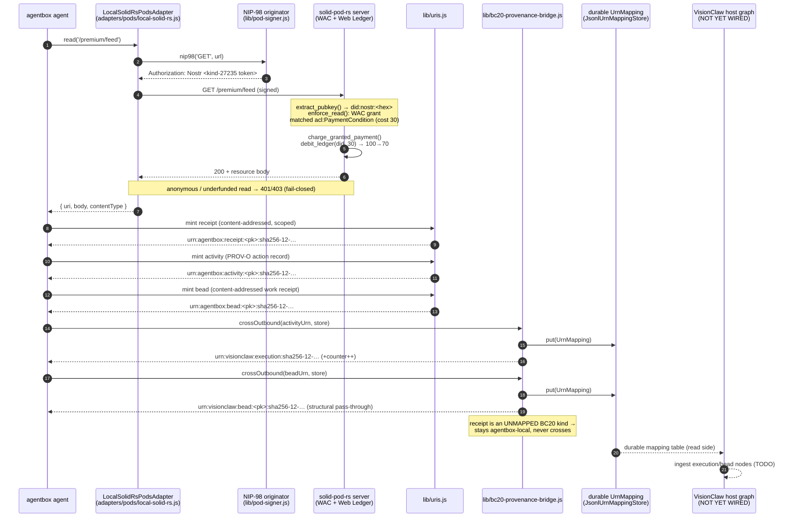
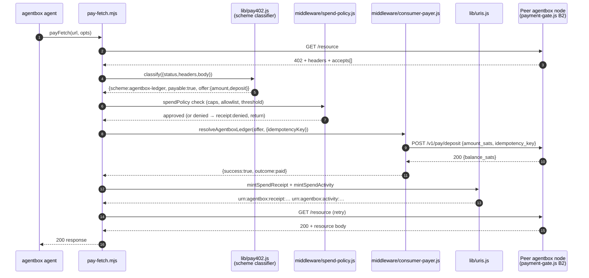

# Economy Loop — Cross-Repo Capability Demonstration

> Status: **Sell-side** (agentbox → solid-pod-rs → BC20): landed 2026-06-09, test-gated. **Buy-side consumer pipeline** (PRD-015 Phase 1): landed 2026-06-12 — C1 classifier, C3 spend-policy, C2 native payer, C4 URN receipts, B2 enriched challenges, B1 well-known manifest, C5 payment-router skill. The host-graph ingest leg (VisionClaw BC20 wiring) is specified but not yet wired (see [What remains](#what-remains)).

## TL;DR

An autonomous agentbox agent reads a **cost-gated** resource from a sovereign
`solid-pod-rs` pod. The pod's WAC gate **consumes** the per-read cost from the
agent's Web Ledger (it is a debit, not just a balance check). agentbox then
mints a **receipt** and a PROV-O **activity** record, and crosses the activity
plus a work **bead** across the **BC20 federation boundary** into a durable URN
mapping — the same `did:nostr` identity travelling unbroken from the signed read
to the federated provenance node.

This is the loop the whole sovereign substrate was built for: identity (NIP-98)
→ payment (Web Ledger) → provenance (receipt + activity) → federation (BC20).

## Sequence

> **Known gap (verified 2026-06-12):** receipt crossing to the host graph is
> not yet wired. `bc20.crossOutbound()` is invoked only from the test/runner
> tier (`tests/integration/economy-loop*`, `tests/sovereign/bc20-provenance-bridge.test.js`)
> — no production caller crosses into the host graph, and nothing on the host
> consumes the durable `UrnMapping` table. The `Host` lane below is design, not
> a live path.



## What is implemented, and where

| Leg | Repo | Code | Commit |
|---|---|---|---|
| Cost-gated read auth (NIP-98) | solid-pod-rs | `src/auth/nip98.rs`, `extract_pubkey()` in `crates/solid-pod-rs-server/src/lib.rs` | `b81ce9f` (NIP-98 minting/verify sync) |
| Balance resolution → WAC | solid-pod-rs | `resolve_balance_sats()` feeds `RequestContext::payment_balance_sats`; `PaymentConditionEvaluator` | `0cf2d61` (close sat-gating loop — balance wired to real ledger) |
| **Cost consumption (the debit)** | solid-pod-rs | `charge_granted_payment()` + `debit_ledger()` called from BOTH `enforce_read` and `enforce_write`, fail-closed | `f7785d7` (R-04; 18 in-crate ledger tests green) |
| Signed pod read | agentbox | `LocalSolidRsPodsAdapter` over `SolidHttpPodsAdapter._signedFetch` (`adapters/pods/`); originator from `lib/pod-signer.js` | (existing; PRD-014 Seam C) |
| URN minting (receipt/activity/bead) | agentbox | `lib/uris.js` `mint()` — all content-addressed, owner-scoped | (existing; ADR-013) |
| BC20 crossing + durable mapping | agentbox | `bc20.crossOutbound()` + `JsonlUrnMappingStore` + `durableStore()`; `agentbox_bc20_crossings_total` counter | `f5400826` (BC20 counters + durable JsonlUrnMappingStore) |
| **End-to-end demonstration** | agentbox | `tests/integration/economy-loop.test.js` + `economy-loop-runner.js` | this change |

Key invariants the demo proves:

- **Debit, not just gate.** The seeded ledger goes `100 → 70` sats on a single
  paid read (cost 30). solid-pod-rs commits `0cf2d61` + `f7785d7` make this real.
- **Fail-closed auth.** An unsigned read of the same resource returns
  `401`/`403` (surfaced as `PermissionDenied` by the adapter).
- **Sole-mint discipline.** Every URN is minted through `lib/uris.js`; none are
  ad-hoc template literals (ADR-013).
- **Closed BC20 map.** `activity → urn:visionclaw:execution`, `bead → bead`
  (structural pass-through). `receipt` is an **unmapped** kind and correctly does
  NOT cross — it is agentbox-local proof. The crossing increments
  `agentbox_bc20_crossings_total{kind="activity",direction="outbound"}`.
- **Durable round-trip.** Both mappings persist to a JSONL store and recover
  their agentbox source after a fresh reopen (provenance is reversible, B01).

## Consumer pipeline (buy-side — PRD-015 Phase 1)

The sell-side loop (above) lets agentbox *charge* for routes. Phase 1 closes the reciprocal gap: an agent can now *resolve* a 402 it receives, pay it, and get the resource — with deterministic policy gates, a complete audit trail, and no custody risk.



| Leg | File | Description |
|---|---|---|
| Scheme classifier (C1) | `management-api/lib/pay402.js` | Pure function, closed result set, 64KiB cap, never throws |
| Spend policy gate (C3) | `management-api/middleware/spend-policy.js` | Fail-closed: caps, allowlist, approval threshold |
| Native payer (C2) | `management-api/middleware/consumer-payer.js` | NIP-98 ledger debit, idempotency key, single retry |
| Receipt/activity URNs (C4) | `management-api/lib/receipt-minter.js` | Minted on EVERY attempt — audit trail has no gaps |
| Enriched challenge (B2) | `management-api/middleware/payment-gate.js` | Additive `accepts[]`, byte-identical legacy fields |
| Well-known manifest (B1) | `management-api/routes/well-known.js` | `/.well-known/x402.json`, generated at boot |
| Agent skill (C5) | `skills/payment-router/scripts/pay-fetch.mjs` | `payFetch()` — 402-aware drop-in fetch wrapper |
| Contract corpus (D4) | `tests/contract/pay402/` | Captured-bytes fixture corpus, merge gate |

Key invariants:
- **Fail-closed classifier.** `unknown` scheme is unpayable by construction. Malformed, oversized, or attacker-controlled bodies classify `unknown` and leave a denied-outcome receipt.
- **Sole-mint.** All receipt and activity URNs go through `lib/uris.js mint()` — same discipline as the sell side.
- **Idempotency.** The debit endpoint receives an `Idempotency-Key` header and `idempotency_key` in the body; a 409 replay is treated as success (no double-charge).
- **Lightning-first.** `x402` and `l402` classify correctly but `payable:false` in Phase 1 (no native rail yet). Phase 3 adds Lightning via NWC.

## How an operator runs the demo for real

The integration test exercises the loop automatically (see below). To run the
full loop by hand against a live pod:

1. **Build a debit-capable solid-pod-rs server** (the published `alpha.15` on the
   Nix store predates the debit fix and will grant the read WITHOUT debiting):

   ```bash
   cd /home/devuser/workspace/solid-pod-rs
   cargo build -p solid-pod-rs-server      # produces target/debug/solid-pod-rs-server
   ```

2. **Seed an FS-backed pod** with a Web Ledger and a paid-read ACL. The agent's
   WebID is `did:nostr:<hex-pubkey>` of the key it signs with. Files (under
   `$ROOT`):

   - `.well-known/webledgers/webledgers.json` — a `WebLedger` crediting the DID.
   - `premium/feed` — the gated resource body.
   - `premium/feed.acl` — Turtle ACL granting the DID `acl:Read` under an
     `acl:PaymentCondition` of N sats.
   - `premium/feed.acl.meta.json` — `{"content_type":"text/turtle"}` so the WAC
     resolver detects the Turtle ACL (the FS backend otherwise defaults `.acl`
     to `application/ld+json`).

3. **Start the server:**

   ```bash
   echo '{"server":{"host":"127.0.0.1","port":8484},"storage":{"type":"fs","root":"'"$ROOT"'"}}' > "$ROOT/config.json"
   ./target/debug/solid-pod-rs-server -c "$ROOT/config.json" --host 127.0.0.1 -p 8484
   ```

4. **Drive the loop** through the agentbox adapter (the runner script does
   exactly this — it is the canonical reference):

   ```bash
   cd /home/devuser/workspace/project/agentbox
   node tests/integration/economy-loop-runner.js   # prints one JSON result line
   ```

   The runner spawns its own seeded server on an ephemeral port; point
   `SOLID_POD_RS_SERVER_BIN` at a specific binary to override discovery. The JSON
   reports `balanceBefore`/`balanceAfter`, the minted URNs, the crossed
   `urn:visionclaw:*` ids, round-trip booleans, and the crossings counter delta.

### Running the test

```bash
cd management-api && npx jest ../tests/integration/economy-loop.test.js
```

The suite has two tiers:

- **Real tier** — spawns the live `solid-pod-rs` server (via the child runner,
  because nostr-tools v2's pure-ESM transitive deps cannot load inside jest's
  CommonJS sandbox) and asserts the genuine signed-read → debit → cross loop.
  Cleanly **skips** (test passes with a warning) when no debit-capable binary is
  found.
- **HTTP-mock tier** — always runs in-process; mocks ONLY the transport. Asserts
  the adapter's NIP-98 request shape and the receipt/activity/bead + BC20 logic
  on a `200`.

## What remains

The agentbox → solid-pod-rs → BC20 legs are closed. The **host-graph ingest leg
is not yet wired**:

1. **VisionClaw ingest of crossed nodes.** BC20 hands a `urn:visionclaw:execution`
   / `urn:visionclaw:bead` id plus a durable `UrnMapping`. VisionClaw must read
   that mapping table and materialise the corresponding graph nodes
   (`execution`, `bead`) with `owner_did` provenance. Today the mapping is durable
   on the agentbox side but nothing on the host consumes it. This is the B05
   ingest counterpart to agentbox's B05 export bridge — VisionClaw's `src/uri`
   grammar is converged across worktrees but **not merged to main** (main still
   carries `urn:ngm`), so the bridge contract in
   `management-api/lib/bc20-provenance-bridge.js` (+ its sovereign test) remains
   the executable definition until that merge lands.

2. **Counter scrape on the host.** `agentbox_bc20_crossings_total` and
   `agentbox_bc20_drops_total` are emitted on the agentbox `/metrics` registry
   (`f5400826`). A host-side Prometheus scrape + dashboard panel for crossing
   throughput / drop reasons is not yet configured.

3. **Live key stack, not a test key.** The demo signs with an ephemeral
   nostr-tools key. In production the originator comes from `lib/pod-signer.js`
   loading the agent's encrypted stack key (gated by
   `[integrations.solid_pod_rs].sign_requests`). The wiring exists; an
   operator-provisioned stack identity is required to run against a federated
   pod mesh rather than a locally-seeded one.

4. **Deposit settlement (PRD-015 C12 — Phase 3).** The Web Ledger is credited by writing the ledger doc
   (WAC-gated). There is no Lightning-invoice settlement check on deposit
   (solid-pod-rs audit A-4) — crediting is trusted-write today. Real-money
   settlement is a separate workstream.

## See also

- [`docs/developer/code-as-harness.md`](code-as-harness.md) — the URN allocation
  for execution/activity/lesson/skill records that share this identity mesh.
- [`docs/developer/identity-mesh.md`](identity-mesh.md) — the five `did:nostr`
  participants (solid-pod-rs, nostr-rust-forum, VisionClaw, dreamlab-ai-website,
  code-as-harness).
- [`docs/reference/adr/ADR-005-pluggable-adapter-architecture.md`](../reference/adr/ADR-005-pluggable-adapter-architecture.md)
  — the pods slot contract.
- [`docs/reference/adr/ADR-013-canonical-uri-grammar.md`](../reference/adr/ADR-013-canonical-uri-grammar.md)
  — the URN grammar every `@id` follows.
- solid-pod-rs `crates/solid-pod-rs-server/src/lib.rs` — `enforce_read`,
  `charge_granted_payment`, `debit_ledger` (the consumption path).
