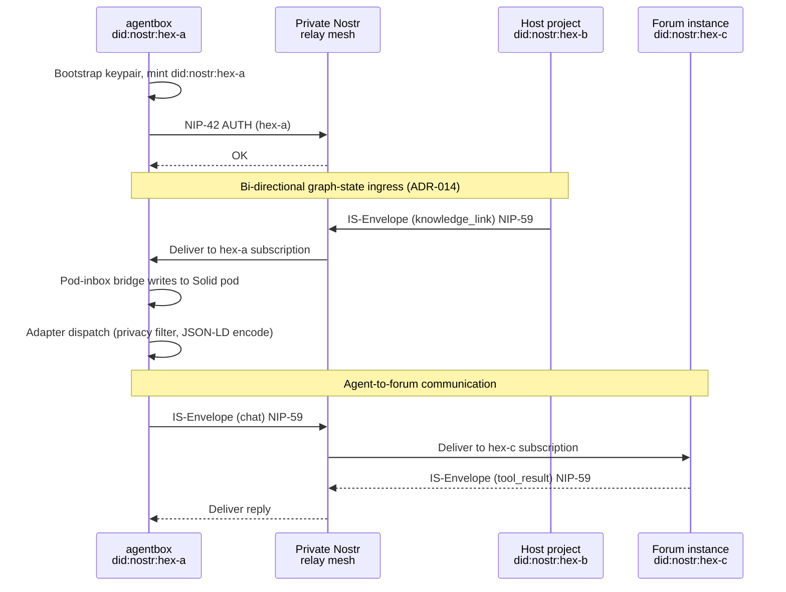

# Ecosystem integration

Agentbox is one of five federated repositories in the DreamLab open-source ecosystem. This document explains how agentbox participates in the mesh and how its boundaries interact with the other substrates.

## Five-substrate landscape

| Repository | Role | Relationship to agentbox |
|---|---|---|
| [solid-pod-rs](https://github.com/DreamLab-AI/solid-pod-rs) | Foundation library | Consumed as the embedded Solid pod server (ADR-010) |
| [nostr-rust-forum](https://github.com/DreamLab-AI/nostr-rust-forum) | Forum kit | Peer on the relay mesh; receives IS-Envelope messages |
| **[agentbox](https://github.com/DreamLab-AI/agentbox)** | **Agent container** | **This repository** |
| [VisionClaw](https://github.com/DreamLab-AI/VisionClaw) | Integration substrate | Host project when used as a submodule; peer on the relay mesh |
| [dreamlab-ai-website](https://github.com/DreamLab-AI/dreamlab-ai-website) | Branded deployment | Downstream consumer of the forum kit; no direct dependency on agentbox |

## Mesh participation

Agentbox participates as a mesh peer via its built-in `nostr-rs-relay` (ADR-009). When `federation.mode = "client"` is set in `agentbox.toml`, the relay connects to the private relay mesh and exchanges NIP-42-authenticated messages with other substrates.

The shared identity primitive across all five repositories is `did:nostr:<hex-pubkey>`, derived from a BIP-340 secp256k1 keypair generated at bootstrap. Cross-system messages use the IS-Envelope v1 contract (7 envelope kinds, JCS-canonicalised, NIP-59 gift-wrapped on the wire).

## Federation message flow

## Dependency on solid-pod-rs

Agentbox consumes `solid-pod-rs` as its first-class Solid Protocol 0.11 server (ADR-010). The pod provides durable storage with WAC 2.0 access control, `did:nostr` identity binding, atomic-rename writes, and quota enforcement. The pod-inbox bridge (ADR-009) routes inbound Nostr relay messages into the pod's LDP inbox as AS2 LDN notifications.

## Integration contract with the host project

When agentbox is used as a git submodule inside a host project, the integration boundary is defined by:

- **ADR-014** (this repo): Bi-directional graph-state ingress for agent reaction
- **ADR-059** (host project): The corresponding integration contract on the host side

The host project is always referenced by role ("host project", "integrator", "external orchestrator") rather than by name. This is a deliberate design decision: agentbox is a standalone product that can be consumed by any host, and its documentation must not couple to a specific integrator.

## URI namespace boundary

Two parallel URI namespaces exist by design:

- `urn:agentbox:<kind>:[<scope>:]<local>` -- 18 kinds, minted in `management-api/lib/uris.js`
- `urn:visionclaw:<kind>:<hex-pubkey>:<local>` -- 6 kinds, minted in the host project's `src/uri/`

Both share `did:nostr:<hex-pubkey>` identity and `sha256-12-<12 hex chars>` content addressing. The BC20 anti-corruption layer maps between the two namespaces at the federation boundary.

## Standalone vs federated

Agentbox ships as a complete product in both modes:

- `federation.mode = "standalone"` -- local SQLite + JSONL adapters, no relay mesh, fully self-contained
- `federation.mode = "client"` -- connects to the relay mesh, federates with other substrates via adapter endpoints

The adapter contract (ADR-005) guarantees that every feature works in both modes. Contract tests in `tests/contract/` must pass for all three implementation classes per slot.

## Further reading

- [Sovereign mesh internals](sovereign-mesh.md)
- [Adapter pattern](adapters.md)
- [Identity and tracing mesh](identity-mesh.md)
- [ADR-009 -- Embedded Nostr relay](../reference/adr/ADR-009-embedded-nostr-relay.md)
- [ADR-010 -- solid-pod-rs adoption](../reference/adr/ADR-010-rust-solid-pod-adoption.md)
- [ADR-014 -- Bi-directional graph-state ingress](../reference/adr/ADR-014-bidirectional-graph-state-ingress.md)
