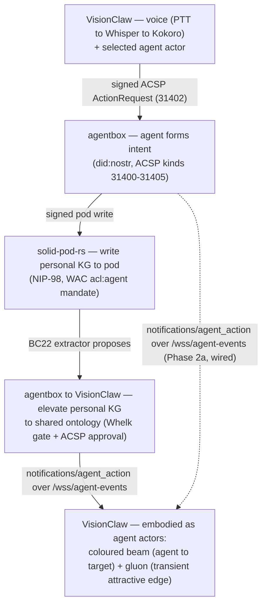
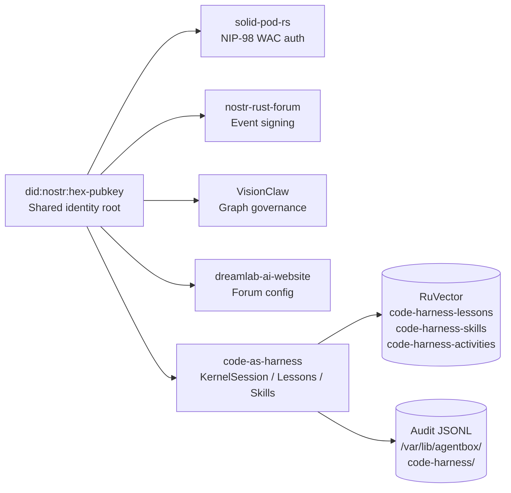
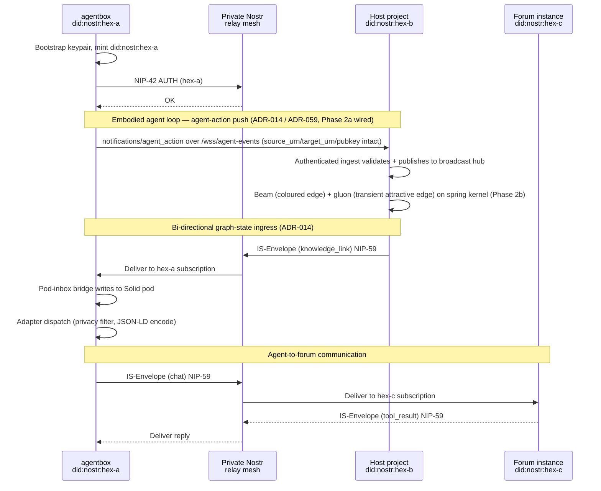
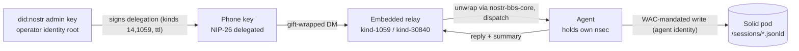

# Ecosystem integration

Agentbox is one of six repositories in the DreamLab open-source ecosystem — five federated product substrates plus the VisionFlow umbrella canon. This document explains how agentbox participates in the mesh and how its boundaries interact with the other substrates.

## Six-repository landscape

| Repository | Role | Relationship to agentbox |
|---|---|---|
| [VisionFlow](https://github.com/DreamLab-AI/VisionFlow) | Umbrella coordination canon | Documentation/positioning only; names the ecosystem flows. Pure canon — it does **not** sign on the relay, so it is not a did:nostr identity-mesh participant |
| [solid-pod-rs](https://github.com/DreamLab-AI/solid-pod-rs) | Foundation library | Consumed as the embedded Solid pod server (ADR-010) |
| [nostr-rust-forum](https://github.com/DreamLab-AI/nostr-rust-forum) | Forum kit | Peer on the relay mesh; receives IS-Envelope messages; renders ACSP governance panels |
| **[agentbox](https://github.com/DreamLab-AI/agentbox)** | **Agent runtime** | **This repository** — runs the agents |
| [VisionClaw](https://github.com/DreamLab-AI/VisionClaw) | Integration substrate | Host project when used as a submodule; peer on the relay mesh; renders the embodied agent loop (GPU/XR graph) |
| [dreamlab-ai-website](https://github.com/DreamLab-AI/dreamlab-ai-website) | Branded deployment | Downstream consumer of the forum kit; operator overlay |

> **Substrate count vs identity-mesh count.** The ecosystem has **six repositories**, but the
> `did:nostr` identity mesh has **five active signing participants**: solid-pod-rs (NIP-98 auth),
> nostr-rust-forum (event signing), VisionClaw (graph governance), dreamlab-ai-website (forum
> config), and the code-as-harness domain (below). VisionFlow is pure canon and signs nothing;
> agentbox is the runtime that *hosts* code-as-harness, so it is not double-counted. This is why
> code-as-harness is the **fifth** identity-mesh participant even though there are six repos.

## The embodied agent loop (cross-substrate flagship journey)

The six repositories together realise one flagship journey — **speak to an agent, have it act
on your sovereign Solid pod, watch a personal knowledge graph grow, and see selected concepts
elevated into the shared ontology, all visualised as living agent actors in the XR graph**.
agentbox runs the agents and emits the action signal; VisionClaw renders the embodiment;
solid-pod-rs stores sovereignly; the forum and website provide governance and operator surfaces;
VisionFlow is the canon. The journey and the substrates it crosses:

The ACSP and memory-flash producers — the agentbox-side hops the embodied loop
previously lacked — now exist as `management-api/lib/agent-control-surface.js`
(NIP-33 panel-event builders + publish delegate, no route yet) and
`management-api/lib/memory-flash-notifier.js` (privacy-safe, env-gated beacon
wired into both the MCP and `/v1/memory` paths). See
[sovereign-mesh.md](sovereign-mesh.md) for both.

The wiring contract is **agentbox ADR-014** (the ingress half) paired with **VisionClaw ADR-059**
(the server half); the cross-substrate seam closures are recorded in **agentbox ADR-026** and
driven by **PRD-014 (Embodied Agent Loop)**. As of 2026-05-29 the action signal is wired
end-to-end through Phase 2a: agentbox emits `notifications/agent_action` over `/wss/agent-events`
via a single canonical builder (identity preserved per ADR-013), and VisionClaw's authenticated
ingest publishes each event to a process-global broadcast hub. The transient **beam + gluon**
render (the visible embodiment) is the Phase-2b increment; the gluon is the attractive force the
transient beam edge already exerts on the spring kernel — **not** a per-node charge modulation
(ADR-059 §4, corrected 2026-05-29). The legacy MCP-TCP `:9500` path carries agent **state**
snapshots, a different payload from the agent **action** push, and is retired in favour of the one
`/wss/agent-events` socket.

## Code-as-Harness Domain (Fifth Participant in the Identity Mesh)

The code-as-harness integration (PRD-008, ADR-018, ADR-019, ADR-020, DDD-005) adds a fifth participant to the `did:nostr` identity mesh without introducing new identity primitives. The domain owns code execution lifetime (`KernelSession`), trace verification (`ExecutionTrace`), lesson distillation (`DistilledLesson`), and verified-skill storage (`VerifiedSkill`). Every record it emits carries `owner_did = did:nostr:<hex>` — the same keypair already used by the solid-pod-rs NIP-98 auth, nostr-rust-forum event signing, and VisionClaw graph governance layers.

URNs follow the existing 18-kind grammar (ADR-013): `KernelSession` → `thing`, `ExecutionTrace` → `activity`, `DistilledLesson` → `memory`, `VerifiedSkill` → `skill`, ACI session → `thing`, ACI submission → `receipt`. Every state-changing dispatch emits an `action_urn = urn:agentbox:activity:<scope>:<verb>-<id>` Activity record (PROV-O aligned), making the domain's audit trail queryable via the same `mcp__claude-flow__memory_search` interface used across the mesh.

The `did:nostr` identity flows through all five identity-mesh participants. Federation surfaces for this domain are opt-in (`[linked_data.code_execution] enabled = true` in `agentbox.toml`), following the DDD-004 pattern: `LessonDistilled` and `SkillVerified` events are encoded as JSON-LD with the URN→IRI mapping (`urn:agentbox:K:S:L` ⇆ `https://urn.agentbox.dev/K/S/L`) before federation.

## Consuming the upstream forum kit primitives (2026-06-11)

Four features merged into nostr-rust-forum's upstream kit on 2026-06-11 are
**hand-rolled agentbox-side patterns promoted to first-class kit features**.
agentbox now consumes them rather than maintaining its own divergent copies:

| Kit feature | ADR (nostr-rust-forum) | agentbox-side consumption |
|---|---|---|
| `derive_subkey(root, tag)` — HMAC-SHA-256 purpose-scoped subkeys | [ADR-094](https://github.com/DreamLab-AI/nostr-rust-forum/blob/main/docs/adr/ADR-094-deterministic-subkey-derivation.md) | The session-mirror child-key derivation (tag `agentbox-mirror-v1`) now **matches and is consumed by** the canonical kit scheme. The kit's known-answer vector (root `0x01`×32 → `2d07f2ce…695d`) is the agentbox JS output verbatim — the cross-language contract is pinned, not parallel. |
| Atomic agent provisioning endpoint | [ADR-097](https://github.com/DreamLab-AI/nostr-rust-forum/blob/main/docs/adr/ADR-097-agent-identity-provisioning.md) | Agent identities should be provisioned via `POST /api/governance/agents/provision` (NIP-98 admin, one D1 batch). This supersedes the per-agent seed scripts (the `provision-junkiejarvis` / `provision-carol` / `mirror-child` four-call seed dance). The agent's own kind-0/NIP-65 remain client-signed under its `did:nostr`. |
| Per-container ACL delegation | [ADR-096](https://github.com/DreamLab-AI/nostr-rust-forum/blob/main/docs/adr/ADR-096-acl-container-resolution-and-delegation.md) | Pod delegation uses the container ACL form `<container>/.acl` (opt-in `PUT {"@delegation":{agent,modes}}`), with owner Control always preserved and `acl:Control` never delegated. The flat-sidecar `agent.acl` workaround is **retired** — both forms still resolve, so the `agent.acl → agent/.acl` migration is non-breaking. |
| Recovery & device-onboarding sheet | [ADR-095](https://github.com/DreamLab-AI/nostr-rust-forum/blob/main/docs/adr/ADR-095-recovery-device-onboarding-sheet.md) | The forum's printable recovery/device-onboarding QR sheet and the agentbox session-mirror onboarding (operator phone) share one generator and one 0xchat-targeted on-ramp. See [user/mobile-bridge.md](../user/mobile-bridge.md). |

The unifying principle: these are **library/contract reuse, not runtime forum
interop**. agentbox links the shared kit crate and consumes the kit's admin
endpoints, but reads and writes no forum BBS state — the "no forum at this time"
constraint (see [mobile bridge](#mobile-bridge--the-operator-phone-as-a-delegated-participant))
holds. `derive_subkey` provides domain separation, not compromise isolation; the
operator phone's revocable authority still rides NIP-26 delegation, not a subkey.

## Mesh participation

Agentbox participates as a mesh peer via its built-in `nostr-rs-relay` (ADR-009). When `federation.mode = "client"` is set in `agentbox.toml`, the relay connects to the private relay mesh and exchanges NIP-42-authenticated messages with other substrates.

The shared identity primitive across the five federated substrates is `did:nostr:<hex-pubkey>`, derived from a BIP-340 secp256k1 keypair generated at bootstrap (VisionFlow is canon and does not federate). Cross-system messages use the IS-Envelope v1 contract (7 envelope kinds, JCS-canonicalised, NIP-59 gift-wrapped on the wire). The hot-path agent-action signal does **not** use the relay — it rides the lower-latency `/wss/agent-events` WebSocket (ADR-014/ADR-059); the relay carries durable cross-session governance and authority grants.

## Federation message flow

## Mobile bridge — the operator phone as a delegated participant

The mobile bridge adds an operator's Android phone to the mesh as an interactive
chat surface onto internal agents (operator guide:
[user/mobile-bridge.md](../user/mobile-bridge.md); wiring:
[sovereign-mesh.md §Mobile bridge](sovereign-mesh.md#mobile-bridge--decrypt-at-dispatch)).
It does **not** add a sixth identity root. The phone holds its own secp256k1
keypair but acts under a short-lived **NIP-26 delegation** signed by the operator's
admin key — a revocable, window-bounded *extension* of the existing admin
identity, not a new signing repo. The five-participant identity-mesh count is
unchanged.

Two ecosystem boundaries make this clean:

- **Crypto is reused, not rebuilt.** The agent-side decryption (NIP-44 v2 / NIP-59
  gift wrap), delegation validation (NIP-26), and purpose-scoped subkey derivation
  (`derive_subkey`, ADR-094) are consumed from
  [`nostr-bbs-core`](https://github.com/DreamLab-AI/nostr-rust-forum) — the same
  crate already underpinning the relay worker, the auth worker, and the forum
  client. The session-mirror child key (tag `agentbox-mirror-v1`) is the kit's
  ADR-094 known-answer vector verbatim, so the JS and Rust derivations are one
  contract. This is **library reuse, not runtime forum interop**: agentbox links the
  shared crypto crate but reads and writes no forum BBS state. The "no forum at
  this time" constraint holds.
- **The phone is a pure Nostr citizen.** It speaks Nostr only — no Solid, no WAC,
  no LDP. The pod-write boundary sits entirely on the agent side: the agent writes
  session records (`kind-30840` + `/sessions/*.jsonld`) under its own identity,
  backed by a one-time WAC mandate. This is what decouples Android client choice
  from the sovereignty requirement — any NIP-17/42/55 client works.

The durability axis is shared with the rest of the mesh but the *ownership* axis
is the pod's: the relay (and, in Phase 2, the Cloudflare Durable Object) persists
events durably, but only the pod gives the operator export, migration, and WAC
control. agentbox keeps no durable chat transcript of its own.

## Dependency on solid-pod-rs

Agentbox consumes `solid-pod-rs` as its first-class Solid Protocol 0.11 server (ADR-010). The pod provides durable storage with WAC 2.0 access control, `did:nostr` identity binding, atomic-rename writes, and quota enforcement. The pod-inbox bridge (ADR-009) routes inbound Nostr relay messages into the pod's LDP inbox as AS2 LDN notifications.

## Integration contract with the host project

When agentbox is used as a git submodule inside a host project, the integration boundary is defined by:

- **ADR-014** (this repo): Bi-directional graph-state ingress for agent reaction — the agentbox half of the `/wss/agent-events` contract.
- **ADR-059** (host project): The corresponding integration contract on the host side — the WebSocket endpoint, the additive event envelope, and the beam + gluon render.
- **ADR-026** (this repo): Cross-substrate agent-loop seams — the four architectural decisions (real bidirectional BC20; scoped revocable pod mandate; governed elevation; ACSP as the single agent-action protocol) that close the five seams of the embodied loop.
- **PRD-014** (this repo): Embodied Agent Loop — the driving product spec, gap ledger, and cross-repo workstreams.

The bidirectional agent-action channel uses one transport: agentbox emits the canonical
`notifications/agent_action` envelope (identity preserved per ADR-013) and the host consumes it
over `/wss/agent-events`. The deprecated MCP-TCP `:9500` bridge is gated behind
`ENABLE_MCP_BRIDGE` (default off) pending full retirement; it carries agent **state** snapshots, a
payload distinct from the agent **action** push.

The host project is always referenced by role ("host project", "integrator", "external orchestrator") rather than by name. This is a deliberate design decision: agentbox is a standalone product that can be consumed by any host, and its documentation must not couple to a specific integrator.

## URI namespace boundary

Two parallel URI namespaces exist by design:

- `urn:agentbox:<kind>:[<scope>:]<local>` -- 18 kinds, minted in `management-api/lib/uris.js`
- `urn:visionclaw:<kind>:<hex-pubkey>:<local>` -- 6 kinds, minted in the host project's `src/uri/`

Both share `did:nostr:<hex-pubkey>` identity and `sha256-12-<12 hex chars>` content addressing. The BC20 anti-corruption layer maps between the two namespaces at the federation boundary. As of 2026-05-29 BC20 is **real, owned, bidirectional code** (no longer the paper reference earlier docs flagged): the executable contract lives in `management-api/lib/bc20-provenance-bridge.js` (the only cross-namespace importer, B05) with a closed kind map — `activity` ⇄ `execution`, `agent` ⇄ `did:nostr`, `thing` ⇄ `kg`, `memory` ⇄ `concept` — and a durable `UrnMapping` that round-trips identity with zero loss (ADR-026 D1). The host's converged `urn:visionclaw:*` grammar is six kinds (`concept | group | kg | bead | execution | did`); their shapes differ by kind and are documented in this repo's `CLAUDE.md` (an agent's identity *is* its `did:nostr` — there is no `urn:visionclaw:agent` kind).

## Standalone vs federated

Agentbox ships as a complete product in both modes:

- `federation.mode = "standalone"` -- local SQLite + JSONL adapters, no relay mesh, fully self-contained
- `federation.mode = "client"` -- connects to the relay mesh, federates with other substrates via adapter endpoints

The adapter contract (ADR-005) guarantees that every feature works in both modes. Contract tests in `tests/contract/` must pass for all three implementation classes per slot.

## Further reading

- [Sovereign mesh internals](sovereign-mesh.md)
- [Adapter pattern](adapters.md)
- [Identity and tracing mesh](identity-mesh.md)
- [ADR-009 -- Embedded Nostr relay](../reference/adr/ADR-009-embedded-nostr-relay.md)
- [ADR-010 -- solid-pod-rs adoption](../reference/adr/ADR-010-rust-solid-pod-adoption.md)
- [ADR-014 -- Bi-directional graph-state ingress](../reference/adr/ADR-014-bidirectional-graph-state-ingress.md)
- [ADR-026 -- Cross-substrate agent-loop seams](../reference/adr/ADR-026-cross-substrate-agent-loop-seams.md)
- [PRD-014 -- Embodied agent loop](../reference/prd/PRD-014-embodied-agent-loop.md)
