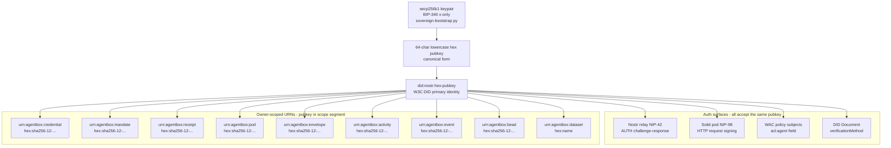
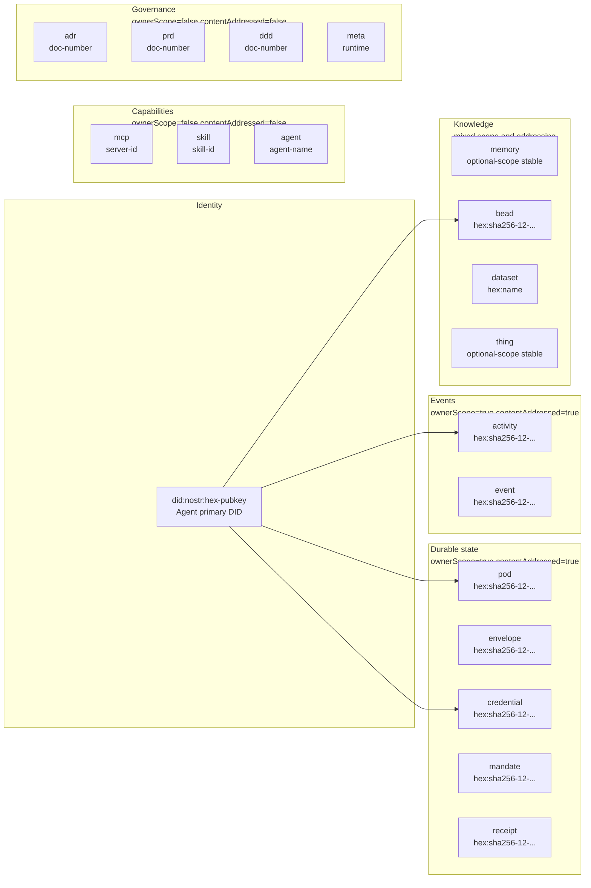
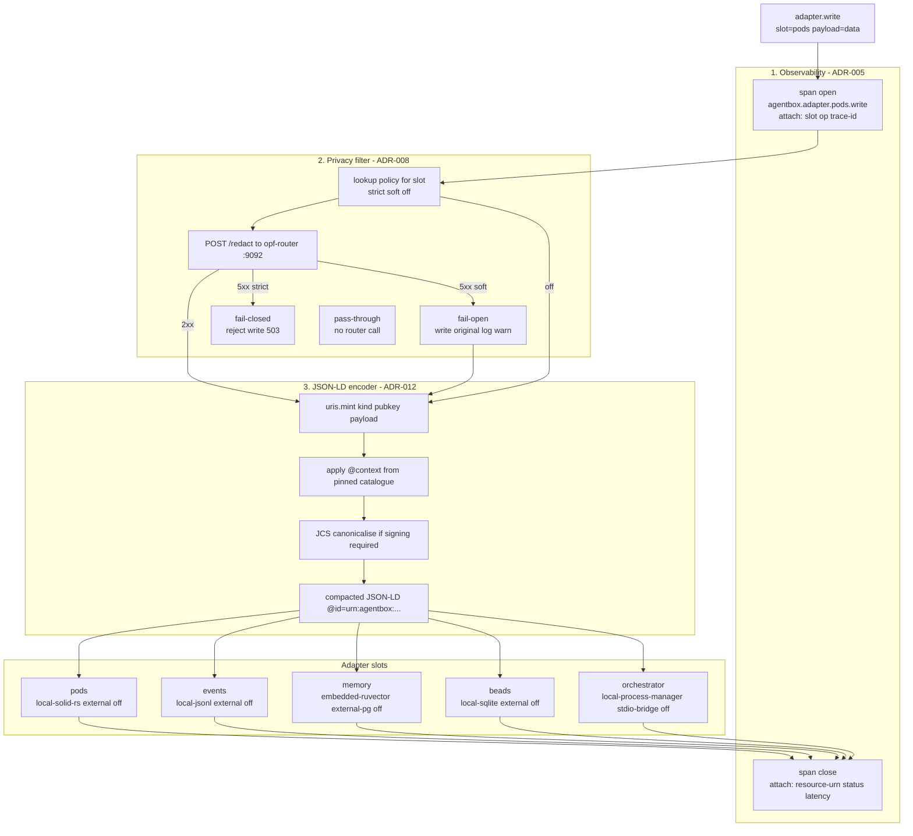
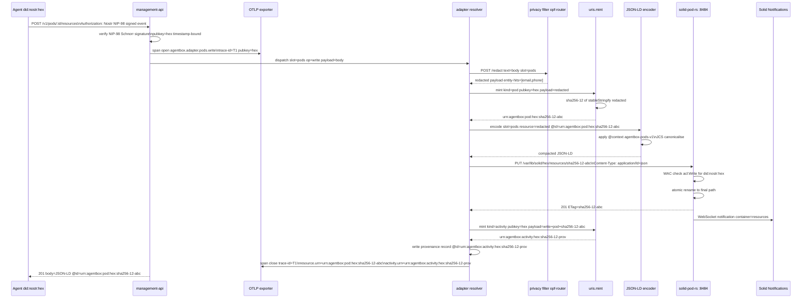
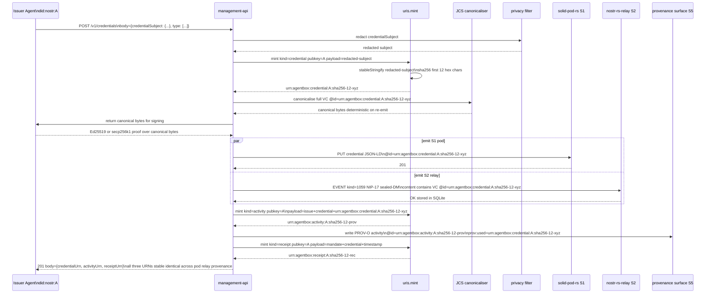
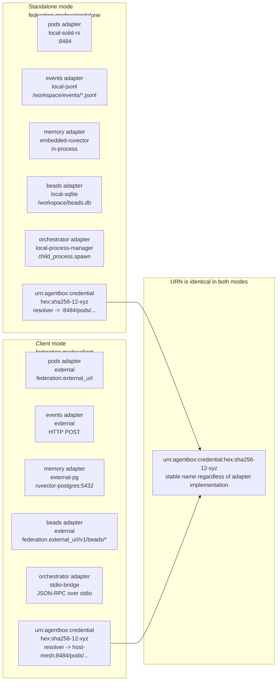

# Identity, Tracing, and Security Mesh

Agentbox's sovereign data stack is built on one invariant: every entity, action, and event in the system has a stable identifier rooted in a single cryptographic identity. This document explains the full chain from keypair generation to federated URI resolution, covering the identity root, the 18-kind URN namespace, the adapter dispatch pipeline, the request lifecycle, credential issuance, and federation boundary semantics.

The identity root is a BIP-340 secp256k1 keypair generated once at bootstrap by `scripts/sovereign-bootstrap.py`. The x-only public key — serialised as 64 lowercase hex characters — becomes `did:nostr:<hex-pubkey>`: the agent's primary DID. This DID is accepted by the embedded Nostr relay (NIP-42 AUTH), by the Solid pod server (NIP-98 HTTP auth, WAC policy subjects), by every verifiable credential issued or received, and by every content-addressed URN that carries the pubkey as its scope segment. Nothing in the system uses a different identity for the same agent. The hex pubkey is the canonical form everywhere except at the Nostr relay wire boundary and in legacy pod filesystem paths, where bech32 `npub` appears and is converted at the edge.

From the identity root, 18 kinds of `urn:agentbox:<kind>:[<scope>:]<local>` names cover every other entity the system emits. Owner-scoped kinds embed the hex pubkey as the scope segment and derive the local part from `sha256-12-<first 12 hex chars of SHA-256(stableStringify(payload))>`. This means the same resource always has the same name — re-emitting the same credential subject produces the same URN. Different resources always have different names. Stable-on-identity kinds (skills, MCP servers, ADRs) use a public immutable label as the local part and carry no scope. All minting goes through `management-api/lib/uris.js`; no surface invents ad-hoc IDs.

Every adapter dispatch passes through three mandatory middleware layers in a fixed order: (1) observability opens an OTLP span; (2) the privacy filter optionally redacts PII from the payload before any write; (3) the JSON-LD encoder wraps the output with stable `@id` values drawn from the URI grammar. The privacy filter runs before the encoder so the encoder never sees raw PII. The OTLP span carries the resource URN as an attribute, so every trace in the observability backend is directly linked to the named entity that was acted on.

The `/v1/uri/<urn>` resolver provides best-effort HTTP dereferencing: 307 to a current HTTPS IRI when resolvable, 404 when the URI is well-formed but the resolver has no mapping, 410 when the resource was deliberately retracted. Uniqueness is unconditional — every minted URI is globally unique by construction. Resolvability depends on which surfaces are enabled in the manifest. The linked-data browser at `/lo/*` follows `@id` links through the resolver, rendering panes by `@type`, so the entire emitted namespace is browsable without bespoke tooling.

## Identity Root

The secp256k1 keypair is the single root of trust. All downstream identifiers derive from it.

The pubkey hex is not validated cryptographically at the URI layer — `uris.js` is a name service, not a Schnorr verifier. Cryptographic validation of the keypair happens in `DDD-003 §AgentIdentity` and in the NIP-42/NIP-98 verification paths. The URI layer's contract is that the name is stable and unique; the crypto layer's contract is that the name refers to who you think it does.

## URN Kind Taxonomy

All 18 kinds fall into five categories. The `ownerScope` and `contentAddressed` flags determine the mint shape.

| Kind | Owner-scoped | Content-addressed | Resolvable surface | Notes |
|---|---|---|---|---|
| `pod` | yes | yes | pods | Pod resource; content-hash of the stored body |
| `envelope` | yes | yes | pods | Nostr sealed-DM envelope persisted to pod |
| `credential` | yes | yes | pods | VC; hash of `credentialSubject` |
| `mandate` | yes | yes | pods | Capability mandate; hash of assignee+target+action+constraints |
| `receipt` | yes | yes | pods | Payment receipt; hash of mandate+amount+customer |
| `activity` | yes | yes | agent-events | PROV-O activity; hash of action+slot+operation+input+output |
| `event` | yes | yes | agent-events | Agent event; hash of action+slot+timestamp+payload |
| `mcp` | no | no | things | MCP server; stable on `serverId` |
| `memory` | optional | no | memory | Memory namespace; stable on namespace name |
| `skill` | no | no | skills | Skill; stable on skill id |
| `adr` | no | no | docs | Architecture decision record |
| `prd` | no | no | docs | Product requirements document |
| `ddd` | no | no | docs | Domain design document |
| `thing` | optional | no | things | Generic named thing |
| `dataset` | yes | no | memory | Named dataset owned by an agent |
| `bead` | yes | yes | beads | Work bead; content-addressed (`sha256-12`) to match the host's converged bead grammar so BC20 crosses it structurally (uris.js, 2026-06-09) |
| `agent` | optional | no | agents | Named agent in the agent catalogue |
| `meta` | no | no | meta | Runtime meta; one per container |

Content addressing uses `sha256-12-<first 12 hex chars of SHA-256(stableStringify(payload))>`. The stable-stringify step sorts object keys recursively before hashing, giving a deterministic name for any JSON-serialisable payload regardless of key insertion order. This is sufficient for URI minting; the JCS canonicalisation step in the signing path provides bytes-identical signing fidelity when that is required.

## Adapter Dispatch Pipeline

Every write through the five adapter slots passes through three mandatory middleware layers in this order. The order is non-negotiable: observability must open its span before any other work begins; the privacy filter must redact before encoding; the encoder must see only redacted bytes.

> **Wiring note (2026-06-12):** Layers 1-2 (observability + privacy filter) are
> applied automatically to every adapter method by `instrumentAdapter()` in
> `management-api/adapters/index.js` (via `wrapDispatch` →
> `wrapWithPrivacyFilter`). Layer 3 (JSON-LD encoder) is invoked at call sites
> via `encoder.dispatch()`, opt-in per `[linked_data]` surface; the encoder's
> per-dispatch `assertPrivacyFilterApplied()` guard enforces the L08 ordering
> (fail-closed for pods/memory). The diagram below shows the canonical
> conceptual order across all slots.

The three middleware layers are cross-cutting: they apply identically whether the adapter implementation is `local-*` or `external`. ADR-005 §Behavioural equivalence requires that switching from `local-solid-rs` to `external` pods changes the backend HTTP endpoint but not the observability, privacy, or encoding behaviour. The resource URN minted in the encoding step is attached to the OTLP span as `resource.urn`, so every distributed trace carries a direct pointer to the named entity it acted on.

Privacy policy per slot:

| Slot | Default policy | Fail mode |
|---|---|---|
| `pods` | `strict` | reject write on router failure |
| `memory` | `strict` | reject write on router failure |
| `events` | `soft` | write original payload, log warning |
| `beads` | `soft` | write original payload, log warning |
| `orchestrator` | `off` | no router call |

`strict` is correct for pods and memory because those are durable and hard to retract. `soft` is correct for events and beads where losing the audit record is worse than admitting unredacted bytes. `orchestrator` carries internal control-plane messages with no user text.

## Request Lifecycle Trace

A complete walkthrough of `POST /v1/pods/:id/resources` from agent call to response.

> **Status:** illustrative composite — `POST /v1/pods/:id/resources` is not a
> management-api route as of 2026-06-12 (pod resource writes go to
> solid-pod-rs directly or through the pods adapter from other routes). Each
> individual step (NIP-98 verification, OPF redaction, `uris.mint`, JSON-LD
> encoding, WAC-checked atomic write) is implemented; the single endpoint
> shown stitching them together is not.

The trace `T1` in the OTLP backend links directly to both the pod resource URN and the activity provenance URN. An operator querying "show me all writes by agent `did:nostr:hex` to pods" can reconstruct the full history from the activity records without consulting the pod contents.

## Credential Issuance and Provenance

Credential issuance is the clearest demonstration of the determinism property. The credential's `@id` is derived from the `credentialSubject` payload. Re-issuing the same subject produces the same URN in the pod, in the Nostr envelope, and in the provenance record.

> **Status:** aspirational design — not implemented as of 2026-06-12. There is
> no `POST /v1/credentials` route in `management-api/routes/`; the determinism
> property it illustrates is real (content-addressed minting in
> `lib/uris.js`), but the issuance endpoint and dual pod/relay emit are design.

The credential URN `urn:agentbox:credential:A:sha256-12-xyz` is the same string in:

- the pod resource `@id`
- the Nostr envelope's inner VC payload
- the `prov:used` reference in the activity record
- any verifier's audit query result

If the issuer re-issues the same credential (e.g. for a retransmit), `uris.mint` produces the same URN. The relay rejects the duplicate event (Nostr uniqueness by event id); the pod returns 200 with the existing ETag; the provenance record is a new activity pointing at the same credential URN. The audit trail shows "issued once, re-transmitted once" with no double-counting.

## Federation and URN Stability

URNs survive backend swaps and host moves because a URN is a name, not a location. The resolver (`/v1/uri/<urn>`) is the location layer — its 307 redirect target can change when the operator reconfigures adapters; the URN itself never changes.

In standalone mode, `urn:agentbox:credential:hex:sha256-12-xyz` resolves via `/v1/uri/` to `http://127.0.0.1:8484/pods/hex/credentials/sha256-12-xyz`. When the operator switches to `federation.mode="client"` and points the pods adapter at a host mesh, the same URN resolves to `https://host-mesh.example/pods/hex/credentials/sha256-12-xyz`. The credential's content, its proof, and its provenance record are unchanged. External agents that cached the URN continue to use it; only the resolver redirect target changes.

This is why the project rule in `CLAUDE.md` states that URN uniqueness is unconditional and resolvability is best-effort. A credential issued in standalone mode before a federation migration is still a valid, uniquely-named credential after the migration. The proof block does not contain a URL that breaks.

## Security Properties

The identity mesh provides six security properties by construction.

**Non-forgeability.** Owner-scoped URNs embed the agent's hex pubkey in the scope segment. A different agent cannot mint the same URN for a credential, mandate, or receipt without controlling the corresponding secp256k1 private key. `uris.mint` enforces that the pubkey is present and well-formed (64 lowercase hex chars) for all owner-scoped kinds; it raises `MalformedUri` otherwise.

**Determinism.** Content-addressed URNs are a pure function of the payload. Given the same `credentialSubject`, any participant — issuer, verifier, auditor, or external integrator — can recompute the expected URN independently and check that it matches the `@id` in the signed document. A mismatch indicates tampering with either the payload or the identifier.

**Audit completeness.** Every adapter dispatch mints a `urn:agentbox:activity:…` provenance record carrying the action, slot, operation, input URN, and output URN. The OTLP span carries the same URNs as attributes. An auditor querying either the activity surface or the OTLP backend can reconstruct the full sequence of operations on any named resource without consulting the resource contents.

**Privacy before encoding.** The privacy filter (ADR-008) sits between the adapter resolver and the JSON-LD encoder in the dispatch pipeline. PII redaction completes before a single byte is passed to `uris.mint` or the encoder. The URN minted after redaction is therefore a name for the redacted form of the resource, not the raw form. The raw form never appears in a `@id` value.

**Signing stability.** JCS canonicalisation (RFC 8785) over a JSON-LD document with a stable `@id` produces byte-identical output on every run. The proof block in a verifiable credential signs canonical bytes that include the `@id`. Because the `@id` is deterministic (content-addressed), re-issuing the same credential on a different day in a different process produces the same canonical bytes and therefore the same proof value. Verifiers can detect any mutation.

**Cross-pod federation.** When two agentboxes exchange a credential via Nostr (NIP-17 sealed DM), the credential's `@id` is the same URN on both sides. Neither side remints. The receiving agent can pass the URN to its own resolver and, if the issuer's pod is reachable, dereference it directly. If not, the URN is still a globally unique stable name. There is no translation step at the federation boundary; the anti-corruption layer in the host project maps between `urn:visionclaw:*` and `urn:agentbox:*` kinds, but the identity (`did:nostr:<pubkey>`) and the hex pubkey scope segment are identical in both namespaces.
