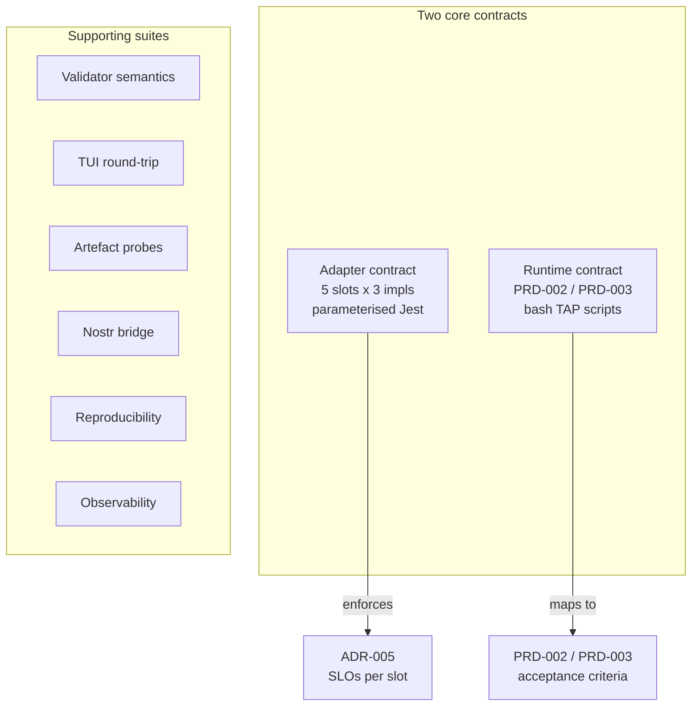
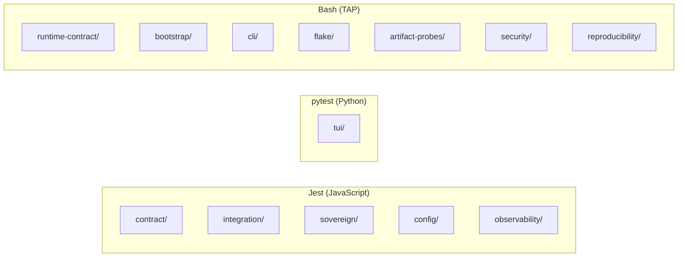
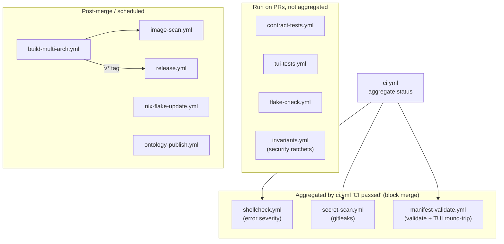

# Testing

Agentbox ships ~200 tests across nine categories. This doc covers how to run them and how to add your own.

## Context in one paragraph

Testing in this repo serves two distinct contracts: the **adapter contract** (every impl of every slot must satisfy the same parameterised assertions — [ADR-005 §Service-level objectives](../reference/adr/ADR-005-pluggable-adapter-architecture.md)) and the **runtime contract** (every boot must satisfy [PRD-002](../reference/prd/PRD-002-immutable-runtime-bootstrap.md) / [PRD-003](../reference/prd/PRD-003-runtime-contract-and-container-hardening.md) acceptance criteria, mapped 1:1 onto `tests/runtime-contract/RC-*.sh` scripts). Beyond those two, the suite covers validator semantics, TUI round-tripping, per-feature artefact probes, reproducibility of Nix builds, and the Nostr bridge. Read this file when you add a feature (you will almost certainly need a test in at least two categories) or when a PR fails CI and you need to know which workflow to look at.



## Glossary

- **Contract test** — a parameterised Jest suite under `tests/contract/<slot>.contract.spec.js` that runs the same assertions against every impl class for a slot. Adding an impl adds a row to the parameter list; the harness runs automatically.
- **Runtime-contract test** — a bash script under `tests/runtime-contract/RC-<prd>-<nn>.sh` mapping to one PRD-002/003 acceptance criterion. TAP output, skip-77 semantics.
- **TAP** — Test Anything Protocol; `ok N` / `not ok N` / `1..N`. All bash suites emit TAP so a single runner can aggregate them.
- **skip-77** — the convention that a bash test exits `77` when a prerequisite (Docker, Nix, GPU, SSD) is missing; the runner treats 77 as "skipped, not failed".

## Suite layout



```
tests/
├── contract/              # Adapter contract tests (Jest) — 5 slots × 3 impls
├── integration/           # Multi-component integration (Jest)
├── sovereign/             # Nostr-bridge integration (Jest)
├── runtime-contract/      # PRD-002/003 end-to-end (bash + Jest)
├── config/                # Validator semantic-rule tests (Jest)
├── tui/                   # Python TOML round-trip (pytest)
├── artifact-probes/       # Per-feature binary-exists probes (bash)
├── bootstrap/             # Entrypoint lifecycle tests (bash)
├── cli/                   # agentbox.sh smoke tests (bash)
├── flake/                 # Nix eval + generator tests (bash)
├── cuda/                  # nvidia-smi smoke (bash)
├── 3dgs/                  # COLMAP + METIS smoke (bash)
├── toolchains/            # blender + latex presence (bash)
├── security/              # gitleaks canary (bash)
├── reproducibility/       # nix-build-hash equality (bash)
├── backup/                # backup/restore round-trip (bash)
└── observability/         # metrics registry (Jest)
```

## Running

### JavaScript suites

```sh
cd management-api
npm test                              # full Jest run
npx jest tests/contract               # narrower
npx jest tests/contract/beads.contract.spec.js       # single file
npx jest --ci --forceExit             # what CI runs
```

### Python TUI tests

```sh
cd tests/tui
pip install -r requirements.txt       # pytest 8.3.5
pytest -v test_tui_helpers.py
```

### Bash suites

Each is self-contained, executable, TAP-output:

```sh
bash tests/runtime-contract/RC-002-03.sh       # pure file-lint, no Docker
bash tests/cli/smoke.sh
bash tests/reproducibility/nix-build-hash.sh   # requires Nix
bash tests/backup/round-trip.sh                # requires Docker
```

### Skip semantics

Bash tests exit:
- `0` — all assertions passed
- `1` — real failure
- `77` — skipped (missing Docker / Nix / GPU / etc.)

TAP output: `ok N` / `not ok N` / `ok N # SKIP reason`. Final line `1..N` summary.

### Running everything locally

```sh
# JavaScript
(cd management-api && npm test -- --ci)

# Python
(cd tests/tui && pytest)

# Bash (tolerates skip-77)
for f in tests/**/*.sh; do
  bash "$f" || [ $? -eq 77 ] || echo "FAIL: $f"
done
```

## CI workflows



> The former `runtime-contract.yml` and `docs-ci.yml` PR gates were removed
> from the aggregate (ci.yml header, "low value-to-noise"); the
> `tests/runtime-contract/RC-*.sh` scripts still exist and run locally or via
> shellcheck lint.

### PR gates

| Workflow | Trigger | Runs |
|---|---|---|
| [`contract-tests.yml`](../../.github/workflows/contract-tests.yml) | PR + push to main | Jest contract suite across every adapter impl (incl. relay-consumer + opf-router paths) |
| [`tui-tests.yml`](../../.github/workflows/tui-tests.yml) | PR | pytest TUI round-trip fixtures |
| [`manifest-validate.yml`](../../.github/workflows/manifest-validate.yml) | PR + push | `agentbox config validate`, fixture round-trip through TUI read/write, expected-error-code assertions, W-code advisory-vs-error audit |
| [`flake-check.yml`](../../.github/workflows/flake-check.yml) | PR | `nix flake check --no-build` on amd64 + arm64 + eval of `.#runtime` and `.#compose` derivations |
| `runtime-contract.yml` | PR + push | Discovers and runs every `tests/runtime-contract/RC-*.sh` |
| [`shellcheck.yml`](../../.github/workflows/shellcheck.yml) | PR + push | ShellCheck at `error` severity (blocking) and `warning` severity (informational) |
| [`secret-scan.yml`](../../.github/workflows/secret-scan.yml) | PR + push | gitleaks + canary |
| [`ci.yml`](../../.github/workflows/ci.yml) | PR + push | Aggregate status check — configure as the sole required status in branch protection |

### Post-merge and scheduled

| Workflow | Trigger | Runs |
|---|---|---|
| [`build-multi-arch.yml`](../../.github/workflows/build-multi-arch.yml) | push to main, `v*` tag, manual | Nix build + GHCR publish on both arches; closure + compressed size captured to Actions summary; runs the PRD-001 §8 size-ceiling guard |
| [`image-scan.yml`](../../.github/workflows/image-scan.yml) | after `build-multi-arch.yml` succeeds, manual | Trivy HIGH/CRITICAL gate, full-severity informational run, CycloneDX + SPDX SBOM uploads, SARIF posted to the Security tab |
| [`release.yml`](../../.github/workflows/release.yml) | after `build-multi-arch.yml` on `v*` tag | Extracts matching CHANGELOG section, attaches image-scan artefacts (SBOMs), publishes the GitHub Release; pre-release flag inferred from tag |
| `docs-ci.yml` | PR + push touching `docs/` | Link validation, frontmatter, Mermaid lint, ASCII-diagram detection, UK English, structure; 90% quality gate |
| [`nix-flake-update.yml`](../../.github/workflows/nix-flake-update.yml) | Mondays 06:00 UTC, manual | `nix flake update` → PR if `flake.lock` changed |

Failure in any PR-gate workflow blocks merge. `ci.yml` aggregates the gate into a single status for branch protection rules.

### Cachix binary cache

`build-multi-arch.yml` and `flake-check.yml` consult a Cachix binary cache when `CACHIX_AUTH_TOKEN` is set in repository secrets. The cache name comes from the `CACHIX_CACHE_NAME` repo variable (default `dreamlab-ai`). Missing secret → no warning; the build falls back to cold compilation. To enable:

1. Create a Cachix cache at <https://app.cachix.org>.
2. Add the write token as `CACHIX_AUTH_TOKEN` in repository secrets.
3. (Optional) set `CACHIX_CACHE_NAME` repo variable if the cache name differs from `dreamlab-ai`.

### Prefetching hashes

When `package-lock.json` changes in any npm-service directory, the matching `npmDepsHash` in `flake.nix` needs refreshing. Same for the `solid-pod-rs` `srcHash` in `lib/solid-pod-rs.nix` when the pinned rev bumps.

```sh
# Refresh every fakeHash in one pass; idempotent, safe to re-run.
./scripts/prefetch-hashes.sh

# Just one service:
./scripts/prefetch-hashes.sh --service management-api

# Preview without writing:
./scripts/prefetch-hashes.sh --dry-run
```

## Runtime-contract test matrix

Maps 1:1 to PRD-002/003 acceptance criteria.

| Test | AC | What it proves |
|---|---|---|
| RC-002-01 | No-network boot | `docker run --network none` → `/ready` returns 200 |
| RC-002-02 | Artifact probes | Every enabled feature's binary exists + runnable |
| RC-002-03 | Install-lint | Zero `npm install` / `pip install` in entrypoint |
| RC-002-04 | Legal-write boundary | `/opt/agentbox:ro` mount → boot still reaches readiness |
| RC-002-05 | Missing-artefact fatal | Unlinking a required binary → supervisord exits non-zero |
| RC-003-06 | Image ref local + registry | Both `AGENTBOX_IMAGE_REF` cases reach `/ready` |
| RC-003-07 | Probes distinct | Delayed-adapter: `/livez` 200 + `/ready` 503; both 200 after |
| RC-003-08 | Metrics port chain | Manifest → compose → container → host |
| RC-003-09 | Hardening baseline | `docker inspect` shows non-root + read_only + cap_drop ALL |
| RC-003-10 | Exception merge | Desktop tmpfs union works; baseline drops preserved |

## Coverage scorecard

Current (2026-04-24):

| Category | Tests | Passing | Todo/Skip |
|---|---|---|---|
| Contract harness | 178 | 145 | 33 (infra-blocked) |
| Semantic rules | 50 | 49 | 1 (Nix-eval) |
| Runtime-contract | 10 | 10 | 0 |
| Bootstrap | 4 | 4 | 0 |
| Integration | 16 | 16 | 0 |
| TUI pytest | 23 | 23 | 0 |
| Artifact probes | 15 | 15 | 0 |
| Other bash | ~11 | all (skip-77 unless Docker) | — |

**33 contract todos** legitimately pending on external infrastructure:
- k6 load harness for SLO tests (×15)
- Community Solid Server + WAC for permission-denied (×3)
- ONNX runtime for embedding-error path (×3)
- SSD-backed CI runner for JSONL timing (×3)
- Dedicated HW + synthetic agent for orchestrator SLO (×9)

Each todo carries a one-line note citing the specific missing dependency.

## Adding a test

### New validator rule

1. Add the rule to `scripts/agentbox-config-validate.js` with next-in-sequence error code.
2. Add a `describe` block to `tests/config/semantic-rules.test.js` with invalid + valid cases.
3. Document in ADR-005 §Validation or ADR-007 §4a.

### New adapter impl

See [adapters.md](adapters.md) §Testing. Contract suite runs automatically once the file exists at `management-api/adapters/<slot>/<impl>.js`.

### Minimum useful change — one contract assertion

Say you notice the `memory` slot contract does not currently assert that `search()` tolerates an empty corpus. The smallest honest addition is one assertion inside the existing parameterised block:

```js
// tests/contract/memory.contract.spec.js
const IMPLS = ['embedded-ruvector', 'external-pg', 'off'];

describe.each(IMPLS)('memory adapter — %s', (impl) => {
  let adapter;
  beforeAll(async () => { adapter = await makeAdapter('memory', impl); });
  afterAll(async () => { await adapter.disconnect(); });

  test('search() on empty corpus returns [] not error', async () => {
    if (impl === 'off') {
      await expect(adapter.search('anything'))
        .rejects.toThrow(/AdapterDisabled/);
      return;
    }
    const results = await adapter.search('no-vectors-stored-yet');
    expect(Array.isArray(results)).toBe(true);
    expect(results).toHaveLength(0);
  });
});
```

Three properties make this a useful contract test: (1) it branches on `off` to express the disabled-slot semantics, (2) it asserts behaviour every live impl must share, (3) it fails loudly if any impl treats "empty" as an error. That is the shape to aim for when extending any slot's contract.

### Why not: only unit-test the application, never the adapters directly?

Unit tests of handlers with mocked adapters would catch some classes of regression but miss the one class this suite exists to catch: divergence between impls of the same slot. A handler passes against `local-sqlite` and silently breaks against `external` because the external impl has a subtly different error shape. The parameterised contract harness is the only layer where those impls are held to identical behaviour.

### New PRD acceptance test

1. If PRD-002/003 AC, use next `RC-NNN-NN.sh` slot.
2. Use existing `RC-*.sh` files as templates (TAP output, skip-77).
3. Add row to the matrix above.
4. Add to `contract-tests.yml` if it should run per-PR.

## Debugging flaky tests

- Isolate: `npx jest <file> --ci --forceExit`
- Port collisions (integration uses `portfinder`; re-runs can leak) — verify nothing stale before rerun.
- Race conditions in adapter `connect()` — test harness accepts `AGENTBOX_TEST_ADAPTER_DELAY_MS` for deterministic timing.
- Bash — add `set -x` at the top for trace.
- Contract tests use `jest --runInBand` in CI to avoid parallel contention.

## Pre-merge checklist

```sh
# Lint
npx eslint management-api/

# Tests
(cd management-api && npm test -- --ci)
(cd tests/tui && pytest)

# Validator
node scripts/agentbox-config-validate.js

# Compose regen (if you touched flake.nix)
nix build .#compose && diff result/docker-compose.yml docker-compose.yml
```

CI reruns all of this, but local is faster.

## Related specs

- [ADR-005](../reference/adr/ADR-005-pluggable-adapter-architecture.md) — defines the contract every `tests/contract/<slot>.contract.spec.js` enforces.
- [PRD-002](../reference/prd/PRD-002-immutable-runtime-bootstrap.md) + [PRD-003](../reference/prd/PRD-003-runtime-contract-and-container-hardening.md) — acceptance criteria mapped onto `tests/runtime-contract/RC-*.sh`.
- [DDD-001](../reference/ddd/DDD-001-immutable-bootstrap-domain.md) + [DDD-002](../reference/ddd/DDD-002-runtime-contract-domain.md) — aggregates and invariants the bootstrap/runtime suites exercise.
