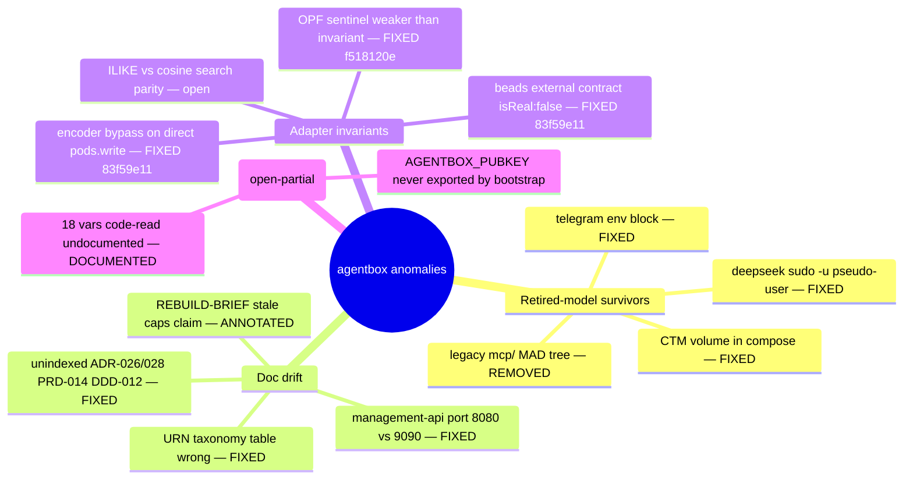

# Anomaly Register — agentbox

Ecosystem audit 2026-06-11 (diagram-driven, ruflo mesh: 2 sonnet cartographers + 2 opus auditors + 2 opus fixers, Fable queen). Companion ground-truth maps:

- [adapter-dispatch-sequence.md](adapter-dispatch-sequence.md)
- [identity-and-agent-comms.md](identity-and-agent-comms.md)

## Resolved in this sweep

| ID | Finding | Resolution |
|----|---------|------------|
| R1 | `docker-compose.yml:134` CTM volume mount + `agentbox-ctm-config` declaration; override compose TELEGRAM_* env block — Telegram/CTM retired | Removed |
| R2 | Legacy `mcp/` MAD-source subtrees (gateway, tcp-server, fallback memory store, monitoring, auth/expel/logging/voyager) — zero runtime wiring; carried most retired `/workspace` literal paths; `fallback-store.js` was an ADR-015-forbidden silent memory fallback waiting to be re-wired | Reference-verified and deleted (live `ruvector-mcp.cjs`, `aci-shell`, `consultants`, `nostr-bridge` untouched) |
| R3 | `skills/deepseek-reasoning` executed via `sudo -u deepseek-user` — retired pseudo-user isolation model | Runs as invoking user; privilege hop removed |
| R4 | `execSync` string-interpolation injection survivors (comfyui server.js:194, host-webserver-debug https-proxy.js:43) | execFile/array-args |
| R5 | Ad-hoc/malformed URN minting bypassing `uris.js` (aci-shell ×7, consultant-base.js:217 grammar-violating scope, agent-action-hooks.js:309) | Routed through `uris.js` |
| R6 | Live `/workspace` literal defaults (beads local-sqlite.js:49, events local-jsonl.js:32, viewer manifest.js:22,33) — bind target retired | Derive from `$WORKSPACE` |
| R7 | JunkieJarvis/PUAF gated only by env var, violating the manifest-gating rule | `[sovereign_mesh]` keys in agentbox.toml + schema; env remains runtime override |
| R8 | README port drift (management-api :8080 → :9090), URN owner/CA table wrong for 4 kinds, ecosystem.md missing `bead ⇄ bead` BC20 crossing + "6 kinds" miscount, dead `skills-entrypoint.sh` refs ×3, docs index missing ADR-026/ADR-028/PRD-014/DDD-012, PRD-013 stale telegram task, REBUILD-BRIEF pre-dating caps restore (b251f440) | Corrected/annotated |
| R9 | Mirror/xinference/JunkieJarvis env vars (16) read by code but absent from `.env.example`/configuration.md | Documented (names + descriptions) |
| R10 | `visionclaw_container:4000` vs `visionclaw-server:4000` hostname split (broker-bridge vs git-bridge) | Shared `VISIONCLAW_API_URL` env |

## Open — adapter/middleware invariants (need contract tests, not auto-fixed)

| ID | Sev | Where | Finding |
|----|-----|-------|---------|
| O1 | ~~CRIT~~ FIXED (`83f59e11`) | `tests/contract/beads.contract.spec.js:47` | ~~Beads `external` impl marked `isReal:false`~~ — `external` now runs against a stateful loopback with `isReal: true`; behavioural parity assertions execute for the federated class. |
| O2 | ~~HIGH~~ FIXED (`83f59e11`) | `routes/memory.js:132` | ~~Standalone pods-fallback path calls `pods.write()` directly~~ — the fallback now routes through `encoder.dispatch()` with a per-dispatch privacy mark; Layer 3 remains call-site opt-in by design, guarded by the O3 fix. |
| O3 | ~~HIGH~~ FIXED (`f518120e`) | `middleware/privacy-filter.js:114` | ~~Module-load global sentinel~~ — the marker is now a non-enumerable Symbol stamped per-payload by `wrapWithPrivacyFilter`; `assertPrivacyFilterApplied(payload, slot)` is per-dispatch, fail-closed for pods/memory, and `opf_middleware_order_violations_total` can fire. |
| O4 | HIGH | `tests/contract/orchestrator.contract.spec.js:45` | `stdio-bridge` tested with a write-only stub; federated spawn never verified round-trip. Plus `server.js:945` — client-mode orchestrator `process.exit(1)` on connect failure while every other slot degrades. |
| O5 | MED | `adapters/memory/external-pg.js:107` | `ILIKE` substring search vs embedded TF-cosine — fundamentally different semantics per impl class; pgvector `<=>` unused. |
| O6 | MED | `adapters/index.js:48` | Missing `[federation].external_url` → empty string → generic "baseUrl is required" throw with no manifest-key pointer (E001 only enforced in `config validate`). |
| O7 | MED | bootstrap | `AGENTBOX_PUBKEY` (mirror recipient chain slot 2) never exported by `sovereign-bootstrap.py` — only slot 3 set. |
| O8 | LOW | 4 JS surfaces | `nip59.wrapEvent/unwrapEvent` + NIP-98 builders duplicated across mirror hook / JunkieJarvis / PUAF / nostr-bridge — live services; consolidate onto one signer module only with regression coverage. |
| O9 | LOW | `tests/contract/README.md:9` | Matrix still lists retired `local-jss` pods impl. `manifest-loader.js` TOML parser silently drops `[[arrays-of-tables]]`. `ws://` mirror relay accepted without plaintext warning. BC20 Prometheus counters silently null without `prom-client`. |

## Verdict

Skills directory parity, route registration, `.env` leak surface, and the no-eval/no-shell-spawn checks all verified **clean**. O1-O3 were closed post-audit (`f518120e`, `83f59e11`). Remaining debt sits in O4-O9: the orchestrator `stdio-bridge` is still the one slot faking its federated leg, and the memory-slot search parity gap (O5) is open.
