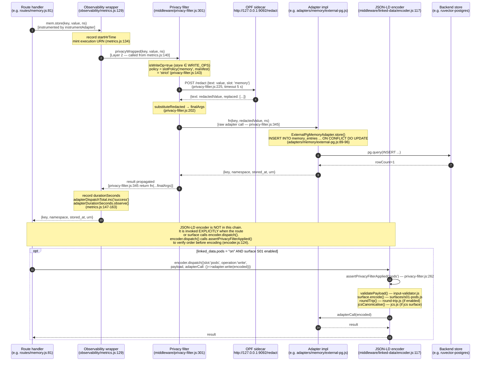

# Adapter Architecture Diagrams

Cartographic audit of the five-slot adapter system as implemented in code.
All references are to files under `management-api/` unless otherwise noted.
Prose descriptions follow each diagram to ground the Mermaid blocks in actual
implementation details.

---

## 1. Sequence: End-to-end adapter dispatch through the middleware chain

The canonical middleware stack is assembled in `adapters/index.js:120-145`
(`instrumentAdapter`) and `observability/metrics.js:125-197` (`wrapDispatch`).
At boot `resolveAdapters()` calls `instrumentAdapter()` which walks every
public method on the constructed adapter and replaces it with
`wrapDispatch(slot, impl, methodName, fn, manifest)`.

`wrapDispatch` (metrics.js:125) immediately calls
`wrapWithPrivacyFilter(slot, methodName, fn, manifest)` (privacy-filter.js:295)
to produce `privacyWrapped`. The outer function then calls `privacyWrapped`.
This nests as: **observability outer → privacy inner → raw adapter fn**.
The JSON-LD encoder (`middleware/linked-data/encoder.js`) is **not** applied by
`instrumentAdapter`; it is applied explicitly at call sites that reach
`encoder.dispatch()` (routes, stand-alone surfaces).

Policy truth table from `privacy-filter.js:115-121` (DEFAULT_POLICY):

| slot | policy |
|---|---|
| pods | strict |
| memory | strict |
| events | soft |
| beads | soft |
| orchestrator | off |



**Strict OPF failure path:** when OPF is unreachable and policy=strict,
`wrapWithPrivacyFilter` throws `AdapterWriteRejected` (statusCode 503) at
privacy-filter.js:322 and the raw adapter is never called. For policy=soft
(beads, events) the original args pass through and `opfFailOpenTotal` is
incremented (privacy-filter.js:333).

---

## 2. Flowchart: Slot resolution from agentbox.toml to concrete implementation files

Resolution path: `agentbox.toml [adapters]` → `adapters/manifest-loader.js`
→ `adapters/index.js:resolveAdapters()` → `requireImpl(slot, impl)` →
`instrumentAdapter()`.

The manifest is parsed by the hand-rolled TOML parser at
`adapters/manifest-loader.js:27-63`. AGENTBOX_MANIFEST_PATH env or
`/etc/agentbox.toml` (manifest-loader.js:80).

```mermaid
flowchart TD
    TOML([agentbox.toml<br/>at /etc/agentbox.toml<br/>or AGENTBOX_MANIFEST_PATH])
    ML[adapters/manifest-loader.js<br/>parseTOML → JS object]
    RI[adapters/index.js<br/>resolveAdapters manifest]
    TOML --> ML --> RI

    RI -->|slot 'beads'| BEADS_PICK{adapters.beads}
    BEADS_PICK -->|"local-sqlite"| BLS[adapters/beads/local-sqlite.js<br/>LocalSqliteBeadsAdapter<br/>better-sqlite3 at /workspace/beads.db]
    BEADS_PICK -->|"external"| BEX[adapters/beads/external.js<br/>ExternalBeadsAdapter<br/>HTTP POST to federation.external_url/v1/beads/*]
    BEADS_PICK -->|"off"| BOFF[adapters/beads/off.js<br/>OffBeadsAdapter → AdapterDisabled]
    BEADS_PICK -->|"off" + no off.js| BPH[adapters/beads/placeholder.js<br/>fallback — requireImpl:108]

    RI -->|slot 'pods'| PODS_PICK{adapters.pods}
    PODS_PICK -->|"local-solid-rs"| PLS[adapters/pods/local-solid-rs.js<br/>LocalSolidRsPodsAdapter<br/>HTTP to integrations.solid_pod_rs.port=8484]
    PODS_PICK -->|"external"| PEX[adapters/pods/external.js<br/>ExternalPodsAdapter<br/>HTTP to federation.external_url]
    PODS_PICK -->|"off"| POFF[adapters/pods/off.js<br/>OffPodsAdapter → AdapterDisabled]

    RI -->|slot 'memory'| MEM_PICK{adapters.memory}
    MEM_PICK -->|"embedded-ruvector"| MER[adapters/memory/embedded-ruvector.js<br/>EmbeddedRuvectorMemoryAdapter<br/>in-process Map + naive TF vectors]
    MEM_PICK -->|"external-pg"| MEP[adapters/memory/external-pg.js<br/>ExternalPgMemoryAdapter<br/>pg.Pool → integrations.ruvector_external.conninfo]
    MEM_PICK -->|"off"| MOFF[adapters/memory/off.js<br/>OffMemoryAdapter → AdapterDisabled]

    RI -->|slot 'events'| EVT_PICK{adapters.events}
    EVT_PICK -->|"local-jsonl"| ELJ[adapters/events/local-jsonl.js<br/>LocalJsonlEventsAdapter<br/>fs.appendFileSync to /workspace/events/*.jsonl]
    EVT_PICK -->|"external"| EEX[adapters/events/external.js<br/>ExternalEventsAdapter<br/>HTTP POST to opts.url]
    EVT_PICK -->|"off"| EOFF[adapters/events/off.js<br/>OffEventsAdapter → dispatch no-op, subscribe throws]

    RI -->|slot 'orchestrator'| ORC_PICK{adapters.orchestrator}
    ORC_PICK -->|"local-process-manager"| OPM[adapters/orchestrator/local-process-manager.js<br/>LocalProcessManagerOrchestratorAdapter<br/>child_process.spawn + in-memory agent map]
    ORC_PICK -->|"stdio-bridge"| OSB[adapters/orchestrator/stdio-bridge.js<br/>StdioBridgeOrchestratorAdapter<br/>JSON-RPC over stdio to federated host]
    ORC_PICK -->|"off"| OOFF[adapters/orchestrator/off.js<br/>OffOrchestratorAdapter → AdapterDisabled]

    BLS & BEX & BOFF & BPH --> INST
    PLS & PEX & POFF --> INST
    MER & MEP & MOFF --> INST
    ELJ & EEX & EOFF --> INST
    OPM & OSB & OOFF --> INST

    INST[adapters/index.js:instrumentAdapter<br/>walks prototype chain<br/>wraps every non-lifecycle method<br/>with wrapDispatch slot impl name fn manifest]

    INST --> RESOLVE([resolvedAdapters<br/>app.decorate 'adapters' resolvedAdapters<br/>server.js:754])
```



**Active configuration** (agentbox.toml lines 11-16):

```toml
beads        = "off"
pods         = "local-solid-rs"
memory       = "external-pg"
events       = "local-jsonl"
orchestrator = "local-process-manager"
```

Beads slot is `"off"` because the `ruflo-jujutsu` plugin that uses it is also
disabled (agentbox.toml line 880). The `off.js` implementation exists for beads
(adapters/beads/off.js) so the `placeholder.js` fallback path is not taken.

---

## 3. Sequence: Federation client-mode vs standalone for the memory slot

The memory slot is the clearest illustration because it has the most complete
federation path: `routes/memory.js` explicitly tests `mem._implName` and falls
through to the pods adapter when memory is off (routes/memory.js:87).

`slotConfig('memory', 'external-pg', manifest)` returns
`{ conninfo: integrations.ruvector_external.conninfo }` (adapters/index.js:41-43).
For `embedded-ruvector`, slotConfig returns `{}` (adapters/index.js:43).

```mermaid
sequenceDiagram
    autonumber
    participant Client as HTTP caller
    participant Route as routes/memory.js
    participant Adapters as fastify.adapters
    participant MemPG as ExternalPgMemoryAdapter<br/>adapters/memory/external-pg.js
    participant MemEV as EmbeddedRuvectorMemoryAdapter<br/>adapters/memory/embedded-ruvector.js
    participant PgDB as ruvector-postgres:5432<br/>memory_entries table
    participant Pod as pods adapter<br/>(local-solid-rs or off)
    participant SolidRS as solid-pod-rs:8484

    Note over Client,SolidRS: CASE A — federation.mode="client" with memory="external-pg"<br/>agentbox.toml adapters.memory = "external-pg" (active configuration)

    Client->>Route: POST /v1/memory {key, value, namespace}
    Route->>Adapters: fastify.adapters.memory
    Note over Route: _effectiveNamespace(req, ns)<br/>Bearer in permissive mode → ns as-is<br/>NIP-98 → "user:<pubkey>:<ns>"<br/>(memory.js:40-51)
    Route->>MemPG: mem.store(key, redactedValue, effectiveNs)<br/>[instrumented — privacy filter strict, then pg]
    MemPG->>PgDB: INSERT INTO memory_entries (id, namespace, key, value, source_type)<br/>ON CONFLICT DO UPDATE SET value=EXCLUDED.value<br/>(external-pg.js:89-96)<br/>id = "agentbox:<namespace>:<key>"
    PgDB-->>MemPG: rowCount=1
    MemPG-->>Route: {key, namespace, stored_at, urn}
    Route-->>Client: 201 {key, namespace, stored_at, urn}

    Note over Client,SolidRS: CASE B — standalone mode with memory="embedded-ruvector"<br/>(non-active; shown for contrast)

    Client->>Route: POST /v1/memory {key, value, namespace}
    Route->>Adapters: fastify.adapters.memory
    Route->>MemEV: mem.store(key, value, effectiveNs)<br/>[instrumented — privacy filter strict]
    Note over MemEV: naiveEmbed(value) → Float32Array(64)<br/>stores in Map: namespace → Map<key, entry><br/>(embedded-ruvector.js:77-87)
    MemEV-->>Route: {key, namespace, stored_at, urn}
    Route-->>Client: 201 {key, namespace, stored_at, urn}

    Note over Client,SolidRS: CASE C — standalone fallback: memory="off", pods="local-solid-rs"<br/>routes/memory.js:87-98

    Client->>Route: POST /v1/memory {key, value, namespace}
    Route->>Adapters: fastify.adapters.memory → _implName="off"
    Note over Route: mem._implName === 'off' → skip memory path<br/>check pods adapter (memory.js:87)
    Route->>Pod: pods.write("/pods/<npub>/memory/<ns>/<key>.json",<br/>JSON.stringify(entry), 'application/ld+json')
    Note over Pod: entry = {<br/>  "@context": "http://schema.org/",<br/>  "@type": "MemoryEntry",<br/>  "@id": urn, key, namespace, value, stored_at<br/>} (memory.js:95)
    Pod->>SolidRS: PUT /pods/<npub>/memory/<ns>/<key>.json<br/>(local-solid-rs.js → _solid-http-base.js)
    SolidRS-->>Pod: 201 Created
    Pod-->>Route: {uri, status:201, created_at}
    Route-->>Client: 201 {key, namespace, stored_at, urn}

    Note over Client,SolidRS: CASE D — both memory and pods are "off" → 503

    Client->>Route: POST /v1/memory {key, value, namespace}
    Route-->>Client: 503 {error:"no-memory-adapter"}<br/>(memory.js:100)
```

---

## 4. Findings

The following findings are derived strictly from code inspection. Severity
ratings: CRITICAL (blocks a required invariant), HIGH (degrades correctness or
coverage), MEDIUM (latent defect or gap), LOW (documentation / cosmetic).

---

### Finding 1 — CRITICAL: Beads slot has no `local-*` implementation tested against a real manifest value

**File:** `tests/contract/beads.contract.spec.js:68-76`
**Classification:** Contract test coverage gap — missing first-class impl class

The `IMPLS` array covers `local-sqlite`, `external` (fetch-stubbed, marked
`isReal: false`), and `off`. However the current production manifest sets
`adapters.beads = "off"` (agentbox.toml:12). The `local-sqlite` impl is the
only "real" implementation class tested, but `external` is tested with a
fetch stub that returns hard-coded 201/200 bodies — it never exercises the
actual HTTP path. The ADR-005 requirement is three implementation classes
(local-*, external, off); the contract test marks `external` as `isReal: false`
so all M2 behavioural assertions are skipped for it
(`beads.contract.spec.js:109 if (isReal)`). The `external` class has no
behavioural parity coverage at all.

---

### Finding 2 — HIGH: Orchestrator slot — `stdio-bridge` impl tested with a write-only stub that cannot verify round-trip JSON-RPC

**File:** `tests/contract/orchestrator.contract.spec.js:45-56`
**Classification:** Contract test coverage gap — federated impl class not behaviourally verified

`StdioBridgeOrchestratorAdapter` is constructed with `{ stdio: { write: l => lines.push(l) } }`.
The stub only captures writes; there is no reader. `spawnAgent` emits a
JSON-RPC frame to stdio (stdio-bridge.js:37) then immediately sets
`_agents.set(agentId, { status: 'running' })`. The test asserts `status=running`
(orchestrator.contract.spec.js:89) but this is set locally in the adapter map
without any confirmation from the host process. The actual federated spawn path
(docker exec -i) is never exercised. All M2 assertions for `stdio-bridge` pass
because the adapter self-reports success from its own in-memory map, not from
the host process response. This means the contract test gives no signal about
whether the federated orchestrator path works end-to-end.

---

### Finding 3 — HIGH: Pods slot — `local-jss` row was removed from the contract README but the README still names it in the slot-×-impl matrix

**File:** `tests/contract/README.md:9`
**Classification:** Documentation drift / stale contract matrix

The README table lists `local-jss` as a pods implementation
(`pods | local-jss, external, off`). The spec file comments at
`pods.contract.spec.js:111-115` note "local-jss row removed 2026-04-25 along
with the legacy Python stub." The README was not updated. Audit readers
consulting the contract matrix will believe three pods implementations exist;
only two (`local-solid-rs`, `external`) are tested.

---

### Finding 4 — HIGH: Privacy filter middleware-order assertion is a module-load sentinel, not a per-call sentinel

**File:** `middleware/privacy-filter.js:95-96` and `middleware/linked-data/encoder.js:124`
**Classification:** Middleware ordering — assertion is weaker than the invariant claims

The `PRIVACY_FILTER_APPLIED_KEY` sentinel is set on `global` when
`privacy-filter.js` is first `require()`d (line 96:
`global[PRIVACY_FILTER_APPLIED_KEY] = true`). `assertPrivacyFilterApplied()`
at privacy-filter.js:262 checks this global boolean. This means if someone
calls `encoder.dispatch()` directly from a new route without going through
`wrapDispatch`, the sentinel is already true (because the module was loaded at
startup) and the assertion passes even though no privacy filter was applied to
the specific call. The assertion is "was the module loaded" not "was the filter
applied to this dispatch". The `MiddlewareOrderViolation` counter
(`opfMiddlewareOrderViolations`) will never increment in practice because the
sentinel is always true after boot.

---

### Finding 5 — HIGH: JSON-LD encoder is not wired into `instrumentAdapter` — it is opt-in at call sites only

**File:** `adapters/index.js:126-145` (instrumentAdapter), `server.js:762-782` (encoder boot)
**Classification:** Middleware ordering / adapter hardcoding gap

`instrumentAdapter` applies only Layers 1 (observability) and 2 (privacy
filter). Layer 3 (JSON-LD encoder) is decorated onto `app` as
`app.linkedData` (server.js:768) and must be called explicitly by routes that
want it. This means adapter dispatch calls that do not go through
`encoder.dispatch()` silently skip JSON-LD encoding even when
`[linked_data].enabled = true` and a surface gate is `"on"`. The `pods` slot
has S01 enabled (`linked_data.pods = "on"`, agentbox.toml:629), but
`routes/memory.js:96` calls `pods.write(...)` directly without invoking the
encoder. Writes to the pod in the standalone fallback path (Case C in
diagram 3) are stored as raw JSON with a `@context` string literal assembled
in the route handler (memory.js:95), not processed through the surface encoder.

---

### Finding 6 — MEDIUM: Memory adapter `external-pg` search uses ILIKE, not vector similarity

**File:** `adapters/memory/external-pg.js:103-128`
**Classification:** Adapter hardcoding a capability gap / parity divergence between impl classes

`ExternalPgMemoryAdapter.search()` uses `ILIKE '%query%'` (external-pg.js:107)
against the `value::text` column. The `embedded-ruvector` implementation uses
cosine similarity over TF vectors (embedded-ruvector.js:98-111). The
`ruvector-postgres` schema that external-pg reads (`memory_entries`) is owned
by the RuVector service and includes pgvector extension columns, but the
adapter never issues a vector similarity query (`<=>` operator). Callers using
`external-pg` get full-text substring match; callers using `embedded-ruvector`
get cosine similarity. This is a behavioural divergence between two "real"
implementation classes for the same slot, violating ADR-005's parity
requirement. The contract test at memory.contract.spec.js:162 tests that
`doc1` (containing "fox") is returned for query "fox" — this passes with ILIKE
but the SLO note (memory.contract.spec.js:216) acknowledges the ONNX pipeline
(MiniLM-L6-v2) is not exercised in CI, so the parity gap is invisible to the
test suite.

---

### Finding 7 — MEDIUM: `beads` adapter `external` class requires `federation.mode = "client"` per E001 but `slotConfig` silently uses empty string when not set

**File:** `adapters/index.js:47-50`, `adapters/beads/external.js:26`
**Classification:** Adapter constructor — fail-silent on missing federation config

`slotConfig` for `beads` with `impl === 'external'` returns
`{ externalUrl: fed.external_url || '' }` (adapters/index.js:48-50).
`ExternalBeadsAdapter` constructor throws if `baseUrl` is falsy (external.js:26).
However the error message is `"ExternalBeadsAdapter: baseUrl is required"` with
no reference to which manifest key to set. Validation rule E001 is supposed to
catch this pre-boot, but E001 is enforced by `agentbox config validate`, not by
the adapter resolver itself. If validation is skipped (e.g. the manifest is
loaded from AGENTBOX_MANIFEST_PATH pointing at a file without `[federation]`),
the management-api will crash at adapter construction with a generic error
rather than the E001 message. The same pattern applies to `events/external.js`
(adapters/index.js:49).

---

### Finding 8 — MEDIUM: `orchestrator` slot is the only slot with `process.exit(1)` on connect failure

**File:** `server.js:945-948`
**Classification:** Feature that only works in one federation mode — runtime mode asymmetry

```js
if (slot === 'orchestrator') {
  logger.error(...);
  process.exit(1);
}
```

All other slots fall back to their `off` implementation on connect failure
(server.js:949-960). Only the orchestrator crashes the process. In standalone
mode (`local-process-manager`) the connect path is a no-op (BaseAdapter has
no `connect()`), so this never triggers. In client mode (`stdio-bridge`), if
the stdio channel is unavailable at startup, the entire management-api crashes.
This means the management-api is effectively standalone-only when it comes to
degraded-start resilience — client mode with an unavailable orchestrator is a
fatal condition, not a degraded one.

---

### Finding 9 — LOW: `manifest-loader.js` TOML parser silently drops `[[plugins.packages]]` array-of-tables syntax

**File:** `management-api/adapters/manifest-loader.js:27-63`
**Classification:** Parser limitation — features that only work in client mode through env injection

The hand-rolled parser handles `[section]` headers and bare key=value pairs
but explicitly does not handle `[[arrays-of-tables]]` (manifest-loader.js:26
comment: "Does NOT handle arrays-of-tables"). `agentbox.toml` has 30+
`[[plugins.packages]]` blocks. These are silently dropped by the parser —
the adapter resolver never sees them. Plugin configuration reaches the
management-api through pre-baked environment variables injected by the
`flake.nix` entrypoint (flake.nix:1323 "generated supervisor text"), not
through the manifest JS object. This means any code that reads
`manifest.plugins.packages` from the parsed manifest will see `undefined`.
The adapter resolver does not consume `plugins.packages` directly, so this
is not currently a bug for adapter dispatch, but it is a maintenance hazard
for any future code that assumes the parsed manifest is a complete
representation of agentbox.toml.

---

## Summary table

| # | Severity | File:line | Description | Classification |
|---|---|---|---|---|
| 1 | CRITICAL | tests/contract/beads.contract.spec.js:68 | beads `external` impl has zero M2 behavioural assertions; all skipped because `isReal=false` | Contract coverage gap |
| 2 | HIGH | tests/contract/orchestrator.contract.spec.js:45 | `stdio-bridge` impl tests with write-only stub; federated spawn path never verified | Contract coverage gap |
| 3 | HIGH | tests/contract/README.md:9 | README still lists retired `local-jss` pods impl in slot matrix | Documentation drift |
| 4 | HIGH | middleware/privacy-filter.js:95 + encoder.js:124 | Middleware-order assertion is a module-load sentinel, not a per-dispatch sentinel; can never detect encoder invoked without filter on a specific call | Middleware ordering weak assertion |
| 5 | HIGH | adapters/index.js:126 + server.js:762 | JSON-LD encoder (Layer 3) is not wired into `instrumentAdapter`; routes that call adapter methods directly bypass the encoder even when surfaces are enabled | Adapter dispatch — encoder skipped |
| 6 | MEDIUM | adapters/memory/external-pg.js:107 | `external-pg` search uses ILIKE not vector similarity; parity gap vs `embedded-ruvector` cosine search | Impl class behavioural divergence |
| 7 | MEDIUM | adapters/index.js:48 + adapters/beads/external.js:26 | `slotConfig` passes empty `externalUrl` when `[federation].external_url` is absent; constructor throws with generic error, not E001 | Fail-silent on missing config |
| 8 | MEDIUM | server.js:945 | Orchestrator slot crashes on connect failure; all other slots degrade gracefully; client-mode orchestrator unavailability is fatal | Mode asymmetry — standalone-only resilience |
| 9 | LOW | adapters/manifest-loader.js:26 | Hand-rolled TOML parser drops `[[arrays-of-tables]]`; `plugins.packages` is invisible in the parsed manifest object | Parser limitation |
