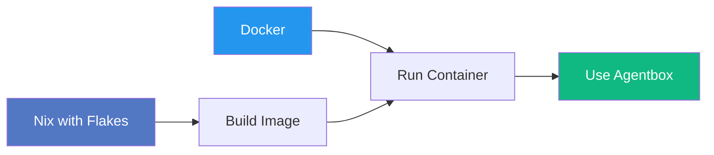
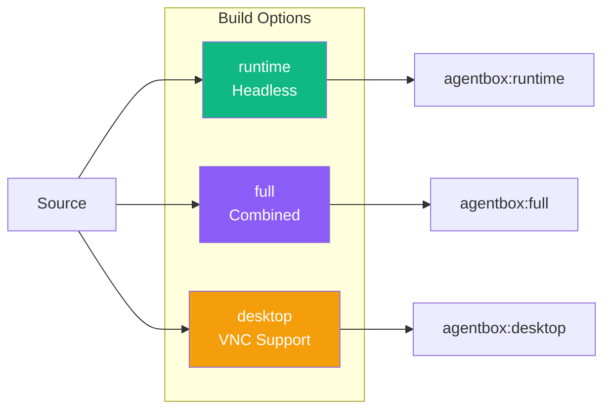
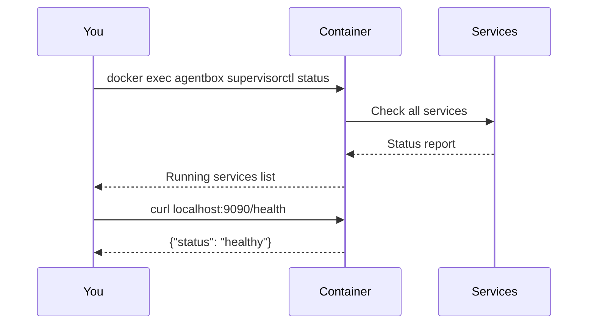
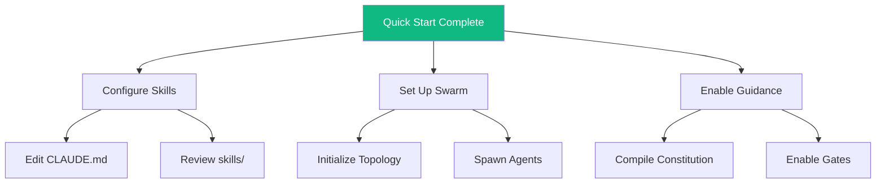

# Quick Start Guide

Get Agentbox running in under 5 minutes.

## Prerequisites



### Install Nix

```bash
# Linux/macOS
curl -L https://nixos.org/nix/install | sh

# Enable flakes
mkdir -p ~/.config/nix
echo "experimental-features = nix-command flakes" >> ~/.config/nix/nix.conf
```

### Install Docker

Follow instructions at [docker.com](https://docs.docker.com/get-docker/).

## Build



```bash
# Clone
git clone https://github.com/DreamLab-AI/agentbox.git
cd agentbox

# Build runtime image (recommended)
nix build .#runtime

# Load into Docker
docker load < result
```

## Run

### Basic

```bash
docker run -d \
  --name agentbox \
  -p 22:22 \
  -p 9090:9090 \
  -p 9700:9700 \
  agentbox:runtime-aarch64-linux
```

### With Environment

```bash
docker run -d \
  --name agentbox \
  -p 22:22 \
  -p 9090:9090 \
  -p 9700:9700 \
  -e ANTHROPIC_API_KEY=sk-ant-... \
  -e GITHUB_TOKEN=ghp_... \
  -v ./workspace:/workspace \
  agentbox:runtime-aarch64-linux
```

### Docker Compose

```bash
cp .env.example .env
# Edit .env with your API keys
docker-compose up -d
```

## Verify



```bash
# Check services
docker exec agentbox supervisorctl status

# Test Management API
curl http://localhost:9090/health

# Test RuVector
curl http://localhost:9700/health
```

## Connect

### SSH

```bash
ssh devuser@localhost -p 22
# Default password: See .env.example
```

### Claude Flow

```bash
# Inside container
npx claude-flow@v3alpha swarm init --topology mesh
npx claude-flow@v3alpha swarm status
```

### RuVector

```bash
# Start RuVector MCP for Claude integration
npx ruvector mcp --port 9701
```

## Next Steps



- **[Configure Skills](./configure-skills.md)** — Customize the 55 available skills
- **[Swarm Setup](./swarm-setup.md)** — Multi-agent orchestration
- **[Guidance Control Plane](./guidance-setup.md)** — Enable extended autonomy
