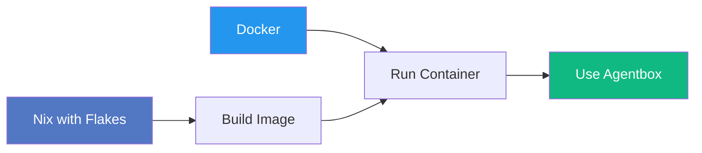
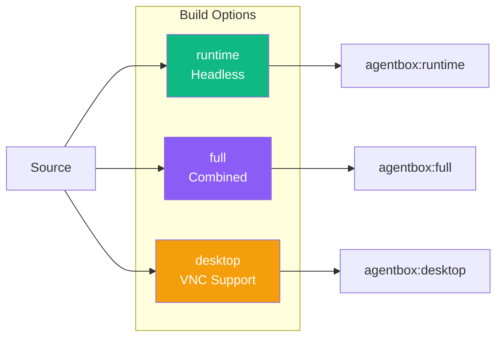
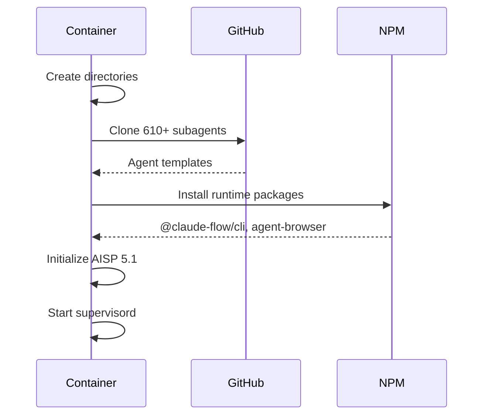
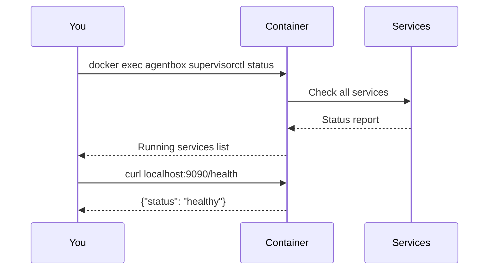
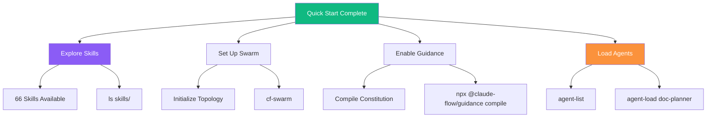

# Quick Start Guide

Get Agentbox running in under 5 minutes.

## Prerequisites



### Install Nix

```bash
# Linux/macOS
curl -L https://nixos.org/nix/install | sh

# Enable flakes
mkdir -p ~/.config/nix
echo "experimental-features = nix-command flakes" >> ~/.config/nix/nix.conf
```

### Install Docker

Follow instructions at [docker.com](https://docs.docker.com/get-docker/).

## Build



```bash
# Clone
git clone https://github.com/DreamLab-AI/agentbox.git
cd agentbox

# Build runtime image (recommended)
nix build .#runtime

# Load into Docker
docker load < result
```

## Run

### Basic

```bash
docker run -d \
  --name agentbox \
  -p 22:22 \
  -p 9090:9090 \
  -p 9700:9700 \
  -v agentbox-workspace:/home/devuser/workspace \
  -v agentbox-agents:/home/devuser/agents \
  agentbox:runtime-aarch64-linux
```

### With Environment

```bash
docker run -d \
  --name agentbox \
  -p 22:22 \
  -p 9090:9090 \
  -p 9700:9700 \
  -e ANTHROPIC_API_KEY=sk-ant-... \
  -e GITHUB_TOKEN=ghp_... \
  -e GOOGLE_GEMINI_API_KEY=... \
  -v ./workspace:/home/devuser/workspace \
  -v ./agents:/home/devuser/agents \
  agentbox:runtime-aarch64-linux
```

### Docker Compose

```bash
cp .env.example .env
# Edit .env with your API keys
docker-compose up -d
```

## First Run

On first container start, Agentbox automatically:



1. **Creates directories** — workspace, agents, skills
2. **Clones 610+ subagents** — From ChrisRoyse/610ClaudeSubagents
3. **Installs npm packages** — @claude-flow/cli, agent-browser
4. **Links AISP CLI** — Available as `aisp` command
5. **Starts services** — RuVector, Management API, Z.AI

## Verify



```bash
# Check services
docker exec agentbox supervisorctl status

# Test Management API
curl http://localhost:9090/health

# Test RuVector
curl http://localhost:9700/health

# Verify agent count
docker exec agentbox bash -c 'ls $AGENTS_DIR/*.md | wc -l'
# Expected: 610+
```

## Connect

### SSH

```bash
ssh devuser@localhost -p 22
# Default password: See .env.example
```

### Using Turbo Flow Aliases

Once connected, aliases are auto-loaded:

```bash
# Quick reference
turbo-help

# List available agents
agent-list

# Load specific agent
agent-load doc-planner

# Claude Flow CLI
cf --help
cf-doctor    # System diagnostics
cf-swarm     # Swarm orchestration
```

### Claude Flow

```bash
# Inside container
npx @claude-flow/cli@latest swarm init --topology hierarchical-mesh
npx @claude-flow/cli@latest swarm status

# Or use aliases
cf swarm init --topology hierarchical-mesh
cf-status
```

### RuVector

```bash
# Start RuVector (usually auto-started)
npx ruvector serve --port 9700

# Start RuVector MCP for Claude integration
npx ruvector mcp --port 9701

# CLI operations
npx ruvector --help
```

### AISP 5.1 Platinum

```bash
# Validate AISP document
aisp validate document.md

# Check binding compatibility
aisp binding agent-a agent-b

# Initialize pocket store
aisp init

# Run benchmarks
aisp benchmark
```

### Gemini Flow

```bash
# If GOOGLE_GEMINI_API_KEY is set
gf-init                    # Initialize
gf-swarm                   # 66-agent swarm
gf-status                  # Check status
```

## Key Environment Variables

| Variable | Purpose |
|----------|---------|
| `ANTHROPIC_API_KEY` | Claude API access |
| `GITHUB_TOKEN` | GitHub CLI authentication |
| `GOOGLE_GEMINI_API_KEY` | Gemini integration |
| `OPENAI_API_KEY` | OpenAI tools |
| `ZAI_API_KEY` | Z.AI service |
| `DEEPSEEK_API_KEY` | DeepSeek reasoning |

## Ports Reference

| Port | Service | Description |
|------|---------|-------------|
| 22 | SSH | Secure shell access |
| 5901 | VNC | Desktop (via SSH tunnel) |
| 8080 | code-server | Web IDE |
| 9090 | Management API | Container management |
| 9600 | Z.AI | Claude proxy (internal) |
| 9700 | RuVector | Vector database |
| 9701 | RuVector MCP | MCP integration |

## Next Steps



### Explore 66 Skills

```bash
# List all skills
ls skills/

# Key skill categories:
# - Core: build-with-quality, guidance-control-plane
# - Claude Flow: v3-*, swarm-*, hive-mind-*
# - AI/Media: blender, comfyui, cuda, gemini-url-context
# - GitHub: github-code-review, github-workflow-automation
```

### Load 610+ Subagents

```bash
# List available agents
agent-list

# Load agent for current task
agent-load doc-planner
agent-load microtask-breakdown
agent-load tdd-london-swarm
```

### Configure Guidance Control Plane

```bash
# Compile CLAUDE.md into constitution
npx @claude-flow/guidance compile

# Check enforcement gates
npx @claude-flow/guidance check-gates

# Enable trust tracking
npx @claude-flow/guidance trust --enable
```

## Troubleshooting

### Services not starting

```bash
# Check logs
docker exec agentbox supervisorctl tail -f ruvector
docker exec agentbox supervisorctl tail -f management-api

# Restart specific service
docker exec agentbox supervisorctl restart ruvector
```

### Agents not found

```bash
# Verify AGENTS_DIR
docker exec agentbox bash -c 'echo $AGENTS_DIR'

# Re-clone if needed
docker exec agentbox bash -c 'cd $AGENTS_DIR && git clone --depth 1 https://github.com/ChrisRoyse/610ClaudeSubagents.git temp && mv temp/agents/*.md . && rm -rf temp'
```

### npm packages missing

```bash
# Reinstall runtime packages
docker exec agentbox npm install -g @claude-flow/cli@latest agent-browser@latest
```

## Further Reading

- **[CLAUDE.md](../../CLAUDE.md)** — Project configuration
- **[ADR-001: NixOS Flakes](../adr/ADR-001-nixos-flakes.md)** — Build architecture
- **[ADR-002: RuVector](../adr/ADR-002-ruvector-standalone.md)** — Vector database design
- **[ADR-003: Guidance](../adr/ADR-003-guidance-control-plane.md)** — Governance design
