# PLAN-integration - the sidestr financial substrate across the estate

Author: Opus integration architect, 2026-09-21. Status: **proposed**; the human ratifies.
Inputs: `BRIEF-fact-base.md` (owner decisions D1-D6 binding), `R1-sidestr-spec.md`,
`R2-agentbox-surfaces.md`, `R3-pods-forum-visionclaw.md`, `R4-canon-assertions.md`,
`/home/devuser/workspace/blake2-experiment/SPEC.md` (b2mine, v0.1, 2026-09-02).

**Revision 2, 2026-09-21, owner amendment D6 (binding, supersedes D1 where they conflict).**
`sidestr:gitmark` IS the estate's gitmark; upstream has moved to the Knots BLAKE2b fork and we
may follow. The parent network and the sidechain's own header/PoW family are **explicit,
validated configuration** in an `agentbox.toml` `[sidechain]` block, surfaced by the onboarding
system, never a hard-coded pivot. Default follows upstream (`btc:testnet4-blake2b` +
`knots:blake2b-v2`) so the live gitmark chain and its tooling are reusable on day one; mainnet
variants of either family stay behind the P21 gate. `sidestr-core` implements **both** header
codecs. What this amendment changes, section by section: §1.3 (defaults), §1.7 (new, gitmark),
§3.1 and §3.1b (the header crate), §3.7 (rewritten: configuration, not a pivot), §5 R2-10,
§6.1 (the `[sidechain]` block and its onboarding surfaces), §7 P0/P1, §8, §9 Q4 and the risk
ranking.
Code claims below are cited `file:line` against `/home/devuser/workspace/project/agentbox`
at `b2389f36d` unless another repo root is named.

Thesis, in the owner's words and this plan's shape: **our own sidestr sidechains are the key
and only instrument; assets are bridged in; the stack runs over Nostr; the chain is truth.**
Everything currently called a "ledger" in this estate becomes a derived view over a UTXO set
we validate ourselves, and everything currently called a "payment rail" becomes either a
bridge into that UTXO set or a legacy surface scheduled for retirement.

Two claims are load-bearing and both are verified, not assumed:

1. **A `did:nostr` pubkey is already a chain address**, with no registration step. sidestr's
   own `wallet.identity(key)` derives `script = '5120' + xonly_pubkey` and bech32m-encodes it
   under the chain's `addressPrefix` (R1 §6.2). Our sovereign identity is a BIP-340 x-only
   secp256k1 key (`services/nostr-pod-bridge/src/identity.rs:130-158`), even-y canonicalised
   (`identity.rs:107-126`). The two constructions are the same construction. Every agent and
   every user in this estate therefore *already has* an address on every chain we will ever
   run, the moment we run it.
2. **A sidestr chain document is the on-seal immutable currency commitment ADR-124 §7 asked
   for and never got.** `chain.json` carries `parent`, `signers`, `threshold`, `rules[]`, and
   a `genesisHash` that `chain.mjs`'s `open()` refuses to proceed past on mismatch (R1 §1.1).
   The currency pin is not a runtime flag someone can flip; it is an input to the genesis hash.
   P21 stops being "architecturally enforced, not aspirational" as an aspiration and becomes a
   property of the artefact. This is the single strongest argument for the whole programme and
   §7 builds the mainnet gate on it.

---

## 1. Target architecture

### 1.1 Diagram

```mermaid
graph TB
  subgraph PARENT["Parent chain - the sidechain.parent setting, validated (D6)"]
    BTC["btc:testnet4-blake2b (default)<br/>| btc:testnet4 | mainnet families<br/>(mainnet only behind the P21 gate, §7 P4)"]
    PEG["Peg output<br/>tr(NUMS_dreamlab, multi_a(k,n))<br/>script path: and_v(v:pk(refund), older(10000))"]
    CKPT["OP_RETURN ckpt:sidestr:dreamlab:&lt;h&gt;:&lt;hash&gt;"]
    BTC --- PEG
    BTC --- CKPT
  end

  subgraph ROOT["Root chain - sidestr:dreamlab  (level 2, k-of-n) · OWNER: agentbox"]
    RC["chain document<br/>parent + header_profile projected from the manifest<br/>hrp=drm · signers = one key per federated instance<br/>rules = assets only (NOT pool, NOT evm)"]
    UTXO["UTXO set<br/>P2TR key-path per did:nostr-bound spend key<br/>= every agent and user balance"]
    WA["Wrapped assets<br/>issue:USDTRGB:8 / tally:...<br/>(claimed by the bridge, §1.5)"]
    RC --- UTXO
    RC --- WA
  end

  subgraph GM["sidestr:gitmark - provenance, NOT value (D6) · OWNER: ours, upstream-operated"]
    GMC["level 1, one signer, faucet pays trail dust<br/>tweaked taproot outputs = the blocktrails txo chain<br/>checkpoints rule anchors the tip into the parent"]
  end

  subgraph CHILD["Ephemeral child chains - one per AoE session/job · OWNER: agentbox"]
    C1["sidestr:dl-s-&lt;sha12&gt;<br/>parent=sidestr:dreamlab<br/>level 1, signer = the session's own key<br/>close = height or time, then pro-rata settle up"]
    C2["sidestr:dl-j-&lt;sha12&gt;<br/>job/negotiation tab"]
  end

  subgraph NOSTR["Transport - Nostr only (no P2P layer)"]
    R1(("estate relay<br/>sovereign_mesh :7777<br/>identity ingress ONLY"))
    R2(("chain relays<br/>public + estate<br/>kinds 23500, 2351x, 33333, 3350x"))
  end

  subgraph AGENTBOX["agentbox container · OWNER: agentbox"]
    SN["program sidestr-node<br/>validator + mirror :9097 loopback<br/>sidestr-rs crates from crates.io"]
    SP["program sidestr-producer<br/>P0-P2: upstream AGPL JS 'siding' sidecar<br/>P3+: sidestr-producer (Rust)"]
    MA["management-api<br/>/v1/wallet, /v1/pay, /v1/chain<br/>authority.js payment_settlement gate"]
    SB["routes/sessions-boundary.js:212-296<br/>phase=create → mint did + URN + epic + ns<br/>+ OPEN CHILD CHAIN (new)"]
    N98["nip98-proxy :9096<br/>/mgmt/ → management-api<br/>/chain/ → mirror (new upstream)"]
    NPB["nostr-pod-bridge<br/>identity, DID docs, blocktrails txo"]
  end

  subgraph BRIDGE["sidestr-bridge (isolated process) · OWNER: agentbox"]
    RGB["rgb-lib<br/>consignment receive + validate"]
    TA["(later) Taproot Assets"]
    CLAIM["wrapped-asset claim<br/>issue + tally on sidestr:dreamlab"]
    RGB --> CLAIM
    TA --> CLAIM
  end

  subgraph PODS["solid-pod-rs · OWNER: solid-pod-rs repo"]
    WL["WebLedger → DERIVED VIEW<br/>read-through over the chain UTXO fold"]
    BTX["bitcoin_tx.rs / mrc20.rs<br/>→ ported to rust-bitcoin (ADR-2008)"]
  end

  subgraph HOST["VisionFlow host · OWNER: project repo"]
    PH["pay_handler.rs FsPaymentStore<br/>→ DELETED (§8)"]
    WC["src/web_contract/<br/>TrustLevel · AnchorConfirmer → sidestr impl"]
  end

  subgraph FORUM["nostr-rust-forum · OWNER: forum repo"]
    D1L["pod-worker D1 ledger<br/>→ DERIVED VIEW"]
  end

  GMC -.ckpt.-> CKPT
  NPB ==anchors==> GMC

  PEG -.peg-in claim.-> RC
  RC -.peg-out burn.-> PEG
  RC -.checkpoint.-> CKPT
  RC ==nested parent==> C1
  RC ==nested parent==> C2
  C1 -.settle on close.-> RC

  SN <--> R2
  SP <--> R2
  NPB <--> R1
  SN --> MA
  MA --> SB
  N98 --> MA
  N98 --> SN
  CLAIM --> SP
  MA --> WL
  WL --> SN
  D1L --> SN
  WC --> SN
  BTX --> BRIDGE
```



### 1.2 Box ownership, stated plainly

| Box | Repo that owns it | New or existing |
|---|---|---|
| `[sidechain]` manifest block + projector validation | agentbox (`agentbox.toml`, `services/agentbox-manifest`) | new (D6) |
| `sidestr:dreamlab` chain document | agentbox (`config/sidestr/dreamlab.chain.json`), parent + header projected | new |
| `sidestr:gitmark` | ours (D6); upstream-operated at P1, `[sidechain].gitmark.mode` | existing chain, newly consumed |
| `sidestr-header` (both header families) | sidestr-rs (was agentbox `crates/sidestr/`, ADR-2112) | new (D6) |
| child chain documents | agentbox, minted at `routes/sessions-boundary.js` | new |
| `sidestr-*` (core, nostr, wallet, round published; producer, bridge, mcp planned) | sidestr-rs for the published crates (ADR-2112) | new |
| `[program:sidestr-node]`, `[program:sidestr-producer]` | agentbox `flake.nix` + supervisor | new |
| mirror HTTP surface | agentbox, loopback `:9097`, LAN via nip98-proxy `/chain/` | new |
| `/v1/wallet/*`, `/v1/chain/*` | agentbox management-api | new |
| `/v1/pay/*` (retained, re-pointed) | agentbox management-api | existing, `routes/payments.js` |
| session/child-chain binding | agentbox `routes/sessions-boundary.js:212-296` | existing function, new step |
| `blocktrails.txo[]` population | agentbox `services/nostr-pod-bridge/src/contract.rs:128` | existing field, never written |
| rust-bitcoin tx construction | solid-pod-rs `bitcoin_tx.rs` + `mrc20.rs` | existing, ported |
| WebLedger as derived view | solid-pod-rs `payments.rs` | existing, semantics changed |
| `AnchorConfirmer` production impl | VisionFlow host `src/web_contract/ritual.rs:144-151` | trait exists, impl new |
| D1 ledger as derived view | nostr-rust-forum `pod-worker/src/payments.rs` | existing, semantics changed |
| RGB consignment handling | `sidestr-bridge` (isolated process; planned, was `crates/sidestr/` before ADR-2112) | new |

### 1.3 Root chain - `sidestr:dreamlab`

```jsonc
{
  "id": "sidestr:dreamlab",
  "name": "dreamlab",
  "parent": "btc:testnet4-blake2b",   // D6 default; projected from [sidechain].parent
  "comment": "DreamLab root chain. Level 2, k-of-n; one signer key per federated
              instance. Carries user and agent balances and bridged assets.
              Currency pin: testnet4-blake2b. Cash-out: disabled. P21 owner+legal
              sign-off event: <31403 event id>. Coins have no value.",
  "challenge": "5120<tweaked output key from federation.mjs derivation>",
  "powLimit":  "7fff…ff",             // as upstream; laptop-cheap, no retarget
  "addressPrefix": "drm",             // bech32m HRP, §2.2
  "magic": "<4 bytes, derived from sha256(chain id)[0..4]>",
  "pegConfirmations": 6,
  "refundBlocks": 10000,
  "pegoutBlocks": 144,
  "pegoutMin": 10000,
  "minFeeRate": 1,
  "signers": ["<xonly per federated instance>", …],
  "threshold": 2,                     // k, raised as instances join (§7 P1 exit)
  "rules": ["assets"],                // NOT "pool", NOT "evm" - §8
  "headerProfile": "knots:blake2b-v2",// D6 default; OUR PROPOSED FIELD - §3.7
  "genesisHash": "…"
}
```

Four decisions embedded there, each argued elsewhere. The parent and the header family are
**projected from the `[sidechain]` manifest block** (§6.1), not written by hand and not
compiled in; both default to the upstream BLAKE2b family so `sidestr:gitmark` and every
upstream tool work against us unmodified on day one (D6). `rules` carries `assets` but not
`pool` (we already have a live, tested constant-product AMM with an order book in
solid-pod-rs `trading.rs`, R4 T6-2, and a second consensus-level AMM would be a straight
duplication) and not `evm` (PRD-015 C11 stands, R4 tension 4). The currency pin lives in
`comment` + `signers` + `parent`, all of which feed `genesisHash`, which is what makes P21
immutable rather than aspirational - and note that under D6 the *header family* is pinned the
same way, so a chain cannot silently change its own PoW after genesis either.

The four (parent, header) combinations and their gating:

| `[sidechain].parent` | `[sidechain].header_profile` | Status |
|---|---|---|
| `btc:testnet4-blake2b` | `knots:blake2b-v2` | **default**, no gate; upstream-native, gitmark-compatible |
| `btc:testnet4` | `sha256d` | allowed, no gate; the "stock Bitcoin" posture, R1 §11.2 confirms it is unblocked |
| `btc:mainnet-blake2b` | `knots:blake2b-v2` | **P21 gate** (§7 P4) |
| `btc:mainnet` | `sha256d` | **P21 gate** (§7 P4) |

Mixed combinations (a BLAKE2b parent with sha256d sidechain headers, or the reverse) are
**permitted by the code and validated by the projector**, because R1 §11.3's central finding
is that the two are genuinely independent axes: `sidestrGraph()` fixes the sidechain's own
header family with zero reference to `chain.parent`. They are not defaults and the projector
emits a warning naming the reason, because a mixed chain cannot be read by any upstream tool
that assumes the pairing.

### 1.4 Ephemeral child chains - the agent economy

SPEC's own `ephemeral` note (R1 §5.6) is written *for us*: "the parties are usually agents.
An agent with a key can make a chain in a second, and it has no reason to keep one it has
finished with." It is a design note with zero code upstream, so we build it - which makes
child chains the first place our Rust implementation exceeds the reference rather than
chasing it.

A child chain is minted inside `routes/sessions-boundary.js` at `phase=create`, in the same
transaction-shaped block that today mints the session's `did:nostr` (`:212-218`), its URN
(`:229-236`), its beads epic (`:245-250`) and its memory namespace (`:259-266`):

- id: `sidestr:dl-s-<sha256-12 of the session URN>` (sessions) or `dl-j-<sha12>` (jobs).
- `parent`: `sidestr:dreamlab` - nesting is a first-class SPEC feature (§3.1) and no upstream
  example exercises it, so this is new ground and P3's chief risk.
- level 1, signer = the session's own derived signer key. The session is its own producer.
  This is honest: level 1 is "the federation's promise", and here the federation is one
  session whose peg is held by the root chain's own signers.
- `close`: `{height}` or `{time}` per the ephemeral note; on close the final block pays every
  holder pro rata in one coinbase and the corresponding value pegs out to the root chain.
- The closing block hash is checkpointed into the root chain as the tombstone, so a dispute
  about a finished session settles from any retained copy after every mirror is gone.

The binding is symmetric with everything else the session boundary already binds, and it dies
the same way: `phase=close` (`sessions-boundary.js`, `aoe-session-boundary.cjs:19`) closes the
epic today; it will close the chain in the same call.

### 1.5 The bridge - assets in, never an in-chain VM

Per the owner's standing direction, RGB enters as a **bridge**, not a virtual machine. The
shape is the spec's own §4 "assets between chains" (R1 §5.2 - draft, level-2-only, unbuilt
upstream), generalised from "another sidestr chain" to "an RGB contract":

1. An RGB consignment arrives at `sidestr-bridge` (isolated process, `rgb-lib`).
2. `rgb-lib` validates it client-side and confirms the asset is now held by a UTXO the bridge
   controls. The bridge holds the RGB asset exactly as the peg holders hold sats.
3. The bridge submits a claim to the root chain's producer: `issue:USDTRGB:8` on first sight
   of a contract id, then `tally:<asset>:<vout>=<amount>` crediting the claimant's address.
4. Wrapped asset id carries its origin: `urn:agentbox:asset:<issuer>:<sha256-12 of contract
   id>` resolves to the RGB contract id, mirroring the `knowledge`-kind precedent
   (`management-api/lib/uris.js:91-94`) of binding an agentbox URN to a foreign identifier
   scheme without minting a second parallel id.
5. Exit is the mirror: burn the wrapped asset on our chain, bridge issues an RGB consignment
   to the named UTXO.

Trust model, stated honestly because it must be: **the bridge is a custodian of the RGB
asset.** It is exactly as custodial as the level-2 peg is for sats, held by the same k-of-n
set, and it inherits every cell of the ADR-124 §7 regulatory matrix (R4 T1-7). Calling it
"trustless because RGB" would be false and is forbidden by §8.

### 1.6 What the chain is truth *for*, and what it is not

Truth for: sats balances, wrapped-asset balances, transfers between did:nostr principals,
session-scoped tabs, and the ordering of all of those. Not truth for: identity (that is the
BIP-340 key and ADR-2011's hex canon, unchanged), governance (that is 31402/31403), memory,
or provenance ordering below the checkpoint cadence. The chain settles value; it does not
become a second system of record for everything else.

---

### 1.7 gitmark is ours (D6), and that changes the anchoring story

R1 §10 could not resolve whether upstream's `sidestr:gitmark` was the estate's gitmark or a
same-named prototype. **D6 settles it: it is ours.** Three consequences follow, and they are
the reason D6 is a bigger amendment than a default-value change.

1. **`blocktrails.txo[]` anchors into `sidestr:gitmark`, not into the parent directly.**
   `services/nostr-pod-bridge/src/contract.rs:128` constructs `txo: Vec::new()` and nothing
   ever appends. The seam ADR-033 D5' reserved now has a specific destination: a tweaked
   taproot output on the gitmark chain, which lands in seconds, with real proof-of-work
   arriving in batches via the `checkpoints` rule's periodic OP_RETURN into the parent. That
   is precisely what gitmark's own chain document says it exists for (R1 §1.2), and it is why
   the estate gets seconds-level provenance confirmation without paying a parent fee per mark.
2. **The estate runs three chains, not two.** `sidestr:gitmark` (provenance, existing, level
   1, upstream-operated today), `sidestr:dreamlab` (value, new, level 2, ours), and the
   ephemeral children. They share a parent and a header family but nothing else; gitmark
   carries no value and must never be asked to. Keeping provenance and value on separate
   chains is deliberate: a provenance chain wants a fast cheap heartbeat and tolerates one
   signer, a value chain wants k-of-n and cannot.
3. **The 2026-09-02 anchoring decision is superseded in its parent choice, not its substance.**
   That decision said "the anchoring stack keeps using mainnet" (BRIEF). Under D6 the
   anchoring stack keeps using *the configured parent*, which defaults to
   `btc:testnet4-blake2b` and reaches a mainnet family only through the P21 gate. The
   substance - that anchors must eventually reach real proof-of-work - is unchanged; the
   route is now via gitmark's checkpoints rather than a direct per-epoch parent transaction.
   §8 records this.

Whether we *operate* a gitmark signer or consume the upstream one is an operational question
for P1, not an architectural one: `[sidechain].gitmark.mode = "consume" | "operate"`.
Consuming is the day-one default and costs nothing; operating becomes attractive if we want
the anchor cadence under our own control.

---

## 2. Identity mapping

### 2.1 The three keys, domain separated

R1 §7.4 is blunt and correct: sidestr reuses one raw private key as Nostr identity, taproot
spending key, block-signing key and Ethereum account, with no domain separation and no
guidance. We do not inherit that. The estate already owns the right primitive:
`nostr-rust-forum/crates/nostr-bbs-core/src/keys.rs:251-265` `derive_subkey` - HMAC-SHA256
domain-separated child derivation, with a JS-parity known-answer vector at `:477-485`.

| Role | Derivation | Held by | Never used for |
|---|---|---|---|
| Identity `k_id` | the sovereign key, `identity.rs:130-158` | every agent/user | spending, block signing |
| Spend `k_spend(chain)` | `derive_subkey(k_id, "sidestr/spend/" ‖ chain_id)` | the principal | signing Nostr events |
| Signer `k_sign(chain)` | `derive_subkey(k_id, "sidestr/sign/" ‖ chain_id)` | federated instance operators only | ordinary spends |

Per-chain derivation means a leaked child-chain spend key cannot touch root-chain coins, and a
compromised session cannot sign root-chain blocks. It also means the level-2 taproot descriptor
(`tr(NUMS_chain, multi_a(k, k_sign₁..k_signₙ))`, R1 §4.3) never contains an identity key, so
the finding that "one k-of-n key set custodies both block production and peg funds" becomes
"one *derived* key set does", and rotating it does not rotate anyone's identity.

### 2.2 Address derivation and the bech32m prefix

```
addr(principal, chain) = bech32m(hrp(chain), 0x51 0x20 ‖ xonly(k_spend(chain)))
hrp(sidestr:dreamlab) = "drm"                                   // fixed
hrp(child)            = "s" ‖ hex(tagged_hash("sidestr/hrp", chain_id))[0..4]
```

Child HRPs are derived rather than allocated so a session can open a chain without asking
anyone for a prefix. Collisions among a parent's live children are detectable at create
(the producer holds the set); on collision, rehash with an incrementing counter suffix and
record the counter in the chain document. Root is fixed at `drm` because it is published,
long-lived and should be human-recognisable.

### 2.3 The account-binding record, and its cost

Domain separation breaks the beautiful property that `did:nostr` *is* the address. We pay for
that deliberately and buy it back with an explicit binding:

- New addressable Nostr kind **38420 `sidestr-account-binding`** (carved from agentbox's free
  `38106–38201` range, R2 §5.2), `d` = `<chain id>:<did hex>`, content = the derived x-only
  spend pubkey, **signed by the identity key**. Anyone can verify "these coins are that DID's"
  without the DID ever touching the coins.
- The DID document gains a second Multikey entry for the per-chain spend key.

**This is an amendment to ADR-033.** `services/nostr-pod-bridge/src/contract.rs:60-84`
(`build_did_document`) emits the ADR-033 canonical *single*-Multikey form,
`publicKeyMultibase = "fe70102" + xonly`. Adding a second verification method changes the
document shape ADR-033 D2'/D3' fixes. It does **not** change the DID itself, so ADR-033 I1
("no identity/npub/URN/ACL/pod/payment migration is implied") survives intact - which is
precisely the invariant that makes this amendment safe. Relation to ADR-2011: the derived
spend key is stored and URL-addressed as 64-hex exactly like every other key; npub stays
display-only; nothing about hex canon changes.

### 2.4 The agent wallet, and "balance" as a derived view

> **An agent's wallet is its UTXO set on the root chain plus its live child chains.**

There is no wallet object, no wallet URN, no wallet record. A wallet is a query:

```
utxos(did)    = { o ∈ UTXOs(root) ∪ ⋃ UTXOs(children(did))
                  : o.script == 0x5120‖xonly(k_spend(o.chain)) for this did }
balance(did)  = Σ utxos(did).value          - sats
holdings(did) = fold of tally: records over utxos(did)  - wrapped assets
```

`balance` is a **fold**, computed by replaying validated blocks. It is never stored, never
written, never reconciled, and cannot drift, because there is nothing for it to drift from.
This is what D4 "the chain is truth" means operationally, and it is what retires the
three-ledger problem (R3 §E.1, GAP 8) without a migration: two of the three ledgers have no
durable value in them anyway (VisionClaw's `.deposit` is a 501 stub, `pay_handler.rs:479-493`),
and the third (solid-pod-rs `WebLedger`) becomes a cache with an authoritative source.

Spend policy (`spend-policy.js`) keeps its role unchanged and gains a real one: it is now the
only thing standing between a model and an irreversible on-chain settlement, so its in-memory
daily budget (`spend-policy.js:36-39`) must become durable (§5, GAP R2-6).

---

## 3. Rust crate plan (D3)

Placement follows the colloquy precedent exactly (`crates/colloquy/` - six crates, some
published, some internal, one of them the only crate bound to this estate's transports).
New workspace: **`agentbox/crates/sidestr/`**. *(2026-09-23, ADR-2112: the workspace was
built here and then moved with history to `github.com/DreamLab-AI/sidestr-rs`; agentbox keeps
only the chain instance in `config/sidechain/`. The plan text below is kept as written.)* D6 adds a seventh crate, `sidestr-header`
(§3.1b), which is the one place the two header families live and the one crate that must not
depend on `rust-bitcoin`.

Licensing follows ADR-2030: publishable crates permissive; anything linking AGPL declares
AGPL-3.0-only and `publish = false`. **Every published crate here is clean-room from
`SPEC.md` prose and the wire formats catalogued in R1 §10, never from the AGPL JS.** That
distinction must be recorded in each crate's README and in the ADR, because R4 tension 3 is
right that no canon record of this licence boundary exists yet and we are establishing it.

### 3.1 `sidestr-core` - the standard

`licence: Apache-2.0 OR MIT` · `publish = true` · pure, no I/O, wasm-capable.
Ports (clean-room) from: `SPEC.md` §3-§9, `siding/lib/{overlay,block,marker,chain,
federation,records,address}.mjs`, `siding/lib/overlays/assets.mjs`.

```rust
pub struct ChainDocument { /* §1.3 fields, serde, strict */ }
impl ChainDocument {
    pub fn genesis_hash(&self) -> BlockHash;
    pub fn challenge(&self) -> ScriptBuf;
    pub fn address_of(&self, xonly: XOnlyPublicKey) -> Address;   // bech32m under hrp
}

pub mod federation {                                   // R1 §4.3, bit-for-bit
    pub const NUMS_H: [u8; 32] = hex!("50929b74…803ac0");
    pub fn internal_key(chain_id: &str) -> XOnlyPublicKey;        // H + tagged("sidestr/nums", id)·G
    pub fn multi_a_leaf(k: usize, signers: &[XOnlyPublicKey]) -> ScriptBuf;
    pub fn peg_descriptor(k: usize, signers: &[XOnlyPublicKey]) -> Descriptor;
}

pub mod records {                                      // R1 §10.7, byte-for-byte, minimal-push
    pub enum Record { PegIn{chain: String, script: ScriptBuf},
                      PegOut{parent_script: ScriptBuf},
                      Claim{txid: Txid, vout: u32},
                      Ckpt{chain: String, height: u32, hash: BlockHash},
                      Issue{ticker: Ticker, decimals: u8},
                      Tally{asset: AssetId, allocs: Vec<(u32, u64)>} }
    pub fn encode(r: &Record) -> Result<ScriptBuf>;    // rejects >80B, non-minimal pushes
    pub fn decode(s: &Script) -> Option<Record>;
}

pub mod validate {
    pub struct ChainState { /* utxos, claims: Map<OutPoint,Height>, carried: assets */ }
    pub fn validate_block(&mut ChainState, &Block, &ChainDocument) -> Result<(), Invalid>;
    //   block signature  - BIP-325 virtual to_spend/to_sign pair vs `challenge` (R1 §2.3)
    //   coinbase amount  - ≤ fees + verified claims (no subsidy)
    //   claims           - strict adjacency: claim at output i is preceded by its payout
    //   pegouts          - shape, pegoutMin, not in coinbase, no double-record
    //   assets rule      - inputs carry ≥ tallies assign; CarryView copy-on-write per block
}
```

Deliberately **out** of `sidestr-core`: `pool` (we have an AMM already), `evm` (rejected, and
R1 §10.9 rightly calls cross-EVM consensus the highest-risk item in any port), `desk` (depends
on an unmerged Knots PR and is paused upstream anyway, R1 §5.3).

Under D6 `sidestr-core` is generic over the header family: `validate_block` takes the
`HeaderFamily` the chain document names and delegates every header decode, PoW hash and
sighash-flag decision to `sidestr-header`. No consensus rule in `sidestr-core` mentions
BLAKE2b or SHA-256d by name.

### 3.1b `sidestr-header` - both header families, one crate (D6)

`licence: Apache-2.0 OR MIT` · `publish = true` · **no `rust-bitcoin` dependency** ·
`no_std`-capable · depends only on `blake2`, `sha2`, `hex` (RustCrypto).

```rust
pub enum HeaderFamily { Sha256d, KnotsBlake2bV2 }

pub enum Header {
    V1(Header80),      // stock Bitcoin: version, prev, merkle, time, bits, nonce
    V2(HeaderV2),      // Knots v2, 164 bytes, blake2-experiment/SPEC.md §1.1
}

pub struct HeaderV2 {  // field-for-field per SPEC §1.1's offset table
    version: u32, prev: [u8;32], merkle: [u8;32], time_on_wire: u32, bits: u32,
    nonce: u32, nonce2: u32, nonce3: u32, extranonce: [u8;16], time_offset: u32,
    txcount: u16, flags: u8, xor_key_mask_clear_bits: u8, xor_key: [u8;16],
    height: i32, mm_rhs: [u8;32],
}

impl Header {
    pub fn encode(&self) -> Vec<u8>;                 // 80 or 164 bytes
    pub fn decode(family: HeaderFamily, b: &[u8]) -> Result<Self>;
    pub fn pow_hash(&self) -> [u8;32];               // dsha256, or the SPEC §1.2 pipeline
    pub fn meets_target(&self, bits: u32) -> bool;
}

pub enum SighashFlavour { Bip341, UnifiedKnots }     // SIGHASH_UNIFIED = 0x20, Knots PR 357
```

**This crate is not speculative hand-rolling, and that distinction matters given the house
crypto rule.** `blake2-experiment/SPEC.md` §1.1 gives the 164-byte wire format as an offset
table, and §1.2 gives `CBlockHeader::GetHash` as an exact port - the two tagged-hash
commitment rounds (`"Bitcoin block header 1"`, `"Merge-mining hook"`), the XOR key/mask
derivation, all four ASIC profiles' message layouts, and the byte-reversed final comparison.
The BLAKE2b primitive itself comes from RustCrypto's `blake2`, never from a hand-written
implementation (upstream's is a from-scratch pure-JS 64-bit-pair emulation,
`schema/codec/pow/blake2b.js`; we do not port that). What we port is protocol *layout*, which
is exactly the class of work the house rule permits and the golden-vector discipline covers.

**Test vectors already exist and are free.** SPEC §5 names them: `getblockheader <hash> true`
against a fork node for block 961,640 and five later blocks, including one per ASIC profile
where available. `Header::decode(...).pow_hash()` must equal the RPC's `hash`. That single
test proves the codec, all four profile layouts, the tagged hashes, the mask and the byte
order. It is the P0 exit criterion for this crate.

**Two programmes unify here.** `blake2-experiment/SPEC.md` specifies `b2-consensus` with
exactly this API (§3.1: `HeaderV2::{encode,decode,hash,midstate}`, `target_from_bits`,
`next_bits`) and records "status: research complete, no code yet". `sidestr-header` **is**
that crate, arriving through a different door. If mining is ever revived, `b2mine` takes
`sidestr-header` as a dependency and keeps only its `Midstate`/`stage1`/`msg80` grinding
helpers - which belong in a miner, not a validator, and so stay out of this crate behind a
`mining` feature or in `b2mine` itself.

**The one posture collision, resolved.** `blake2-experiment/SPEC.md` §3 states a dependency
policy of "No `bitcoin` crate: ... pulling in rust-bitcoin buys nothing and drags a SHA-256d
header type we must not use." D3 accepts rust-bitcoin estate-wide. Both are right about
different layers, and the crate split is the resolution: **`sidestr-header` owns headers and
PoW and takes no `rust-bitcoin` dependency** (it needs a custom 164-byte struct and would gain
nothing from `bitcoin::block::Header`), while `sidestr-core` owns transactions, scripts,
sighash, taproot and descriptors and uses `rust-bitcoin` throughout. `rust-bitcoin`'s own
`Header` type is simply never used for a sidechain header. Stating this in the ADR prevents a
future reader from reading the two policies as a contradiction.

### 3.2 `sidestr-nostr` - kinds and codecs

`Apache-2.0 OR MIT` · `publish = true` · owns its own NIP-01 structs, so it carries no
Nostr-library coupling - the `colloquy-nostr` pattern verbatim.

Ports from R1 §3: kinds 23500 (tx), 23501 (faucet), 23510-23514 (level-2 round), 33333 (tip,
NIP-333 shape, 12 headers in content), 33500 (rule doc), 33501 (genesis), 33502 (peg record).
Encodes the two upstream hazards as types rather than prose: **33502 is genuinely two schemas
under one number** (SPEC "peg record" vs the desk's pledge, R1 §3.1), so the decoder returns
`PegRecord | Pledge | Ambiguous` and never guesses; and **33500/33501 have no upstream
implementing code at all** (R1 §3.1), so those two codecs are written from SPEC prose and
marked `#[doc = "no upstream wire example exists; conformance is against SPEC §5/§8 only"]`.
Throwaway-key signing for 23500/23501 is a type-level requirement (`fn submit(tx, EphemeralKey)`),
not a convention, because the privacy property depends on it (R1 §3.2).

### 3.3 `sidestr-wallet`

`Apache-2.0 OR MIT` · `publish = true` · depends on `sidestr-core`, `sidestr-header`,
`rust-bitcoin`, `secp256k1`.

Coin selection (mature, largest-first greedy), key-path taproot spend under **whichever
sighash flavour the chain's header family selects** - BIP-341 for `sha256d`, Knots
`SIGHASH_UNIFIED = 0x20` (PR 357) for `knots:blake2b-v2`, chosen by `SighashFlavour` from
`sidestr-header` and never by a compile-time constant. Worth noting for scope: the unified
sighash is an opt-in *flag byte* layered on the existing algorithm, not a second algorithm
from scratch, which is why this costs far less than R1 §10.5 implied when it could only
describe it as "a Knots-specific post-fork sighash". Fee at the chain's `minFeeRate`, peg-out output
construction, and the `utxos`/`balance`/`holdings` folds of §2.4. Key derivation is
`derive_subkey` domain separation, re-exported so every consumer gets it right by default.
Signing is `secp256k1` (libsecp256k1 BIP-340) verified against `schema/test/vectors/bip340.json`
- never the from-scratch Schnorr in `siding/lib/schnorr.mjs` (R1 §10.3, and house rule).

### 3.4 `sidestr-producer`

`AGPL-3.0-only` if it ends up linking anything upstream, otherwise `Apache-2.0 OR MIT`;
**`publish = false` in either case initially** - it is bound to our federation's operational
assumptions and to Bitcoin Core JSON-RPC, exactly the reason `colloquy-backends` stays
internal. Ports from `siding/lib/{round,pegoutround,parent,announce,checkpoint}.mjs`.

**Interim, P0-P2: we do not build this.** The upstream AGPL JS `siding` runs as a
container-internal sidecar (D3). AGPL is satisfied: it is a supervised program inside our own
container, not a linked library in a published crate, and we will publish our `headerProfile`
patch upstream regardless (§3.6). The Rust producer lands in P3 and must reach parity against
the same chain before the JS sidecar is retired - proven by both implementations validating
the same block range to the same tip hash.

Known upstream gaps this crate must close rather than inherit (R1 §5.7): no support for a
signer on a separate machine (we need exactly that - one key per federated instance), no
signer-set rotation ceremony, and wall-clock round entitlement with no consensus time
(`round.mjs`'s `entitled()`). The last is tolerable for us because our signers are our own
hosts with NTP; it must be documented as an assumption, not discovered later.

### 3.5 `sidestr-bridge`

`publish = false` · isolated process · links `rgb-lib`.

This crate is where R4 tension 2 dies. The "k256-only, zero-rust-bitcoin-dep posture" is
**retired** by D3 (we accept rust-bitcoin), and `rgb-lib`'s dependency footprint is contained
by a *process* boundary, not a crate-feature boundary: `sidestr-core`'s dependency graph never
sees `rgb-lib`, `rgb-core` or AluVM, because the bridge talks to the producer over the same
Nostr/HTTP surfaces any other client uses. If RGB's ecosystem split (rgb-protocol vs RGB-WG,
BRIEF) resolves badly, we replace one process.

API: `receive_consignment`, `validate`, `wrapped_claim` (emits `issue:`/`tally:` to the
producer), `exit` (burn on our chain → issue consignment to a named UTXO), `holdings`.

### 3.6 `sidestr-mcp`

`publish = false` · binary, stdio, six verbs: `balance`, `send`, `chain-open`, `chain-close`,
`peg` (in/out), `status`. Tier by `SIDESTR_TIER`. The `colloquy-mcp` shape.

### 3.7 The header-family decision - configuration, and an upstream proposal to Melvin

**Decision (D6): the header family is validated configuration, defaulting to the upstream
BLAKE2b family. We do not drop the four Knots keys; we make them readable from the chain
document, and we implement both arms.** This supersedes revision 1 of this section, which
proposed a SHA-256d-only pivot.

The reasoning that changed: a hard pivot to SHA-256d would have made `sidestr:gitmark` - which
D6 confirms is ours - unreadable by our own validator, and would have discarded the upstream
tooling, the live chain and the six days of running history that make P1 cheap. The cost of
supporting both arms is one crate (§3.1b) with an exact specification and free RPC-sourced
test vectors already written down. That is a much better trade than it looked before
`blake2-experiment/SPEC.md` was in scope.

R1 §11.3 remains the finding that makes the configuration necessary, and it is easy to miss:
the BLAKE2b-v2
header is baked into the *sidechain's own* blocks unconditionally, in `siding/lib/overlay.mjs`'s
`sidestrGraph()` (lines 41-64) - `powHash: 'knots:blake2b-v2'`, `structVariants`,
`blake2bHeight: 0`, `unifiedSighashParam: 'blake2bHeight'` - with **zero dependency on what
`chain.parent` names**. Choosing a SHA-256d parent (which R1 §11.2 confirms is already
unblocked) does not get us SHA-256d sidechain blocks. And `blake2bHeight: 0` plus
`unifiedSighashParam` means every ordinary transaction signature on every sidestr chain uses
the Knots post-fork unified sighash from genesis, not BIP-341.

Two independent axes, then, and the `[sidechain]` block sets both explicitly (§6.1) rather
than letting one imply the other. `powLimit` changes neither: it only relaxes the target, never
substitutes the hash function (R1 §11.3).

**The upstream proposal to Melvin is now strictly easier to accept, because it changes no
behaviour at all.** Add one chain-document field, `headerProfile: "knots:blake2b-v2" |
"sha256d"`, defaulting to `"knots:blake2b-v2"` so every existing chain stays byte-identical,
and have `sidestrGraph()` read it instead of hard-coding four constants. Concretely that is
the four object keys in `siding/lib/overlay.mjs` (lines 41-64) plus the identical edit to
`explorer.mjs`'s duplicated `loadEngine()` (R1 §11.4 point 2 - the duplicate matters; miss it
and the standalone explorer silently forces BLAKE2b for anyone reading a `sha256d` chain).
The kernel already dispatches correctly and needs no change: `schema/codec/codec.js:325-327`
falls back to `sha256d` when `powHash` is absent, and `registerPowHash()` is purely additive.
Framing it as "let a chain document declare what the code already supports" rather than "stop
using BLAKE2b" is both truer and far likelier to land.

If Melvin declines, the consequence is now small and one-directional: we carry a patched
overlay for `sha256d` chains only, and our default BLAKE2b chains stay on stock upstream code.
Under revision 1 a decline would have forked us permanently; under D6 it merely constrains an
option we are not exercising by default. **This is the main reason D6 is a better decision
than what it replaced**, and it should be said plainly in the ADR.

### 3.8 The solid-pod-rs port to rust-bitcoin

Separate repo, separate ADR (**ADR-2008**), and per the house rule the **highest-priority**
item in this whole programme: `crates/solid-pod-rs/src/bitcoin_tx.rs` (1442 lines) and
`mrc20.rs` (1181) hand-roll VarInt encoding, BIP-340/341 tagged hashes, big-endian mod-n
scalar arithmetic for the taproot tweak (`add_mod_n`/`neg_mod_n`, `:145-185`), P2TR script
construction and the full BIP-341 TapSighash (`:293-459`), on raw `k256` (R3 §A.2). The
module doc's own boast - "No `rust-bitcoin` / `secp256k1-sys` is introduced" (`:24`) - is the
posture D3 retires.

Port target: `rust-bitcoin` types + `secp256k1` for signing; the three golden-fixture
cross-impl tests (`bitcoin_tx.rs:1112-1210`, fixtures at
`tests/fixtures/bitcoin/golden_tx.json`) are the acceptance gate and **must pass byte-identical
before and after** - they are the reason this port is safe to do at all. `mrc20.rs`'s chained
taproot derivation (`bt_derive_chained_pubkey`) ports alongside, since `AnchorConfirmer` (§6)
depends on it.

---

## 4. The Nostr plane

### 4.1 Kind registration

`docs/PROTOCOL-registry.md` in **both** agentbox and the VisionFlow host gains a Nostr-kind
table. Today that document records only URN/BC20 content-address concerns (verified: its four
rows are content address, URN crossing, precomputed KG address, durable translation) and R2
§5.2 had to assemble the kind list by grep. That is the gap this closes.

| Kind | Owner | Direction | Notes |
|---|---|---|---|
| 23500 | **external (sidestr)** | pub + sub | tx; throwaway key per event |
| 23501 | external | pub | faucet; testnet only, disabled at mainnet |
| 23510-23514 | external | pub + sub | level-2 round; only on signer instances |
| 33333 | external | pub + sub | tip; `#d` filterable |
| 33500 | external | pub + sub | rule doc; **no upstream wire example** |
| 33501 | external | pub | genesis |
| 33502 | external | sub | peg record; **dual-schema, see §3.2** |
| **38420** | **agentbox** | pub | `sidestr-account-binding` (§2.3), new, from the free `38106–38201` range |

Recording 2xxxx/3xxxx kinds as *externally owned* is the honest classification and it matters:
we do not control their evolution, a pre-0.0.1 spec explicitly says "field names, kinds and
document shapes are provisional" (BRIEF), and our registry should say so rather than imply
stability we do not have.

### 4.2 Relay allowlist - ADR-2012 must be narrowed, not widened

`agentbox.toml:151-159`: the estate relay's `ingress_policy = "allowlist"` has "NO fallback
and NO auto-add: empty = every inbound relay event is dropped", and the list is "baked into
the supervisor env at nix build time (flake.nix relayAllowedPubkeysCsv) - changes need a
rebuild." A federation whose signer set changes cannot live behind that.

**Decision: chain traffic does not traverse the estate relay's allowlist ingress at all.**
`sidestr-node` and `sidestr-producer` subscribe to chain relays directly (public relays plus
estate-operated ones), as separate connections from `nostr-pod-bridge`'s identity relay slot.

The justification is not convenience, it is that the allowlist is the wrong control here.
Chain events authenticate themselves against chain state: a block's signature is verified
against `challenge`, a transaction's against the UTXO it spends, and a tip announcement is
cross-checked against the signer's own key (R1 §2.2). Relay-level pubkey allowlisting adds
nothing to that and costs a container rebuild per signer change. **ADR-2012's scope statement
is amended to say "identity ingress", which is what it actually governs**, and the new ADR
records that chain ingress is authenticated by consensus rules instead. This is a narrowing of
a claim, not a loosening of a control.

### 4.3 Which program carries chain traffic

**A new supervised program, not the `nostr-pod-bridge` daemon relay slot.** Three reasons:
`nostr-pod-bridge` is the sovereign identity binary and mixing consensus validation into the
process that holds the identity key is precisely the key-role conflation §2.1 exists to
prevent; the daemon relay slot is the ADR-2065 sole writer of `pods/<npub>/events/inbox/` and
chain traffic has no business in a pod inbox; and chain validation needs its own restart,
resource and failure semantics.

```
[program:sidestr-node]       user=devuser, always, gate [sidechain].enabled
                             validator + mirror on 127.0.0.1:9097
[program:sidestr-producer]   user=devuser, gate [sidechain.signer].enabled
                             P0-P2: upstream JS `siding`; P3+: Rust
```

### 4.4 Mirror hosting

`sidestr-node` serves the mirror: block files as `[u32 height][u32 size][block]` plus the JSON
index (R1 §2.2), `chain.json`, and `pegouts.json`. Bound **loopback `:9097`** per ADR-2013's
loopback-publish-except-9096 rule, and exposed to the LAN only as a new upstream under the
nip98-proxy at `/chain/` - joining `/mgmt/` on the existing multi-upstream sovereign ingress.

One correctness note carried from R1 §1.3 that will bite whoever writes the mirror: the
`chain.json` files bundled in the spec repo all carry `pegs: []`, but `Siding.open()` rebuilds
genesis deterministically from `chain.pegs`. **Our mirror must serve a `chain.json` with
`pegs` populated**, or no fresh validator can replay genesis. This is an unremarked upstream
inconsistency and it is the kind of thing that only surfaces when a second implementation
tries to bootstrap from nothing - which ours will, in P1.

Mirrors are never trusted for correctness, only cross-checked for honesty of tip against the
signer's 33333 announcement (a mirror may lag, never lead).

### 4.5 NIP-98 ingress for the wallet API

`/v1/wallet/*` sits on management-api behind the existing global auth hook (bearer/NIP-98 -
`routes/payments.js:29` documents the same arrangement for `/v1/pay/*`). AoE-plane callers
reach it through nip98-proxy `/mgmt/v1/wallet/*`. The authenticated `did:nostr` from NIP-98 is
what selects the spend key; there is no separate wallet auth, no API key, no session token for
money. A spend request whose NIP-98 DID does not match the addressed wallet is refused before
policy is even consulted.

---

## 5. Gap-closure matrix

Every numbered gap in R2 (13), R3 (9 gaps + 4 duplication), R4 (8 tensions) and the BRIEF (9
tensions). WS = workstream (§7 phase). ADR numbers are proposals; see §6 for the full ledger.

### R2 - agentbox surfaces

| # | Gap | Decision that closes it | Repo | WS | ADR |
|---|---|---|---|---|---|
| 1 | `txo[]` empty, never appended (`contract.rs:128`) | Populate from the root chain's peg/anchor outpoint per blocktrail epoch. The seam ADR-033 reserved opens onto sidestr, not L1 directly. | agentbox | P2 | ADR-2099 |
| 2 | No `wallet`/`asset`/`ledger` URN kind | Add exactly two: `chain`, `asset`. Reject `wallet`, `pegin`, `pegout` (§6.1 justifies each) | agentbox | P1 | ADR-2098 |
| 3 | Pod signing unwired (`sign_requests=false`, ADR-2064/2078) | ADR-2078 lands as a P2 dependency: pod requests sign with `k_id`. Chain spends never use `k_id`, so this unblocks pods without touching money | agentbox | P2 | ADR-2078 (existing) |
| 4 | Sats ledger is not on-chain anywhere | D4: chain is truth; WebLedger becomes a read-through view over the UTXO fold | solid-pod-rs | P2 | ADR-2008 |
| 5 | x402/l402 `payable:false`, no Lightning rail | D5: Lightning dropped. Fourth scheme `sidestr`, `payable:true` behind `[payments.sidestr].scheme_enabled` | agentbox | P2 | ADR-2097 (ADR-032 rev) |
| 6 | Daily budget in-memory, resets on restart (`spend-policy.js:36-39`) | Durable via the `memory` adapter slot (ADR-2085 precedent: consume a slot, never add one) | agentbox | P2 | ADR-2100 |
| 7 | `COST_GATE_FAIL_CLOSED` defaults fail-**open** (`cost-gate.js:67-70`) | Fail-closed is mandatory on any chain-settling path. "Backend unreachable" must never mean "assume unspent" | agentbox | P2 | ADR-2100 |
| 8 | Unverified whether `routes/payments.js` calls `authority.js` | **CONFIRMED GAP.** `grep -rln "require.*lib/authority" management-api/` returns server.js, broker-bridge.js, llm-marketplace.js + tests; payments.js is absent. Wire `payment_settlement` into `/v1/pay/*` and `/v1/wallet/*` | agentbox | P2 | ADR-2100 |
| 9 | ADR-2065 payment-dispatch JS consumer unlocated | Out of scope for the chain; assign a grep to the P2 workstream and record the answer in ADR-2100's Verification | agentbox | P2 | ADR-2100 |
| 10 | `[federation]` top-level block does not exist | Correct the premise. Signer-set membership lives in `[sidechain.signer]` (D6), not in a federation table; `[sovereign_mesh.multi_user]` is untouched | agentbox | P1 | ADR-2096 |
| 14 | *(new, D6)* No manifest surface expresses parent network or header family | Top-level `[sidechain]` block, validated by the `agentbox-manifest` projector and surfaced in the TUI round-trip, stack provisioning and first-run (§6.1) | agentbox | P0 | ADR-2096 |
| 11 | No sidestr kind referenced anywhere | §4.1 registry rows in both repos' PROTOCOL-registry.md | agentbox + host | P1 | ADR-2098 |
| 12 | `[llm_marketplace]` (38300-38305) vs `[payments]` are parallel systems | Explicit: the marketplace is **barter/grant**, not currency (R4 T5-5 confirms DREAM is a pricing multiplier, not an asset). It stays independent; a grant is not a spend | agentbox | P2 | ADR-2097 |
| 13 | Colloquy principal-collapse not wired to payments | `sidestr-wallet` takes `colloquy-core` as a library dependency for multi-agent spend authorisation, with a point-in-time receipt freeze (R2 §8.2 caveat 2) - revocation must never retroactively un-confirm a settled spend | agentbox | P3 | ADR-2101 |

### R3 - pods, forum, VisionClaw

| # | Gap | Decision | Repo | WS | ADR |
|---|---|---|---|---|---|
| 1 | Zero sidechain awareness estate-wide | Greenfield, acknowledged; nothing to retrofit | all | P0 | ADR-2096 |
| 2 | RGB absent; ADR-124 defers it as "a rewrite" | RGB never enters as a VM. It enters as a bridged asset behind a process boundary, so the "rewrite" ADR-124 feared does not occur | agentbox | P4 | ADR-2102 |
| 3 | `bitcoin_tx.rs` hand-rolls TapSighash + tweak arithmetic | Port to rust-bitcoin **before** anything is built on it. Golden fixtures are the gate | solid-pod-rs | P0 | ADR-2008 |
| 4 | P21 containment asserted, not implemented | Implemented as chain-document immutability (§7 P4). Currency pin feeds `genesisHash`; a deployed chain cannot flip to mainnet | agentbox | P4 | ADR-2103 |
| 5 | `AnchorConfirmer` has only test doubles | Production impl backed by `sidestr-node`: `prevout_spent_once` is a UTXO-set lookup, which on our own chain is exact rather than probabilistic | host | P2 | ADR-2111 |
| 6 | `extraction/solid-pod-rs` is an empty stand-in | Deleted. The host repo depends on the published crate only | host | P1 | ADR-2111 |
| 7 | solid-pod-rs README disclaims payment-route production safety | Sequencing: the disclaimer stands until the rust-bitcoin port lands and non-atomic payment state is fixed. No chain work depends on those routes in the meantime | solid-pod-rs | P0-P2 | ADR-2008 |
| 8 | TXO stand-in "free-money oracle" (`pay.rs:498-519`) | **Deleted**, not left default-off. A peg-in claim is the only credit path | solid-pod-rs | P2 | ADR-2008 |
| 9 | No zap/NIP-57/NWC anywhere | Stays absent. D5 drops Lightning; zaps were never canon (R4 T4-6) | - | - | ADR-2097 |
| 10 | Three unsynced ledgers | Chain is truth: solid-pod-rs view, forum view, VisionClaw store deleted | 3 repos | P2 | ADR-2008 / ADR-2012-forum / ADR-2111 |
| 11 | AoE has no per-agent budget | Child chain per session **is** the budget: a session can only spend what was pegged into its chain. Structural, not policy | agentbox | P3 | ADR-2101 |
| D1 | Three `PaymentStore` impls, three sources of truth | One source (the chain), three caches | 3 repos | P2 | as above |
| D2 | No duplicated Bitcoin tx code | Preserved: `sidestr-*` is the only new tx builder, and the solid-pod-rs one is ported, not forked | - | P0 | ADR-2008 |
| D3 | Version skew (0.4.0-alpha.15 vs 0.5.0-alpha.7) | Both consumers move to one post-port version together; skew is a P1 exit criterion | 3 repos | P1 | ADR-2008 |
| D4 | `visionclaw-contracts` naming collision | Renamed or documented at the top of both crates. Cheap, and it will mislead every future reader otherwise | host | P1 | ADR-2111 |

### R4 - canon tensions

| # | Tension | Resolution |
|---|---|---|
| 1 | RGB sequenced last/optional/audit-gated (ADR-124/128) | **Formally re-sequenced**, not overridden. ADR-2102 supersedes ADR-124 §2.2/§9's P3 ordering *only* for the bridged-asset case, and leaves the in-chain-RGB (L3) deferral fully intact - because we are not building in-chain RGB. This is narrower than it first appears and should be argued that way |
| 2 | rgb-core/AluVM vs k256-only zero-rust-bitcoin posture | Posture **retired** by D3. rust-bitcoin accepted estate-wide; `rgb-lib` confined to one process (§3.5) |
| 3 | Lightning-first as sole planned rail (ADR-032 D5) | **Amended**: sidestr replaces Lightning as the planned real-money rail. Lightning may return later as a bridge on-ramp only |
| 4 | `evm` rule vs PRD-015 C11 | Excluded. `rules` never contains `evm`; `sidestr-core` does not implement the overlay |
| 5 | Custody: level-1 signer is a custodian vs "non-custodial by default" | "We are our own federation." Stated per chain in `comment`, honestly: root is level-2 k-of-n custodial; children are level-1, custodied by the root signers. The 1→2→3 ladder is the hardening path, not a claim already achieved |
| 6 | Regulatory: no cell exempted; USDT adds the stablecoin regime | Accepted without argument. §7 P4 is the only phase that touches real value and it is gated on owner+legal sign-off recorded as a 31403 event id inside the chain document |
| 7 | "single-use seal" forbidden until a spent-exactly-once check exists | On our own chain the check is exact (§5 R3-5). Until `AnchorConfirmer` ships, docs say **anchor**. ADR-2099 carries the terminology rule and the vocabulary lint |
| 8 | Three ledgers → one canonical is a precondition | It is P2's entry condition, decided by D4 before any code moves |
| 9 | Every 402 scheme addition is an ADR-032 revision + fixtures | Honoured: ADR-2097 is an ADR-032 revision with a fixture corpus in `tests/contract/pay402/`, never a runtime extension point |

### BRIEF - owner-framing tensions

| # | Tension | Resolution |
|---|---|---|
| B1 | RGB last/optional | as R4-1 |
| B2 | rgb dependency vs posture | as R4-2 |
| B3 | Lightning-first vs sidechain rail | Amended (D5) |
| B4 | evm vs C11 | Excluded |
| B5 | Custody | Honest per-chain statement |
| B6 | Regulatory | No exemption claimed |
| B7 | Seal terminology | Anchor until the check ships |
| B8 | Ledger unification | D4, P2 |
| B9 | 402 scheme grammar | ADR-032 revision |
| B10 | AGPL sidestr/JSS vs permissive crates (R4 tension 3: **no canon record exists**) | Established fresh in ADR-2096: published crates are clean-room from SPEC prose; the AGPL JS runs only as a container-internal supervised sidecar; nothing on a crates.io path links it. Checked against ADR-2030 |

No gap is unassigned.

---

## 6. Repo-by-repo change list

### 6.1 agentbox

**Manifest (D6): a top-level `[sidechain]` block.** Revision 1 nested this under
`[payments]`. D6 pulls it out, and the reason is not tidiness: the chain is no longer *a
payment rail*, it is the substrate that payments, provenance anchoring (§1.7) and session
budgets all sit on. Burying `parent` and `header_profile` three levels inside a payments table
would also hide the two most consequential settings in the estate from the onboarding surfaces
that must ask about them. `[payments.sidestr]` survives as a thin, rail-only table that
*references* `[sidechain]` and never restates it.

```toml
[sidechain]
enabled        = false                    # fail-closed default (spend-policy precedent)
chain          = "sidestr:dreamlab"
parent         = "btc:testnet4-blake2b"   # btc:testnet4-blake2b | btc:mainnet-blake2b
                                          # | btc:testnet4 | btc:mainnet     (D6, validated)
header_profile = "knots-blake2b-v2"       # knots-blake2b-v2 | sha256d       (D6, validated)
mirror_url     = "http://127.0.0.1:9097"
relays         = []                       # chain relays; NOT the allowlist relay (§4.2)
custody        = "federation-k-of-n"      # honest label, mirrors external_router's warning
cash_out       = false                    # P21 (§7 P4)
child_chains   = false                    # P3

[sidechain.parent_rpc]
url            = ""                       # Bitcoin Core / Knots JSON-RPC; txindex + wallet
cookie_path    = ""

[sidechain.signer]                        # only on federated instances that hold a key
enabled        = false
threshold      = 2                        # k
signers        = []                       # x-only hex, one per federated instance

[sidechain.gitmark]                       # D6 §1.7
mode           = "consume"                # consume | operate | off
chain          = "sidestr:gitmark"

[sidechain.bridge]                        # P4
enabled        = false
assets         = []                       # e.g. ["USDTRGB"]

[payments.sidestr]                        # the 402 rail only; chain identity lives above
enabled        = false
scheme_enabled = false                    # gates pay402's fourth result
```

**Validation, in `services/agentbox-manifest` (the Rust projector).** This is the load-bearing
half of D6 and it is a projector concern, not a documentation one. The projector must:

0. **Map the manifest spelling to the kernel spelling, in exactly one place.** The manifest
   enum is `knots-blake2b-v2 | sha256d` (hyphenated, TOML-idiomatic, and the spelling the
   owner's amendment uses). The chain document's `headerProfile` field and the kernel's
   registered pow-hash name are `knots:blake2b-v2` (colon) - that is upstream's own string,
   literal in `siding/lib/overlay.mjs`'s `sidestrGraph()` and in `schema/codec/codec.js`'s
   `powHashes` map, so we do not get to respell it. The projector owns the one-line mapping
   and nothing else in the estate holds both forms. Stated because two spellings of one value
   across a config boundary is exactly the kind of detail that costs someone an afternoon.
1. Reject any `parent` or `header_profile` outside the closed enums, by name, at boot. An
   unknown value is a hard failure, never a silent default - the soft-default-to-testnet
   behaviour in solid-pod-rs `mrc20.rs:474-487` (any non-`"mainnet"` string, typos included,
   silently yields a testnet address) is the exact failure mode to avoid repeating.
2. Refuse a mainnet family (`btc:mainnet-blake2b` or `btc:mainnet`) unless the P21 gate is
   satisfied (§7 P4): the manifest flag, a signed 31403 from owner and legal principals, and
   that event id written into the chain document before `genesisHash` is computed.
3. Warn, loudly and by name, on a mixed pairing (§1.3), because no upstream tool will read it.
4. Refuse to change `parent` or `header_profile` on a chain that already has a genesis. They
   are inputs to `genesisHash`; changing them does not reconfigure a chain, it silently means
   a different chain. The projector compares against the on-disk chain document and fails with
   that sentence.
5. Project the validated values into the chain document, the two supervisor program
   environments, and the `[payments.sidestr]` rail config, so no consumer re-derives them.

**Onboarding exposure** (D6: "exposed by the onboarding system", so all four surfaces):

- **`agentbox-manifest` projector** - the validation above, plus a `sidechain show` subcommand
  printing the effective (parent, header family, chain, custody, gate status) tuple.
- **TUI manifest round-trip** - `[sidechain]` appears as an editable section with the enums as
  pick-lists rather than free text, so a typo is unrepresentable rather than merely rejected.
- **Stack provisioning** (`stacks.rs`) - a provisioned stack inherits the effective tuple and
  cannot override it per profile; a per-profile chain would fragment the estate's value layer.
- **First-run** - the parent/header pair is a first-run question with the upstream-following
  default pre-selected, one sentence of consequence per option, and mainnet options shown but
  disabled with the gate named. A user who accepts every default gets a working
  gitmark-compatible testnet4-blake2b node and never has to know these axes exist.

`system-manifest.js` catalogue rows (following `payments` at `:188-190`) with honest apply
classes: `sidechain` → **`rebuild`** (it bakes node/producer binaries into the Nix closure);
`sidechain.bridge` → `rebuild`; `sidechain.signer` → `boot` (key presence and relay list are
config); `payments.sidestr` → `boot`. Calling the first one `boot` would be dishonest and
ADR-039 forbids it. Note the honest consequence: **changing the header family is a rebuild**,
which is correct, because it changes what the validator binary must be able to parse.

**URN kinds** in `management-api/lib/uris.js:69`:

```js
chain: { ownerScope: false, scopeRequired: false, contentAddressed: false,
         resolvableSurface: 'chains' },
asset: { ownerScope: true,  scopeRequired: true,  contentAddressed: true,
         resolvableSurface: 'chains' },
```

Justification, kind by kind, because ADR-013 sole-mint discipline deserves it:

- **`chain` - yes.** A chain is a durable, long-lived, externally-referenced object with no
  owner (the root belongs to the federation; a child belongs to a session that will end). It
  must be resolvable so a receipt can cite which chain settled it. `ownerScope: false` mirrors
  `mcp`/`skill`; not content-addressed because the id is the chain name, which *is* the
  identifier upstream uses and re-minting it under a hash would create a second id for one
  thing.
- **`asset` - yes.** A wrapped asset class is owner-scoped (the issuer) and content-addressed
  (over the origin RGB contract id), binding an agentbox URN to a foreign identifier scheme
  without a second parallel id - the exact `knowledge`-kind precedent at `uris.js:91-94`.
- **`pegin` / `pegout` - no.** These are *events*, and `receipt`, `activity` and `event`
  already cover events. A peg is a `receipt` whose payload names the chain URN, the parent
  outpoint and the claim height. Minting two kinds for two directions of one operation
  duplicates existing vocabulary, which is what ADR-2085's "a new capability is a consumer of
  durable state, not a new class of it" rules out.
- **`wallet` - no, emphatically.** A wallet is a derived view over UTXOs keyed by a
  `did:nostr`, and `did:nostr:<hex>` already identifies it uniquely. A `wallet` URN would be a
  second identifier for a thing that already has one, which is the failure mode ADR-013 and
  ADR-033 I1 both exist to prevent.

**pay402 `sidestr` scheme** - `management-api/lib/pay402.js`, closed grammar gains a fourth
result. Detection shape, frozen and fixtured:

```
402 + accepts[] entry with { scheme: "sidestr", chain: "sidestr:<name>",
                             address: "<bech32m>", amount_sats | {asset, amount} }
payable: true  iff  process.env.CONSUMER_ENABLED === 'true'
                    && manifest.payments.sidestr.scheme_enabled
```

Precedence sits above `x402` and below `agentbox-ledger` during P2 (so the legacy rail still
wins where both are offered), and swaps to first in P3 once the ledger is a derived view.
Fixtures land in `tests/contract/pay402/` as captured bytes, per ADR-032 D2. `unknown`
remains terminal and fail-closed; nothing about that changes.

**Governance wiring** - `management-api/routes/payments.js` must `require('../lib/authority')`
and gate on `payment_settlement` (verified absent today). Same for the new `/v1/wallet/*` and
`/v1/chain/*` routes, from their first commit rather than retrofitted. Concretely: emit a
31402 carrying `tp-verifiability`/`tp-reversibility`/`tp-stakes` from
`task-properties.js:172`, block on a signed 31403 above `approval_threshold_sats`, journal
every deny through `authority.js:213`, and mirror the outcome via
`governance-receipt-publisher.js`. No new governance mechanism is needed - R2 §6.4 is right
that the machinery already covers this end to end; it simply is not called.

**New routes** - `/v1/wallet/{balance,holdings,send,peg-in,peg-out}`,
`/v1/chain/{info,tip,open,close}`. All NIP-98 authenticated; the authenticated DID selects the
spend key; a mismatch is refused before policy.

**Session boundary** - `management-api/routes/sessions-boundary.js`, `phase=create` block
(`:212-296`) gains a fifth binding after the memory namespace (`:259-266`): open the child
chain, fund it with a policy-capped peg-in from the root, record `chain_urn` in the response
alongside `session_urn`, `epic_urn`, `memory_namespace`. `phase=close` (`:close` path) closes
the chain and settles up. Fail-open like every other binding there: a chain that fails to open
adds a note and the session still starts, it just cannot spend.

**Blocktrails** - `services/nostr-pod-bridge/src/contract.rs:128` `txo: Vec::new()` is
populated per epoch from the anchor outpoint on the root chain, closing the seam ADR-033 D5'
reserved. Note the elegance available here: an anchor on *our* chain has an exactly-known
spent status, so `states.len() == txo.len()` (`trail.rs:199-201`) becomes checkable rather than
asserted.

**Nix + supervisor** - `flake.nix` bakes `/opt/agentbox/bin/sidestr-node`,
`sidestr-producer`, `sidestr-bridge` (never a `/nix/store/...` path in persistent config, per
the standing rule) and the JS `siding` sidecar for P0-P2. Two supervisor blocks, gated.

**Docs** - `docs/PROTOCOL-registry.md` kind table; a new governing doc section in
`docs/GOVERNANCE-capabilities.md` Invariants for spend settlement; `docs/developer/economy-loop.md`
rewritten (it currently says "Lightning-first" at `:143`); `docs/BASELINE-container.md` for the
two new programs and port 9097.

**Skills** - `skills/payment-router` gains a `sidestr` path in `pay-fetch.mjs`; a new
`skills/sidestr-wallet` for agent-facing chain operations, registered in
`skills/registered-skills.txt` with a `section-map.json` entry and a `SKILL-DIRECTORY.md` row.

### 6.2 solid-pod-rs (next ADR-2008)

- Port `bitcoin_tx.rs` + `mrc20.rs` to `rust-bitcoin`; golden fixtures byte-identical.
- `WebLedger` becomes a read-through view: `get_balance` folds the chain UTXO set via the
  `sidestr-node` HTTP surface, with a bounded cache and an explicit staleness header.
- `credit`/`debit` are **removed from the public API**; the only credit is a peg-in claim and
  the only debit is a chain spend. This is the one genuinely breaking change in the estate and
  it is deliberate: leaving them would leave a path for a balance to exist that the chain does
  not know about.
- Delete the TXO stand-in deposit path (`pay.rs:498-519`) outright.
- Fix non-atomic payment state (the README's own reproduced critical finding) as a P2
  precondition, or the chain rides on a store the maintainers say not to carry value through.

### 6.3 VisionFlow host `/home/devuser/workspace/project` (next ADR-2111)

- **Delete `FsPaymentStore`** and the `/pay/*` routes in `src/handlers/pay_handler.rs`. There
  is nothing to migrate: `.deposit` is a 501 stub (`:479-493`), so no value ever entered it.
  Replace with a thin proxy to agentbox `/v1/wallet/*`.
- Implement `AnchorConfirmer` (`src/web_contract/ritual.rs:144-151`) against `sidestr-node`.
  `prevout_spent_once` on our own chain is a UTXO-set membership test, which is why this is the
  cheapest way to finally earn the word "seal".
- Delete the empty `extraction/solid-pod-rs` directory; depend on the published crate.
- Rename or prominently document `crates/visionclaw-contracts` vs `src/web_contract/`.
- Amend ADR-124/128 by ledger record: L2/L3 stay hard-refused; bridged assets are a separate,
  newly-sequenced path.

### 6.4 nostr-rust-forum (next ADR-2012)

- `pod-worker/src/payments.rs` D1 ledger becomes a derived view over the same chain surface.
- Bump `solid-pod-rs` to the post-port version in lockstep with the host repo.
- Keep owning 31400-31405; add nothing.

### 6.5 VisionFlow canon `/home/devuser/workspace/VisionFlow` (next ADR-2012)

- PROTOCOL-registry kind table mirror; note that the financial substrate now *has* a living
  governing-doc anchor, closing R4's opening finding that it had none on the VisionClaw side.

### 6.6 dreamlab-cumbria / AoE

- No code change. AoE's per-session spend limit is structural (§5, R3-11): a session spends
  only what was pegged into its child chain, enforced by consensus rather than by an AoE
  feature. Document it in AoE's DESIGN.md as an external property.

---

## 7. Phased plan

Dependency order is strict: **P0 → P1 → P2 → {P3, P4}**, with P3 and P4 parallelisable once
P2's exit criteria hold. Everything through P3 runs on a **testnet family** (D6:
`btc:testnet4-blake2b` by default, `btc:testnet4` if configured). P4 is the only phase that
touches a mainnet family or real value, and it cannot start until the P21 gate exists as code.

### P0 - Foundation and clean-room (no chain yet)

Work: ADR/PRD/DDD pack (§6); **`sidestr-header` with both families (D6)**; `sidestr-core` +
`sidestr-nostr` clean-room from SPEC prose; the `[sidechain]` block and its projector
validation; solid-pod-rs rust-bitcoin port; the `headerProfile` patch proposed upstream.

Exit criteria, as executable evidence:
- **`sidestr-header`: six fork-node headers round-trip and hash correctly.** Block 961,640
  plus five later blocks, `getblockheader <hash> true` as the oracle, at least one per ASIC
  profile where the wild supplies one (`blake2-experiment/SPEC.md` §5, M0). This single test
  proves the 164-byte codec, all four profile layouts, both tagged-hash rounds, the XOR mask
  and the byte order.
- **`sidestr-header`: the `sha256d` arm** round-trips real testnet4 and mainnet headers.
- `cargo test -p sidestr-core` green, including record codec vectors derived from R1 §10.7 and
  BIP-340 vectors from `schema/test/vectors/bip340.json`.
- **`sidestr-core` validates the live `sidestr:gitmark` chain to the same tip hash the JS
  explorer reports.** Under D6 this replaces revision 1's stubbed-header test with a much
  stronger one: gitmark is BLAKE2b-headered, so a matching tip proves the header codec, the
  overlay rules, claim adjacency, the `checkpoints` rule and the multi_a derivation together,
  against a chain we are about to depend on. `sidestr:txbt4-fed` is the level-2 companion test.
- `agentbox-manifest` rejects every invalid `(parent, header_profile)` pair by name, refuses a
  mainnet family without the gate, warns on a mixed pairing, and refuses to change either
  field on a chain that already has a genesis (§6.1 validation items 1-4), each with a test.
- solid-pod-rs golden fixtures (`bitcoin_tx.rs:1112-1210`) byte-identical pre/post port.
- `cargo doc --no-deps` clean on every published crate; README, licence, repository metadata.
- Upstream PR or issue filed for `headerProfile`, with our decision recorded either way.

EDD **must**: take the BLAKE2b primitive from RustCrypto's `blake2`, never a hand-written one;
give every consensus rule a rejecting test, not only an accepting one; make the `33502` decoder
return `Ambiguous` rather than guess; keep `sidestr-core` free of I/O and `sidestr-header` free
of `rust-bitcoin`. EDD **must not**: implement `pool`, `evm` or `desk`; hand-roll Schnorr or
BLAKE2b; let an invalid manifest value fall back to a default; link `rgb-lib` from any
published crate; write a `/nix/store/...` path into persistent config.

### P1 - Root chain live on the configured testnet family, level 1 → level 2

Work: mint `sidestr:dreamlab` on the projected `(parent, header_profile)`; `sidestr-node` +
JS `siding` producer supervised; mirror on `:9097`; nip98-proxy `/chain/` upstream;
`chain`/`asset` URN kinds; PROTOCOL-registry rows; `sidestr-wallet`; gitmark consumption
wired to `blocktrails.txo[]` (§1.7); the four onboarding surfaces (§6.1); version-skew
resolution across the three solid-pod-rs consumers.

D6 makes this phase materially cheaper. On the default family the upstream explorer, the
upstream wallet and the live `sidestr:gitmark` chain all work against us unmodified, so
every exit criterion below has an independent second implementation to check it.

Exit criteria:
- Genesis validated independently by `sidestr-node` **and** the upstream JS explorer, from a
  cold mirror fetch - which specifically proves the `pegs`-populated `chain.json` fix of §4.4.
- A peg-in from the parent claimed and spendable; a peg-out burn paid and verifiable on the
  parent.
- Level-2 promotion: three signer keys on three separate hosts, threshold 2, one block sealed
  with the proposer down (the upstream live test's "one down tolerated, two halts" reproduced).
- **A gitmark anchor round-trip**: a pod write produces a git commit, an anchor lands on
  `sidestr:gitmark`, `blocktrails.txo[]` is non-empty, `states.len() == txo.len()` holds, and
  the mark is covered by a `ckpt:` record buried in the parent.
- **First-run reproducibility**: a fresh container accepting every default reaches a
  validating node on `btc:testnet4-blake2b` with no manual configuration; and a container
  configured for `btc:testnet4` + `sha256d` reaches a validating node on its own chain.
- `bash tests/config/agent-reconcile.test.sh` and `skills/lint-skills.sh` pass before rebuild.
- `./agentbox.sh ruvector recall` inside band (the standing gate for any rebuild).

EDD **must**: run every signer on a distinct host (the upstream gap R1 §5.7 names);
cross-check the mirror against the 33333 announcement on every fetch; take `powLimit`,
`minFeeRate`, `parent` and `header_profile` from the chain document, never a constant; keep
gitmark and dreamlab as separate chains. EDD **must not**: enable `cash_out`; publish a
mainnet-family chain document; put value on gitmark; admit chain pubkeys to the estate relay
allowlist.

### P2 - Chain is truth; rail, governance, ledger unification

Work: pay402 `sidestr` scheme + fixtures; `authority.js` wiring on `/v1/pay/*` and
`/v1/wallet/*`; durable spend budget; `cost-gate` fail-closed; WebLedger/D1 as derived views;
VisionClaw `FsPaymentStore` deleted; `AnchorConfirmer` implemented; `txo[]` populated.

Exit criteria:
- `tests/contract/pay402/` includes captured-bytes `sidestr` fixtures; the merge gate passes;
  a scheme the fixtures do not witness still classifies `unknown` and still cannot spend.
- An acceptance test (SPEC §13 shape): agent A pays agent B 1,000 test sats through a 402
  challenge, end to end, and the receipt URN cites the chain txid and the settling chain URN.
- A spend above `approval_threshold_sats` **blocks** on a signed 31403 and journals an
  `authority.deny` on refusal. This test does not exist today and is the proof GAP-8 is shut.
- `balance(did)` returns identical values from solid-pod-rs, the forum D1 view and
  `sidestr-node` directly, for 100 random DIDs - the three-ledger test.
- Process restart does not reset the daily budget.

EDD **must**: fail closed on every chain-reachability error; mint a receipt on every spend
outcome including denied and failed (`receipt-minter.js` OUTCOMES); say "anchor" not "seal"
until `AnchorConfirmer` is green. EDD **must not**: retain any code path that credits a
balance without a peg-in claim; let a revoked principal retroactively un-confirm a settled
spend; reintroduce `WebLedger::credit`.

### P3 - Ephemeral child chains; Rust producer

Work: child-chain mint/close in `sessions-boundary.js`; nested-parent validation in
`sidestr-core`; `sidestr-producer` in Rust to parity; `colloquy-core` principal-collapse for
multi-agent spend authorisation.

Exit criteria:
- A session opens a child chain, spends within it, closes, and the pro-rata settlement lands
  on the root chain; the closing hash is checkpointed as the tombstone.
- A session cannot spend beyond its peg-in. Adversarial test, not a policy assertion.
- Rust and JS producers validate the same 1,000-block range to the same tip hash before the JS
  sidecar is retired.
- Fifty agents under one principal count as one voice in a spend authorisation
  (`colloquy-core` `principal.rs::a_swarm_under_one_principal_collapses_to_one` reused).
- Refund-clock compounding under nesting (R1 §4.1 point 5, SPEC §14) is measured and
  documented: a stalled root chain freezes every child's refund clock.

EDD **must**: give every child chain a `close`; checkpoint the tombstone; freeze spend
authorisation to a point-in-time receipt. EDD **must not**: let a child chain outlive its
session; reuse an HRP among live siblings; allow a child to peg directly to the parent (it pegs
to the root, which pegs to the parent).

### P4 - Bridge, wrapped assets, and the mainnet gate

Work: `sidestr-bridge` with `rgb-lib`; wrapped-asset claim and exit; the P21 gate as code;
USDT-on-RGB only if it is actually live (it was not confirmed live as of 2026-09-21, BRIEF).

Exit criteria:
- An RGB20 test asset bridged in, transferred on our chain between two DIDs, and exited to an
  RGB consignment that `rgb-lib` validates.
- `urn:agentbox:asset:<issuer>:<sha12>` resolves to the origin contract id.
- **The P21 gate**: a mainnet chain document cannot be signed unless (a)
  `[sidechain].parent` names a mainnet family, (b) a signed 31403 from owner and legal
  principals exists, and (c) that event id is written into the chain document's `comment`
  before `genesisHash` is computed. Test: mutate the sign-off id after genesis and prove
  `open()` refuses the chain. **That is the on-seal immutable commitment ADR-124 §7 specified
  and never got, and it comes free with the chain-document design.**
- The ADR-124 §7 regulatory matrix is re-stated in the ADR with every cell unchanged, and no
  document anywhere claims RGB exempts any of them.

EDD **must**: keep `rgb-lib` out of every published crate's graph; label the bridge a
custodian; require owner+legal sign-off as a build/deploy gate not a runtime check. EDD **must
not**: claim trustlessness; enable `cash_out` without the gate; ship mainnet and the bridge in
the same change.

---

## 8. Retired and superseded

| Thing | Fate | Carrier |
|---|---|---|
| **Lightning-first (PRD-015 C10)** | **Superseded.** Not built. Lightning may return later strictly as a bridge on-ramp, never as the planned rail | ADR-2097 supersedes ADR-032 D5; PRD-024 supersedes PRD-015 C10 |
| **ADR-032 D5** ("the only planned real-money rail is Lightning via NWC") | **Superseded** by the sidestr rail | ADR-2097 |
| **NWC / NIP-47 / L402 payable path** | Not built. L402 continues to *classify* (detection is free and legible); it stays `payable: false` | ADR-2097 |
| **`evm` rule** | **Excluded permanently.** PRD-015 C11 stands unamended; `sidestr-core` does not implement the overlay; no chain document names it | ADR-2096 |
| **MRC20 as the asset rail** | **Superseded as the asset rail**; **retained as an anchoring primitive.** The chained-taproot derivation (`mrc20.rs` `bt_derive_chained_pubkey`) is how blocktrail anchors are built and that keeps working. What retires is MRC20-as-token: wrapped assets on our chain replace it. `.buy`/`.withdraw` MRC20 token routes retire with the WebLedger's write API | ADR-2008 + ADR-2099 |
| **VisionClaw `FsPaymentStore` + `/pay/*`** | **Deleted.** No migration: `.deposit` was a 501 stub, so no value exists to move | ADR-2111 |
| **Forum D1 ledger as a source of truth** | **Demoted to a derived view.** The adapter and its 28 tests survive; its authority does not | forum ADR-2012 |
| **solid-pod-rs TXO stand-in deposit** | **Deleted** rather than left default-off. The code calls itself a "free-money oracle"; a chain-settled estate must not keep one reachable | ADR-2008 |
| **`WebLedger::credit` / `debit` public API** | **Removed.** The only credit is a peg-in claim; the only debit is a chain spend | ADR-2008 |
| **"k256-only, zero-rust-bitcoin-dep posture"** | **Retired** estate-wide (D3). Named explicitly so future readers do not cite it as live | ADR-2096 |
| **`pool` rule (consensus AMM)** | **Not adopted.** solid-pod-rs's live order book + constant-product AMM (30 bps) stays the exchange surface | ADR-2096 |
| **ADR-124 P3 sequencing for RGB** | **Re-sequenced for the bridged-asset case only.** In-chain RGB (L3, AluVM, consignment-as-State-layer) remains deferred and hard-refused exactly as written | ADR-2102 |
| **`desk` rule** | Not adopted at P0-P4. Note that D6's default parent *does* have the long-locked coinbase rewards `desk` exists for, so unlike revision 1 this is a deferral rather than an irrelevance; revisit if we ever mine the fork | ADR-2096 |
| **The SHA-256d-only pivot** (this plan, revision 1 §3.7) | **Superseded by D6 before it was built.** The header family is validated configuration defaulting to the upstream BLAKE2b family; `sidestr-core` implements both arms; the four Knots keys become chain-document fields rather than dropped constants | ADR-2096 |
| **"the anchoring stack keeps using mainnet"** (owner decision 2026-09-02, `blake2-experiment/SPEC.md`) | **Superseded in its parent choice, not its substance** (§1.7 item 3). Anchors reach the *configured* parent, defaulting to `btc:testnet4-blake2b`, via gitmark's `checkpoints` rule; a mainnet family needs the P21 gate | ADR-2096 |
| **`b2mine`'s `b2-consensus` crate** (specced, "no code yet") | **Absorbed.** `sidestr-header` is that crate, arriving through a different door; `b2mine` would depend on it and keep only the grinding helpers (§3.1b) | ADR-2096 |
| **`b2mine` §3's "no `bitcoin` crate" policy** | **Narrowed, not retired.** It holds for `sidestr-header` (headers and PoW, no rust-bitcoin) and does not extend to transactions, scripts, sighash or taproot, where D3's rust-bitcoin acceptance governs | ADR-2096 |

---

## 9. Open questions for the owner

Only the ones that change what gets built.

1. **Is one root chain enough, or does each federated instance eventually want its own?**
   D2 says one root with nested children. A per-instance root (each pegged to the parent, with
   assets moving between them by the §4 cross-chain shape) is the alternative. It is more
   sovereign and much more work, and it changes P1's chain document. **Assumed: one root.**
2. **Who are the k-of-n signers at P1, by name, and what is k?** The plan says three keys on
   three hosts with k=2. Which three hosts? This is a real operational commitment (a signer
   that is down below threshold halts the chain for everyone) and it gates P1's exit.
3. **Does the root chain's mirror serve publicly, or estate-only?** Estate-only is assumed.
   Public makes us discoverable and auditable, and makes our agents' transaction graph public.
4. ~~Is `sidestr:gitmark` the same gitmark as ours?~~ **Answered by D6: it is ours.** The
   replacement question is operational: **do we consume the upstream gitmark signer or operate
   our own?** (`[sidechain].gitmark.mode`, §1.7). Consuming is free and is the day-one default;
   operating buys control of the anchor cadence and costs a signer to run. **Assumed: consume
   at P1, revisit at P2 when `blocktrails.txo[]` carries real provenance weight.**
5. **Do we run a faucet (kind 23501)?** Convenient on a testnet family, and it must be
   structurally impossible on a mainnet one. Assumed: yes on testnet, compiled out for mainnet.
6. **USDT-on-RGB was not confirmed live as of 2026-09-21.** If it has not launched by P4, do
   we bridge a different RGB20 asset to prove the path, or hold P4? **Assumed: prove with a
   test asset, hold the USDT claim.**

### Risks, ranked

1. **Upstream maturity.** SPEC 0.0.1, six days old at report time, one visible committer,
   "nothing here is final… field names, kinds and document shapes are provisional." We are
   building our financial substrate on a moving specification. Mitigation: `sidestr-core` is
   ours and clean-room, so a spec change is a version bump in code we control, not a
   dependency break; the wire formats are pinned by fixtures; and the level-2 federation and
   the peg mechanics - the parts we depend on most - are the parts with live deployments and
   documented, fixed bugs behind them.
2. **We now inherit the BLAKE2b fork's own risks, because we default onto it (D6).** The fork
   is a contentious Knots hard-fork at roughly 1 PH/s, which `blake2-experiment/SPEC.md` §7
   itself notes is rentable, so a deep reorg is a real scenario; the same section warns the
   final release could change the header or PoW again after rc5. A parent reorg does not lose
   our sidechain coins (the refund path is relative-timelocked, R1 §4.1) but it can invalidate
   peg-in claims and strand peg-outs mid-window. Mitigations: `pegConfirmations` stays at 6 and
   should be raised for the default family; re-run the `sidestr-header` vectors on every Knots
   upgrade (the b2mine mitigation, adopted verbatim); and the `sha256d` arm exists precisely so
   that switching families is a validated config change plus a fresh chain, not a rewrite.
   **Revision 1's risk here was the opposite one - being alone on SHA-256d - and D6 trades a
   divergence risk for a fork-health risk, which is the better trade only while the fork is
   healthy. This is the item to review at every phase gate.**
3. **Custody is real and it is ours.** k-of-n compromise takes both block production and the
   peg funds simultaneously (R1 §4.3 - the same key set secures both roles upstream). Our
   domain-separated derivation helps, but does not change the fact that k colluding signers can
   take the peg. Mitigation: honest per-chain disclosure, a testnet family until P4, and the
   level-3 rotation/recovery ladder as declared future work rather than a claim.
3b. **The upstream `headerProfile` patch is now a small, one-directional risk.** If Melvin
   declines, only the `sha256d` option is affected; the default BLAKE2b path runs on stock
   upstream code and keeps the JS explorer as a cross-validation oracle (§3.7). Propose it at
   P0 anyway so the answer is known.
4. **Regulatory exposure at P4.** A fiat-referenced stablecoin adds the FCA stablecoin regime
   on top of the ADR-124 §7 matrix, and nothing about client-side validation or trustlessness
   exempts any cell. Mitigation: P4 is gated on owner+legal sign-off recorded immutably in the
   genesis hash, which is a stronger control than anything currently deployed.
5. **The solid-pod-rs payment core is self-disclaimed as not production-safe** (non-atomic
   payment state among reproduced critical audit findings). Building settlement on it before
   that is fixed would inherit the finding. Mitigation: the fix is a P2 precondition, and
   nothing in P0-P1 depends on those routes.
6. **Nested chains are unexercised anywhere.** SPEC supports a sidestr parent (§3.1) and not
   one example ships. P3 is genuinely new ground, and the refund-clock compounding under
   nesting (a stalled root freezes every child's refund) is the specific hazard.
7. **Relay filtering does not scale.** Ephemeral kinds are filterable by kind only; the `chain`
   tag is filtered client-side (R1 §3.3), so every producer downloads every other sidestr
   chain's transactions on shared relays. With one child chain per session this becomes our
   problem faster than it becomes anyone else's. Mitigation: estate-operated chain relays for
   child-chain traffic; propose an indexed single-letter tag upstream.
8. **Losing a level-1 child chain's signer strands already-claimed coins** (R1 §7.7 - the
   refund path covers unclaimed peg-ins only). A session that dies badly could strand its tab.
   Mitigation: children are short-lived and small by design, and the close path is part of the
   session boundary rather than an operator action.
