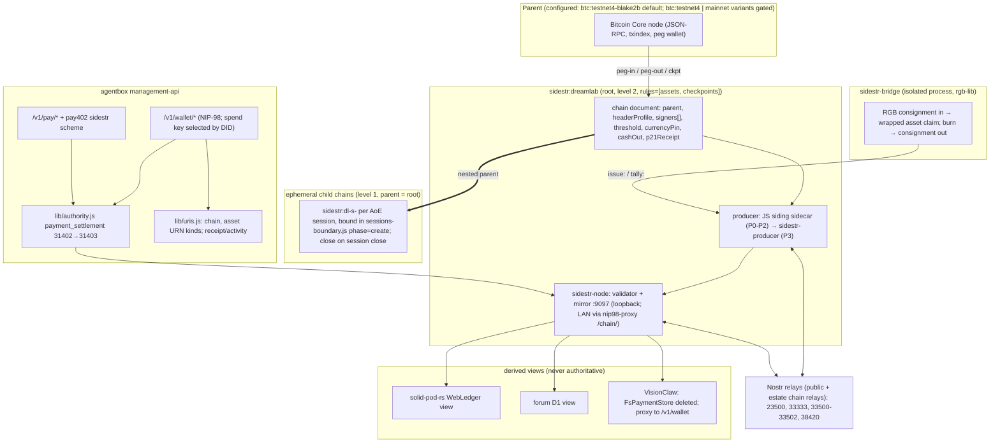

# PRD-024: Sovereign Settlement

**On placement.** `docs/archive/prd/` is a frozen corpus and is not authority. The PRD series
continues here beside the other living scope documents (PRD-023 precedent). This document is
scope, not authority: the eight ADRs it drives are the decisions, and the governing documents
named in `lands_in` are the compliance surface. Every decision here is minted `proposed`; the
owner ratifies.

**Research basis.** A Fable-coordinated mesh (four Sonnet researchers, three Opus planners)
audited the upstream sidestr corpus and every payments, identity, provenance and governance
surface across agentbox, solid-pod-rs, the VisionFlow host, nostr-rust-forum, the VisionFlow
canon and AoE on 2026-09-21. The reports are reproduced in summary in §3 and §4; file:line
citations in this PRD were re-verified by the coordinator.

---

## 1. The decision, in one paragraph

**Our own sidestr sidechains are the key and only value instrument of the ecosystem.** A
sidestr chain is a Bitcoin-family sidechain whose only network is Nostr: signed blocks, no
subsidy, every coin a coin pegged on the parent, rules published as signed documents, and every
reader (a browser tab included) validating the whole chain. DreamLab runs one root chain,
`sidestr:dreamlab`, as a level-2 federation in which each federated instance holds one signer
key; agents, sessions and jobs open ephemeral child chains nested off the root and settle back
on close. External value enters only by peg-in (sats from the parent) or by bridge (RGB20
assets such as USDT-on-RGB, claimed as wrapped assets on our chain). **The chain is the ledger
of record**: a `did:nostr` balance is a fold over that principal's UTXOs, and every existing
ledger becomes a derived view. Lightning-first is dropped. The parent network and the
sidechain's header profile are manifest configuration exposed by onboarding, defaulting to
upstream's current choice, with mainnet variants behind an implemented owner-and-legal gate
bound into the chain document at genesis. Everything is stacked over Nostr end to end.

## 2. Problem

The estate has an almost complete payments loop and no settlement.

| What exists | Where | What is missing |
|---|---|---|
| Sell-side HTTP 402 with a real Web Ledger debit | agentbox `management-api/middleware/payment-gate.js`, solid-pod-rs `enforce_read` (`docs/developer/economy-loop.md`) | The balance being debited is a JSON document, not value anywhere |
| Buy-side pipeline: closed-grammar classifier, deterministic spend policy, native payer, receipts on every attempt | `management-api/lib/pay402.js`, `middleware/spend-policy.js`, `middleware/consumer-payer.js`, `lib/receipt-minter.js` (PRD-015 Phase 1) | `x402` and `l402` are `payable: false`; the planned Lightning rail (PRD-015 C10) was never built; no NWC/NIP-47/NIP-57 code exists anywhere |
| A declared zero-tolerance action class for settlement | `agentbox.toml [skills.authority.classes] payment_settlement` | `routes/payments.js` never calls `lib/authority.js`; the class gates nothing (coordinator grep, 2026-09-21) |
| Bitcoin transaction construction, taproot anchoring, MRC20 tokens, an order book and an AMM | solid-pod-rs `bitcoin_tx.rs`, `mrc20.rs`, `trading.rs` | Hand-rolled BIP-341 on raw k256 (house rule violation); README disclaims production safety of payment routes |
| The blocktrail single-use-anchor seam ADR-033 reserved for L1/RGB/DLC | `services/nostr-pod-bridge/src/contract.rs:139` | `txo[]` constructed empty, never populated |
| A trust ladder L0 to L3 with RGB at L3 and a regulatory containment mechanism (P21) | host `docs/archive/adr/ADR-124`, `ADR-128`, `src/web_contract/` | P21 (testnet pin, cash-out disablement) asserted "architecturally enforced" and not implemented; `AnchorConfirmer` has only test doubles; RGB deferred last |
| Three independent `did:nostr`-keyed sats ledgers | solid-pod-rs `StoragePaymentStore`, host `src/handlers/pay_handler.rs` `FsPaymentStore`, forum `pod-worker/src/payments.rs` D1 | None synced; the host's `.deposit` is a 501 stub; version skew 0.4.0-alpha.15 vs 0.5.0-alpha.7 |
| Federation and mesh identity (PRD-010) | canon | Zero economic content; BC20 `receipt` kind deliberately never crosses |

The financial substrate also has no living governing-document anchor on the host side: every
RGB, 402 and ledger assertion lives in archive-status records (R4). This PRD gives it one.

## 3. What sidestr is, and why it fits

Verified from the upstream clone (SPEC.md v0.0.1, dated 2026-09-15; proposals dated 18 to 19
September 2026; single author Melvin Carvalho, who also authored JavaScriptSolidServer, the
reference Solid server that solid-pod-rs ports).

- **Principles.** Bitcoin's rules with one added (a block carries a signature satisfying the
  chain's `challenge`) and one removed (the subsidy). Every coin is a pegged coin. Users
  validate, signers order. Rules are signed documents with activation heights. Every peg
  output has a refund path (`and_v(v:pk(refund), older(refundBlocks))`) so a dead chain costs
  time, not coins. No native token; issued assets say they are unbacked.
- **Levels.** Level 1: one signer, validators trust it for pegs ("for coins with no value").
  Level 2: k-of-n taproot `multi_a` signers under a NUMS internal key tweaked by the chain id,
  a co-signing round over relays (kinds 23510 to 23514), PSBT peg-out round; live on
  `sidestr:txbt4-fed` (2 of 3) since 18 September. Level 3 (rotation, recovery): not built.
- **Wire.** Kinds 23500 (tx, throwaway key), 23501 (faucet), 33333 (tip, NIP-333 shape,
  mirrors in `u` tags), 33500 (rule document), 33501 (genesis), 33502 (peg record; also used
  for the desk's pledge, a dual-schema hazard). Mirrors serve block files over HTTP and are
  never trusted, only cross-checked against the signer's announcement.
- **Rules a chain may opt into.** `assets` and `pool` (issued assets and a constant-product AMM
  as consensus rules), `checkpoints` (the tip written into the parent as an OP_RETURN),
  `desk` (paused upstream), `evm` (ethereumjs, rejected here), `ephemeral` (a note only:
  chains with a `close`, pro-rata closing coinbase, tombstone; "the parties are usually
  agents").
- **Engine.** bitcoin-desktop/schema, a JSON-LD Bitcoin schema with a byte-exact JS codec. The
  sidechain's own headers are unconditionally Knots BLAKE2b v2 with the unified sighash
  (`siding/lib/overlay.mjs:50-52`); the parent is read over generic Bitcoin Core JSON-RPC and
  is hash-agnostic (`schema/codec/codec.js:325-327` falls back to `sha256d`).
- **gitmark.** `sidestr:gitmark` is the estate's own gitmark product, moved upstream to the
  Knots BLAKE2b testnet4 fork and running the `checkpoints` rule since 18 September.
- **Maturity.** Six days old at audit, two stars, 1,377 lines of consensus-adjacent JS, live
  tests against a real network, no CI, no mainnet chain, AGPL-3.0. "Nothing here is final."

Why it fits: a `did:nostr` key already is a chain address; the transport is the relay mesh
the estate already runs; a chain is a signed document the way everything else here is; and
its ephemeral-chain note describes agent tabs, negotiations and swarm scratch ledgers, which
is the agentbox session model. Its custody model (we are our own federation) is honest about
what every alternative here already implies.

## 4. Decisions carried by this PRD

Owner decisions of 2026-09-21, recorded verbatim in intent and made specific below.

| # | Decision | ADR |
|---|---|---|
| D0 | Our own sidestr sidechains are the key and only value instrument; assets are bridged in | ADR-2096, ADR-2102 |
| D1 | Testnet first; mainnet and real USDT only behind an implemented P21 owner-and-legal gate | ADR-2103 |
| D2 | One root chain, each federated instance a k-of-n signer, ephemeral child chains per session or job that settle on close | ADR-2101 |
| D3 | Rust validator and wallet as published crates, **AGPL-3.0-only derivatives of upstream `siding` with attribution, published case by case and consumed from crates.io (amended 2026-09-22, ADR-2106; "permissive, prose-only clean-room" withdrawn)**; rust-bitcoin accepted estate-wide; solid-pod-rs's hand-rolled BIP-341 ported to it; rgb-lib only inside an isolated bridge process; upstream AGPL JS `siding` as the interim producer sidecar | ADR-2096, ADR-2106, solid-pod-rs ADR-2008, ADR-2102 |
| D4 | The chain is truth; balances are UTXO folds; the three ledgers become derived views; pay402 gains a `sidestr` scheme | ADR-2099, ADR-2097 |
| D5 | Lightning-first is dropped ("we have sidestr now"); NWC and L402 are not built | ADR-2097 |
| D6 | Parent network and header profile are `agentbox.toml` configuration exposed by onboarding, default following upstream (Knots BLAKE2b testnet4); the choice is bound on-seal | ADR-2103 |
| D7 | Everything stacks over Nostr: chain traffic, tips, rule documents, account binding, spend approval | ADR-2098, ADR-2100 |

Standing exclusions: the `evm` rule (PRD-015 C11 stands), the `pool` rule (solid-pod-rs's
live AMM remains the exchange surface), the `desk` rule (paused upstream), custodial routers
(PRD-015 C9 stays default-off and unrelated), RGB as an in-chain VM (ADR-124 L3 stays
deferred and hard-refused).

## 5. Target architecture

**Identity.** A `did:nostr` x-only key is already a chain address. We keep that as the
binding, not the spending key: identity `k_id` never spends or signs blocks; `k_spend(chain)`
and `k_sign(chain)` are domain-separated children (`derive_subkey`, nostr-bbs-core
`keys.rs:251-265`), published as kind **38420** account bindings signed by `k_id` and as a
second Multikey in the DID document. This amends ADR-033's single-Multikey form and leaves
its I1 (no identity migration) intact. Why: upstream reuses one raw key for Nostr identity,
taproot spends, block sealing and an EVM account with no domain separation; a compromised
session must not be able to sign root blocks.

**Wallet.** There is no wallet object and no wallet URN. `balance(did)` is a fold over the
UTXOs whose script is `0x5120 ‖ xonly(k_spend(chain))` across the root and the principal's
live child chains; `holdings(did)` folds `tally:` records for wrapped assets. It is never
stored, so it cannot drift.

**Agent budget.** A child chain is the budget. A session can spend only what was pegged into
its chain from the root at create, enforced by consensus (I01 supply equals pegs), not by
policy. This closes the AoE "no per-agent budget" gap without an AoE feature.

**Nostr plane.** Chain traffic runs on a dedicated supervised program (`sidestr-node`,
`sidestr-producer`), not inside `nostr-pod-bridge`, and does not traverse the estate relay's
build-time allowlist: chain events authenticate against consensus (block signature against
`challenge`, transaction against the UTXO it spends, tip against the signer key). ADR-2012
is narrowed to "identity ingress". Estate-operated chain relays carry child-chain traffic
because ephemeral kinds are only filterable by kind at the relay.

## 6. Requirements

Numbered so ADRs, tests and the DDD invariants can cite them. "Must" is testable.

### 6.1 Substrate (S)

- **S1** `sidestr-core` validates a chain from a cold mirror fetch to the same tip hash the
  upstream JS explorer reports, for both header profiles (`knots-blake2b-v2`, `sha256d`).
- **S2** Every consensus rule has a rejecting test as well as an accepting one; the 33502
  decoder returns `Ambiguous` rather than guessing; `sidestr-core` has no I/O dependency.
- **S3** `sidestr-header` (both header profiles and PoW, RustCrypto only, no rust-bitcoin,
  absorbing the specced b2mine codec), `sidestr-core`, `sidestr-nostr` and `sidestr-wallet` are
  ported from upstream `siding` with attribution, `AGPL-3.0-only` (ADR-2106; was
  `MIT OR Apache-2.0` clean-room from prose), `publish = true` case by case, full rustdoc,
  `cargo doc --no-deps` clean. No permissive crate on a crates.io path links them.
- **S3a** The estate runs three kinds of chain: the value root, the `sidestr:gitmark`
  provenance chain (our own product; `[sidechain].gitmark.mode = consume | operate`), and
  ephemeral children. Provenance anchors (`txo[]`) go to gitmark, never to the value chain.
- **S4** The upstream JS `siding` runs only as a container-internal supervised program until
  the Rust producer validates the same 1,000-block range to the same tip hash.
- **S5** solid-pod-rs `bitcoin_tx.rs` and `mrc20.rs` are ported to rust-bitcoin with the
  golden fixtures byte-identical before and after. This is the first item of the programme.
- **S6** `headerProfile` is proposed upstream as a chain-document field defaulting to current
  behaviour, with the duplicate in `explorer.mjs` patched; our decision is recorded either way.

### 6.2 Chains and federation (C)

- **C1** One root chain `sidestr:dreamlab`, `rules = ["assets", "checkpoints"]`, no `pool`,
  no `evm`, no `desk`; `pegs` populated in the served `chain.json`.
- **C2** Level 2 at P1 exit: three signer keys on three separate hosts, threshold 2, one block
  sealed with the proposer down; at least 3 of 5 before any chain carries value.
- **C3** Signer keys are `k_sign(chain)`, derived one-way (keyed HMAC, never an additive
  tweak); the peg wallet and bridge keys are hardened BIP-32 under rust-bitcoin descriptors;
  the peg descriptor never contains an identity key; `k_sign` never enters `identity.env`.
- **C4** A child chain is minted at `sessions-boundary.js` phase=create as a fifth binding,
  funded by a policy-capped peg-in from the root, recorded as `chain_urn` beside
  `session_urn`, `epic_urn` and `memory_namespace`; closed at phase=close with pro-rata
  settlement onto the root and the closing hash checkpointed as the tombstone.
- **C5** A child chain cannot outlive its session; a session cannot spend beyond its peg-in
  (adversarial test, not policy assertion); a child pegs to the root, never to the parent.
- **C6** Refund-clock compounding under nesting is measured and documented; the root producer
  carries an explicit liveness requirement.

### 6.3 Ledger of record and rails (L)

- **L1** No code path spends, credits, debits or gates on a balance view without resolving to
  the chain; every view carries its height and errors when stale beyond bound.
- **L2** `WebLedger::credit`/`debit` leave the public API; the only credit is a peg-in claim,
  the only debit is a chain spend; the TXO stand-in deposit path is deleted.
- **L3** VisionClaw's `FsPaymentStore` and `/pay/*` handler are deleted and replaced by a proxy
  to `/v1/wallet/*`; the forum D1 ledger becomes a view; both consumers move to one
  post-port solid-pod-rs version together.
- **L4** `pay402.js` gains a `sidestr` scheme as an ADR-032 revision with captured-bytes
  fixtures in `tests/contract/pay402/`; `unknown` stays terminal and unpayable.
- **L5** `x402` and `l402` continue to classify and stay `payable: false`; no NWC, NIP-47 or
  NIP-57 code is added.
- **L6** The `[llm_marketplace]` barter economy stays independent; a grant is not a spend.

### 6.4 Governance and safety (G)

- **G1** Every chain spend, peg-out and bridge redemption passes `lib/authority.js` under the
  `payment_settlement` class: a 31402 with the task-property triple, a signed 31403 above
  threshold, an `authority.deny` journal entry on refusal, a mirrored receipt.
- **G2** The daily budget in `spend-policy.js` is durable across restarts via an existing
  adapter slot (no sixth slot).
- **G3** No gate on a settlement path fails open on backend unreachability.
- **G4** Every settlement outcome, including denied and failed, mints a receipt through
  `uris.js`.
- **G5** Multi-agent policy ceilings and rate limits count authorising principals
  (colloquy-core); per-spend authorisation does not, because revocation retracts
  confirmations and a cleared transaction cannot be un-spent; principal weight is snapshotted
  into the receipt.
- **G5a** The approver sees a structured operation digest, never model-written text; the
  broadcast transaction must hash to the approved digest or the signer refuses.
- **G6** "Single-use seal" is not used for any construction here until `AnchorConfirmer` is
  implemented against `sidestr-node`; "anchor", "peg", "claim" and "marker" are the words.

### 6.5 Configuration and the mainnet gate (M)

- **M1** `agentbox.toml [sidechain]` carries `enabled`, `chain`, `parent`,
  `header_profile`, `mirror_url`, `relays`, `custody` (an honest label), `cash_out`,
  `child_chains`; `[sidechain.signer]` and `[sidechain.bridge]` nest under it.
  Apply classes are honest: node and bridge are `rebuild`, signer is `boot`.
- **M2** `parent` is validated against the SPEC 3.2 alias set `{tbtc4, btc, txbt4, xbt}` (long
  ids mapped on read) and the header family is derived from it and displayed, not chosen;
  the onboarding system (the `agentbox-manifest` projector, the TUI manifest round-trip,
  stack provisioning and first-run) exposes and explains both. Default: follow upstream.
- **M3** The configured parent, `headerProfile`, `currencyPin`, `cashOut`, `pegConfirmations`
  and `refundBlocks` form a `containment` block whose hash is committed as a `pin:` record in
  the genesis coinbase. Changing any of them is a new chain. The validator reads them from the
  sealed document, never from the manifest; a disagreement is a boot failure. Peg parameters
  are set per parent family: `btc:mainnet-blake2b` is the most dangerous peg parent of the
  four (value-bearing and buyable finality) and a value-bearing chain on any `*-blake2b`
  parent requires an audit covering reorg economics; peg keys are post-fork by construction
  and the producer refuses pre-fork UTXOs.
- **M3a** Onboarding filters mainnet variants out of the offered set until a gate receipt
  exists, rather than warning. The apply class for `parent` and `header_profile` is `rebuild`.
- **M4** A mainnet chain document cannot be signed unless `parent` names a mainnet variant,
  a signed 31403 from the owner and legal principals exists, and that event id is in the
  document before genesis. A CI check fails the build if a mainnet chain document exists
  without it. Test: mutate the sign-off id after genesis and prove `open()` refuses.
- **M5** The faucet (23501) is compiled out for mainnet variants.

### 6.6 Bridge (B)

- **B1** `sidestr-bridge` is an isolated process linking rgb-lib; `sidestr-core`'s dependency
  graph never contains rgb-lib, rgb-core or AluVM.
- **B2** An RGB20 test asset is bridged in, transferred on our chain between two DIDs, and
  exited to a consignment rgb-lib validates; wrapped supply equals held reserve at all times;
  redemption burns before it releases.
- **B3** `urn:agentbox:asset:<issuer>:<sha12>` resolves to the origin contract id.
- **B4** The bridge is labelled a custodian; USDT-on-RGB is bridged only once confirmed live on
  mainnet and only behind M4.
- **B5** Assets never leave through the sats peg; an asset exits only by its bridge or a child
  chain's close.

### 6.7 Documentation and registry (D)

- **D1** `docs/PROTOCOL-registry.md` (agentbox and host) gains a Nostr-kind table recording
  the sidestr kinds as externally owned and 38420 as ours.
- **D2** `docs/developer/economy-loop.md` is rewritten (it says "Lightning-first"), as is
  solid-pod-rs `docs/explanation/payments-and-web-ledger.md` (it teaches `credit`/`debit` as
  the core operations and fixes the money model as Lightning/L402/NWC), and the VisionFlow
  canon site copy and README status ledger that still name Lightning-first or an unnamed
  "payment account".
- **D3** The four governing documents in `lands_in` gain Invariants for settlement.
- **D4** Ontology: mint `sidestr-protocol`, `wrapped-asset-bridge`, `pro-rata-close`,
  `webledger` alongside the four gaps ADR-124 §8 already committed to.

## 7. Phased plan

Strict order P0 → P1 → P2 → {P3, P4}. P0 to P3 run on the configured testnet parent. P4 is the
only phase that touches real value and cannot start until M4 exists as code.

| Phase | Work | Exit evidence |
|---|---|---|
| **P0 Foundation** | ADR/PRD/DDD pack; `sidestr-core` + `sidestr-nostr` clean-room; solid-pod-rs rust-bitcoin port (S5); `headerProfile` upstream proposal; `[sidechain]` manifest block and onboarding exposure | S1 against live `txbt4-fed` and `gitmark`; S2; S5 golden fixtures; `cargo doc` clean; upstream PR filed |
| **P1 Root chain** | Mint `sidestr:dreamlab`; `sidestr-node` + JS producer supervised; mirror :9097; nip98-proxy `/chain/`; `chain`/`asset` URN kinds; kind table; `sidestr-wallet`; version-skew resolution | Genesis validated by node and JS explorer from cold; peg-in claimed and spendable; peg-out paid on the parent; C2; agent-reconcile and lint gates; recall gate in band |
| ↳ P1 status 2026-09-22 | **Minted.** `sidestr:dreamlab` sealed beside `tbtc4` by the merged upstream engine (spec `53f91f9`): genesis `4db37517…d453dbc0`, signer `7092810a…4c76d62`, prefix `drm`, no pegs; document at `config/sidechain/dreamlab/chain.json`, key in the secrets volume, block file under `$WORKSPACE/sidestr/dreamlab`. Replayed cold by the engine; block 0's header hashed independently to the document (`tests/config/sidechain-genesis.test.sh`). The testnet4 peg wallet holds 0.001 tBTC. | Not yet: producer, mirror, proxy route, URN kinds, 38420 binding, announcement, first peg-in. Deviation found: upstream's genesis commits id, pegs, time and signer only, so `parent` and the containment block are bound by the committed document, not the coinbase (ADR-2103 amendment). |
| **P2 Chain is truth** | pay402 `sidestr` scheme; authority wiring; durable budget; fail-closed cost gate; ledgers to views; FsPaymentStore deleted; `AnchorConfirmer`; `txo[]` populated | L4 fixtures; agent A pays agent B 1,000 test sats through a 402 with a receipt citing the chain txid; a spend above threshold blocks on a 31403 and journals a deny; three-ledger equality on 100 random DIDs; budget survives restart |
| **P3 Child chains and Rust producer** | Session-bound child chains; nested-parent validation; `sidestr-producer` to parity; colloquy principal collapse | C4, C5, C6; S4 parity; fifty agents under one principal count as one voice |
| **P4 Bridge and mainnet gate** | `sidestr-bridge`; wrapped-asset in and out; M4 as code; USDT only if live | B2, B3, M4 mutation test; the ADR-124 §7 matrix restated with no cell exempted |

## 7a. Independent adversarial review and what it changed

Two independent reviews ran over the finished pack on 2026-09-21: a Sonnet red team (different
model family from every author) and GPT-6 Astra via the Codex consultant. Both are filed in
`sovereign-settlement-research/`. The red team found two mechanical blockers (a double-booked
Nostr kind, a propagated wrong line citation), both fixed. GPT-6 Astra found nine design-level
defects and one wrong licensing conclusion. Its verdict is adopted: **do not ratify this pack
as authority to carry real value**; ratify it as scope for a constrained research programme
under D0 to D6 whose P0 now includes original protocol work. Every must-fix item is carried
into the ADRs as an "Amendments after independent adversarial review" block and into the
requirements below.

| # | Finding (GPT-6 Astra) | Change carried |
|---|---|---|
| 1 | A k-of-n threshold is not Byzantine consensus; 3-of-5 permits two valid histories at one height; upstream's re-sign-after-timeout enables conflicting certificates | Fault model with `2k − n > f`; no re-signing; view change; durable vote journal; no external release before a finality rule (ADR-2101, C2) |
| 2 | A claimed deposit's parent refund path stays open; the depositor can refund after spending on the child | Deposit lifecycle: mint only after sweep to custody confirms; refund guarantee restricted to unclaimed deposits; secondary holders told recovery depends on the federation (DDD I14, C8) |
| 3 | Wrapped issuance cannot use the upstream `assets` rule (identity = issuing txid, supply fixed) | A versioned `bridge` consensus rule (ADR-2102, B1a) |
| 4 | The closing coinbase conflicts with coinbase, burn and asset rules; a dead session cannot run its close hook | Close as a distinct consensus transition; settlement supervisor outside the session (ADR-2101, C7) |
| 5 | Parent peg-out fees taken from reserve make a fully backed peg insolvent; I01 and I08 overbroad | Conservation equations over defined categories; fees from operator capital (DDD I01/I08, L7) |
| 6 | Keys derived from `k_id` are reachable by any compromised process because `identity.env` is sourced everywhere | Independent custody roots for signer and bridge; authenticated identity port; no generic sign port (ADR-2101, G7) |
| 7 | A structured-field digest is not the transaction hash and omits inputs, change, fees, nonce | Canonical approved intent validated field by field; atomic consumption; fee ceiling (ADR-2100, G5a) |
| 8 | The containment block omitted the receipt it claimed to freeze; the security plan's version was self-referential; one event cannot carry two approvers | Acyclic sealing: payload → two signed approvals → envelope → genesis commitment → archive (ADR-2103, M3, M4) |
| 9 | Validity-changing fields described as ignorable metadata | A named, versioned protocol profile with feature negotiation (ADR-2103, S7) |
| 10 | "Running AGPL code as a program" is not a compliance conclusion; the overlay patch makes us a modifier | AGPL inventory and section-13 source offer; clean-room provenance; rgb-lib is MIT (ADR-2096) |
| 11 | Obligations attach to activity, not to the parent enum; CARF, Travel Rule, promotions and the 2027 FCA regime were unaddressed | Legal operating model before triggering activity; gate on economic exposure (ADR-2102, ADR-2103, D5) |
| 12 | The gate bypass is below the HTTP routes; budget durability is not atomicity; receipts are not inherited from the helper | Signing-capability inventory; atomic budget state machine; durable intent and outbox (ADR-2100, G8) |

Also adopted from the review's SHOULD list: explicit exposure caps and degraded modes with
published recovery objectives; fault-injection tests (stale restores, split-brain signers,
delayed certificates, relay loss, deep reorgs, bridge retries); pinned source commits and
container digests (a tag is not a commit); archive retention for consignments, close proofs
and signed approvals; separation of hosting redundancy from custody independence.

### Requirements added or amended by the review

- **C2 (amended)** Thresholds come from a stated fault model, `2k − n > f`; 4-of-5 for f = 1
  before any value; a signer never signs two proposals at one height; votes are journalled
  durably before publication; the conflicting-certificate attack is a mandatory test.
- **C5 (amended)** Child claims are verified by every validator against the root UTXO set; a
  session-signer cannot fabricate claims.
- **C7** Close is a distinct consensus transition (UTXO retirement, per-asset entitlements,
  authenticated root destination per holder, fees, dust, rounding, holder cap, finality); a
  settlement supervisor outside the session holds the authority and state to close a child
  whose session died; four distinct facts: session closed, child closed, payout confirmed,
  tombstone published.
- **C8** Deposit lifecycle: refundable-unclaimed → swept-to-custody → issued liability →
  redeemed; minting waits for the sweep; the refund guarantee is stated only for unclaimed
  deposits.
- **L7** Conservation equations over circulating, immature, locked, pending-deposit,
  pending-redemption, customer-reserve and operator-fee-capital quantities; parent fees never
  come from customer reserve; solvency includes redemption liabilities.
- **G5a (amended)** Canonical approved intent (genesis, profile, principal, full output set,
  fee ceiling, sighash, locktime, nonce, expiry, policy version), validated field by field at
  the signer, consumed atomically.
- **G7** Federation signer and bridge custody roots are independent seeds never derived from
  `k_id`; the identity port authenticates callers and permits named operations only.
- **G8** Signing-capability inventory with a policy per capability; atomic budget state
  machine; durable intent and outbox for receipts.
- **S7** A named, versioned protocol profile; chains declare it; validators lacking it refuse.
- **B1a** A versioned `bridge` consensus rule (identity, reissuance, reserve allocation,
  redemption records, replay protection, attestation format).
- **M3 / M4 (amended)** Acyclic sealing with both approvals inside the committed envelope;
  the gate triggers on economic exposure, inherited through nesting and assets; cash-out is
  defined and enforced by the validator.
- **D5** The legal operating model (entity, territory, customer classes, permitted
  activities, custody terms, registrations) is determined by counsel before any triggering
  activity.
- **P0 (amended)** exits only when the protocol specifications for consensus safety, deposit
  lifecycle, wrapped-asset rule, close transition, sealing procedure, accounting model and
  signing-capability inventory exist as reviewed documents with test vectors.

## 8. What this retires

| Thing | Fate |
|---|---|
| Lightning-first (PRD-015 C10), ADR-032 D5, NWC/NIP-47/L402 payable path | Superseded; not built; Lightning may return only as a bridge on-ramp |
| `evm`, `pool`, `desk` rules | Excluded from every chain document we seal |
| MRC20 as the asset rail | Superseded by wrapped assets; the chained-taproot derivation stays as the anchoring primitive |
| VisionClaw `FsPaymentStore` and `/pay/*` | Deleted; no value ever entered it |
| Forum D1 ledger as truth; solid-pod-rs `WebLedger` as truth | Derived views |
| `WebLedger::credit`/`debit`; the TXO stand-in deposit | Removed |
| The "k256-only, zero-rust-bitcoin-dep posture" | Retired estate-wide |
| ADR-124 P3 sequencing for RGB | Re-sequenced for the bridged-asset case only; in-chain RGB stays deferred |
| The 2026-09-02 "anchoring stays on SHA-256d mainnet" note | Superseded by D6 |

## 9. Risks, ranked

**Overall rating (adopted from the GPT-6 Astra review): critical for real-value activation;
high but containable for a genuinely valueless research deployment.** Adopting a six-day-old
single-author specification as the sole value instrument is defensible only as a constrained
engineering commitment: freeze and own a reviewed protocol profile; treat consensus safety,
the deposit lifecycle, the bridge rule, the close transition and containment as original
protocol work; allow no customer funds, redeemable service value or USD claims during
research; complete independent audits and destructive recovery testing before activation;
operate within explicit exposure limits and legal permissions; keep a wind-down procedure.

1. **Consensus safety is unspecified upstream.** Two valid histories at one height are
   possible under the upstream round. Mitigation: the fault-model threshold, no re-signing,
   durable votes and a finality rule before any external release (C2).
2. **Upstream maturity.** A six-day-old, single-author, pre-0.0.1 spec. Mitigation: our
   consensus code is ours and clean-room; wire formats are pinned by fixtures; the parts we
   depend on most (peg mechanics, level 2) have live deployments behind them.
2. **Custody is real and it is ours.** k colluding signers take the peg. Mitigation:
   domain-separated signer keys, honest per-chain disclosure, testnet until P4, level 3 as
   declared future work.
3. **Regulatory exposure at P4.** Custody of pegged sats and of a fiat-referenced stablecoin
   attaches UK MLR-2017, FCA cryptoasset and stablecoin obligations that no trust level
   exempts (ADR-124 §7 stands unchanged). Mitigation: M4, and counsel questions in §10.
4. **The header-profile choice.** Following upstream means a Rust codec for the 164-byte
   Knots v2 header and unified sighash; choosing `sha256d` means diverging from the reference
   until `headerProfile` is accepted upstream. Mitigation: both arms are first-class in
   `sidestr-core`, proven against live chains; the choice is configuration.
5. **solid-pod-rs payment core is self-disclaimed as not production-safe.** Mitigation: S5 and
   the non-atomic-state fix are P2 preconditions; nothing in P0 to P1 depends on those routes.
6. **Nested chains are unexercised anywhere.** Mitigation: children are short-lived and small;
   C6 measures the compounding.
7. **Relay filtering does not scale** for per-session chains. Mitigation: estate chain relays;
   propose an indexed single-letter tag upstream.
8. **Losing a level-1 child signer strands already-claimed coins.** Mitigation: close is part
   of the session boundary, not an operator action.

## 10. Outstanding questions

Answered by the owner on 2026-09-21: parent regime (D1, D6), topology (D2), build posture
(D3), ledger truth (D4), Lightning (D5), evm (excluded), assets bridged in (D0).

Answered by the owner on 2026-09-21 (second round), and applied to the records:

1. **Signer roster.** Research stage is 1-of-1 on the agentbox host, optionally 1-of-2 as a hot
   standby; k-of-n is a stretch goal for when more machines exist, homed in the federation
   project (not yet populated on GitHub; external interest), and in the long term the signers
   may be agents (ADR-2101).
2. **Federation scope.** Deferred to the federation layer, about to be designed; one root now.
3. **Mirror visibility.** Internal now. Tip announcements (33333) may additionally be published
   to the relay the owner's Damus client uses, since they are relay events by design; block
   files stay behind the nip98-proxy. (Which relay that is remains to be named: nothing called
   Damus is configured in agentbox.)
4. **Receipt crossing.** Internal only now; a `settlement` crossing kind when the federation
   layer exists.
5. **Approval threshold shape.** Scaffolded per asset and per principal with sats-only rows;
   USD rows framed, not decided.
6. **The AMM.** Parked: the pod AMM stays on the legacy ledger until upstream's next AMM is
   inherited (ADR-2096).
7. **USDT.** Paused: bridge scaffolded and framed, no asset bridged, no claim (ADR-2102).
9. **First seal.** `parent = tbtc4` (the estate's testnet4 node) with stock 80-byte headers:
   sidestr 0.0.2 names parents by alias and derives the header family from the parent, so the
   mixed pairing is gone and `header_profile` is derived, not configured (ADR-2103).
   **Sealed 2026-09-22:** genesis `4db37517728bd509c0cb96ee5a2e3e2a77f9e965a092e9f67948b413d453dbc0`,
   an 80-byte stock header with bit 31 clear at `powLimit`, made by the merged upstream engine
   and replayed cold (P1 status row above).

Still open, and each changes what gets built:

8. **Counsel.** With our federation as peg holder and bridge custodian: which of MLR-2017
   registration, FCA cryptoasset authorisation, stablecoin safeguarding and KYC for pod owners
   attach at first mainnet value, and what must M4's sign-off artefact therefore contain?
   Note the security plan's crux: a testnet-parented chain whose coins are redeemable against
   our services is carrying value regardless of the parent.
13. **Fault model.** Deferred with k-of-n to the federation project; recorded as its first
    question: how many Byzantine signers (f), and how independent are the operators,
    credentials, release channels and parent nodes behind the n keys.
14. **Legal operating model.** Deferred while testnet-only and valueless; reopened by the first
    activity that could count as promotion or custody, which may precede mainnet.
15. **Child participants.** Recommended: any principal bound on the root chain may hold value
    on a child, nobody else, always validated with the root view. Awaiting confirmation.
16. **Node access.** Closed 2026-09-21: a separate Bitcoin Core testnet4 instance
    (`bitcoind-testnet4.service`, `txindex=1`, RPC 48332 on the LAN with its own rpcauth users)
    and a separate Core Lightning testnet4 instance now run on the Dell VM beside the untouched
    mainnet daemons; the `sidestr-peg` descriptor wallet exists and RPC is verified reachable
    from the container. Credentials are root-only on the VM. Awaiting funding of the peg
    address and the end of the initial sync.
17. **Relay for tips.** Which relay the owner's Damus client reads, if 33333 announcements are
    to be mirrored there; otherwise the estate relay only.
18. **Upstream engagement.** Melvin shipped spec 0.0.2 (parent aliases, header family from
    the parent) the same day and asked for a rebase; PR #4 is rebased to the producer's half
    (block builder by family, strict BIP 34 height) and sidestr/explorer PR #2 follows the
    alias table; all suites green. Still to ask him: whether
    the producer has run against a SHA-256d parent; the timeline of the next AMM; and whether
    `sidestr:gitmark`'s signer key can be shared or the estate should operate its own gitmark.
10. **Two parent selections.** The block-trail anchoring stack (solid-pod-rs `JSS_PAY_MEMPOOL_URL`)
    and the sidechain peg parent are independent settings. Aligned, or deliberately separate?
11. **Is `btc:mainnet-blake2b` acceptable for value at all**, given buyable finality, or
    testnet-only in practice regardless of what the enum permits?
12. **Child-chain header profile.** May a child differ from its root's header profile, or only
    inherit it? Allowing it means running several codecs at once.

## 11. References

- Upstream: github.com/sidestr/spec (SPEC.md, proposals/), sidestr/wallet, sidestr/explorer,
  bitcoin-desktop/schema, nostrfinance.github.io/docs.
- Estate: `docs/developer/economy-loop.md`; `docs/archive/prd/PRD-015`; `docs/archive/adr/ADR-032`,
  `ADR-033`; host `docs/archive/adr/ADR-124`, `ADR-128`; solid-pod-rs
  `crates/solid-pod-rs/docs/explanation/payments-and-web-ledger.md`; `crates/colloquy/`.
- Ontology: `urn:ngm:class:sidechain`, `two-way-peg`, `peg-mechanism`, `rgb-protocol`,
  `rgb-and-client-side-validation`, `stablecoins-on-bitcoin`, `stablecoin-regulation`,
  `single-use-seals`, `client-side-validation`, `uk-mlr-2017`, `licensing-requirements`.
- Decision record in RuVector: `project-state` /
  `financial-substrate-sidestr-decisions-2026-09-21`.
