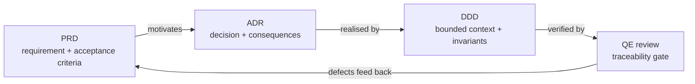

# Agentbox reference

> [Agentbox Docs](../README.md) · Reference

Canonical, version-controlled specifications for the agentbox subsystem. Every
architectural decision, product requirement, domain model, and quality-engineering
review lives here. Treat this corpus as the source of truth: user and developer
docs explain and operationalise what these files decide.

## Catalogues

| Catalogue | Count | Contents |
|-----------|-------|----------|
| [Architecture Decision Records](adr/README.md) | 35 | ADR-001..035 — the *why* behind each structural choice |
| [Product Requirement Documents](prd/README.md) | 17 + 1 remediation | PRD-001..017 plus PRD-REMEDIATION-001 — the *what* and *acceptance criteria* |
| [Domain-Driven Design models](ddd/README.md) | 15 | DDD-001..015 — bounded contexts, aggregates, invariants |
| [QE reviews](qe-reviews/README.md) | 2 | QE-001..002 — traceability and re-verification gates |
| [Extension vocabulary](_vocab/agbx.md) | — | `agbx:` term registry and the v1 JSON-LD context |

## Decision chains by domain

Each domain is a vertical slice: a PRD states the requirement, one or more ADRs
record the decisions, a DDD models the bounded context, and (where gated) a QE
review verifies traceability.

| Domain | PRD | ADRs | DDD | QE |
|--------|-----|------|-----|----|
| Capabilities & adapters | [001](prd/PRD-001-capabilities-and-adapters.md) | [005](adr/ADR-005-pluggable-adapter-architecture.md), [031](adr/ADR-031-adapter-contract-enforcement.md) | — | — |
| Immutable bootstrap | [002](prd/PRD-002-immutable-runtime-bootstrap.md) | [006](adr/ADR-006-immutable-runtime-bootstrap.md) | [001](ddd/DDD-001-immutable-bootstrap-domain.md) | — |
| Runtime contract & hardening | [003](prd/PRD-003-runtime-contract-and-container-hardening.md) | [007](adr/ADR-007-runtime-contract-and-container-hardening.md) | [002](ddd/DDD-002-runtime-contract-domain.md) | — |
| Sovereign messaging | [004](prd/PRD-004-external-agent-messaging.md) | [008](adr/ADR-008-privacy-filter-routing.md), [009](adr/ADR-009-embedded-nostr-relay.md), [010](adr/ADR-010-rust-solid-pod-adoption.md) | [003](ddd/DDD-003-sovereign-messaging-domain.md) | — |
| Meta-router & consultants | [005](prd/PRD-005-meta-router-consultants.md) | [011](adr/ADR-011-consultation-mcps.md) | — | — |
| Linked-data interfaces | [006](prd/PRD-006-linked-data-interfaces.md) | [012](adr/ADR-012-jsonld-federation-grammar.md), [013](adr/ADR-013-canonical-uri-grammar.md), [014](adr/ADR-014-bidirectional-graph-state-ingress.md) | [004](ddd/DDD-004-linked-data-interchange-domain.md) | — |
| Multi-tenant federation | [007](prd/PRD-007-multi-tenant-federation.md) | [017](adr/ADR-017-multi-tenant-did-nostr-pods.md) | [011](ddd/DDD-011-multi-tenant-federation-domain.md) | — |
| Code-as-harness | [008](prd/PRD-008-code-as-harness-integration.md) | [018](adr/ADR-018-persistent-code-interpreter-mcp.md), [019](adr/ADR-019-experiential-skill-learning.md), [020](adr/ADR-020-aci-mcp-tree-search.md) | [005](ddd/DDD-005-code-execution-domain.md) | [001](qe-reviews/QE-001-code-as-harness-traceability-review.md), [002](qe-reviews/QE-002-code-as-harness-reverification.md) |
| LLM resource marketplace | [009](prd/PRD-009-llm-resource-marketplace.md) | [021](adr/ADR-021-llm-resource-marketplace-kinds.md) | [006](ddd/DDD-006-llm-marketplace-domain.md) | — |
| Runtime integrity hardening | [010](prd/PRD-010-runtime-integrity-hardening.md) | [022](adr/ADR-022-runtime-integrity-hardening.md) | [007](ddd/DDD-007-runtime-integrity-domain.md) | — |
| Ontology bridge | [011](prd/PRD-011-ontology-bridge.md) | [023](adr/ADR-023-ontology-bridge.md) | [008](ddd/DDD-008-ontology-bridge-domain.md) | — |
| Setup wizard & dashboard | [012](prd/PRD-012-setup-dashboard.md) | [024](adr/ADR-024-setup-dashboard.md) | [009](ddd/DDD-009-setup-dashboard-domain.md) | — |
| Multi-harness tmux | [013](prd/PRD-013-multi-harness-tmux-architecture.md) | [025](adr/ADR-025-multi-harness-tmux-architecture.md) | [010](ddd/DDD-010-multi-harness-coordination-domain.md) | — |
| Embodied agent loop | [014](prd/PRD-014-embodied-agent-loop.md) | [026](adr/ADR-026-cross-substrate-agent-loop-seams.md), [028](adr/ADR-028-per-user-agent-fabric.md), [029](adr/ADR-029-session-mirror-live-egress.md) | [012](ddd/DDD-012-sovereign-knowledge-elevation-domain.md) | — |
| Consumer & broadcast economy | [015](prd/PRD-015-consumer-broadcast-economy.md) | [021](adr/ADR-021-llm-resource-marketplace-kinds.md), [032](adr/ADR-032-402-scheme-grammar.md), [033](adr/ADR-033-did-nostr-multikey-convergence.md) | [006](ddd/DDD-006-llm-marketplace-domain.md) | — |
| Context compression & caching | [016](prd/PRD-016-context-compression-caching.md) | [034](adr/ADR-034-headroom-rust-crate-integration.md) | [014](ddd/DDD-014-compression-cache-domain.md) | — |
| Sovereign project tracking | [017](prd/PRD-017-sovereign-project-tracking.md) | [035](adr/ADR-035-project-tracking-telemetry-and-nostr-kind.md) | [015](ddd/DDD-015-project-tracking-domain.md) | — |
| Default-secure remediation | [REMEDIATION-001](prd/PRD-REMEDIATION-001.md) | [027](adr/ADR-027-default-secure-posture.md) | [013](ddd/DDD-013-hardening-boundary-domain.md) | — |

Foundational and cross-cutting ADRs sit outside any single domain slice:
[001](adr/ADR-001-nixos-flakes.md) (Nix flakes), [002](adr/ADR-002-ruvector-standalone.md) and [015](adr/ADR-015-mcp-ruvector-mandate.md) (RuVector),
[003](adr/ADR-003-guidance-control-plane.md) (guidance control plane), [004](adr/ADR-004-upstream-sync.md) (upstream sync),
[016](adr/ADR-016-license-consolidation.md) (licensing), [030](adr/ADR-030-sovereign-mesh-manifest-boundary.md) (sovereign-mesh manifest).

## See also

- [Agentbox documentation home](../README.md)
- [agbx extension vocabulary](_vocab/agbx.md)
- Governing meta-decision: [ADR-003 — Guidance Control Plane Integration](adr/ADR-003-guidance-control-plane.md)
