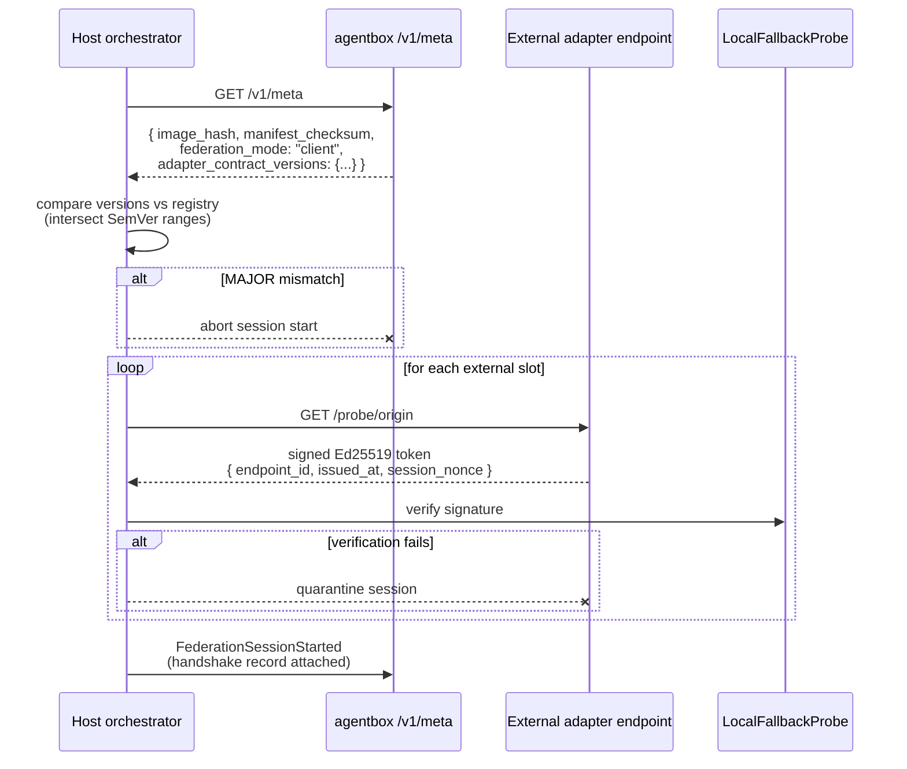

# ADR-005: Pluggable adapter architecture for durable state

**Status:** Accepted
**Date:** 2026-04-23
**Author:** Agentbox team
**Supersedes:** n/a
**Related:** ADR-001 (Nix flakes), ADR-002 (RuVector embedded), PRD-001 (Capabilities and adapters)

## TL;DR for newcomers
*Skip if you already know the five-slot adapter pattern.*

This ADR explains how agentbox talks to durable state — task receipts, pod storage, vector memory, event sinks, and the agent orchestrator — in a way that works identically whether it runs standalone or federates into a host mesh. The pain point it addresses is the obvious bad alternative: hardcode one backend for each service and patch a second codepath for the other shape, then spend the rest of the project fighting two sets of bugs and silent capability mismatches. The shape of the answer is a **five-slot adapter pattern** (beads, pods, memory, events, orchestrator), each declared in `agentbox.toml` and resolved at boot to one of three implementation classes: a local class (`local-*` / `embedded-*`), a federated class (`external` / `external-pg` / `stdio-bridge`), and an `off` class. The orchestrator slot's federated class is named `stdio-bridge` rather than `external` because federation is the transport (stdio over `docker exec -i`), not a remote URL — same shape, different name. You will learn the slot taxonomy, the adapter interface, the manifest contract, and the contract tests that keep all three classes behaviourally equivalent.

**If you remember only one thing:** five adapter slots, three implementation classes, one contract — hardcoding a backend is never the right answer.

For the deep version, keep reading.

## Context

Agentbox is designed to run in two shapes without recompilation:

- **Standalone** — a reusable agent container dropped into any repository, with no external services required to be useful.
- **Client** — federated with a host project's existing service mesh (durable task receipts, pod storage, vector memory, event sinks).

A naive implementation would hardcode one backend and a second codepath for the other. That produces exactly the tech debt we're trying to escape: two distinct boot paths, two sets of bugs, drift between modes, and users discovering at runtime that a feature only works in one shape.

Three adjacent constraints shape the decision:

1. Agentbox's feature set is already manifest-gated (`agentbox.toml` + Nix flake evaluator). The adapter slot should be a first-class section of that manifest, not a separate config file.
2. Earlier agentbox designs hosted durable services (Solid pod server on port 8484, sovereign-bootstrap provisioning pods on every startup). Feedback during the 2026-04 radical-upgrade sprint was decisive: **hosting durable state inside an ephemeral agent container is the wrong boundary**. Durable state belongs to the host project when federated, and to a local fallback when standalone.
3. Every adapter slot needs the same three shapes — `local-*`, `external`, `off` — or users will hit capability mismatches.

## Decision

We adopt a five-slot adapter pattern. Each slot is declared in `agentbox.toml` under `[adapters]` and resolved at boot to one of three implementation classes.

### The five adapter slots

| Slot | Purpose | Local default | External shape |
|---|---|---|---|
| `beads` | Structured agent-work receipts: epic/child hierarchy, atomic claim, dependencies, user attribution | SQLite-backed store implementing the reference `bd` CLI interface | HTTP REST, stdio JSON-RPC, or MCP — adapter negotiates on URL scheme |
| `pods` | Durable linked-data storage for briefs, debriefs, artefacts | JavaScriptSolidServer pinned via nixpkgs input | Solid-protocol-compatible HTTP/WebSocket |
| `memory` | Vector memory for agent retrieval | Embedded RuVector (sql.js + ONNX) | PostgreSQL-backed vector store (pgvector or ruvector-postgres) |
| `events` | Agent lifecycle event sink | JSONL append under `/workspace/events/` | HTTP POST, WebSocket, or Nostr (parameterised-replaceable kind) |
| `orchestrator` | Agent spawn + monitor channel consumed by external callers | In-container process manager + stdio streams | `docker exec -i` stdio protocol + `/v1/agent-events` HTTP stream |

### The adapter interface

Every adapter is a JavaScript class with a fixed method signature per slot. Implementations live under:

```
management-api/adapters/
├── beads/
│   ├── local-sqlite.js
│   ├── external.js
│   └── off.js
├── pods/
│   ├── local-solid-rs.js
│   ├── external.js
│   └── off.js
├── memory/
│   ├── embedded-ruvector.js
│   ├── external-pg.js
│   └── off.js
├── events/
│   ├── local-jsonl.js
│   ├── external.js
│   └── off.js
└── orchestrator/
    ├── local-process-manager.js
    ├── stdio-bridge.js
    └── off.js
```

Resolution happens once at management-api startup. The chosen implementation is passed to downstream consumers (BriefingService, MCP servers, route handlers) as a constructor dependency.

### Manifest contract

```toml
[adapters]
beads        = "local-sqlite"       # | "external" | "off"
pods         = "local-solid-rs"     # | "external" | "off"
memory       = "embedded-ruvector"  # | "external-pg" | "off"
events       = "local-jsonl"        # | "external" | "off"
orchestrator = "local-process-manager"  # | "stdio-bridge" | "off"

[federation]
mode = "standalone"                 # | "client"
external_url = ""                   # set when mode="client"

[integrations.ruvector_external]
enabled = false
conninfo = ""                       # postgresql://...

[integrations.external_orchestrator]
enabled = false
protocol = "stdio"                  # | "http" | "mcp"
```

### Validation rules enforced by `agentbox config validate`

Every rule has an error code, a specific stderr message regex, and a dedicated test case. The validator is mandatory — `flake.nix` evaluation refuses to produce an image if validation fails.

1. `E001` — any adapter set to `"external"` requires `federation.mode = "client"` and `federation.external_url` (or the relevant `[integrations.*]` section) to be populated.
2. `E002` — `adapters.memory = "external-pg"` requires `[integrations.ruvector_external].conninfo` to match a reachable DSN; startup probe `pg_isready` blocks service start.
3. `E003` — `adapters.orchestrator = "stdio-bridge"` implies the stdio spawn channel is exposed; compose MUST NOT also bind a port for the orchestrator adapter.
4. `E004` — all-`"off"` is legal (ephemeral CI worker profile) but MUST be declared explicitly via `[federation].mode = "standalone"` with a warning printed on startup.
5. `E005` — `adapters.events = "external"` requires `[integrations.external_events]` section with at least one of `url`, `relay_urls` (Nostr), or `mcp_endpoint`.
6. `E006` — `skills.spatial_and_3d.gaussian_splatting = true` requires `gpu.backend = "local-cuda"`; any other backend is rejected.
7. `E007` — `skills.media.comfyui_builtin` and `skills.media.comfyui_external` MUST NOT both be true.
8. `E008` — `gpu.backend = "local-cuda"` MUST resolve on the host arch (x86_64 only at time of writing); aarch64 builds with this rule set raise an error.
9. `E009` — every enabled `[providers.<name>]` section requires its credentials env-var present at boot-time check (not build-time); missing env var is reported per-provider.
10. `E010` — `desktop.enabled = true` forbids any profile marked `headless_only = true`; validator iterates over all profiles in `/workspace/profiles/*/profile.toml`.
11. `E011` — **retired 2026-04-25.** Was: every enabled skill in `[skills.*]` MUST resolve to a Nix package declared in the skills-corpus. Unreachable in practice — schema's `additionalProperties: false` already rejects unknown skill keys via E016, and the hardcoded snapshot drifted from the actual corpus. Replacement idea: consume `nix build .#skills` artefact at validate time.
12. `W012` — `federation.mode = "client"` with any adapter set to a `local-*` implementation. Recategorised from E012 to W012 in 2026-04-25 — the docstring always called this a warning but the rule was pushed to errors[] forcing non-zero exit; now correctly advisory.
13. `E013` — `[observability].metrics_port` MUST NOT collide with any other port assigned in the compose generator output.
14. `E014` — `[sovereign_mesh].telegram_mirror = true` requires `CTM_BOT_TOKEN` and `CTM_TELEGRAM_CHAT_ID` env vars at boot.
15. `E015` — **retired 2026-04-25.** Was `[sovereign_mesh].jss_rust_backend = true` requires `jss-rust` Nix input pinned in `flake.lock`. The flake input was never declared and the field had no consumer; the Rust pod adoption shipped as `solid-pod-rs` (ADR-010) instead. Schema property dropped, validator rule removed, code reserved for re-use.
16. `E016` — every manifest key consumed by the supervisord generator MUST be declared in the JSON Schema; unknown keys under known sections raise `UnknownManifestKey` (prevents typo-silence).
17. `E021` (renamed from W021 in 2026-04-25) — feature corresponding to a `[security.exceptions.<name>]` is enabled but no exception block is declared; the hardened baseline may be silently broken at runtime without the exception delta applied.
18. `E028` — `sovereign_mesh.relay.port` MUST NOT collide with `RESERVED_PORTS`, `observability.metrics_port`, `privacy_filter.port`, or `integrations.solid_pod_rs.port`.
19. `E030` — `relay.ingress_policy = "open"` combined with `external_fanout = "bidirectional"` is an unbounded ingress path; tighten ingress.
20. `W030` — `relay.ingress_policy = "open"` (without bidirectional fan-out) is advisory; prefer `"allowlist"` or `"signed-only"`.
21. `W031` (renamed from E031 in 2026-04-25) — `relay.allow_nip04 = true` is a NIP-04 vs NIP-17 direction signal, not a hard error.
22. `W038` (renamed from E038 in 2026-04-25) — `consultants.intelligence_signal = true` without `AGENTBOX_INTELLIGENCE_DIR` or `WORKSPACE` set; runtime-degraded, not blocking.
23. `W039` — `relay.ingress_policy = "allowlist"` with empty `allowed_pubkeys` accepts only the local npub — usually a copy-paste error.
24. `W040` — provider has `auth_mode = "oauth"` but no in-container OAuth CLI is wired up; the setting is ignored and `env_var` still needs to be set.
25. `W041` — `privacy_filter.enabled = false` but `policy.<slot>` declares non-default value(s); the policy is dead config until `enabled = true`.

Rule 16 closes the loop: the generator and validator share the schema, so a manifest typo (`[skills.brower]`) fails fast instead of silently disabling a feature.

## Consequences

### Positive

- **One boot path.** Both deployment shapes resolve adapters identically; there is no "federated mode codepath" and "standalone codepath".
- **Adapter swap is a manifest edit.** No rebuild required to move from local to external (excluding the case where the external adapter's Nix package isn't yet in the image — then one rebuild).
- **Host projects stay sovereign of their durable state.** When agentbox federates, it never touches the host's schema directly; it goes through the adapter's external interface. The host is free to change its internal representation.
- **Standalone is first-class, not a demo.** Every local implementation is a real product: SQLite beads store has its own backup/restore, JSS pod has its own WAC policies, etc. Users of the standalone repo get a complete product.
- **Tests are adapter-interface tests.** A single contract test suite runs against all three implementation classes per slot, guaranteeing they behave identically from the caller's view.

### Negative

- **Five adapter interfaces to maintain.** Adding a new durable concern means defining a new slot, three implementations, and contract tests.
- **Interface drift risk.** If an external adapter gains a feature that the local fallback cannot mirror, we violate the principle that swapping is safe. Mitigation: contract test suite runs on every PR; any divergence blocks merge.
- **Local fallback maintenance cost.** SQLite beads and local JSS are products, not stubs — they need their own release cadence. Mitigation: they're pinned via `flake.lock`; upstream fixes land on a schedule.
- **The `"off"` state requires careful upstream null handling.** Every consumer of an adapter must tolerate the adapter returning "not available" without crashing. Mitigation: lint rule requiring an explicit `if (!adapter.enabled) return` at the consumer.

## Alternatives considered

**Single-backend hardcoded design** (rejected): simpler today, debt-laden tomorrow. The moment agentbox is used in a second project with different backends, the whole adapter abstraction has to be retrofitted.

**Runtime plugin discovery** (rejected): dynamically loading adapters from a plugin directory at boot would allow third-party contributions without a core rebuild. It also introduces a security hole (arbitrary JS in the management-api process) and complicates the reproducibility story (two agentbox runs with the same `flake.lock` could behave differently because of different plugins on disk). Manifest-gated adapters compiled into the image win.

**Microservice per adapter** (rejected): splitting each adapter into its own container would maximise decoupling but explodes the deployment surface. For a single-operator agent container, one management-api process with internal adapter dispatch is the right weight.

## Service-level objectives (per slot)

The adapter interface is a contract **and** a performance surface. Every implementation class must meet these SLOs measured at p95 over a 7-day window:

| Slot | Method | p95 latency | Throughput floor | Error-rate ceiling |
|---|---|---|---|---|
| `beads` | `createEpic`, `createChild`, `claim`, `close` | 200 ms | 50 req/s | 0.5% |
| `beads` | `getReady`, `show` | 100 ms | 200 req/s | 0.5% |
| `pods` | write (PUT/PATCH) | 300 ms | 20 req/s | 1.0% |
| `pods` | read (GET) | 150 ms | 100 req/s | 0.5% |
| `memory` | `store` (with embedding) | 500 ms | 10 req/s | 1.0% |
| `memory` | `search` / `retrieve` | 250 ms | 50 req/s | 0.5% |
| `events` | dispatch | 50 ms | 500 req/s | 0.1% |
| `orchestrator` | spawn-agent | 2 s | 2 req/s | 2.0% |
| `orchestrator` | stream event | 20 ms per event | — | 0.5% |

Implementations below these numbers are not contract-compliant and block merge. The contract test harness (see next section) measures each.

## Observability

Every adapter dispatch is instrumented:

- **Tracing.** OpenTelemetry span per dispatch: `agentbox.adapter.<slot>.<method>`. Span attributes: `adapter.impl` (`local-sqlite` / `external` / etc.), `agentbox.session_id`, `agentbox.execution_id` when present, `error.kind` on failure. Spans ship to the tracing endpoint configured at `[observability].otlp_endpoint` in `agentbox.toml`; when unset, spans are dropped (no default export).
- **Structured logs.** One JSON log line per dispatch at `info` for success and `error` for failure. Required fields: `ts`, `level`, `slot`, `method`, `impl`, `duration_ms`, `session_id`, `execution_id`, `outcome`. Logs go to stdout for supervisord capture.
- **Metrics.** Prometheus endpoint on `/metrics` (port configurable via `[observability].metrics_port`, default `9091`). Counters: `agentbox_adapter_dispatch_total{slot, method, impl, outcome}`. Histograms: `agentbox_adapter_duration_seconds{slot, method, impl}`. Gauges: `agentbox_adapter_health{slot, impl}` ∈ {0 unhealthy, 1 healthy, 2 degraded}.
- **Health.** `agentbox.sh health` reads `/metrics` health gauges and exits non-zero if any slot's current impl reports 0.
- **No observability hook is optional at runtime.** Disabling observability is only supported by unsetting the exporter endpoints — dispatches always produce logs and metrics.

## Contract versioning and wire format

Each adapter slot publishes a **contract version** as `MAJOR.MINOR.PATCH`. Breaking changes bump `MAJOR`. Backward-compat additions bump `MINOR`. Same-wire-format fixes bump `PATCH`.

### Handshake sequence



### Version handshake

At management-api startup:

1. Agentbox publishes its per-slot contract versions via the `GET /v1/meta` endpoint (agent-side authoritative):
   ```json
   {
     "image_hash": "sha256:abc...",
     "manifest_checksum": "sha256:def...",
     "federation_mode": "client",
     "adapter_contract_versions": {
       "beads": "1.2.0",
       "pods": "1.0.1",
       "memory": "2.0.0",
       "events": "1.1.0",
       "orchestrator": "1.0.0"
     }
   }
   ```
2. When an external adapter is configured, agentbox calls the endpoint's own `GET /v1/meta` (or equivalent negotiation for stdio/MCP) and compares. A mismatch on `MAJOR` is a hard fail and aborts startup with a specific error code.
3. Each adapter implementation embeds its contract version as a package-level constant; the resolver asserts implementation version ≥ required contract version at boot, not at first dispatch.

### Wire format per slot

The wire format (JSON schema for HTTP/MCP, line-delimited JSON for stdio) is fixed per `MAJOR` version and published in `agentbox/schemas/adapter-contracts/<slot>-v<MAJOR>.json`. Host integrators consume these schemas as a Nix input or Git submodule; changing schema without bumping `MAJOR` is a contract violation.

### Compatibility windows

Each new `MAJOR` release ships alongside the prior `MAJOR` under a compat shim for at least 60 days. The shim is enabled by `[adapters.<slot>].compat_mode = "vN"` in `agentbox.toml`. Host projects pin to the major they need; the shim is removed after the 60-day window plus a written deprecation notice in `agentbox/CHANGELOG.md`.

## Contract test harness (merge gate, not follow-up)

**Mandatory before any ADR-005-related code PR merges.** One test suite per slot, parameterised over the three implementation classes, with shared assertions:

```
agentbox/tests/contract/
├── beads.contract.spec.js         # runs against local-sqlite, external, off
├── pods.contract.spec.js
├── memory.contract.spec.js
├── events.contract.spec.js
└── orchestrator.contract.spec.js
```

Each suite asserts:

1. **Behavioural equivalence.** Same input produces same output (structurally — not byte-identical; values may legitimately vary) across all impls.
2. **SLO compliance.** Dispatches under nominal load stay inside the p95 / throughput / error-rate numbers above. Measurements captured via the same OTLP pipeline used in production.
3. **Contract version honesty.** The impl's reported version matches what's in `schemas/adapter-contracts/`.
4. **Error shape.** Errors are typed, not stringly; each suite enumerates the expected error types per method.
5. **Idempotency where declared** (e.g. beads `claim` — re-claim by same actor is a no-op).
6. **Off-class behaviour.** The `off` impl raises `AdapterDisabled` on every method; consumers MUST handle this without crashing.

CI runs the harness on every PR touching `management-api/adapters/**`, the manifest parser, or the wire-format schemas. **A red contract suite blocks merge.** The harness also runs on the nightly `nix flake lock --update-input skills` job so skill-corpus drift cannot silently regress the contracts.

## Follow-ups (non-blocking)

- Document each local fallback's backup/restore story in `docs/guides/adapter-<slot>-local.md`.
- Add `agentbox adapter status` CLI subcommand to print the resolved adapter for each slot and its health.
- Seed a `docs/guides/writing-an-external-adapter.md` for host-project integrators.
- **Standalone E2E ownership.** Agentbox's own CI (not a host project's) runs a nightly `federation.mode = "standalone"` regression suite. `nix build .#runtime && docker compose up` with every adapter set to its local-* implementation must complete the full contract harness green. If agentbox's standalone mode breaks because a host project happened to keep their federated mode green, the regression is caught here.

## Related files

- `agentbox/docs/prd/PRD-001-capabilities-and-adapters.md`
- `agentbox/management-api/adapters/` (to be created)
- `agentbox/agentbox.toml` (extend with `[adapters]`, `[federation]`, `[integrations.*]` sections)
- `agentbox/flake.nix` (manifest consumer — already parses TOML; extend to pull adapter-specific Nix inputs)
