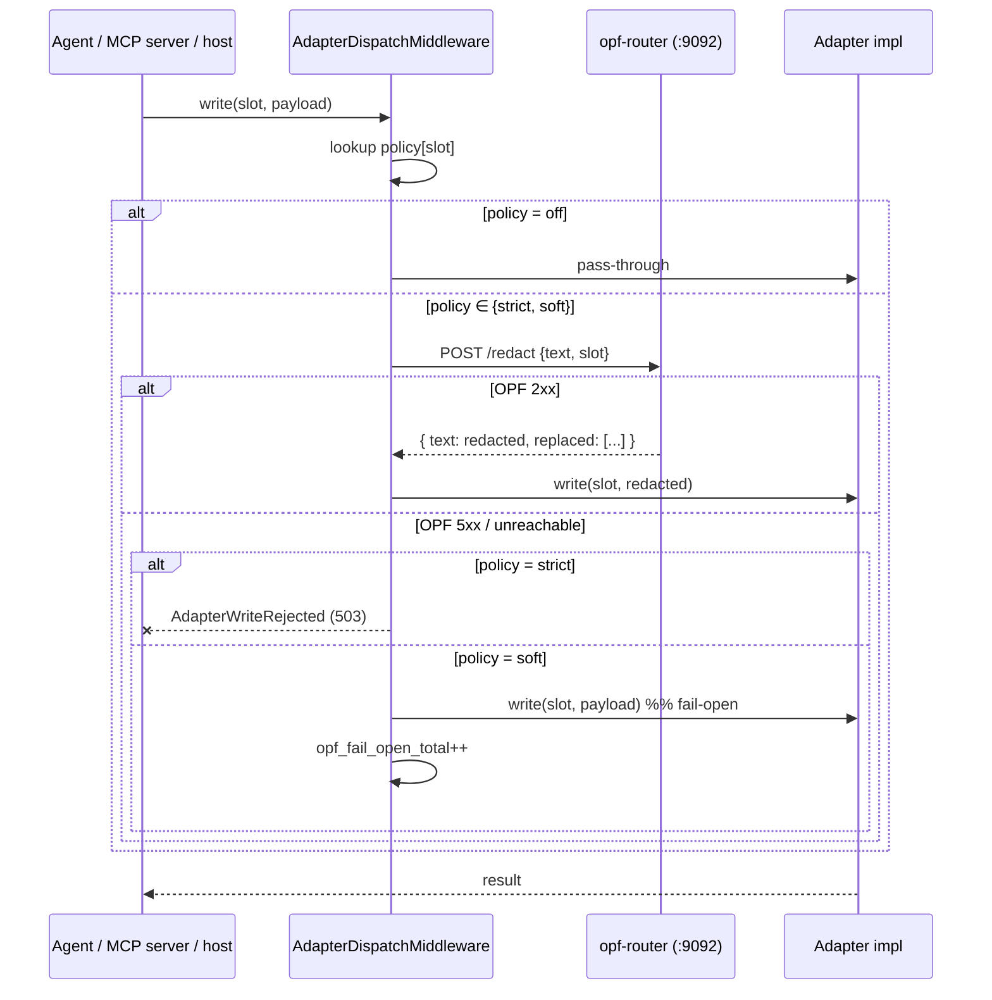

# ADR-008: Privacy filter routing layer

**Status:** Accepted
**Date:** 2026-04-24
**Author:** Agentbox team
**Supersedes:** n/a
**Related:** ADR-005 (Pluggable adapter architecture), ADR-007 (Runtime contract and container hardening), PRD-001 (Capabilities and adapters)

## TL;DR for newcomers
*Skip if you already know why PII redaction belongs in middleware, not per-adapter.*

This ADR explains how agentbox redacts personal data and secrets from inbound prompts, outbound model output, and durable adapter writes. The pain point is that PII can enter on three different paths — host-forwarded prompts, LLM responses, and direct persistence into beads/pods/memory/events/orchestrator — and naive fixes either scatter redaction across every adapter (drift, forgotten call sites) or gate it inside the LLM client (misses durable writes that never touch an LLM). The shape of the answer is a **cross-cutting middleware hook plus a stateless local sidecar** (`opf-router`) running OpenAI's privacy-filter model, sitting alongside the ADR-005 observability layer in the adapter dispatch path. You will learn the policy model, the sidecar contract, and the manifest surface.

**If you remember only one thing:** redaction is a dispatch-path middleware, not a per-adapter responsibility.

For the deep version, keep reading.

## Context

Agentbox handles three kinds of text that may contain personally identifiable information (PII) or secrets:

1. **Inbound prompts** — when `federation.mode="client"`, prompts arrive from a host orchestrator and may contain user data that the host's sanitisation missed.
2. **Outbound model output** — LLM responses can leak data the model memorised, and can surface private data the user asked about.
3. **Durable adapter writes** — anything persisted via the five ADR-005 slots (beads, pods, memory, events, orchestrator). Memory writes are particularly hazardous because embeddings encode PII into a representation that is hard to retract.

Upstream, OpenAI released [`openai/privacy-filter`](https://huggingface.co/openai/privacy-filter) on 2026-04-22: a 1.5B MoE token-classification model (50M active, BIOES tagging over eight entity classes, Apache-2.0). Run locally, it labels PII spans with F1 ≈ 96% on PII-Masking-300k.

Two naive integrations were considered and rejected:

- **Add a redaction call inside every adapter.** Each adapter class implements its own call site, everybody forgets a path eventually, and behaviour drifts between local-* and external implementations. This violates the ADR-005 contract that requires behavioural equivalence.
- **Gate redaction inside the LLM provider clients.** Misses durable writes entirely — an agent that records a user brief straight to the pod adapter never touches an LLM client.

The correct shape is cross-cutting middleware. The adapter dispatch path already has one such layer (observability, ADR-005 §Observability). Privacy redaction is a second.

## Decision

We add a local redaction sidecar, `opf-router`, and a middleware hook that intercepts every adapter dispatch and the inbound/outbound prompt path before the adapter-specific logic runs. The middleware consults a per-slot policy; the sidecar is stateless.

### Manifest contract

```toml
[privacy_filter]
enabled = false              # master gate
mode    = "off"              # off | local-gpu | local-cpu
port    = 9092               # loopback-only
dtype   = "bf16"             # bf16 | f32 | q4 (q4 is CPU-only)
model   = "openai/privacy-filter"

[privacy_filter.policy]
pods         = "strict"      # strict | soft | off
memory       = "strict"
events       = "soft"
beads        = "soft"
orchestrator = "off"
inbound      = "soft"
outbound     = "soft"

[privacy_filter.entities]
enabled = []                 # empty = all eight classes
```

### Gating at build time

The wizard (`scripts/start-agentbox.sh`) only offers the feature when the host can realistically run the sidecar:

- **GPU available** (`nvidia-smi` or `rocm-smi` resolves) — `local-gpu` path offered by default.
- **CPU-only fallback** — offered iff `nproc ≥ 4` **and** `/proc/meminfo MemAvailable ≥ 6 GB`. The MoE loads all 128 experts (~3 GB BF16) even though only top-4 fire per token, so the floor is memory, not cores.

Below both thresholds the wizard hard-disables the feature. Enabling via manual manifest edit still works; the validator defers the runtime-capability check to supervisor startup (the sidecar emits `model_load_failed` and `/health` returns `unavailable` — `strict` policies then fail-closed).

### Validator rules

| Code | Condition |
|------|-----------|
| **E022** | `privacy_filter.enabled=true` requires `mode ∈ {local-gpu, local-cpu}` (not `off`). |
| **E023** | `mode="local-gpu"` requires `gpu.backend != "none"`. |
| **E024** | `dtype="q4"` requires `mode="local-cpu"` (transformers.js q4 is not applicable to the server path). |
| **E025** | `privacy_filter.port` must not collide with `observability.metrics_port` or any reserved port (5901, 8080, 8484, 9090). |

### Routing layer

The sidecar runs on `127.0.0.1:9092` (default), loopback-only. Every adapter dispatch hook consults the configured policy and, if non-`off`, calls `POST /redact` before the write hits the adapter's local-or-external implementation.



### Fail-mode semantics

| Policy | Router healthy | Router unreachable / 5xx |
|--------|----------------|--------------------------|
| `strict` | redact, then write | **reject write** (503), counter `opf_fail_closed_total++` |
| `soft`   | redact, then write | write original payload, counter `opf_fail_open_total++`, log at `warn` |
| `off`    | pass-through | pass-through (router call skipped entirely) |

`strict` is correct for `pods` and `memory`: they're durable and hard to retract. `soft` is correct for `events` and `beads` where structural integrity matters more than literal content — a delayed redaction beats losing the audit trail. `orchestrator` is `off` by default because it carries internal control-plane messages with no user text.

### Observability

The sidecar emits its own Prometheus text on `/metrics` (same port, 9092). The middleware on the management-api side emits:

- `opf_requests_total{slot, op}` — counter
- `opf_redactions_total{slot, entity}` — counter (per-entity hits)
- `opf_latency_ms_sum{slot, op}` + `opf_latency_ms_count{slot, op}` — cumulative for average
- `opf_fail_closed_total{slot}` — strict-mode rejections
- `opf_fail_open_total{slot}` — soft-mode bypass events

Spans are named `agentbox.privacy_filter.<op>` and attach `policy`, `slot`, `entity_hits`, `redacted_bytes`. Same OTLP pipeline as every other adapter span.

### Security posture

The sidecar adds no new capability. It runs as the same non-root `1000:1000` user, reads model weights from `/workspace/.cache/huggingface` (read-write cache, already writable under the hardened baseline), and binds only to loopback. No `[security.exceptions.privacy-filter]` block is required.

## Consequences

### Positive

- **Single cross-cutting point.** Every adapter and the inbound/outbound prompt path go through the same middleware; no per-impl drift.
- **Local-only by construction.** Model weights live in the image; inference is loopback. No data leaves the container for redaction.
- **Policy per slot, not per call.** Operators tune one knob per durable surface; agents write naturally.
- **Behaviourally equivalent across adapter impls.** `local-sqlite` and `external` beads writes both pass through the same redaction path before they hit the slot-specific code.
- **Graceful when disabled.** `enabled=false` short-circuits every hook; the system behaves exactly as it does today.

### Negative

- **Resident memory footprint.** ~3 GB BF16 weights stay in RAM even under `local-cpu`. Operators below the CPU floor cannot use the feature without GPU.
- **Latency tax on every durable write.** Typical `/redact` is <20 ms on GPU and 40-100 ms on a 4-core CPU for prompts up to a few hundred tokens. Within the ADR-005 §SLO budgets, but consumed.
- **Model warm-up.** First request after container start has a one-off load cost (~5 s on GPU, ~15 s on CPU). Mitigated by hitting `/health` during the bootstrap seal.
- **Model drift.** Upstream may ship improved weights; pinning is by HF hash in the manifest's `model` field, but operators who leave the default will silently pick up revisions. Mitigation: lock the weights in CI once per release cycle.

## Alternatives considered

**Per-adapter redaction call** — rejected above. Drift and missed-path risk.

**Regex + blocklist redaction** — faster, zero-dependency, but precision/recall on addresses, dates, and private identifiers is poor. The published F1 ≈ 96% justifies the model cost; regex rules sit around 70-80% on the same benchmark.

**External redaction service** — possible (swap the sidecar for an HTTP call to the host mesh) but violates the ADR-005 principle that standalone mode ships a complete product. The middleware contract allows this upgrade path without code change: set `privacy_filter.mode="off"` in the sidecar and route `OPF_ENDPOINT` at a host URL. Documented for later, not done now.

**Let each LLM provider do it** — covers only outbound prompt/response, misses durable writes entirely.

## Follow-ups (non-blocking)

- Contract test harness addition: `tests/contract/privacy-filter.contract.spec.js` that asserts strict/soft/off semantics against the five adapter slots using a stub router.
- Runtime capability check at supervisor start: if `enabled=true` and CPU memory < 6 GB, log `W026` and force all policies to `off` to prevent thrashing.
- Benchmark matrix in `docs/user/privacy-filter.md`: latency vs prompt size on `{local-gpu, local-cpu/bf16, local-cpu/q4}` × {128, 1024, 8192 tokens}.
- Federation upgrade path: document how to point `OPF_ENDPOINT` at a host-provided redaction service when `federation.mode="client"`.

## Related files

- `agentbox.toml` — `[privacy_filter]` section
- `schema/agentbox.toml.schema.json` — validation schema
- `scripts/agentbox-config-validate.js` — E022-E025
- `scripts/start-agentbox.sh` — `section_privacy_filter`
- `scripts/opf-router.py` — sidecar implementation
- `flake.nix` — `privacyFilterPythonEnv`, `[program:opf-router]` supervisor block
- `docs/reference/adr/ADR-005-pluggable-adapter-architecture.md` — adapter dispatch contract
