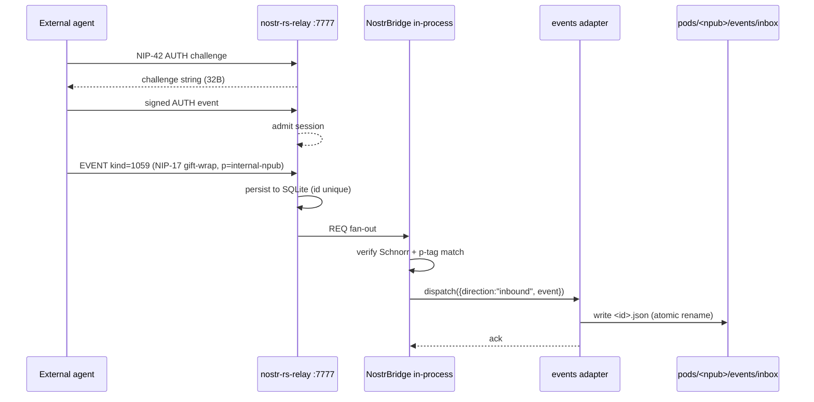
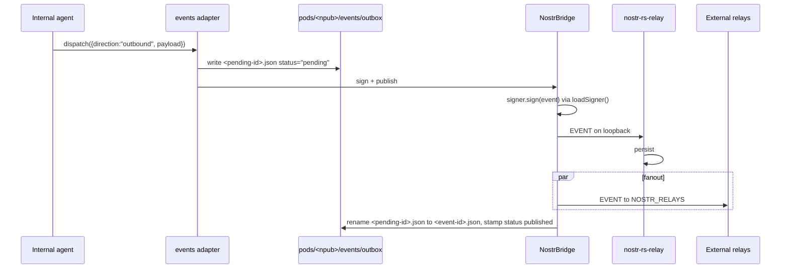

# ADR-009: Embedded Nostr relay and pod-inbox bridge

**Status:** Accepted
**Date:** 2026-04-24
**Author:** Agentbox team
**Supersedes:** n/a
**Related:** [ADR-005](ADR-005-pluggable-adapter-architecture.md) (Pluggable adapter architecture), [ADR-007](ADR-007-runtime-contract-and-container-hardening.md) (Runtime contract and container hardening), [PRD-004](../prd/PRD-004-external-agent-messaging.md) (External agent messaging), [DDD-003](../ddd/DDD-003-sovereign-messaging-domain.md) (Sovereign messaging domain)

## TL;DR for newcomers
*Skip if you already know how Nostr relays, NIP-17 sealed DMs, and agentbox sovereign pods fit together.*

Agentbox currently ships a one-way Nostr client: it reads public relays, but external agents cannot reliably reach internal agents, the `pods/<npub>/events/{inbox,outbox}/` directories are inert scaffolding, and a two-agentbox mesh has to trust a third-party relay as broker. The shape of the answer is an **embedded Rust Nostr relay** (`nostr-rs-relay` 0.9.0, Apache-2.0, already in nixpkgs) bound to loopback by default, with a **bridge that persists every signature-verified inbound event to the pod inbox and every internal agent send to the pod outbox**. You will learn the component layout, the manifest contract, the validator rules, the SLO floor, and the contract-test merge gate.

**If you remember only one thing:** the pod is the inbox; the relay is how the envelope gets there.

For the deep version, keep reading.

## Context

`mcp/servers/nostr-bridge.js` connects outbound to a comma-separated `NOSTR_RELAYS` list and subscribes to kinds 27235 / 30000-30001 / 30078. `scripts/sovereign-bootstrap.py` generates a secp256k1 keypair per container, bech32-encodes the `npub`/`nsec`, and creates `pods/<npub>/events/inbox/` + `pods/<npub>/events/outbox/`. Three gaps make this insufficient as a product surface:

1. **No inbound addressing.** External agents publish to a public relay and hope the bridge's subscription catches it. There is no delivery guarantee, no authentication challenge, no per-recipient filter, and no durable acknowledgement.
2. **Inert pod scaffolding.** Nothing writes to `events/inbox` or `events/outbox`. The directories exist but carry no causal meaning — violating ADR-005's principle that standalone mode ships a complete product rather than a demo.
3. **No local broker for two-agentbox mesh.** With no embedded relay, a pair of agentboxes on the same host must round-trip through a public relay for every exchange. That breaks the "local fallbacks make standalone mode a real product" commitment of ADR-005.

The client-side code is correct as far as it goes. What is missing is an ingress component and a durable binding from relay events to pod state.

## Decision

We embed `nostr-rs-relay` as a supervisord-managed program, add a bridge subscription that mirrors signature-verified events to the pod inbox, add an outbox publisher that signs and republishes internal-agent events, and wire NIP-42 AUTH as the default ingress control. All components are manifest-gated through a new `[sovereign_mesh.relay]` block and cohabit the ADR-005 adapter dispatch path through the `events` slot.

### Components

| Component | Path | Role |
|-----------|------|------|
| `nostr-rs-relay` | Nix-pinned binary under `/nix/store/...` | WebSocket ingress/egress, SQLite persistence, NIP-11/42 |
| `[program:nostr-relay]` | `flake.nix` conditional block | Supervisor entry gated on `sovereign_mesh.relay.enabled` |
| Bridge inbound handler | new module under `mcp/nostr-bridge/` | REQ against embedded relay; verify signature; write `pods/<npub>/events/inbox/<id>.json` |
| Outbox publisher | same module | Drain `pods/<npub>/events/outbox/*.pending`; sign via existing `loadSigner()`; publish to loopback + configured external fanout |
| NIP-42 challenge | bridge + relay | 32-byte `crypto.randomBytes` challenge, 60 s expiry, enforced when `ingress_policy != "open"` |

### Manifest contract

New section consumed by `flake.nix` and the validator. Schema, field names, and defaults copy [PRD-004 §6](../prd/PRD-004-external-agent-messaging.md#6-manifest-model) verbatim:

```toml
[sovereign_mesh.relay]
enabled          = false
implementation   = "nostr-rs-relay"   # nostr-rs-relay | rnostr | external | off
port             = 7777
bind             = "127.0.0.1"
expose           = false
data_dir         = "/var/lib/nostr-relay"
ingress_policy   = "allowlist"        # allowlist | signed-only | open
allowed_pubkeys  = []
allowed_kinds    = [1, 1059, 30078, 27235, 31400, 31401, 31402, 31403, 31404, 31405, 38000, 38100]
pod_bridge       = true
external_fanout  = "bidirectional"    # bidirectional | publish-only | subscribe-only | off
max_event_bytes  = 131072
messages_per_sec = 5
retention_days   = 30
allow_nip04      = false
info_description = "Agentbox sovereign relay"
info_contact     = ""
```

### Validator rules (from PRD-004 §6.2)

| Code | Condition |
|------|-----------|
| **E026** | `sovereign_mesh.relay.enabled = true` requires `sovereign_mesh.enabled = true` *or* `sovereign_mesh.solid_pod = true` |
| **E027** | `implementation = "external"` requires `federation.mode = "client"` and `federation.external_url` |
| **E028** | `implementation ∈ {nostr-rs-relay, rnostr}` requires `port` not in `RESERVED_PORTS` (5901/8080/8484/9090/9091) and `port ≠ privacy_filter.port` |
| **E029** | `bind = "0.0.0.0"` without `expose = true` is a wiring error |
| **W030** | `ingress_policy = "open"` raises a warning — always correctable, never silent |
| **E031** | `allow_nip04 = true` raises a warning (NIP-04 leaks metadata; prefer NIP-17) |

Every rule has a dedicated test case in `tests/config/validator.spec.js`; rule violations block `nix build .#runtime`.

### Routing

#### Inbound



#### Outbound



### Security posture

The relay inherits the ADR-007 §4a hardened baseline (`user: 1000:1000`, `read_only: true`, `cap_drop: [ALL]`, `no-new-privileges:true`). SQLite persistence requires one writable path, declared through the exception mechanism:

```toml
[security.exceptions.nostr-relay]
reason           = "nostr-rs-relay requires writable SQLite database and WAL"
writable_volumes = ["nostr-relay-data:/var/lib/nostr-relay"]
```

No `cap_add`. No `devices`. Loopback binding is the default; `expose = true` is confirmed in the wizard with explicit text and still rides through `no-new-privileges:true`. NIP-42 challenges use 32 bytes of `crypto.randomBytes`, expire after 60 s, and are single-use. Per-connection token buckets (`messages_per_sec`) bound CPU spent on signature verification.

### NIP support matrix (from PRD-004 §4.3)

| NIP | Required | Purpose |
|-----|----------|---------|
| NIP-01 | yes | Basic protocol |
| NIP-11 | yes | Relay information document (HTTP GET /) |
| NIP-42 | yes | AUTH (mandatory when `ingress_policy != "open"`) |
| NIP-04 | configurable | Legacy DMs, off by default |
| NIP-17 | yes (read) | Sealed DMs; bridge decrypts for pod write |
| NIP-40 | yes | Expiration tag honoured for TTL |
| NIP-50 | no | Full-text search — not offered by nostr-rs-relay |

### Invariants (testable predicates)

1. **Pod/relay mirror.** For every row `(id, pubkey, kind)` in `nostr-relay`'s SQLite whose `p` tag matches a local npub and whose `kind ∈ allowed_kinds`, there exists a file `pods/<npub>/events/inbox/<id>.json` with matching payload. Checked by `relay.contract.spec.js::mirror-inbound`.
2. **Outbox closure.** Every file in `pods/<npub>/events/outbox/` with `status="published"` has a matching row in relay SQLite; every file with `status="pending"` is either unpublished or its publish attempt is in flight within the last `retry_backoff_max`. Checked by `relay.contract.spec.js::outbox-closure`.
3. **Signature before storage.** No pod file exists unless its source event passed `verifyEvent` (Schnorr, constant-time). Enforced by the bridge unit test `bridge.spec.js::no-unsigned-write`.
4. **AUTH before write.** When `ingress_policy ∈ {allowlist, signed-only}`, no EVENT command from an un-authed session appears in SQLite. Asserted by `relay.contract.spec.js::auth-required`.
5. **Idempotent replay.** Re-submitting an outbox-pending event after a crash produces the same event id and is rejected by relay uniqueness; no duplicate pod file. Asserted by `relay.contract.spec.js::at-least-once-idempotent`.

### Failure-mode recovery (from PRD-004 §3.4)

- **NIP-42 AUTH timeout** — relay closes after 30 s, emits `agentbox_relay_auth_fail_total{reason="challenge-timeout"}`. Detection: metric watch. Recovery: external client retries; no internal action.
- **Invalid Schnorr signature** — relay drops before persistence; bridge never observes. Detection: `agentbox_relay_sig_fail_total` spike. Recovery: none needed; attacker cost only.
- **`p` tag does not match local npub** — relay stores (other subscribers may read) but bridge declines pod write. Detection: `agentbox_pod_write_total{outcome="skipped",reason="p-tag-miss"}`. Recovery: none; expected path.
- **Pod write fails (disk / permission)** — bridge logs `error`, emits `agentbox_pod_write_fail_total{reason}`; event remains in relay SQLite as retriable source. Detection: alert on `pod_write_fail_total > 0` for 5 min. Recovery: fix mount; replay handled by the next bridge sweep, which compares relay rows against inbox files and backfills.
- **Outbound publish fails to all relays** — outbox entry stays `status="pending"` with exponential backoff. Detection: `/health/relay` reports `outbox_pending`. Recovery: automatic on connectivity return; manual via `./agentbox.sh relay flush`.
- **Bridge crash between sign and publish** — on restart, the outbox sweep re-signs and republishes; relay uniqueness rejects duplicates, the outbox file is renamed to the true event id. Guarantee: **at-least-once with idempotent deduplication by event id**.

## Consequences

### Positive

| Effect | Mechanism |
|--------|-----------|
| Standalone mesh functions without public relays | Loopback relay is the default broker |
| Pod directories become real mailboxes | Bridge write is on every verified inbound |
| No new container capabilities | Only a writable volume via ADR-007 §4a exception |
| Reproducible build | Binary is `nostr-rs-relay` 0.9.0 from nixpkgs; no custom fork |
| ADR-005 adapter contract stays honest | Relay attaches through the existing `events` slot — no parallel dispatch path |
| Auditable ingress | NIP-42 AUTH plus `allowed_pubkeys`; every decision traced |

### Negative

| Effect | Bound / mitigation |
|--------|--------------------|
| SQLite disk growth | `retention_days` default 30 + `max_event_bytes` 131072; prune sweep SLO 5 min / 100k rows |
| Retention sweep cost | Runs off-peak; metric `agentbox_relay_retention_pruned_total` observed; sweep is a single `DELETE WHERE created_at < ...` on an indexed column |
| Attack surface when `expose = true` | Opt-in, wizard-confirmed, rate-limited; `no-new-privileges:true` kept |
| Mesh gossip amplification | `external_fanout = "off"` is the standalone default; `bidirectional` is documented as federated-only |
| At-least-once on outbox | Relay uniqueness constraint on event id plus bridge rename-on-success deduplicates pod files |
| Bridge failure takes down one inbound path | Bridge is in-process with management-api (sovereign-mesh.md §Architecture); its health is already reported and retried; no new single point |

## Alternatives considered

**Keep client-only (no relay).** Rejected: fails the standalone self-sufficiency principle from ADR-005, leaves the inbox/outbox scaffolding inert, and forces every two-agentbox exchange through a third party.

**`rnostr` as default.** Rejected: LMDB gives fine-grained locking and NIP-50 full-text search, but (a) NIP-50 is not in our required matrix, (b) nostr-rs-relay matches ADR-002's SQLite pattern, (c) nixpkgs coverage is smaller. `rnostr` remains available as a manifest option for operators who need search.

**Separate container / compose service.** Rejected: loses the single-manifest gating story, adds pod-bridge IPC cost on the hot path, and fragments retention ownership — the relay's SQLite and the pod filesystem need co-lifecycle for backup/restore to be coherent.

**Nostr-over-HTTP bridge only.** Rejected: loses NIP-42 AUTH semantics, makes the publish/subscribe surface asymmetric (HTTP in, WebSocket out), and forces us to reinvent envelope framing.

**Custom minimal relay in Rust.** Rejected: reinvents NIP-11/NIP-42 for no gain, introduces a fresh maintenance burden, and drops us off the upstream security bulletin path.

## Service-level objectives

Measured at p95 over a 7-day window under the same OTLP pipeline as every other adapter span. Contract tests parameterise over `{nostr-rs-relay, external, off}`.

| Operation | p95 latency | Throughput floor | Error ceiling | Test name |
|-----------|-------------|------------------|---------------|-----------|
| Accept valid signed EVENT (loopback) | 15 ms | 200 events/s | 0.1 % | `relay.contract.spec.js::accept-event-p95` |
| NIP-42 AUTH handshake | 80 ms | 50 handshakes/s | 0.5 % | `relay.contract.spec.js::auth-handshake-p95` |
| Inbound event → pod inbox write | 150 ms | 100 events/s | 0.5 % | `relay.contract.spec.js::inbound-to-pod-p95` |
| Outbound publish → first-relay-ack | 250 ms | 50 events/s | 1 % | `relay.contract.spec.js::outbound-publish-p95` |
| Cold-start relay ready | 5 s | — | n/a | `relay.contract.spec.js::cold-start-ready` |
| Subscription REQ fan-out | 30 ms | 200 subs/s | 0.1 % | `relay.contract.spec.js::req-fanout-p95` |
| Retention prune sweep | 5 min / 100k rows | — | n/a | `relay.contract.spec.js::retention-sweep-sla` |

Missing any row blocks merge; the harness publishes a report referenced by the CI gate.

## Observability

Metrics (counters unless stated), spans, and health are the sole exports. Exporter endpoints remain optional, but the emission sites are mandatory.

| Metric | Type | Labels |
|--------|------|--------|
| `agentbox_relay_connections_active` | gauge | `state` (authed, pending) |
| `agentbox_relay_events_total` | counter | `direction`, `kind`, `outcome` |
| `agentbox_relay_auth_fail_total` | counter | `reason` |
| `agentbox_relay_sig_fail_total` | counter | — |
| `agentbox_pod_write_total` | counter | `direction`, `outcome` |
| `agentbox_pod_write_fail_total` | counter | `reason` |
| `agentbox_relay_db_bytes` | gauge | — |
| `agentbox_relay_retention_pruned_total` | counter | — |

Spans: `agentbox.relay.event.{accept,reject,persist,bridge}`, `agentbox.relay.auth.{challenge,verify}`. Health: `/health/relay` returns `{connections, db_bytes, last_event_at, outbox_pending, fanout_up}`; `./agentbox.sh health` exits non-zero if `outbox_pending > outbox_pending_ceiling` or the relay process is down.

## Contract versioning and wire format

The contract here is not a bespoke JSON schema — it is the Nostr protocol suite itself. NIP revisions therefore substitute for our usual `MAJOR.MINOR.PATCH` rule.

- **Minor/compatible NIP revisions** (new optional tag, new recommended relay behaviour) ride through without a manifest bump; the relay binary tracks upstream and the bridge tolerates unknown tags.
- **Breaking NIP shape changes** (tag rename, envelope-level difference) require pinning the relay to the last compatible nixpkgs revision and publishing a migration note in `CHANGELOG.md` before rolling the default forward. The bridge gates on `kinds` and `tags[0]`; any unknown structural layout at these points is logged and dropped, not silently coerced.
- **Contract-version field.** `GET /v1/meta` exposes `sovereign_mesh.relay.nips` as an array of supported NIP numbers; host orchestrators in `federation.mode = "client"` compare this with their registry during the ADR-005 handshake.

## Contract test harness (merge gate)

```
agentbox/tests/contract/
└── relay.contract.spec.js   # parameterised over nostr-rs-relay | external | off
```

CI runs the suite on every PR touching:

- `mcp/nostr-bridge/**`
- `flake.nix` (relay block, security exception)
- `schema/agentbox.toml.schema.json` (new section)
- `scripts/agentbox-config-validate.js` (E026-E031)

A red suite blocks merge. The `off` implementation asserts `AdapterDisabled` on all methods and that no relay socket is opened. The `external` implementation runs against a throwaway nostr-rs-relay started in the test harness on a unix socket to avoid port collision. Nightly, the harness also runs under `federation.mode = "standalone"` so a break in standalone mode cannot hide behind a green federated run.

## Follow-ups

- **NIP-17 full decryption path.** The initial landing decrypts inbound kind 1059 for pod writes; the reverse (sealing outbound DMs on behalf of internal agents) is deferred to the follow-up PR in PRD-004 §12 step 7.
- **Multi-npub-per-container.** The bootstrap currently issues one keypair per container; per-profile or per-role npubs are a capability extension, not a base feature. Design sketch in PRD-004 §11 Non-goals.
- **Relay clustering.** Two agentbox containers on the same host share no relay state today; gossiping their embedded relays via `external_fanout = "bidirectional"` is the current answer. Clustering with state replication (SQLite WAL ship or rnostr LMDB snapshot) is a later optimisation, not a correctness issue.

## Related files

- `agentbox.toml` — new `[sovereign_mesh.relay]` section
- `schema/agentbox.toml.schema.json` — schema for the new section
- `scripts/agentbox-config-validate.js` — E026-E031
- `scripts/start-agentbox.sh` — wizard block for the new section
- `flake.nix` — `[program:nostr-relay]` conditional, `[security.exceptions.nostr-relay]` emission, env injection
- `mcp/servers/nostr-bridge.js` — existing library (unchanged interface)
- `mcp/nostr-bridge/` — new module for inbound handler + outbox publisher
- `scripts/sovereign-bootstrap.py` — unchanged; pod directory layout it creates is now the mailbox contract
- `management-api/adapters/events/local-nostr.js` — new adapter impl for the `events` slot
- `tests/contract/relay.contract.spec.js` — merge-gate contract suite
- `docs/reference/prd/PRD-004-external-agent-messaging.md` — source PRD
- `docs/reference/ddd/DDD-003-sovereign-messaging-domain.md` — domain model
- `docs/developer/sovereign-mesh.md` — existing bridge reference
- `docs/user/nostr-relay.md` — operator guide (to be added in the sequencing step)
