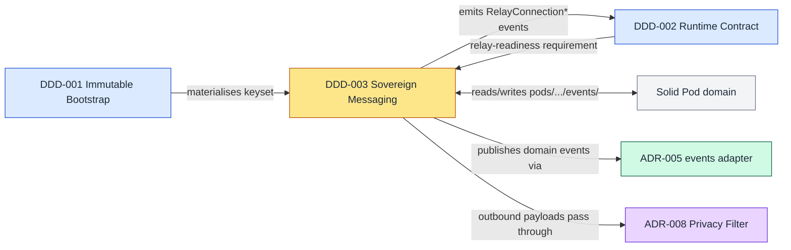

# DDD-003: Sovereign messaging domain

**Date**: 2026-04-24
**Status**: Accepted
**Bounded Context**: Sovereign Messaging
**Cross-references**: [PRD-004](../prd/PRD-004-external-agent-messaging.md) (product requirements), [ADR-009](../adr/ADR-009-embedded-nostr-relay.md) (decision record), [ADR-005](../adr/ADR-005-pluggable-adapter-architecture.md) (consumes the `events` adapter slot), [DDD-001](./DDD-001-immutable-bootstrap-domain.md) (identity material is materialised during bootstrap), [DDD-002](./DDD-002-runtime-contract-domain.md) (the relay endpoint is a Readiness Requirement)

---

## TL;DR for newcomers
*Skip if you already know the sovereign-messaging bounded context.*

This DDD captures the Sovereign Messaging bounded context: the part of the system that owns external↔internal Nostr traffic, persists every signed exchange to a pod mailbox, and guarantees that an agent identity never leaks its private key. The pain point is that the pre-existing `nostr-bridge` is a one-way outbound client with no durable receipts, no ingress policy, and no binding between `events/inbox` scaffolding and real deliveries. The shape of the answer is a domain with explicit aggregates (`AgentIdentity`, `PodMailbox`, `RelayEndpoint`, `InboundEnvelope`, `OutboundEnvelope`, `Subscription`), twelve numbered invariants that each map to a testable predicate, and a published language of domain events consumed by the `events` adapter slot.

**If you remember only one thing:** the pod is the inbox; the relay is how the envelope gets there; the nsec never crosses a process boundary.

For the deep version, keep reading.

## Bounded context

**Owns** (IN):

- Agent identity lifecycle (keypair generation, rotation, in-process signing).
- Mailbox state: inbox and outbox entries under `pods/<npub>/events/`.
- Relay endpoint configuration (implementation class, port, bind, policy).
- Ingress policy (allowlist / signed-only / open) and the pubkey allowlist itself.
- Inbound and outbound envelope aggregates, including status progression and retry history.
- Subscription registry mapping relay filters to in-process handlers.
- NIP-42 auth challenge issuance and verification.

**Does not own** (OUT):

- The Nostr wire protocol itself — framing, REQ/EVENT/CLOSE message shapes, NIP semantics (NIP-01, NIP-11, NIP-17, NIP-40, NIP-42). Delegated to `nostr-tools` and `nostr-rs-relay`.
- Pod on-disk file format, ACL, WebID, Solid-protocol conformance. Owned by the Solid Pod domain; this domain writes through a Pod Mailbox port and does not care how bytes reach disk beyond that port's contract.
- Transport of domain events to external consumers — that is the `events` adapter slot (ADR-005).
- Privacy filtering or redaction of outbound payloads — delegated to the Privacy Filter (ADR-008).
- Image-time relay packaging — that is the Immutable Bootstrap domain (DDD-001, class A or B capability).

## Ubiquitous language

| Term | Definition |
|---|---|
| **AgentIdentity** | The (npub, nsec, profile) triple that represents one agent's sovereign cryptographic identity. There is one per profile by default. |
| **SovereignKeyset** | The packaged material on disk: `nostr.key.enc` (AES-256-GCM ciphertext) plus `nostr.salt`. The keyset is the at-rest form; the `AgentIdentity` aggregate is its in-memory projection. |
| **NostrEventId** | 32-byte SHA-256 of the canonical serialisation of a Nostr event; used as the content-address of every inbox and outbox entry. |
| **Npub** | Bech32-encoded public key (prefix `npub1…`). Addressing lives in this form. |
| **Nsec** | Bech32-encoded private key (prefix `nsec1…`). Never serialised outside the `management-api` process boundary. |
| **RelayEndpoint** | The in-container Nostr WebSocket service (default `nostr-rs-relay` on `127.0.0.1:7777`) plus its NIP-11 descriptor. |
| **IngressPolicy** | The rule governing which signed EVENTs the relay will accept: `allowlist`, `signed-only`, or `open`. |
| **PodMailbox** | The inbox/outbox projection under `pods/<npub>/events/` that makes every accepted exchange durable. |
| **InboundEnvelope** | A signature-verified event addressed to a local npub, persisted to `events/inbox/<id>.json`. |
| **OutboundEnvelope** | An internally-generated payload that progresses from `pending` to `published` (or `failed`) through the bridge. |
| **Subscription** | A REQ filter plus an in-process handler registered by the bridge. One subscription per consumer; handlers must not block the read loop. |
| **AuthChallenge** | A 32-byte nonce issued by the relay during NIP-42 handshake, valid for 60 s. |

## Aggregates

### AgentIdentity (root of the identity sub-aggregate)

Owns the cryptographic material that represents one agent on the mesh.

```
AgentIdentity
  +-- npub: Npub
  +-- nsec_encrypted: path "/workspace/profiles/<stack>/nostr.key.enc"
  +-- profile: string                // stack name
  +-- pubkey_hex: string
  +-- created_at: ISO-8601
  +-- rotated_at: ISO-8601 | null
```

**Consistency boundary**: one `AgentIdentity` per profile. The aggregate is loaded by `loadSigner(stack)` at boot and held only inside the `management-api` process. Rotation replaces the whole aggregate atomically (new keyset written, old keyset archived under `profiles/<stack>/archive/`).

**Invariants**:

- nsec is never serialised outside the `management-api` process boundary (I05).
- `pubkey_hex` is the Schnorr-derived public key matching `npub` by bech32 decode.
- Single identity per profile unless explicitly multi-identity mode is enabled (non-default; out of PRD-004 scope beyond the gate).
- `rotated_at` is monotonically non-decreasing.

### PodMailbox (root of the storage sub-aggregate)

Projects every accepted envelope onto disk under the agent's sovereign pod.

```
PodMailbox
  +-- npub: Npub
  +-- inbox_entries: InboundEnvelope[]   // by NostrEventId
  +-- outbox_entries: OutboundEnvelope[] // by pending_id then by NostrEventId
```

**Consistency boundary**: one `PodMailbox` per local `AgentIdentity.npub`. All inbox writes are strongly consistent (fsync before ack). Outbox writes are strongly consistent on state transition; publish itself is eventually consistent (see §Consistency model).

**Invariants**:

- Every inbox entry has `signature_verified = true` before any bytes hit disk (I01).
- Inbox is content-addressed by `NostrEventId`; the same id MUST NOT appear twice (I08).
- Outbox entry status is drawn from `{pending, published, failed}` and advances monotonically (I09 timestamp sequence supports this).
- `recipient_npub` on every inbox entry matches a local `AgentIdentity.npub` (I10).

### RelayEndpoint

Represents the in-container Nostr relay process and its policy surface.

```
RelayEndpoint
  +-- implementation: "nostr-rs-relay" | "rnostr" | "external" | "off"
  +-- port: number                      // default 7777
  +-- bind: string                      // default "127.0.0.1"
  +-- expose: boolean
  +-- policy: IngressPolicy
  +-- allowed_pubkeys: Npub[]
  +-- allowed_kinds: number[]
  +-- info: { description, contact }    // NIP-11 projection
```

**Consistency boundary**: singleton per container. State transitions (policy update, allowlist mutation) are applied by the management-api and reflected in the relay's SQLite config on the next reconcile tick.

**Invariants**:

- `port` is not in the reserved set `{5901, 8080, 8484, 9090, 9091}` and does not collide with `privacy_filter.port` (I06 contract: manifest rule E028).
- `implementation = "off"` implies the supervisord-generated config has no `[program:nostr-relay]` block (I06).
- `bind = "0.0.0.0"` requires `expose = true` (manifest rule E029; domain-level invariant enforced at apply time).
- If `policy = "allowlist"` then acceptance requires `event.pubkey ∈ allowed_pubkeys` (I07).

### InboundEnvelope

Represents one signature-verified event addressed to a local agent.

```
InboundEnvelope
  +-- event_id: NostrEventId
  +-- signer_npub: Npub
  +-- recipient_npub: Npub
  +-- kind: number
  +-- received_at: ISO-8601
  +-- persisted_at: ISO-8601 | null
  +-- failure_reason: string | null
  +-- raw_event: object                  // the signed Nostr event
```

**Consistency boundary**: one aggregate per `(event_id, recipient_npub)` pair. Transitions are idempotent: replaying the same event id is a no-op once `persisted_at` is set.

**Invariants**:

- Schnorr verification passes (`verifyEvent(raw_event) = true`) before write (I01).
- Either `persisted_at > received_at` OR (`persisted_at = null` AND `failure_reason != null`) — no partial states.
- `recipient_npub` matches a local `AgentIdentity.npub` (I10).

### OutboundEnvelope

Represents an internally-generated payload progressing toward publication.

```
OutboundEnvelope
  +-- pending_id: string                 // uuid assigned at create
  +-- final_event_id: NostrEventId | null
  +-- payload: object                    // unsigned event template
  +-- status: "pending" | "published" | "failed"
  +-- attempts: Attempt[]                // [{ at, relay_url, outcome, reason }]
  +-- created_at: ISO-8601
  +-- published_at: ISO-8601 | null
```

**Consistency boundary**: one aggregate per `pending_id`. `final_event_id` is assigned exactly once (at first successful Schnorr signature application) and never mutated. On restart, any entry with `status = "pending"` is republished; the relay's `(id, pubkey)` uniqueness constraint keeps this idempotent.

**Invariants**:

- `status = "published"` iff `final_event_id is not null` (I02, I03).
- `status` advances monotonically across the DAG `pending → published` and `pending → failed`. No `published → pending` backflow (I09 implied).
- `attempts` is a strictly increasing sequence of timestamps (I09).
- After `AgentKeyRotated`, no prior signature in `attempts[].raw_signed_event` may be reused for relay replay (I12).

### Subscription

Represents one REQ filter registered by the bridge against the relay.

```
Subscription
  +-- id: string                         // "sub-<counter>"
  +-- filter: { kinds?, authors?, since?, until?, "#p"? }
  +-- consumer: string                   // handler identifier
  +-- created_at: ISO-8601
```

**Consistency boundary**: one aggregate per `id`. Subscriptions are transient — they do not survive process restart and must be re-registered on boot.

**Invariants**:

- The handler attached to every subscription MUST NOT perform synchronous network I/O or any blocking call on the relay read loop (I04).
- Handler errors are caught and logged; they MUST NOT propagate and crash the bridge (see `nostr-bridge.js:_handleRelayMessage`).

## Domain events

Every event carries `{ ts, correlation_id }` in addition to the fields below. The idempotency key is the value consumers use to deduplicate.

| Event | Emitted when | Handled by | Idempotency key |
|---|---|---|---|
| `InboundMessageAccepted` | Signed EVENT passes signature + policy check at the relay | Bridge ingress handler | `event_id` |
| `InboundMessageRejected` | Signed EVENT fails signature, policy, or kind allowlist | Metrics + audit log | `event_id + reject_reason` |
| `PodInboxWritten` | `InboundEnvelope` successfully fsync'd under `events/inbox/<id>.json` | Solid Pod read models | `event_id` |
| `OutboundMessageQueued` | Internal agent calls `events.dispatch({direction:"outbound", ...})` | Bridge publisher + outbox persister | `pending_id` |
| `OutboundMessagePublished` | First relay acknowledges the signed EVENT and outbox status flips to `published` | Pod outbox writer | `final_event_id` |
| `OutboundMessageFailed` | All retries exhausted and outbox status flips to `failed` | Ops alert, `/health/relay` | `pending_id + last_attempt_ts` |
| `RelayConnectionEstablished` | WebSocket to a configured relay reaches `OPEN` | Readiness aggregator (DDD-002) | `relay_url + established_at` |
| `RelayConnectionLost` | WebSocket transitions to `CLOSED` or `ERROR` | Readiness aggregator, reconnect scheduler | `relay_url + lost_at` |
| `AuthChallengeIssued` | Relay emits a NIP-42 AUTH challenge string | Rate-limit tracker | `challenge_nonce` |
| `AuthChallengeVerified` | Client responds with a valid signed AUTH event within 60 s | Session admit | `challenge_nonce` |
| `RetentionPruneCompleted` | Scheduled sweep removes expired rows under NIP-40 / retention_days | Metrics | `prune_run_id` |
| `AgentKeyRotated` | Operator invokes `RotateAgentKey`; new keyset written; old archived | PodMailbox invalidator, Subscription re-registrar | `new_npub + rotated_at` |

## Commands

Every command runs inside the `management-api` process. Preconditions are validated before any state mutation; postconditions are the observable result on success.

| Command | Precondition | Postcondition |
|---|---|---|
| `PublishAgentEvent(payload, signerStack)` | `AgentIdentity` for `signerStack` loaded; relay reachable OR outbox durable | `OutboundEnvelope{status:pending}` persisted; `OutboundMessageQueued` emitted; on ack, `status` advances to `published` and `final_event_id` is set |
| `AckInboundMessage(event_id)` | `InboundEnvelope{event_id}` exists with `persisted_at != null` | Idempotent; `agentbox_pod_write_total{outcome="ack"}` incremented |
| `RotateAgentKey(stack)` | Operator authenticated on `management-api`; no inflight outbound for that npub | Old keyset archived; new `AgentIdentity` loaded; `AgentKeyRotated` emitted; all prior outbox signatures are tombstoned against replay |
| `PruneInboxTTL(npub)` | `retention_days` configured; current time ≥ oldest eligible row | Expired inbox entries deleted; `RetentionPruneCompleted` emitted |
| `RegisterAllowedPubkey(npub)` | `policy = "allowlist"`; operator authenticated | `RelayEndpoint.allowed_pubkeys` includes `npub`; relay config reconciled within one tick |
| `RevokeAllowedPubkey(npub)` | `npub ∈ allowed_pubkeys` | `npub` removed; existing sessions from that pubkey closed on next keepalive |
| `RetryFailedOutbound(pending_id)` | `OutboundEnvelope.status = "failed"` and `failure_reason ∉ TERMINAL_SET` | Status reset to `pending`; one new `Attempt` appended; `OutboundMessageQueued` re-emitted |
| `UpdateIngressPolicy(newPolicy)` | `newPolicy ∈ {allowlist, signed-only, open}` | `RelayEndpoint.policy` updated; NIP-11 descriptor regenerated; `W030` audit entry if `open` |

## Invariants — testable predicates

Each predicate maps to at least one unit or contract test under `tests/contract/` or `tests/unit/`.

- **I01**: ∀ e ∈ pod.inbox ⇒ `verifyEvent(e.raw_event) = true` AND `e.signature_verified = true`.
- **I02**: `OutboundEnvelope.status = "published"` ⇒ `OutboundEnvelope.final_event_id ≠ null`.
- **I03**: `OutboundEnvelope.status = "pending"` ⇒ `OutboundEnvelope.final_event_id = null`.
- **I04**: ∀ sub ∈ subscriptions ⇒ `sub.handler` performs no synchronous network I/O and no blocking call on the relay read loop.
- **I05**: `AgentIdentity.nsec` is never serialised outside the `management-api` process (no log line, no IPC frame, no event payload contains nsec bytes).
- **I06**: `RelayEndpoint.implementation = "off"` ⇒ the supervisord-rendered config has no `[program:nostr-relay]` block AND no process binds `RelayEndpoint.port`.
- **I07**: `IngressPolicy = "allowlist"` ⇒ accept(event) requires `event.pubkey ∈ RelayEndpoint.allowed_pubkeys`.
- **I08**: `PodMailbox.inbox` is content-addressed by `NostrEventId`; no two distinct entries share the same `event_id`.
- **I09**: `OutboundEnvelope.attempts` forms a strictly increasing sequence of timestamps (`∀ i ≥ 1: attempts[i].at > attempts[i-1].at`).
- **I10**: `∀ e ∈ PodMailbox.inbox ⇒ e.recipient_npub ∈ { id.npub : id ∈ local AgentIdentities }`.
- **I11**: `RetentionPrune` removes row r iff `r.created_at + retention_days < now()` AND (`r.nip40_expiration = null` OR `r.nip40_expiration < now()`).
- **I12**: `AgentKeyRotated` invalidates every prior `OutboundEnvelope.attempts[].raw_signed_event` for replay purposes; attempting to re-publish any such signed blob yields `InboundMessageRejected{reason:"stale-key"}`.

## Anti-corruption layer

The ACL that isolates this domain from `nostr-rs-relay`'s wire model lives under `mcp/nostr-bridge/`:

| Translation | Domain side | Wire side | Where |
|---|---|---|---|
| Accept → Envelope | `InboundEnvelope{event_id, signer_npub, recipient_npub, kind, received_at, raw_event}` | `["EVENT", subId, {id, pubkey, created_at, kind, tags, content, sig}]` | `mcp/nostr-bridge/ingress.js` (new) |
| Envelope → Publish | `OutboundEnvelope{payload, status, ...}` | `["EVENT", signedEvent]` | `mcp/servers/nostr-bridge.js:publish()` |
| Policy → NIP-11 | `{description, contact, allowed_kinds, policy}` | `GET /` → JSON body per NIP-11 | `management-api/routes/relay-info.js` (new) |
| Auth challenge | `AuthChallenge{nonce, issued_at}` | `["AUTH", challenge_string]` / `["EVENT", signedAuth]` | `mcp/nostr-bridge/auth.js` (new) |
| Subscription | `Subscription{id, filter, consumer}` | `["REQ", subId, filter]` / `["CLOSE", subId]` | `mcp/servers/nostr-bridge.js:subscribe()` |

The domain code MUST NOT import `ws` or `nostr-tools` outside this layer. Every domain aggregate speaks only in typed value objects; the ACL performs the bidirectional mapping.

## Context map



Relationship summary:

- **Immutable Bootstrap → Sovereign Messaging**: supplies the `SovereignKeyset` at boot; the identity is loaded by `loadSigner()` on first use.
- **Sovereign Messaging → Runtime Contract**: emits `RelayConnectionEstablished` / `RelayConnectionLost`; DDD-002 consumes these to resolve the `relay:<url>` `ReadinessRequirement` when `sovereign_mesh.enabled AND publish_agent_events`.
- **Sovereign Messaging ↔ Solid Pod**: partnership through the `PodMailbox` port; domain knows only `write(npub, direction, envelope)` / `read(npub, direction, id)`.
- **Sovereign Messaging → events adapter (ADR-005)**: every domain event is dispatched through the `events` slot so external orchestrators see messaging activity on the same bus as other agent lifecycle events.
- **Privacy Filter ↔ Sovereign Messaging**: outbound payloads traverse the filter before signing. This domain exposes a pre-sign hook; the filter owns redaction policy.

## Repository mapping

| Aggregate | Primary file(s) | Status |
|---|---|---|
| `AgentIdentity` | `scripts/sovereign-bootstrap.py` (keyset writer); `mcp/servers/nostr-bridge.js:loadSigner()` (reader) | implemented |
| `PodMailbox` | `mcp/nostr-bridge/pod-writer.js` (new, per PRD-004 §12 step 3) | to build |
| `RelayEndpoint` | `flake.nix` `[program:nostr-relay]` block (gated by `sovereign_mesh.relay.enabled`) + `config/nostr-relay.toml.tpl` (new) | to build |
| `InboundEnvelope` | `mcp/nostr-bridge/ingress.js` (new); consumed by `pod-writer.js` | to build |
| `OutboundEnvelope` | `mcp/servers/nostr-bridge.js:publish()` extended with outbox persistence; `mcp/nostr-bridge/outbox.js` (new) | partial |
| `Subscription` | `mcp/servers/nostr-bridge.js:subscribe()` | implemented |
| ACL — auth | `mcp/nostr-bridge/auth.js` (new, NIP-42 handshake) | to build |
| Domain events dispatch | `management-api/adapters/events/*.js` | implemented (slot) |
| Contract test harness | `tests/contract/relay.contract.spec.js` (new) | to build |

## Consistency model

- **Strong consistency — pod inbox writes**: `InboundEnvelope` is fsync'd under `events/inbox/<id>.json` before `InboundMessageAccepted` is acknowledged to the sender. A crash between verify and fsync surfaces on restart as a retriable event from the relay SQLite (the relay holds the authoritative copy until the pod write succeeds).
- **Strong consistency — outbox state transitions**: `OutboundEnvelope.status` transitions are persisted atomically before `OutboundMessagePublished` or `OutboundMessageFailed` fire. No consumer sees a transition that isn't durable.
- **Eventual consistency — external relay fan-out**: when `external_fanout = "bidirectional"` or `"publish-only"`, push to external relays is retried with exponential backoff (base 1 s, max 60 s, factor 2, jitter ≤ 500 ms per `nostr-bridge.js`). The outbox is the source of truth; a missed external relay does not block local outbox progression once the embedded relay has acked.
- **TTL cleanup**: `RetentionPrune` runs on a fixed schedule (default daily). Deletion is idempotent and safe to re-run; predicate I11 pins the rule.

## Failure models

### AgentIdentity

| Failure | Behaviour | Recovery |
|---|---|---|
| `nostr.key.enc` missing or corrupt | `loadSigner()` throws; management-api boot fails; `BootstrapFailed` emitted | Operator rotates via `RotateAgentKey` (writes a fresh keyset) or restores from backup; DDD-001 bootstrap probe fails fast |
| `MANAGEMENT_API_KEY` absent | `loadSigner()` throws with an actionable message | Entrypoint re-seeds per ADR-007 security profile |
| Concurrent mutation during rotation | Second writer blocked by file lock on `nostr.key.enc` | The loser retries after current rotation completes |

### PodMailbox

| Failure | Behaviour | Recovery |
|---|---|---|
| Disk full on `pods/<npub>/events/inbox/` | `InboundMessageRejected{reason:"pod-write-fail"}` emitted; relay SQLite retains the event | Free disk; on next `InboundMessageAccepted` re-dispatch from relay cursor |
| Permission error (readonly mount) | `agentbox_pod_write_fail_total{reason:"eacces"}` incremented; `/health/relay` flips to degraded | Operator fixes the mount; DDD-002 `mount:/var/lib/solid` readiness requirement catches this |
| Duplicate `event_id` on write | Writer detects existing file and no-ops (I08 holds) | None — idempotent by design |

### RelayEndpoint

| Failure | Behaviour | Recovery |
|---|---|---|
| `port` bound by another process | supervisord fails `[program:nostr-relay]` start; `BootstrapFailed` emitted | Manifest validator E028 should have caught this; if not, operator changes `sovereign_mesh.relay.port` |
| SQLite corruption in `/var/lib/nostr-relay/nostr.db` | Relay refuses to serve; `RelayConnectionLost` for all consumers | `agentbox.sh restore` replays from backup; idempotent per PRD-004 §10 |
| External fanout relay unreachable | `OutboundEnvelope.attempts` grows; status stays `pending` | Exponential backoff; `OutboundMessageFailed` after terminal retry budget |

### InboundEnvelope

| Failure | Behaviour | Recovery |
|---|---|---|
| Schnorr verification fails | Relay drops at the wire; `InboundMessageRejected{reason:"sig"}` emitted | None needed; metric `agentbox_relay_sig_fail_total` incremented |
| `recipient_npub` not local | Relay stores for other subscribers; bridge does not write to pod | By design — pod is authoritative only for local recipients |
| Clock skew > 60 s | NIP-42 auth rejected; subsequent EVENTs unauthenticated under `signed-only` / `allowlist` | NTP sync; challenge window is intentionally tight |

### OutboundEnvelope

| Failure | Behaviour | Recovery |
|---|---|---|
| Crash between sign and publish | Restart scans outbox; any `pending` entry is re-signed-and-republished | Relay's `(id, pubkey)` uniqueness prevents duplicates (I08 generalised to outbound via publish idempotency) |
| All relays reject | Status → `failed`; `OutboundMessageFailed` fires; operator-facing alert | `RetryFailedOutbound` after remediation |
| Key rotated mid-flight | Prior signed event blob tombstoned (I12); new signature required before re-publish | `RetryFailedOutbound` picks up the unsigned payload and re-signs under the new identity |

### Subscription

| Failure | Behaviour | Recovery |
|---|---|---|
| Handler throws synchronously | Bridge catches and logs; subscription remains registered | None; error counter increments |
| Handler performs blocking I/O | Violates I04; relay read-loop starves — P0 bug | Contract test (`tests/contract/relay.contract.spec.js`) asserts handler execution time ≤ budget; blocking calls fail the build |
| Process restart | Subscription lost | Bridge re-registers on boot via stored config |

## Test strategy

- **Unit tests — one per invariant (I01..I12)**: located under `tests/unit/sovereign-messaging/`. Each test names its invariant in the `describe` string (e.g. `describe('I02: status=published <=> final_event_id !== null', ...)`). No invariant ships without a test.
- **Contract test — `tests/contract/relay.contract.spec.js`**: asserts the PRD-004 §7 SLOs (accept-latency p95 ≤ 15 ms loopback; AUTH handshake ≤ 80 ms; inbound→pod-write ≤ 150 ms) under synthetic load. Runs against all three `RelayEndpoint.implementation` values that produce a real process (`nostr-rs-relay`, `rnostr`, and a stub `external`). `"off"` is asserted by absence — no port bound, no supervisord block — satisfying I06.
- **Property-based tests — `fast-check`**:
  - **Mailbox ordering**: for any sequence of `InboundEnvelope` writes with distinct `event_id`, the final directory listing is a permutation of the inputs (no loss, no duplicates → I08).
  - **Outbox monotonicity**: for any transition sequence produced by `PublishAgentEvent` / `RetryFailedOutbound`, `status` only advances; `attempts` timestamps form a strictly increasing sequence (I09).
  - **Signature non-repudiation**: for any outbox event signed under identity A, replay after `AgentKeyRotated` to identity B is rejected by the relay (I12).
- **Integration test — cross-domain**: with `sovereign_mesh.enabled = true` and `relay.enabled = true`, verify that DDD-002's `/ready` remains unready until `RelayConnectionEstablished` fires for every configured relay and then flips to ready.

## Design notes

This domain exists because "send a Nostr message" is not one concern. Identity ownership, durable receipts, ingress policy, and retry semantics are each a separate invariant surface, and hiding them behind a single `bridge.publish(event)` call is exactly how the pre-existing library accumulated the gaps that PRD-004 now closes. Once identity, mailbox, endpoint, envelopes, and subscriptions are modelled as aggregates with explicit invariants, a missing fsync, a leaked nsec, or a blocking handler becomes a domain violation with a failing test — not an incident in production.

## Defaults chosen for PRD-004 ambiguities

Two points in PRD-004 admit more than one reading; this DDD commits to the tighter option:

- **Outbox status set**: PRD-004 §3.4 mentions `published` and `pending` implicitly but never enumerates. This DDD pins the set to `{pending, published, failed}` (invariants I02, I03, I09).
- **Terminal failure reasons**: PRD-004 defers retry/abandon policy; this DDD introduces a `TERMINAL_SET` (initial members: `"sig-invalid"`, `"payload-too-large"`, `"kind-not-allowed"`) that `RetryFailedOutbound` refuses to retry.
