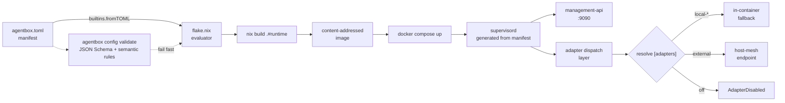
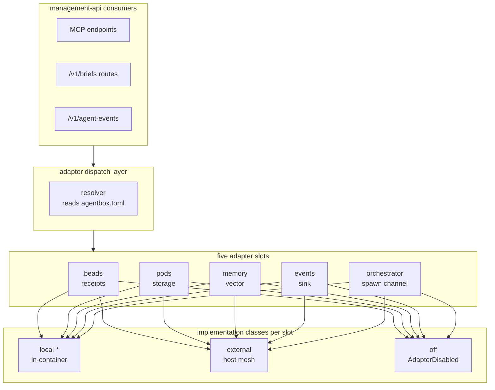
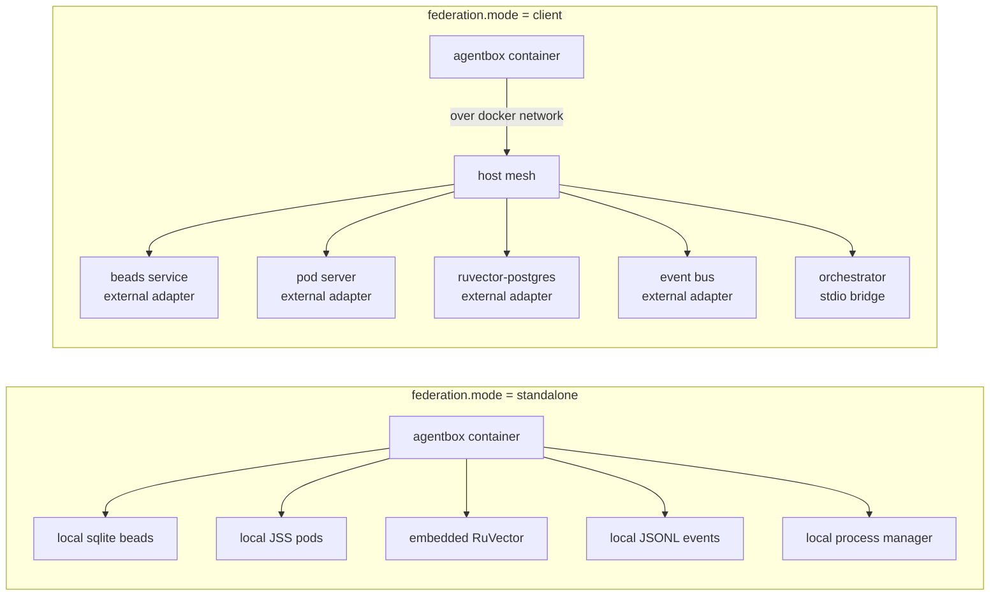

# PRD-001: Agentbox capabilities and adapter architecture

**Status:** Draft v1
**Date:** 2026-04-23
**Repo:** [github.com/DreamLab-AI/agentbox](https://github.com/DreamLab-AI/agentbox) *(standalone repo; agentbox is pushed here when stable)*
**Related:** ADR-001 (Nix flakes), ADR-002 (RuVector embedded), ADR-003 (Guidance control plane), ADR-004 (Upstream sync), ADR-005 (Pluggable adapter architecture)

## TL;DR for newcomers
*Skip if you already know the standalone-or-federated adapter product model.*

This PRD describes what agentbox actually is as a product: a Nix-declarative container that hosts software agents, their skills, and their toolchains, driven by one manifest. The pain point it addresses is that agent containers usually ship either as "all local and useless beyond a demo" or "locked to a specific backend mesh and impossible to run alone". The shape of the answer is **manifest-gated composition plus five pluggable adapter slots** (beads, pods, memory, events, orchestrator), each resolving to `local-*`, `external`, or `off`, so the same image runs standalone or federates into a host mesh without recompilation. You will get the full capability surface, the manifest grammar, the adapter contract, and the UX commitments (reproducibility, multi-arch, security defaults).

**If you remember only one thing:** one manifest, five adapters, three implementation classes — the same image is useful standalone and slots cleanly into a host mesh.

For the deep version, keep reading.

> **Scope.** This document specifies agentbox as a **standalone, reusable agent container**. It describes what agentbox does, how its manifest-gated feature model works, and the contract its adapters expose to external systems. Agentbox was originally extracted from a larger host project; it is designed to be dropped into any repository that wants a reproducible, manifest-driven, Nix-built agent execution container.

## 1. Product summary

Agentbox is a Nix-declarative container that hosts software agents (Claude Code, ruflo, and similar), their supporting skills, and the toolchains they need. One TOML manifest (`agentbox.toml`) describes exactly which features are present; the Nix flake builds a reproducible image from that manifest; a generated supervisor config wires the chosen services at runtime. Every heavy integration (durable memory backend, task/receipt store, pod storage, agent-event sinks, GPU) is a pluggable **adapter** with a built-in local fallback and an optional external endpoint.

## 2. Principles

1. **Reproducibility is non-negotiable.** `flake.lock` pins every input; two builds of the same manifest produce the same image hash.
2. **Manifest-driven composition.** Enabling a feature in `agentbox.toml` both pulls its Nix package set and emits its supervisor block — never one without the other.
3. **Adapter pattern everywhere.** Agentbox never hardcodes "the database" or "the task store". It talks to an adapter interface; users pick an implementation per feature (local fallback, external service, off).
4. **Standalone-first UX.** Clone, `nix build .#runtime`, `docker load < result`, `docker compose up -d`. No external system required to be useful.
5. **Federation-ready.** Each adapter can be pointed at an external backend (HTTP, stdio, MCP) so agentbox drops cleanly into a larger container mesh when that's the target.
6. **Security by default.** No added capabilities, `no-new-privileges`, no docker-socket mount, NIP-98 Nostr identity available, secret-scanning in CI.
7. **Multi-arch.** `x86_64-linux` and `aarch64-linux` both build; opt-in toolchains narrow to x86_64 only where necessary (e.g. `[toolchains.cuda]`).

## 3. Manifest model

### 3.1 Top-level sections

```toml
[core]
orchestration = "ruflo-v3"       # agent orchestrator
vector_db = "ruvector-embedded"  # local retrieval engine

[federation]
mode = "standalone"              # "standalone" | "client"
external_url = ""                # when mode="client", where to reach the host

[adapters]
beads = "local-sqlite"           # "local-sqlite" | "external" | "off"
pods  = "local-solid-rs"         # "local-solid-rs" | "external" | "off"
memory = "embedded-ruvector"     # "embedded-ruvector" | "external-pg" | "off"
events = "local-jsonl"           # "local-jsonl" | "external" | "off"

[gpu]
backend = "none"                 # "none" | "ollama-rocm" | "ollama-cuda" | "local-cuda"

[desktop]
enabled = false
stack = "hyprland-wayland"       # "hyprland-wayland" | "x11-openbox"
resolution = "1920x1080"

[providers.anthropic]            # API-provider credentials gated per-provider
enabled = true
[providers.openai]
enabled = false

[skills.browser]                 # feature flags for bundled skills
playwright = true
qe_browser = false

[skills.media]
ffmpeg = true
imagemagick = true
comfyui_builtin = false
comfyui_external = false         # mutually exclusive with comfyui_builtin

[skills.spatial_and_3d]
blender = false
qgis = false
gaussian_splatting = false       # requires [gpu].backend = "local-cuda"

[skills.data_science]
pytorch = false
jupyter = false

[skills.docs]
latex = true
mermaid = true
report_builder = true

[skills.ontology]
enabled = false                  # Logseq OWL2 DL tools

[toolchains]
claude = true
claude_code = true
ruflo = true
claude_flow = true
agentic_qe = true
gemini_cli = false               # official @google/gemini-cli
code_server = false
cuda = false
```

### 3.2 Validation

`agentbox config validate` parses the manifest against a JSON Schema and enforces semantic rules:

- `adapters.beads = "external"` requires `federation.external_url`.
- `skills.spatial_and_3d.gaussian_splatting = true` requires `gpu.backend = "local-cuda"`.
- `skills.media.comfyui_builtin` and `skills.media.comfyui_external` cannot both be true.
- Enabled `[providers.*]` must have their credentials present at runtime (boot-time check, not build-time).

Validation runs in three places: the TUI (`scripts/start-agentbox.sh`), the flake eval (`builtins.fromTOML` + assertions), and a standalone `agentbox config validate` CLI.

### 3.3 GPU backend dispatch

`[gpu].backend` is the single manifest key that drives all GPU-related decisions. It is consumed by a central dispatch table in `lib/gpu-backend.nix` which returns a canonical attrset:

| Field | Type | Purpose |
|---|---|---|
| `devicesNeeded` | `[string]` | `/dev/…:/dev/…` entries passed to the ollama container |
| `runtimeClass` | `string` | `""` (default OCI) or `"nvidia"` |
| `envVars` | `attrset` | Env vars injected into the ollama container |
| `nixPackages` | `[drv]` | Nix derivations added to the agentbox image at build time |
| `composeDeviceReservations` | `attrset \| null` | Compose `deploy.resources.reservations.devices` block; `null` for non-NVIDIA paths |
| `supervisorExtraEnv` | `attrset` | Env vars merged into supervisord `[program:*]` blocks that need GPU access |
| `ollamaEnabled` | `bool` | When `false`, the compose generator must omit the ollama service entirely |

Backend semantics:

- **`none`** — no GPU; ollama service is not emitted in compose; no extra packages.
- **`ollama-rocm`** — ROCm/Vulkan via `/dev/kfd` + `/dev/dri`; no Nix CUDA packages; ollama sidecar included.
- **`ollama-cuda`** — NVIDIA CUDA via container runtime; CUDA stays in the sidecar image; `composeDeviceReservations` set; `nixPackages` empty.
- **`local-cuda`** — CUDA toolchain baked into the agentbox Nix image; enables `gaussian_splatting` and in-container CUDA workloads; base `nixPackages` includes `cudaPackages.*` (CUDA 12.x alias); `supervisorExtraEnv` exposes `CUDA_VISIBLE_DEVICES`.  When `[toolchains].cuda = true` is also set, the extended CUDA 13.1 package set is added (see §3.3.1 below).

Both the flake evaluator (build-time) and the compose generator (A1 agent) consume the same dispatch function, ensuring the two outputs remain consistent with a single manifest change.

The dispatch function signature is:

```nix
dispatchGpuBackend :: string -> bool -> attrset
# dispatchGpuBackend backend toolchainsCudaEnabled
```

`toolchainsCudaEnabled` is read from `agentboxConfig.toolchains.cuda` (default `false`). Passing `true` with any backend other than `"local-cuda"` is a hard Nix eval error (mirrors validator rule E019).

### 3.3.1 `[toolchains].cuda` — CUDA 13.1 toolchain gate

`[toolchains].cuda = true` is the opt-in gate for the full CUDA 13.1 development toolchain. It is **separate** from the GPU backend: `[gpu].backend` controls runtime GPU access; `[toolchains].cuda` controls which CUDA development libraries are compiled into the image.

**Constraints:**

- Requires `[gpu].backend = "local-cuda"` (validator rule E019: `E019 [toolchains.cuda]=true requires [gpu.backend]="local-cuda"`).
- x86_64-linux only. On aarch64 the extended package list is an empty list (`lib.optionals stdenv.isx86_64`); the build succeeds but no CUDA libraries are added.
- Default is `false`. The default `runtime` image does not include CUDA libraries.
- Compressed image size target: < 25 GB (§8). The CUDA test suites are not included; only the five runtime/development packages listed below.

**Packages added when `[toolchains].cuda = true` + `[gpu].backend = "local-cuda"` on x86_64:**

| Nix attribute | Contents |
|---|---|
| `cudaPackages_13_1.cudatoolkit` | Compiler, headers, runtime libraries |
| `cudaPackages_13_1.cudnn` | Deep neural network primitives |
| `cudaPackages_13_1.cutensor` | Tensor linear-algebra routines |
| `cudaPackages_13_1.libcublas` | BLAS routines for CUDA |
| `cudaPackages_13_1.libcufft` | Fast Fourier transform for CUDA |

> **Note on nixpkgs version:** `cudaPackages_13_1` was introduced in nixpkgs after 2026-03. If the pinned nixpkgs rev pre-dates that, update `flake.lock` (`nix flake update nixpkgs`) or pin to the nearest available `cudaPackages_*` set that satisfies ≥12.x.

### 3.3.2 CUDA build variant flake output

`nix build .#cuda-runtime` produces an OCI image (`agentbox:cuda-runtime-<system>`) identical to `runtime` but with the CUDA 13.1 toolchain baked in via `cudaCfg.nixPackages`. The variant calls `dispatchGpuBackend "local-cuda" true` unconditionally — it does not read `agentbox.toml`. This makes the variant composable: load it, pass `--runtime nvidia`, and the toolchain is present regardless of the manifest used at runtime.

```bash
# Build the CUDA variant
nix build .#cuda-runtime

# Load into Docker
docker load < result

# Run (requires nvidia-container-toolkit on host)
docker run --rm --runtime nvidia --gpus all agentbox:cuda-runtime-x86_64-linux nvidia-smi
```

## 3a. Manifest → build → runtime (how it fits together)



## 4. Adapters

### 4.1 Five-slot architecture



### 4.2 Summary

Every integration point is one interface with three minimum implementations: **local** (in-container fallback), **external** (federate with some sibling service), **off** (disable the feature). See ADR-005 for the detailed contract.

| Adapter slot | Purpose | Local fallback | External contract |
|---|---|---|---|
| `beads` | Structured agent-work receipts: epic/child hierarchy, atomic claim, blocks/blocked-by dependencies, user attribution | sqlite schema implementing the same interface as the reference `bd` CLI | HTTP or stdio client to an external receipts service; MCP transport also supported |
| `pods` | Durable pod-style storage for briefs, debriefs, agent artefacts, event inbox/outbox | First-party [`solid-pod-rs`](https://github.com/DreamLab-AI/solid-pod-rs) (Rust, Solid Protocol 0.11, WAC, NIP-98 with Schnorr, Solid Notifications 0.2, atomic-rename) on port 8484 — see [ADR-010](../adr/ADR-010-rust-solid-pod-adoption.md). The legacy Python `local-jss` stub was removed 2026-04-25. | HTTP/WebSocket client to an external Solid-compatible server |
| `memory` | Vector memory for agent retrieval | Embedded RuVector (sql.js + ONNX embeddings) | Connection to an external Postgres-backed vector store (e.g. ruvector-postgres or pgvector) |
| `events` | Agent lifecycle event sink | JSONL file under `/workspace/events/` | HTTP POST / WebSocket / Nostr event publishing (parameterised-replaceable kind) |
| `orchestrator` | Agent spawn & monitor channel | Local process-manager + stdio streaming | `docker exec -i` stdio protocol + HTTP `/v1/agent-events` for remote orchestrators |

The runtime reads `[adapters]` at boot, dispatches to the chosen implementations, and exposes all five over both HTTP and stdio so external orchestrators can drive agentbox from any language.

### 4.3 Standalone vs federated at a glance



One codepath. One test harness. Two deployment shapes.

## 5. Built-in capabilities (manifest-gated)

Standalone agentbox ships with these behind `agentbox.toml` gates. Only enabled features contribute to the image:

- **Desktop** — Hyprland (Wayland, default when enabled) + wayvnc on port 5901, or fallback X11 stack (xvfb + openbox + tint2) for older VNC clients.
- **code-server** — web IDE on port 8080.
- **Claude Code + ruflo + agentic-qe** — always on (default toolchains).
- **Official `@google/gemini-cli`** v0.38.2 pinned via flake.lock — 1M context, Chapters narrative flow, Context Compression, worktree support.
- **Local Ollama sidecar** (via compose) for inference when `[gpu].backend = "ollama-rocm"` or `"ollama-cuda"`.
- **CUDA 13.1 local toolchain** when `[gpu].backend = "local-cuda"`; `gaussian_splatting` toolchain (COLMAP + METIS + LichtFeld) opt-in on top.
- **Skills corpus** — 96 manifest-gated skills fetched as a content-addressed Nix input from a shared upstream tree; per-skill versioning via `nix flake lock --update-input skills`.
- **Sovereign mesh** — Nostr identity generation + NIP-98 hybrid auth middleware; client connector to Nostr relays for inter-agent messaging.
- **Telegram mirror** (CTM) — optional daemon streaming agent activity.
- **Privacy filter** — optional local PII redaction sidecar (openai/privacy-filter, 1.5B MoE, Apache-2.0) that sits as middleware on every ADR-005 adapter dispatch and the inbound/outbound prompt path. Policy per slot (strict/soft/off). Gated by CPU/RAM or GPU capability at build-time wizard. See [ADR-008](../adr/ADR-008-privacy-filter-routing.md).
- **Embedded Nostr relay** — optional `nostr-rs-relay` (Apache-2.0, SQLite-backed, in nixpkgs) with an in-process bridge that persists every signature-verified event to `pods/<npub>/events/inbox/` and publishes outbox entries to configured fan-out relays. Gives external humans and agents a signed, audited path to internal agents. NIP-11/NIP-42/NIP-17. See [PRD-004](PRD-004-external-agent-messaging.md) and [ADR-009](../adr/ADR-009-embedded-nostr-relay.md).
- **First-party Solid pod server (`solid-pod-rs`)** — the first-class default for the `pods` adapter slot. DreamLab-AI Rust implementation of Solid Protocol 0.11, AGPL-3.0-only binary shipped via Nix (licence consistent with agentbox AGPL-3.0). WAC deny-by-default + `acl:default` inheritance, LDP resources + Basic Containers, PATCH (N3 / SPARQL-Update / JSON Patch), Solid Notifications 0.2, NIP-98 with optional Schnorr, fs/memory/S3 storage backends. Atomic-rename filesystem semantics are the durability contract behind [DDD-003](../ddd/DDD-003-sovereign-messaging-domain.md) invariants I01 (signature-before-write) and I08 (content-addressed mailbox). See [ADR-010](../adr/ADR-010-rust-solid-pod-adoption.md) and [docs/developer/licensing.md](../../developer/licensing.md).

## 6. Runtime layout

| Slot | Path | Purpose |
|---|---|---|
| Image build | `nix build .#runtime` / `.#desktop` / `.#full` | Content-addressed image output |
| Compose | `docker-compose.yml` (generated from manifest) | Service graph including ollama sidecar and any opted-in integrations |
| Supervisor | Generated from `flake.nix` | Supervisord config with blocks only for enabled features |
| Profiles | `/workspace/profiles/<name>/` | Per-profile local state, distinct from per-user Linux isolation |
| Workspace | `/workspace/` + `/projects/` | Shared mounts across profiles |

## 7. Commands

| Verb | Purpose |
|---|---|
| `agentbox.sh up` | Build if needed + `docker compose up -d` |
| `agentbox.sh down` | `docker compose down` |
| `agentbox.sh build` | `nix build .#<variant>` |
| `agentbox.sh rebuild` | build + recreate |
| `agentbox.sh logs [service]` | Stream supervised logs |
| `agentbox.sh shell [profile]` | Exec into a profile |
| `agentbox.sh health` | Healthcheck all supervised services |
| `agentbox.sh backup` / `restore` | Round-trip local adapter state + profiles |
| `agentbox.sh provision --target <oci\|fly\|hetzner\|bare>` | Pluggable remote provisioning |
| `agentbox.sh ssh \| vnc \| browser \| code \| api \| all` | Remote-operator tunnels |
| `agentbox config validate` | JSON-Schema + semantic check of `agentbox.toml` |

## 8. Goals

1. Clone → one-command run, no external service required, in under 10 minutes on a warm Nix store.
2. `flake.lock` pinning means two builds produce the same image hash.
3. Every capability is a manifest toggle; the base runtime image stays under 4 GB compressed; a full CUDA image stays under 25 GB compressed.
4. Adapters are interface-compat across all three implementation shapes (local / external / off) — swapping backends is a manifest edit, not a code change.
5. Multi-arch (`x86_64-linux` + `aarch64-linux`) for the runtime and desktop variants; opt-in toolchains may narrow.
6. Secret-scanning (gitleaks) in CI; scripted backup/restore for all local-adapter state.
7. No DinD; no docker-socket mount; no added caps by default.

## 9. Non-goals

1. Not a workstation distribution. Agentbox does not replace your dev laptop or a full desktop environment — VNC + code-server are opt-ins for remote work, not a daily shell.
2. Not a multi-tenant system. Profile isolation is not Linux-user isolation. Agentbox assumes one operator per image, possibly multiple profiles.
3. Not a long-term durable memory host. The embedded RuVector is a per-session retrieval cache, not a source of truth; durable and team-scale memory requires `[adapters.memory] = "external-pg"` or a host-project memory backend. Agentbox's backup/restore story covers the local cache for single-operator convenience, not multi-operator coordination.
4. Not a GPU compute platform. CUDA is available as an opt-in toolchain for workloads that need it; agentbox is not a schedule/queue system.
5. Not a Kubernetes operator or a serverless platform. One container, one compose file, predictable behaviour.

## 10. Non-exhaustive integration examples

Agentbox is designed to slot into larger container meshes. The shape of those meshes is outside this doc's scope — a host repo will describe its specific wiring. Typical integration patterns:

- **Join an external docker network.** Set `[integrations.external_network] enabled = true, network = "<name>"` and the generated compose emits the `networks:` block.
- **Use external memory.** `[adapters.memory] = "external-pg"` + `[integrations.ruvector_external] conninfo = "postgresql://..."`. Manifest validator ensures health is probed before agentbox start.
- **Expose agent-spawn over stdio.** `[adapters.orchestrator].expose_stdio = true` enables `docker exec -i agentbox agentbox-agent-spawn <role> <prompt>` + `docker exec -i agentbox agentbox-agent-events --follow --format jsonl`. External orchestrators in any language can drive agent lifecycle.
- **Publish events over Nostr.** `[adapters.events] = "external"` + `[sovereign_mesh] publish_agent_events = true` emits kind 30078 parameterised replaceable events to configured relays.

Host projects document their specific wiring in their own docs; they treat agentbox as an upstream and consume these hooks.

## 10a. Observability (built-in, not optional)

Agentbox exposes three observability surfaces by default:

- **Metrics.** Prometheus endpoint on `/metrics` at port `[observability].metrics_port` (default `9091`). Counters and histograms for adapter dispatches, agent spawns, health-check results. Gauge `agentbox_build_info{image_hash,manifest_checksum,federation_mode}` for release-correlation.
- **Tracing.** OpenTelemetry spans emitted when `[observability].otlp_endpoint` is configured. Adapter dispatches, agent lifecycle events, and management-api requests each emit spans with stable attribute names (see ADR-005 §Observability).
- **Structured logs.** JSON lines on stdout; supervisord captures them. One line per adapter dispatch, one per agent spawn, one per health transition.

Manifest section:

```toml
[observability]
metrics_port = 9091
otlp_endpoint = ""          # e.g. "http://otel-collector:4317"; empty = traces dropped
log_level = "info"          # trace | debug | info | warn | error
```

`agentbox.sh health --json` returns a consolidated view: per-service uptime, per-adapter resolution + health, current session count. External monitors consume it; `agentbox.sh health` (no flag) is a human-friendly wrapper that exits non-zero when anything is unhealthy.

## 10b. Secrets lifecycle

Secrets are first-class. Beyond gitleaks-in-CI:

- **Auto-generated management key.** On first boot, if `MANAGEMENT_API_KEY` is unset, agentbox generates a 32-byte random key, writes it to `/workspace/profiles/<stack>/mgmt-key` (mode `0600`), and logs the location once. Subsequent boots read from the file.
- **Provider key indirection.** Enabled `[providers.<name>]` sections declare their env-var name only; the value lives in the host environment or a secret manager. Agentbox never materialises provider keys to disk.
- **Nostr private key at rest.** Generated by `scripts/sovereign-bootstrap.py` on first run, stored encrypted at `/workspace/profiles/<stack>/nostr.key.enc` with a passphrase derived from `MANAGEMENT_API_KEY` + a profile-local salt. The raw key never touches disk.
- **Rotation verb.** `agentbox.sh rotate-keys` regenerates `MANAGEMENT_API_KEY`, re-encrypts `nostr.key.enc` under the new key, and writes the new key to the profile dir. Old key kept for 24 hours for rollback.
- **Exposure in backups.** `agentbox.sh backup` explicitly excludes `mgmt-key`, `nostr.key.enc`, and anything matching `*.key`, `*.pem`, `*.env` by default. `--include-secrets` is an explicit opt-in flag.

## 11. History

Agentbox was extracted from a larger host project during a 2026-04 radical-upgrade sprint, replacing a 1,188-line Dockerfile + 2,379-line bash entrypoint monolith. Its design priorities — reproducibility, adapter pattern, manifest-gating — came directly from the lessons that monolith generated. The original host project retains its own integration docs that describe how it wires agentbox; those docs live with that project, not here.

## 12. References

- `agentbox/docs/adr/ADR-001-nixos-flakes.md`
- `agentbox/docs/adr/ADR-002-ruvector-standalone.md`
- `agentbox/docs/adr/ADR-003-guidance-control-plane.md`
- `agentbox/docs/adr/ADR-004-upstream-sync.md`
- `agentbox/docs/adr/ADR-005-pluggable-adapter-architecture.md`
- `agentbox/docs/adr/ADR-008-privacy-filter-routing.md`
- `agentbox/CLAUDE.md`
