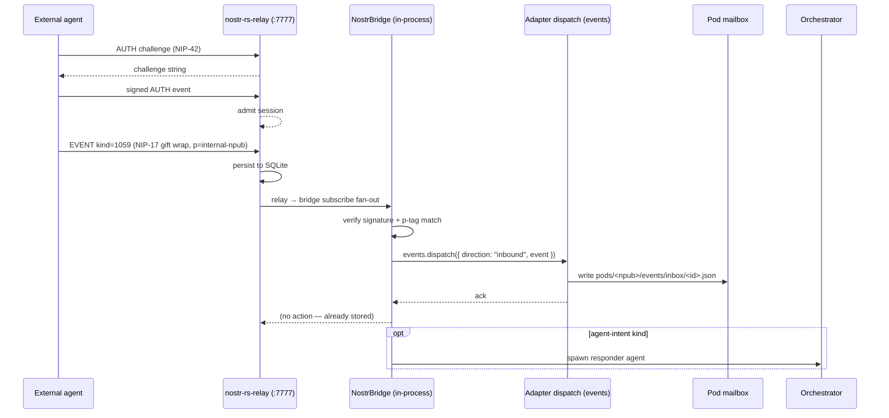
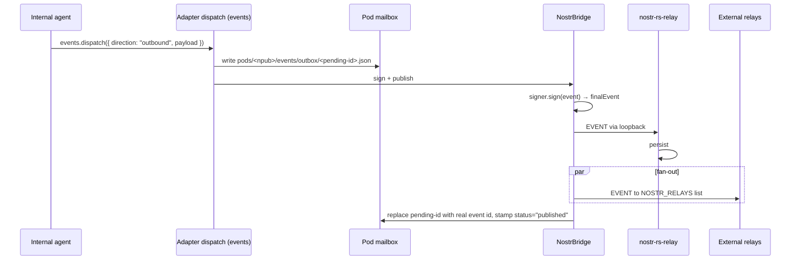

# PRD-004: External agent messaging and sovereign relay surface

**Status:** Draft v1
**Date:** 2026-04-24
**Repo:** [github.com/DreamLab-AI/agentbox](https://github.com/DreamLab-AI/agentbox)
**Related:** PRD-001 (Capabilities and adapters), ADR-005 (Pluggable adapter architecture), ADR-009 (Embedded Nostr relay and pod-inbox bridge), DDD-003 (Sovereign messaging domain), PRD-002 (Immutable runtime bootstrap)

## TL;DR for newcomers
*Skip if you already know how Nostr addressing, NIP-17 sealed DMs, and agentbox sovereign pods fit together.*

This PRD describes how external humans and external agents reach **internal** agents running inside an agentbox container, and how those exchanges are persisted to sovereign pods. The pain point is that the present `nostr-bridge` is a one-way client that only reads public relays; there is no defined inbound channel, no durable receipt path to pods, and no address-space guarantees (anyone can target anyone). The shape of the answer is an **embedded Rust Nostr relay** (`nostr-rs-relay`, Apache-2.0, already in nixpkgs) with **policy-gated ingress** and an **inbox/outbox bridge** that writes every accepted event to `pods/<npub>/events/{inbox,outbox}/<id>.json`, turning the pod directory layout from scaffolding into a real mailbox.

**If you remember only one thing:** the pod is the inbox. The relay is how the envelope gets there.

For the deep version, keep reading.

## 1. Problem

Agentbox today ships the client half of a Nostr stack. A container boots, generates a secp256k1 keypair via `scripts/sovereign-bootstrap.py`, scaffolds `pods/<npub>/events/{inbox,outbox}/` directories, and connects out to a comma-separated list of public relays (`NOSTR_RELAYS`, defaulting to `wss://relay.damus.io,wss://relay.primal.net`). `NostrBridge` subscribes to kinds 27235 / 30000-30001 / 30078 and can publish.

Three capabilities the system *does not yet provide*:

1. **Inbound addressing.** No external agent can reliably send a message *to* an internal agent. They can publish an event to a public relay and hope `NostrBridge`'s subscription catches it, but there is no delivery guarantee, no filtering by intended recipient, no auth challenge, and no durable acknowledgement.
2. **Pod ↔ relay binding.** The `events/inbox` and `events/outbox` subdirectories are created by the bootstrap but nothing writes to them. They are inert scaffolding.
3. **Sovereign mesh completeness.** The design principle — every container holds its own keypair and events are gossipped across a mesh — requires at least one relay to gossip *through*. With no embedded relay, a two-agentbox deployment has to trust an unrelated public relay as a message broker, violating the "local fallbacks make standalone mode a real product" commitment from ADR-005.

## 2. Principles

1. **Pod is the source of truth.** A Nostr event that has not been persisted to a pod inbox has not been received. A pod outbox entry that has not been published to a relay has not been sent. Relays are transport, not storage.
2. **Signature before storage.** Every inbound event is Schnorr-verified before any pod write; every outbound event is signed by the agent identity before publication. No exceptions.
3. **One identity per container by default.** The keypair under `pods/<npub>/` is the container's sovereign identity. Multi-agent-identity support (per-profile or per-role npubs) is an opt-in extension, not the base case.
4. **Address-space discipline.** Inbound events are accepted only when they target a known npub via `p` tag or (for NIP-17 sealed DMs) recipient encryption header. Broadcast events are accepted only against an explicit `allowed_kinds` allowlist.
5. **Embedded-first, federated-second.** The default mode is *standalone*: the embedded relay is authoritative for all local mesh traffic. Federation with external relays is an additive fan-out, never a replacement.
6. **Capability-gated activation.** The relay is a new feature gate in `agentbox.toml`, independent of `sovereign_mesh.enabled` so operators can run the identity layer without opening a relay socket, or run the relay without the sovereign identity (edge case, but legal).

## 3. Users and flows

### 3.1 Actors

| Actor | Identity | Auth surface |
|-------|----------|--------------|
| **External agent** | Any Nostr npub on the wider network | NIP-42 challenge at relay, Schnorr signature on every event |
| **External human** | A person's own Nostr client (Damus, Amethyst, web clients) pointed at the agentbox relay | NIP-42 at relay; optional NIP-98 if they also hit the management-api HTTP surface |
| **Internal agent** | The container's sovereign npub (from `sovereign-bootstrap.py`) | In-process `loadSigner()` — private key never leaves `management-api` |
| **Host orchestrator** (when `federation.mode="client"`) | Host-project identity | Already covered by ADR-005 external-adapter contract |

### 3.2 Inbound flow (external → internal)



### 3.3 Outbound flow (internal → external)



### 3.4 Failure modes

| Failure | Behaviour |
|---------|-----------|
| External client cannot complete NIP-42 AUTH | Relay closes connection after 30 s; no inbox write; metric `agentbox_relay_auth_fail_total{reason}` |
| Event signature invalid | Relay drops; bridge never sees it; metric `agentbox_relay_sig_fail_total` |
| `p` tag does not match any local npub | Relay stores (so other subscribers can read) but bridge does not write to pod |
| Pod write fails (disk full, permission) | Bridge logs at `error`, emits `agentbox_pod_write_fail_total`; event stays in relay SQLite as the retriable source |
| Outbound publish fails to all relays | Outbox entry remains with `status="pending"`; background flush retries with exponential backoff |
| Bridge crashes between sign and publish | On restart, outbox entries with `status="pending"` are republished (at-least-once, idempotent via event id) |

## 4. Capability surface

### 4.1 Ports and endpoints

| Port | Protocol | Purpose | Binding |
|------|----------|---------|---------|
| **7777** | WebSocket (Nostr) | Relay ingress/egress | `127.0.0.1` by default; `0.0.0.0` when `sovereign_mesh.relay.expose = true` |
| **7777** | HTTP GET `/` | NIP-11 relay information document | same binding as above |
| 8484 | HTTP | Solid pod (existing) | unchanged |
| 9090 | HTTP | management-api (existing) | unchanged |

### 4.2 Wire shapes

All inbound and outbound messages are standard Nostr events — no custom framing. Recognised kinds:

| Kind | NIP | Purpose in agentbox |
|------|-----|---------------------|
| 1 | NIP-01 | General note; allowlisted under `sovereign_mesh.relay.allowed_kinds` |
| 4 | NIP-04 (legacy) | Encrypted DM; **rejected by default** — see §5 decision options |
| 1059 | NIP-17 | Sealed gift-wrapped DM; recommended inbound channel |
| 27235 | NIP-98 | HTTP auth; read-only from bridge |
| 30078 | NIP-33 | Agent state (already used) |
| 31400 | NIP-33 | Agent Control Surface — PanelDefinition (agent publishes control panel schema) |
| 31401 | NIP-33 | Agent Control Surface — PanelState (agent publishes panel data snapshot) |
| 31402 | NIP-33 | Agent Control Surface — ActionRequest (agent requests human decision) |
| 31403 | NIP-33 | Agent Control Surface — ActionResponse (human responds to action request) |
| 31404 | NIP-33 | Agent Control Surface — PanelUpdate (incremental panel state diff) |
| 31405 | NIP-33 | Agent Control Surface — PanelRetired (agent retires a panel) |
| 38000-38099 | reserved | Agent-intent (inbound request for agent action) |
| 38100-38199 | reserved | Agent-response (outbound response to an agent-intent) |

Kinds 31400-31405 implement the **Agent Control Surface Protocol**, a
bidirectional governance layer between agentbox agents and the DreamLab
forum (nostr-rust-forum). VisionClaw's `BrokerActor` publishes PanelDefinitions
and ActionRequests; forum humans respond with ActionResponses. The relay-consumer
persists governance events to `pods/<npub>/events/governance/` and routes
inbound ActionResponses to the orchestrator adapter.

### 4.3 NIP support matrix (embedded relay)

| NIP | Required | Purpose |
|-----|----------|---------|
| NIP-01 | yes | Basic protocol |
| NIP-11 | yes | Relay information document |
| NIP-42 | yes | Relay AUTH (mandatory for writes when `ingress_policy != "open"`) |
| NIP-04 | configurable | Legacy DMs — off by default |
| NIP-17 | yes (read) | Sealed DMs — bridge decrypts for pod write |
| NIP-40 | yes | Expiration tag honoured for TTL |
| NIP-50 | no | Full-text search — not offered by nostr-rs-relay (see §6 alternatives) |

## 5. Options offered to operators

The wizard and manifest surface four decision axes. Each has a default that makes standalone mode useful immediately.

### 5.1 Relay implementation

| Option | When to pick |
|--------|--------------|
| **`nostr-rs-relay`** (default) | SQLite-backed, mature, in nixpkgs — matches ADR-002's SQLite pattern |
| `rnostr` | LMDB, NIP-50 full-text search, smaller deployment base — pick when you need search |
| `external` | A relay elsewhere on the host mesh (host-project provides the relay) |
| `off` | Keep bridge-only behaviour (read public relays); no embedded ingress |

### 5.2 Ingress policy

| Option | Semantic |
|--------|----------|
| **`allowlist`** (default) | Writes require NIP-42 AUTH + pubkey present in `allowed_pubkeys` |
| `signed-only` | Writes require NIP-42 AUTH; no pubkey allowlist (any valid Schnorr signer) |
| `open` | Writes accepted from any client; no AUTH required (homelab mode; emits `W027` warning) |

### 5.3 Pod bridging

| Option | Semantic |
|--------|----------|
| **`enabled`** (default) | Every signature-verified event targeting a local npub is persisted to `pods/<npub>/events/inbox/<id>.json`; every outbound is persisted to `outbox/` |
| `disabled` | Bridge runs, relay runs, but pod inbox/outbox are not populated (testing mode) |

### 5.4 External-relay fanout

| Option | Semantic |
|--------|----------|
| **`bidirectional`** (default) | Subscribe to `NOSTR_RELAYS` *and* publish local events to them — maximum reach |
| `publish-only` | Push local events out; ignore external traffic |
| `subscribe-only` | Listen to external traffic; do not publish |
| `off` | Embedded relay only; no external relays (air-gapped mesh) |

### 5.5 Matrix of defaults by federation mode

| `federation.mode` | Relay | Ingress | Pod bridge | Fanout |
|-------------------|-------|---------|------------|--------|
| `standalone` | `nostr-rs-relay` | `allowlist` | `enabled` | `off` (no external relays assumed) |
| `client` | `external` (host provides) | inherits host policy | `enabled` | `publish-only` (push to host mesh) |

## 6. Manifest model

### 6.1 New section

```toml
[sovereign_mesh.relay]
enabled          = false
implementation   = "nostr-rs-relay"   # nostr-rs-relay | rnostr | external | off
port             = 7777
bind             = "127.0.0.1"        # or "0.0.0.0" when exposing
expose           = false              # publish the port in docker-compose
data_dir         = "/var/lib/nostr-relay"
ingress_policy   = "allowlist"        # allowlist | signed-only | open
allowed_pubkeys  = []                 # npub or hex; empty under allowlist means "self only"
allowed_kinds    = [1, 1059, 30078, 27235, 38000, 38100]
pod_bridge       = true
external_fanout  = "bidirectional"    # bidirectional | publish-only | subscribe-only | off
max_event_bytes  = 131072
messages_per_sec = 5                   # per-connection token bucket
retention_days   = 30                  # NIP-40 default for events without expiration
allow_nip04      = false              # legacy unencrypted DMs
info_description = "Agentbox sovereign relay"
info_contact     = ""                  # optional NIP-11 contact string
```

### 6.2 Validator rules

| Code | Condition |
|------|-----------|
| **E026** | `sovereign_mesh.relay.enabled = true` requires `sovereign_mesh.enabled = true` *or* `sovereign_mesh.solid_pod = true` (pod bridging needs either). |
| **E027** | `implementation = "external"` requires `federation.mode = "client"` and `federation.external_url`. |
| **E028** | `implementation ∈ {nostr-rs-relay, rnostr}` requires `port ≠` the ports already in `RESERVED_PORTS` (5901/8080/8484/9090/9091) and `port ≠ privacy_filter.port`. |
| **E029** | `bind = "0.0.0.0"` **without** `expose = true` is a wiring error (bound inside container, unreachable from host). |
| **W030** | `ingress_policy = "open"` raises a warning — always correctable, never silent. |
| **E031** | `allow_nip04 = true` raises a warning because NIP-04 DMs leak metadata; prefer NIP-17. |

### 6.3 Environment

| Var | Source | Purpose |
|-----|--------|---------|
| `AGENTBOX_RELAY_PORT` | manifest → flake | Consumed by `[program:nostr-relay]` |
| `AGENTBOX_RELAY_BIND` | manifest → flake | Binding address |
| `AGENTBOX_RELAY_DATA_DIR` | manifest → flake | SQLite file location |
| `AGENTBOX_RELAY_POLICY` | manifest → flake | Ingress policy string (bridge consumes for filter) |
| `NOSTR_RELAYS` | existing | External fanout URLs (unchanged) |

## 7. Service-level objectives

Measured at p95 over a 7-day window. Contract tests in `tests/contract/relay.contract.spec.js` assert these under synthetic load.

| Operation | p95 latency | Throughput floor | Error ceiling |
|-----------|-------------|------------------|---------------|
| Accept valid signed EVENT (loopback) | 15 ms | 200 events/s | 0.1 % |
| NIP-42 AUTH handshake | 80 ms | 50 handshakes/s | 0.5 % |
| Inbound event → pod inbox write | 150 ms | 100 events/s | 0.5 % |
| Outbound publish → first-relay-ack | 250 ms | 50 events/s | 1 % |
| Cold-start relay ready (post supervisord) | 5 s | — | n/a |
| Subscription REQ fan-out to matching handler | 30 ms | 200 subs/s | 0.1 % |
| Retention prune sweep | completes within 5 min / 100k rows | — | n/a |

## 8. Observability

Every hook is instrumented. The relay does not speak OTLP natively, so the bridge proxies its metrics plus its own:

| Metric | Type | Labels |
|--------|------|--------|
| `agentbox_relay_connections_active` | gauge | `state` (authed, pending) |
| `agentbox_relay_events_total` | counter | `direction` (inbound, outbound), `kind`, `outcome` (accepted, rejected) |
| `agentbox_relay_auth_fail_total` | counter | `reason` (sig, challenge-timeout, pubkey-not-allowed) |
| `agentbox_relay_sig_fail_total` | counter | — |
| `agentbox_pod_write_total` | counter | `direction`, `outcome` |
| `agentbox_pod_write_fail_total` | counter | `reason` |
| `agentbox_relay_db_bytes` | gauge | — |
| `agentbox_relay_retention_pruned_total` | counter | — |

Spans: `agentbox.relay.event.{accept,reject,persist,bridge}`, `agentbox.relay.auth.{challenge,verify}`. Same OTLP pipeline as every other adapter span (ADR-005).

Health: `./agentbox.sh health` reads a new `/health/relay` endpoint exposed by the management-api that returns `{ connections, db_bytes, last_event_at, outbox_pending, fanout_up }`.

## 9. Security

- Relay runs under the same `1000:1000` user, `read_only: true` baseline. Only `/var/lib/nostr-relay` (tmpfs or bind-mounted named volume) is writable, via the `[security.exceptions.nostr-relay]` block: `writable_volumes = ["nostr-relay-data:/var/lib/nostr-relay"]`.
- No new capability additions. No `cap_add`.
- Loopback binding is the default. When `expose = true`, the relay is also reachable on the host — document this explicitly in the wizard's confirmation dialog.
- NIP-42 challenge strings use 32 bytes of `crypto.randomBytes`. Challenges expire after 60 s.
- Rate limits (`messages_per_sec`, `subscriptions_per_min`) prevent a single client from burning CPU on signature verification.

## 10. Backup and restore

- `agentbox.sh backup` already rounds up `pods/`; the relay's `/var/lib/nostr-relay/nostr.db` is added to the backup set.
- `agentbox.sh restore` re-seats the SQLite file under the new volume before `docker compose up`.
- Restore is idempotent: duplicate events are rejected by the relay's (id, pubkey) uniqueness constraint, so replaying an outbox on restart is safe.

## 11. Goals and non-goals

### Goals

1. Any external agent with a valid Nostr npub and a signed event can reach an internal agent with ≤ 250 ms p95 end-to-end (LAN).
2. Every accepted event is persisted to a pod mailbox; every outbox entry eventually publishes or is surfaced as failed. No silent drops.
3. Standalone mode works without reaching any public relay.
4. No new container capabilities. No new exposed ports when `expose = false`.
5. Reproducibly built from nixpkgs — no custom fork, no runtime install.

### Non-goals

1. Not a general-purpose public relay. Agentbox's relay is a mesh endpoint, not community infrastructure.
2. Not a message broker with replay/durable-subscription semantics beyond what the pod mailbox provides.
3. Not a fully federated Nostr identity service. Multi-npub-per-container is deferred.
4. Not a NIP-04 solution. Legacy DMs are off by default and will not be extended.

## 12. Sequencing

Implementation follows this order, each a self-contained PR:

1. Manifest + schema + validator (E026-E031) and wizard section.
2. `[program:nostr-relay]` supervisor block + Nix derivation (gated).
3. Bridge: inbound subscription handler, pod write path (new module under `mcp/nostr-bridge/`).
4. Contract test harness (`tests/contract/relay.contract.spec.js`).
5. User doc (`docs/user/nostr-relay.md`) + troubleshooting entries.
6. External-fanout policy glue.
7. NIP-17 sealed-DM decryption path (deferred if the initial landing slides past the seven-day window).

Each step ships green contract tests before the next starts.

## 13. References

- [ADR-009 — Embedded Nostr relay and pod-inbox bridge](../adr/ADR-009-embedded-nostr-relay.md)
- [DDD-003 — Sovereign messaging domain](../ddd/DDD-003-sovereign-messaging-domain.md)
- [ADR-005 — Pluggable adapter architecture](../adr/ADR-005-pluggable-adapter-architecture.md) (events slot binding)
- [docs/developer/sovereign-mesh.md](../../developer/sovereign-mesh.md) (existing bridge internals)
- [nostr-rs-relay upstream](https://sr.ht/~gheartsfield/nostr-rs-relay/)
- [NIP-11 — Relay Information Document](https://github.com/nostr-protocol/nips/blob/master/11.md)
- [NIP-17 — Private Direct Messages](https://github.com/nostr-protocol/nips/blob/master/17.md)
- [NIP-42 — Authentication of clients to relays](https://github.com/nostr-protocol/nips/blob/master/42.md)
