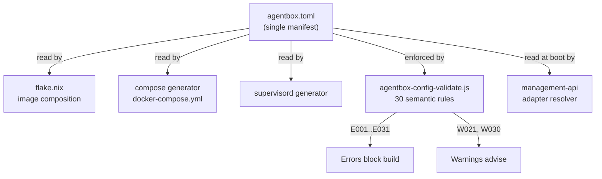
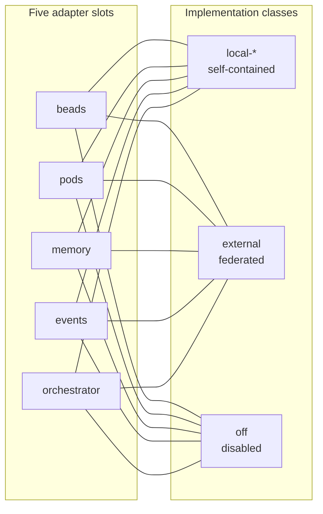
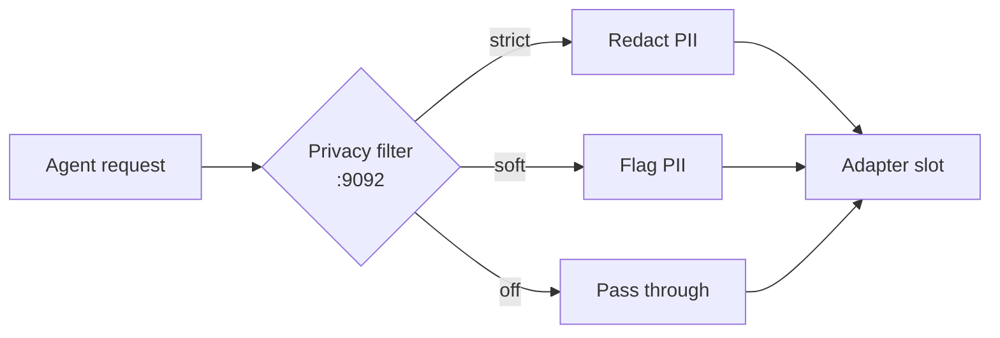
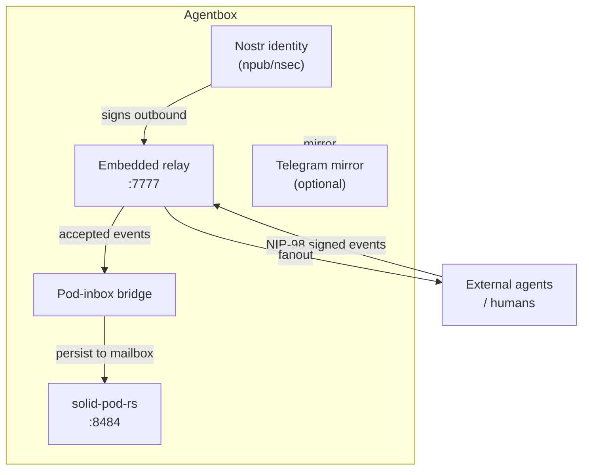

# Configuration reference

Every key in [`agentbox.toml`](../../agentbox.toml). This is the single source of truth — the Nix flake reads it, the compose generator reads it, the validator enforces it.

## Why this file exists

Instead of editing Dockerfiles, compose YAML, supervisor configs and CLI flags separately, Agentbox puts the entire build-and-runtime surface into one TOML manifest. Change a key, re-validate, rebuild if needed; everything downstream follows. Full product spec: [PRD-001](../reference/prd/PRD-001-capabilities-and-adapters.md).

**What it solves**

- Config drift between the image, the compose file and the runtime env.
- "Which file do I edit to turn off the desktop?" — one answer, always.
- Invalid combinations caught before a 10-minute Nix build (validator error codes `E001`–`E025`).



After editing, run `agentbox config validate` before `agentbox.sh up`. The validator catches 30 classes of misconfiguration (E001-E031 + W021 + W030, E009 reserved) before `nix build` attempts.

---

## `[core]`

```toml
[core]
orchestration = "ruflo-v3"       # Agent orchestrator. Currently only ruflo-v3 is wired.
vector_db = "ruvector-embedded"  # Local retrieval engine. Currently only ruvector-embedded.
```

## `[mesh]`

```toml
[mesh]
mode = "standalone"              # "standalone" (local fallbacks) | "client" (federate with host mesh)
peer_relays = []                 # Required when mode="client". WebSocket URLs of peer relays.
```

## `[adapters]`

Five slots. Each resolves to one of three implementation classes. An `adapter` is the pluggable-backend pattern from [ADR-005](../reference/adr/ADR-005-pluggable-adapter-architecture.md) — every integration that touches durable state goes through one of these slots, so you can run everything locally, federate with a host mesh, or turn the slot off entirely without changing agent code.



```toml
[adapters]
beads        = "off"                   # local-sqlite | external | off
pods         = "local-solid-rs"        # local-solid-rs | external | off
memory       = "external-pg"           # embedded-ruvector | external-pg | off
events       = "local-jsonl"           # local-jsonl | external | off
orchestrator = "local-process-manager" # local-process-manager | stdio-bridge | off
```

`pods = "local-solid-rs"` is the only first-party implementation. It runs the
[`solid-pod-rs`](https://github.com/DreamLab-AI/solid-pod-rs) Rust Solid
Protocol 0.11 server described in [ADR-010](../reference/adr/ADR-010-rust-solid-pod-adoption.md).
See [solid-pod.md](solid-pod.md) for the operator guide and
`[integrations.solid_pod_rs]` below for the per-feature knobs. The legacy
`local-jss` Python stub was removed 2026-04-25; old manifests carrying it
fail schema validation with E016 (unknown enum value).

Validator rules:
- **E001**: `"external"` requires `mesh.mode = "client"` + `mesh.peer_relays`.
- **E002**: `memory = "external-pg"` requires `[integrations.ruvector_external].conninfo`.
- **E003**: `orchestrator = "stdio-bridge"` must not bind an HTTP port.
- **E033**: `integrations.solid_pod_rs.enable_dpop_cache = true` requires `enable_oidc = true`.

Full adapter contract: [ADR-005](../reference/adr/ADR-005-pluggable-adapter-architecture.md).

## `[gpu]`

```toml
[gpu]
backend = "local-cuda"    # none | ollama-rocm | ollama-cuda | local-cuda
```

| Backend | When to use |
|---|---|
| `none` | CPU-only, or macOS/Windows hosts (Metal can't reach the container) |
| `ollama-rocm` | AMD GPU with ROCm drivers, or Vulkan fallback |
| `ollama-cuda` | NVIDIA GPU with `nvidia-container-toolkit` |
| `local-cuda` | NVIDIA with CUDA toolchain baked into the image (required for `gaussian_splatting`) |

Validator rule **E006**: `gaussian_splatting = true` requires `backend = "local-cuda"`.

## `[privacy_filter]`

Local PII redaction sidecar (openai/privacy-filter, 1.5B MoE, Apache-2.0).
Gated at setup time — only offered when a GPU is detected or the host has
≥ 4 cores and ≥ 6 GB of free memory.



```toml
[privacy_filter]
enabled = true
mode    = "local-cpu"           # off | local-gpu | local-cpu
port    = 9092                  # loopback-only
dtype   = "bf16"                # bf16 | f32 | q4
model   = "openai/privacy-filter"

[privacy_filter.policy]
pods         = "strict"         # strict | soft | off
memory       = "strict"
events       = "soft"
beads        = "soft"
orchestrator = "off"
inbound      = "soft"
outbound     = "soft"

[privacy_filter.entities]
enabled = []                    # empty = all eight classes
```

Validator rules:
- **E022**: `enabled = true` requires `mode ∈ {local-gpu, local-cpu}`.
- **E023**: `mode = "local-gpu"` requires `gpu.backend != "none"`.
- **E024**: `dtype = "q4"` requires `mode = "local-cpu"`.
- **E025**: `port` must not collide with `observability.metrics_port`.

Full routing contract: [ADR-008](../reference/adr/ADR-008-privacy-filter-routing.md).
Novice-friendly walkthrough: [privacy-filter.md](privacy-filter.md).

## `[desktop]`

```toml
[desktop]
enabled = true
stack = "x11-openbox"         # hyprland-wayland | x11-openbox
resolution = "1920x1080"
webgpu = true
```

When enabled, exposes port 5901 for VNC. Browser automation is handled exclusively by the external browsercontainer sidecar — no local chromium/playwright/agent-browser in the image. The `[security.exceptions.desktop]` block must be active (see below).

## `[observability]`

Drives the entire metrics/tracing/logging chain. One manifest key → compose ports → container env → Prometheus/OTLP endpoints.

```toml
[observability]
metrics_port = 9091
otlp_endpoint = ""            # e.g. "http://otel-collector:4317"; empty = tracing disabled
log_level = "info"            # trace | debug | info | warn | error
```

## `[providers.<name>]`

Per-provider gates. Only enabled providers' env vars are required at boot.

```toml
[providers.anthropic]
enabled = true
env_var = "ANTHROPIC_API_KEY"
optional_env_vars = []

[providers.openai]
enabled = true
env_var = "OPENAI_API_KEY"
optional_env_vars = ["OPENAI_BASE_URL"]
```

Supported out of the box: `anthropic`, `openai`, `gemini`, `deepseek`, `perplexity`, `openrouter`, `context7`, `brave`, `github`, `zai`, `ollama`.

The `ollama` provider routes local LLM traffic to the host's ollama endpoint (or an optional sidecar). It is enabled in the default manifest so `OPENAI_BASE_URL` can be pointed at `http://host.docker.internal:11434` without extra config:

```toml
[providers.ollama]
enabled = true
sidecar = false    # set true to bring up an ollama container alongside agentbox
```

Validator rules **E017/E018**: enabled provider's env var must be present and not a placeholder.

Add a new provider: see [providers.md](providers.md).

## `[skills.*]`

Feature flags for the 96-skill catalogue. Only enabled skills contribute to the image.

```toml
[skills.browser]
playwright = false
qe_browser = false
agent_browser = false
# All browser automation routes through the external browsercontainer sidecar.
# MCP SSE: http://browsercontainer:8931/sse (chrome-devtools-mcp 40+ tools)
# CDP: browsercontainer:9222 | VNC: :5903
# Start: agentbox.sh browsercontainer up
sidecar_mcp_url = "http://browsercontainer:8931/sse"
sidecar_cdp_host = "browsercontainer"
sidecar_cdp_port = 9222

[skills.media]
ffmpeg = true
imagemagick = true
comfyui_builtin = false    # Install ComfyUI inside the container
# [integrations.comfyui_external] — mutually exclusive with comfyui_builtin (E007)

[skills.spatial_and_3d]
blender = true
qgis = true
gaussian_splatting = false    # Requires [gpu].backend = "local-cuda" (E006)

[skills.data_science]
pytorch = true
jupyter = true

[skills.docs]
latex = true
mermaid = true
report_builder = true

[skills.ontology]
enabled = true    # Logseq OWL2 DL tools; visionclaw_api_url set via [skills.ontology]
```

## `[toolchains]`

Which agent CLIs are in the image.

```toml
[toolchains]
claude        = true
claude_code   = true
ruflo         = true
claude_flow   = true
agentic_qe    = true
nagual_qe     = true     # Nagual QE test framework
codebase_memory = true
rust          = true
antigravity_cli = true   # Google Antigravity CLI (agy)
codex         = true     # OpenAI Codex Rust CLI
code_server   = true     # Web IDE on port 8080
cuda          = true     # CUDA toolchain (requires [gpu].backend = "local-cuda")
```

Validator rule **E019**: `cuda = true` requires `gpu.backend = "local-cuda"`.

## `[integrations.<name>]`

Optional external endpoints for federated deployments.

```toml
[integrations.ruvector_external]
enabled  = true
conninfo = "postgresql://ruvector:@@RUVECTOR_PG_PASSWORD@@@ruvector-postgres:5432/ruvector"

[integrations.comfyui_external]
enabled = false
url = "http://comfyui:8188"
ws_url = "ws://comfyui:8188/ws"
```

## `[sovereign_mesh]`

Nostr identity + Solid pod + optional CTM mirror.



```toml
[sovereign_mesh]
enabled = true
solid_pod = true
nostr_bridge = true
https_bridge = true
telegram_mirror = true
publish_agent_events = true
```

See [sovereign-mesh (developer)](../developer/sovereign-mesh.md) for internals.

### `[sovereign_mesh.relay]`

Embedded Nostr relay for external-agent messaging. Gives external humans
and agents a signed, audited path to internal agents; every accepted
event is persisted to the pod mailbox. Specified by
[PRD-004](../reference/prd/PRD-004-external-agent-messaging.md) /
[ADR-009](../reference/adr/ADR-009-embedded-nostr-relay.md) /
[DDD-003](../reference/ddd/DDD-003-sovereign-messaging-domain.md).

```toml
[sovereign_mesh.relay]
enabled          = true
implementation   = "nostr-rs-relay"   # nostr-rs-relay | rnostr | external | off
port             = 7777
bind             = "127.0.0.1"
expose           = false
data_dir         = "/var/lib/nostr-relay"
ingress_policy   = "allowlist"        # allowlist | signed-only | open
allowed_pubkeys  = []
allowed_kinds    = [1, 1059, 30078, 27235, 31400, 31401, 31402, 31403, 31404, 31405, 38000, 38100, 38200, 38201, 38300, 38301, 38302, 38303, 38304, 38305]
pod_bridge       = true
external_fanout  = "bidirectional"    # bidirectional | publish-only | subscribe-only | off
max_event_bytes  = 131072
messages_per_sec = 5
retention_days   = 30
allow_nip04      = false
info_description = "Agentbox sovereign relay"
info_contact     = ""
```

Validator rules:
- **E026**: `enabled=true` requires `sovereign_mesh.enabled` or `sovereign_mesh.solid_pod`.
- **E027**: `implementation="external"` requires `mesh.mode="client"` + `mesh.peer_relays`.
- **E028**: `port` must not collide with RESERVED_PORTS or other services.
- **E029**: `bind="0.0.0.0"` + `expose=false` is a wiring error.
- **W030**: `ingress_policy="open"` is a warning (relay accepts writes from anyone).
- **E031**: `allow_nip04=true` — legacy DMs leak metadata; prefer NIP-17.

When `enabled=true`, also add:

```toml
[security.exceptions.nostr-relay]
writable_volumes = ["nostr-relay-data:/var/lib/nostr-relay"]
reason = "nostr-rs-relay SQLite journal and WAL require a writable durable path"
```

Novice-friendly walkthrough: [nostr-relay.md](nostr-relay.md).

## `[networking]`

```toml
[networking]
tailscale     = true    # VPN tunnel enabled; see security note in agentbox.toml
hostname      = "agentbox"
host_gateway  = false   # gate for the host.docker.internal alias
```

### `[networking].tailscale`

Currently `true` in the default manifest. Enabling it adds the `[security.exceptions.tailscale]` block (`NET_ADMIN` cap) and triggers the W021 audit gate. The SECURITY WARNING in `agentbox.toml` applies: Tailscale bypasses the did:nostr identity boundary. For production deployments that need stricter isolation, prefer the did:nostr + NIP-98 auth path and set `tailscale = false`.

### `[networking].host_gateway`

Default `false` (commit `2341480c`). When `true`, the generated compose adds:

```yaml
extra_hosts:
  - "host.docker.internal:host-gateway"
```

This alias lets the container reach services running on the Docker host by name. It is required when pointing `OPENAI_BASE_URL` at a host-side ollama instance (`http://host.docker.internal:11434/v1`). When `false`, `OPENAI_BASE_URL` should point at a Docker-network-resolvable name instead (`http://ollama:11434/v1` if the ollama sidecar is enabled).

Air-gapped and hardened deployments should keep this `false` — the alias punches a named route from the container network to the host network stack.

## `[sovereign_mesh.operator]` — identity configuration

The operator pubkey belongs in per-deployment configuration, not in the shared `agentbox.toml`. Move it to `.env` or `agentbox.local.toml` (which the flake overlay picks up if present):

```toml
# agentbox.local.toml — per-deployment, not committed
[sovereign_mesh.operator]
pubkey_hex = "your-64-char-hex-pubkey"
```

Or pass it as an env var:

```sh
AGENTBOX_NPUB=npub1...   # bech32 form; the entrypoint converts to hex
```

Leaving `pubkey_hex` in a checked-in `agentbox.toml` ties the repo to a specific operator identity. Anyone forking and running gets the same allowlisted pubkey, which allowlists the fork operator's generated signing key against the original identity. The private key must never appear in the manifest — pass it via `AGENTBOX_PRIVKEY_HEX` env var or use NIP-07/NIP-46 remote signing.

## CPU and memory limits

Resource limits belong in `.env`, not hardcoded in `docker-compose.override.yml`. Add to `.env`:

```sh
AGENTBOX_CPU_LIMIT=4      # compose deploy.resources.limits.cpus
AGENTBOX_MEM_LIMIT=8G     # compose deploy.resources.limits.memory
AGENTBOX_CPU_RESERVE=1    # compose deploy.resources.reservations.cpus
AGENTBOX_MEM_RESERVE=2G   # compose deploy.resources.reservations.memory
```

Reference these from `docker-compose.override.yml`:

```yaml
services:
  agentbox:
    deploy:
      resources:
        limits:
          cpus: '${AGENTBOX_CPU_LIMIT:-4}'
          memory: '${AGENTBOX_MEM_LIMIT:-8G}'
        reservations:
          cpus: '${AGENTBOX_CPU_RESERVE:-1}'
          memory: '${AGENTBOX_MEM_RESERVE:-2G}'
```

See `.env.example` in the repo root for all tunable vars with safe defaults.

## `agentbox.sh` subcommands

### `migrate-workspace`

One-shot migration from the legacy `multi-agent-docker_workspace` external volume to an agentbox-owned named volume. Run this before decommissioning MAD:

```sh
./agentbox.sh migrate-workspace                     # interactive
./agentbox.sh migrate-workspace --force             # skip confirmation
./agentbox.sh migrate-workspace --source multi-agent-docker_workspace --target agentbox-workspace
```

What it does:
1. Verifies the source volume exists.
2. Creates the target volume.
3. Stops the agentbox container (so the source isn't mid-write).
4. Rsyncs all content incrementally using `instrumentisto/rsync-ssh:alpine`.
5. Patches `docker-compose.override.yml` to reference the new volume and renames the `mad-workspace` alias to `agentbox-workspace`.
6. Prints next steps (diff, restart, verify, then `docker volume rm` the old volume once confirmed).

### `preflight`

Validates the local environment before `up`. Catches W021 gate failures, missing host bind paths, and compose merge errors:

```sh
./agentbox.sh preflight
```

Checks performed:
- `docker compose config` succeeds (compose merges cleanly).
- `nix build .#compose --no-link` succeeds (W021 audit gate satisfied).
- Host bind target paths exist (`~/.claude`, `~/.config/claude`, configured project path).
- External volumes are present on the Docker daemon.

Run `preflight` before `up` whenever you change `agentbox.toml`, the override file, or `.env`.

## `[security]` and `[security.exceptions.<feature>]`

Hardening baseline is applied unconditionally. Feature-specific privilege expansions are manifest-declared.

### Supervisord user model (commit `2341480c`)

Supervisord runs as PID 1 root. Long-running supervised services drop to `devuser` (uid 1000) via per-program `user=devuser` directives. Root is needed at boot only for: tmpfs dir creation, setuid sudo wrapper provisioning, TLS cert generation, and `chown -R 1000:1000` on runtime directories. After those one-shot operations complete, no agent-facing process runs as root.

The `user: "1000:1000"` compose field is absent from the generated service block. `no-new-privileges:true` remains the baseline security option.

### `[security].audit_acknowledged` — W021 gate

When any active exception widens the attack surface beyond the baseline (non-empty `cap_add`, raw `devices`, or `seccomp=unconfined`), the flake compose generator fails closed at `nix build .#compose` time unless you set:

```toml
[security]
audit_acknowledged = true
```

Review the residual attack surface before setting this to `true`. The current default manifest has NET_ADMIN (Tailscale userspace tun) as the widening cap. The former SYS_ADMIN (Chromium sandbox) was removed when the playwright exception was dropped. The `agentbox.sh preflight` command checks the W021 gate before `up`:

```sh
./agentbox.sh preflight   # validates W021, override paths, compose merge
```

### Chromium sandbox

The `[security.exceptions.playwright]` block has been removed from the manifest. There is no local Chromium/Playwright in the image — the NNP exception is no longer needed. Browser automation runs in the external `browsercontainer` sidecar which manages its own sandbox. See `agentbox.sh browsercontainer up` and `agentbox/CLAUDE.md §Browser Container`.

### Override surface contract

The base compose (`docker-compose.yml`) owns: image, ports, healthcheck, `security_opt`, `cap_drop`, `cap_add`, `read_only`, `tmpfs`, base volumes, base environment, `depends_on`. Do not duplicate these in `docker-compose.override.yml`.

The override owns: `env_file`, supplementary env vars (API keys, host-specific endpoints), bind mounts to host paths, network attachments, deploy resource limits, `shm_size`. Use the override for per-deployment customisation:

```yaml
# docker-compose.override.yml — operator-owned, not committed to the product repo
services:
  agentbox:
    env_file: .env
    environment:
      - ANTHROPIC_API_KEY=${ANTHROPIC_API_KEY}
      - COMFYUI_API_ENDPOINT=http://comfyui:8188
    volumes:
      - ${HOME}/.claude:/home/devuser/.claude:rw
    deploy:
      resources:
        limits:
          cpus: '${AGENTBOX_CPU_LIMIT:-4}'
          memory: '${AGENTBOX_MEM_LIMIT:-8G}'
    networks:
      - visionclaw_network
```

### `${HOME}/.claude` bind mount — known attack surface

`docker-compose.override.yml` mounts the host `~/.claude` directory as `:rw` so Claude Code can update plugin state, OAuth tokens, and settings from inside the container. This means any compromised tool executing in the container can persist to the host `.claude` and re-enter the host on the next operator invocation.

The `:rw` is functionally required for Claude Code's in-container operation. The recommended alternative (not yet implemented) is directory-scoped mounts:

```yaml
volumes:
  - ${HOME}/.claude/settings.json:/home/devuser/.claude/settings.json:ro
  - ${HOME}/.claude/plugins:/home/devuser/.claude/plugins:rw
  - ${HOME}/.claude/oauth-tokens:/home/devuser/.claude/oauth-tokens:rw
```

The plugin registry absolute-path problem (host paths baked into plugin metadata) makes the full scoped approach complex. The current `:rw` flat mount is the pragmatic default; treat it as a known surface and ensure your host `.claude` does not contain long-lived secrets that should not reach the container.

```toml
[security]
# baseline is implicit: supervisord root PID 1, per-program user=devuser,
# read_only true, cap_drop [ALL],
# tmpfs [/tmp, /run, /var/run, /var/log, /var/log/supervisor],
# security_opt [no-new-privileges:true, seccomp=./config/seccomp-agentbox.json].

# W021 gate: set to true after reviewing residual surface (see above).
audit_acknowledged = true

[security.exceptions.desktop]
tmpfs = ["/tmp/.X11-unix", "/run/user/1000"]

[security.exceptions.gpu-rocm]
devices = ["/dev/kfd", "/dev/dri"]

[security.exceptions.gpu-cuda]
runtime = "nvidia"
device_requests = [{driver = "nvidia", count = -1, capabilities = [["gpu"]]}]

[security.exceptions.gaussian-splatting]
inherits = ["gpu-cuda"]

# [security.exceptions.playwright] removed — no local chromium in image.
# Browser sandbox runs in the external browsercontainer sidecar.

[security.exceptions.code-server]
writable_volumes = ["codeserver-config:/home/devuser/.local/share/code-server"]

[security.exceptions.telegram-mirror]
writable_volumes = ["ctm-config:/home/devuser/.config/claude-telegram-mirror"]
```

Validator rules **E020/W021**:
- E020: exception declared but feature not enabled → error.
- W021: exception widens attack surface (cap_add / devices / seccomp=unconfined) but `audit_acknowledged` is missing → flake build fails closed.

Full hardening spec: [ADR-007](../reference/adr/ADR-007-runtime-contract-and-container-hardening.md).

---

## Live validation

```sh
agentbox config validate           # full pass
agentbox config validate --quiet   # exit-code only, suitable for pre-commit
```

The validator runs in three places:
1. The setup wizard (`scripts/start-agentbox.sh`) — browser UI or legacy TUI.
2. `flake.nix` at build-time (`builtins.fromTOML` + assertions).
3. CI (`.github/workflows/contract-tests.yml`) on every PR.

## What changes require a rebuild?

| Change | Rebuild needed? |
|---|---|
| `[adapters]` slot swap | No — runtime re-resolves on container restart |
| `[observability]` tweak | No — env vars re-read on restart |
| `[providers.*]` add/enable | No — boot-time env check only |
| Adding/removing a `[skills.*]` or `[toolchains]` | Yes — image contents change |
| `[gpu].backend` change | Yes — device mounts and packages change |
| `[security.exceptions]` change | Yes — compose output changes |
| `[privacy_filter]` enable/disable | Yes — adds the sidecar python env + supervisor block |
| `[privacy_filter.policy.*]` tweak | No — middleware re-reads env on restart |

When in doubt: `./agentbox.sh rebuild`.

## tmpfs Mounts

The container runs with `read_only: true` on its root filesystem. All paths that require writes at runtime are provided as in-memory tmpfs mounts. The compose generator derives the complete list from `flake.nix` — it is the authoritative source; do not add tmpfs entries manually to `docker-compose.override.yml`.

### Baseline mounts (always present)

| Path | Size | Purpose |
|---|---|---|
| `/tmp` | 256 MB | General-purpose temp space |
| `/run` | 64 MB | Runtime PID files and Unix sockets |
| `/var/run` | 16 MB | Legacy runtime alias |
| `/var/log` | 128 MB | Supervisord and service log files |
| `/var/log/supervisor` | 64 MB | Supervisord program logs |
| `/var/lib/https-bridge` | 8 MB | Ephemeral self-signed TLS certs (regenerated at boot) |
| `/home/devuser/.cache` | 256 MB | XDG cache — starship, npm, pip, HuggingFace, etc. |
| `/home/devuser/.local` | 128 MB | XDG data home — zoxide, fzf, atuin, pipx, npm globals |
| `/home/devuser/.config` | 64 MB | XDG config home — git, gh, kube, and other CLI config |
| `/home/devuser/.claude-flow` | 64 MB | Claude Flow / Ruflo plugin config (regenerated at boot) |
| `/home/devuser/.codex` | 512 MB | OpenAI Codex CLI session state and git pack cache |
| `/home/devuser/.antigravity` | 256 MB | Antigravity CLI model cache and session state |
| `/var/cache` | 512 MB | Ruflo plugin git sparse-clone cache |
| `/usr/local/bin` | 8 MB | Setuid sudo wrapper (exec+suid flags required) |
| `/app/mcp-logs` | 100 MB | MCP server log output |

**Total baseline: ~2.43 GB.**

### Feature-exception mounts

Feature exceptions declared under `[security.exceptions.*]` in `agentbox.toml` can contribute additional tmpfs paths. For example, `[security.exceptions.desktop]` adds `/tmp/.X11-unix` and `/run/user/1000` for the VNC desktop. The compose generator merges and deduplicates all paths before writing the final `tmpfs:` block.

Persistent state (RuVector, Solid pod storage, sovereign identities, code-server config) uses named Docker volumes, not tmpfs, so it survives container restarts.
