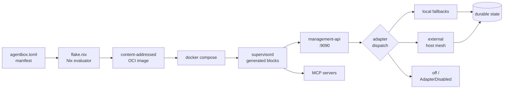

# Glossary and orientation

New to headless agent runtimes, Nix flakes, or the adapter pattern? Read this
before the [quickstart](quickstart.md). It gives you the vocabulary and the
mental model the rest of the docs assume.

## Is agentbox for you?

- You probably want agentbox if: you run more than one agent CLI, you need
  reproducible container builds, you want to deploy agents on a remote VM or in
  a host container mesh, or you want durable memory and task receipts that
  survive restarts.
- You probably don't need agentbox if: you only use one agent CLI on one
  laptop, you are happy wiring `.env` and storage by hand, and you never deploy
  remotely. Running the CLI natively is simpler in that case.
- You might want something else if: you want a consumer chat UI (try
  [Claude Desktop](https://claude.ai/download)); you want a per-project dev
  environment with VS Code (try
  [Devcontainers](https://containers.dev/)); you want inline agent
  orchestration inside Python (try
  [LangChain](https://python.langchain.com/) or
  [LangGraph](https://langchain-ai.github.io/langgraph/)).
- You might want both if: you use Claude Desktop on your laptop and want an
  always-on agent host for long-running autonomous work, with the same keys and
  skills on both. Agentbox is the server side of that split.

## The mental model in 60 seconds

Agentbox is a single Linux container whose entire shape is declared in one
TOML file. That manifest is read by a Nix flake, which builds a reproducible
OCI image. The image boots under supervisord, which starts only the services
the manifest asked for. Agents running inside the container reach durable
state through five pluggable adapters (beads, pods, memory, events,
orchestrator); each adapter resolves to a local fallback, an external
endpoint, or off. No installers run at boot. Every dispatch emits a trace, a
log line, and a metric.

## Glossary (A-Z)

- **Adapter** — a swappable backend for one of the five durable-state slots
  (beads, pods, memory, events, orchestrator). Every adapter has three
  implementations: `local-*`, `external`, `off`. Defined canonically in
  [ADR-005](../reference/adr/ADR-005-pluggable-adapter-architecture.md).
- **Agent** — an autonomous software process that plans, calls tools, and
  edits files on your behalf. In agentbox, agents are shipped as CLIs (Claude
  Code, ruflo, Gemini, Codex) that run inside the container.
- **Agent container** — the single Linux container produced by an agentbox
  build. One container, one operator, possibly many profiles inside.
- **Bootstrap seal** — the one-shot sentinel file written at
  `/run/agentbox/bootstrap.done` once every required supervisord program has
  reached `RUNNING`. `/ready` returns green only after the seal exists. See
  the seal logic in [`config/seal-bootstrap.sh`](../../config/seal-bootstrap.sh).
- **Capability (Linux)** — a fine-grained slice of root privilege (e.g.
  `CAP_NET_ADMIN`). Agentbox drops them all by default (`cap_drop: [ALL]`)
  and re-adds only what a feature explicitly requires.
- **Compose** — short for docker compose. The generated `docker-compose.yml`
  wires the agentbox container, optional ollama sidecar, and any external
  endpoints. Never hand-edited; regenerated from the manifest.
- **Content-addressed image** — an OCI image whose tag is a hash of its
  contents. Two builds of the same manifest with the same `flake.lock`
  produce byte-identical image hashes.
- **DDD** — Domain-Driven Design. Used in agentbox for the canonical
  state-model specs under [`docs/reference/ddd/`](../reference/ddd/).
- **Embedded relay** — the optional `nostr-rs-relay` supervisord program on
  loopback `:7777`, turning the container into its own Nostr endpoint. Every
  accepted event is persisted to the pod mailbox. Spec:
  [ADR-009](../reference/adr/ADR-009-embedded-nostr-relay.md).
- **Embedding** — a fixed-length numeric vector representing a piece of text,
  used for semantic search. Agentbox uses MiniLM-L6-v2 (384-dim) for the
  embedded memory adapter.
- **Event inbox / outbox** — pod directories `events/inbox/` and `events/outbox/`
  under `pods/<npub>/`. The bridge writes signature-verified inbound Nostr
  events to inbox and lifts outbound messages from outbox for signing and
  publication. The pod is the source of truth; the relay is transport.
- **Fanout (external-fanout)** — whether the embedded relay also talks to the
  `NOSTR_RELAYS` list. `off` keeps the mesh local; `publish-only`,
  `subscribe-only`, and `bidirectional` vary the direction. Default `off`.
- **Federation (standalone vs client)** — the `[federation].mode` manifest
  key. `standalone` ships a complete product with local fallbacks; `client`
  federates with a host container mesh through adapter endpoints.
- **Flake** — a Nix build descriptor (`flake.nix` + `flake.lock`). Pure and
  hermetic: identical inputs produce identical outputs. Defined in
  [ADR-001](../reference/adr/ADR-001-nixos-flakes.md).
- **Hardened baseline** — the default security posture: non-root user
  `1000:1000`, `read_only: true`, `cap_drop: [ALL]`, `no-new-privileges`,
  `seccomp=default`, explicit tmpfs list. See
  [ADR-007](../reference/adr/ADR-007-runtime-contract-and-container-hardening.md).
- **Headless** — no graphical session by default. The container exposes HTTP
  probes and a management API; operators usually drive it over SSH, code-server
  or the optional VNC desktop.
- **HNSW** — Hierarchical Navigable Small World, the graph index used by
  some vector stores for fast approximate nearest-neighbour search. Agentbox's
  embedded memory adapter uses simpler in-process indexing; HNSW appears in
  the external pgvector path.
- **Ingress policy** — the admission rule for writes hitting the embedded
  Nostr relay. `allowlist` requires NIP-42 AUTH plus a pubkey on the allow
  list (safest); `signed-only` accepts any NIP-42-authenticated signer;
  `open` accepts anything (raises warning W030).
- **Hypercall** — term used loosely in some agent literature for a structured
  call from agent code into the container runtime. Agentbox does not
  implement hypercalls; all agent tool invocations happen over MCP.
- **LLM** — Large Language Model. Agentbox does not host LLMs itself; it
  either calls external providers (Anthropic, OpenAI, Google, Z.AI) or a
  local ollama sidecar when `[gpu].backend` selects one.
- **Manifest** — `agentbox.toml`. The single source of truth for what is
  built, what boots, and what is validated. See
  [configuration.md](configuration.md).
- **MCP** — Model Context Protocol, the standard JSON-RPC protocol agents use
  to call tools. Agentbox ships 13 MCP servers (Playwright, ImageMagick,
  QGIS, Blender, ComfyUI, etc.) as optional manifest-gated services.
- **Mesh** — a group of cooperating containers exchanging messages. Agentbox
  speaks to two kinds: the optional Nostr sovereign mesh (inter-agent) and an
  external host mesh (federated adapters).
- **Middleware** — a layer that wraps every adapter dispatch. Agentbox has
  two: observability (always on, [ADR-005](../reference/adr/ADR-005-pluggable-adapter-architecture.md))
  and the privacy filter (optional, [ADR-008](../reference/adr/ADR-008-privacy-filter-routing.md)).
- **Nix** — the package manager and build system that composes the agentbox
  image. Pinned by `flake.lock`; no Dockerfile exists.
- **NIP** — Nostr Implementation Possibility, the numbered specs that extend
  the base protocol. Agentbox uses NIP-01 (core), NIP-11 (relay info),
  NIP-17 (sealed DMs), NIP-40 (expiration / retention), NIP-42 (relay auth),
  NIP-98 (HTTP auth).
- **NIP-17** — sealed gift-wrap DMs (kind 1059). The recommended inbound
  channel for external agents messaging internal ones — payloads are
  encrypted to the recipient so relay operators cannot read them.
- **NIP-42** — relay-to-client AUTH handshake. The relay issues a challenge,
  the client replies with a signed event, and the relay admits the session.
  Required for the `allowlist` and `signed-only` ingress policies.
- **Nostr** — a simple open protocol for signed messages over relays. Agentbox
  uses it for the optional sovereign mesh: Nostr keypair as agent identity,
  NIP-98 for HTTP auth, relay pool for inter-agent events, and an optional
  embedded relay for external-agent messaging. See
  [developer/sovereign-mesh.md](../developer/sovereign-mesh.md) and
  [user/nostr-relay.md](nostr-relay.md).
- **OCI image** — Open Container Initiative image, the container format
  Docker and Podman consume. Agentbox outputs OCI images from Nix.
- **Observability** — the always-on telemetry stack: Prometheus metrics at
  `/metrics`, OpenTelemetry spans over OTLP, JSON structured logs on stdout.
  Only the exporter endpoints are optional.
- **OTLP** — OpenTelemetry Protocol, the wire format agentbox ships spans in.
  Configured via `[observability].otlp_endpoint`; empty means traces are
  dropped.
- **PII** — personally identifiable information. Agentbox can optionally
  redact it through the openai/privacy-filter sidecar before writing to
  durable adapters. See [privacy-filter.md](privacy-filter.md).
- **Pod mailbox** — the `events/inbox/` and `events/outbox/` subtrees of a
  sovereign pod. The bridge treats them as append-only content-addressed
  stores keyed by Nostr event id; this is the durability contract behind
  external-agent messaging. See
  [DDD-003](../reference/ddd/DDD-003-sovereign-messaging-domain.md).
- **Prometheus metric** — a time-series counter, gauge or histogram scraped
  from `/metrics`. Every adapter dispatch increments a counter and records
  duration.
- **read_only filesystem** — the container's root filesystem is mounted
  read-only; writable paths are explicit tmpfs entries plus mounted volumes.
- **RuVector** — the embedded vector retrieval engine used by the
  `embedded-ruvector` memory adapter. Per-session cache, not a durable store.
  See [ADR-002](../reference/adr/ADR-002-ruvector-standalone.md).
- **seccomp** — a Linux kernel feature that filters which system calls a
  process may make. Agentbox uses the Docker default profile.
- **Sidecar** — an auxiliary process running alongside the main service,
  typically on a loopback port. Agentbox has two optional sidecars: the
  privacy filter (`opf-router` on :9092) and the Nostr relay
  (`nostr-relay` on :7777). Each is gated on its own manifest block and
  adds nothing to the image when disabled.
- **Skill** — a self-contained package of instructions and tools an agent can
  load (e.g. `blender`, `latex`, `playwright`). Skills are progressive-
  disclosure: the agent reads the manifest, then loads only what it needs.
- **Skills corpus** — the 96-skill content-addressed Nix input copied into
  the image at `/opt/agentbox/skills`. Per-skill gating via `[skills.*]`.
  Migration path: [developer/skills-upgrade.md](../developer/skills-upgrade.md).
- **Solid pod** — a personal data store following the Solid protocol.
  Agentbox's default is [`solid-pod-rs`](https://github.com/DreamLab-AI/solid-pod-rs)
  on port 8484 — a first-party Rust Solid Protocol 0.11 server (WAC,
  LDP containers, Schnorr NIP-98, Solid Notifications 0.2, atomic-rename
  storage). The `pods` adapter can also federate with an external server or
  disable storage entirely. See [solid-pod.md](solid-pod.md) and
  [ADR-010](../reference/adr/ADR-010-rust-solid-pod-adoption.md).
- **Sovereign data stack** — the coherent identity-plus-data substrate every
  agentbox container owns end-to-end: secp256k1 keypair (identity),
  `solid-pod-rs` (durable storage + WAC 2.0 + `did:nostr` resolver),
  `nostr-rs-relay` (external-agent messaging + pod-inbox bridge),
  `openai/privacy-filter` (PII governance). With Sprint 6's `did:nostr`
  absorption, every layer references a single canonical identity:
  `did:nostr:<npub>`. No third-party broker. See the
  [README top section](../../README.md#sovereign-data-stack).
- **did:nostr** — the DID method (Tier 1 + Tier 3 with `alsoKnownAs`) that
  maps a Nostr npub to a resolvable DID document. Served by `solid-pod-rs`
  at `GET /did:nostr:<npub>` after the Sprint 6 upstream absorption
  ([ADR-010 §Upstream absorption log](../reference/adr/ADR-010-rust-solid-pod-adoption.md#upstream-absorption-log-sprint-5-9)).
  WAC policies can reference the DID directly; the pod validates against
  the same key the relay accepted under NIP-42.
- **Sovereign mesh** — the optional Nostr-based identity and event layer.
  Sovereign because each container owns its own cryptographic keypair.
- **supervisor / supervisord** — the process manager that starts the
  management-api, MCP servers, desktop, and any enabled sidecars inside the
  container. Its config is generated from the manifest by `flake.nix`.
- **tmpfs** — an in-memory filesystem. Writable scratch paths (`/tmp`,
  `/run`, per-profile caches) are declared as tmpfs entries under the
  hardened baseline.
- **TUI** — text-based user interface. Agentbox ships one under
  `scripts/start-agentbox.sh` for manifest editing and a Zellij layout
  preset for terminal work.
- **wayvnc** — a VNC server for Wayland. Used when `[desktop].enabled = true`
  and `[desktop].stack = "hyprland-wayland"`; exposed on port 5901.
- **workspace mount** — the shared host-mounted volume at `/workspace` (plus
  `/projects`). All profiles see the same content. Profile-local state lives
  under `/workspace/profiles/<stack>/`.
- **zellij** — the terminal workspace multiplexer agentbox uses in place of
  tmux. `zclaude`, `zruflo`, `zqe`, `zdocs` launch pre-built layouts.

## Common confusions

**Is this a Docker image or a VM?**
It is a Docker/OCI image. No kernel, no hypervisor, no VM. The manifest drives
a Nix build that outputs an OCI image tarball; `docker load` imports it and
`docker compose up` runs it. Multi-arch builds are published to GHCR.

**Why does the feature list look huge? Won't my image be enormous?**
Only features enabled in `agentbox.toml` contribute to the image. The base
runtime target is under 4 GB compressed; a full CUDA image stays under 25 GB.
Disabled skills, toolchains, and providers are not compiled in. Goals are
listed in [PRD-001 §8](../reference/prd/PRD-001-capabilities-and-adapters.md).

**Can I use this without Nix?**
You can consume prebuilt images from GHCR (`ghcr.io/dreamlab-ai/agentbox`)
without installing Nix. You only need Nix if you want to rebuild from the
manifest. See [installation.md](installation.md).

**What's the difference between agentbox, Claude Code, and ruflo?**
Claude Code is one agent CLI from Anthropic. Ruflo is an orchestrator that
coordinates multiple agents. Agentbox is the container runtime that hosts
both of them (plus Gemini, Codex, Z.AI) behind one management API, with
shared skills, memory, and durable state.

**Why can't I just install packages at boot?**
Immutable boot is a design rule, not an oversight. Deferred install makes
boot depend on upstream registries and network timing, and hides packaging
regressions behind `|| true`. The decision is recorded in
[ADR-006](../reference/adr/ADR-006-immutable-runtime-bootstrap.md); every
runtime dependency must be baked into the image.

**Why does the adapter say "off" - is the feature broken?**
No. `off` is a legal implementation class for every slot. Consumers receive
`AdapterDisabled` and must handle it gracefully. Typical use: ephemeral CI
workers that do not need pods, or a profile that deliberately skips events.

**Why is Nostr involved - do I need a relay account?**
No account is required. Nostr is used for cryptographic identity (a keypair
you own) and optional message relay. If `[sovereign_mesh].enabled = false`,
no relays are contacted. If enabled, you configure `NOSTR_RELAYS`; any public
relay will do.

**What is the privacy filter for, and do I need it?**
It is an optional local PII-redaction sidecar that sits as middleware on
every adapter dispatch. You need it if agents handle user data that must not
be embedded verbatim into memory or leaked into logs. It is disabled by
default; enable it via `[privacy_filter].enabled = true`. See
[privacy-filter.md](privacy-filter.md) and
[ADR-008](../reference/adr/ADR-008-privacy-filter-routing.md).

**What is the Nostr relay for, and do I need it?**
It is an optional embedded relay (`nostr-rs-relay`, Apache-2.0) that lets
external humans and agents send signed, authenticated messages to internal
agents, and gives internal agents a durable outbound path. Every accepted
event is persisted to `pods/<npub>/events/inbox/`; every outbox entry ends
up in the pod with a stamped event id. You need it if you federate two or
more agentbox containers, or you want external clients (Damus, Amethyst,
bespoke scripts) to message the agents inside yours. Disabled by default.
See [nostr-relay.md](nostr-relay.md) and
[ADR-009](../reference/adr/ADR-009-embedded-nostr-relay.md).

**What is solid-pod-rs and why is it the default?**
`solid-pod-rs` is the first-party Rust Solid Protocol 0.11 server that powers
the `pods` adapter. It replaces the legacy 108-line Python stub that only
implemented GET/PUT/HEAD with no WAC enforcement. With solid-pod-rs the
`.acl.json` policies written by `sovereign-bootstrap.py` actually apply,
LDP containers work, PATCH works (N3 / SPARQL / JSON), Solid Notifications
fire on writes, and atomic-rename durability makes [ADR-009](../reference/adr/ADR-009-embedded-nostr-relay.md)
pod-inbox invariants hold for real. The legacy stub stays as `local-jss`
with W034 warnings for anyone relying on the old behaviour. See
[solid-pod.md](solid-pod.md) and [ADR-010](../reference/adr/ADR-010-rust-solid-pod-adoption.md).

**What is the difference between the sovereign mesh and the Nostr relay?**
The sovereign mesh (`[sovereign_mesh].enabled`) gives the container its own
Nostr keypair and a client that can publish to external relays. The embedded
relay (`[sovereign_mesh.relay].enabled`) is the server side: it accepts
inbound events *at* the container. You can run the mesh without the relay
(identity only), the relay without the mesh (edge case), or both together
(full peer).

## Where to go next

| If you are a... | Go to |
|---|---|
| Operator who wants to run agentbox | [quickstart.md](quickstart.md) |
| Operator tuning the build | [configuration.md](configuration.md) |
| Operator on a specific host | [running.md](running.md) and [platforms.md](platforms.md) |
| Operator debugging a failure | [troubleshooting.md](troubleshooting.md) |
| Operator setting up external-agent messaging | [nostr-relay.md](nostr-relay.md) |
| Operator enabling PII redaction | [privacy-filter.md](privacy-filter.md) |
| Operator tuning the Solid pod | [solid-pod.md](solid-pod.md) |
| Contributor changing agentbox | [developer/architecture.md](../developer/architecture.md) |
| Contributor adding an adapter | [developer/adapters.md](../developer/adapters.md) |
| Spec reader | [reference/prd/PRD-001-capabilities-and-adapters.md](../reference/prd/PRD-001-capabilities-and-adapters.md) |
| Adapter deep-dive | [reference/adr/ADR-005-pluggable-adapter-architecture.md](../reference/adr/ADR-005-pluggable-adapter-architecture.md) |
| Sovereign messaging deep-dive | [reference/adr/ADR-009-embedded-nostr-relay.md](../reference/adr/ADR-009-embedded-nostr-relay.md) and [reference/ddd/DDD-003-sovereign-messaging-domain.md](../reference/ddd/DDD-003-sovereign-messaging-domain.md) |
