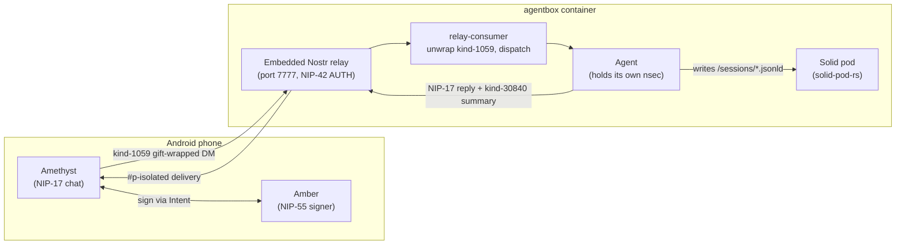
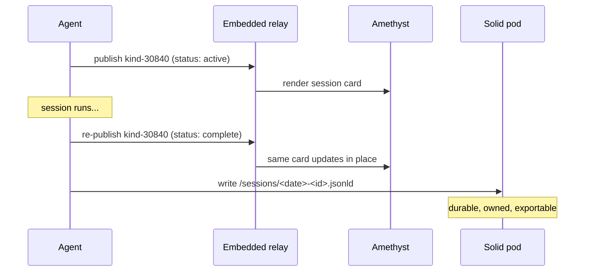

# Mobile bridge — talk to your agents from an Android phone

The mobile bridge turns a stock Android Nostr client into a rich, interactive
surface onto the agents running inside your agentbox container. You chat to an
agent over encrypted DMs, it acts, and it streams its turn output, session
start/end, and work summaries back to your phone — all over Nostr, signed and
authenticated end to end.

This replaces the one-way Telegram mirror with a two-way, `did:nostr`-native
channel that needs **no bespoke mobile app** and never exposes your agent's
private key to the phone.

> **Status.** This guide describes Phase 1 (direct connection to the agentbox
> embedded relay). Phase 2 (federation via the DreamLab Cloudflare relay) is a
> configuration change, summarised under [Phasing](#phasing-phase-1-vs-phase-2).

## Why this exists

Before the bridge, the only mobile view of a running agent was a read-mostly
Telegram mirror. It could not authenticate against the `did:nostr` identity the
rest of the stack uses, it leaked metadata, and it gave the operator no
sovereign record of what the agent did.

The bridge fixes all three:

- **Two-way and interactive.** Send a NIP-17 DM, the agent dispatches on it and
  replies. Ad-hoc chat *and* structured session management from the same surface.
- **`did:nostr`-native auth.** The phone holds its own key and authorises against
  your admin pubkey — the same identity primitive the relay, pod, and privacy
  filter already speak. No chat-membership shimming.
- **Sovereign session records.** Each session is summarised, published as a
  browsable Nostr event *and* written to your Solid pod as a durable, exportable,
  user-owned record.

## What you get

- **Encrypted ad-hoc chat** with any agent (NIP-17 / NIP-44 v2 / NIP-59 gift wrap).
- **Outbound mirroring** — turn output, session start/end, and optional tool
  activity delivered to your phone as DMs.
- **Session summaries** — one addressable `kind-30840` event per session,
  rendered by any Nostr client, updated in place as the session progresses.
- **A sovereign pod copy** of every summary, owned and controlled by you.
- **Key isolation** — your phone signs with an external signer (Amber); the key
  never enters the chat app, and your agent's key never leaves the container.

## Architecture at a glance



Two properties carry the whole design:

- **The phone is a pure Nostr citizen.** It speaks Nostr and nothing else — no
  Solid, no WAC, no LDP. Any client with NIP-17 / NIP-42 / NIP-55 works.
- **The agent owns the pod, the phone never touches it.** The pod-write boundary
  is entirely on the agent side, which is what lets you pick any Android client
  you like.

## Two things the phone never does

1. **It never holds your agent's nsec.** The phone has its *own* independent
   keypair. It is authorised by a short-lived [NIP-26](https://github.com/nostr-protocol/nips/blob/master/26.md)
   delegation signed by your admin key. The admin nsec stays in the container.
2. **It never writes to your Solid pod.** The agent writes session records under
   its own identity, backed by a one-time WAC mandate you install. A stock Nostr
   client has zero Solid responsibility.

## Android onboarding

You need two apps and about ten minutes. The messaging crypto on the agent side
is provided by the first-party [`nostr-bbs-core`](https://github.com/DreamLab-AI/nostr-rust-forum)
crate (the same NIP-44/59 implementation that runs under the forum and relay) —
nothing to install for that; it ships with agentbox.

### 1. Install the apps

- **[Amethyst](https://github.com/vitorpamplona/amethyst)** — the chat client.
  It has the most complete NIP-17/44/59 support of any Android client.
- **[Amber](https://github.com/greenart7c3/Amber)** — the NIP-55 external signer.
  It holds your phone key in a separate process and signs over Android `Intent`;
  the key never enters Amethyst's address space.

> DM-first alternative: **0xchat** + Amber works identically if you prefer a
> focused control channel over Amethyst's broad social feed.

### 2. Generate the phone key in Amber

In Amber, create a **new** identity. This keypair belongs to the phone alone —
do **not** import your agent's nsec. Copy the phone's public key (npub); you will
hand it to the operator step below.

### 3. Operator issues a NIP-26 delegation

On the agentbox host, issue a delegation authorising the phone key to act on your
behalf for chat, with a short, bounded window:

```sh
# Issue a 7-day delegation for NIP-17 chat kinds to the phone pubkey
agentbox mobile-bridge delegate \
  --to <phone_pubkey_hex> \
  --kinds 14,1059 \
  --ttl 7d
```

This prints a delegation tag signed by your admin key. The conditions restrict it
to the chat kinds and the time window — the phone cannot use it to do anything
else, and it expires automatically. Re-run to reissue; there is no separate
revocation step in Phase 1 (see [Permission model](#permission-model)).

Install the delegation tag into Amber so it is appended to every event the phone
signs.

### 4. Allowlist the phone pubkey on the relay

The embedded relay is allowlist-gated. Add the phone key so the relay accepts its
NIP-42 AUTH:

```toml
[sovereign_mesh.relay]
allowed_pubkeys = ["<phone_pubkey_hex>"]
```

Rebuild, or add it live with the management-api if your deployment exposes that
route. See [nostr-relay.md](nostr-relay.md) for the relay's ingress model.

### 5. Connect Amethyst to the relay

Point Amethyst at the agentbox relay. In Phase 1 the relay is reached over a
**private overlay** — a Tailscale/WireGuard address or a Cloudflare Tunnel — not
the public internet:

```
ws://<overlay-host>:7777
```

Amethyst will perform NIP-42 AUTH using the phone key (signed by Amber). The
relay challenges on connect; once the phone key is allowlisted (step 4) the AUTH
succeeds.

### 6. Send your first message

Open a DM in Amethyst to your **agent's** npub. Type a message. Behind the scenes
Amethyst seals it (kind-13), gift-wraps it (kind-1059), and the relay delivers it
`#p`-isolated to the agent. The agentbox relay-consumer unwraps it, the agent
dispatches on it, and the reply comes back as a NIP-17 DM in the same thread.

That is the full loop: **phone → relay → agent → reply**.

## Session summaries

The bridge gives you "manage sessions via summaries" — something the Telegram
mirror never did. Each agent session is represented by one **`kind-30840`** event:

- **Addressable.** The event's `d` tag is the session id, so as the session moves
  `active → complete` the *same* record updates in place — no duplicate entries
  cluttering your feed.
- **Readable in any client.** The summary content (title, work summary, tool-call
  count, outcome) renders in Amethyst or any Nostr client. Your phone reads it
  directly; no Solid-aware app required.
- **Durably yours.** The same summary is written to your Solid pod at
  `/sessions/<iso-date>-<session-id>.jsonld`, carrying your `owner_did`, a link to
  the agent's activity record, and the URNs of resources the agent created or
  modified. The pod copy is the canonical, exportable, user-owned record; the
  Nostr event is the phone-readable projection.



The summary content is **not encrypted** in Phase 1 — it is intended to be
operator-readable in any client, and the embedded relay is whitelist-gated. If
session text becomes sensitive, it can be wrapped in NIP-44 later.

## Permission model

An inbound message reaches an agent only if, **after** its Schnorr signature is
verified, the author is one of:

1. your operator/admin pubkey (`AGENTBOX_X_ONLY_PUBKEY_HEX`), or
2. an entry in `[sovereign_mesh.multi_user] admin_pubkeys`, or
3. a key bearing a valid NIP-26 delegation (step 3 above) from (1) or (2).

Signature verification always precedes authorisation — a forged event is rejected
before its pubkey is even consulted.

**Revocation is window-bounded.** NIP-26 has no explicit revoke. The delegation
window is therefore short (recommend ≤ 7 days) and reissued on demand. To cut off
a lost phone immediately, stop reissuing and let the window expire, or remove the
phone pubkey from the relay allowlist for an instant cutoff.

## Configuration

```toml
[sovereign_mesh]
enabled        = true
nostr_bridge   = true

[sovereign_mesh.relay]
enabled         = true
port            = 7777
ingress_policy  = "allowlist"
allowed_pubkeys = ["<phone_pubkey_hex>"]
allowed_kinds   = [14, 15, 1059, 30840, 27235]   # chat + summaries + auth

[sovereign_mesh.mobile_bridge]
enabled            = true
phone_pubkeys      = ["<phone_pubkey_hex>"]   # outbound mirroring targets
delegation_ttl     = "7d"                      # default NIP-26 window
mirror_tool_calls  = false                     # verbose: stream tool activity
summary_source     = "transcript_summary"      # kind-30840 content source
pod_dual_write     = true                       # also write /sessions/*.jsonld
```

Notes:

- `allowed_kinds` adds **14/15** (NIP-17 chat/file rumors) and **30840** (session
  summaries) to the relay's accept list. Kind **1059** (gift wrap) is the carrier.
- `summary_source = "transcript_summary"` uses Claude Code's own `Stop`-hook
  summary at zero token cost. A richer dedicated summarisation pass is an optional
  upgrade.
- `pod_dual_write = true` requires the agent to hold a WAC mandate on your pod's
  `/sessions/` container — installed once at onboarding. Without it, pod writes
  return 403 and only the relay copy persists.

## Phasing — Phase 1 vs Phase 2

| | Phase 1 (now) | Phase 2 (later) |
|---|---|---|
| Transport | Phone → agentbox embedded relay, direct | Phone → DreamLab Cloudflare relay → agentbox |
| Exposure | Private overlay (Tailscale / WireGuard / CF Tunnel) | Public CF Worker, whitelist-gated |
| Durable chat | Not stored in agentbox; the durable record is the summary + pod | CF Durable Object retains kind-1059 (a config flag) |
| Forum interop | None | None at this time (kept additive) |

Phase 2 is mostly configuration on an already-built (dormant) federation
framework — switch the CF relay to federated mode, add the agentbox relay as a
peer, and add kinds 14/15/30840 to the federated set. It needs no change to the
DM scheme or your phone setup.

> **agentbox stores no chat transcript.** The agent unwraps and dispatches; it
> does not build a durable chat store. The Phase 1 durable record is the
> `kind-30840` summary plus the pod resource — not the raw chat. NIP-17 DMs are
> conventionally ephemeral; where durable chat is wanted (Phase 2), the
> Cloudflare relay's Durable Object already persists kind-1059 transactionally.

## Common gotchas

- **AUTH rejected on connect.** The phone pubkey is not on the relay allowlist
  (step 4), or the delegation window has expired (reissue, step 3).
- **Messages arrive but the agent never replies.** The author failed the
  permission check — confirm the delegation tag is installed in Amber and that
  the delegator is in your admin set.
- **No session summary on the phone.** `kind-30840` is not in `allowed_kinds`, or
  `mobile_bridge.enabled = false`. Add the kind and enable the bridge.
- **Pod write 403s.** The agent lacks the WAC mandate on `/sessions/`. Install the
  one-time mandate during onboarding; the relay copy is unaffected.
- **"Cannot connect" from the phone.** The relay is on a private overlay by
  design. Make sure the phone is on the same Tailscale/WireGuard network or that
  the Cloudflare Tunnel is up — the relay is not on the public internet in Phase 1.

## Further reading

- [Nostr relay — how external agents reach internal ones](nostr-relay.md) — the
  embedded relay this bridge rides on.
- [Solid pod (solid-pod-rs)](solid-pod.md) — where session summaries are durably
  owned.
- [Sovereign stack — end to end](sovereign-stack.md) — identity → pod → relay in one walkthrough.
- [Developer: sovereign mesh internals](../developer/sovereign-mesh.md) — the
  decrypt-at-dispatch wiring and NIP-26 validation.
- [NIP-17 sealed DMs](https://github.com/nostr-protocol/nips/blob/master/17.md) ·
  [NIP-26 delegation](https://github.com/nostr-protocol/nips/blob/master/26.md) ·
  [NIP-55 Android signer](https://github.com/nostr-protocol/nips/blob/master/55.md)
- [Amethyst](https://github.com/vitorpamplona/amethyst) ·
  [Amber](https://github.com/greenart7c3/Amber)
