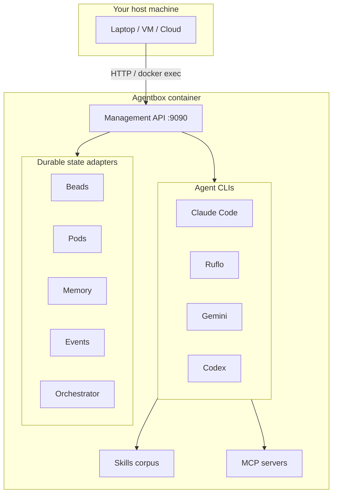
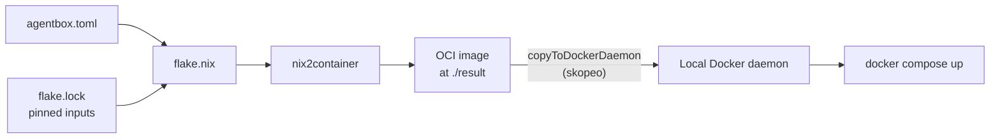
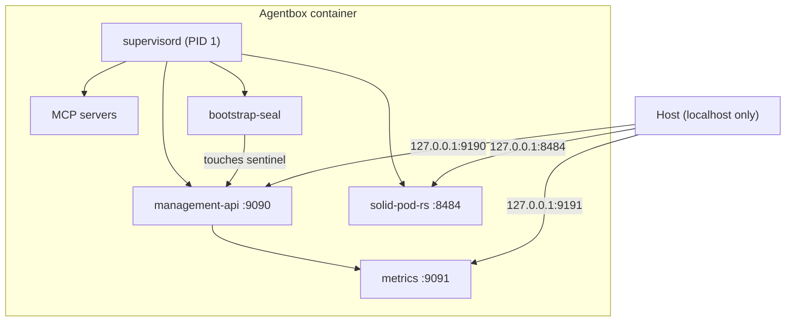
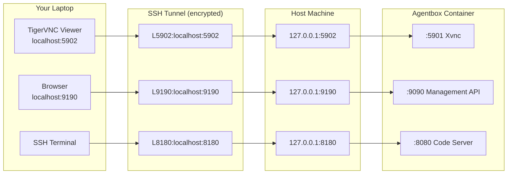

# Quick Start

New to headless agent runtimes? Start with the [glossary](glossary.md) first.

This guide reflects the current Agentbox runtime.

## Why this exists

Agentbox is a self-contained Linux container that runs coding agents (Claude Code, Ruflo, Gemini, Codex and friends) behind a single management API. Think of it as a shared workstation for agents: one image carries the CLIs, skills, MCP servers and durable-state adapters, and you drive it from your laptop, a remote VM, or a cloud provider. Compared to running agents directly on your machine, Agentbox keeps keys, state, skill trees and model endpoints behind one switchable configuration file.



**What it solves**

- Agents losing their memory, beads and pod state between sessions because each CLI stashes things in its own home directory.
- API keys leaking into shell history, Dockerfiles and git diffs instead of living in one `.env`.
- Boot cycles spending minutes downloading npm, pip and model weights every restart — Agentbox bakes them into the image.
- Swapping agent backends (local SQLite vs a federated host mesh) without rewriting orchestration code.

**When to skip this**: if you only need a single agent CLI on a single machine and are comfortable wiring its storage and keys by hand, running the CLI natively is simpler. Agentbox earns its keep once you want more than one agent, reproducible storage, or remote deployment.

## Recommended Path

Use the interactive launcher unless you specifically want to edit files by hand:

```bash
./scripts/start-agentbox.sh
```

The launcher is a section-by-section wizard (whiptail TUI, plain-text fallback when
whiptail is absent). It walks through every manifest section in order and validates
your choices after each one — you cannot advance past validation errors.

Sections covered:

```mermaid
flowchart LR
    S1["1 Federation"] --> S2["2 Adapters"]
    S2 --> S3["3 GPU"]
    S3 --> S4["4 Desktop"]
    S4 --> S5["5 Toolchains"]
    S5 --> S6["6 Skills"]
    S6 --> S7["7 Providers"]
    S7 --> S8["8 Observability"]
    S8 --> S9["9 Integrations"]
    S9 --> S10["10 Sovereign mesh"]
    S10 --> S11["11 Summary + action"]
    S11 -->|"validate"| V{{"agentbox-config-validate.js"}}
    V -->|"errors"| S1
    V -->|"clean"| DONE["Save / Build / Start"]
```



1. **Federation** — `standalone` (self-contained, local fallbacks) or `client` (federated with host mesh). If `client`, prompts for `external_url`.
2. **Adapters** — one radio menu per slot: `beads`, `pods`, `memory`, `events`, `orchestrator`. Each shows the schema-exact enum values for that slot.
3. **GPU backend** — `none` / `ollama-rocm` / `ollama-cuda` / `local-cuda`. The wizard auto-detects `nvidia-smi` and `rocm-smi` and pre-selects the appropriate default.
4. **Desktop** — enable toggle, stack radio (`hyprland-wayland` / `x11-openbox`), resolution input.
5. **Toolchains** — scrollable checklist of all 11 toolchain flags.
6. **Skills** — five grouped checklists: browser, media, spatial+3D, data science, docs+ontology.
7. **Providers** — checklist to enable providers; for each enabled provider a redacted password field collects the API key and writes it to `.env`.
8. **Observability** — `metrics_port` input, `otlp_endpoint` input, `log_level` radio.
9. **Integrations** — ComfyUI external, RuVector external (only when `adapters.memory=external-pg`), RagFlow (only when the `visionclaw_network` network is detected).
10. **Sovereign mesh** — full checklist of Nostr/pod/bridge/telegram flags.
11. **Summary + action** — read-only summary of the full manifest, confirmation prompt, then a choice: save only / build image / build+start / start stack.

After each section the wizard runs `scripts/agentbox-config-validate.js` against the
in-progress manifest. Any E001-E031 errors (or W021/W030 warnings) appear in a message box and the section
loops for correction before you can proceed.

The configuration is written atomically — staged in a temp file, validated, then
moved into place. You are asked to confirm before the file is overwritten.

**Validate-only mode** (CI / pre-commit use):

```bash
./scripts/start-agentbox.sh --validate-only
```

Runs the validator against the existing `agentbox.toml` and exits with the validator's
exit code (0 = clean, 1 = errors). No TUI is opened.

## 1. Configure The Build

Manual path:

Edit [`agentbox.toml`](../../agentbox.toml) before building. This file is the single manifest: the Nix build reads it, the compose generator reads it, and the runtime validator enforces it. Every feature you see in the wizard maps to a key here.

Key sections:

- `[federation]` — `mode = "standalone"` (default; the container is complete on its own) or `"client"` (federates with an external host mesh through adapter endpoints).
- `[adapters]` — one per durable-state slot (beads, pods, memory, events, orchestrator). An `adapter` is the pluggable-backend pattern from [ADR-005](../reference/adr/ADR-005-pluggable-adapter-architecture.md): each slot resolves to `local-*`, `external`, or `off`, so you can run fully self-hosted or delegate to a host-mesh without changing code.
- `[sovereign_mesh]` — Nostr identity + NIP-98 auth
- `[skills.*]` — 96-skill catalogue gates
- `[toolchains]` — core CLIs (claude, ruflo, claude_flow, agentic_qe, gemini_cli, etc.)
- `[gpu]` — `none` (default, no ollama sidecar) | `ollama-rocm` (ROCm/Vulkan via `/dev/kfd`+`/dev/dri`) | `ollama-cuda` (NVIDIA container runtime, sidecar only) | `local-cuda` (CUDA baked into image; required for `gaussian_splatting`)
- `[desktop]` — TigerVNC Xvnc desktop (access via SSH tunnel to port 5902)
- `[observability]` — metrics port, OTLP endpoint, log level
- `[providers.*]` — per-provider API-key gates

Minimal example (standalone, local fallbacks for everything):

```toml
[federation]
mode = "standalone"

[adapters]
beads = "local-sqlite"
pods = "local-solid-rs"                # only first-party impl (ADR-010); legacy local-jss removed 2026-04-25
memory = "embedded-ruvector"
events = "local-jsonl"
orchestrator = "local-process-manager"

[sovereign_mesh]
enabled = true

[skills.browser]
playwright = true

[toolchains]
claude = true
claude_code = true
ruflo = true
agentic_qe = true

[gpu]
backend = "none"
```

Federated example (drops into a host container mesh):

```toml
[federation]
mode = "client"
external_url = "http://host-orchestrator:7070"

[adapters]
beads = "external"
pods = "external"
memory = "external-pg"
events = "external"
orchestrator = "stdio-bridge"

[integrations.ruvector_external]
enabled = true
conninfo = "postgresql://ruvector@ruvector-postgres:5432/ruvector"
```

Always run `agentbox config validate` after editing — it checks semantic rules (e.g. `gaussian_splatting = true` requires `gpu.backend = "local-cuda"`) before the build.

### Ontology skill gate (prepared placeholder)

```toml
[skills.ontology]
enabled = false   # default — ontology-core + ontology-enrich are not loaded
```

Set `enabled = true` to load the `ontology-core` and `ontology-enrich` skills into the agent's skill surface. These skills target Logseq OWL2 DL TBox workflows and are opt-in because they carry specific domain assumptions (Logseq graph conventions, OWL2 DL reasoner tooling). When `enabled = false` (the default) neither skill is registered and no extra tooling is pulled into the image.

This gate is a **prepared placeholder** — the MCP server and associated tooling for ontology operations will be fleshed out in a future milestone. Enabling the flag now has no runtime effect beyond advertising the skills in the manifest; downstream agents that check the manifest before loading skills will respect it once the implementation lands.

## 2. Build The Image

Agentbox is built with Nix (a reproducible package manager). The `flake.nix` file composes packages, skills and toolchains into a Docker image based on your manifest — no Dockerfile, no layer drift between rebuilds. `nix build .#runtime` produces a [nix2container](https://github.com/nlewo/nix2container) OCI manifest at `./result`; the runtime exposes a `copyToDockerDaemon` helper that loads the image into the local Docker daemon via skopeo (no intermediate tarball, no layer copies).



```bash
nix build .#runtime
nix run .#runtime.copyToDockerDaemon
```

Optional variants:

```bash
nix build .#desktop
nix build .#full
```

## 3. Configure Environment

Manual path:

```bash
cp .env.example .env
```

Provider API keys are gated by `[providers.*]` sections in `agentbox.toml`.
Only set the env vars for providers you have enabled — the validator (E017) will
warn at boot for any enabled provider whose env var is missing.

1. In `agentbox.toml`, set `enabled = true` for each provider you want:

   ```toml
   [providers.anthropic]
   enabled = true
   env_var = "ANTHROPIC_API_KEY"
   ```

2. In `.env`, fill in the corresponding value:

   ```
   ANTHROPIC_API_KEY=sk-ant-...
   ```

Infrastructure vars (always required regardless of providers):

- `MANAGEMENT_API_KEY` — API key for the management HTTP API
- `AGENTBOX_AGENT_ID` — stable identity label for this instance
- `NOSTR_RELAYS` — comma-separated Nostr relay URLs
- `WORKSPACE` — shared workspace mount path
- `SHARED_PROJECTS_ROOT` — shared projects mount path

For the full provider reference, optional overrides, and instructions for adding
new providers see [`docs/guides/providers.md`](providers.md).

## 4. Start The Stack

The preferred boot path uses `agentbox.sh up`, which starts the stack and blocks until the management API health endpoint responds (or times out after 60 s):

```bash
./agentbox.sh up
```

If you just rebuilt the Nix image and need to load it before starting:

```bash
./agentbox.sh up --build
```

Direct compose is also fine for simple cases, but you will need to poll health manually:

```bash
docker compose up -d
```

For a full dev-loop iteration (stop existing stack, rebuild image, restart):

```bash
./agentbox.sh rebuild
```

## 5. Verify Host-Level Container State

Use `agentbox.sh health` to get a per-service status summary:

```bash
./agentbox.sh health          # pretty-print; exits non-zero if any service is degraded
./agentbox.sh health --json   # raw JSON; always exits 0
```

Low-level Docker commands for deeper inspection:

```bash
docker compose ps
docker logs --tail 100 agentbox
docker inspect --format '{{json .State.Health}}' agentbox
```

If the container is using an older image or an older entrypoint, use `agentbox.sh rebuild` to rebuild and recreate it.

## 6. Verify Runtime Services

The runtime exposes a small set of HTTP endpoints for liveness, readiness and metrics. These replace the usual "did the container boot?" guesswork with concrete signals. `/ready` goes green only after every required programme reaches RUNNING and the `bootstrap-seal` sentinel writes `/run/agentbox/bootstrap.done` — see [ADR-006](../reference/adr/ADR-006-immutable-runtime-bootstrap.md) for the bootstrap contract.



From the host:

```bash
# Via SSH tunnel (ports are localhost-only on host)
curl http://localhost:9190/health
curl http://localhost:9190/v1/meta        # adapter contract versions + image hash
curl http://localhost:9191/metrics        # Prometheus — scrape this
curl http://localhost:8484/health         # solid-pod-rs
```

From inside the container:

```bash
docker exec agentbox supervisorctl status
docker exec agentbox tmux -V
docker exec -it agentbox tmux attach -t agentbox
docker exec agentbox ls -la /workspace/profiles
docker exec agentbox ls -la /projects
```

## 7. Remote Access & Security

All agentbox ports bind to `127.0.0.1` on the host — they are **not** exposed to the network. Remote access uses SSH tunnels, which provides authentication and encryption without additional VNC passwords or TLS certificates.



### Connect via SSH tunnel

Open all tunnels in one command:

```bash
ssh -L 5902:localhost:5902 \
    -L 9190:localhost:9190 \
    -L 8180:localhost:8180 \
    -L 8484:localhost:8484 \
    -N machinelearn@YOUR_HOST_IP
```

Or use the built-in helper:

```bash
./agentbox.sh all    # opens VNC + code-server + API + CDP tunnels
./agentbox.sh vnc    # VNC tunnel only
```

### VNC desktop

Once the tunnel is open, connect your VNC client to `localhost:5902`:

```bash
vncviewer localhost:5902          # TigerVNC
open vnc://localhost:5902         # macOS Screen Sharing
```

The desktop runs TigerVNC Xvnc with `-SecurityTypes None` (no VNC password) and `-localhost` (container-internal only). Security is provided by the SSH tunnel — no unauthenticated network access is possible.

### Port reference

| Service | Container Port | Host Binding | Access |
|---------|---------------|-------------|--------|
| Management API | 9090 | 127.0.0.1:9190 | SSH tunnel, NIP-98 auth |
| VNC Desktop | 5901 | 127.0.0.1:5902 | SSH tunnel |
| Code Server | 8080 | 127.0.0.1:8180 | SSH tunnel |
| Solid Pod | 8484 | 127.0.0.1:8484 | SSH tunnel, WAC auth |
| SSH | 22 | 127.0.0.1:2223 | Direct SSH |
| Agent Events | 9700 | 127.0.0.1:9700 | SSH tunnel |
| Prometheus | 9091 | 127.0.0.1:9191 | SSH tunnel |

All ports are localhost-only on the host. The only way in from the network is through SSH authentication to the host machine.

## 8. Inspect Provisioned Profiles

The runtime creates these profile roots:

- `/workspace/profiles/claude-core`
- `/workspace/profiles/ruflo-orchestrator`
- `/workspace/profiles/qe-fleet`
- `/workspace/profiles/nagual-qe`
- `/workspace/profiles/rust-builder`
- `/workspace/profiles/docs-latex`

Each one should expose:

- `.claude/settings.json`
- `.claude/skills -> /opt/agentbox/skills`
- `projects -> /projects`
- `workspace -> /workspace`

## 8. Storage Paths

- RuVector: `/var/lib/ruvector`
- Solid-style pod storage: `/var/lib/solid`
- Sovereign identities: `/var/lib/agentbox/identities`
- Shared workspace: `/workspace`
- Shared external projects: `/projects`

## 9. Terminal Workflow

Inside the container:

```bash
zclaude
zruflo
zqe
zdocs
```

Those commands open the seeded tmux windows for the main stacks.

## Troubleshooting

### Docker is running but the container is unhealthy

Check whether the container is still an older image using the old keepalive-only supervisor config.

### `9090` health checks fail

The management API may not be running in the current container image, or the container may be older than the repo state.

### Profile directories are missing

Check the entrypoint and logs:

```bash
docker logs agentbox
docker exec agentbox ls -la /workspace
```

### Solid or RuVector paths do not exist

Verify the volumes are mounted and the entrypoint bootstrap ran successfully.
