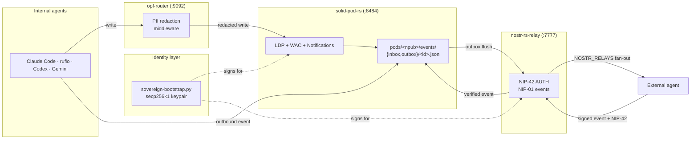

# Solid pod — the durable half of the sovereign data stack

Agentbox's `pods` adapter slot is backed by a first-party Rust Solid Protocol
0.11 server, [`solid-pod-rs`](https://github.com/DreamLab-AI/solid-pod-rs).
It is the durable-storage layer of the
[sovereign data stack](../../README.md#sovereign-data-stack) — a coherent
identity-plus-data substrate that lets external agents reach internal ones,
and lets internal agents persist their state, without any third-party broker.

Canonical spec: [ADR-010](../reference/adr/ADR-010-rust-solid-pod-adoption.md).

## Why this matters

A pod holds everything durable an agent produces or receives: briefs,
debriefs, artefacts, system prompts, **and** the inbox/outbox mailboxes
that back [ADR-009 external-agent messaging](../reference/adr/ADR-009-embedded-nostr-relay.md).
Every `pods/<npub>/events/inbox/<id>.json` entry is a verified Nostr event;
every `events/outbox/<id>.json` is a signed outbound message waiting to
fan out.

Until solid-pod-rs became first-class, the `pods` slot resolved to a 108-line
Python stub that accepted every authenticated request. WAC policies written
by `sovereign-bootstrap.py` were decorative. Container listing returned a
flat directory index instead of an LDP Basic Container. Atomic-rename
durability (DDD-003 invariants I01 and I08) did not hold. **solid-pod-rs
closes that gap.** It ships the full Solid 0.11 surface the existing
`management-api/adapters/pods/local-jss.js` client has expected since day one.

## What you get

| Capability | solid-pod-rs | Legacy Python stub |
|------------|--------------|---------------------|
| LDP resources + Basic Containers | yes | no (returns flat JSON listing) |
| Web Access Control (WAC 2022-11-08) | deny-by-default + `acl:default` inheritance | no (accepts any authenticated request) |
| PATCH dialects | N3 Patch, SPARQL-Update, JSON Patch | none (returns 405) |
| Content negotiation | Turtle, JSON-LD, N-Triples | `application/octet-stream` only |
| NIP-98 HTTP auth | full Schnorr signature verification | header-prefix check only |
| Solid-OIDC with DPoP | optional feature gate | not supported |
| Solid Notifications 0.2 | WebSocket + Webhook channels | not supported |
| Storage backends | filesystem (atomic rename), memory (tests), S3/MinIO/R2/B2 | filesystem only, non-atomic writes |
| Strong ETags | SHA-256; supports If-Match, If-None-Match, range requests | none |
| Licence | AGPL-3.0-only (binary aggregation, see licensing note) | — |
| Binary size | ≤40 MB full features, ≤200 KB minimal | — (Python stdlib) |

## When to skip this

- You have a host-provided Solid server you want agentbox to federate with.
  Set `adapters.pods = "external"` and `federation.mode = "client"`.
- You have a workload that writes nothing durable. Set `adapters.pods = "off"`.
- You deliberately want the legacy Python stub behaviour (e.g. for a
  regression test). Set `adapters.pods = "local-jss"`. The validator will
  emit **W034** every run as a direction signal.

## Wizard flow

`scripts/start-agentbox.sh` asks one question for the `pods` slot. Pick from:

- **`local-solid-rs`** (default, recommended) — the Rust server described here
- `local-jss` — the legacy Python stub
- `external` — a host-provided Solid server (requires `federation.mode="client"` + `federation.external_url`)
- `off` — no pod storage; consumers receive `AdapterDisabled`

When you pick `local-solid-rs`, the wizard writes the default
`[integrations.solid_pod_rs]` block and reminds you to keep
`[security.exceptions.solid-pod-rs]` active in the manifest (already the
default for fresh installs).

## Manifest reference

```toml
[adapters]
pods = "local-solid-rs"   # first-class default

[integrations.solid_pod_rs]
port                  = 8484
bind                  = "127.0.0.1"
storage               = "fs"                # fs | memory | s3
storage_root          = "/var/lib/solid"
base_url              = "http://127.0.0.1:8484"
enable_oidc           = false
enable_schnorr_verify = true                # matches nostr-bridge.js verifyNip98
enable_dpop_cache     = false               # requires enable_oidc=true (E033)
notifications         = "websocket"         # websocket | webhook | off
log_level             = "info"

[security.exceptions.solid-pod-rs]
writable_volumes = ["solid-data:/var/lib/solid"]
reason = "solid-pod-rs fs-backend requires atomic-rename writable storage under /var/lib/solid"
```

Validator rules that watch this section:

| Code | Condition |
|------|-----------|
| **E033** | `enable_dpop_cache=true` requires `enable_oidc=true` (DPoP is OIDC-only). |
| **W034** | `adapters.pods="local-jss"` emits a deprecation warning — switch to `local-solid-rs`. |
| **W021** | Feature active without `[security.exceptions.solid-pod-rs]` — the hardened baseline blocks writes to `/var/lib/solid` otherwise. |

## Verify it's running

```sh
# Container-internal
docker exec agentbox supervisorctl status solid-pod
docker exec agentbox curl -s http://127.0.0.1:8484/ | head -20

# NIP-11-style relay discovery doc at /
curl -s http://<host>:8484/ | jq '."http://www.w3.org/ns/solid/terms#ServiceResource"'

# Writing through WAC requires a NIP-98 Authorization header signed with your
# container's npub — the NostrBridge.verifyNip98() library in management-api
# produces this. Try a write via an internal agent first, then verify it lands:
ls /workspace/profiles/default/pods/<your-npub>/
```

Container health is aggregated into `/health/pods` on the management-api:

```sh
curl -s http://localhost:9090/health/pods | jq
```

## The sovereign data stack in one picture



Four loopback ports. One sovereign identity. No external broker.

## Storage backends

Default is `fs` (POSIX filesystem under `/var/lib/solid`, atomic-rename
writes, `.meta` and `.acl` sidecars). Two alternatives:

- **`memory`** — in-process HashMap. Fine for tests, loses everything on
  restart. Do not use in production.
- **`s3`** — AWS S3, MinIO, Cloudflare R2, Backblaze B2. Federated pods
  without a separate Solid service. Configured via the `solid-pod-rs`
  upstream env vars (see [the upstream config
  docs](https://github.com/DreamLab-AI/solid-pod-rs)). Cargo feature
  `s3-backend` is added automatically when you set
  `integrations.solid_pod_rs.storage = "s3"`.

## Licence and aggregation

`solid-pod-rs` is AGPL-3.0-only (inherited from JavaScriptSolidServer to
preserve copyleft of the wider Solid ecosystem). Agentbox is MPL-2.0. The
agentbox image ships `solid-pod-rs-server` as a **separate binary** under
supervisord, not as a linked library, which AGPL §5 explicitly permits as
aggregation:

> A compilation of a covered work with other separate and independent
> works… is called an "aggregate" if the compilation and its resulting
> copyright are not used to limit the access or legal rights of the
> compilation's users beyond what the individual works permit.

Full analysis: [`docs/developer/licensing.md`](../developer/licensing.md).

## Further reading

- [ADR-010 — solid-pod-rs as first-class pod server](../reference/adr/ADR-010-rust-solid-pod-adoption.md)
- [ADR-009 — Embedded Nostr relay and pod-inbox bridge](../reference/adr/ADR-009-embedded-nostr-relay.md)
- [DDD-003 — Sovereign messaging domain](../reference/ddd/DDD-003-sovereign-messaging-domain.md) (pod mailbox invariants I01, I08)
- [ADR-005 — Pluggable adapter architecture](../reference/adr/ADR-005-pluggable-adapter-architecture.md)
- [Developer: sovereign mesh internals](../developer/sovereign-mesh.md)
- [solid-pod-rs upstream](https://github.com/DreamLab-AI/solid-pod-rs)
- [AGPL aggregation analysis](../developer/licensing.md)
