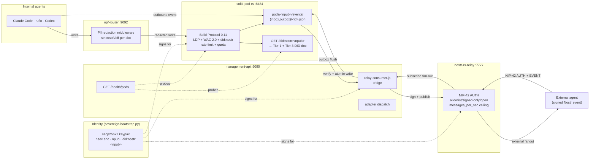

# The sovereign data stack — end to end

This is the operator walkthrough of the full sovereign data stack. One
container, one identity, four loopback ports, no third-party broker.
Every command below is verifiable on a running agentbox with the stack
enabled.

If you are new to the terms, read [glossary.md](glossary.md) first. The
canonical specs sit at
[ADR-008](../reference/adr/ADR-008-privacy-filter-routing.md) (privacy
filter), [ADR-009](../reference/adr/ADR-009-embedded-nostr-relay.md)
(Nostr relay + pod-inbox bridge),
[ADR-010](../reference/adr/ADR-010-rust-solid-pod-adoption.md)
(solid-pod-rs first-class adoption), and
[DDD-003](../reference/ddd/DDD-003-sovereign-messaging-domain.md)
(invariants I01-I12).

## What the stack is

Four locally-run services. One secp256k1 keypair. One DID.



## Enabling the whole stack

A single manifest run turns the stack on. Defaults are sensible; opt-in
ports are loopback-only unless you explicitly expose.

```toml
[adapters]
pods         = "local-solid-rs"

[sovereign_mesh]
enabled      = true
solid_pod    = true
nostr_bridge = true

[sovereign_mesh.relay]
enabled         = true
implementation  = "nostr-rs-relay"
ingress_policy  = "allowlist"
pod_bridge      = true

[privacy_filter]
enabled = true
mode    = "local-cpu"            # or "local-gpu" if you have one

[integrations.solid_pod_rs]
enable_did_nostr       = true
enable_webhook_signing = true
enable_rate_limit      = true
enable_quota           = true

[security.exceptions.solid-pod-rs]
writable_volumes = ["solid-data:/var/lib/solid"]
reason = "solid-pod-rs fs-backend requires atomic-rename writable storage"

[security.exceptions.nostr-relay]
writable_volumes = ["nostr-relay-data:/var/lib/nostr-relay"]
reason = "nostr-rs-relay SQLite journal and WAL require a writable durable path"
```

Validate + rebuild:

```sh
./scripts/agentbox-config-validate.sh
./agentbox.sh rebuild
```

## Verifying each layer

### 1. Identity

`sovereign-bootstrap.py` runs once on first boot. It generates the
keypair, writes the pod ACL against `did:nostr:<npub>`, and materialises
the DID document that solid-pod-rs's resolver will serve.

```sh
# What identity does this container hold?
docker exec agentbox bash -lc 'source /run/agentbox/identity.env && env | grep AGENTBOX_'
# AGENTBOX_NPUB=npub1...
# AGENTBOX_DID=did:nostr:npub1...
# AGENTBOX_PUBKEY_HEX=...

# The DID document on disk:
docker exec agentbox cat /var/lib/solid/pods/$AGENTBOX_NPUB/did-nostr.json | jq

# The ACL is written against the DID, not the raw npub:
docker exec agentbox cat /var/lib/solid/pods/$AGENTBOX_NPUB/.acl.json | jq .rules
```

### 2. Pod (solid-pod-rs)

```sh
# Solid service info
curl -s -H 'Accept: application/nostr+json' http://localhost:8484/ | jq

# DID resolver — Sprint 6 absorption
NPUB=$(docker exec agentbox bash -c 'echo $AGENTBOX_NPUB')
curl -s http://localhost:8484/did:nostr:$NPUB | jq '.verificationMethod'

# Pod health via management-api
curl -s http://localhost:9090/health/pods | jq
# {
#   "status":              "ready",
#   "impl":                "local-solid-rs",
#   "base_url":            "http://127.0.0.1:8484",
#   "solid_pod_rs_health": "ok",
#   "did_nostr_resolves":  "ok",
#   "writable_storage":    "ok"
# }
```

### 3. Relay

```sh
# NIP-11 info doc
curl -s -H 'Accept: application/nostr+json' http://localhost:7777/ | jq

# From outside the container (only if expose=true), publish a signed event
# addressed to the internal npub. See docs/user/nostr-relay.md for the NIP-42
# handshake details.
```

### 4. Relay ↔ pod bridge

The bridge is in-process (`mcp/nostr-bridge/relay-consumer.js`). You see
its outcomes on the pod mailbox:

```sh
# Watch the inbox — anything that lands here has a verified Schnorr
# signature, passes ingress policy, and has a `p` tag matching your npub.
docker exec agentbox ls -la /var/lib/solid/pods/$AGENTBOX_NPUB/events/inbox/

# Check bridge metrics (Prometheus scrape)
curl -s http://localhost:9091/metrics | grep '^agentbox_relay_'
```

### 5. Privacy filter

```sh
# Redact a sample string
curl -s -X POST http://localhost:9092/redact \
  -H 'content-type: application/json' \
  -d '{"text":"Alice paid on 2026-01-02","slot":"memory"}' | jq
```

## End-to-end: an external agent messages an internal agent

The short form:

1. External party generates a Nostr event with `kind=1059` (NIP-17 sealed DM)
   or `kind=38000` (agent-intent), `p` tag = your container's npub hex, and
   a body the agents can act on.
2. External party signs with their nsec.
3. External party connects to `ws://<your-host>:7777` (relay must be
   `expose=true`), completes NIP-42 AUTH, publishes the EVENT.
4. `nostr-rs-relay` stores in its SQLite (transport).
5. `relay-consumer.js` sees the EVENT on its subscription, verifies the
   signature (I01), checks ingress policy (I07), confirms the `p` tag
   targets a local npub (I10), and writes atomically to
   `pods/<npub>/events/inbox/<event-id>.json` (I08).
6. If the kind is in the agent-intent range (38000-38099) and an orchestrator
   adapter is resolved, the bridge spawns an agent to respond.
7. The agent writes a response to `pods/<npub>/events/outbox/<pending-id>.json`.
8. `relay-consumer.js` picks it up on its flush timer, signs it, publishes
   to the relay. If external fanout is enabled, it also publishes to
   `NOSTR_RELAYS`.
9. The external party's subscription on the relay receives the response.

Durability contract: **the pod is the source of truth.** The relay's
SQLite is transport. If the relay is wiped, every received message is
still in the pod. If the container restarts mid-outbox-flush, pending
files are retried on next start (at-least-once, deduped by event id).

## Observability across the stack

One Prometheus surface at `:9091`; spans shipped over OTLP if configured.

```sh
curl -s http://localhost:9091/metrics | grep -E '^(agentbox|opf|solid)_' | head -30
```

Useful meters:

| Meter | Source | Signal |
|-------|--------|--------|
| `agentbox_relay_connections_active{state}` | nostr-rs-relay | open sessions (authed vs pending) |
| `agentbox_relay_events_total{direction,kind,outcome}` | bridge | event flow |
| `agentbox_relay_auth_fail_total{reason}` | relay + bridge | failed NIP-42 / sig / allowlist |
| `agentbox_pod_write_total{direction,outcome}` | bridge | inbox + outbox landings |
| `agentbox_pod_write_fail_total{reason}` | bridge | persist failures |
| `agentbox_adapter_dispatch_total{slot=pods}` | management-api | adapter call volume |
| `opf_redactions_total{slot,entity}` | opf-router | PII hits per slot/class |
| `opf_fail_closed_total{slot}` | opf-router | strict-mode rejections |
| `opf_fail_open_total{slot}` | opf-router | soft-mode bypass count |
| `solid_pod_rs_wac_denied_total{reason}` | solid-pod-rs | WAC denials |
| `solid_pod_rs_storage_bytes` | solid-pod-rs | on-disk pod size |

## Troubleshooting

| Symptom | First things to check |
|---------|-----------------------|
| `/health/pods` reports `solid_pod_rs_health: unreachable` | `supervisorctl status solid-pod`; `tail /var/log/solid-pod.log` |
| `/health/pods` reports `did_nostr_resolves: http_404` | `enable_did_nostr` may be false in `[integrations.solid_pod_rs]`; rebuild |
| External events never land in inbox | relay `ingress_policy=allowlist` and the external pubkey is not in `allowed_pubkeys`; or `p` tag is absent/malformed |
| Outbox entries stuck at `status=pending` | `MANAGEMENT_API_KEY` unset (bridge cannot decrypt `nostr.key.enc`); or all configured relays refusing |
| `opf_fail_closed_total` climbing on `memory` slot | `opf-router` is down or slow; inspect `/var/log/opf-router.log` |
| `solid_pod_rs_wac_denied_total` climbing | ACL policy for the writer npub is missing or wrong; inspect `.acl.json` — remember to reference `did:nostr:<npub>`, not the raw npub |
| Quota 413s | raise `integrations.solid_pod_rs.quota_default_bytes` or clean `pods/<npub>/` |
| Rate-limit 429s on legitimate traffic | raise `rate_limit_per_sec` or move the client to a dedicated allowlist entry with higher ceiling |

See also: [troubleshooting.md](troubleshooting.md) for agentbox-wide
diagnostic recipes.

## The coherence claim

Four services. One secp256k1 key. One DID. No OAuth, no federated IdP,
no third-party broker. `did:nostr:<npub>` is the single subject that
WAC, NIP-98, NIP-42, and the pod profile all reference. The pod is the
durable source of truth; the relay is transport; the privacy filter is
middleware; the management API orchestrates.

If any of these services is off, the stack degrades gracefully:

- Relay off → internal agents work; external messaging does not.
- Pod off → relay still works; inbox persistence degrades; new ACL writes
  unavailable. Existing files readable via direct volume mount.
- Privacy filter off → adapter writes pass through unredacted (strict
  policies throw, soft policies warn).
- Identity missing → sovereign-bootstrap.py reruns on next start and
  generates a fresh keypair (old one stays encrypted at rest).

The stack is opt-in at every layer and first-class everywhere you enable
it. That is what "first-class" means in agentbox.

## Further reading

- [solid-pod.md](solid-pod.md) — the pod operator guide
- [nostr-relay.md](nostr-relay.md) — the relay operator guide
- [privacy-filter.md](privacy-filter.md) — the PII middleware operator guide
- [ADR-008](../reference/adr/ADR-008-privacy-filter-routing.md) · [ADR-009](../reference/adr/ADR-009-embedded-nostr-relay.md) · [ADR-010](../reference/adr/ADR-010-rust-solid-pod-adoption.md) — design records
- [DDD-003](../reference/ddd/DDD-003-sovereign-messaging-domain.md) — invariants I01-I12
- [licensing.md](../developer/licensing.md) — AGPL aggregation analysis
