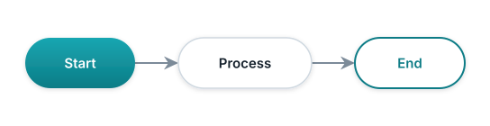
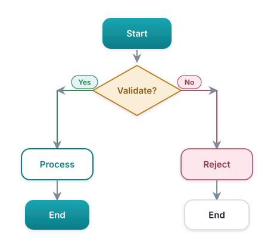
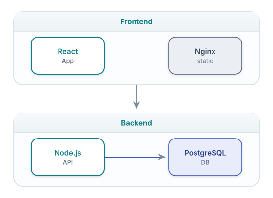
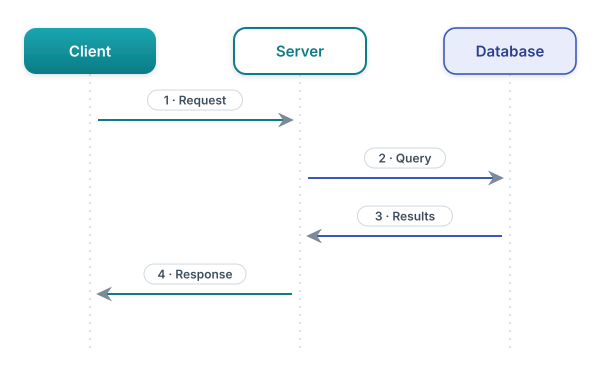
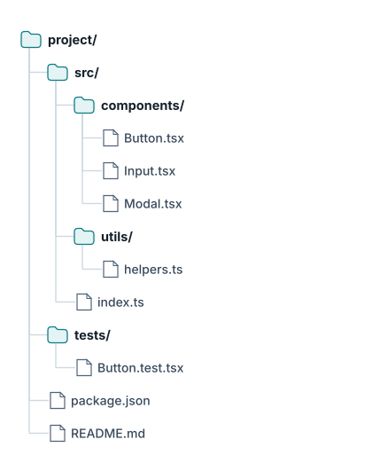

# ASCII to SVG Conversion Skill

Updated: 2026-06-25 | Version 2.2.0
Created: 2026-01-01 18:45:00 EST

A Claude Code skill that converts ASCII art diagrams in markdown files to clean, **designed** SVGs with accessible text fallbacks — and keeps the SVG in sync with the ASCII it was built from. Requires no API keys.

## Features

- **Smart Detection** — Automatically identifies ASCII art in code blocks using pattern matching and context signals
- **Multiple Diagram Types** — Flowcharts, architecture diagrams, sequence diagrams, directory trees
- **Conservative Styling** — Clean, minimal SVGs that work in any documentation
- **Accessibility** — Every SVG includes a compressed `<details>` fallback with the original ASCII
- **Validation** — All SVGs validated with `xmllint` before completion
- **Optional Playwright Verification** — Visual verification loop when requested
- **Change Detection** — A hashed manifest tracks every diagram; `Sync ASCII to SVG` (or the optional hook) flags stale SVGs
- **Optional auto-sync** — Install the bundled hook to be prompted when an SVG goes stale; otherwise run `Sync ASCII to SVG` on demand

## Requirements

**No API keys.** This skill runs entirely locally and contacts no external service.
The only hard dependency is `xmllint` (SVG validation); Playwright is optional for
visual verification. See `REQUIREMENTS.md` for per-OS install commands.

## Quick install

```bash
# Personal (all projects)
cp -r ascii-to-svg ~/.claude/skills/
# Project-scoped (shared via the repo)
cp -r ascii-to-svg .claude/skills/
```
Start a new Claude Code session and run `/skills` to confirm it loaded. For
GitHub / zip / plugin distribution, see `SHARING.md`.

## Installation

Copy the `ascii-to-svg/` folder to your Claude Code skills directory:

```bash
# Global installation (available in all projects)
cp -r ascii-to-svg ~/.claude/skills/

# Or project-local installation
cp -r ascii-to-svg .claude/skills/
```

## Automatic Usage (Recommended)

To make Claude **automatically** create SVGs whenever it generates diagrams, add this to your project's `CLAUDE.md`:

```markdown
## Diagram Creation (MANDATORY)

When creating any diagram or visual representation in markdown files:

1. NEVER leave ASCII art as-is in the final output
2. ALWAYS use the ascii-to-svg skill to create a proper SVG
3. ALWAYS include the compressed ASCII fallback in a <details> block immediately after the SVG
4. Save SVGs to `assets/diagrams/`
5. Follow the exact output format specified in the skill

This applies to: README.md, docs/*.md, and any other markdown files.

Reference: ~/.claude/skills/ascii-to-svg/SKILL.md
```

With this rule in place, Claude will proactively create SVGs as part of any task that involves diagrams — no manual trigger needed.

## Manual Usage

You can also invoke the skill on-demand for existing files:

### Basic Commands

| Command | What It Does |
|---------|--------------|
| `Convert ASCII art in README.md` | Single file |
| `Convert all ASCII diagrams in docs/` | Directory |
| `Convert all ASCII art in this project` | Entire repo |
| `Convert ASCII art in files changed since main` | Git-aware |
| `Show me what ASCII art you'd convert` | Dry-run preview |

### Change Tracking Commands (NEW in v2.0)

| Command | What It Does |
|---------|--------------|
| `Sync ASCII to SVG` | Check all tracked diagrams, regenerate stale ones |
| `Check for stale SVGs` | Report only, no changes |
| `Show ASCII to SVG status` | Display tracking manifest summary |
| `Initialize ASCII tracking` | Create manifest from existing diagrams |
| `Regenerate all SVGs` | Force regenerate everything |

### With Options

```
"Convert ASCII art in README.md using blueprint style"
"Convert diagrams in docs/ and verify with Playwright"
```

### Skip or Force Conversion

Add markers before code blocks:

```markdown
<!-- skip-ascii-to-svg -->
```

```markdown
<!-- convert-to-svg: flowchart -->
```

---

## Example Outputs

### Flowchart



<details>
<summary>ASCII Version (for AI/accessibility)</summary>

```
+--------+     +----------+     +---------+
| Start  | --> | Process  | --> |   End   |
+--------+     +----------+     +---------+
```

</details>

### Decision Flowchart



<details>
<summary>ASCII Version (for AI/accessibility)</summary>

```
              +-------+
              | Start |
              +-------+
                  |
                  v
            +-----------+
            | Validate? |
            +-----------+
             /         \
           Yes          No
           /             \
          v               v
    +---------+     +---------+
    | Process |     | Reject  |
    +---------+     +---------+
          |               |
          v               v
      +-------+       +-------+
      |  End  |       |  End  |
      +-------+       +-------+
```

</details>

### Architecture Diagram



<details>
<summary>ASCII Version (for AI/accessibility)</summary>

```
┌─────────────────────────────────────────────┐
│                 Frontend                     │
│  ┌─────────────┐         ┌───────────────┐  │
│  │    React    │         │    Nginx      │  │
│  │     App     │         │   (static)    │  │
│  └─────────────┘         └───────────────┘  │
└─────────────────────────────────────────────┘
                     │
                     ▼
┌─────────────────────────────────────────────┐
│                  Backend                     │
│  ┌─────────────┐         ┌───────────────┐  │
│  │   Node.js   │────────▶│  PostgreSQL   │  │
│  │     API     │         │      DB       │  │
│  └─────────────┘         └───────────────┘  │
└─────────────────────────────────────────────┘
```

</details>

### Sequence Diagram



<details>
<summary>ASCII Version (for AI/accessibility)</summary>

```
Client          Server          Database
  │                │                │
  │  1. Request    │                │
  │───────────────>│                │
  │                │  2. Query      │
  │                │───────────────>│
  │                │                │
  │                │  3. Results    │
  │                │<───────────────│
  │  4. Response   │                │
  │<───────────────│                │
  │                │                │
```

</details>

### Directory Tree



<details>
<summary>ASCII Version (for AI/accessibility)</summary>

```
project/
├── src/
│   ├── components/
│   │   ├── Button.tsx
│   │   ├── Input.tsx
│   │   └── Modal.tsx
│   ├── utils/
│   │   └── helpers.ts
│   └── index.ts
├── tests/
│   └── Button.test.tsx
├── package.json
└── README.md
```

</details>

---

## How It Works

### 1. Detection

The skill scans markdown code blocks for ASCII art patterns:

- **Strong signals (+25 pts)**: Box-drawing characters (`┌┐└┘│─`), unicode arrows (`→←↑↓`)
- **Medium signals (+15 pts)**: ASCII boxes (`+-+`), arrow patterns (`-->`), tree chars (`├──`)
- **Negative signals (-20 pts)**: Table patterns, code keywords, CLI output

Confidence thresholds:
- **≥75%**: Auto-convert
- **40-74%**: Ask for confirmation  
- **<40%**: Skip

### 2. Conversion

Each diagram is converted to SVG following strict rules:

- Root element has `xmlns`, `viewBox`, `width`, `height`
- All text content is entity-escaped (`&` → `&amp;`)
- Minimal styling (no gradients, shadows, or effects)
- System fonts for cross-platform compatibility

### 3. Output Format

Every converted diagram follows this exact pattern:

```markdown


<details>
<summary>ASCII Version (for AI/accessibility)</summary>

\`\`\`
[original ASCII preserved here]
\`\`\`

</details>
```

### 4. Validation

All SVGs are validated with `xmllint --noout` before completion.

### 5. Optional: Playwright Verification

If requested, the skill can use Playwright to visually verify SVG rendering:

```
"Convert ASCII art and verify with Playwright"
```

This captures screenshots and iterates on fixes if needed (max 3 attempts per SVG).

---

## Automatic vs. Manual: When to Use Each

| Scenario | Approach |
|----------|----------|
| Claude is creating new documentation | Automatic (CLAUDE.md rule) |
| Converting existing ASCII art in old files | Manual invocation |
| Batch converting an entire repo | Manual invocation |
| You wrote ASCII art by hand | Manual invocation |
| Checking if SVGs are up-to-date | `Sync ASCII to SVG` |
| After editing ASCII in `<details>` block | `Sync ASCII to SVG` |

The CLAUDE.md rule makes Claude proactive — it creates SVGs as part of the task rather than as a post-processing step. Manual invocation is for everything else.

---

## Change Tracking

### The Problem

When you update an ASCII diagram in a `<details>` block, the corresponding SVG becomes stale. Without tracking, you have to manually remember which SVGs need regeneration.

### The Solution

A global PostToolUse hook (`~/.claude/hooks/ascii-svg-auto-sync.sh`) automatically:
- Detects when you edit any markdown file
- Checks if tracked ASCII diagrams changed
- Outputs regeneration instructions if stale

### How It Works

```
1. You edit ASCII art in a <details> block
2. The PostToolUse hook fires automatically
3. Hook compares current ASCII hash to stored hash
4. If different → outputs "STALE DIAGRAMS DETECTED"
5. Claude sees the message and regenerates the SVG
```

With the hook installed this is automatic; otherwise run `Sync ASCII to SVG`. The hook is optional and ships in `hooks/` (see SHARING.md and REQUIREMENTS.md).

### Manifest File

Created at project root: `.ascii-to-svg-manifest.json`

```json
{
  "version": "1.0.0",
  "lastSync": "2026-01-08T09:50:00Z",
  "diagrams": [
    {
      "id": "architecture",
      "sourceFile": "docs/README.md",
      "sourceLine": 45,
      "svgFile": "docs/assets/diagrams/architecture.svg",
      "asciiHash": "sha256:a1b2c3...",
      "lastConverted": "2026-01-08T09:30:00Z"
    }
  ]
}
```

### Sync Report Example

```markdown
## ASCII to SVG Sync Report

### Up to Date (5)
✓ medreview-platform.svg
✓ analysis-pipeline.svg
✓ production-deployment.svg
✓ mobile-first-pwa.svg
✓ security-architecture.svg

### Stale → Regenerated (2)
↻ hero-banner.svg (ASCII changed)
↻ architecture-summary.svg (ASCII changed)

### Untracked (1)
⚠ docs/NEW-DOC.md line 45 - Run conversion to track
```

### Best Practices

1. **Commit the manifest** — It tracks diagram history
2. **Run sync before releases** — Ensure all SVGs are current
3. **Edit ASCII, not SVG** — The `<details>` block is your source of truth
4. **Use git diff** — ASCII changes are visible in diffs

---

## Styles

| Style | Description |
|-------|-------------|
| `minimal` (default) | Clean, flat, no effects |
| `blueprint` | Technical drawing look, dark blue background |
| `dark-mode-aware` | Adapts to system `prefers-color-scheme` |

---

## Skill Contents

```
ascii-to-svg/
├── SKILL.md                    # Main entry point
├── detection.md                # ASCII art detection heuristics
├── conversion-rules.md         # SVG generation specifications
├── change-tracking.md          # Change detection & sync (NEW)
├── playwright-verification.md  # Optional visual verification
├── README.md                   # This file
└── examples/
    ├── flowchart.md            # Flowchart guide
    ├── flowchart-simple.svg
    ├── flowchart-decision.svg
    ├── architecture-box.md     # Architecture guide
    ├── architecture-two-layer.svg
    ├── sequence-diagram.md     # Sequence guide
    ├── sequence-client-server.svg
    ├── tree-structure.md       # Tree guide
    └── tree-project.svg
```

---

## Dependencies

**Required:**
- Claude Code
- `xmllint` (for SVG validation)

**Optional:**
- Playwright (for visual verification)

---

## License

MIT
