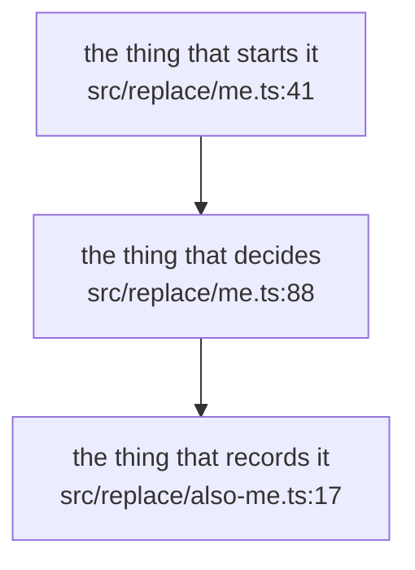
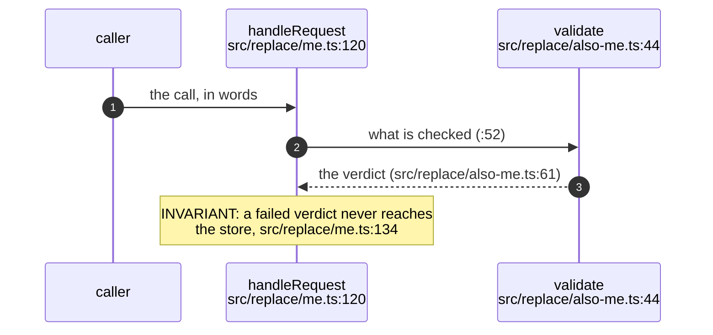

## For developers

Why this topic exists, and what the reader should be able to do once they have
read it. How the pieces relate to each other and to the rest of the system. Any
length. Cite the records and commits that own each decision.

Keep this section honest about what you did not read. A sentence naming the part
of the subsystem this topic does not cover is worth more than silence.

## For the business

The same ground in the product's own vocabulary. What this means for a named
user, for the live site, for cost, for risk. Any length. No code names unless
they are the product's own names — no file paths, no class names, no `snake_case`.

This section is not a summary of the one above; it is the same subject addressed
to somebody who will never open the code.

## XX-01.1 First diagram: what it is called in the reader's words

**What it shows.** One to three sentences. The mechanism, not the picture.

**Why it is this way.** The decision, who took it, when, and the record that owns
it (`ADR-000`). If nobody decided it, say that — and consider an `**Open:**`.

**Invariant:** the property this design depends on, with the line that enforces
it (`src/replace/me.ts:92`).

## XX-01.2 Second diagram: a request's life, if the topic has one

**What it shows.** One to three sentences.

**Why it is this way.** The decision and its record.

**Debt:** something the code carries that its own authors flagged
(`src/replace/me.ts:140`).

**Drift:** the doc says X (`docs/explanation/replace-me.md:22`), the code does Y
(`src/replace/me.ts:145`).

**Open:** the question the record leaves — phrased as a question, with the line
that raises it (`src/replace/also-me.ts:70`).

<!--
Checklist before you commit this topic:
  * every participant bound to a file, so bare :NNN references resolve
  * every cited file listed in sources:  (unlisted = never checked)
  * every line number derived from the symbol, never from an offset
  * ports written as "port 8788", never ":8788"
  * no ";" or HTML entities in sequence messages or Notes
  * ids sequential: XX-01.1, XX-01.2, ...
  * node scripts/diagram-index-gen.cjs docs/diagrams --check --cite-check --only XX-01
  * node scripts/diagram-index-gen.cjs docs/diagrams --check --render --only XX-01
Then delete this comment.
-->
