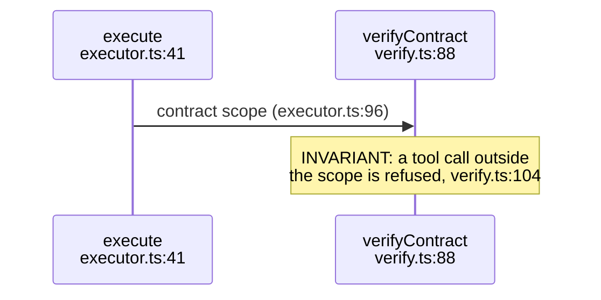
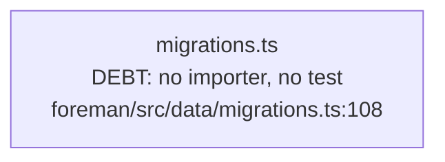

# Register markers

The register is the part of a corpus that pays for itself. Diagrams show how a
system works; the register records everything the author had to notice to draw
them — where two records contradict each other, where the code carries something
its own authors flagged, where the documentation has fallen behind, what nobody
decided, and what the design silently depends on.

Markers are written **in place**, in the prose under the diagram that revealed
them or inside the diagram itself, and collected into `REGISTER.md` by the
generator with a backlink to the exact diagram. Nobody maintains a list.

## The five kinds

### `**Tension:**`
Two records disagree, or a record and the code disagree. Both sides get a
citation. A tension is not a bug — it is a decision nobody has taken twice.

> **Tension (ADR-025 vs code):** ADR-025 says the dial defaults to `assisted`
> (`docs/reference/adr/ADR-025-the-dial.md:34`), the registry defaults it to
> `supervised` (`control-plane/src/projects/registry.ts:118`).

### `**Debt:**`
Something the code carries that its own authors flagged, or that any reader
would. Not a wish list: debt is a cost already being paid.

> **Debt:** `foreman/src/data/migrations.ts:108` ships the schema gate's whole
> client with no importer anywhere in `foreman/src/` and no test file.

### `**Drift:**`
The document says X, the code does Y, and neither is obviously the intent. Drift
differs from tension in that one side is plainly stale rather than contested.

> **Drift:** `docs/reference/http-api.md:210` documents `POST /world/refresh`;
> the route was removed at `control-plane/src/routes/world.ts:44`.

### `**Open:**`
A question the record leaves unanswered, phrased as a question. If you can answer
it from the code, answer it in the narrative instead — an Open that has an answer
is noise.

> **Open:** nothing states who may rotate a project's PAT once the vault holds
> one; the route checks only `role=operator` (`control-plane/src/vault/routes.ts:77`).

### `**Invariant:**`
A property the design depends on, with the line that enforces it. Invariants are
the most numerous kind in a mature corpus and the most useful: they are the
sentences a future change has to not break.

> **Invariant:** the audit chain never accepts an entry whose `prev` does not
> match the stored head (`control-plane/src/audit/chain.ts:96`).

## Wording rules

- One sentence where possible, two at most. The register is a table.
- **Every marker carries at least one `path:line`** in the same topic's
  `sources:`. A marker with no citation is an opinion.
- Optional scope in parentheses, shown in the register:
  `**Tension (ADR-025 vs code):**`, `**Drift (http-api.md vs routes):**`.
- Present tense, no recommendation. "The dial defaults to X here and Y there",
  never "we should align the dial".
- A marker paragraph may wrap over several lines; it ends at a blank line, a
  heading, a fence, a list item, a table row, or the next labelled paragraph.
- A blockquoted marker (`> **Debt:** ...`) is collected the same way.

## Markers inside diagrams

The same five kinds work inside a mermaid block, uppercased, in a note or a node
label. Use these when the finding belongs to one edge or one state rather than to
the topic's prose.

` ` breaks are part of the marker text and are flattened to spaces in the
register, so wrap freely for legibility. A marker inside a multi-line
`note left of X ... end note` block is joined before collection. The text runs to
the end of the label — a quote or a closing bracket terminates it.

## What the generator produces

`REGISTER.md` carries a count line (`Tension: 12 · Debt: 197 · Drift: 49 · Open:
85 · Invariant: 595`) and one table per kind, each row numbered `T-01`, `D-01`,
`I-01` and linked to the diagram anchor it came from. `--report` carries the same
counts per topic and in the totals, which is how a consumer sizes the honest
limitations of a system without reading the corpus.

`DECISIONS-TIMELINE.md` is the sibling view and is **hand-written**: the same
material in time order, showing decisions and their reversals. The generator does
not produce it, because chronology is a judgement.

## The ringfence

The register is internal audit material. It names findings, sometimes people, and
often history that has no place in anything a client reads. Nothing from it
enters a deliverable in its own voice — no marker numbering, no "the register
says", no fix history. A limitation learnt from a register entry is restated in
ordinary product terms, grounded in the same source the marker cites. That
translation is `explainer`'s job, under its own gates.
