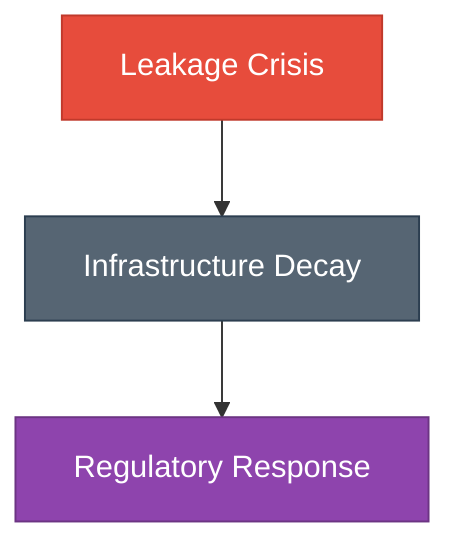
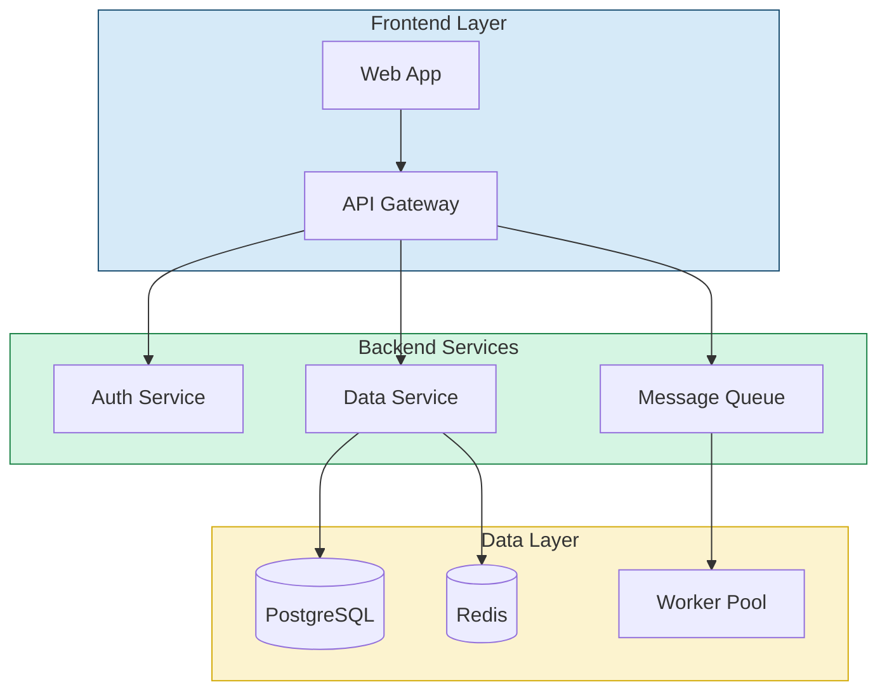
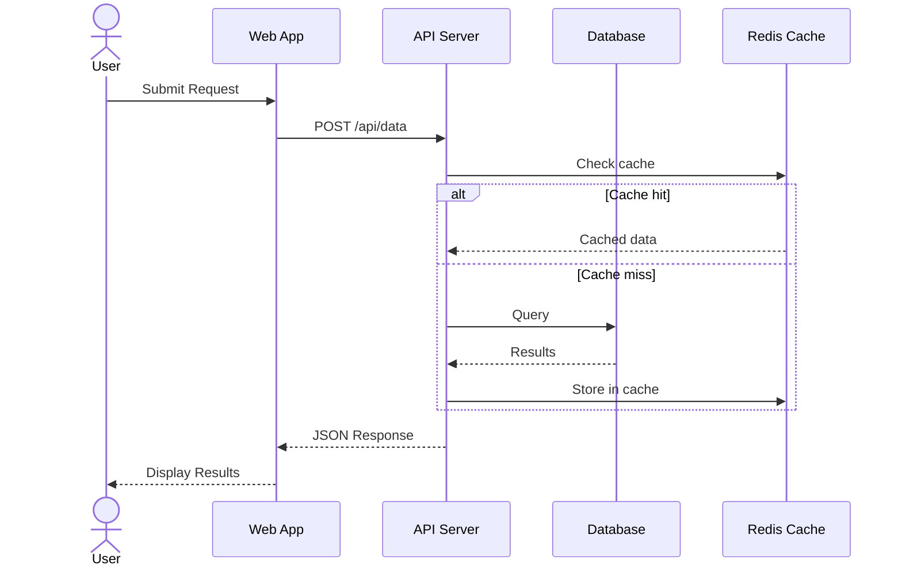
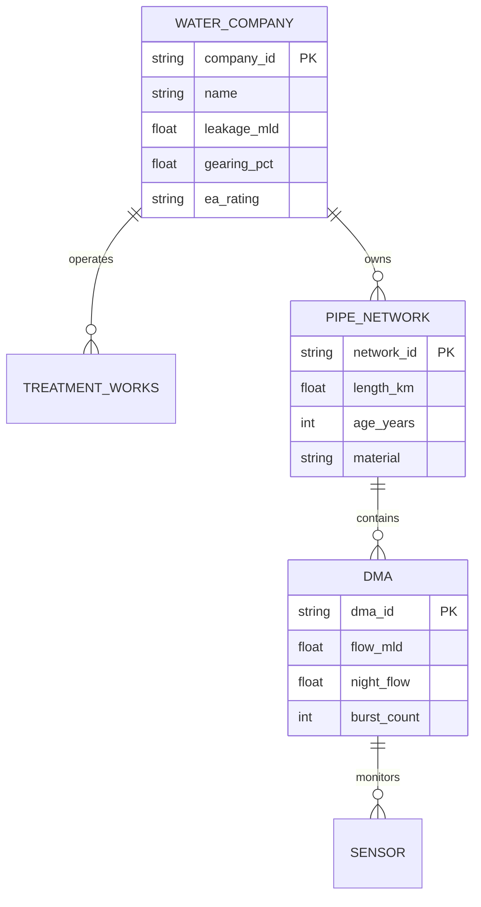
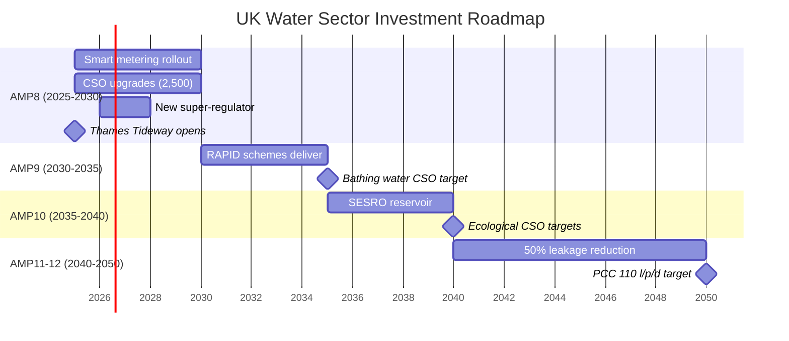
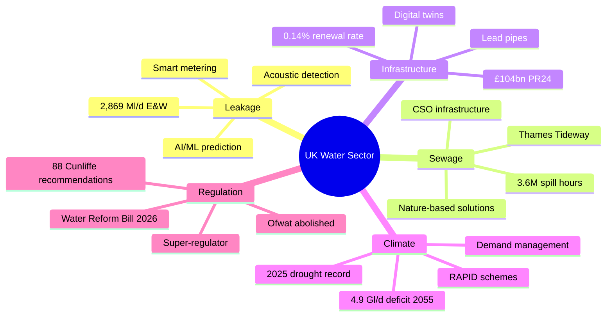
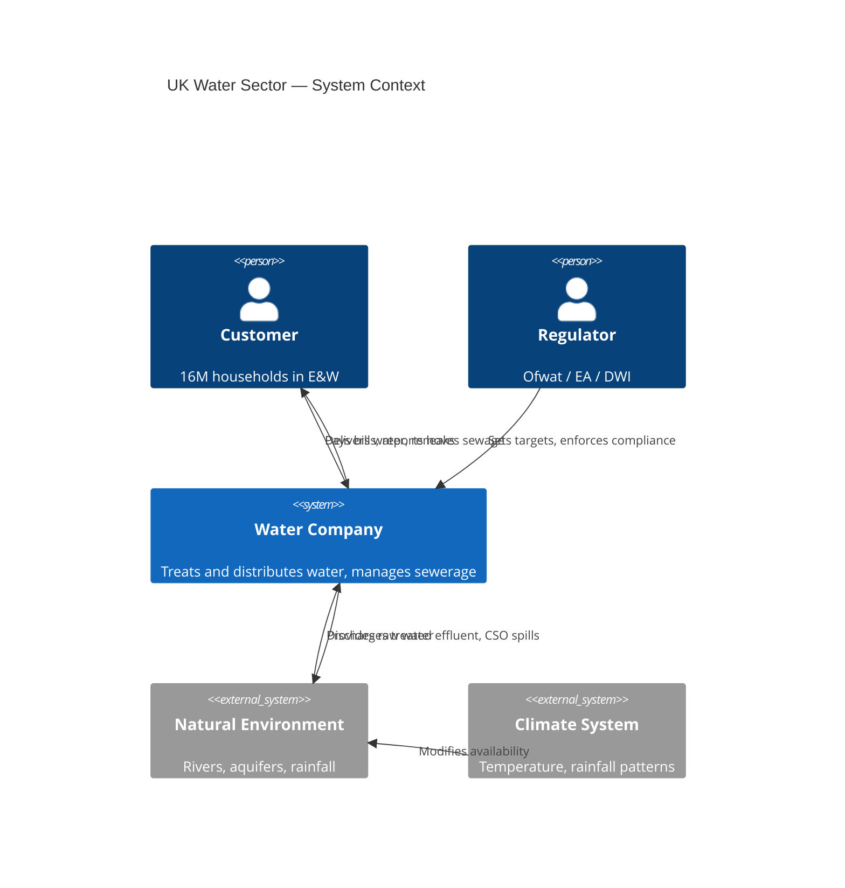

# Mermaid Diagrams — Professional Diagrams as Code

Create, render, and export production-quality diagrams from text using the Mermaid diagramming language. Supports 25 diagram types with dark/light themes, custom styling, and multiple export formats.

## When to Use This Skill

- Creating system architecture or infrastructure diagrams
- Drawing sequence diagrams for API interactions
- Building entity-relationship models for databases
- Designing flowcharts for business processes or decision trees
- Planning project timelines with Gantt charts
- Documenting user journeys or state machines
- Creating class diagrams for software design
- Building mindmaps for brainstorming or knowledge mapping
- Any visual diagram that should be version-controlled as code

## When Not To Use

- For Wardley maps -- use TikZ via the latex-documents or report-builder skills (Mermaid does not support Wardley map syntax)
- For publication-quality mathematical figures -- use TikZ/PGFPlots directly
- For interactive or animated diagrams -- Mermaid produces static output only
- For photo editing or raster image manipulation -- use the imagemagick skill
- For 3D scene visualisation -- use the blender skill instead

## Prerequisites

```bash
# Check if mmdc is available
mmdc --version

# If not installed:
npm install -g @mermaid-js/mermaid-cli
```

Required: `mmdc` (Mermaid CLI) -- installed globally via npm.
Optional: Chromium/Puppeteer (bundled with mmdc for headless rendering).

---

## Quick Start

### Render a diagram

```bash
# Create a .mmd file
cat > diagram.mmd << 'EOF'
flowchart TD
    A[User Request] --> B{Auth Check}
    B -->|Authenticated| C[Process Request]
    B -->|Failed| D[Return 401]
    C --> E[Return Response]
EOF

# Render to PNG (default)
mmdc -i diagram.mmd -o diagram.png

# Render to SVG (scalable)
mmdc -i diagram.mmd -o diagram.svg

# Render to PDF (for LaTeX inclusion)
mmdc -i diagram.mmd -o diagram.pdf

# High-resolution with custom dimensions
mmdc -i diagram.mmd -o diagram.png -w 2000 -H 1200 -b transparent
```

### Inline rendering (no file needed)

```bash
echo 'flowchart LR; A-->B-->C' | mmdc -i - -o quick.png
```

---

## Supported Diagram Types (25)

### Core Diagrams

| Type | Keyword | Best For |
|------|---------|----------|
| **Flowchart** | `flowchart TD/LR` | Process flows, decision trees, system architecture |
| **Sequence** | `sequenceDiagram` | API calls, message passing, protocol flows |
| **Class** | `classDiagram` | Object-oriented design, data models |
| **State** | `stateDiagram-v2` | State machines, lifecycle management |
| **ER** | `erDiagram` | Database schema, data relationships |

### Planning & Management

| Type | Keyword | Best For |
|------|---------|----------|
| **Gantt** | `gantt` | Project timelines, sprint planning |
| **Journey** | `journey` | User experience mapping, customer journeys |
| **Timeline** | `timeline` | Historical events, roadmaps, milestones |
| **Kanban** | `kanban` | Task boards, workflow status |
| **Requirement** | `requirementDiagram` | Requirements traceability |

### Architecture & Systems

| Type | Keyword | Best For |
|------|---------|----------|
| **Architecture** | `architecture-beta` | Infrastructure layouts, cloud architecture |
| **C4 Context** | `C4Context` | System context, container, component views |
| **Block** | `block-beta` | Block diagrams, system decomposition |
| **Mindmap** | `mindmap` | Brainstorming, knowledge maps, topic hierarchies |

### Data & Metrics

| Type | Keyword | Best For |
|------|---------|----------|
| **Pie** | `pie` | Proportional data, budget allocation |
| **XY Chart** | `xychart-beta` | Line/bar charts from data |
| **Sankey** | `sankey-beta` | Flow quantities, resource distribution |
| **Quadrant** | `quadrantChart` | Priority matrices, competitive analysis |
| **Radar** | `radar-beta` | Multi-dimensional comparison |

### Development

| Type | Keyword | Best For |
|------|---------|----------|
| **GitGraph** | `gitGraph` | Branch strategies, release flows |
| **Packet** | `packet-beta` | Network packet structure |
| **ZenUML** | `zenuml` | UML sequence (alternative syntax) |

---

## Professional Styling

### Dark Theme (report-builder compatible)

```bash
# Create dark theme config
cat > mermaid-dark.json << 'EOF'
{
  "theme": "dark",
  "themeVariables": {
    "primaryColor": "#2471A3",
    "primaryTextColor": "#FFFFFF",
    "primaryBorderColor": "#5DADE2",
    "lineColor": "#ABB2B9",
    "secondaryColor": "#1B4F72",
    "tertiaryColor": "#0B2545",
    "background": "#0B2545",
    "mainBkg": "#13315C",
    "nodeBorder": "#5DADE2",
    "clusterBkg": "#1B4F72",
    "clusterBorder": "#2471A3",
    "titleColor": "#FFFFFF",
    "edgeLabelBackground": "#13315C",
    "fontSize": "14px"
  }
}
EOF

# Render with dark theme
mmdc -i diagram.mmd -o diagram.png -t dark -C mermaid-dark.json -w 2000 -H 1200 -b '#0B2545'
```

### Light Theme (academic papers)

```bash
cat > mermaid-light.json << 'EOF'
{
  "theme": "default",
  "themeVariables": {
    "primaryColor": "#D6EAF8",
    "primaryTextColor": "#0B2545",
    "primaryBorderColor": "#1B4F72",
    "lineColor": "#566573",
    "secondaryColor": "#FADBD8",
    "tertiaryColor": "#D5F5E3",
    "fontSize": "13px",
    "fontFamily": "serif"
  }
}
EOF

mmdc -i diagram.mmd -o diagram.png -t default -C mermaid-light.json -w 1600 -H 1000
```

### Per-node styling (inline)



---

## Templates by Use Case

### System Architecture



### API Sequence



### Database ER Diagram



### Project Gantt



### Wardley-style Mindmap



### C4 Context Diagram



---

## Rendering Options

### Command-line reference

```bash
mmdc -i <input.mmd> -o <output.png|svg|pdf>
    -w <width>            # Output width in pixels (default: 800)
    -H <height>           # Output height in pixels
    -t <theme>             # dark | default | forest | neutral | base
    -C <config.json>       # Custom theme configuration
    -b <background>        # Background colour (hex or 'transparent')
    -s <scale>             # CSS scale factor
    -f                     # Force overwrite
    -q                     # Quiet mode
```

### Batch rendering

```bash
# Render all .mmd files in a directory
for f in diagrams/*.mmd; do
    mmdc -i "$f" -o "${f%.mmd}.png" -w 2000 -t dark -b '#0B2545'
done
```

### For LaTeX inclusion

```bash
# Render as PDF for vector quality in LaTeX
mmdc -i diagram.mmd -o diagram.pdf -w 2000

# Or render as high-DPI PNG
mmdc -i diagram.mmd -o diagram.png -w 3000 -H 2000 -s 2
```

Then in LaTeX:
```latex
\begin{figure}[htbp]
  \centering
  \includegraphics[width=\textwidth]{diagrams/diagram.pdf}
  \caption{System architecture diagram.}
  \label{fig:system-arch}
\end{figure}
```

---

## Integration with Report Builder

This skill is called by the **report-builder** skill during Phase 4 (VISUALISE):

1. Mermaid `.mmd` files are created during chapter writing
2. Rendered to PNG via `mmdc` with dark or light theme
3. Optionally sent to Nano Banana for infographic upgrade (3 iterations)
4. Best version (original or infographic) selected for inclusion
5. Wired into LaTeX via `\includegraphics`

```bash
# Report builder integration
~/.claude/skills/report-builder/scripts/asset_audit.sh  # Verifies all diagrams referenced
```

---

## Troubleshooting

### mmdc not found
```bash
npm install -g @mermaid-js/mermaid-cli
```

### Rendering fails with Puppeteer error
```bash
# mmdc needs chromium for headless rendering
# On headless servers, ensure DISPLAY is set or use --puppeteerConfigFile
cat > puppeteer.json << 'EOF'
{"args": ["--no-sandbox", "--disable-setuid-sandbox"]}
EOF
mmdc -i diagram.mmd -o out.png -p puppeteer.json
```

### Text truncated in nodes
Wrap long labels in quotes: `A["Long label that needs wrapping"]`

### Special characters break syntax
Escape with quotes: `A["Node with {braces} and [brackets]"]`

### Diagram too complex
Split into subgraphs or multiple diagrams. Keep under 40 nodes per diagram.

---

## Best Practices

1. **Use meaningful IDs**: `userAuth` not `A`, `paymentGateway` not `B`
2. **Keep it simple**: Under 30-40 nodes per diagram; split complex ones
3. **Consistent direction**: `TD` for hierarchies, `LR` for processes, `BT` for bottom-up
4. **Colour with purpose**: Use `classDef` for semantic meaning (red=error, green=success)
5. **Version control**: `.mmd` files are plain text — diff-friendly in git
6. **Theme consistency**: Use the same config across all diagrams in a project
7. **Label edges**: Always label arrows to show relationships: `A -->|"sends data"| B`
8. **Subgraphs for grouping**: Use subgraphs to create logical sections
